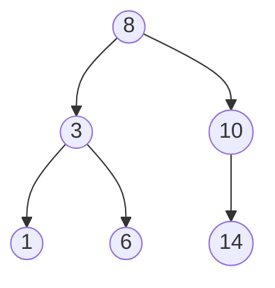
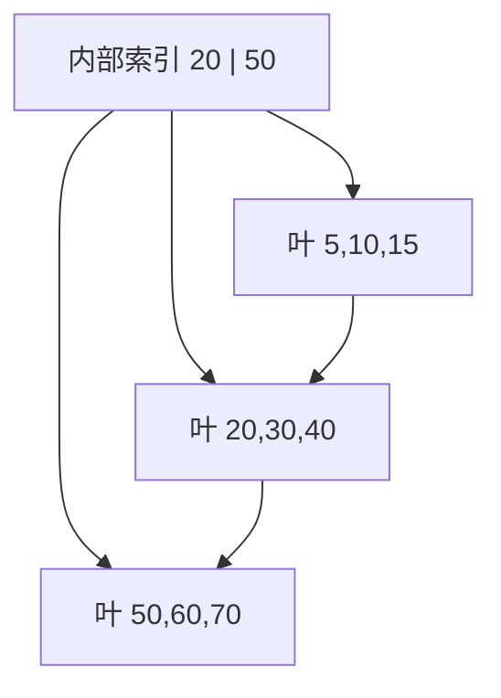

# 查找结构：二分、平衡树与哈希表

**查找（search）**是在一组记录中，根据键找到对应记录或确认它不存在。不同结构的差别来自两个问题：数据是否保持有序，以及更新时愿意维护多少额外结构。

## 1. 先定义查找表

一条记录可以包含多个字段，其中用于查找的字段叫**关键字/键（key）**。若每个键只对应一条记录，称为主键；允许重复时，查找结果可能是一组记录。

查找表常见操作：

- `find(key)`：查询；
- `insert(record)`：插入；
- `erase(key)`：删除；
- `lower_bound(key)`：找第一个不小于 key 的位置；
- 范围查询：找 `[lo, hi]` 内全部记录。

只看一次 `find` 的速度不够。静态数据可以花较多时间预处理；频繁更新的数据还要比较插入、删除、空间与并发成本。

## 2. 顺序查找

**顺序查找**从头依次比较，直到命中或扫描结束：

```text
for i = 0 .. n-1:
    if a[i].key == key: return i
return NOT_FOUND
```

它不要求数据有序，数组和链表都能用。最坏比较 n 次，时间 O(n)，额外空间 O(1)。

若每个位置被查找概率相同，成功查找平均比较次数为：

```text
(1 + 2 + ... + n) / n = (n + 1) / 2
```

失败要比较 n 次。数据很小、只查一次或无法建立索引时，简单线性扫描可能比维护复杂结构更合理。

## 3. 有序数组与二分查找

**二分查找（binary search）**利用单调性：查看中间元素后，可以排除一半范围。它要求能够 O(1) 访问中间位置，因此适合有序数组，不适合普通链表。

最稳的写法维护半开区间 `[left, right)`，寻找第一个 `a[i] >= target` 的位置：

```cpp,ignore
#include <cstddef>
#include <vector>

std::size_t lower_bound_index(const std::vector<int>& a, int target) {
    std::size_t left = 0;
    std::size_t right = a.size();
    while (left < right) {
        std::size_t mid = left + (right - left) / 2;
        if (a[mid] < target) {
            left = mid + 1;
        } else {
            right = mid;
        }
    }
    return left;
}
```

循环不变量是：答案始终在 `[left, right]` 的候选边界中；`left` 之前都 `< target`，`right` 之后不需要再考虑。结束时 `left==right`，就是第一个可插入位置。若要判断精确命中，再检查 `left < n && a[left] == target`。

每次范围至少减半，最多约 `⌊log₂ n⌋+1` 次比较。100 万个元素的 `log₂ n` 约 20。

有序数组查找快，但中间插入删除要移动 O(n) 元素。它适合读多写少、可批量排序的数据。

## 4. 分块查找

**分块查找/索引顺序查找**把记录分成若干块：块间有序，块内可无序；额外索引保存每块的最大键和起始位置。

查找分两步：

1. 在块索引中找到目标可能所属的块；
2. 在块内顺序查找。

若 n 个元素分成 b 块，每块约 s 个，且对索引顺序查找，平均成本约 O(b+s)；取 `b≈s≈√n` 可得到 O(√n)。若索引用二分，则约 O(log b+s)。

它体现两级索引思想，但现代工程中更常使用 B+ 树、LSM 或分层目录等更完整结构。

## 5. 二叉搜索树 BST

**二叉搜索树（Binary Search Tree，BST）**对每个结点满足：

- 左子树所有键小于该结点；
- 右子树所有键大于该结点；
- 若允许重复键，必须另行规定放哪边或在结点保存计数。



中序遍历会得到有序序列。查找时比较 key：小则走左，大则走右。成本是 O(h)，其中 h 为树高。

插入按查找路径走到空位置。删除分三种：

1. 叶子：直接删除；
2. 只有一个孩子：让父结点接到该孩子；
3. 两个孩子：用中序后继（右子树最小）或前驱替换，再删除那个至多一个孩子的结点。

若按 `1,2,3,4,5` 插入，普通 BST 会退化为链，高度 n，查找 O(n)。因此需要平衡树控制高度。

## 6. AVL 树怎样保持严格平衡

**AVL 树**是每个结点左右子树高度差绝对值不超过 1 的 BST。定义平衡因子：

```text
balance = height(left) - height(right)
```

插入或删除后，沿祖先路径更新高度；若某结点平衡因子变为 2 或 −2，用旋转恢复。

| 失衡形状 | 插入方向 | 修复 |
|---|---|---|
| LL | 左孩子的左子树 | 右旋 |
| RR | 右孩子的右子树 | 左旋 |
| LR | 左孩子的右子树 | 先左旋孩子，再右旋祖先 |
| RL | 右孩子的左子树 | 先右旋孩子，再左旋祖先 |

LL 右旋：

```text
        z                 y
       / \               / \
      y   D    ->        A   z
     / \                   / \
    A   C                 C   D
```

旋转只改变局部父子关系，不改变中序顺序，所以仍是 BST。AVL 高度 O(log n)，查找稳定；维护高度与更严格平衡使更新可能做更多调整。

## 7. 红黑树为什么放宽平衡

**红黑树（Red-Black Tree）**给结点增加红/黑颜色，通过以下核心约束限制最长路径：

- 根和空叶通常视为黑色；
- 红结点不能有红孩子；
- 从一个结点到后代空叶的每条路径包含相同数量黑结点。

这些规则保证最长根叶路径不超过最短路径的两倍，因此高度 O(log n)。插入删除通过重新着色和旋转恢复性质。

红黑树没有 AVL 那么严格平衡，查询路径可能略长，但更新时通常需要较少结构调整，常用于语言有序映射/集合和内核结构。基础面试应能说明它为什么保证对数高度，以及与 AVL 的取舍；现场从零默写完整删除修复只在明确要求时有意义。

## 8. B 树：让一个结点保存多个键

二叉树每个结点只有少数键。若结点存储在磁盘/SSD 页中，一次 I/O 取得一整页，只放一个键会浪费带宽并让树很高。

**m 阶 B 树**是多路平衡查找树。不同教材对“阶”的记号略有差异，使用前应声明定义。按“最多 m 个孩子”定义：

- 每个结点最多 m 个孩子、m−1 个键；
- 除根外，非叶结点至少 `ceil(m/2)` 个孩子；
- 有 k 个孩子的结点有 k−1 个有序分隔键；
- 所有叶结点在同一层。

```text
             [20 | 50]
           /     |      \
      [5 10] [30 40] [60 70 80]
```

查找先在结点内定位区间，再沿相应孩子下降。结点接近一个存储页大小时，一次 I/O 可以检查很多键，分支因子大，树高很低。

插入若使结点溢出，就以中间键为界分裂并把分隔键上推；根分裂会让树高加一。删除若结点太空，可以向兄弟借键或与兄弟合并。

## 9. B+ 树为何更适合范围扫描

**B+ 树**把所有完整记录或记录指针放在叶结点；内部结点只保存用于导航的分隔键。叶结点通常按键顺序链起来。



与 B 树相比：

- 内部结点不放完整记录，同一页能容纳更多分隔键，扇出更大；
- 所有查找都走到叶层，路径较统一；
- 找到范围起点后沿叶链顺序扫描，范围查询高效；
- 内部键可能在叶子重复出现，它是导航副本。

数据库和文件系统索引常使用 B+ 树思想，但并发控制、日志、页分裂和缓存是更大的工程主题，不能从课堂结构直接推断具体实现。

## 10. 哈希表：根据键直接计算桶

**哈希函数（hash function）**把键映射为整数，再映射到表的桶位置。理想情况下，不同键均匀分布，查找不必依赖全序关系。

```text
index = hash(key) mod table_size
```

不同键映射到同一桶叫**冲突（collision）**。任何有限表面对足够多键都无法彻底避免冲突，必须设计解决方法。

哈希函数应：

- 对相等键得到相同值；
- 计算足够快；
- 对实际输入尽量均匀；
- 若输入不可信，还要考虑攻击者制造大量冲突。

## 11. 链地址法

**链地址法（separate chaining）**让每个桶保存同桶记录的链表或其他小容器：

```text
bucket 0: -> (16) -> (24)
bucket 1: -> (9)
bucket 2: empty
```

令元素数为 n，桶数为 m，**装载因子（load factor）** `α=n/m`。均匀假设下，平均查找约 O(1+α)；最坏所有键进同一桶仍是 O(n)。

链地址法删除直接，装载因子可大于 1；代价是节点/指针空间和较弱的内存局部性。工程实现可能用连续桶、短数组或树化长链改善。

## 12. 开放定址法

**开放定址（open addressing）**把所有元素放在表数组本身。冲突后按探测序列找下一个槽：

- 线性探测：`h, h+1, h+2, ...`；
- 二次探测：`h+1², h−1², h+2², ...`（具体公式和表长条件要声明）；
- 双重哈希：用第二哈希值作为步长。

线性探测连续内存友好，却容易形成**主聚集**：连续占用区越来越长。二次探测缓解主聚集，但同初始位置的键仍走相同序列。双重哈希通常分散更好。

删除不能简单改成“从未使用”，否则会截断后续键的查找路径；常用墓碑标记区分“从未用过”和“曾有元素但已删除”。墓碑太多会拖慢查询，需要重建。

开放定址通常要求装载因子保持在阈值以下，容量不足时扩容并重新哈希。扩容是 O(n)，但若按几何倍数增长，连续插入可摊还 O(1)。

## 13. 平均查找长度 ASL

**平均查找长度（Average Search Length，ASL）**是按给定概率查找时的平均比较/探测次数。必须区分成功与失败。

例：表长 7，哈希 `key mod 7`，线性探测依次插入 `7, 14, 21, 8`：

```text
下标: 0   1   2   3   4   5   6
内容: 7  14  21   8   -   -   -
```

成功查找探测次数：

- 7：1 次；
- 14：2 次；
- 21：3 次；
- 8：3 次（先看 1、2、3）。

等概率成功 ASL 为 `(1+2+3+3)/4 = 2.25`。

失败 ASL 要从每个可能的初始哈希地址出发，探测到第一个从未使用槽为止。例如从 0 开始看 0、1、2、3、4，共 5 次；不能只统计已有元素的探测次数。

## 14. 各结构怎样选择

| 结构 | 平均/典型查询 | 有序范围 | 更新 | 主要条件 |
|---|---|---|---|---|
| 无序数组/链表 | O(n) | 不直接支持 | 数组中间慢；链表定位慢 | 数据小或只查少次 |
| 有序数组 | O(log n) | 很好 | 中间 O(n) | 读多写少、可批处理 |
| 普通 BST | O(h)，可能 O(n) | 好 | O(h) | 输入不导致严重退化 |
| AVL/红黑树 | O(log n) | 好 | O(log n) | 动态有序集合 |
| B+ 树 | O(log_m n) 层 | 很好 | 分裂/合并 | 外存页与范围扫描 |
| 哈希表 | 平均 O(1)，最坏 O(n) | 不保序 | 平均 O(1) | 等值查询、良好哈希与容量控制 |

需要“按键排序、找前驱后继、范围遍历”时，有序树比哈希自然。只做等值查询时哈希表常更直接。数据固定且连续时，有序数组可能最简单。

## 15. 常见错误

- 二分查找混用闭区间和半开区间，造成死循环或漏元素；
- 在链表上做二分，只看比较次数不看定位中点成本；
- 把普通 BST 的平均情况说成最坏 O(log n)；
- AVL 旋转后忘记更新高度或父子连接；
- 混淆 B 树的阶定义，直接套最少孩子公式；
- 声称哈希不会冲突或最坏一定 O(1)；
- 开放定址删除后直接清空槽，导致后续键查找失败；
- 只用元素数评价哈希表，不看容量、装载因子和输入分布；
- 需要范围查询却选无序哈希，再额外全表排序。

## 16. 应用中的查找结构

| 场景 | 常见选择 | 原因 |
|---|---|---|
| 配置小表 | 线性扫描或有序数组 | 简单、数据小 |
| 内存键值索引 | 哈希表 | 等值查找为主 |
| 定时任务/价格档位 | 有序树 | 需要最小值、前驱后继与范围 |
| 数据库二级索引 | B+ 树 | 页访问和范围扫描 |
| 编译器符号表 | 哈希 + 作用域结构 | 名字等值查找 |
| 订单 ID 映射 | 预留容量的哈希表 | 高频等值查找，但要定义容量和冲突策略 |

## 17. 章末做题方法：按有序性、更新与最坏界选择查找

1. **读题列查询契约**：只查等值还是还要范围/前驱/后继，数据静态还是动态，是否允许重复，最坏时间是否必须保证。
2. **画结构状态**：二分查找画有序区间；BST 画比较路径；平衡树标高度差；哈希表画桶、冲突链或探测序列。
3. **逐次推演操作**：插入、成功查找、失败查找和删除各走一次，记录比较次数/探测次数；开放定址删除要使用墓碑而非直接变空。
4. **计算 ASL 时先定概率**：明确成功/失败概率和每个键/空隙的比较次数，再做加权平均，不能只平均树高或桶长。
5. **验算**：二分区间每轮缩小；BST 中序有序；哈希探测不越过正确终止条件；负载因子与表容量一致。

常见陷阱：无序数据直接二分；平衡树等于“完全二叉树”；哈希平均常数被说成最坏常数；开放定址删除破坏后续查找链；重复键策略未定义。

## 18. 思考题与面试追问

1. 顺序查找等概率成功 ASL 为什么是 `(n+1)/2`？

<details><summary>参考答案</summary>

目标在第 `i` 个位置时需比较 `i` 次；若每个位置成功概率均为 `1/n`，ASL 为 `(1+2+...+n)/n=[n(n+1)/2]/n=(n+1)/2`。这依赖“成功且各位置等概率”，失败 ASL 和非均匀概率需另算。

</details>

2. 用半开区间解释 `lower_bound` 的循环不变量和终止条件。

<details><summary>参考答案</summary>

维护候选区间 `[l,r)`，不变量是答案——第一个 `a[i]≥x` 的位置——始终在其中，且 `[0,l)` 都小于 x、`[r,n)` 都不小于 x。取 `m=l+(r-l)/2`；若 `a[m]<x` 令 `l=m+1`，否则令 `r=m`。每轮区间严格缩小，`l==r` 时唯一候选即答案，可为 `n`。

</details>

3. 为什么普通链表不适合二分查找？

<details><summary>参考答案</summary>

二分每轮要 `O(1)` 访问中点；单链表从头找到中点要 `O(n)`，下一轮又要遍历，不能获得数组式 `O(log n)` 随机访问优势，整体可到 `O(n)` 甚至实现不当更高。链表顺序查找 `O(n)` 更直接；若频繁有序查找应换支持索引的结构。

</details>

4. 普通 BST 怎样退化？AVL 的平衡条件怎样限制高度？

<details><summary>参考答案</summary>

按升序把键插入普通 BST 时，每个节点都只有右孩子，树高变为 `n`，查找/插入最坏 `O(n)`。AVL 要求每节点左右子树高度差绝对值不超过 1，并在更新后旋转恢复，因此高度为 `O(log n)`，操作沿根到叶路径也为 `O(log n)`。

</details>

5. 画出 LR 与 RL 失衡的两步旋转。

<details><summary>参考答案</summary>

LR：失衡节点 A 的左孩子 B 右侧过高，先对 B 左旋，把中间节点 C 提上来，再对 A 右旋，C 成子树根、B/C/A 保持 BST 次序。RL 对称：先对右孩子 B 右旋，再对 A 左旋。验算旋转前后中序序列完全相同，且各节点高度差恢复。

</details>

6. 红黑树为什么允许比 AVL 更松的平衡仍保持 O(log n) 高度？

<details><summary>参考答案</summary>

红黑性质保证任一根到空叶路径黑节点数相同，且红节点不能连续，所以最长路径至多是最短路径的两倍；含 `n` 个内部节点时高度仍为 `O(log n)`。它不要求每节点高度差≤1，因此更新通常少一些旋转，但查找路径可能比 AVL 稍长。

</details>

7. B/B+ 树为什么每个结点要容纳多个键？B+ 树为何适合范围查询？

<details><summary>参考答案</summary>

外存一次读取整页，页内放多个键和孩子可提高分支因子、降低树高，从而减少随机 I/O。B+ 树内部节点只导航，全部记录/指针在叶子，叶子按键相连；找到范围起点后可顺序扫叶链，成本约为查找高度加输出页数。

</details>

8. 哈希冲突为什么不可能从根本上避免？链地址与开放定址怎样处理？

<details><summary>参考答案</summary>

可能键空间通常远大于有限桶数，按抽屉原理必有不同键映射到同桶。链地址在桶下挂链表/其他容器；开放定址按探测序列寻找表内其他槽。两者都要保存原键并在查询时比较，哈希值相等不代表键相等。

</details>

9. 开放定址删除为什么需要墓碑？墓碑过多会怎样？

<details><summary>参考答案</summary>

若把删除槽直接标为空，查询在此停止，可能漏掉因冲突被放到后续槽的键。墓碑表示“此处可插入但查询必须继续”。墓碑过多会拉长成功/失败探测，应通过重建/再散列清理；查找仍要按原探测序列到真正空槽或命中。

</details>

10. 计算本章线性探测例子的等概率失败 ASL，并写出每个初始地址的探测序列。

<details><summary>参考答案</summary>

例表的 0～3 号槽已占用，4～6 号槽为空。各初始地址探测到首个空槽的序列为：`0: 0,1,2,3,4`（5 次），`1: 1,2,3,4`（4 次），`2: 2,3,4`（3 次），`3: 3,4`（2 次），`4: 4`、`5: 5`、`6: 6`（各 1 次）。所以等概率失败 ASL 为 `(5+4+3+2+1+1+1)/7=17/7≈2.43`。验算：七条序列都在首个从未使用槽停止，没有越过空槽；本例没有墓碑。

</details>

11. 若系统需要等值查询、范围查询和按键顺序输出，应选哈希还是平衡树？为什么？

<details><summary>参考答案</summary>

先选平衡搜索树：等值查找 `O(log n)`，范围查询为 `O(log n+k)`，中序遍历直接有序。哈希平均等值 `O(1)`，却没有键序，范围/排序需扫描或另建索引。若等值流量极大，可并存哈希与树，但每次更新必须维护两份一致状态。

</details>

## 参考依据

- 2025 年全国硕士研究生招生考试计算机学科专业基础考试大纲，数据结构“查找”部分。
- 严蔚敏、吴伟民，《数据结构（C 语言版）》，查找章节。
- Thomas H. Cormen 等，《Introduction to Algorithms》，Binary Search Trees、Red-Black Trees 与 Hash Tables 章节。
- Robert Sedgewick、Kevin Wayne，《Algorithms》，Searching 章节。
- 数据库 B+ 树的具体并发与持久化行为应以目标数据库官方文档和实现为准。
