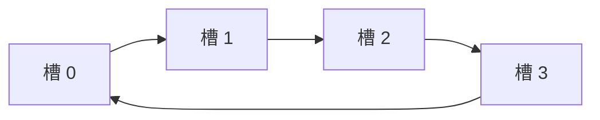

# 栈、队列与数组

数组允许按下标访问任意位置；栈只允许从同一端加入和删除；队列从一端加入、另一端删除。限制访问方式看似减少功能，却能直接表达“最近的先处理”“最早的先处理”等顺序，让算法状态更容易维护。

## 1. 数组为什么能按下标直接访问

**数组（array）**把相同类型的元素连续存放。若首元素地址为 `base`，每个元素占 `w` 字节，下标从 0 开始：

```text
address(a[i]) = base + i * w
```

CPU 通过一次乘加即可得到地址，所以按下标访问是 O(1)。这个复杂度表示计算地址所需步骤不随元素个数增长，不承诺每次硬件访问耗时完全相同。

```text
下标       0       1       2       3
地址     base   base+w base+2w base+3w
元素    ┌─────┬─────┬─────┬─────┐
        │ a0  │ a1  │ a2  │ a3  │
        └─────┴─────┴─────┴─────┘
```

连续存储的代价是中间插入或删除通常要移动后续元素，最坏 O(n)。动态数组容量不足时还要申请更大区域并搬迁元素；为什么单次扩容虽慢、连续追加仍可摊还 O(1)，见[数据结构总论：逻辑、存储与抽象类型](data_structures_intro.md)。

## 2. 多维数组怎样放进一维内存

内存地址是一维的，二维数组必须规定展开顺序。对 `m` 行 `n` 列、元素大小 `w` 的数组 `A`：

### 行优先

先连续存完第 0 行，再存第 1 行。C/C++ 的普通二维数组采用这种顺序：

```text
address(A[i][j]) = base + (i * n + j) * w
```

### 列优先

先连续存完第 0 列，再存第 1 列：

```text
address(A[i][j]) = base + (j * m + i) * w
```

例：`A` 为 3×4 的 `int32`，首地址 1000，按行优先存储。`A[2][1]` 的线性下标是 `2×4+1=9`，地址为 `1000+9×4=1036`。

遍历顺序若与存储顺序一致，会按连续地址访问，更容易利用 Cache；复杂度仍是 O(mn)，但常数和实际访存行为可能不同。

## 3. 特殊矩阵为什么可以压缩

矩阵若有可预测结构，不必保存每个位置。

### 对称矩阵

若 `A[i][j] = A[j][i]`，只保存上三角或下三角，共需：

```text
n(n + 1) / 2 个元素
```

以按行保存下三角、0-based 下标为例，`i >= j` 时，`A[i][j]` 前面已有 `1+2+...+i = i(i+1)/2` 个元素，因此压缩下标为：

```text
k = i(i + 1)/2 + j
```

访问上三角位置时交换 `i`、`j` 即可。

### 三对角矩阵

只有主对角线及其上下相邻对角线可能非零，非零元素约 `3n-2` 个。按行保存时可推导位置，不需要 n² 空间。

### 稀疏矩阵

若绝大多数元素为零，但非零位置没有简单公式，可以只保存非零项。

**三元组表**为每个非零元素保存 `(row, column, value)`，容易理解和构建；**CSR（Compressed Sparse Row，压缩稀疏行）**通常使用：

- `values`：非零值；
- `columns`：每个非零值的列号；
- `row_offsets`：每一行在前两个数组中的起始位置。

例如：

```text
矩阵：  0 5 0 0
       2 0 0 7
       0 0 3 0

values      = [5, 2, 7, 3]
columns     = [1, 0, 3, 2]
row_offsets = [0, 1, 3, 4]
```

第 `r` 行的元素位于半开区间 `[row_offsets[r], row_offsets[r+1])`。压缩节省空间，却让随机访问某个位置不再一定 O(1)；选择表示法要看主要操作。

## 4. 栈：后进先出

**栈（stack）**只在称为栈顶的一端操作，遵循 **LIFO（Last In, First Out，后进先出）**：

- `push(x)`：把 `x` 放到栈顶；
- `pop()`：删除并返回栈顶；
- `top()`：查看栈顶但不删除；
- `empty()`：判断是否为空。

```text
push A, push B, push C

栈顶 -> ┌───┐
        │ C │  先 pop
        ├───┤
        │ B │
        ├───┤
        │ A │
        └───┘
```

顺序栈可以用动态数组实现，栈顶位于数组末尾；链栈可以把单链表头当栈顶。两者 `push/pop` 都可 O(1)，区别在于连续内存、扩容和每个节点分配成本。

## 5. 调用栈为什么也是栈

函数 A 调用 B，B 又调用 C。C 必须先返回 B，B 再返回 A，恰好是后进先出。每次调用的参数、局部状态、保存的寄存器和返回地址等组成一个**栈帧（stack frame）**。

```text
栈顶 -> C 的栈帧
        B 的栈帧
        A 的栈帧
```

递归每深入一层通常增加一个栈帧。递归深度过大可能耗尽线程栈；把递归改为显式栈并没有让状态消失，只是把存储位置和容量控制交给程序。

## 6. 栈怎样处理括号

扫描表达式，遇到左括号压栈，遇到右括号时检查栈顶是否为对应类型：

```text
输入: {[()]}
{ -> [{]
[ -> [{, []
( -> [{, [, (]
) -> [{, []
] -> [{]
} -> []
结束时为空，因此匹配
```

若遇到右括号时栈空、类型不匹配，或结束后栈不空，都表示不合法。每个字符最多入栈出栈一次，时间 O(n)，额外空间最坏 O(n)。

## 7. 表达式与运算符栈

中缀表达式 `3 + 4 * 2` 的运算顺序依赖优先级。常见做法用一个数值栈和一个运算符栈：

1. 数字进入数值栈；
2. 新运算符到来时，先执行栈顶优先级更高，或同级且左结合的运算符；
3. 左括号建立边界，右括号计算到对应左括号；
4. 输入结束后执行剩余运算符。

必须先定义一元负号、除零、整数溢出和非法 token 怎样处理。栈只解决顺序，不能替应用补出含糊的语法。

## 8. 队列：先进先出

**队列（queue）**从队尾加入、从队首删除，遵循 **FIFO（First In, First Out，先进先出）**：

- `enqueue(x)`：入队；
- `dequeue()`：出队首；
- `front()`：查看队首；
- `empty()`：判断为空。

```text
出队方向 <- [A][B][C] <- 入队方向
             队首   队尾
```

队列适合表达按到达顺序处理：广度优先搜索、任务排队、请求缓冲。FIFO 只规定顺序，不保证任务已经持久化、一定成功或不会超时。

## 9. 顺序队列为什么需要循环

若用数组并在每次出队后移动所有元素，出队是 O(n)。保留 `front` 和 `rear` 下标可以 O(1) 出队，但下标一直向右会造成前部空间无法复用，这叫“假溢出”。

**循环队列（circular queue）**把数组首尾逻辑相连，下标通过取模回绕：

```text
next(i) = (i + 1) % capacity
```

若约定 `front` 指向队首元素，`rear` 指向下一个可写位置，并空出一个槽位区分空和满：

```text
空：front == rear
满：(rear + 1) % capacity == front
长度：(rear - front + capacity) % capacity
可保存元素数：capacity - 1
```



另一种设计额外保存 `size`，这样全部 `capacity` 个槽都可使用。公式不同但都正确；实现和题目必须先声明采用哪种约定。

## 10. 一个有界循环队列实现

下面使用额外 `size_` 区分空与满，容量为 `data_.size()`：

```cpp,ignore
#include <cstddef>
#include <optional>
#include <utility>
#include <vector>

template <class T>
class CircularQueue {
public:
    explicit CircularQueue(std::size_t capacity) : data_(capacity) {}

    bool push(const T& value) {
        if (size_ == data_.size() || data_.empty()) return false;
        data_[rear_] = value;
        rear_ = (rear_ + 1) % data_.size();
        ++size_;
        return true;
    }

    std::optional<T> pop() {
        if (size_ == 0) return std::nullopt;
        T value = std::move(data_[front_]);
        front_ = (front_ + 1) % data_.size();
        --size_;
        return value;
    }

    std::size_t size() const { return size_; }

private:
    std::vector<T> data_;
    std::size_t front_ = 0;
    std::size_t rear_ = 0;
    std::size_t size_ = 0;
};
```

有界队列满时返回 `false`，调用者必须决定等待、拒绝、丢弃或降级。这个策略比“环形数组怎么取模”更影响完整系统正确性。

为突出首尾下标，这个片段用 `vector<T>(capacity)` 预先创建槽位，因此要求 `T` 可以默认构造并可复制赋值。通用容器若要支持没有默认构造函数或只能移动的类型，应使用未初始化存储或 `optional<T>` 槽位，并补充移动版 `push`；这属于元素生命周期问题，不是循环队列公式本身。

## 11. 链式队列

链式队列维护头尾指针：尾部插入，头部删除。只保留头指针时，入队要遍历到尾部，会退化为 O(n)；同时维护尾指针才能让入队 O(1)。

删除最后一个节点后，头和尾都必须恢复为空。使用哨兵头结点能统一空队列和非空队列的部分分支，但要明确哨兵不保存业务元素。

链式队列可按需增长，却仍受系统内存上限约束；“没有固定数组容量”不等于“无限队列”。节点分配、指针和较差局部性也是成本。

## 12. 双端队列与单调队列

**双端队列（deque）**允许两端插入和删除。它可以模拟栈或队列，也能维护滑动窗口候选。

**单调队列**不是新的容器种类，而是一种维护不变量的方法。例如求长度为 `k` 的滑动窗口最大值，队列保存下标并保持对应值单调递减：

1. 队尾所有不大于新值的下标永久不可能再成为最大值，弹出；
2. 新下标入队；
3. 队首若已离开窗口，弹出；
4. 队首就是当前最大值。

每个下标最多入队、出队一次，所以总时间 O(n)，而不是每个窗口重新扫描的 O(nk)。详细题型与代码见[栈、队列、双端队列与堆](stack_queue_heap.md)。

## 13. 栈与队列怎样互相模拟

- 两个栈可以实现队列：输入栈负责入队；输出栈空时把输入栈全部倒入，元素顺序被反转，随后从输出栈出队。每个元素最多搬两次，摊还 O(1)。
- 两个队列可以实现栈：可以让入栈昂贵，每次把旧元素搬到新元素之后；也可以让出栈昂贵，每次搬走前 n−1 个元素。

这类题的重点不是背步骤，而是证明容器中的顺序始终符合目标 ADT。

## 14. 常见错误

- 数组下标与元素数量混淆，访问 `a[n]` 越界；
- 二维数组行数、列数代入相反；
- 循环队列未声明“空一个槽”还是保存 size，空/满条件互相冲突；
- 对空栈调用 `top/pop`，或对空队列 `front/dequeue`；
- 链式队列删光后忘记清空尾指针；
- 把容器操作 O(1) 理解为没有分配、Cache 或同步成本；
- 稀疏矩阵很小或不够稀疏时仍强行压缩，元数据反而更多。

## 15. 应用中的选择

| 问题 | 结构 | 原因 |
|---|---|---|
| 函数调用、撤销、DFS | 栈 | 最近产生的状态先恢复 |
| BFS、先到先服务任务 | 队列 | 最早进入的状态先处理 |
| 滑动窗口最大值 | 单调双端队列 | 只保留仍可能成为答案的候选 |
| 连续数值计算 | 数组 | 随机下标与空间局部性 |
| 大型稀疏图/矩阵 | CSR 等压缩表示 | 不为大量零元素付空间 |
| 有界服务缓冲 | 循环队列 | 固定容量并明确过载 |

## 16. 思考题与面试追问

1. 为什么数组下标访问是 O(1)，中间插入却通常是 O(n)？
2. 推导按列优先存储时 `A[i][j]` 的地址公式。
3. 对 5 阶对称矩阵，只存下三角需要多少元素？`A[4][2]` 放在压缩数组哪里？
4. 给出 CSR 三个数组各自的含义，怎样枚举第 r 行？
5. 调用栈为何适合函数嵌套？递归太深会怎样？
6. 循环队列空一个槽时，为什么最多只能存 `capacity-1` 个元素？
7. 使用 `size` 区分空满和空一个槽的方案，各多付出什么？
8. 为什么链式队列必须维护尾指针才能 O(1) 入队？
9. 用两个栈实现队列，证明每个元素最多搬运两次。
10. 单调队列中，被新元素从队尾弹出的旧元素为什么以后不可能成为窗口最大值？

## 参考依据

- 2025 年全国硕士研究生招生考试计算机学科专业基础考试大纲，数据结构“线性表、栈、队列和数组”部分。
- 严蔚敏、吴伟民，《数据结构（C 语言版）》，栈和队列、数组与广义表章节。
- Robert Sedgewick、Kevin Wayne，《Algorithms》，基础数据结构章节。
- MIT 6.006 Introduction to Algorithms，Data Structures 课程材料。
