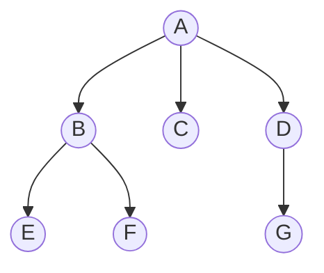

# 树与二叉树：性质、遍历、Huffman 与堆

数组把元素排成一条线，树则表达“一对多”的层次关系。文件目录、语法结构、组织关系和任务分解都不是单纯的前后顺序；树让一个对象拥有若干下级，再让每个下级继续拥有自己的下级。

本章主讲树的概念、性质、表示、遍历、线索化、树与森林转换、Huffman、堆和并查集。[链表、递归与树](linked_list_tree.md)集中训练指针修改、递归边界、遍历不变量、BST 验证和最近公共祖先，不重复这里的基础定义。

## 1. 树到底是什么

**树（tree）**是由结点和连接结点的边组成的层次结构。一棵非空树有且只有一个**根结点（root）**；除根外，每个结点恰好有一个直接上级，因此从根到任意结点只有一条路径。



先用这棵树认识术语：

| 术语 | 是什么 | 图中例子 |
|---|---|---|
| 结点（node） | 保存数据并参与层次关系的对象 | A、B、C 等 |
| 边（edge） | 父子之间的直接连接 | A—B |
| 父结点 / 子结点 | 一条边上靠近根者是父，远离根者是子 | A 是 B 的父，B 是 A 的子 |
| 兄弟结点（sibling） | 拥有同一父结点的结点 | B、C、D |
| 祖先 / 后代 | 沿父子边向上 / 向下能到达的结点 | A 是 F 的祖先，F 是 A 的后代 |
| 叶结点（leaf） | 没有子结点的结点 | C、E、F、G |
| 内部结点 | 至少有一个子结点的结点 | A、B、D |
| 子树（subtree） | 某结点及其全部后代组成的树 | 以 B 为根的 B、E、F |
| 结点的度 | 该结点拥有的子结点数 | A 的度为 3，C 的度为 0 |
| 树的度 | 全树所有结点度数的最大值 | 图中为 3 |

**路径（path）**是一串相邻结点，例如 `A → B → F`。若路径长度按边数计算，这条路径长度为 2。树中任意两个结点之间只有一条简单路径，这是许多树算法能够递归分解的根本原因。

### 1.1 层、深度与高度先约定口径

中文教材和代码题对“高度”有两种常见计数方式。为了避免差一，本章采用：

- 根的**层数（level）**为 1；下一层为 2；
- 根的**深度（depth）**为 0；一个结点的深度是根到它的边数；
- 结点的**高度（height）**是它到最远叶结点的边数，所以叶的高度为 0；
- 树高若按层数记，则等于“根的高度 + 1”；空树层数为 0。

因此上图 F 位于第 3 层、深度为 2；A 的结点高度为 2；整棵树共有 3 层。做题时若题目规定“叶高为 1”，所有高度答案要整体加 1，公式本身并没有矛盾。

### 1.2 树和森林的计数关系

**森林（forest）**是零棵或多棵互不相交的树的集合。删除一棵树的根，根的每棵子树就组成一个森林；反过来，给森林中每棵树的根增加同一个新父结点，又得到一棵树。

一棵含 `n` 个结点的非空树恰有 `n-1` 条边。原因是根没有父边，其余 `n-1` 个结点各有且只有一条来自父结点的边。因此：

```text
所有结点的度数之和 = 边数 = n - 1
```

若一个森林有 `n` 个结点、`k` 棵树，每棵树分别少一条“通向父结点”的边，所以边数为 `n-k`。

## 2. 二叉树不是“度为 2 的树”

**二叉树（binary tree）**是每个结点至多有一棵左子树和一棵右子树的有序树。左、右位置不同，即使只有一个孩子，“它是左孩子”与“它是右孩子”也是两种不同结构。

二叉树的递归定义产生五种基本形态：

1. 空二叉树；
2. 只有根结点；
3. 根只有左子树；
4. 根只有右子树；
5. 根同时有左、右子树。

这就是为什么“二叉树”不能只理解成“普通树的度不超过 2”。普通树中一个独生子没有左右次序；二叉树中必须区分它占左位置还是右位置。

### 2.1 五种常见整体形状

除递归定义的五种基本形态外，题目还常用下面五类整体形状：

| 形状 | 定义 | 为什么关注 |
|---|---|---|
| 斜树 / 退化树 | 每个内部结点只有一个孩子 | 高度可达 `n`，操作退化成链表 |
| 严格二叉树 | 每个结点的孩子数只能是 0 或 2 | 可推出叶数与双分支结点数关系 |
| 满二叉树（perfect） | 每层都填满 | 在给定层数下结点最多 |
| 完全二叉树（complete） | 除最后一层外都满，最后一层从左到右连续 | 可以无空洞地存入数组，是堆的结构基础 |
| 高度平衡二叉树 | 各处左右子树高度差受到限制 | 防止路径长期退化；具体平衡规则因结构而异 |

英文 `full` 有时指“严格二叉树”，中文资料却可能把“满二叉树”译作 full。面试时不要只报名称，最好补一句定义。

下面三棵树不要混淆：

```text
严格但不完全：       完全但不严格：       满二叉树：
      A                    A                    A
     / \                  / \                  / \
    B   C                B   C                B   C
       / \              /                    / \ / \
      D   E            D                    D  E F  G
```

## 3. 二叉树的重要性质与计算

本节统一使用“根为第 1 层、树高按层数”的口径。

### 3.1 每层和整棵树最多有多少结点

第 `i` 层最多有：

```text
2^(i-1) 个结点
```

因为根层最多 1 个，每个结点下一层最多产生两个孩子。高度为 `h` 的二叉树最多有：

```text
1 + 2 + 4 + ... + 2^(h-1) = 2^h - 1
```

等号成立时就是满二叉树。反过来，容纳 `n` 个结点所需的最少层数是：

```text
ceil(log2(n + 1))
```

普通二叉树的最大层数为 `n`，因为它可能退化成一条链。

### 3.2 为什么叶结点数等于双分支结点数加一

设：

- `n0`：度为 0 的叶结点数；
- `n1`：有一个孩子的结点数；
- `n2`：有两个孩子的结点数。

结点总数为 `n = n0 + n1 + n2`。另一方面，所有结点的孩子数之和就是边数：

```text
n1 + 2n2 = n - 1 = n0 + n1 + n2 - 1
```

消去 `n1` 得到：

```text
n0 = n2 + 1
```

它对每棵非空二叉树都成立，并不要求完全或满。例如有 20 个双分支结点，就一定有 21 个叶结点；只给单分支结点数并不能直接求叶数。

### 3.3 完全二叉树怎样从编号直接判断关系

把完全二叉树按层序从 0 开始存入数组，结点下标为 `i`：

```text
左孩子：2i + 1
右孩子：2i + 2
父结点：floor((i - 1) / 2)，i > 0
```

若数组有 `n` 个元素：

- 下标 `[0, floor(n/2)-1]` 是内部结点；
- 下标 `[floor(n/2), n-1]` 是叶结点；
- 叶结点数为 `ceil(n/2)`，内部结点数为 `floor(n/2)`；
- 第 `i` 个结点按 1 开始编号时，其所在层为 `floor(log2 i)+1`。

例如 `n=10`，0 下标数组中内部结点为 `0..4`，叶结点为 `5..9`，各有 5 个；第 10 个结点按 1 编号位于第 `floor(log2 10)+1=4` 层。

### 3.4 二叉链表为什么有 `n+1` 个空指针

每个结点有 left、right 两个孩子指针，共 `2n` 个指针位置。非空孩子指针对应树的 `n-1` 条边，所以空指针数为：

```text
2n - (n - 1) = n + 1
```

线索二叉树正是看见这些大量空位置，希望用它们保存遍历的前驱和后继。

## 4. 二叉树怎样存进内存

### 4.1 顺序存储

**顺序存储**按层序把结点放进连续数组，并用下标公式找到父子。满二叉树和完全二叉树不会留下内部空洞，因此空间紧凑、访问父子也很直接。

对于斜树，顺序存储会浪费空间。例如一棵只有右孩子的 5 结点树，下标依次是 `0, 2, 6, 14, 30`，为了保存 5 个结点却要让数组扩到至少 31 个位置。

### 4.2 链式存储

**二叉链表**为每个结点保存数据、左孩子指针和右孩子指针：

```cpp,ignore
struct TreeNode {
    int value{};
    TreeNode* left{};
    TreeNode* right{};
};
```

它只为真实结点分配空间，适合形状不规则、需要频繁连接子树的场景。若算法经常要向上走，也可以增加父指针；代价是每次旋转、移动或删除都必须同步维护它。

| 需求 | 顺序存储 | 链式存储 |
|---|---|---|
| 完全二叉树 | 很合适，无内部空洞 | 可以，但多保存指针 |
| 任意稀疏形状 | 可能浪费大量空位 | 只保存真实结点 |
| 找父结点 | 下标公式 `O(1)` | 无父指针时需另找 |
| 改变局部形状 | 可能移动或保留空位 | 修改若干连接即可 |

## 5. 四种遍历是在决定“何时访问根”

**遍历（traversal）**要求每个结点恰好访问一次。对一个结点来说，左子树、根、右子树共有三部分；根放在哪个时刻，得到三种深度优先遍历：

| 遍历 | 顺序 | 常见用途直觉 |
|---|---|---|
| 先序 / 前序 | 根—左—右 | 先处理负责人，再处理下级；复制结构 |
| 中序 | 左—根—右 | 二叉搜索树输出有序键；表达式中缀次序 |
| 后序 | 左—右—根 | 先汇总子树，再计算或删除根 |
| 层序 | 从上到下、每层从左到右 | 按距离扩展；完全树数组次序 |

对下面的树：

```text
        A
       / \
      B   C
     / \   \
    D   E   F
```

遍历结果是：

```text
先序：A B D E C F
中序：D B E A C F
后序：D E B F C A
层序：A B C D E F
```

### 5.1 递归为什么自然

一棵非空二叉树由“根、左二叉树、右二叉树”递归构成，所以递归遍历直接照着定义写：

```text
preorder(node):
    if node 为空: return
    visit(node)
    preorder(node.left)
    preorder(node.right)

inorder(node):
    if node 为空: return
    inorder(node.left)
    visit(node)
    inorder(node.right)

postorder(node):
    if node 为空: return
    postorder(node.left)
    postorder(node.right)
    visit(node)
```

时间都是 `O(n)`。递归调用栈最多保存从根到当前结点的路径，因此额外空间为 `O(h)`；斜树时 `h=n`，可能触发调用栈过深。

### 5.2 迭代遍历的栈里究竟保存什么

- 迭代先序：栈保存以后要访问的子树根。弹出一个就访问；先压右、再压左，才能先弹左；
- 迭代中序：栈保存“左子树处理完后还要回来访问”的祖先；不断向左压栈，走到空再弹出、访问并转向右子树；
- 迭代后序：结点只有在左右子树都完成后才能访问，因此还要记录右子树是否处理过；也可用两个栈把“根—右—左”反转成“左—右—根”；
- 层序：队列保存已经发现、等待处理的下一层结点。弹出队首后按左、右顺序把非空孩子入队。

递归与迭代访问的是同一顺序。区别只在于“返回地址和待处理祖先”由语言调用栈隐式保存，还是由程序显式保存。

## 6. 完整 C++20：四种遍历与序列重建

下面程序用 `std::unique_ptr` 表达父结点拥有左右子树，完整实现递归先序、迭代先中后序、层序，以及由“先序 + 中序”重建。示例约定结点值互不重复。

```cpp
#include <algorithm>
#include <cassert>
#include <cstddef>
#include <cstdint>
#include <memory>
#include <queue>
#include <stack>
#include <stdexcept>
#include <unordered_map>
#include <vector>

struct Node {
    char value{};
    std::unique_ptr<Node> left;
    std::unique_ptr<Node> right;
};

void preorder_recursive(const Node* node, std::vector<char>& out) {
    if (node == nullptr) {
        return;
    }
    out.push_back(node->value);
    preorder_recursive(node->left.get(), out);
    preorder_recursive(node->right.get(), out);
}

std::vector<char> preorder_iterative(const Node* root) {
    std::vector<char> out;
    if (root == nullptr) {
        return out;
    }
    std::stack<const Node*> pending;
    pending.push(root);
    while (!pending.empty()) {
        const Node* node = pending.top();
        pending.pop();
        out.push_back(node->value);
        if (node->right) {
            pending.push(node->right.get());
        }
        if (node->left) {
            pending.push(node->left.get());
        }
    }
    return out;
}

std::vector<char> inorder_iterative(const Node* root) {
    std::vector<char> out;
    std::stack<const Node*> ancestors;
    const Node* current = root;
    while (current != nullptr || !ancestors.empty()) {
        while (current != nullptr) {
            ancestors.push(current);
            current = current->left.get();
        }
        current = ancestors.top();
        ancestors.pop();
        out.push_back(current->value);
        current = current->right.get();
    }
    return out;
}

std::vector<char> postorder_iterative(const Node* root) {
    std::vector<char> out;
    std::stack<const Node*> ancestors;
    const Node* current = root;
    const Node* last_visited = nullptr;
    while (current != nullptr || !ancestors.empty()) {
        if (current != nullptr) {
            ancestors.push(current);
            current = current->left.get();
        } else {
            const Node* peek = ancestors.top();
            if (peek->right && last_visited != peek->right.get()) {
                current = peek->right.get();
            } else {
                out.push_back(peek->value);
                last_visited = peek;
                ancestors.pop();
            }
        }
    }
    return out;
}

std::vector<char> level_order(const Node* root) {
    std::vector<char> out;
    if (root == nullptr) {
        return out;
    }
    std::queue<const Node*> waiting;
    waiting.push(root);
    while (!waiting.empty()) {
        const Node* node = waiting.front();
        waiting.pop();
        out.push_back(node->value);
        if (node->left) {
            waiting.push(node->left.get());
        }
        if (node->right) {
            waiting.push(node->right.get());
        }
    }
    return out;
}

std::unique_ptr<Node> build_range(
    const std::vector<char>& preorder,
    std::size_t& pre_index,
    std::size_t in_begin,
    std::size_t in_end,
    const std::unordered_map<char, std::size_t>& in_position) {
    if (in_begin == in_end) {
        return nullptr;
    }
    if (pre_index >= preorder.size()) {
        throw std::invalid_argument("inconsistent traversal sequences");
    }
    const char root_value = preorder[pre_index++];
    const auto found = in_position.find(root_value);
    if (found == in_position.end() || found->second < in_begin ||
        found->second >= in_end) {
        throw std::invalid_argument("inconsistent traversal sequences");
    }
    auto root = std::make_unique<Node>();
    root->value = root_value;
    root->left = build_range(
        preorder, pre_index, in_begin, found->second, in_position);
    root->right = build_range(
        preorder, pre_index, found->second + 1, in_end, in_position);
    return root;
}

std::unique_ptr<Node> build_from_preorder_inorder(
    const std::vector<char>& preorder,
    const std::vector<char>& inorder) {
    if (preorder.size() != inorder.size()) {
        throw std::invalid_argument("different sequence lengths");
    }
    std::unordered_map<char, std::size_t> in_position;
    for (std::size_t i = 0; i < inorder.size(); ++i) {
        if (!in_position.emplace(inorder[i], i).second) {
            throw std::invalid_argument("values must be unique");
        }
    }
    std::size_t pre_index = 0;
    auto root = build_range(
        preorder, pre_index, 0, inorder.size(), in_position);
    if (pre_index != preorder.size()) {
        throw std::invalid_argument("inconsistent traversal sequences");
    }
    return root;
}

int main() {
    const std::vector<char> preorder{'A', 'B', 'D', 'E', 'C', 'F'};
    const std::vector<char> inorder{'D', 'B', 'E', 'A', 'C', 'F'};
    const auto root = build_from_preorder_inorder(preorder, inorder);

    std::vector<char> recursive_preorder;
    preorder_recursive(root.get(), recursive_preorder);
    assert(recursive_preorder == preorder);
    assert(preorder_iterative(root.get()) == preorder);
    assert(inorder_iterative(root.get()) == inorder);
    assert((postorder_iterative(root.get()) ==
            std::vector<char>{'D', 'E', 'B', 'F', 'C', 'A'}));
    assert((level_order(root.get()) ==
            std::vector<char>{'A', 'B', 'C', 'D', 'E', 'F'}));
    assert(level_order(nullptr).empty());
}
```

`build_range` 每次从先序取得当前根，再用根在中序中的位置把问题分成左右子树。哈希表让每次分割位置查询为平均 `O(1)`，所以总时间平均为 `O(n)`，递归和结果树使用 `O(n)` 空间。

## 7. 哪些遍历序列能唯一重建

仍以结点值互不重复为前提：

| 已知序列 | 一般能否唯一确定 | 原因 |
|---|---|---|
| 先序 + 中序 | 能 | 先序确定根，中序划分左右子树 |
| 后序 + 中序 | 能 | 后序确定根，中序划分左右子树 |
| 层序 + 中序 | 能 | 层序中最早落入某中序区间者是该子树根 |
| 先序 + 后序 | 一般不能 | 无法判断唯一孩子在左还是在右 |
| 单独一种序列 | 不能 | 大量不同形状可产生同一序列 |

### 7.1 先序 + 中序完整推演

```text
先序：A B D E C F
中序：D B E A C F
```

1. 先序第一个 A 是根；中序在 A 处分成 `D B E` 与 `C F`；
2. 左子树的先序片段是 `B D E`，根为 B；中序在 B 处分成 D 与 E；
3. 右子树的先序片段是 `C F`，根为 C；中序表明 C 没有左子树，F 是右孩子；
4. 得到本章遍历示例中的整棵树。

先序和后序为什么通常不够？只有两个结点时，先序 `A B`、后序 `B A` 同时符合“A 的左孩子是 B”和“A 的右孩子是 B”。如果额外保证每个内部结点恰有两个孩子，并且结点身份唯一，先序与后序才可唯一还原。

若值可以重复，仅靠数值序列可能无法确认中序里的哪个相同值对应当前根。要唯一重建，必须使用唯一结点标识，或再提供能够消除歧义的条件。

## 8. 线索二叉树为什么存在

普通二叉链表有 `n+1` 个空孩子指针。与此同时，递归或显式栈遍历的目的之一，是在访问完一个结点后找到遍历顺序中的下一结点。

**线索二叉树（threaded binary tree）**利用原本为空的孩子指针保存遍历前驱或后继：

- 左指针为空时，可改为指向该结点的遍历前驱；
- 右指针为空时，可改为指向该结点的遍历后继；
- 必须再保存 `left_is_thread`、`right_is_thread` 等标志，区分真实孩子与线索。

以中序 `D B E A C F` 为例，E 没有右孩子，可让它的右线索指向中序后继 A；C 没有左孩子，可让它的左线索指向中序前驱 A。

线索的价值是让特定遍历能够在没有递归栈、没有父指针时寻找前驱或后继。代价是插入、删除和旋转时不仅要维护孩子，还要修复周围线索；线索也只对应某一种规定遍历顺序。它不是“所有树都应该使用”的默认结构。

## 9. 树、森林与二叉树怎样转换

普通树的结点可以有任意多个孩子。**左孩子—右兄弟表示法（left-child right-sibling）**只保存两个指针：

- `left` 指向第一个孩子；
- `right` 指向下一个兄弟。

例如普通树中 A 的孩子依次为 B、C、D，B 的孩子为 E、F：

```text
普通树：                 转换后的二叉连接：
       A                         A
     / | \                      /
    B  C  D                    B
   / \                          \
  E   F                          C
                                  \
                                   D

B.left = E，E.right = F；B.right = C，C.right = D
```

转换步骤是：

1. 同一父结点的孩子按原顺序用 `right` 连成兄弟链；
2. 父结点只用 `left` 指向第一个孩子；
3. 其余原来的父子连接不再单独保留。

森林转换时，把各棵树的根也视作兄弟：第一棵树的根作为二叉树根，`right` 依次连接其他树根。逆转换则把一个结点的 `left` 链看作孩子序列，并把每个孩子的 `right` 链还原成兄弟。

这个表示下，森林的先根遍历对应转换后二叉树的先序遍历；森林的后根遍历对应转换后二叉树的中序遍历。不要把二叉树的 `right` 一律读成“右孩子”，在左孩子—右兄弟表示中它的语义是“下一个兄弟”。

## 10. Huffman 树：让高频符号靠近根

**带权路径长度（Weighted Path Length，WPL）**是所有叶结点“权值 × 根到叶的路径长度”之和：

```text
WPL = Σ(weight_i × depth_i)
```

给定一组叶权值，WPL 最小的二叉树称为 **Huffman 树**。构造规则是：每次取权值最小的两棵树合并，新根权值为两者之和，再放回候选集合，直到只剩一棵树。

### 10.1 完整算例

有 6 个符号：

| 符号 | A | B | C | D | E | F |
|---|---:|---:|---:|---:|---:|---:|
| 权值 | 5 | 9 | 12 | 13 | 16 | 45 |

每次合并：

```text
5 + 9 = 14
12 + 13 = 25
14 + 16 = 30
25 + 30 = 55
45 + 55 = 100
```

所有合并权值之和就是 WPL：

```text
WPL = 14 + 25 + 30 + 55 + 100 = 224
```

也可以从叶深度复核。若每次把较小权值放左边，并规定左边编码 0、右边编码 1，可得到一种合法编码：

| 符号 | 编码 | 深度 | 对 WPL 的贡献 |
|---|---|---:|---:|
| F | `0` | 1 | 45 |
| C | `100` | 3 | 36 |
| D | `101` | 3 | 39 |
| A | `1100` | 4 | 20 |
| B | `1101` | 4 | 36 |
| E | `111` | 3 | 48 |
| 合计 |  |  | **224** |

Huffman 编码是**前缀编码（prefix code）**：任何符号的完整编码都不是另一个符号编码的前缀，所以从根按位行走，到达叶结点就能确定一个符号，不需要额外分隔符。

左右 0/1 可以整体交换；权值相同时选择顺序也可能不同，因此编码字符串未必唯一，但最优 WPL 相同。只有一个符号时，工程编码通常为它分配至少一位（例如 `0`），不要输出空字符串。

### 10.2 完整 C++20：构造编码并复核 WPL

```cpp
#include <cassert>
#include <cstddef>
#include <memory>
#include <queue>
#include <string>
#include <unordered_map>
#include <utility>
#include <vector>

struct HuffmanNode {
    std::int64_t weight{};
    char symbol{};
    std::size_t order{};
    std::shared_ptr<HuffmanNode> left;
    std::shared_ptr<HuffmanNode> right;

    bool is_leaf() const noexcept {
        return !left && !right;
    }
};

struct LighterFirst {
    bool operator()(const std::shared_ptr<HuffmanNode>& a,
                    const std::shared_ptr<HuffmanNode>& b) const {
        if (a->weight != b->weight) {
            return a->weight > b->weight;
        }
        return a->order > b->order;
    }
};

std::shared_ptr<HuffmanNode> build_huffman(
    const std::vector<std::pair<char, std::int64_t>>& frequencies) {
    std::priority_queue<std::shared_ptr<HuffmanNode>,
                        std::vector<std::shared_ptr<HuffmanNode>>,
                        LighterFirst> candidates;
    std::size_t next_order = 0;
    for (const auto& [symbol, weight] : frequencies) {
        assert(weight > 0);
        candidates.push(std::make_shared<HuffmanNode>(
            HuffmanNode{weight, symbol, next_order++, nullptr, nullptr}));
    }
    if (candidates.empty()) {
        return nullptr;
    }
    while (candidates.size() > 1) {
        auto left = candidates.top();
        candidates.pop();
        auto right = candidates.top();
        candidates.pop();
        candidates.push(std::make_shared<HuffmanNode>(HuffmanNode{
            left->weight + right->weight,
            '\0',
            next_order++,
            std::move(left),
            std::move(right)}));
    }
    return candidates.top();
}

void collect_codes(const std::shared_ptr<HuffmanNode>& node,
                   const std::string& prefix,
                   std::unordered_map<char, std::string>& codes) {
    if (!node) {
        return;
    }
    if (node->is_leaf()) {
        codes[node->symbol] = prefix.empty() ? "0" : prefix;
        return;
    }
    collect_codes(node->left, prefix + '0', codes);
    collect_codes(node->right, prefix + '1', codes);
}

int main() {
    const std::vector<std::pair<char, std::int64_t>> weights{
        {'A', 5}, {'B', 9}, {'C', 12},
        {'D', 13}, {'E', 16}, {'F', 45}};
    const auto root = build_huffman(weights);
    assert(root && root->weight == 100);

    std::unordered_map<char, std::string> codes;
    collect_codes(root, "", codes);
    std::int64_t wpl = 0;
    for (const auto& [symbol, weight] : weights) {
        wpl += weight * static_cast<std::int64_t>(codes.at(symbol).size());
    }
    assert(wpl == 224);
    for (const auto& [a, code_a] : codes) {
        for (const auto& [b, code_b] : codes) {
            if (a != b) {
                assert(code_b.rfind(code_a, 0) != 0);
            }
        }
    }
}
```

使用大小为 `k` 的小顶堆维护候选树，构造时间为 `O(k log k)`，树和堆使用 `O(k)` 空间。Huffman 保证给定权值下的最小 WPL，但它不自动包含文件格式、码表存储、位打包和错误恢复协议。

## 11. 堆：只保证根是当前极值

**二叉堆（binary heap）**同时满足两条规则：

1. 结构规则：它是一棵完全二叉树；
2. 次序规则：小顶堆中父结点不大于孩子；大顶堆中父结点不小于孩子。

完全二叉树让堆能紧凑存进数组。小顶堆的堆顶一定是全局最小值，但兄弟之间、不同子树之间没有整体顺序。因此堆不是“排好序的数组”，查找任意值仍可能要 `O(n)`。

### 11.1 插入为什么向上调整

插入先放到数组末尾，以保持完全二叉树形状。新元素只可能违反“它与父结点”的次序，所以不断与父结点比较并交换，称为**上滤（sift up）**：

```text
追加 value 到末尾 i
while i > 0 且 heap[i] < heap[parent(i)]:
    交换二者
    i = parent(i)
```

每次上移一层，最多经过树高 `O(log n)` 层。

### 11.2 删除堆顶为什么向下调整

删除最小值后，用最后一个元素补到根并缩短数组。此时只有根到某个叶的路径可能违反堆序。每次选择更小的孩子交换，称为**下滤（sift down）**。必须选两个孩子中更小的一个，否则与另一个孩子的关系仍可能错误。

### 11.3 建堆为什么可以是 `O(n)`

把无序数组变成堆，可以从最后一个内部结点 `floor(n/2)-1` 开始，逆序对每个内部结点下滤。叶结点本身已经是合法小堆，无需处理。

虽然单次下滤最坏为 `O(log n)`，但多数结点靠近叶，实际只能下滤很少层。把各高度的结点数乘以可下沉层数求和，结果是 `O(n)`，不是简单相乘得到的 `O(n log n)`。逐个调用插入建堆才是 `O(n log n)`。

### 11.4 完整 C++20：最小堆与并查集

```cpp
#include <cassert>
#include <cstddef>
#include <stdexcept>
#include <utility>
#include <vector>

class MinHeap {
public:
    MinHeap() = default;

    explicit MinHeap(std::vector<int> values) : data_(std::move(values)) {
        for (std::size_t i = data_.size() / 2; i > 0; --i) {
            sift_down(i - 1);
        }
    }

    bool empty() const noexcept { return data_.empty(); }
    std::size_t size() const noexcept { return data_.size(); }

    int top() const {
        if (empty()) {
            throw std::out_of_range("top of empty heap");
        }
        return data_.front();
    }

    void push(int value) {
        data_.push_back(value);
        sift_up(data_.size() - 1);
    }

    int pop() {
        const int answer = top();
        data_.front() = data_.back();
        data_.pop_back();
        if (!empty()) {
            sift_down(0);
        }
        return answer;
    }

private:
    static std::size_t parent(std::size_t i) { return (i - 1) / 2; }
    static std::size_t left(std::size_t i) { return 2 * i + 1; }

    void sift_up(std::size_t i) {
        while (i > 0 && data_[i] < data_[parent(i)]) {
            std::swap(data_[i], data_[parent(i)]);
            i = parent(i);
        }
    }

    void sift_down(std::size_t i) {
        while (left(i) < data_.size()) {
            std::size_t smaller = left(i);
            const std::size_t right = smaller + 1;
            if (right < data_.size() && data_[right] < data_[smaller]) {
                smaller = right;
            }
            if (data_[i] <= data_[smaller]) {
                break;
            }
            std::swap(data_[i], data_[smaller]);
            i = smaller;
        }
    }

    std::vector<int> data_;
};

class DisjointSet {
public:
    explicit DisjointSet(std::size_t n) : parent_(n), size_(n, 1) {
        for (std::size_t i = 0; i < n; ++i) {
            parent_[i] = i;
        }
    }

    std::size_t find(std::size_t x) {
        if (x >= parent_.size()) {
            throw std::out_of_range("disjoint-set index");
        }
        if (parent_[x] != x) {
            parent_[x] = find(parent_[x]);
        }
        return parent_[x];
    }

    bool unite(std::size_t a, std::size_t b) {
        a = find(a);
        b = find(b);
        if (a == b) {
            return false;
        }
        if (size_[a] < size_[b]) {
            std::swap(a, b);
        }
        parent_[b] = a;
        size_[a] += size_[b];
        return true;
    }

    bool connected(std::size_t a, std::size_t b) {
        return find(a) == find(b);
    }

private:
    std::vector<std::size_t> parent_;
    std::vector<std::size_t> size_;
};

int main() {
    MinHeap heap({7, 2, 9, 1, 5, 3});
    assert(heap.top() == 1);
    heap.push(0);
    std::vector<int> sorted;
    while (!heap.empty()) {
        sorted.push_back(heap.pop());
    }
    assert((sorted == std::vector<int>{0, 1, 2, 3, 5, 7, 9}));

    DisjointSet sets(6);
    assert(sets.unite(0, 1));
    assert(sets.unite(1, 2));
    assert(sets.connected(0, 2));
    assert(!sets.connected(0, 4));
    assert(!sets.unite(0, 2));
    assert(sets.unite(3, 4));
    assert(sets.unite(2, 4));
    assert(sets.connected(0, 3));
}
```

## 12. 二叉搜索树只先建立入口

**二叉搜索树（Binary Search Tree，BST）**为结点键规定次序：在选定的重复键策略下，左子树的键小于根，右子树的键大于根，而且左右子树也递归满足同一规则。

因此中序遍历会得到有序序列，查找时可根据比较结果只进入一侧。但复杂度取决于树高：形状平衡时查找约为 `O(log n)`，按有序输入插入并退化成链时可到 `O(n)`。

BST 的查找、插入、删除、AVL/红黑树和 B/B+ 树将在[查找结构：二分、平衡树与哈希表](search_structures.md)主讲。本章只需先记住：BST 是“带全局查找次序的二叉树”，堆是“只保证父子优先级的完全二叉树”，二者不能互换。

## 13. 并查集：用一片父指针森林维护分组

**并查集（Disjoint Set Union，DSU）**维护若干互不相交的集合，只回答两类问题：

- `find(x)`：元素 x 属于哪个集合，返回该集合的代表根；
- `unite(a,b)`：把 a、b 所在集合合并。

它把每个集合表示成一棵父指针树，多棵树构成森林。开始时每个元素都是一棵单结点树。合并时把一个根接到另一个根；查询时沿 parent 走到满足 `parent[root] == root` 的代表根。

基础实现中的两项优化是：

- **按大小/秩合并**：让较小或较浅的树挂到较大的根下，防止快速长高；
- **路径压缩**：一次 find 返回时，把沿途结点直接接到根上，让后续查询更短。

两者一起使用时，一系列操作的均摊成本是 `O(α(n))`，`α` 是增长极慢的反阿克曼函数，在实际规模下可视作接近常数，但不是数学上的严格 `O(1)`。

并查集适合动态连通性、无向图判环和 Kruskal 最小生成树。它不保存两点间的具体路径，也不擅长普通在线删除。完整图题推演见[图、并查集、最短路与回溯](graph_search.md)。

## 14. 常见错法

- **把树高、深度和层数混用。** 先声明根按 0 还是 1、路径按边还是结点计数。
- **把二叉树当作无序的度 2 树。** 只有左孩子和只有右孩子是不同结构。
- **把严格、完全、满二叉树当成同义词。** 用定义判断，不靠中英文名称猜。
- **忘记 `n0=n2+1` 与 `n1` 无关。** 推导来自边数，不要求完全二叉树。
- **顺序存储任意斜树。** 下标会指数增长并留下大量空洞。
- **迭代先序先压左再压右。** 栈后进先出，这样会先访问右；应先压右。
- **中序遍历弹栈后忘记转向右子树。** 会漏掉整棵右子树。
- **认为任意两种遍历都能重建。** 一般必须含中序；先序加后序通常有左右歧义。
- **重复值仍用“值到中序位置”的唯一映射。** 相同值不能唯一标识结点。
- **线索指针没有标志位。** 无法区分它指向真实孩子还是遍历前驱/后继。
- **Huffman 每次合并最大两项。** 正确贪心是最小两项；WPL 可用合并权值之和复核。
- **把 Huffman 编码字符串当成唯一答案。** 左右选择和同权决策可变，重点是前缀性质与 WPL。
- **认为堆内部完全有序。** 堆只保证父子关系，任意查找仍是 `O(n)`。
- **下滤时随便选一个孩子。** 小顶堆必须与更小孩子交换。
- **把自底向上建堆写成 `O(n log n)`。** 逐个插入是这个复杂度，自底向下滤为 `O(n)`。
- **并查集能返回具体路径。** 它只保存分组代表，路径压缩还会改写内部父边。

## 15. 应用场景

| 结构或机制 | 典型用途 | 首先说明的边界 |
|---|---|---|
| 普通树 / 森林 | 文件目录、语法树、组织层级 | 孩子是否有序，是否需要父指针 |
| 二叉树遍历 | 表达式求值、结构序列化、递归汇总 | 空树、树高、访问根的时机 |
| Huffman 树 | 根据频率构造前缀码 | 还需保存码表和位流格式 |
| 堆 | 调度、Top-K、多路合并、优先队列 | 只快速得到堆顶，不支持任意有序查找 |
| BST | 动态有序集合和范围查询 | 性能取决于高度和平衡策略 |
| 并查集 | 连通分组、判环、Kruskal | 不给具体路径，不擅长删除 |

这些结构也会组合：Huffman 用小顶堆反复选择两棵最轻的树；Kruskal 用排序和并查集判断加入一条边是否闭环；优先队列通常用完全二叉堆实现。先说每个结构维护什么不变量，再讨论组合，而不是只背库类型。

## 16. 本章小结

- 树表达有唯一父路径的层次关系，`n` 结点树有 `n-1` 条边，`k` 棵树的森林有 `n-k` 条边；
- 二叉树区分左、右位置；严格、完全、满、平衡和斜树描述不同性质；
- 第 `i` 层最多 `2^(i-1)` 个结点，高 `h` 层最多 `2^h-1` 个结点，非空二叉树满足 `n0=n2+1`；
- 完全二叉树适合顺序存储，任意形状通常使用左右孩子指针；
- 先中后序取决于何时访问根，层序使用队列；递归栈和显式栈保存的是未完成路径；
- 唯一值下，先序/后序与中序可以唯一重建，一般的先序加后序不能；
- 线索二叉树复用空指针保存特定遍历的前驱/后继；左孩子—右兄弟把树和森林转成二叉表示；
- Huffman 每次合并最小两项，得到最小 WPL 的前缀码；
- 堆是满足堆序的完全二叉树，上滤、下滤为 `O(log n)`，自底向上建堆为 `O(n)`；
- BST 根据键决定搜索方向；并查集用父指针森林维护集合代表。

## 17. 章末做题方法：性质计算、遍历与编码树

1. **读题先定树的种类**：普通树、二叉树、完全二叉树、BST、堆和 Huffman 树的约束不同；先写节点数、度、层数的计数口径。
2. **性质题画层级**：按根所在层号写每层最大节点数，利用边数 `n-1`、度数和与叶子/内部节点关系列方程。
3. **遍历题写访问时机**：前/中/后序分别在左子树前、中、后访问根；层序维护队列。由遍历序列重建时先定位根再切左右区间。
4. **Huffman 题用小根堆推演**：每次取两个最小权重合并并放回，记录合并树；最终按叶深计算 WPL。堆操作则画完全二叉树和数组下标。
5. **验算**：树有 `n-1` 条边；遍历恰访问每节点一次；Huffman 最终只剩一个根且 WPL 与各叶权重乘深度之和一致；堆只保证父子次序，不保证全局有序。

常见陷阱：层号从 0/1 混用；完全二叉树当满二叉树；只有前序和后序就声称唯一重建；Huffman 把中间节点权重也当字符频率；BST 与堆性质互相套用。

## 18. 思考题、408 题与面试追问

1. 一棵树有 30 个结点、5 棵树组成的森林有 30 个结点，它们分别有多少条边？

<details><summary>参考答案</summary>

一棵非空树每个非根结点恰有一条父边，所以 `30-1=29` 条。森林中每棵树各少一条根的父边，总边数 `n-k=30-5=25`。验算：给 5 棵树各加一条边连到新超级根，会得到 31 个结点、30 条边的树；去掉 5 条新边即 25。

</details>

2. 结点的度、树的度、深度、高度和层数分别是什么？用同一棵图示树举例。

<details><summary>参考答案</summary>

画 `A` 为根，孩子 `B,C`，B 的孩子为 D。A/B/D 的深度按根为第 1 层分别是 1/2/3；D 高度为 1，B 为 2，A 为 3；结点 B 的度是孩子数 1，树的度是所有结点度最大值 2，层数/树高为 3。若教材把根深度记 0，要整体平移并先声明约定。

</details>

3. 为什么“只有左孩子”和“只有右孩子”是两棵不同二叉树？

<details><summary>参考答案</summary>

二叉树的两个孩子位置有序，左、右是结构的一部分，不是“至多两个无序孩子”。根 A 的左孩子 B 与根 A 的右孩子 B 的先序虽相同，但中序分别为 `B,A` 与 `A,B`，因此结构不同。

</details>

4. 高度为 6 层的二叉树最多有多少结点？有 100 个结点的二叉树最少和最多有多少层？

<details><summary>参考答案</summary>

第 i 层最多 `2^(i-1)` 个，6 层总数 `2^6-1=63`。100 个结点层数最少满足 `2^h-1≥100`，故 `h≥ceil(log₂101)=7`；最退化成单链时最多 100 层。验算 6 层最多 63 不够，7 层最多 127 足够。

</details>

5. 一棵非空二叉树有 12 个单分支结点、20 个双分支结点，叶结点有多少？总数是多少？

<details><summary>参考答案</summary>

设 `n0,n1,n2` 分别为 0/1/2 孩子结点数。边数既是 `n-1`，也是 `n1+2n2`，推出 `n0=n2+1=21`。总数 `n0+n1+n2=21+12+20=53`。验算边数 `12+40=52=53-1`。

</details>

6. 含 21 个结点的完全二叉树有多少叶结点？0 下标数组中最后一个内部结点下标是多少？

<details><summary>参考答案</summary>

0 基数组中结点 i 的左孩子是 `2i+1`；有孩子需 `2i+1<21`，所以 `i≤9`，最后内部结点下标 9。叶子下标为 10..20，共 11 个，也等于 `n-floor(n/2)=21-10=11`。

</details>

7. 为什么 n 结点二叉链表恰有 `n+1` 个空孩子指针？线索化利用了什么？

<details><summary>参考答案</summary>

n 个结点共有 `2n` 个孩子指针，非空孩子指针对应树边，共 `n-1` 条，所以空指针 `2n-(n-1)=n+1`。线索二叉树利用这些原本为空的槽保存遍历前驱/后继，并用标志位区分真实孩子和线索。

</details>

8. 给出本章示例树的四种遍历，并逐步说明迭代中序栈中保存的是什么。

<details><summary>参考答案</summary>

应先照本章图逐节点写：先序“根-左-右”、中序“左-根-右”、后序“左-右-根”、层序按队列逐层。迭代中序时不断把当前节点及其左链压栈；栈中保存“左子树尚在处理或已处理、但节点自身和右子树尚未完成”的祖先。弹出即访问该根，再转其右子树；用递归结果逐项对照验算，节点数必须相同且不重不漏。

</details>

9. 已知后序 `D E B F C A`、中序 `D B E A C F`，逐层重建原树。

<details><summary>参考答案</summary>

后序末项 A 是根；中序在 A 处分成左 `D B E`、右 `C F`。左后序 `D E B` 的根是 B，中序左右为 D/E；右后序 `F C` 的根是 C，中序 C 的右侧为 F。因此树为 `A(B(D,E), C(null,F))`。验算其后序正是 `D,E,B,F,C,A`。

</details>

10. 只给先序 `A B` 和后序 `B A`，画出两棵都符合的不同二叉树。

<details><summary>参考答案</summary>

两种分别是 A 只有左孩子 B、A 只有右孩子 B。二者先序都先 A 后 B，后序都先 B 后 A，却不是同一结构。这证明一般先序+后序无法判断单孩子在左还是右。

</details>

11. 用左孩子—右兄弟法画出图中 A 有 B/C/D 三个孩子、B 有 E/F 两个孩子的二叉表示。

<details><summary>参考答案</summary>

每节点 left 指向第一个孩子、right 指向下一个兄弟：`A.left=B`；兄弟链 `B.right=C,C.right=D`；`B.left=E,E.right=F`；其余缺失链接为空。验算从任一父节点先走 left 到首孩子，再沿 right 能枚举全部且仅枚举它的孩子。

</details>

12. 权值 `{2, 3, 7, 9, 18}` 怎样逐步构造 Huffman 树？写出每次合并值并计算 WPL。

<details><summary>参考答案</summary>

每次取最小两项：`2+3=5`，集合变 `{5,7,9,18}`；`5+7=12`；`9+12=21`；`18+21=39`。WPL 等于各次合并值之和 `5+12+21+39=77`。也可由叶权×深度复核；同权左右交换可能改变编码字串，不改变 77。

</details>

13. 为什么 Huffman 编码没有分隔符仍能解码？两个同权符号交换左右会影响 WPL 吗？

<details><summary>参考答案</summary>

叶子编码具有前缀性质：任何符号编码都不是另一编码的前缀。解码从根逐 bit 走到叶便立即输出并回根，不需分隔符。同权叶子交换左右或 0/1 标签只改变具体码字，不改变深度加权和，因此 WPL 不变。

</details>

14. 对数组 `{8, 4, 7, 1, 3, 5}` 自底向上建立小顶堆，写出每次下滤后的数组。

<details><summary>参考答案</summary>

0 基最后内部节点为 `6/2-1=2`。从 i=2：7 与孩子 5 交换，得 `[8,4,5,1,3,7]`；i=1：4 与较小孩子 1 交换，得 `[8,1,5,4,3,7]`；i=0：8 与 1 交换，再在 i=1 与 3 交换，得 `[1,3,5,4,8,7]`。验算每个父节点不大于孩子；数组不必整体有序。总建堆 `O(n)`。

</details>

15. 为什么小顶堆删除根后必须与较小孩子比较？自底向上建堆为什么不是 `O(n log n)`？

<details><summary>参考答案</summary>

末元素补到根后若要下滤，和较小孩子交换才能同时恢复对两个孩子的“父≤子”；选较大孩子可能交换后仍大于较小孩子。建堆虽有约 n/2 个节点，但大多数靠近叶、下滤高度很小，总工作为各高度节点数乘高度的和 `O(n)`，不是把每个都按最大高度 `log n` 粗乘。

</details>

16. BST 与小顶堆分别保证什么次序？要查找任意键时为什么不能把堆当 BST？

<details><summary>参考答案</summary>

BST 保证左子树键小于（或按重复策略不大于）根、右子树大于根，因此一次比较可排除一整侧；小顶堆只保证父≤孩子，左右子树之间无全序。除最小值外，查任意键在堆中无法决定走哪侧，最坏要扫描 `O(n)`。

</details>

17. 路径压缩和按大小合并分别在解决什么问题？并查集为什么不能直接给出两点间原图路径？

<details><summary>参考答案</summary>

按大小/秩合并把较小树挂到较大树，避免树变高；路径压缩在 find 后把访问节点直接连向代表元，缩短以后查询。二者合用摊还近常数。父指针只是集合维护结构，压缩还会改写它，并不保存原图边，所以只能回答是否同组，不能还原原图具体路径。

</details>

## 权威依据

- [2025 年 408 计算机学科专业基础考试大纲（高校公开附件）](https://www.uwh.edu.cn/uploads/article/20250609/660428d58334252302af691bf99e064e.pdf)
- 严蔚敏、吴伟民，《数据结构（C 语言版）》，树和二叉树章节。
- [Princeton Algorithms, 4th Edition 官方课程：Priority Queues](https://algs4.cs.princeton.edu/24pq/)
- [Princeton Algorithms, 4th Edition 官方课程：Binary Search Trees](https://algs4.cs.princeton.edu/32bst/)
- [Princeton Algorithms, 4th Edition 官方课程：Union-Find](https://algs4.cs.princeton.edu/15uf/)
- [MIT OpenCourseWare 6.006: Introduction to Algorithms](https://ocw.mit.edu/courses/6-006-introduction-to-algorithms-fall-2011/)
