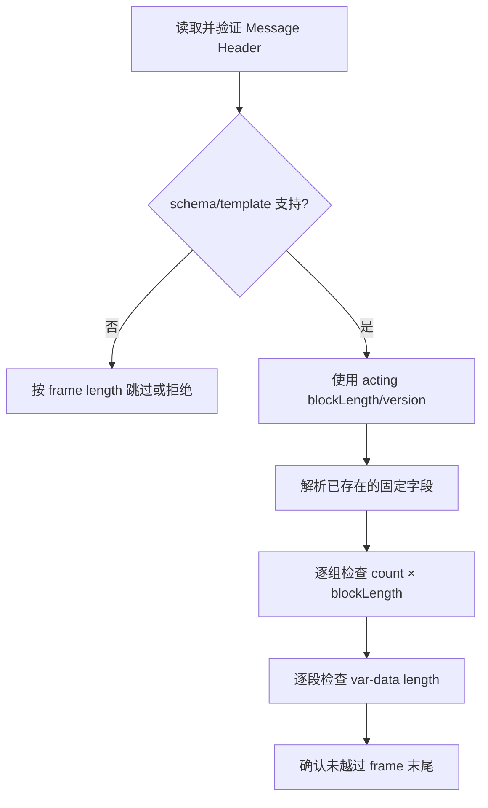
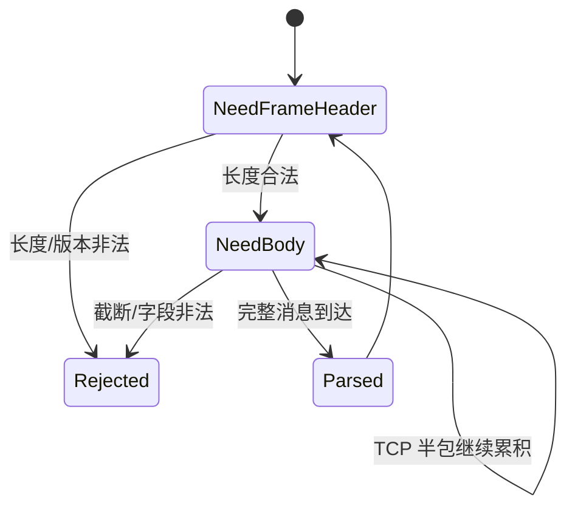

# 二进制协议解析：显式解码比 `transmute` 更可靠

二进制协议把字段编码成固定宽度整数、枚举、bit field 或变长 group。它们通常比文本紧凑，但“字段偏移固定”并不等于可以把网络指针直接强转成 Rust 引用。

本章使用 ITCH 风格消息和 SBE 概念讲解。真实实现必须以目标 venue、协议版本和 framing 规范为准。

## 1. 为什么直接强转很危险

下面是一个**故意不可运行的反例**，`WireMessage` 也刻意没有定义，因此标为 `ignore`；它只用于辨认代码审查中的危险形状，不能通过“补一个 struct”变成生产解析器。

```rust,ignore
// 不要这样做：长度、对齐、padding、endian、有效枚举值都未验证。
let message = unsafe { &*(bytes.as_ptr().cast::<WireMessage>()) };
```

它可能同时触发五类问题：

1. 输入短于 `WireMessage`，创建引用时就越界。
2. 指针不满足对齐要求。
3. `repr(C)` padding 与线路偏移不同。
4. 多字节整数按主机 endian 解释。
5. 任意 `u8` 被当作 Rust enum discriminant 会造成 UB。

`repr(packed)` 只把对齐降下来，无法解决其他问题，还会制造未对齐字段引用风险。

## 2. 一个安全的 ITCH 风格解析器

以 36 字节的 Add Order 风格消息为例，线路布局是：

```text
type(1) locate(2) tracking(2) timestamp(6) order_id(8)
side(1) shares(4) stock(8) price(4)
```

标量解码成对齐的本机值，股票代码保留定长字节：

```rust
use std::convert::TryInto;

#[derive(Debug, Clone, Copy, PartialEq, Eq)]
pub enum Side {
    Buy,
    Sell,
}

#[derive(Debug, Clone, Copy, PartialEq, Eq)]
pub struct AddOrder {
    pub stock_locate: u16,
    pub tracking_number: u16,
    pub timestamp_ns: u64,
    pub order_reference: u64,
    pub side: Side,
    pub shares: u32,
    pub stock: [u8; 8],
    pub price_units: u32,
}

#[derive(Debug, Clone, Copy, PartialEq, Eq)]
pub enum ParseError {
    Truncated { needed: usize, actual: usize },
    LengthOverflow,
    WrongType(u8),
    InvalidSide(u8),
}

fn array<const N: usize>(bytes: &[u8], start: usize) -> Result<[u8; N], ParseError> {
    let end = start.checked_add(N).ok_or(ParseError::LengthOverflow)?;
    bytes
        .get(start..end)
        .ok_or(ParseError::Truncated { needed: end, actual: bytes.len() })?
        .try_into()
        .map_err(|_| ParseError::Truncated { needed: end, actual: bytes.len() })
}

fn be_u48(bytes: [u8; 6]) -> u64 {
    let mut padded = [0_u8; 8];
    padded[2..].copy_from_slice(&bytes);
    u64::from_be_bytes(padded)
}

pub fn parse_add_order(bytes: &[u8]) -> Result<AddOrder, ParseError> {
    const LEN: usize = 36;
    if bytes.len() < LEN {
        return Err(ParseError::Truncated { needed: LEN, actual: bytes.len() });
    }
    if bytes[0] != b'A' {
        return Err(ParseError::WrongType(bytes[0]));
    }

    let side = match bytes[19] {
        b'B' => Side::Buy,
        b'S' => Side::Sell,
        other => return Err(ParseError::InvalidSide(other)),
    };

    Ok(AddOrder {
        stock_locate: u16::from_be_bytes(array(bytes, 1)?),
        tracking_number: u16::from_be_bytes(array(bytes, 3)?),
        timestamp_ns: be_u48(array(bytes, 5)?),
        order_reference: u64::from_be_bytes(array(bytes, 11)?),
        side,
        shares: u32::from_be_bytes(array(bytes, 20)?),
        stock: array(bytes, 24)?,
        price_units: u32::from_be_bytes(array(bytes, 32)?),
    })
}
```

这里没有 `unsafe`，每个偏移都能与协议表逐项核对。实际系统还要先由外层 framing 验证消息长度；同一个 UDP packet 或 TCP frame 可能包含多条消息。

### 2.1 “Zero-copy”应精确定义

- `stock: [u8; 8]` 复制 8 字节，换来独立所有权。
- 变长 payload 可以借用 `&'a [u8]`，避免大块复制。
- 数值字段解码成 `u32/u64`，避免后续每次访问都做未对齐读取和 byteswap。

是否借用应看 payload 大小、生命周期和 buffer 归还压力。为了一个很小字段延长 NIC frame 生命周期，可能得不偿失。

## 3. Cursor：解析变长结构的通用工具

```rust
use std::convert::TryInto;

#[derive(Debug)]
pub struct Cursor<'a> {
    bytes: &'a [u8],
    pos: usize,
}

impl<'a> Cursor<'a> {
    pub fn new(bytes: &'a [u8]) -> Self {
        Self { bytes, pos: 0 }
    }

    pub fn take(&mut self, len: usize) -> Option<&'a [u8]> {
        let end = self.pos.checked_add(len)?;
        let out = self.bytes.get(self.pos..end)?;
        self.pos = end;
        Some(out)
    }

    pub fn le_u16(&mut self) -> Option<u16> {
        Some(u16::from_le_bytes(self.take(2)?.try_into().ok()?))
    }

    pub fn remaining(&self) -> usize {
        self.bytes.len() - self.pos
    }
}
```

`checked_add` 很重要：不可信长度如果让 `pos + len` 溢出，后续 bounds check 可能被绕过。生产代码应返回包含字段/offset 的结构化错误，而不是只有 `None`。

## 4. SBE：版本和长度比 struct 更重要

SBE schema 通常定义：

- message header：`blockLength`、`templateId`、`schemaId`、`version`。
- fixed block：当前 template 的固定字段。
- repeating group：dimension header + 多个 entry。
- var-data：长度字段 + bytes。

代码生成器读取 schema 后，也不能跳过运行期检查：



### 4.1 Acting version

旧版本 decoder 面对新消息时，可能只认识 fixed block 的前一部分；新 decoder 面对旧消息时，新增字段可能应返回 schema 定义的 null/default。不能只用当前 Rust struct 大小决定偏移。

### 4.2 Repeating group

不要直接计算 `count * entry_len`：先用 `checked_mul`，再用 `checked_add` 和剩余 frame 长度验证。还应给 count、var-data 长度和嵌套深度设置协议/业务上限，避免资源放大。

### 4.3 Byte order

SBE schema 会声明 byte order，具体协议也可能固定一种顺序。生成代码应使用 schema 的顺序，不要因为部署机器是 x86 就默认 little-endian。

## 5. Parser 状态与错误策略



UDP 截断通常直接拒绝该数据报并触发 gap/recovery；TCP 半包则保留到下次读取。错误策略必须结合传输与 session sequence，不能把所有 parse error 都简单 `continue`。

## 6. 验证清单

- [ ] 每种 message 的最小/最大长度与外层 framing 都有测试。
- [ ] 48-bit、bit field、enum、null value、scale 和 endian 显式解码。
- [ ] 未知 template/version 的 skip/reject 行为符合协议。
- [ ] repeating group 和 var-data 使用 checked arithmetic 与上限。
- [ ] parser 对截断、超长、错 type、非法 enum 不 panic。
- [ ] golden fixture 来自已知协议版本并已脱敏。
- [ ] round-trip、参考 decoder 差分与 fuzz target 覆盖关键消息。
- [ ] 借用 payload 的生命周期不超过 packet/UMEM/mbuf 所有权。

## 7. 面试追问

### Q1：为什么 `#[repr(C, packed)]` 仍然不是安全 wire format？

它不处理 endian、版本、变长字段和有效枚举；packed 字段还可能未对齐。输入长度不足时，强转引用本身就无效。

### Q2：什么时候才值得 zero-copy？

大 payload、生命周期短且下游能直接消费时更可能受益。小标量通常解码成值更简单；借用会延迟底层 buffer 回收，需要端到端基准决定。

### Q3：SBE decoder 为什么需要 acting version 和 block length？

它们允许新旧 schema 兼容：decoder 只访问当前消息确实包含的字段，并按 schema 为缺失新增字段提供 null/default，同时能跳过未知尾部。

---

下一章：[FIX 协议解析](fix.md)
