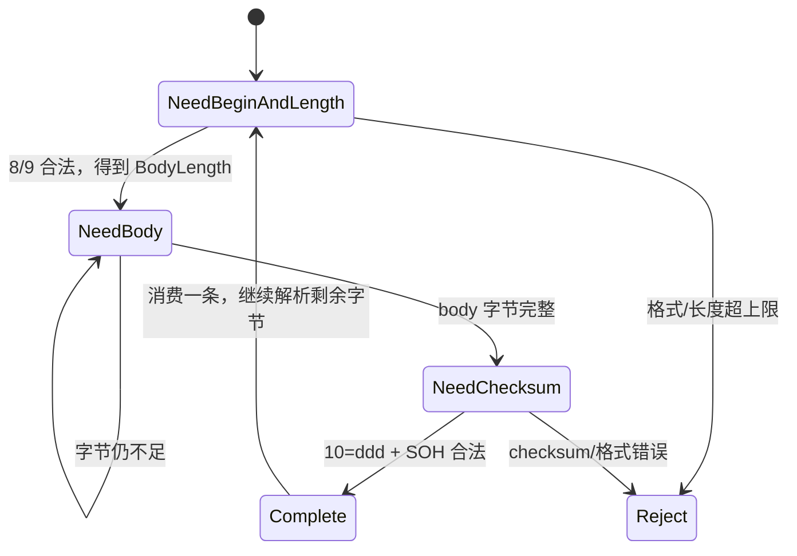
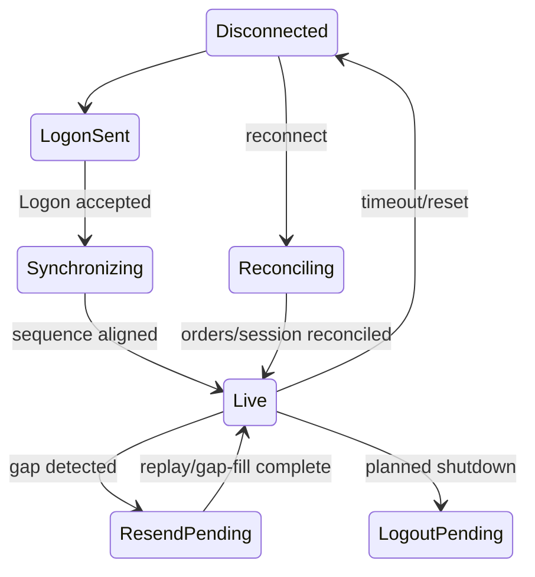

# FIX 协议解析：先做对 framing 与 session

FIX（Financial Information eXchange）使用 `tag=value<SOH>` 字段，广泛用于订单、drop copy、会话与盘后流程。文本编码通常比定长二进制消息更大，也需要十进制扫描，但是否构成瓶颈取决于消息率、字段数量、实现与硬件。

高质量 FIX 实现首先保证 BodyLength、Checksum、字段重复、session sequence 和重连恢复正确，再根据 profiling 优化 allocation 与数值转换。

## 1. FIX 消息不是一个普通字符串 Map

```text
8=FIX.4.4<SOH>9=...<SOH>35=D<SOH>...<SOH>10=123<SOH>
```

- Tag 8（BeginString）和 Tag 9（BodyLength）位于开头。
- BodyLength 从 Tag 9 后的 SOH 之后开始，计到 Tag 10 之前那个 SOH（包含该 SOH）。
- Tag 10（Checksum）是三位十进制，校验此前所有字节之和对 256 取模。
- repeating group 会重复相同 tag；存进 `HashMap<tag, value>` 可能丢失顺序与重复字段。

因此 parser 通常保留原始顺序，并针对已知 message type 解码所需字段。

## 2. TCP framing 状态机

TCP 没有消息边界：一次 read 可能是半条 FIX、完整一条或多条消息。



decoder 应有最大消息长度。在看到 `9=999999999` 时不能按声明直接扩容；先验证数字无溢出、长度不超过 session 配置，再等待 body。

Ring buffer、可压缩的滑动 buffer 或分段队列都可以使用。重点是跨 read 保留未完成字节，并避免每条消息都移动整个缓冲区。

## 3. 零额外分配的字段迭代

对热路径，可以借用完整消息中的 value slice：

```rust
const SOH: u8 = 0x01;

#[derive(Debug, Clone, Copy, PartialEq, Eq)]
pub enum FixParseError {
    MissingEquals,
    MissingSoh,
    EmptyTag,
    NonDigit,
    IntegerOverflow,
}

fn parse_u32_ascii(bytes: &[u8]) -> Result<u32, FixParseError> {
    if bytes.is_empty() {
        return Err(FixParseError::EmptyTag);
    }

    bytes.iter().try_fold(0_u32, |value, byte| {
        if !byte.is_ascii_digit() {
            return Err(FixParseError::NonDigit);
        }
        value
            .checked_mul(10)
            .and_then(|v| v.checked_add(u32::from(byte - b'0')))
            .ok_or(FixParseError::IntegerOverflow)
    })
}

pub struct Fields<'a> {
    remaining: &'a [u8],
}

impl<'a> Fields<'a> {
    pub fn new(message: &'a [u8]) -> Self {
        Self { remaining: message }
    }
}

impl<'a> Iterator for Fields<'a> {
    type Item = Result<(u32, &'a [u8]), FixParseError>;

    fn next(&mut self) -> Option<Self::Item> {
        if self.remaining.is_empty() {
            return None;
        }
        let soh = match self.remaining.iter().position(|byte| *byte == SOH) {
            Some(pos) => pos,
            None => return Some(Err(FixParseError::MissingSoh)),
        };
        let field = &self.remaining[..soh];
        self.remaining = &self.remaining[soh + 1..];

        let eq = match field.iter().position(|byte| *byte == b'=') {
            Some(pos) => pos,
            None => return Some(Err(FixParseError::MissingEquals)),
        };
        Some(parse_u32_ascii(&field[..eq]).map(|tag| (tag, &field[eq + 1..])))
    }
}
```

这段代码避免为每个字段创建 `String`，但完整实现还要：

- 先由 framing 层确定一条完整消息，不能让字段迭代跨消息。
- 验证 header/trailer 位置、BodyLength 与 Checksum。
- 按 MsgType 验证 required/conditional 字段和 repeating group。
- 决定未知 tag 是保留、忽略还是拒绝。

`nom`、手写状态机和成熟 FIX 引擎都可以做到高性能。不能在没有基准的情况下断言标准库 `parse()` 或第三方库“一定慢”。

## 4. 价格：用什么类型取决于语义

二进制浮点不能精确表示许多十进制小数，因此撮合、风控、账务和相等比较通常更适合“mantissa + scale”或 venue tick units。

```rust
#[derive(Debug, Clone, Copy, PartialEq, Eq)]
pub struct Decimal {
    pub mantissa: i64,
    pub scale: u32,
}

pub fn parse_decimal(bytes: &[u8]) -> Option<Decimal> {
    let (negative, digits) = match bytes.first() {
        Some(b'-') => (true, &bytes[1..]),
        Some(b'+') => (false, &bytes[1..]),
        _ => (false, bytes),
    };
    if digits.is_empty() {
        return None;
    }

    let mut mantissa = 0_i64;
    let mut scale = 0_u32;
    let mut seen_dot = false;
    let mut seen_digit = false;

    for byte in digits {
        match *byte {
            b'0'..=b'9' => {
                seen_digit = true;
                mantissa = mantissa.checked_mul(10)?;
                mantissa = mantissa.checked_add(i64::from(byte - b'0'))?;
                if seen_dot {
                    scale = scale.checked_add(1)?;
                }
            }
            b'.' if !seen_dot => seen_dot = true,
            _ => return None,
        }
    }

    if !seen_digit {
        return None;
    }
    Some(Decimal {
        mantissa: if negative { mantissa.checked_neg()? } else { mantissa },
        scale,
    })
}
```

随后按 instrument definition 转成 ticks，并明确多余小数位的 reject/rounding 规则。不能把所有价格固定乘 `10^8`：不同产品 scale、tick table 和负价格规则可能不同。

`f64` 并非任何场景都禁止：研究统计、近似模型或外部 API 可能合理使用。但不要把它作为需要十进制精确相等、确定性编码或账务守恒的唯一表示。

## 5. Checksum 不是可随意关闭的装饰

Checksum 能发现传输、buffer 拼接和 framing 错误。即使网络可信，应用自身的半包/粘包 bug 也可能被它发现。

若某团队想在受控链路跳过校验，必须满足协议允许、风险评估批准、端到端完整性有替代证据，并用基准证明校验确实是瓶颈。默认实现应验证它，并区分：

- BodyLength 不符。
- Checksum 数字格式错误。
- Checksum 值不符。
- session sequence gap/duplicate。

这些错误触发的恢复动作可能不同。

## 6. Session 状态机



处理 sequence 时要区分 inbound 与 outbound，持久化策略、PossDupFlag、OrigSendingTime、SequenceReset/GapFill，以及 venue 对 reset 的具体规则。不要仅凭 TCP 重连就把 sequence 置 1。

## 7. 性能优化应有条件

- 热消息可以只提取风控/路由需要的 tag；审计线程保留原始消息。
- 预分配能减少容量增长，但队列必须有界，不能用巨大 buffer 隐藏消费不足。
- `memchr`/SIMD 可能加速分隔符扫描，短消息是否受益要实测。
- 将 tag 分派成 `match` 或生成代码可避免通用 Map，但扩展 tag 与 repeating group 仍要支持。
- 优化后必须保持 golden、差分、fuzz 与 session recovery 测试全绿。

## 8. 验证清单

- [ ] TCP 半包、粘包、连续多消息和最大长度均有测试。
- [ ] BodyLength 与 Checksum 按原始 bytes 验证。
- [ ] 数字解析拒绝空值、非数字、溢出和非法 scale。
- [ ] required/conditional 字段、重复 tag 与 group 顺序符合 dictionary。
- [ ] inbound/outbound sequence、PossDup、GapFill、reset 与重连覆盖。
- [ ] 不可信长度不会触发无界分配。
- [ ] 原始敏感 FIX 日志脱敏、访问受控且不阻塞热路径。
- [ ] 与 venue/certification simulator 和独立实现做互操作测试。

## 9. 面试追问

### Q1：为什么不能对每条 FIX 直接 `split` 后放 HashMap？

它可能产生分配并丢失字段顺序和 repeating group 语义。热路径可在完整消息 slice 上迭代，只解码所需字段；是否需要优化仍由 profiling 决定。

### Q2：如何从 TCP 流判断一条 FIX 完整？

先解析固定开头的 Tag 8/9并限制 BodyLength，等待对应 body 字节，再解析固定格式 Tag 10 与尾 SOH，最后验证 BodyLength 和 Checksum。

### Q3：FIX 使用文本价格，为什么不一律存成 `f64`？

撮合/风控/账务通常需要十进制精确和确定性编码，适合 mantissa+scale/ticks；`f64` 可用于允许近似的分析，但类型选择应由业务语义决定。

---

下一章：[市场数据处理](market_data.md)
