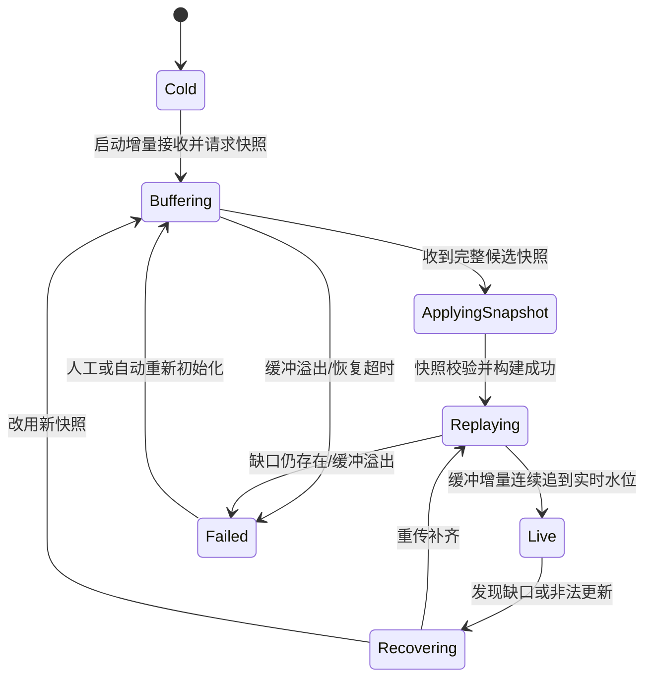
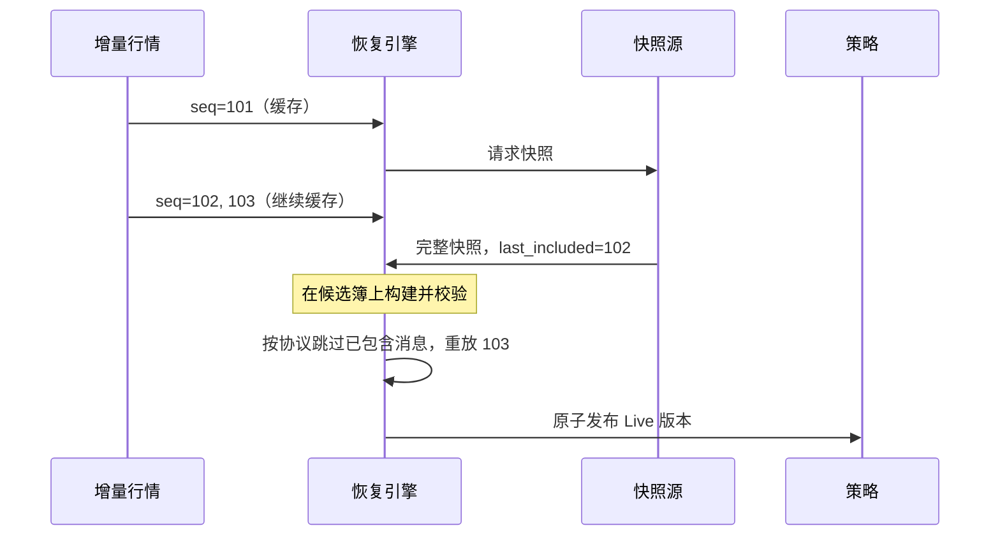

# 增量更新、快照与恢复

增量行情只发送“发生了什么变化”，所以带宽效率很高；代价是本地订单簿依赖一条**连续、语义正确的事件链**。少一条 Add，后续 Delete 就可能找不到订单；少一条成交，聚合数量就可能长期错误。

这一章的核心不是“收到缺口就清空重来”，而是回答三个问题：

1. 我怎样知道本地状态是否可信？
2. 恢复期间到来的实时消息怎样处理？
3. 什么条件满足后，才能重新向策略发布行情？

## 1. 恢复方式由协议决定

“快照 + 增量”很常见，但不是唯一模式。交易所或数据商可能提供：

- 周期性快照 + 实时增量；
- 按需快照 + 实时增量；
- A/B 两路冗余行情，即两个独立通道发送相同增量，接收方对相同序列去重并使用先到副本；
- 缺包重传（retransmission）；
- 从某个序列开始的历史重放；
- 只支持重新登录或等待下一次 refresh。

因此，恢复引擎不能只知道一个 `seq` 字段。配置至少要说明：

| 问题 | 常见差异 |
|---|---|
| 序列号作用域 | 每个包、每条消息、每个频道、每个品种或整个会话 |
| 一个包推进多少 | 固定 `+1`，或按包内消息数推进 |
| 何时重置 | 交易日、会话重连、显式 Reset，或达到上限回绕 |
| 快照基准 | 最后已包含序列、下一期待序列，或分品种水位 |
| 缺口处理 | A/B 补齐、请求重传、重新快照或停用该频道 |

序列语义必须以协议规范为准，不能只背诵 `last + 1`：有的序号按消息递增，有的按 packet、channel 或产品递增，还可能允许心跳和跳号。

## 2. 用状态机表达“行情是否可用”



可把 `Cold`、`Buffering`、`ApplyingSnapshot`、`Replaying`、`Recovering`、`Failed` 都视为**不可交易状态**；只有 `Live` 才向依赖完整订单簿的策略发布数据。某些策略能容忍降级行情，但必须显式声明，不能由恢复引擎偷偷决定。

## 3. 正确拼接快照与增量

假设某协议明确规定：快照携带 `last_included_seq`，表示它已经包含截至该序列的全部增量。典型流程是：

1. 先接收并缓存增量；
2. 同时请求或等待快照；
3. 校验快照分片、品种范围和基准序列；
4. 构建一个**候选订单簿**，不要立刻覆盖当前对象；
5. 继续接收增量，把快照之后的消息连续重放到候选簿；
6. 检查订单簿不变量，然后一次性发布候选簿并进入 `Live`。



这里的“跳过 `<= 102`”只对**普通单调序列且规范定义明确**的例子成立。若序列会回绕、按包计数，或者快照按品种给出多个水位，就不能直接套用数值大小比较。

### 3.1 为什么要继续缓存

解析大快照时，实时流不会暂停。如果停止接收，恢复刚完成就会再次出现缺口。缓存必须有容量上限；一旦溢出，不能覆盖最老消息后假装恢复成功，通常应拒绝这个候选快照、报警，并按协议重新快照或请求重传。

“消息不能静默丢失”不等于“内存必须无限增长”。有界缓存配合明确失败，才是可控设计。

## 4. 一个安全的骨架

下面代码只展示控制面，不绑定具体交易所。`SequenceRule` 负责协议特有的连续性判断，避免把 `last + 1` 写死在业务代码中：

```rust
use std::collections::VecDeque;

#[derive(Debug, Clone)]
struct Incremental {
    seq: u64,
    payload: Vec<u8>,
}

trait SequenceRule {
    fn already_in_snapshot(&self, seq: u64, snapshot_base: u64) -> bool;
    fn is_next(&self, previous: u64, current: u64) -> bool;
}

#[derive(Debug, Clone, Copy, PartialEq, Eq)]
enum State {
    Buffering,
    Replaying,
    Live,
    Failed,
}

#[derive(Debug)]
enum RecoveryError {
    BufferFull,
    Gap { previous: u64, received: u64 },
    InvalidSnapshot,
    InvalidUpdate,
}

struct RecoveryEngine<R> {
    state: State,
    rule: R,
    buffer: VecDeque<Incremental>,
    buffer_limit: usize,
    last_applied: Option<u64>,
    // 真实实现还会保存 live_book 和 candidate_book
}

impl<R: SequenceRule> RecoveryEngine<R> {
    fn on_incremental(&mut self, msg: Incremental) -> Result<(), RecoveryError> {
        match self.state {
            State::Live => self.apply_live(msg),
            State::Buffering | State::Replaying => {
                if self.buffer.len() == self.buffer_limit {
                    self.state = State::Failed;
                    return Err(RecoveryError::BufferFull);
                }
                self.buffer.push_back(msg);
                Ok(())
            }
            State::Failed => Err(RecoveryError::InvalidUpdate),
        }
    }

    fn apply_live(&mut self, msg: Incremental) -> Result<(), RecoveryError> {
        let previous = self.last_applied.ok_or(RecoveryError::InvalidUpdate)?;
        if !self.rule.is_next(previous, msg.seq) {
            let received = msg.seq;
            self.state = State::Buffering; // 同时触发协议规定的恢复动作
            self.push_bounded(msg)?;
            return Err(RecoveryError::Gap { previous, received });
        }

        // decode_and_apply(&msg.payload)?; 失败时也应使订单簿失效
        self.last_applied = Some(msg.seq);
        Ok(())
    }

    // 前提：snapshot 已经完整校验并构建到 candidate book；buffer 已由
    // A/B 仲裁层去重并按协议顺序排列。apply 只修改 candidate book。
    fn replay_after_snapshot(
        &mut self,
        snapshot_base: u64,
        mut apply: impl FnMut(&Incremental) -> Result<(), RecoveryError>,
    ) -> Result<(), RecoveryError> {
        self.state = State::Replaying;
        self.last_applied = Some(snapshot_base);

        while let Some(msg) = self.buffer.pop_front() {
            if self.rule.already_in_snapshot(msg.seq, snapshot_base) {
                continue;
            }

            let previous = self.last_applied.ok_or(RecoveryError::InvalidSnapshot)?;
            if !self.rule.is_next(previous, msg.seq) {
                let received = msg.seq;
                self.buffer.push_front(msg); // 保留超前消息，等待重传或新快照
                self.state = State::Buffering;
                return Err(RecoveryError::Gap { previous, received });
            }

            if let Err(error) = apply(&msg) {
                self.state = State::Failed;
                return Err(error);
            }
            self.last_applied = Some(msg.seq);
        }

        self.state = State::Live;
        Ok(())
    }

    fn push_bounded(&mut self, msg: Incremental) -> Result<(), RecoveryError> {
        if self.buffer.len() == self.buffer_limit {
            self.state = State::Failed;
            return Err(RecoveryError::BufferFull);
        }
        self.buffer.push_back(msg);
        Ok(())
    }
}
```

示例使用 `VecDeque`，它只是一个普通双端队列，并不自动“无锁”。若接收线程与恢复线程并发访问，需要明确所有权：例如单线程状态机、SPSC 队列，或经过验证的同步结构。

代码里 `payload: Vec<u8>` 是为了易懂。生产环境可用引用计数 buffer、对象池或借用切片降低复制，但要先保证数据在解析期间仍然有效。不要为了“零拷贝”直接保存会被网卡或接收循环复用的裸指针。

## 5. 序列号回绕不是一道独立公式

对于无符号 N 位序列号，常见的模块比较是：

```rust
fn is_newer_u32(candidate: u32, reference: u32) -> bool {
    let distance = candidate.wrapping_sub(reference);
    distance != 0 && distance < (1_u32 << 31)
}
```

它只有在以下前提下才有意义：

- 协议确实使用模 `2^32` 回绕，而不是重置会话；
- 两个待比较值的真实距离小于半个序列空间；
- 已经明确初始序列、重复包和一次包内多消息的规则。

若一次断线时间足以跨过半个空间，仅凭两个数无法判断先后。此时必须依靠会话 ID、交易日、快照 epoch 或协议提供的 reset 标记。

## 6. A/B 仲裁、乱序与重传

收到 `105` 而期待 `104` 时，不应立刻把 `105` 当作坏消息删除。可能的处理顺序是：

1. 暂存超前消息；
2. 查看 B 路是否已经收到 `104`；
3. 若协议支持，在期限内请求 `104` 重传；
4. 补齐后按序应用 `104, 105`；
5. 超时、容量溢出或重传不可用时，使订单簿失效并重新快照。

时间窗口和缓存大小来自链路抖动、峰值消息率、重传服务等级目标（Service-Level Agreement，SLA）与内存预算，不能照搬固定数字。A/B 两路也要去重，并确认它们的序列作用域确实相同。

## 7. 订单簿校验：异常不一定等于数据错

“买一价高于卖一价”可能是本地丢包，也可能是市场规则允许的短暂状态、不同事件尚未原子发布，或你错误处理了交易/删除消息。不要简单写成“等下一条 Trade 就会修复”。正确做法是：

- 查协议是否允许 locked/crossed 状态；
- 对照原始消息、序列和时间戳定位原因；
- 校验未知订单引用、负数量、档位聚合和快照完整性；
- 若无法证明本地状态可信，标记 `Stale` 并停止依赖该簿交易。

## 8. 做题方法：用快照屏障合并增量

1. **先写三个编号**：本地已应用序号、快照所代表的基准序号、恢复期间缓存的增量范围；明确各字段是“最后包含”还是“下一个期望”。
2. **画恢复状态机**：Healthy→Gap/Stale→FetchingSnapshot→Replaying→Healthy，给每个迁移写触发事件、超时与失败回退。
3. **按序合并**：请求快照期间继续有界缓存增量；安装快照后丢弃不晚于基准的事件，从紧邻基准的下一事件连续回放，遇到二次 gap 重新恢复。
4. **限制资源与代数**：旧 generation 的快照/重传响应不得覆盖新一轮恢复；缓存上限、快照超时和重试预算有明确动作。
5. **验算**：若 `expected_seq` 表示“下一条期望序号”，恢复后它应等于最后回放序号加一；若字段表示“最后已应用序号”，才与最后回放序号相等。book 不变量成立，最终 hash 与同一数据全量顺序重放相同；恢复期间没有对 stale 状态下新风险订单。

常见陷阱：快照到达就直接清空缓存；基准序号包含性理解反一位；恢复中继续发布可信行情；旧快照晚到覆盖新状态；假设所有交易所都在快照中提供相同序号边界。

## 9. 上线前校验清单

- [ ] 明确序列号的作用域、步进、重置、回绕与重复规则。
- [ ] 明确快照水位字段到底表示“最后已包含”还是“下一期待”。
- [ ] 快照分片、结束标记、品种集合和校验值全部验证后才构建候选簿。
- [ ] 应用快照期间持续接收增量；缓存有界且溢出会显式失败。
- [ ] 缺口时先按协议尝试 A/B 或重传，不能静默跳过。
- [ ] 旧会话、旧交易日或旧恢复 epoch 的消息不会进入新订单簿。
- [ ] 只有通过连续性和订单簿不变量检查的状态才发布为 `Live`。
- [ ] 用丢包、重复、乱序、回绕、断线和缓冲溢出测试恢复流程。

## 10. 高频面试题

### Q1：为什么收到快照后不能马上停止缓存增量？

因为快照解析和构建期间实时行情仍在前进。停止接收会制造新的缺口。应在候选簿上应用快照，同时继续有界缓存增量，再连续重放并一次性发布。

### Q2：缓存满了能不能覆盖最老消息？

通常不能。覆盖会破坏恢复所需的连续事件链，却可能让系统错误进入 `Live`。更安全的做法是让候选恢复失败，报警并重新快照或走重传；具体动作由协议和业务降级策略决定。

### Q3：`wrapping_sub` 为什么不能解决所有序列号问题？

模块比较依赖“真实距离小于半个序列空间”等前提，也无法区分会话重置与自然回绕。必须结合协议的会话 ID、reset 规则和快照基准。

---

下一章：[订单路由系统](order_routing.md)
