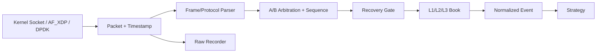
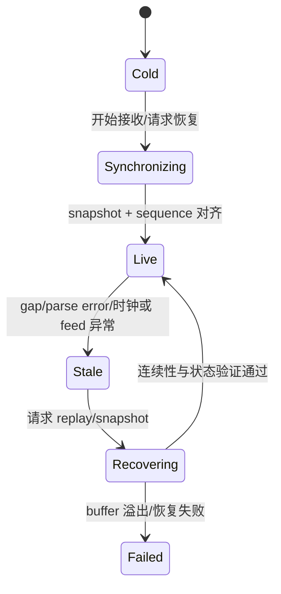

# 市场数据处理：快之前，先保证“可交易”

市场数据流水线把交易所 packet 转换为策略可用状态。它需要同时满足三件事：消息没有静默缺失、状态转换符合 venue 规则、延迟和吞吐满足本系统 SLA。

“必须在固定微秒内完成”或“热路径绝不能有任何 allocation”都不是通用结论。目标要从交易所峰值流量、策略时效、硬件与风险预算推导，并通过测量验证。

## 1. 数据流水线



内核旁路只是 Capture 的一种选择。若标准 socket 已满足 SLA，它通常拥有更成熟的协议栈和运维工具。

每一段都应有独立时间戳或计数器，才能回答延迟发生在哪：NIC/driver、parser、arbitration、book 还是 strategy queue。

## 2. 三个核心指标

### 2.1 Correctness

- packet/message sequence gap、duplicate 与 out-of-order 可检测。
- A/B feed 同一逻辑消息只应用一次。
- snapshot/replay 完成前，策略不能使用半同步状态。
- parser/订单簿遇到非法消息时进入明确的 stale/recovery 状态。

### 2.2 Capacity

容量规划使用**目标 feed 的真实数据**：

- 平均与峰值 packets/messages per second。
- microburst 中最大 packet/message 数。
- packet size、一个 packet 内消息数量。
- 多 channel 同时 burst 的相关性。
- 最长调度暂停与恢复期间 buffer 需求。

平均吞吐够用不代表 burst 不丢包。队列只能吸收暂时差速，不能修复长期处理能力不足。

### 2.3 Latency distribution

至少观察 P50、P99、P99.9、最大值和超过策略时效预算的次数。平均值改善但 stale/gap 增加不是成功优化。

## 3. Book validity 状态机



策略接口不应只返回 `&OrderBook`，还应暴露 validity/epoch。发现 gap 后继续发布“看起来最新”的不完整 book，通常比暂停信号更危险。

```rust
#[derive(Debug, Clone, Copy, PartialEq, Eq)]
pub enum BookStatus {
    Cold,
    Synchronizing,
    Live { epoch: u64, last_seq: u64 },
    Stale { epoch: u64 },
    Recovering { epoch: u64 },
}
```

`epoch` 可在每次重新建簿时递增，避免策略把旧 book 的缓存/订单决策误用到新状态。

## 4. A/B 仲裁不是只取最大序列号

交易所可能提供两路内容相同但到达时间不同的 feed。仲裁器要根据协议明确：

- sequence 是 packet 级还是 message 级，一个 packet 覆盖多少 sequence。
- 两路 sequence 是否同一命名空间。
- out-of-order 等待窗口和超时。
- 两路都缺失时走 replay 还是 snapshot。
- sequence rollover 与 session reset。

只维护 `max_seq_seen` 会在先收到后续 packet 时错误丢弃稍晚到达、但正好能补 gap 的另一通道 packet。

## 5. 数据结构没有统一赢家

### 5.1 Allocation

在最高频更新循环中，预分配和对象池常能减少 allocator 抖动；但初始化、恢复、控制面或低频路径使用受控 allocation 可能完全合理。

重点是：

- allocation 是否出现在经过 profiling 证明的关键路径。
- 容器容量是否有业务上限和溢出策略。
- 为“零分配”引入的 unsafe/固定上限是否值得。

### 5.2 L2 容器

- 稠密且 tick grid 稳定：经验证的 flat ladder 可能很好。
- 价格范围大或 tick table 分段：排序 vector、B-tree、hash + best-price index 可能更合适。
- 更新类型是“绝对量”还是“增量量”会改变状态逻辑。

不能把 `BTreeMap` 一概当错误，也不能假设所有产品的 `price -> array index` 都是固定线性关系。

### 5.3 Batching

批处理能摊薄 syscall 和函数调用成本，也会让首条消息等待。常见做法是“最多处理 N 条已到达消息”，而不是等待凑满 N。N、时间预算和 timer/TX 公平性必须实测。

## 6. Normalization 的损失风险

统一内部事件方便策略跨 venue，但归一化不能抹掉重要语义：

```rust
#[derive(Debug, Clone, Copy, PartialEq, Eq)]
pub struct VenueId(pub u16);
#[derive(Debug, Clone, Copy, PartialEq, Eq)]
pub struct InstrumentId(pub u32);
#[derive(Debug, Clone, Copy, PartialEq, Eq)]
pub struct PriceTicks(pub i64);
#[derive(Debug, Clone, Copy, PartialEq, Eq)]
pub struct Quantity(pub u64);
#[derive(Debug, Clone, Copy, PartialEq, Eq)]
pub struct ExchangeOrderId(pub u64);
#[derive(Debug, Clone, Copy, PartialEq, Eq)]
pub struct ExchangeTime(pub u64);
#[derive(Debug, Clone, Copy, PartialEq, Eq)]
pub struct HardwareTime(pub u64);
#[derive(Debug, Clone, Copy, PartialEq, Eq)]
pub struct MonotonicTime(pub u64);
#[derive(Debug, Clone, Copy, PartialEq, Eq)]
pub struct VenueFlags(pub u32);

#[derive(Debug, Clone, Copy, PartialEq, Eq)]
pub enum Action { Add, Modify, Delete, Trade }

#[derive(Debug, Clone, Copy, PartialEq, Eq)]
pub enum Side { Buy, Sell }

#[derive(Debug, Clone, PartialEq, Eq)]
pub struct MdUpdate {
    pub venue: VenueId,
    pub instrument: InstrumentId,
    pub source_seq: u64,
    pub action: Action,
    pub side: Option<Side>,
    pub price: Option<PriceTicks>,
    pub quantity: Option<Quantity>,
    pub order_id: Option<ExchangeOrderId>,
    pub exchange_time: Option<ExchangeTime>,
    pub hardware_rx_time: Option<HardwareTime>,
    pub ingest_time: MonotonicTime,
    pub flags: VenueFlags,
}
```

注意：`#[repr(C)]` 与内部消息是否正确/快速没有直接关系，只有 FFI 或明确共享内存 ABI 才需要布局契约。

Normalization 还要保留 auction、implied、hidden、trade condition、delete reason 等策略可能需要的 venue flags。无法表达时，版本化内部 schema，而不是静默丢字段。

## 7. 时间戳不要混用

- exchange time：交易所事件时间，可能来自另一时钟。
- hardware RX time：NIC 接收 timestamp，需 PHC/PTP 同步。
- ingest time：本进程单调时钟，适合内部 duration。
- strategy publish time：book 更新对策略可见的时间。

不同 clock domain 未校准前不能直接相减。纳秒单位也不代表纳秒精度。

## 8. 做题方法：从包序号推进到可交易状态

1. **读题先画流水线**：packet→message→规范化事件→订单簿→策略；在每段标 sequence、时间戳、产品/频道和丢弃原因。
2. **列每类输入分支**：期望序号、重复/旧包、向前 gap、乱序缓存、会话重置和坏消息分别更新什么状态，哪些分支必须把 book 标为 stale。
3. **逐事件推演状态表**：记录 `expected_seq`、缓存范围、book generation、是否可交易和恢复请求；一个 packet 含多条消息时同时推进 packet 与 message 口径。
4. **故障证据同窗对账**：A/B feed、NIC/内核 drop、解析拒绝、应用队列和序号 gap 在同一时间窗口比较，先找最早分叉。
5. **验算**：恢复后事件连续、没有重复应用；异常产品不会污染其他分片；“可交易”只能由完整性与市场状态共同恢复。

常见陷阱：接收成功等于数据连续；坏包只记日志后继续交易；用本机到达顺序替代交易所序号；混淆 packet、message 和 event 数；不同 venue 的 reset、retransmission 和 snapshot 规则未隔离。

## 9. 验证清单

- [ ] 按 feed 规范确认 packet/message sequence、count、scope 与 rollover。
- [ ] A/B duplicate、单路 gap、双路 gap、乱序和 channel reset 均有测试。
- [ ] parser error 会使相关 book stale，不会静默跳过关键增量。
- [ ] snapshot/replay 期间策略无法读取半完成状态。
- [ ] L1/L2/L3 不变量、数量守恒和未知 delete/modify 有明确处理。
- [ ] 真实 microburst 下同时验证 NIC、socket/ring、应用 drop 与 sequence gap。
- [ ] 队列、book、instrument 和 recovery buffer 都有容量上限。
- [ ] normalization 保留策略需要的 venue 语义和原始 sequence。
- [ ] 时间戳注明 clock source，同域才计算 duration。
- [ ] 关键路径优化同时比较正确性、P99+ 和 CPU/packet。

## 9. 面试追问

### Q1：检测到行情 sequence gap 后是否还能继续更新订单簿？

取决于 feed recovery 规则。通常先把 book 标记 stale，停止向策略发布；可缓存后续消息并请求 replay/snapshot，只有连续性与状态重新验证后才回到 Live。

### Q2：为什么不能说市场数据热路径绝对不能 allocation？

allocation 可能制造抖动，但是否构成瓶颈要测量。预分配也会引入容量上限和复杂度；恢复/低频路径使用有界 allocation 可能更安全、简单。

### Q3：A/B feed 为什么不能简单“谁先到用谁，seq 小的全丢”？

先到的后续 packet 可能暴露 gap，稍后另一通道正好补齐缺口。仲裁器要维护期望范围、有限窗口和协议定义的 packet/message count。

---

下一章：[L1/L2/L3 数据构建](order_book_data.md)
