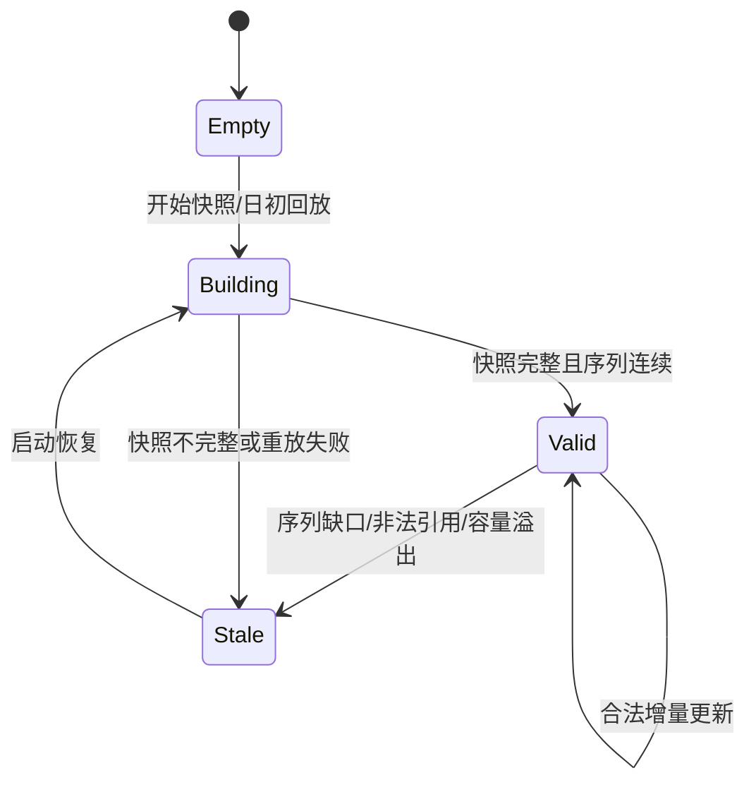

# L1 / L2 / L3 订单簿数据

订单簿（Order Book）回答的是一个很朴素的问题：**市场上现在有哪些买卖意愿？**

L1、L2、L3 不是简单的“低、中、高配”，而是三种不同的信息粒度。粒度越细，通常消息越多、状态越复杂，但具体数据量取决于交易所、品种和行情活跃度，不能用固定倍数概括。

## 1. 先分清三个层级

| 层级 | 常见名称 | 能看到什么 | 看不到什么 |
|---|---|---|---|
| L1 | BBO / Top of Book | 最优买价、最优卖价及其数量 | 更深档位、单笔订单 |
| L2 | MBP / Price Levels | 每个价格档位的聚合数量 | 同价位内有哪些订单及其先后关系 |
| L3 | MBO / Order by Order | 公开可见订单的增、删、改 | 隐藏量、冰山单未展示部分，以及交易所未公开的优先级信息 |

有些协议发送“全深度 L2”，有些只发送前 5 档或 10 档；有些市场提供 L3，有些只提供 L2。实现前必须先读协议规范，而不是从“L2/L3”这个名称猜字段含义。

## 2. L1：一次读到一致的最优价

最直接的数据结构如下：

```rust
#[derive(Debug, Clone, Copy, PartialEq, Eq)]
pub struct Bbo {
    pub bid_price: i64, // 定点数，例如 100_25 表示 100.25
    pub bid_qty: u64,
    pub ask_price: i64,
    pub ask_qty: u64,
}
```

难点不在字段数量，而在**一致性快照**。如果行情线程分四次写字段，策略线程可能读到“新买价 + 旧买量”。常见方案有：

- 同一线程构建并使用 BBO：最简单，不需要同步；
- 消息传递：行情线程把完整快照放进 SPSC 队列；
- 双缓冲或序列锁：写者发布完整版本，读者发现版本变化就重读；
- 原子打包：仅当价格、数量和状态位确实能无损装进目标整数时使用。

原子打包不是通用答案。要先证明位宽够用，并定义空档、负价格、数量溢出和字节布局。序列锁也不是“免费”的：写入频繁时，读者可能多次重试。

## 3. L2：价格档位不是永远等距的数组

L2 通常维护每个价位的聚合数量：

```text
卖三  100.03  700
卖二  100.02  300
卖一  100.01  120
-----------------
买一  100.00  250
买二   99.99  400
买三   99.98  180
```

### 3.1 先理解更新语义

协议可能发送：

- **绝对量**：把 100.00 的买量设置为 250；
- **变化量**：给 100.00 的买量增加或减少某个值；
- **按档位更新**：修改“买二”，并可能使后面的档位移动；
- **按价格更新**：修改明确的价格档位。

这四种语义不能混用。例如把“绝对量 50”误当成“增加 50”，订单簿不会立刻崩溃，却会悄悄漂移，直到本地状态与交易所明显不一致。

### 3.2 稠密阶梯与稀疏容器

`Vec` 不一定优于 `BTreeMap`，选择取决于价格空间：

| 数据结构 | 适合场景 | 主要代价 |
|---|---|---|
| 固定价格阶梯 `Vec` | 价格范围窄、tick 固定、更新很密集 | 范围大时浪费内存，越界处理必须严格 |
| 排序 `Vec<(Price, Qty)>` | 只维护少量档位，读多写少 | 插入删除可能搬移元素 |
| `BTreeMap` | 价格稀疏、范围大、需要有序遍历 | 节点和指针跳转成本较高 |
| 哈希表 + 最优价索引 | 按价格更新频繁，顺序遍历较少 | 删除最优档后要重新寻找最优价 |

固定阶梯只有在**单一 tick、明确价格边界**下才安全。现实中 tick 可能随价格区间、品种或交易阶段变化，某些产品也可能出现负价格。下面的示例故意让映射失败时返回 `None`，避免负数转 `usize` 后变成巨大下标：

```rust
use std::convert::TryFrom;

#[derive(Debug, Clone, Copy)]
struct PriceGrid {
    min_price: i64,
    max_price: i64,
    tick: i64,
}

impl PriceGrid {
    fn len(self) -> Option<usize> {
        if self.tick <= 0 || self.max_price < self.min_price {
            return None;
        }
        let span = self.max_price.checked_sub(self.min_price)?;
        if span.rem_euclid(self.tick) != 0 {
            return None; // 上边界也必须落在同一价格网格上
        }
        let levels = span.checked_div(self.tick)?.checked_add(1)?;
        usize::try_from(levels).ok()
    }

    fn index_of(self, price: i64) -> Option<usize> {
        if self.tick <= 0 || !(self.min_price..=self.max_price).contains(&price) {
            return None;
        }
        let offset = price.checked_sub(self.min_price)?;
        if offset.rem_euclid(self.tick) != 0 {
            return None; // 不在合法 tick 上
        }
        usize::try_from(offset / self.tick).ok()
    }
}

struct FlatL2 {
    grid: PriceGrid,
    bids: Vec<u64>,
    asks: Vec<u64>,
}

impl FlatL2 {
    fn set_level(&mut self, price: i64, qty: u64, is_bid: bool) -> Result<(), &'static str> {
        let index = self.grid.index_of(price).ok_or("price outside configured grid")?;
        let side = if is_bid { &mut self.bids } else { &mut self.asks };
        let slot = side.get_mut(index).ok_or("book/grid size mismatch")?;
        *slot = qty;
        Ok(())
    }
}
```

生产系统还要处理 tick 表切换、价格带更新和合约换月。不要把示例中的单一 `tick` 当成所有市场的规则。

## 4. L3：维护公开订单，而不是“看穿所有人”

L3/MBO 消息通常以订单 ID 为主键：

```text
Add(order_id, side, price, qty)
Modify(order_id, new_qty)
Delete(order_id)
Execute(order_id, executed_qty)
```

本地需要两条查询路径：

1. 交易所删除订单 `#123` 时，能按订单 ID 找到它；
2. 策略查询某价位时，能找到该价位的聚合量和可见队列。

一个容易理解的起点是“订单索引 + 价格档位”：

```rust
use std::collections::{BTreeMap, HashMap, VecDeque};

#[derive(Debug)]
struct VisibleOrder {
    price: i64,
    qty: u64,
    side: Side,
}

#[derive(Debug, Clone, Copy, PartialEq, Eq, PartialOrd, Ord, Hash)]
enum Side { Buy, Sell }

struct L3Book {
    orders: HashMap<u64, VisibleOrder>,
    queues: BTreeMap<(Side, i64), VecDeque<u64>>,
}
```

这不是最终性能方案，却很适合先把语义做对。基准测试证明哈希、树节点或分配确实是瓶颈后，再考虑预分配 arena、开放寻址表、侵入式链表或按品种分片。

即便有 L3，也不能自然推出“自己的精确排队位置”：

- 冰山单可能只展示一部分；
- 市场可能采用 pro-rata、做市商优先等规则，而非纯价格—时间优先；
- 修改订单可能保留或失去优先级，取决于交易所规则；
- 数据源可能省略某些订单类型或参与者信息。

因此更准确的说法是：L3 可用于**估计公开可见队列中的相对位置**，准确度必须由市场规则和成交回放验证。

## 5. 订单簿状态机与不变量



只有 `Valid` 状态的订单簿才应提供给依赖一致行情的策略。建议每次更新至少检查：

- Add 的订单 ID 在当前会话作用域内不能重复；
- Modify/Delete/Execute 引用的订单必须存在，除非协议明确允许例外；
- 执行量和减少量不能超过当前可见量；
- 聚合档位数量等于该档位可见订单数量之和；
- 最优买价和卖价来自当前非空档位；
- 序列缺口或快照切换后，旧恢复周期（epoch）的消息不能污染新订单簿。

注意：订单 ID 是否跨交易日唯一由协议决定。很多场景只能在“连接、频道、交易日”组合范围内识别，不能默认全局永久唯一。

## 6. 上线前校验清单

- [ ] 明确数据是 L1、MBP 还是 MBO，以及深度是否受限。
- [ ] 明确更新是绝对量、变化量、按价格还是按档位。
- [ ] 价格使用定点整数，并验证 tick、价格带、负价格和溢出。
- [ ] 对重复 Add、未知 Delete、超量 Execute 定义明确策略。
- [ ] 订单簿有 `Valid/Stale` 状态，失效时策略停止依赖它下单。
- [ ] 用协议样例和录制数据验证聚合量、最优价与恢复结果。
- [ ] 数据结构选择有基准测试和容量依据，而不是只凭“大 O”。

## 7. 高频面试题

### Q1：为什么不能直接断言 `Vec` 一定比 `BTreeMap` 好？

因为性能取决于价格范围、稀疏程度、更新方式和查询模式。固定数组在小而稠密的价格空间很快，但大范围稀疏数据会浪费内存；树结构更灵活，还天然支持有序遍历。应先保证语义正确，再用目标行情做基准测试。

### Q2：有 L3 数据就能知道自己的准确排队位置吗？

不一定。隐藏量、冰山单、非 FIFO 撮合规则、订单修改优先级和数据源可见性都会影响结果。L3 通常只能支持基于公开信息的估计。

### Q3：订单簿为什么需要 `Stale` 状态？

序列缺口、未知订单引用或快照失败后，本地状态可能已经与交易所分叉。继续输出一个“看起来正常”的最优价比显式失效更危险，因此要阻止策略使用，并进入恢复流程。

---

下一章：[增量更新与快照](incremental_updates.md)
