# 订单路由系统

订单路由（Order Routing）把策略的交易意图变成交易所能理解的消息，并把交易所回报还原成可靠的订单状态。路由系统必须一直守住以下不变量：

1. **不绕过风控**；
2. **不把未知状态伪装成成功或失败**；
3. **不静默丢失已经接受的请求和回报**；
4. 性能优化不能破坏前三条。

## 1. 一笔订单经过什么路径


`write()` 成功只表示字节被操作系统接受，**不表示交易所已经接受订单**。即使 TCP 已确认收到，也不等于业务层 Ack。订单最终处于什么状态，只能根据交易所协议回报、查询和恢复流程判断。

## 2. 先建立订单状态机

对于新订单，可以从下面的简化状态机开始：

```mermaid
stateDiagram-v2
    [*] --> Intent
    Intent --> RejectedLocally: 参数/风控失败
    Intent --> AcceptedLocally: 网关接受并分配 ID
    AcceptedLocally --> PendingNew: 已排队或正在发送
    PendingNew --> Working: 交易所 Ack
    PendingNew --> RejectedByVenue: 交易所 Reject
    PendingNew --> PartiallyFilled: 成交回报先于或替代独立 Ack
    PendingNew --> Filled: 全部成交回报先于或替代独立 Ack
    PendingNew --> Unknown: 断线且结果不确定
    Working --> PartiallyFilled: 部分成交
    Working --> PendingCancel: 发出撤单
    PartiallyFilled --> PendingCancel: 发出撤单
    PendingCancel --> Cancelled: 撤单确认
    PendingCancel --> Filled: 撤单前已全部成交
    PendingCancel --> Unknown: 断线且结果不确定
    Working --> Filled: 全部成交
    PartiallyFilled --> Filled: 剩余量成交
    Unknown --> Working: 查询/回放后确认仍挂单
    Unknown --> Filled: 查询/回放后确认已成交
    Unknown --> Cancelled: 查询/回放后确认已撤
```



真实协议还可能有 Replace、Expired、Suspended 等状态。关键原则是：**网络错误产生的往往是 Unknown，而不是 Rejected**。此时贸然重发可能产生重复订单，贸然认为失败又可能漏掉真实持仓。

## 3. 内部模型与线格式分开

内部结构体服务于业务语义，线格式（wire format）服务于协议。两者不要靠内存布局“碰巧相同”：

```rust
#[derive(Debug, Clone, Copy, PartialEq, Eq)]
enum Side { Buy, Sell }

#[derive(Debug, Clone, Copy)]
struct NewOrder {
    instrument_id: u32,
    price: i64,       // 定点数
    quantity: u64,
    side: Side,
    cl_ord_id: u64,
}

#[derive(Debug, Clone, Copy)]
enum Request {
    New(NewOrder),
    Cancel { cl_ord_id: u64, original_id: u64 },
}
```

`#[repr(C)]` 只约束部分内存布局；它不会自动解决字节序、填充、字符串宽度、协议版本或校验字段。`#[repr(packed)]` 还可能带来未对齐访问。因此这里采用显式编码。

### 3.1 有边界检查的定长编码

```rust
use std::convert::TryFrom;
# #[derive(Debug, Clone, Copy, PartialEq, Eq)]
# enum Side { Buy, Sell }
# #[derive(Debug, Clone, Copy)]
# struct NewOrder {
#     instrument_id: u32,
#     price: i64,
#     quantity: u64,
#     side: Side,
#     cl_ord_id: u64,
# }

#[derive(Debug)]
enum EncodeError {
    BufferTooSmall,
    QuantityOutOfRange,
}

struct Writer<'a> {
    bytes: &'a mut [u8],
    pos: usize,
}

impl<'a> Writer<'a> {
    fn put(&mut self, src: &[u8]) -> Result<(), EncodeError> {
        let end = self.pos.checked_add(src.len()).ok_or(EncodeError::BufferTooSmall)?;
        let dst = self.bytes.get_mut(self.pos..end).ok_or(EncodeError::BufferTooSmall)?;
        dst.copy_from_slice(src);
        self.pos = end;
        Ok(())
    }

    fn put_u8(&mut self, value: u8) -> Result<(), EncodeError> {
        self.put(&[value])
    }

    fn put_u32_be(&mut self, value: u32) -> Result<(), EncodeError> {
        self.put(&value.to_be_bytes())
    }

    fn put_u64_be(&mut self, value: u64) -> Result<(), EncodeError> {
        self.put(&value.to_be_bytes())
    }

    fn put_i64_be(&mut self, value: i64) -> Result<(), EncodeError> {
        self.put(&value.to_be_bytes())
    }
}

fn encode_new(order: &NewOrder, out: &mut [u8]) -> Result<usize, EncodeError> {
    // 假设示例协议的数量字段只有 u32；真实字段顺序和字节序看规范。
    let quantity = u32::try_from(order.quantity).map_err(|_| EncodeError::QuantityOutOfRange)?;
    let mut writer = Writer { bytes: out, pos: 0 };

    writer.put_u8(b'O')?;
    writer.put_u64_be(order.cl_ord_id)?;
    writer.put_u32_be(order.instrument_id)?;
    writer.put_u8(match order.side { Side::Buy => b'B', Side::Sell => b'S' })?;
    writer.put_u32_be(quantity)?;
    writer.put_i64_be(order.price)?; // 本示例假设协议字段是大端 i64

    Ok(writer.pos)
}
```

若协议把价格定义为无符号整数，则负值必须在风控阶段拒绝，并经过 `u64::try_from` 后再编码。字段的有符号性、宽度和字节序都要逐项照规范实现，不能凭示例猜测。

实际项目应为每一种消息写“黄金字节”测试：给定订单，编码结果逐字节等于协议样例；再做边界值、短 buffer、非法枚举和数值溢出测试。

## 4. ClOrdID：目标是可追踪且不冲突

客户端订单 ID（ClOrdID）的要求来自交易所协议和恢复设计：

- 在协议规定的作用域内唯一；
- 长度和字符集合法；
- 重启、主备切换后不与旧订单冲突；
- 能在回报、日志和对账中稳定关联。

通用唯一标识符（Universally Unique Identifier，UUID）并非天然不可用。如果协议接受其长度，且生成/编码成本经过测量符合预算，它可以提供清晰的唯一性。高消息率路径也常用紧凑整数或预生成 ID，但必须说明重启之后怎样避免复用旧 ID。

下面是单线程整数生成器的思路：

```rust
use std::cell::Cell;

struct IdGenerator {
    prefix: u64, // 由交易日/会话/网关实例等生成，必须验证不会冲突
    next_seq: Cell<u32>,
}

#[derive(Debug)]
struct IdExhausted;

impl IdGenerator {
    fn next(&self) -> Result<u64, IdExhausted> {
        let seq = self.next_seq.get();
        if seq == u32::MAX {
            return Err(IdExhausted);
        }
        self.next_seq.set(seq + 1);
        Ok(self.prefix | u64::from(seq))
    }
}
```

这里假设低 32 位留给序列，因此 `prefix` 的低 32 位必须为 0；初始化代码还要验证这一点。若多个线程共享生成器，才需要原子或分段号段；若每个网关线程独占，`Cell` 更简单。无论采用哪种方式，都要在会话启动时检查 prefix 冲突，并对耗尽做显式处理，不能回绕复用。

## 5. 发送队列与背压

是否同核发送没有统一答案：

| 方案 | 优点 | 风险 |
|---|---|---|
| 策略线程直接发送 | 少一次线程交接 | Socket 阻塞或协议处理会拖住策略 |
| SPSC 队列交给网关线程 | 隔离网络抖动，所有权清晰 | 增加排队与调度成本 |
| 批量发送 | 可能提高吞吐和系统调用效率 | 可能增加单笔等待时间 |

队列延迟取决于硬件、核绑定、负载和实现，不应写成固定纳秒数。用目标机器测 p50、p99、p99.9，并在峰值流量下观察排队深度。

### 5.1 “不能丢订单”到底是什么意思

需要区分两个时刻：

- **网关接受意图之前**：队列满时可以同步返回 `Busy/RejectedLocally`，策略明确知道没有接受，可以稍后重试或放弃；
- **网关已经接受之后**：请求必须有可追踪的状态和终局，不能静默消失。若发送结果不确定，状态应为 `Unknown` 并触发查询/对账。

背压时通常先停止接受新开仓订单，并为撤单、Mass Cancel 或 Kill Switch 保留资源。撤单也不能无限堆积：如果连接已不可用，要立即报警、切换会话或执行预先设计的失联保护。

## 6. 正确处理非阻塞写

非阻塞 TCP/Unix socket 的 `write` 可能：

- 只写入一部分字节；
- 返回 `WouldBlock`；
- 返回连接错误；
- 写入成功后连接仍在业务 Ack 前断开。

因此发送队列中的消息必须保存“已发送偏移量”，直到完整写出：

```rust
use std::io::{self, Write};

struct PendingFrame {
    bytes: Vec<u8>,
    written: usize,
    cl_ord_id: u64,
}

fn flush_one(stream: &mut impl Write, frame: &mut PendingFrame) -> io::Result<bool> {
    while frame.written < frame.bytes.len() {
        match stream.write(&frame.bytes[frame.written..]) {
            Ok(0) => return Err(io::Error::new(io::ErrorKind::WriteZero, "connection made no progress")),
            Ok(n) => frame.written += n,
            Err(error) if error.kind() == io::ErrorKind::WouldBlock => return Ok(false),
            Err(error) if error.kind() == io::ErrorKind::Interrupted => continue,
            Err(error) => return Err(error),
        }
    }
    Ok(true)
}
```

真实网关通常用预分配 frame 或对象池减少分配，但这段代码先把**部分写与所有权**讲清楚。严禁用 `.ok()` 吞掉发送错误。

`TCP_NODELAY` 对频繁小消息通常值得评估，但是否启用要结合协议打包、链路和延迟测试。它不会解决应用层排队，也不能替代完整的背压设计。

## 7. “恰好一次”通常需要恢复，而不是一句保证

考虑这个时间线：

```text
网关发送 New #42 → 交易所接受 → Ack 在途中 → 连接断开
```

网关无法仅凭断线判断 #42 是否生效。这是经典的“两军问题”式不确定性，网络层很难提供端到端的恰好一次语义。工程上通常组合使用：

- 稳定且不会重用的 ClOrdID；
- 协议会话序列与消息重放；
- 交易所对重复请求的规则或幂等键；
- 登录后的 Open Orders / Drop Copy / Mass Status 对账；
- 持仓、成交和订单状态的持久化审计日志。

重连时先恢复和对账，再允许策略继续下单。若场所不支持状态查询，需要在业务层选择保守策略，例如停机并人工确认，而不是猜测。

## 8. 风控与可观测性

关键路径上的风控可以预计算和分层，但不能被“低延迟”跳过。常见检查包括：

- 数量、价格、名义金额和单笔上限；
- 当前持仓、未成交风险和策略额度；
- 价格偏离、重复下单与消息速率；
- 交易时段、品种状态和权限；
- 自成交保护以及全局 Kill Switch。

每个请求至少记录：本地接受时间、ClOrdID、风控结果、编码/排队/写出时间、交易所回报时间和最终状态。日志路径也要有容量和降级策略，不能因为日志阻塞交易线程，也不能让审计信息静默缺失。

## 9. 上线前校验清单

- [ ] 订单状态机覆盖本地拒绝、交易所拒绝、部分成交、撤单竞争和 Unknown。
- [ ] 所有新单在进入发送队列前完成必要风控。
- [ ] ClOrdID 在重启、主备切换和序列耗尽时仍不会冲突。
- [ ] 编码显式处理长度、字节序、数值范围、枚举值和协议版本。
- [ ] 非阻塞写正确处理部分写、`WouldBlock`、断线和 frame 所有权。
- [ ] 队列满时“未接受”与“已接受但未发送”可以被调用方区分。
- [ ] 撤单和 Kill Switch 有独立容量或明确优先级。
- [ ] 重连流程通过会话重放、查询或 Drop Copy 完成对账。
- [ ] 延迟报告同时包含分位数、峰值负载和队列深度，而非单个最好数字。

## 10. 高频面试题

### Q1：`write()` 返回成功，订单就是 Working 吗？

不是。它通常只说明字节进入了本机或网络栈。订单要在收到交易所业务 Ack 后才进入 `Working`；如果 Ack 前断线，可能是 `Unknown`，需要重放或查询确认。

### Q2：队列满时为什么有时可以拒绝订单，却又说不能丢订单？

关键在接受边界。网关接受之前可以明确返回本地拒绝，调用方知道请求没有生效；接受之后就必须跟踪它，不能静默消失。两者在 API 和状态机中要有不同结果。

### Q3：为什么不能把 `#[repr(C, packed)]` 结构体直接发到网络？

内存布局不等于协议布局：仍有字节序、字段宽度、填充、版本和未对齐访问问题。显式编码更容易做边界检查、跨架构测试和协议升级。

---

下一章：[交易引擎：策略框架设计](../engine/strategy.md)
