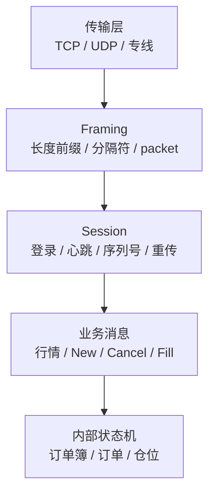
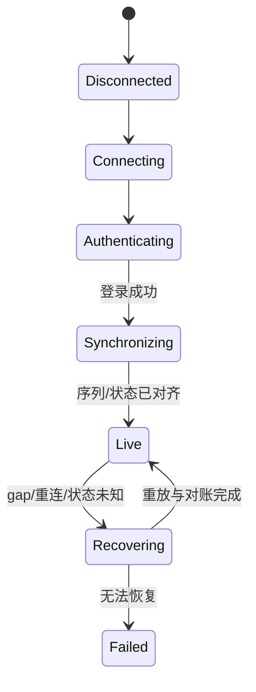

# 交易所协议概览：先搞清“哪一层在保证什么”

网络把字节送到进程后，程序还要完成 framing、字段校验、会话状态和业务状态转换。协议解析的首要目标是**正确拒绝坏输入**；只有在基准证明它是瓶颈后，才值得进一步减少 copy、allocation 或分支。

## 1. 一条交易连接包含多层协议

面试时不要只说“TCP 可靠”或“UDP 快”：TCP 只保证一条连接内的有序字节流；重连后的业务序列、重复订单和成交恢复仍要由 session/application protocol 处理。

## 2. 文本与二进制不是简单的快慢排名

| 类型 | 常见例子 | 优点 | 成本与边界 |
| :--- | :--- | :--- | :--- |
| Tag-value 文本 | FIX | 可扩展、生态成熟、排障直观 | 扫描分隔符、十进制转换、消息较大 |
| 固定/半固定二进制 | ITCH、OUCH、ETI | 紧凑、字段偏移明确 | 版本、长度、endian 和对齐必须严格处理 |
| Schema 驱动二进制 | SBE | 可代码生成、支持版本演进 | acting version/block length、group/var-data 更复杂 |

许多市场行情使用二进制协议，订单、drop copy、清算和控制面则可能使用 FIX 或厂商二进制协议；具体以 venue 的接口规范为准。文本协议也可以写成高效解析器，二进制协议也可能因错误边界检查而又慢又危险。

## 3. `repr` 不是线路格式声明

`#[repr(C)]` 只约束 Rust 类型采用 C 风格布局；`#[repr(packed)]` 进一步降低字段对齐。它们都不会自动解决：

- 网络字节序与本机字节序。
- 48-bit 字段、bit field、var-data 和 repeating group。
- 协议版本、可选字段与长度前缀。
- 未对齐引用的未定义行为。
- 结构体 padding 中未初始化字节被发到网络。

安全起点是从 `&[u8]` 按规范检查长度并使用 `from_be_bytes`/`from_le_bytes`。真正需要借用 payload 时，可以零拷贝返回 slice；标量字段通常直接解码成值，成本可控且语义清楚。

## 4. Rust 能提供什么

- `&[u8]` 和 `.get(range)` 让 parser 在越界前返回错误。
- enum 可以把消息类型与 session/order 状态编码进类型系统。
- newtype 区分 `PriceTicks`、`Quantity`、`ExchangeSeq`，避免单位混用。
- RAII 管理网络 buffer 生命周期，避免引用活过 ring frame。
- `nom`、代码生成器或手写 cursor 都能使用；选择依据是正确性、可维护性和实测结果。

下面两章分别介绍 [FIX](fix.md) 与 [二进制协议](binary_protocols.md)，随后进入 [市场数据流水线](market_data.md) 和 [订单路由](order_routing.md)。

## 5. 通用协议状态机

只有 `Live` 才允许相应业务动作。TCP socket 已连接并不意味着行情完整或订单 session 已同步。

## 6. 通用验证清单

- [ ] framing 能处理半包、粘包、多消息 packet、空包和超长声明。
- [ ] 所有长度相加使用 checked arithmetic，任何 slice 前先验边界。
- [ ] endian、scale、null value、enum 未知值和版本都有明确规则。
- [ ] session 覆盖登录失败、心跳超时、重复、gap、重放与重连。
- [ ] parser 对任意字节不 panic、不无限分配，并配合 fuzz/property test。
- [ ] 记录协议版本、原始 sequence、channel 与接收时间，支持事后审计。
- [ ] 性能结论来自目标流量和目标硬件的完整分位数，不使用固定宣传数字。

## 7. 面试追问

### Q1：二进制协议为什么通常更紧凑，却不一定能直接映射成 struct？

因为线路格式还包含明确 endian、非标准宽度、版本、变长 group 和对齐规则；Rust struct 的内存布局不是这些语义的自动实现。

### Q2：TCP 已经可靠，为什么交易协议还要 sequence number？

TCP 只覆盖当前连接的字节流。session sequence 用于重连、重放、去重和判断业务消息是否缺失，还能关联双方持久化状态。

### Q3：zero-copy parser 是否一定更快？

不一定。借用 slice 可减少大 payload copy，但会延长网络 buffer 生命周期并增加所有权复杂度。小标量直接解码成对齐的本机值可能更简单，甚至更利于后续计算；应实测端到端路径。
