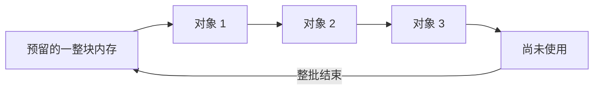
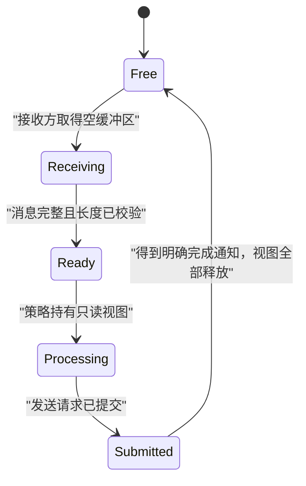

# 分配器、Arena、对象池与零拷贝

动态分配让程序可以在运行时决定容器大小，但它也可能带来不可预测的路径：寻找空闲块、同步、缺页和缓存扰动。低延迟系统常把工作搬到启动期，或复用已经取得的内存，以减少热路径上的变化。

“不调用 `new`”和“零拷贝”都不是最终目标。真正目标是：让所有权、容量上限和缓冲区可复用时刻清楚，并用测量确认延迟分布改善。

## 1. 动态分配到底做了什么

对下面的表达式：

```cpp,ignore
Order* order = new Order{7, 10'025};
delete order;
```

可以先拆成两件事理解：

1. 取得一块大小与对齐都合适的原始存储；
2. 在那块存储中开始 `Order` 对象的生命周期并完成构造。

`delete` 则先运行析构，再释放相应存储。真实规则还涉及重载的 `operator new`、数组形式、对齐形式和异常，不能把 `new` 简化成某个固定的 `malloc` 调用。

标准容器通常通过 **Allocator（分配器）** 获得存储。分配器决定“从哪里取得原始内存”；容器仍负责元素构造、析构、容量和迭代器规则。

### 1.1 为什么热路径会关注分配

一次分配的实际成本可能受以下因素影响：

- 请求大小与对齐；
- 当前线程缓存是否有可用块；
- 分配器实现与并发竞争；
- 是否首次触碰新页面并触发缺页；
- NUMA（Non-Uniform Memory Access，访问本节点和远端节点内存的代价可能不同）以及首次触碰位置；
- 分配后初始化了多少字节；
- 释放是否立刻归还或进入缓存。

C++ 标准不规定通用分配器必须加锁，也不规定一次分配需要多少纳秒。因此，“堆分配必然慢 N 倍”不是合格结论。更准确的目标是减少热路径中**负载相关且可能抖动的工作**，再测量 p99/p99.9。

## 2. 第一招：先用好容器容量

很多代码不需要自定义分配器。若上限可估计，先为 `std::vector` 预留容量即可避免容量范围内的重新分配：

```cpp
#include <cassert>
#include <cstdint>
#include <vector>

struct Order {
    std::uint64_t id;
    std::int64_t price_ticks;
};

int main() {
    std::vector<Order> orders;
    orders.reserve(3);
    assert(orders.capacity() >= 3);

    orders.push_back(Order{1, 10'000});
    const Order* first_address = &orders[0];

    orders.push_back(Order{2, 10'001});
    orders.push_back(Order{3, 10'002});

    assert(&orders[0] == first_address); // 没超过已预留容量，没有重分配
    assert(orders.size() == 3);
}
```

`reserve(3)` 保证成功后容量至少为 3，不保证恰好为 3。若一次插入会让大小超过当前容量，容器就必须重新分配；这会使指向旧元素的指针、引用和迭代器全部失效。

预留也有代价：估得过大会提高内存占用和页面压力，估得过小仍会在热路径扩容。容量应来自协议上限、风险限额或经过记录的负载模型，而不是随手写一个很大的数字。

## 3. Arena：成批取得，成批释放

**Arena（区域分配器）** 的直觉是：先取得一大块存储，之后每次请求只把“当前位置”向前推进；一批对象都不用后，再整体重置。

它适合生命周期相近的对象，例如“一轮行情快照解析期间产生的临时结构”。它不适合任意单个对象频繁提前释放的场景，因为中间空洞通常不会逐个回收。



### 3.1 用 C++20 的 `std::pmr`

`std::pmr` 是标准库的多态内存资源接口。`std::pmr::monotonic_buffer_resource` 提供接近 Arena 的“只向前分配、整体释放”行为：

<details>
<summary>进阶：`std::pmr` 的完整示例</summary>

```cpp
#include <array>
#include <cassert>
#include <cstddef>
#include <memory_resource>
#include <vector>

int main() {
    std::array<std::byte, 1024> storage{};
    std::pmr::monotonic_buffer_resource arena(
        storage.data(),
        storage.size(),
        std::pmr::null_memory_resource()
    );

    {
        std::pmr::vector<int> sequence_numbers{&arena};
        sequence_numbers.reserve(16);
        for (int i = 0; i < 16; ++i) {
            sequence_numbers.push_back(i);
        }
        assert(sequence_numbers.front() == 0);
        assert(sequence_numbers.back() == 15);
    } // 先销毁使用 arena 的容器

    arena.release(); // 然后才能安全地把整块区域标记为可复用
}
```

这里把上游设置为 `null_memory_resource()`：初始缓冲区不够时抛出 `std::bad_alloc`，不会静默向别处分配。若使用默认上游，Arena 可以继续请求额外块，延迟与内存上限就不再只由这 1024 字节决定。

几个关键边界：

- `memory_resource` 管的是原始存储，不替你定义业务对象何时失效；
- `release()` 不会替仍活着的对象逐个运行析构函数；应先结束容器和非平凡对象生命周期；
- 使用该资源的容器或视图不能活过资源及其底层缓冲区；
- `std::pmr` 的“多态”意味着运行时通过资源接口分配，不等于每次一定更慢或更快；
- 嵌套容器是否都使用同一资源取决于类型和构造方式，不能只给最外层换名字就假定所有内部字符串都进入 Arena。

</details>

### 3.2 Arena 的失败策略必须明确

容量耗尽时可以：

- 明确返回失败，丢弃或降级当前批次；
- 切换到预先准备的备用区域；
- 向上游继续动态分配；
- 停止当前数据源并报警。

选择取决于数据是否可丢、故障域和业务协议。最危险的是既没有容量上限，也没有监控，只在极端行情时突然走到未经测试的慢路径。

## 4. 对象池：反复使用固定数量的槽位

**对象池（object pool）** 预先准备若干槽位，申请时取一个空槽，释放时把槽归还。它适合对象大小固定、最大并发数量明确、生命周期彼此独立的场景。

下面是教学用的单线程固定池。`std::optional<Order>` 负责开始和结束每个槽位内对象的生命周期：

```cpp
#include <array>
#include <cassert>
#include <cstddef>
#include <cstdint>
#include <memory>
#include <optional>

struct Order {
    std::uint64_t id;
    std::int64_t price_ticks;
};

template <std::size_t Capacity>
class OrderPool {
public:
    Order* acquire(Order value) {
        for (auto& slot : slots_) {
            if (!slot.has_value()) {
                slot.emplace(value);
                return std::addressof(*slot);
            }
        }
        return nullptr;
    }

    bool release(Order* target) {
        for (auto& slot : slots_) {
            if (slot.has_value() && std::addressof(*slot) == target) {
                slot.reset();
                return true;
            }
        }
        return false;
    }

private:
    std::array<std::optional<Order>, Capacity> slots_{};
};

int main() {
    OrderPool<2> pool;
    Order* first = pool.acquire(Order{1, 10'000});
    Order* second = pool.acquire(Order{2, 10'001});
    assert(first != nullptr && second != nullptr);
    assert(pool.acquire(Order{3, 10'002}) == nullptr); // 容量耗尽是显式结果

    assert(pool.release(first));
    first = nullptr; // 旧指针已经失效，主动清空避免误用

    Order* reused = pool.acquire(Order{3, 10'002});
    assert(reused != nullptr);
    assert(reused->id == 3);
}
```

这个实现为了易懂使用线性扫描，申请复杂度为 \(O(N)\)，也**不是线程安全的**。工程实现通常维护空闲索引栈或队列，并明确：

- 单生产者/消费者还是多线程；
- 容量耗尽是拒绝、阻塞、覆盖还是降级；
- 归还两次如何检测；
- 池销毁时是否仍有借出对象；
- 如何处理构造失败；
- 是否需要代际编号（generation）防止旧句柄误指向复用后的新对象。

### 4.1 地址复用与 ABA 直觉

池会重复使用相同地址。线程 A 看到地址 `P`，线程 B 释放该对象后又在 `P` 构造新对象，线程 A 再看时地址仍是 `P`，却已不是原来的逻辑对象。这就是 ABA 类问题的直觉来源。

常见缓解方式是使用“槽位索引 + generation”的句柄，每次复用都增加 generation。它仍需与正确的并发回收方案结合；只比较裸指针不够。

## 5. “零拷贝”到底是什么意思

零拷贝不是一个脱离边界的绝对词。你必须先问：**在哪两个组件之间没有复制哪一段字节？**

例如，从网络缓冲区解析消息时：

1. 网卡可能通过 DMA（Direct Memory Access，设备直接读写内存）把数据放入内核或用户态缓冲区；
2. 解析器可能不复制 payload，只返回指向原缓冲区的视图；
3. 策略可能只读取视图；
4. 若要跨线程或长期保存，仍可能需要复制或转移缓冲区所有权。

因此，“解析零拷贝”不代表整个网卡到交易所往返完全没有任何数据移动。

## 6. `std::span`：不拥有数据的连续视图

`std::span<T>` 保存指针和长度的视图语义，不拥有底层内存。下面解析一个教学协议：前 2 字节是大端消息类型，接着 2 字节是大端 payload 长度，剩余部分是 payload。

```cpp
#include <array>
#include <cassert>
#include <cstddef>
#include <cstdint>
#include <optional>
#include <span>

std::uint16_t read_be_u16(std::span<const std::byte, 2> bytes) {
    const auto high = std::to_integer<std::uint16_t>(bytes[0]);
    const auto low = std::to_integer<std::uint16_t>(bytes[1]);
    return static_cast<std::uint16_t>((high << 8) | low);
}

struct MessageView {
    std::uint16_t type;
    std::span<const std::byte> payload;
};

std::optional<MessageView> decode(std::span<const std::byte> input) {
    constexpr std::size_t header_size = 4;
    if (input.size() < header_size) {
        return std::nullopt;
    }

    const auto type = read_be_u16(input.first<2>());
    const auto payload_size = read_be_u16(input.subspan<2, 2>());
    if (input.size() < header_size + payload_size) {
        return std::nullopt;
    }

    return MessageView{
        type,
        input.subspan(header_size, payload_size)
    };
}

int main() {
    std::array<std::byte, 7> packet{
        std::byte{0x00}, std::byte{0x02}, // type = 2
        std::byte{0x00}, std::byte{0x03}, // payload length = 3
        std::byte{0x10}, std::byte{0x20}, std::byte{0x30}
    };

    const auto message = decode(packet);
    assert(message.has_value());
    assert(message->type == 2);
    assert(message->payload.size() == 3);
    assert(message->payload[0] == std::byte{0x10});

    const std::array<std::byte, 3> truncated{};
    assert(!decode(truncated));
}
```

这里只复制了小型头字段，payload 仍指向 `packet`。这节省了一次 payload 分配和复制，但把生命周期约束交给了调用者：

- `packet` 销毁后，`payload` 立刻悬垂；
- 接收循环覆盖 `packet` 后，旧视图看到的是新数据；
- `span<const byte>` 只禁止通过该视图修改，不保证其他所有者不会改；
- 把视图发送到异步线程前，必须证明缓冲区直到消费完成都有效且不会复用。

C++ 编译器通常不会像 Rust 借用检查器那样拒绝这些生命周期错误。

## 7. 缓冲区所有权状态机

零拷贝设计最重要的不是指针技巧，而是缓冲区何时能复用。可以用状态机把契约写清楚：



“已提交”不一定等于“网卡已发送”，更不一定等于“对手方已确认”。具体 API 可能在复制进内核后就允许用户缓冲区复用，也可能要求等待 completion queue。必须以该操作系统、驱动或用户态网络库的当前文档为准。

### 7.1 Scatter/Gather 也是边界优化

某些 I/O API 能一次提交多个不连续缓冲区，例如一个头部和一个 payload，从而避免先拼成连续大包。下面只是接口形状示意，具体函数、头文件和完成语义依平台而定：

<details>
<summary>进阶：Scatter/Gather 的接口形状</summary>

```cpp,ignore
std::array<iovec, 2> parts{
    iovec{header.data(), header.size()},
    iovec{payload.data(), payload.size()}
};
msghdr message{};
message.msg_iov = parts.data();
message.msg_iovlen = parts.size();
const auto bytes_sent = ::sendmsg(socket_fd, &message, 0);
// 还必须按目标平台处理 bytes_sent、errno、部分发送和完成语义。
```

它可以消除用户态拼包复制，却不自动消除内核、驱动或设备中的其他复制，也不自动延长两个缓冲区的生命周期。

</details>

## 8. HFT 场景：预分配的消息流水线

一个较清晰的设计可以是：


这条链路必须明确：

- 池中有多少缓冲区，每个多大；
- 行情突发超过容量时丢弃、背压还是切备用池；
- 一个视图能否跨线程，谁最终归还；
- 解析失败是否仍会归还缓冲区；
- 发送完成与业务确认分别由什么事件表示；
- 页首次触碰、NUMA 放置和内存锁定在哪个阶段完成。

“预分配”并不自动完成**预触页**（启动时提前逐页访问）。操作系统可能只预留虚拟地址，第一次写某页时才建立物理映射。是否需要触页、锁页或 NUMA 绑定要根据部署权限、工作集和实测决定。

## 9. C++ 与 Rust 对照

| 目的 | C++20 | Rust | 关键差异 |
|---|---|---|---|
| 动态数组预留 | `std::vector::reserve` | `Vec::reserve` | 都要处理容量估计和扩容失效 |
| 借用连续数据 | `std::span<T>` | `&[T]` / `&mut [T]` | Rust 通常静态检查借用生命周期和别名规则；C++ 由调用者维护 |
| 标准多态分配器 | `std::pmr::memory_resource` | 标准容器分配器接口能力与稳定性不同，常用专门 crate | 不应假定 API 一一对应 |
| Arena | `monotonic_buffer_resource` 或专用实现 | bump arena 类库或专用所有权结构 | 两边都必须保证对象不活过 Arena |
| 固定对象池 | 数组/原始存储 + 显式生命周期 | 数组/槽位容器 + 所有权类型 | C++ 手写 placement 与销毁更容易产生 UB |
| 零拷贝解析 | `span`/`string_view` | 借用切片和带生命周期的解析结果 | Rust 能表达更多编译期约束，但缓冲区跨异步边界仍需设计 |

Rust 的生命周期不是性能魔法；它主要让“视图不能活过数据”这类约束更容易在编译期验证。C++ 也能实现相同的数据流，但需要更严格的接口约定、测试和审查。

## 10. 语言保证与性能实测

| 说法 | 性质 | 准确结论 |
|---|---|---|
| `vector::reserve(n)` 成功后容量至少为 `n` | 标准库保证 | 不保证容量恰好等于 `n` |
| 未超过 capacity 的尾部插入不会因扩容搬家 | 标准容器规则 | 仍要考虑具体操作对引用/迭代器的其他失效规则 |
| `span` 不拥有元素 | 类型语义 | 调用者必须保证底层数据有效且稳定 |
| Arena 分配必然是一次加法 | 不保证 | 对齐、块扩展、调试检查和实现都会影响路径 |
| 对象池一定比系统分配器快 | 不保证 | 取决于竞争、空闲结构、缓存局部性和容量耗尽路径 |
| “零拷贝”表示链路完全无复制 | 错误 | 必须说明在哪个边界省掉哪次复制 |
| 预留虚拟内存后不会缺页 | 不保证 | 物理页提交和首次触碰依操作系统与配置而定 |

## 11. 如何测量分配与零拷贝

测试时至少记录：

1. 分配大小分布、对象存活时间和线程数；
2. Arena/池容量，耗尽比例及后备路径；
3. 是否包含首次触页、初始化和析构；
4. payload 大小分布，而非只测一个大包；
5. 端到端计时边界：解析完成、提交完成、缓冲区可复用还是业务确认；
6. 平均值之外的 p99/p99.9 和最坏批次；
7. 内存峰值、缺页、缓存和 NUMA 事件。

零拷贝可能用更长的缓冲区占用时间换取更少复制。如果池因此更容易耗尽，尾延迟甚至可能恶化。吞吐、延迟和内存压力要一起看。

## 12. 面试追问与参考答法

### Q1：`reserve` 和 `resize` 有什么区别？

`reserve` 至少增加容量，不改变元素数量；`resize` 改变 `size()`，增加时会创建元素，减少时会销毁元素。只想避免后续扩容时通常使用 `reserve`。

### Q2：Arena 为什么快，又有什么限制？

它常把多次小分配变成在连续区域内推进位置，并整批回收；但单个对象通常不能随意提前释放，容量、对齐、对象析构和 Arena 生命周期都需明确。是否更快仍要实测。

### Q3：对象池最危险的生命周期错误是什么？

对象归还后仍使用旧指针，或地址复用后把新对象误认为旧对象。generation 句柄、严格所有权和并发回收协议可以降低风险。

### Q4：`std::span` 会复制数据吗？

构造 span 只建立视图，不复制元素。它也不拥有数据，不能延长底层缓冲区生命周期。

### Q5：怎样证明网络发送后缓冲区可以复用？

查目标 API 的完成语义，并等待其明确规定的 completion；“函数返回”或“请求已提交”不一定足够。还要区分用户缓冲区可复用、网卡发出和业务确认。

## 13. 易错点

1. **预分配后仍在热路径创建字符串**：最外层容器不扩容，不代表内部字段不分配。
2. **Arena 先 `release()`、后销毁对象**：对象和容器会引用已复用存储。
3. **对象池满时偷偷回退到系统堆**：极端行情才触发的慢路径最难测试。
4. **把裸指针当永久句柄**：池复用地址后会出现悬垂和 ABA 类错误。
5. **把 `span` 放进异步任务却立即复用接收缓冲区**：视图不会复制，也不会延长生命周期。
6. **宣称端到端零拷贝**：若没有说明边界、DMA、内核和完成语义，这个说法无法验证。

## 做题方法

分配器题先建立“内存块账本”：每一行记录起始地址、大小、对齐、当前状态、所含对象和释放责任。

1. 对请求大小先做对齐向上取整，再从 free list、bump pointer 或 size class 中选择块；分割后剩余块也要回到账本。
2. 区分“获得原始存储”和“对象生命周期开始”：placement new 构造后才能按该对象使用，释放存储前要先结束仍活跃对象的生命周期。
3. 对池化结构逐操作更新空闲槽、代数/版本和对象状态，检查 double free、use-after-free 与 ABA 风险。
4. 零拷贝方案画所有权转移图，标出生产者何时不能再改缓冲区、消费者何时释放，以及切片长度不能超过容量。
5. 计算成本时分开统计分配次数、复制字节数、元数据、碎片和缓存行访问；减少一次复制可能增加引用计数或生命周期协调。
6. 实测前固定数据量与对象寿命分布，并与系统分配器和普通复制基线比较；只测理想固定大小不能证明通用收益。

验算点是账本中活动块互不重叠、每个活对象位于满足其大小和对齐的活动块中，并且每次释放都能对应到唯一一次成功分配。

## 14. 练习与参考答案

### 练习 1：选择 `reserve` 还是对象池

启动时已知一天最多保留 20,000 个只增不删的统计项。你会先尝试哪种方案？

<details>
<summary>参考答案</summary>

先尝试普通 `std::vector` 并在启动时 `reserve(20'000)`。生命周期一致、只增不删时，连续容器简单且局部性好。对象池会增加空闲管理和句柄复杂度，除非还有稳定地址或独立释放等需求。

</details>

### 练习 2：找出视图错误

接收线程创建 `MessageView` 后把它推入另一个线程的队列，随后立刻把底层缓冲区归还池。问题是什么？

<details>
<summary>参考答案</summary>

队列里只有不拥有数据的视图。缓冲区归还后可能被下一条消息覆盖，消费者将读取新数据或悬垂内存。应转移缓冲区所有权、使用带引用计数的块、等待消费完成后归还，或在边界复制必要数据。

</details>

### 练习 3：Arena 耗尽策略

行情峰值时 Arena 容量不足。为什么“自动回退到普通分配器”不一定是最佳默认值？

<details>
<summary>参考答案</summary>

它能维持功能，却会在压力最大时引入未经约束的分配延迟和内存增长，掩盖容量模型错误。应根据数据能否丢弃、故障域和业务要求显式选择回退、背压、备用池或停止，并监控耗尽次数。

</details>

## 15. 小结

- 分配原始存储和开始对象生命周期是相关但不同的事情。
- 先使用 `reserve` 等简单手段；只有需求明确时再引入 `std::pmr`、Arena 或对象池。
- Arena 适合生命周期成批结束，对象池适合固定数量对象独立复用；两者都必须定义容量耗尽行为。
- `std::span` 能零拷贝借用连续数据，但不拥有数据，也不替调用者保证生命周期。
- 性能术语必须带边界：说明省掉哪次分配或复制，以及何时缓冲区才真正可复用。
