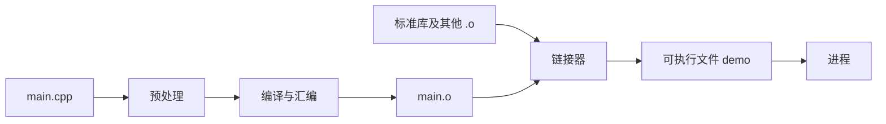

# 编译、链接与基本内存模型

刚开始学 C++ 时，最常见的困惑不是某个关键字，而是“不知道程序从哪里来、数据又放在哪里”。本章先把这张地图画清楚：文本形式的源码如何变成可执行文件，一个变量在什么时候存在，以及为什么“栈”和“堆”只是理解成本的起点。

> 本章目标：能独立编译一个 C++20 单文件程序；能区分编译错误、链接错误和运行时错误；能用作用域与存储期解释对象何时创建、何时销毁；不会把“栈一定快、堆一定慢”当成结论。

## 1. 第一个程序：从源码到进程

下面是一个完整程序：

```cpp
#include <cstdint>
#include <iostream>

std::int64_t notional_ticks(std::int32_t price_ticks,
                            std::int32_t quantity) {
    return static_cast<std::int64_t>(price_ticks) * quantity;
}

int main() {
    const std::int32_t price_ticks = 10'025;
    const std::int32_t quantity = 300;
    std::cout << notional_ticks(price_ticks, quantity) << '\n';
}
```

逐行看：

- `#include` 让当前源文件看到标准库中整数类型和输出接口的声明；
- `notional_ticks` 是一个函数，接收两个 32 位整数，把价格先扩成 64 位再相乘，并返回 64 位结果；这样任意两个 32 位整数的乘积都能放进返回类型；
- `main` 是普通命令行程序的入口；
- `const` 表示变量初始化后不能再通过这个名字修改；
- `std::` 表示这些名字位于标准库命名空间中。

保存为 `main.cpp` 后执行：

```bash
c++ -std=c++20 -Wall -Wextra -Wpedantic main.cpp -o demo
./demo
```

`-std=c++20` 选择本部分的语言基线。三个警告选项帮助发现可疑写法；`-o demo` 指定输出文件名。不同系统上的编译器命令可能叫 `c++`、`g++` 或 `clang++`，本质都是调用相应的 C++ 驱动程序。

这里特意先扩大整数宽度再做乘法，避免教学函数对任意输入发生有符号溢出。真实协议若使用 64 位价格或数量，就不能照搬这个假设；应在乘法前做范围检查，后面的未定义行为章节会完整演示。

## 2. 编译和链接不是同一步

先用一个工厂类比：

- **预处理**：把 `#include` 等指令展开成编译器可继续处理的文本；
- **编译**：检查语法和类型，把一个翻译单元变成目标代码；
- **链接**：把目标文件和需要的库组合起来，解析“这个函数的实现到底在哪”；
- **加载与运行**：操作系统把程序映射进进程地址空间，从入口开始执行。



### 2.1 三类问题怎样分辨

**编译错误**通常发生在语法或类型不成立时：

```cpp,ignore
// 故意错误：字符串不能直接初始化整数，所以不能独立编译。
int main() {
    int quantity = "300";
}
```

**链接错误**常见于“有声明，没有定义”：

```cpp,ignore
// 故意错误：编译器知道函数长什么样，但链接器找不到它的实现。
int parse_price(const char* text);

int main() {
    return parse_price("10025");
}
```

**运行时错误或业务错误**则可能在编译、链接都成功后出现，例如除以零、越界、使用已经销毁的对象，或者把买单当成卖单。编译成功不等于正确。

### 2.2 头文件与源文件的直觉

大型项目通常把“别人需要知道的接口”放进 `.h`/`.hpp`，把实现放进 `.cpp`。可以把头文件理解为菜单，把源文件理解为厨房。菜单告诉调用者有哪些菜、需要什么参数，却不必暴露每一步实现。

下面只是结构片段，不是一个完整单文件程序：

```cpp,ignore
// price.h：声明
#pragma once
#include <cstdint>
std::int64_t notional_ticks(std::int32_t price, std::int32_t qty);

// price.cpp：定义
#include "price.h"
std::int64_t notional_ticks(std::int32_t price, std::int32_t qty) {
    return static_cast<std::int64_t>(price) * qty;
}

// main.cpp：调用方
#include "price.h"
#include <iostream>
int main() {
    std::cout << notional_ticks(10'025, 300) << '\n';
}
```

把这三段分别保存为 `price.h`、`price.cpp` 和 `main.cpp`，再一起编译、链接：

```bash
c++ -std=c++20 -Wall -Wextra -Wpedantic main.cpp price.cpp -o demo
./demo
```

`#include` 更接近“把声明文本带进来”，不是运行时导入模块。模板为什么常把实现也放在头文件中，会在高阶章节解释。

## 3. 变量、对象、类型和地址

这四个词经常一起出现：

- **类型**规定一段数据可表示什么，以及允许哪些操作；
- **对象**是一块在其生命周期内表示某个类型值的存储；
- **变量**是我们在源码中给对象起的名字；
- **地址**是对象在内存中的位置表示。

```cpp
#include <cstdint>
#include <iostream>

int main() {
    std::int64_t price_ticks = 10'025;
    std::cout << "value: " << price_ticks << '\n';
    std::cout << "size: " << sizeof(price_ticks) << " bytes\n";
    std::cout << "address: " << &price_ticks << '\n';
}
```

每次运行显示的地址可能不同，这是正常现象。地址值由操作系统、装载布局等因素决定，不应被业务代码写死。

## 4. 作用域、生命周期与存储期

初学者常说“变量出了大括号就没了”。这对很多局部对象是很好的第一直觉，但更准确地说：

- **作用域（scope）**回答“这个名字在哪些源码位置可见”；
- **生命周期（lifetime）**回答“这个对象在什么时候真实存在”；
- **存储期（storage duration）**描述承载对象的存储至少持续多久。

### 4.1 自动存储期：跟随代码块

普通局部变量通常具有自动存储期。执行进入声明处时创建，离开所在代码块时销毁：

```cpp
#include <iostream>
#include <string>
#include <utility>

struct Trace {
    std::string name;

    explicit Trace(std::string value) : name(std::move(value)) {
        std::cout << "create " << name << '\n';
    }

    ~Trace() {
        std::cout << "destroy " << name << '\n';
    }
};

int main() {
    Trace outer{"outer"};
    {
        Trace inner{"inner"};
        std::cout << "inside block\n";
    }
    std::cout << "after block\n";
}
```

输出中 `inner` 会先销毁，`outer` 后销毁。同一作用域内，局部对象一般按构造的相反顺序析构。这个确定性是 RAII 的基础。

示例用了 `std::move`，这里只需把它理解为允许把临时传入的字符串资源交给成员；复制与移动会在专门章节展开。

### 4.2 动态存储期：由所有权对象管理

动态分配得到的对象不会因为创建它的那一行结束就自动消失。现代 C++ 通常让 `std::unique_ptr` 等所有权类型管理它，而不是手写 `new`/`delete`：

```cpp
#include <iostream>
#include <memory>

struct Order {
    int id;
};

int main() {
    auto order = std::make_unique<Order>(Order{42});
    std::cout << order->id << '\n';
}
```

`Order` 对象位于动态分配的存储中；局部变量 `order` 是所有者。离开 `main` 时，`order` 的析构函数负责销毁 `Order` 并释放存储。这里仍然是“按作用域自动清理”，只不过真正的数据经过一层间接访问。

### 4.3 静态存储期：大致贯穿整个程序

命名空间作用域变量和函数内 `static` 对象通常具有静态存储期：

```cpp
#include <iostream>

int next_sequence() {
    static int sequence = 0;
    return ++sequence;
}

int main() {
    std::cout << next_sequence() << '\n';
    std::cout << next_sequence() << '\n';
}
```

这里的 `sequence` 只初始化一次，并在多次函数调用之间保留值。函数内静态局部变量的初始化从 C++11 起由语言提供线程安全保证，但之后对变量本身的并发读写仍然需要同步。全局可变状态会让测试、初始化顺序和并发推理变复杂，应谨慎使用。

### 4.4 线程存储期

使用 `thread_local` 声明的对象通常每个线程各有一份，随线程生命周期存在。它能减少共享，但初始化、析构和访问成本依赖平台与实现；低延迟场景不能只凭名字判断快慢。

## 5. “栈”和“堆”：有用但不完整的模型

教学中通常这样说：

- 局部对象常放在**栈**上，进入函数时取得空间，离开时回收；
- `make_unique` 等动态分配的对象常放在**堆**上，由分配器管理。

这能帮助入门，但语言标准主要规定对象行为和存储期，不保证每个变量必须放在某块物理区域。优化器可能把局部变量放进寄存器、完全消除对象，或者把操作重排，只要程序在语言规则下可观察行为一致。

更重要的是，“栈一定快、堆一定慢”过于粗糙：

- 栈式取得空间通常简单，但大对象可能造成栈压力；
- 动态分配本身可能有可变延迟，但启动阶段分配一次、盘中长期使用，未必影响热路径；
- 连续堆数组可能比散落的指针对象更有缓存局部性；
- 真正成本还包括初始化、缺页、缓存未命中、TLB（缓存虚拟地址到物理地址翻译结果的小型硬件缓存）、跨核共享和释放时机。

## 6. 教学算例：一次分配会影响哪段延迟

假设一个行情处理程序有以下**纯教学数字**：

| 步骤 | 一次耗时 |
|---|---:|
| 解析固定字段 | 35 ns |
| 更新订单簿 | 55 ns |
| 策略判断 | 20 ns |
| 偶发动态分配 | 80 ns 或更高 |

不发生分配时，关键路径是：

\[
35 + 55 + 20 = 110\ \text{ns}
\]

若每条消息都额外分配一次，教学路径至少变为：

\[
110 + 80 = 190\ \text{ns}
\]

但这里不能得出“所有堆对象都要删掉”。如果对象在启动期预先分配，盘中只访问，那么 80 ns 不在逐条消息的计时边界中。优化首先要画清楚**分配发生在哪个阶段**。

## 7. 对齐、字节和布局的第一印象

对象占用空间不一定等于各字段大小简单相加。编译器可能插入填充，使字段满足对齐要求：

```cpp
#include <cstddef>
#include <cstdint>
#include <iostream>

struct Message {
    std::uint8_t type;
    std::uint64_t sequence;
    std::uint32_t quantity;
};

int main() {
    std::cout << "sizeof(Message) = " << sizeof(Message) << '\n';
    std::cout << "type offset = " << offsetof(Message, type) << '\n';
    std::cout << "sequence offset = " << offsetof(Message, sequence) << '\n';
    std::cout << "quantity offset = " << offsetof(Message, quantity) << '\n';
}
```

具体数字可能因 ABI（Application Binary Interface，应用二进制接口，即编译产物怎样约定类型布局、调用方式等细节）和平台而异，不能把某次输出直接写成网络协议。网络二进制协议应逐字段解析并明确字节序、长度和范围；不要把任意收到的字节直接解释为本机结构体。

## 8. Rust 心智模型对照

| 问题 | Rust | C++ |
|---|---|---|
| 局部对象何时清理 | 通常离开作用域时 `Drop` | 自动对象离开作用域时析构 |
| 动态独占对象 | `Box<T>` | `std::unique_ptr<T>` |
| 默认移动行为 | 非 `Copy` 类型赋值通常转移所有权，旧名字不可再用 | 可能复制；只有满足重载选择和右值条件时才移动 |
| 借用是否合法 | 借用检查器验证大量关系 | 程序员与 API 设计共同保证，编译器只检查部分规则 |
| 布局是否固定 | 默认布局一般不承诺稳定 | 普通类布局也受多项规则和 ABI 影响 |

两边都强调作用域清理，但 C++ 中“对象仍然存在”不代表“对象内部资源还保持原值”；被移动对象就是后续章节的重要例子。

## 9. HFT 联系：冷路径和热路径

低延迟系统通常把工作分成：

- **冷路径**：启动、加载配置、建立连接、预分配、错误报告；
- **热路径**：逐条行情解析、订单簿更新、风控检查、发单决策。

动态分配、日志格式化和复杂错误对象在冷路径上常常完全合理。真正需要严格控制的是高频热路径中的偶发扩容、缺页和不可预测资源释放。判断某段代码属于哪条路径，应以实际调用关系和测量边界为准，而不是函数名字。

## 10. 面试追问与参考答法

### Q1：编译错误和链接错误有什么区别？

**参考答法**：编译器逐个翻译单元检查语法和类型并生成目标文件；链接器再解析跨文件符号，把目标文件和库组合起来。有声明但缺少定义通常能通过当前翻译单元的编译，却会在链接时报告未定义符号。

### Q2：局部变量一定在栈上吗？

**参考答法**：C++ 语言层面更准确的说法是普通局部对象通常有自动存储期。具体实现可能放在栈、寄存器，甚至被优化掉。“栈上”是常用机器实现直觉，不应冒充语言保证。

### Q3：为什么低延迟系统常在启动期预分配？

**参考答法**：它把分配、首次触页和容量检查等工作移出逐条消息热路径，使盘中延迟更可预测。但仍要设计容量耗尽策略，并在目标硬件和真实负载上验证。

### Q4：`sizeof(struct)` 为什么可能大于字段大小之和？

**参考答法**：编译器可能为了字段对齐插入填充，结构尾部也可能有填充以便数组中的下一个元素对齐。具体布局受类型、ABI、平台和声明影响。

## 11. 易错点

- 把编译成功当成没有内存或业务错误；
- 用 `gcc main.cpp` 而不是 C++ 驱动程序，导致标准 C++ 库链接问题；
- 认为 `#include` 是运行时加载；
- 返回局部对象的地址或引用，让访问活得比对象更久；
- 把静态局部变量误认为每次调用都会重新创建；
- 直接用 `sizeof` 和内存布局定义网络协议；
- 只按“栈/堆”标签评价性能，不看分配时机和访问模式。

## 12. 练习与参考答案

### 练习 1

下面的对象按什么顺序销毁？

```cpp,ignore
// 这是推演片段，省略了 Trace 定义，因此不作为独立程序编译。
Trace a{"a"};
{
    Trace b{"b"};
    Trace c{"c"};
}
Trace d{"d"};
```

<details>
<summary>参考答案</summary>

进入内部块后依次构造 `b`、`c`，离开内部块时按相反顺序销毁 `c`、`b`。外层随后构造 `d`，离开外层作用域时销毁 `d`、`a`。

</details>

### 练习 2

某对象在启动时动态分配一次，事件循环处理一千万条消息时只读访问它。能否因为它“在堆上”就断言每条消息都支付一次分配成本？

<details>
<summary>参考答案</summary>

不能。分配发生在启动时，每条消息主要支付的是访问成本；是否存在可观测的间接寻址或缓存影响要看布局、优化与实际工作集。应分别测量初始化和事件循环。

</details>

### 练习 3

一个源文件调用了头文件中声明的函数。当前源文件编译成功，最终却提示 `undefined reference`。最可能在哪一步失败？

<details>
<summary>参考答案</summary>

链接步骤。常见原因是实现文件没有参与链接、函数签名不一致，或所需库没有加入链接命令。

</details>

## 小结

C++ 程序经历预处理、编译、链接和运行；这几个阶段能发现的问题不同。理解内存时，应先用作用域、生命周期和存储期描述语言行为，再用栈、堆、寄存器和缓存解释具体机器成本。对低延迟程序而言，最重要的不是消灭所有动态对象，而是知道资源何时取得、何时释放，以及这些动作是否落在关键路径上。
