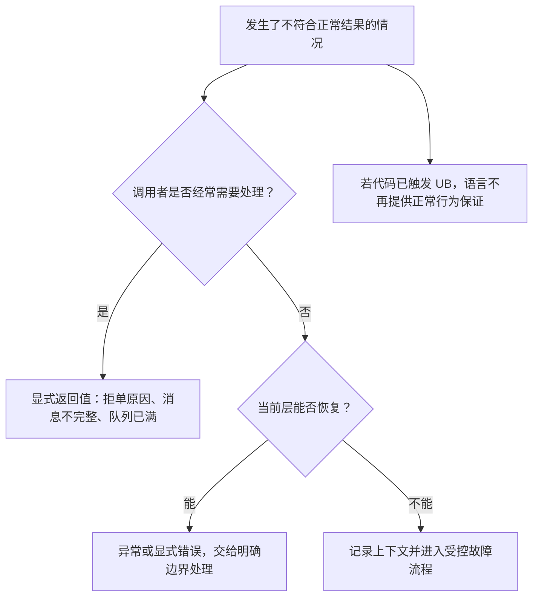

# 异常、`noexcept` 与未定义行为

交易系统不可能“永不失败”：订单会被风控拒绝，网络会断开，输入也可能损坏。真正危险的是把不同失败混为一谈——把正常拒单写成异常，或者让越界、悬垂指针和数据竞争悄悄进入程序。

本章把失败分成可预期结果、异常和未定义行为三类，再说明 HFT 中应如何设置故障边界。你不需要先懂异常表或编译器优化。

> **本章目标**：读完后，你能选择返回值或异常，解释 `noexcept` 的契约，识别常见 UB，并能用 Sanitizer 和系统级恢复流程降低风险。

## 1. 先给失败分类



| 类别 | 例子 | 推荐起点 |
|---|---|---|
| 正常业务结果 | 超过仓位限制、重复订单、价格非法 | 小型枚举或带标签的返回类型 |
| 可恢复外部故障 | 文件不存在、配置读取失败、连接建立失败 | 返回错误或在低频边界抛出异常 |
| 内部不变量破坏 | 订单簿出现不可能状态 | 受控停止当前故障域，触发对账与恢复 |
| 未定义行为（UB） | 越界、释放后使用、数据竞争 | 必须从设计和测试上消除，不能“捕获后继续” |

“异常”和“错误”不是同义词。异常只是 C++ 提供的一种控制转移机制；许多错误更适合普通返回值。

## 2. 热路径中的显式结果

C++20 标准库还没有 C++23 的 `std::expected`。可以先用枚举和 `std::variant` 清楚表达“接受或拒绝”：

```cpp
#include <cassert>
#include <cstdint>
#include <variant>

struct Accepted {
    std::uint64_t order_id;
};

enum class RejectReason {
    invalid_price,
    invalid_quantity,
    position_limit
};

enum class Side { Buy, Sell };

struct Rejected {
    RejectReason reason;
};

using RiskResult = std::variant<Accepted, Rejected>;

RiskResult check_order(
    std::uint64_t order_id,
    std::int64_t price_ticks,
    std::int64_t quantity,
    std::int64_t position,
    Side side
) {
    if (price_ticks <= 0) {
        return Rejected{RejectReason::invalid_price};
    }
    if (quantity <= 0) {
        return Rejected{RejectReason::invalid_quantity};
    }
    constexpr std::int64_t position_limit = 10'000;
    if (position < -position_limit || position > position_limit) {
        return Rejected{RejectReason::position_limit};
    }

    // 不直接计算 position +/- quantity，避免结果溢出后再检查。
    const bool exceeds_limit = side == Side::Buy
        ? position > position_limit - quantity
        : position < -position_limit + quantity;
    if (exceeds_limit) {
        return Rejected{RejectReason::position_limit};
    }
    return Accepted{order_id};
}

int main() {
    const auto ok = check_order(7, 10'025, 20, 500, Side::Buy);
    assert(std::holds_alternative<Accepted>(ok));

    const auto rejected = check_order(8, 0, 20, 500, Side::Buy);
    assert(std::get<Rejected>(rejected).reason == RejectReason::invalid_price);

    const auto too_large = check_order(9, 10'025, 1'000, 9'999, Side::Buy);
    assert(std::get<Rejected>(too_large).reason == RejectReason::position_limit);
}
```

这类结果的优点是控制流一眼可见，调用者无法误以为函数只有成功结果。示例按买卖方向把本次数量计入最坏持仓，并先比较边界而不是先做可能溢出的加减。真实项目还要计入未成交订单、合约乘数和组合限额，也可使用经过评审的 `expected` 实现，但不要为了模仿别的语言就随意引入依赖。

返回类型的大小、分支预测和拷贝方式需要针对具体类型与 ABI 检查。不能从 `std::variant` 的源码形状直接断言它“固定只多一个字节”，也不能承诺一定比异常快。

## 3. 异常怎样工作

异常由 `throw` 发出，由匹配的 `catch` 处理。寻找处理器时，程序会离开中间函数作用域；已成功构造的自动对象会按规则析构，这个过程叫 **stack unwinding（栈展开）**。

```cpp
#include <cassert>
#include <stdexcept>
#include <string>

class SessionGuard {
public:
    explicit SessionGuard(bool& closed) : closed_(closed) {}
    ~SessionGuard() { closed_ = true; }

    SessionGuard(const SessionGuard&) = delete;
    SessionGuard& operator=(const SessionGuard&) = delete;

private:
    bool& closed_;
};

int load_port(const std::string& text) {
    const int port = std::stoi(text);
    if (port <= 0 || port > 65'535) {
        throw std::out_of_range("port outside valid range");
    }
    return port;
}

int main() {
    bool closed = false;
    try {
        SessionGuard guard(closed);
        (void)load_port("70000");
        assert(false); // 前一行应该抛出异常
    } catch (const std::out_of_range&) {
        assert(closed); // 展开经过 guard 的作用域时执行了析构函数
    }
}
```

实践中通常**按值抛出，按 `const` 引用捕获**。按值抛出让异常对象拥有自己的状态；按引用捕获避免额外复制，并保留多态异常类型。

### 3.1 RAII 让失败路径也能清理资源

RAII 的核心是“资源生命周期绑定到对象生命周期”。锁、文件、内存和会话句柄由对象析构函数释放，因此普通返回和异常展开都能沿作用域清理。

但析构函数只能清理本地进程管理的资源。已经发到交易所的订单、已写入远端服务的状态不会因为本地对象析构而自动撤销。

### 3.2 异常性能不能用一句“零成本”概括

许多主流 64 位 ABI 采用表驱动异常：没有抛出时，正常路径可能主要承担元数据和代码布局成本；真正抛出时，需要创建异常对象、查找处理器并展开栈，通常更昂贵。

这只是常见实现，不是 C++ 标准规定的固定成本模型。以下因素都会改变结果：

- 编译器、标准库和目标 ABI；
- 是否内联、是否启用 LTO；
- 调用深度和析构对象数量；
- 异常对象构造和日志行为；
- 指令缓存和二进制体积。

因此，不要说“`try` 完全免费”，也不要给一次 `throw` 编造固定纳秒数。对预期且高频的拒单，显式返回通常更自然；对启动期罕见配置失败，异常可能很清晰。

## 4. `noexcept`：承诺异常不会逃出函数

`noexcept` 是接口契约：若异常离开一个 `noexcept` 函数，程序调用 `std::terminate`。它不是“自动捕获并转成错误码”。

```cpp
#include <cassert>
#include <type_traits>

int add(int left, int right) noexcept {
    return left + right;
}

int parse() { // 没有 noexcept，类型系统认为它可能抛出
    return 42;
}

int main() {
    static_assert(noexcept(add(1, 2)));
    static_assert(!noexcept(parse()));
    assert(add(20, 22) == 42);
}
```

`noexcept(expression)` 运算符只在编译期询问一个表达式是否声明为不抛异常，不会真的执行它。

### 4.1 为什么移动构造常讨论 `noexcept`？

以 `std::vector` 扩容为例：它需要把旧元素转移到新存储区。对某些类型，如果移动构造可能抛出而复制可用，库实现可能选择复制，以维持所要求的异常安全保证；若移动构造声明 `noexcept`，实现通常更容易放心移动。

这里应准确表述为：标准容器会根据类型性质、操作要求和可用构造方式选择符合其保证的路径。不要简化成“加上 `noexcept`，所有容器就一定更快”。

### 4.2 不要撒谎式标注 `noexcept`

下面的函数一旦底层分配失败并抛出，异常离开函数时就会终止进程：

```cpp,ignore
void append_message(std::vector<std::string>& messages, std::string text) noexcept {
    messages.push_back(std::move(text)); // 分配可能抛出 std::bad_alloc
}
```

只有在函数确实能履行契约，或业务明确接受“失败即 terminate”时才标记。析构函数也应避免抛出；尤其在栈展开期间再有析构异常逃出，会导致 `std::terminate`。

## 5. 什么是未定义行为（UB）

**未定义行为**表示程序违反了 C++ 标准要求，而标准对之后发生什么不再施加要求。它不等于“标准规定随机崩溃”，也不等于“当前测试没崩就可以用”。

先区分几个术语：

| 术语 | 含义 | 例子 |
|---|---|---|
| 明确定义 | 所有合规实现都遵守相应语义 | 无符号整数按模 \(2^N\) 回绕 |
| 实现定义 | 实现必须选择并记录一种行为 | `char` 默认是有符号还是无符号 |
| 未指定 | 实现可从允许集合中选择，不必记录固定选择 | 某些表达式求值顺序 |
| 未定义行为 | 标准不再要求正常语义 | 有符号溢出、越界解引用、数据竞争 |

编译器优化建立在“正确程序不会触发 UB”的前提上。若源码先溢出再检查，优化器可能推理“有符号溢出不允许发生”，从而删除你以为存在的保护分支。

## 6. HFT 中常见的 UB

### 6.1 越界访问

```cpp,ignore
std::array<int, 4> levels{10, 20, 30, 40};
int value = levels[4]; // 下标 4 已越过最后一个元素
```

`operator[]` 不做边界检查。外部输入决定索引时，应先验证，或在合适路径使用 `.at()` 并处理异常。

### 6.2 悬垂指针与释放后使用

```cpp,ignore
int* pointer = new int(42);
delete pointer;
int value = *pointer; // 对象生命周期已经结束
```

把内存归还后，地址里的比特可能暂时没变，但对象已经不存在。使用智能指针可以表达所有权，却不能自动解决所有借用指针的生命周期问题。

### 6.3 有符号整数溢出

```cpp,ignore
std::int64_t notional = price_ticks * quantity; // 超出范围时是 UB
```

价格乘数量尤其需要先检查。下面给出正数教学场景的安全乘法：

```cpp
#include <cassert>
#include <cstdint>
#include <limits>
#include <optional>

std::optional<std::int64_t> checked_positive_multiply(
    std::int64_t left,
    std::int64_t right
) {
    if (left < 0 || right < 0) {
        return std::nullopt;
    }
    if (left != 0 && right > std::numeric_limits<std::int64_t>::max() / left) {
        return std::nullopt;
    }
    return left * right;
}

int main() {
    assert(checked_positive_multiply(10'000, 25).value() == 250'000);
    assert(!checked_positive_multiply(
        std::numeric_limits<std::int64_t>::max(), 2
    ));
}
```

真实业务还要定义负数是否允许、价格单位是什么、舍入规则如何处理。无符号回绕虽有定义，也不代表回绕后的巨大名义金额在业务上正确。

### 6.4 数据竞争

两个线程在没有合适同步时并发访问同一内存位置，至少一个是写操作，就可能形成数据竞争并导致 UB。`volatile` 不提供线程同步；应使用明确的线程所有权、互斥锁或 `std::atomic` 及正确内存顺序。

```cpp,ignore
int sequence = 0;
// 线程 A：sequence = 1;
// 线程 B：int observed = sequence;
// 没有同步时，这不是“可能读旧值”这么简单，而是数据竞争。
```

### 6.5 无效类型解释和未对齐访问

把网络字节直接 `reinterpret_cast` 成 `Order*`，可能同时违反对齐、对象生命周期、别名和协议端序要求。即使 x86 某些未对齐读“看起来能跑”，C++ 对象模型和其他架构也未必允许这种写法。

### 6.6 未初始化标量

读取未初始化的普通整数或指针可能触发未定义行为。热路径为了省一次初始化而依赖“之后肯定会覆盖”，需要能由类型和控制流证明；否则一次错误分支就可能把任意比特带进风控。

## 7. 为什么 UB 会跨越出错位置

编译器不只是逐行翻译，它会跨语句、函数甚至整个程序推理。UB 给优化器的不是“出错这一行随便处理”，而是“所有合规执行都不会走到违反规则的状态”。结果可能表现为：

- 检查被删掉；
- 代码被重新排序；
- 相邻数据被错误读取或覆盖；
- 只在 release、特定输入或特定编译器版本出现；
- 日志一加，问题暂时消失。

所以“我们在线上跑了三个月没崩”不是 UB 安全证明。

## 8. Sanitizer：让一部分错误更早暴露

Clang 和 GCC 常见调试构建方式如下：

```bash
c++ -std=c++20 -O1 -g -fno-omit-frame-pointer \
  -fsanitize=address,undefined app.cpp -o app-asan

c++ -std=c++20 -O1 -g -fno-omit-frame-pointer \
  -fsanitize=thread app.cpp -o app-tsan
```

- AddressSanitizer（ASan）：发现许多越界、释放后使用等内存错误；
- UndefinedBehaviorSanitizer（UBSan）：检查许多有符号溢出、错误转换和对齐问题；
- ThreadSanitizer（TSan）：发现许多数据竞争。

Sanitizer 会显著改变内存布局和时序，不适合拿来做生产延迟基准；TSan 与 ASan 通常也分开运行。它们覆盖很多常见问题，但不是形式证明，不能发现所有 UB。

还应组合使用：高警告级别、静态分析、单元测试、模糊测试、代码评审，以及在 release 配置下的回归测试。

## 9. HFT 的异常与故障边界

“低延迟系统禁用所有异常”过于绝对。更有用的设计是按路径划分：

| 区域 | 常见策略 | 原因 |
|---|---|---|
| 启动与配置 | 异常或显式错误均可 | 低频，清晰诊断更重要 |
| 行情逐条处理 | 紧凑返回码、预校验、不动态构造大错误 | 失败语义通常可预期且频繁执行 |
| 线程入口 | 捕获不能越过边界的异常，记录并停止故障域 | 未捕获异常离开线程函数会终止程序 |
| C ABI / 第三方回调边界 | 在 C++ 侧捕获，转换成约定结果 | 不应让 C++ 异常穿越不支持的语言/ABI 边界 |
| 不变量破坏 | 停止交易、触发外部风控与对账 | 捕获异常不代表状态重新可信 |

若构建使用编译器的“禁用异常”选项，这属于具体工具链模式，不是标准 C++20 的语言子集规范。要确认第三方库、标准库配置和 ABI 一致性，并为所有失败路径提供替代机制。

### 9.1 终止进程不等于订单安全

`std::terminate` 或进程崩溃后，操作系统会回收本地内存和文件描述符，但不会自动撤销交易所中的活动订单。成熟的恢复方案还应回答：

- 是否有独立 kill switch；
- 断线撤单规则是否由具体场所支持且已启用；
- 谁阻止故障进程立刻重复启动；
- 重启后如何恢复序号、持仓和活动订单；
- 什么条件满足后才重新允许下单。

这些是系统保证，不是 C++ 异常机制保证。

## 10. C++ 与 Rust 对照

| 目的 | C++20 | Rust | 关键差异 |
|---|---|---|---|
| 可恢复错误 | 枚举、`optional`、`variant`、项目 Result 类型 | `Result<T, E>`、`Option<T>` | Rust 的 `Result` 有统一语言生态，C++20 需自行选择表达 |
| 非局部失败 | 异常 `throw`/`catch` | panic（可展开或 abort） | 两者语义和 ABI 不同，不能直接跨 FFI 边界 |
| 资源清理 | RAII 析构 | `Drop` | 都把清理绑定到生命周期；外部副作用仍需单独恢复 |
| 不抛/不展开承诺 | `noexcept` | `panic=abort` 是构建策略，无一一对应函数标注 | `noexcept` 违反时会 terminate |
| 内存安全 | 由所有权约定、工具和审查共同维护 | 安全 Rust 静态排除大量错误 | Rust 的 `unsafe` 仍可能引入 UB，FFI 也需审计 |
| 有符号溢出 | C++ 中 UB | Rust 的具体行为受构建模式和显式方法影响 | 两边都应为金融单位使用 checked 语义 |

Rust 的借用检查器能阻止大量悬垂引用和数据竞争，但不能证明协议、价格或风控业务正确。C++ 缺少同等默认静态保护，因此生命周期注释、RAII、工具链和测试边界尤其重要。

## 11. 语言保证与性能实测

| 说法 | 性质 | 准确结论 |
|---|---|---|
| 异常离开 `noexcept` 函数会 terminate | 语言保证 | 不能靠外层普通 `catch` 恢复该违约 |
| 展开时会销毁已构造的自动对象 | 语言规则 | 仍取决于对象是否已成功构造和作用域路径 |
| `try` 正常路径完全零成本 | 不保证 | 常见 ABI 可能把主要成本移到元数据和抛出路径 |
| 返回码一定比异常快 | 不保证 | 依失败频率、分支、代码布局和类型构造而定 |
| Sanitizer 能发现所有 UB | 不保证 | 只覆盖它实现并在本次执行触发的部分问题 |
| UB 只影响出错那一行 | 错误 | 优化器可基于 UB 不会发生的前提改写更大范围代码 |

性能实验要同时报告成功/失败比例、调用深度、异常构造内容、编译器和 ABI。只用“永不抛出的空 `try`”比较一次平均时间，不能回答生产故障路径是否合适。

## 12. 面试追问与参考答法

### Q1：C++ 异常在正常路径上是零成本的吗？

标准不规定成本模型。主流表驱动实现可能让未抛出路径少执行显式检查，但仍可能有异常表、代码体积和优化影响；抛出与展开通常昂贵。应针对目标 ABI 和失败频率实测。

### Q2：`noexcept` 函数抛异常会发生什么？

异常若试图逃出该函数，会调用 `std::terminate`。`noexcept` 不是自动把异常转成返回值。

### Q3：为什么有符号整数溢出是危险的？

它在 C++ 中属于 UB。优化器可假设它不会发生，因此“先计算、再看结果是否变负”的检查可能失效。应在乘加之前检查边界或使用可靠的 checked 运算。

### Q4：`volatile` 能修复线程数据竞争吗？

不能。`volatile` 主要用于特定可观察访问语义，不提供 C++ 线程间的原子性和 happens-before 关系。应使用原子、锁或单线程所有权。

### Q5：发现 UB 后可以在外层捕获异常继续吗？

不能依赖这种做法。UB 不是 C++ 异常，程序状态和编译结果都不再有正常保证。正确处理是消除根因，并由进程级故障隔离处理已发生的崩溃。

## 13. 易错点

1. **用异常表示正常拒单**：调用者难以看出常见控制流，抛出频率也可能很高。
2. **给可能分配的函数随手加 `noexcept`**：分配失败可能直接终止进程。
3. **认为 debug 能跑就没有 UB**：优化级别变化常会暴露不同表现。
4. **用无符号类型“解决”所有溢出**：回绕有定义，但业务结果仍可能完全错误。
5. **认为智能指针消灭所有悬垂引用**：借出的原始指针和 `span` 仍需人工维护生命周期。
6. **只跑 ASan**：内存、未定义算术和并发问题需要不同工具与测试组合。

## 14. 练习与参考答案

### 练习 1：拒单用异常吗？

风险检查在正常交易日会拒绝少量但持续出现的超限订单。你会优先用异常还是显式返回？

<details>
<summary>参考答案</summary>

优先用小型显式返回类型。拒单是预期业务结果，调用者需要读取原因并继续处理下一订单。这样控制流清楚，也避免在热路径构造和展开异常。仍应基于真实负载测量具体表示。

</details>

### 练习 2：检查乘法

为什么 `auto n = price * qty; if (n < 0) ...` 不能可靠检测两个正有符号整数的溢出？

<details>
<summary>参考答案</summary>

因为溢出在计算 `price * qty` 时已经触发 UB，后面的判断来不及补救，优化器还可能删掉该检查。应在乘法前用最大值除以一个操作数来检查边界，或使用经过验证的 checked 运算。

</details>

### 练习 3：异常边界

策略线程捕获了一个未知异常。此时可以立刻继续下单吗？

<details>
<summary>参考答案</summary>

不能仅凭“异常被捕获”就继续。需要判断内部状态是否仍可信，停止该故障域，保留诊断信息，并通过独立风控、活动订单查询和持仓/序号对账恢复。若无法证明状态一致，应保持禁止交易。

</details>

## 15. 小结

- 可预期业务失败优先用清晰的返回类型；异常适合明确、较少发生的非局部失败边界。
- `noexcept` 是严格承诺，异常逃出时会终止程序，不是免费的性能标记。
- UB 不是“偶尔报错”，而是语言不再约束行为；越界、悬垂、有符号溢出和数据竞争都需重点防范。
- Sanitizer 能发现许多问题，但要与静态分析、测试、模糊测试和评审组合。
- 本地异常处理不能代替交易系统的外部风控、撤单、重启对账和故障隔离。
