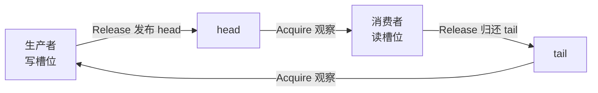

# C++ 无锁数据结构与 SPSC Ring Buffer

“没有写 `mutex`”不等于“程序一定更快”，也不等于“每个线程都不会等待”。无锁算法首先描述的是一种**进展保证**：某个线程暂停时，系统中的其他线程是否还能继续完成操作。

HFT 关注无锁结构，是因为锁持有者被抢占、共享缓存行争用和不可控排队都可能放大尾延迟。本章从最容易证明的单生产者、单消费者队列开始，同时说明 ABA 和内存回收为何让通用无锁容器变得危险。

> 本章目标：准确区分 blocking、lock-free 与 wait-free；写出并证明一个有界 SPSC Ring Buffer；明确队列满/空和过载语义；理解 ABA 与安全回收的风险边界。

> **面试优先级**：P0 必会进展保证的区别、SPSC 为什么不需要多生产者 CAS、Release/Acquire 分别发布什么，以及队列满时怎么办；P1 理解缓存行争用、游标回绕、ABA 与回收问题；具体填充常量和通用 MPMC 回收算法属于 P2 岗位追问。能证明正确性比背某份队列代码更重要。

## 1. 无锁到底保证了什么

先区分四个常见级别：

| 级别 | 保证 | 直觉 |
| --- | --- | --- |
| Blocking | 线程可能等待另一个参与者 | 持锁者不放钥匙，其他人就进不去 |
| Obstruction-free | 某线程单独运行足够久时可以完成 | 没人干扰时能做完 |
| Lock-free | 系统整体持续有操作完成，但个别线程可能长期失败 | 总有人完成 |
| Wait-free | 每次操作都在有界的算法步骤内完成 | 每个人都有步骤上界 |

这里的“步骤”不是墙上时间。即使算法是 wait-free，线程也可能被操作系统暂停 10 毫秒；算法只承诺它重新得到 CPU 后，不需要无限等待其他参与者。

严格的 lock-free 允许**饥饿（starvation）**：系统不断有线程成功，但某一个倒霉线程一直 CAS 失败。它不应被简单说成 wait-free。

### 1.1 锁的风险有边界，无锁的收益也有边界

一个低优先级线程持锁后被抢占，高优先级线程可能被迫等待它重新运行并解锁。这叫**优先级反转**。缩短临界区、优先级继承和合理调度可以缓解它。

无锁算法没有“持锁者”，因此能消除对锁所有者的这类依赖；但它仍会遇到：

- 操作系统抢占、线程迁核和中断；
- CAS 失败、重试和个别线程饥饿；
- 缓存 miss、缺页和 NUMA 远端访问；
- 多个核心争写同一缓存行；
- 队列已满但消费者不再前进。

所以准确说法是：**lock-free 是进展性质，不是固定延迟承诺，更不是速度魔法。**

## 2. 为什么先学 SPSC

SPSC 是 Single Producer, Single Consumer 的缩写，即：

- 恰好一个生产者线程调用 `try_push`；
- 恰好一个消费者线程调用 `try_pop`。

它适合把一条流水线拆成两个明确的所有者。例如：

```text
行情接收线程  -- SPSC -->  订单簿线程
策略线程      -- SPSC -->  风控/执行线程
热线程        -- SPSC -->  异步日志线程
```

生产者独占写 `head`，消费者独占写 `tail`。因此没有两个线程争抢“谁来写下一个 head”，也就不需要 CAS。



SPSC 仍然有跨核通信。游标和数据所在的缓存行仍需在核心之间传播；它消除的是**多写者争用**，不是所有缓存一致性流量。

## 3. Ring Buffer 的直觉模型

Ring Buffer 是首尾相接的固定数组。走到最后一个位置后，下一个位置回到 `0`。

本章实现对外容量为 `N`，内部实际准备 `N + 1` 个槽位，留一个槽位不用。这个“空一格”的约定让满与空很好判断：

- `head == tail`：队列为空；
- `next(head) == tail`：队列已满；
- 其他情况：`tail` 指向下一条可读消息，`head` 指向下一处可写槽位。

例如内部有 5 个槽位、可用容量为 4：

```text
空： head=2, tail=2

          tail/head
              ↓
槽位    [0] [1] [2] [3] [4]

满： head=1, tail=2，因为 next(head)=2

          head tail
            ↓   ↓
槽位    [0] [1] [2] [3] [4]
可读顺序：2 -> 3 -> 4 -> 0
```

“内部数组长度”和“对外可用容量”必须写进 API 文档。不同库可能采用每槽位序号等其他方案，不能只凭类名猜满/空语义。

## 4. 正确性来自五条不变量

代码之前先写规则。若任何一条被破坏，换成 SeqCst 也救不了算法。

1. **角色唯一**：只有一个线程调用 `try_push`，只有一个线程调用 `try_pop`。
2. **游标单写者**：生产者独占写 `head`，消费者独占写 `tail`。
3. **不覆盖未读数据**：生产者观察到满时返回 `false`，绝不继续写。
4. **发布后才读取**：生产者写完槽位后，用 Release 更新 `head`；消费者用 Acquire 观察新 `head` 后才读槽位。
5. **读完才复用**：消费者读完槽位后，用 Release 更新 `tail`；生产者用 Acquire 观察新 `tail` 后才覆盖该槽位。

第 4 条保护“第一次交付”，第 5 条保护“下一圈复用”。只写第一条 Release/Acquire 链是不完整的。

## 5. 一个完整、可运行的教学实现

下面的程序固定存储 `Order`，避免把模板、异常安全和任意对象生命周期一次塞给初学者。它没有动态分配槽位，也不会在 `try_push` / `try_pop` 内等待。

```cpp
#include <array>
#include <atomic>
#include <cstddef>
#include <cstdint>
#include <iostream>
#include <thread>

struct Order {
    std::uint64_t sequence{};
    std::int64_t price_ticks{};
    std::uint32_t quantity{};
};

template <std::size_t Capacity>
class SpscOrderQueue {
    static_assert(Capacity > 0, "Capacity must be positive");

public:
    bool try_push(const Order& order) noexcept {
        // head 只有生产者写，所以读取自己的值不需要 Acquire。
        const std::size_t head = head_.load(std::memory_order_relaxed);
        const std::size_t next = increment(head);

        // Acquire 与消费者归还槽位的 Release 配对。
        if (next == tail_.load(std::memory_order_acquire)) {
            return false;  // 满：不覆盖消费者尚未读取的数据。
        }

        slots_[head] = order;  // 普通内存写。

        // 槽位完全写好后，再把新 head 发布给消费者。
        head_.store(next, std::memory_order_release);
        return true;
    }

    bool try_pop(Order& order) noexcept {
        // tail 只有消费者写，所以读取自己的值不需要 Acquire。
        const std::size_t tail = tail_.load(std::memory_order_relaxed);

        // Acquire 与生产者发布消息的 Release 配对。
        if (tail == head_.load(std::memory_order_acquire)) {
            return false;  // 空：没有消息可读。
        }

        order = slots_[tail];  // 普通内存读。

        // 读完后才归还槽位，生产者下一圈才能覆盖它。
        tail_.store(increment(tail), std::memory_order_release);
        return true;
    }

    [[nodiscard]] bool indices_are_lock_free() const noexcept {
        return head_.is_lock_free() && tail_.is_lock_free();
    }

private:
    static constexpr std::size_t storage_size = Capacity + 1;

    static constexpr std::size_t increment(std::size_t index) noexcept {
        return index + 1 == storage_size ? 0 : index + 1;
    }

    std::array<Order, storage_size> slots_{};

    // 64 是常见缓存行大小，但不是 C++ 对所有机器的保证。
    // 分开对齐是为了避免 head 与 tail 互相伪共享。
    alignas(64) std::atomic<std::size_t> head_{0};
    alignas(64) std::atomic<std::size_t> tail_{0};
};

int main() {
    constexpr std::uint64_t order_count = 200'000;
    SpscOrderQueue<1024> queue;
    std::uint64_t sequence_sum = 0;

    std::thread producer([&] {
        for (std::uint64_t sequence = 0; sequence < order_count; ++sequence) {
            const Order order{sequence, 10'000 + static_cast<std::int64_t>(sequence % 10), 1};
            while (!queue.try_push(order)) {
                // 只是演示重试；真实系统必须决定满时如何背压或失败。
                std::this_thread::yield();
            }
        }
    });

    std::thread consumer([&] {
        for (std::uint64_t received = 0; received < order_count; ++received) {
            Order order;
            while (!queue.try_pop(order)) {
                std::this_thread::yield();
            }
            sequence_sum += order.sequence;
        }
    });

    producer.join();
    consumer.join();

    const std::uint64_t expected = order_count * (order_count - 1) / 2;
    std::cout << "sum=" << sequence_sum << ", expected=" << expected << '\n';
    std::cout << "index atomics are lock-free on this machine: "
              << std::boolalpha << queue.indices_are_lock_free() << '\n';
}
```

编译运行：

```bash
g++ -std=c++20 -O2 -pthread spsc_queue.cpp -o spsc_queue
./spsc_queue
```

### 5.1 为什么两个普通槽位访问不会数据竞争

第一次使用某槽位时：

1. 生产者完成 `slots_[head] = order`；
2. 生产者 Release store 新 `head`；
3. 消费者 Acquire load 读到新 `head`；
4. 消费者才读取槽位。

因此写 happens-before 读。

槽位绕一圈再次使用时：

1. 消费者先完成 `order = slots_[tail]`；
2. 消费者 Release store 新 `tail`；
3. 生产者 Acquire load 读到新 `tail`；
4. 生产者才覆盖已归还的槽位。

因此上一轮读 happens-before 下一轮写。两条链合在一起，才能证明生产者和消费者不会同时访问同一槽位。

### 5.2 为什么 `head` 和 `tail` 自己可以 Relaxed load

生产者是 `head` 的唯一写者，它读取的是自己维护的进度，不需要从其他线程接收 `head` 携带的数据。消费者对自己的 `tail` 也是如此。

跨线程观察才需要匹配的语义：消费者 Acquire 读生产者 Release 发布的 `head`；生产者 Acquire 读消费者 Release 归还的 `tail`。

### 5.3 `alignas(64)` 是假设，不是宇宙常数

若 `head` 和 `tail` 落在同一缓存行，两个核心即使写不同变量，也会反复争夺这条缓存行，这叫**伪共享（false sharing）**。

示例用 64 字节表达常见 x86-64/AArch64 机器的经验值，但 C++20 不保证所有硬件的破坏性干扰大小都是 64。生产代码应确认目标 CPU、ABI 和实际对象布局，并用性能计数器或实验验证，而不是把对齐值当成可移植定律。

### 5.4 这段教学代码的边界

这段代码适合解释不变量，不应原样复制进生产交易系统：

- API 无法在编译期阻止第二个生产者误用；
- 只存固定的简单 `Order`，没有处理任意对象的构造、析构和异常；
- 没有关闭、取消、超时、批量接口和监控；
- 每次满/空都重新跨核读取远端游标，没有做本地缓存优化；
- `std::atomic<std::size_t>` 是否由无锁指令实现取决于平台；
- 64 字节对齐需要在目标机器验证；
- 外层无限重试依赖对方线程继续运行。

生产项目应优先采用经过审计、压力测试并与平台匹配的成熟实现；即便使用库，也必须读清生产者数量、容量、满/空、关闭和对象生命周期语义。

## 6. “单次 try”与“整个业务请求”不是同一个保证

教学实现的 `try_push` 和 `try_pop` 源码里没有显式重试循环，会在固定数量的源码步骤内返回成功、满或空。但 `is_lock_free() == true` 只说明原子实现不依赖锁，并不自动证明每次底层原子操作都有步骤上界。要正式声称单次 try 是 wait-free，还必须证明目标平台上的原子操作以及所有执行路径都在有界步骤内完成。

但 `main` 中的调用者写了：

```cpp,ignore
while (!queue.try_push(order)) {
    std::this_thread::yield();
}
```

如果消费者永久停止，这个循环永远不结束。因此“发送一笔订单直到成功”没有完成上界。分析进展保证时要明确对象是：

- 一次 `try_push`；
- 带无限重试的包装；
- 还是从策略信号到交易所确认的整个业务请求。

## 7. 队列满时，业务语义比循环写法更重要

有界队列把系统容量问题暴露出来，这是优点。`try_push` 返回 `false` 后，调用者必须做业务选择：

| 策略 | 适用前提 | 风险 |
| --- | --- | --- |
| 立即失败并上报 | 上层能处理拒绝 | 需要清楚的错误传播 |
| 有界自旋后失败 | 预计消费者很快恢复 | 仍会消耗热线程 CPU |
| 阻塞或 park | 允许牺牲延迟换资源 | 可能引入调度长尾 |
| 丢弃 | 该消息明确允许丢 | 订单、风控指令通常不能静默丢弃 |
| 覆盖最旧消息 | 只适合特殊“只要最新值”语义 | 会破坏普通 FIFO 语义 |
| 切换恢复/降级路径 | 已设计快照、重放或熔断 | 实现与验证更复杂 |

行情增量丢失后通常要触发 gap 检测和快照恢复；订单提交失败必须显式返回并进入风控定义的状态。不要把 `while` 无限重试当成过载策略。

队列还应暴露占用水位、满次数、消息年龄和消费者进度。仅看平均吞吐，可能错过即将出现的延迟雪崩。

## 8. 为什么 MPSC / MPMC 难很多

多个生产者共享一个写游标时，需要协调“谁获得哪个槽位”。常见实现使用 CAS 或 `fetch_add` 领取序号，再用每槽位 sequence 表示是否完成写入。

困难随之增加：

- 一个生产者领到槽位后被抢占，会不会留下发布空洞？
- CAS 失败如何退避，是否导致饥饿？
- 每槽位序号回绕后如何避免误判？
- 对象构造抛异常或线程取消时，槽位处于什么状态？
- 多个消费者何时能安全析构或回收节点？

HFT 中常见的替代方案是：每个生产者拥有自己的 SPSC，由单一消费者轮询或分层聚合。它会增加队列数量和轮询策略，却保留单写者不变量，通常更容易分析尾延迟。

## 9. ABA：值回来了，世界却已经变了

CAS 只比较当前比特是否仍等于旧比特。考虑无锁栈顶指针：

```text
线程 1：读取 top=A  --------------------------  CAS(A -> C)
线程 2：             A -> B -> A
```

线程 1 暂停期间，线程 2 把状态从 A 改到 B，又改回看起来相同的 A。线程 1 的 CAS 可能成功，以为“什么都没变”，但 A 可能已经代表另一个对象。

在链表或栈中，经典危险是：

1. 线程 1 保存节点 A 的裸指针后暂停；
2. 线程 2 弹出并释放 A；
3. 分配器恰好在相同地址创建新节点；
4. 地址仍是 A，但对象身份和内容已经改变；
5. 线程 1 解引用旧指针，可能形成 use-after-free。

### 9.1 常见缓解方案

| 方案 | 核心想法 | 仍要证明的边界 |
| --- | --- | --- |
| Tagged pointer / 版本号 | 地址和值一起带 generation | 位宽、对齐利用和版本回绕 |
| Epoch-based reclamation | 所有相关读者离开旧 epoch 后再释放 | 停滞线程、内存积压和线程注册 |
| Hazard pointer | 读者公布自己可能解引用的节点 | 公布顺序、扫描成本和槽位上限 |
| 固定槽位/索引句柄 | 避免动态节点立即释放复用 | generation 回绕和槽位所有权 |
| 重构为单写者 | 把动态共享状态集中给一个 owner | 路由、队列容量和故障恢复 |

预分配 Ring Buffer 避开了“链表节点释放后地址复用”的经典问题，但不意味着任何有限状态都天然免疫 ABA。只要状态能回到旧比特模式，就要结合容量、代数距离和 generation 回绕给出证明。

内存回收通常比 CAS 本身更难。对动态无锁栈、链表或哈希表，应优先使用成熟库，并核对它支持的线程模型和回收协议。不要把网上几十行 CAS 示例直接放进生产。

## 10. C++ 与 Rust 对照

| 主题 | C++20 | Rust | 共同点 |
| --- | --- | --- | --- |
| 原子游标 | `std::atomic<std::size_t>` | `AtomicUsize` | Ordering 需要同样的 happens-before 证明 |
| 槽位共享 | 程序员靠协议避免数据竞争 | 常需 `UnsafeCell<MaybeUninit<T>>` 封装 | 安全 API 背后都有槽位所有权不变量 |
| 缓存行对齐 | `alignas(...)` | `#[repr(align(...))]` | 实际硬件大小与布局都要验证 |
| 生命周期 | 裸指针很容易绕过约束 | 借用检查器会阻止许多悬垂引用 | 真正的无锁回收在两边都很难 |
| 成熟队列 | 第三方库/内部审计实现 | 第三方 crate/内部审计实现 | 不能只看 API 名称猜进展与满空语义 |

Rust 会让很多普通生命周期错误更难写出来，但无锁容器内部通常仍需 `unsafe`；C++ 则从一开始就把更多证明责任交给开发者。两种语言都不能用压测替代内存模型证明。

## 11. HFT 设计选择

| 场景 | 推荐起点 | 原因 |
| --- | --- | --- |
| 冷路径、竞争低、临界区短 | Mutex | 简单、容易证明，未必慢 |
| 一对一固定流水线 | 有界 SPSC | 单写者、无 CAS、背压明确 |
| 多生产者日志 | 每生产者 SPSC + 聚合，或成熟 MPSC | 避免所有线程争一个热游标 |
| 按 symbol/account 可拆分状态 | 分片 + 单 owner | 从结构上减少共享 |
| 动态通用无锁容器 | 成熟库优先 | ABA、回收、异常和取消很难覆盖 |

比较方案时至少记录：吞吐、P50/P99/P99.9、CPU 占用、队列满/空次数、CAS 失败次数、消息年龄、线程亲和性和 NUMA 拓扑。一个单线程平均耗时无法说明并发结构是否合适。

## 12. 面试追问与参考答法

### Q1：Lock-free 是否保证我的线程不会饿死？

不保证。它保证系统整体持续有操作完成，个别线程仍可能长期失败。每次操作都有算法步骤上界才是 wait-free；墙上时间还受调度影响。

### Q2：SPSC 为什么不需要 CAS？

因为 `head` 和 `tail` 各只有一个写者，不需要多个线程竞争谁获得下一个游标值。双方仍需通过 Release/Acquire 发布数据和归还槽位。

### Q3：SPSC 为什么还要两个方向的 Release/Acquire？

生产者发布 `head`，保证消费者在读槽位前看到写好的消息；消费者发布 `tail`，保证生产者在下一圈覆盖槽位前，消费者已经读完。缺少任一方向都无法证明槽位复用安全。

### Q4：无锁为什么可能比 Mutex 更慢？

高争用 CAS 会带来失败重试和缓存行迁移；复杂算法还增加指令、分支和 I-cache 压力。低竞争 Mutex 可能走很短的用户态快路径。结论必须来自目标负载测量。

### Q5：预分配是否彻底解决 ABA？

它避免了动态节点释放后地址立即复用这一经典来源，但有限序号会回绕，其他状态也可能回到旧比特模式。仍需 generation、容量距离或其他协议证明。

## 13. 易错点

1. **把 lock-free 说成 wait-free**：系统前进不代表当前订单有完成上界。
2. **让两个生产者调用 SPSC**：这直接破坏单写者不变量。
3. **队列满了仍覆盖**：会静默破坏尚未消费的数据。
4. **只做生产者到消费者的同步**：忘记消费者归还槽位到生产者的同步。
5. **把无限自旋当低延迟**：对方停止后会永久占用核心。
6. **认为对齐一次就解决缓存问题**：数据槽位仍需跨核交付，目标硬件缓存行也需验证。
7. **CAS 成功就宣布算法 lock-free**：还要证明所有交错中的进展，并处理回收、ABA、异常和取消。
8. **照抄动态无锁容器**：功能测试很难覆盖罕见交错和 use-after-free。

## 14. 练习与参考答案

### 练习 1

容量为 4、内部使用 5 个槽位的队列中，`head=1`、`tail=2`。队列是满还是空？

<details>
<summary>参考答案</summary>

满。`next(head)` 从 1 走到 2，等于 `tail`。按照“永远留一个空槽”的约定，这表示已有 4 条可读数据，顺序是槽位 2、3、4、0。

</details>

### 练习 2

为什么消费者不能先更新 `tail`，再从槽位复制消息？

<details>
<summary>参考答案</summary>

更新 `tail` 等于告诉生产者“这个槽位可复用”。生产者可能立刻覆盖它，而消费者仍在读取，形成数据竞争和撕裂消息。必须先读完，再用 Release 归还槽位。

</details>

### 练习 3

`try_push` 在队列满时立即返回 `false`，但调用者用无限循环重试。应该如何描述进展保证？

<details>
<summary>参考答案</summary>

区分层次：单次 `try_push` 有固定步骤并能返回“满”；整个无限重试操作依赖消费者释放容量，如果消费者停止，它就不会完成，因而不能声称整个发送请求 wait-free。

</details>

### 练习 4

一个多生产者 CAS 队列平均延迟更低，但 P99.9 更高、CAS 失败数随线程数剧增。可以先尝试什么结构调整？

<details>
<summary>参考答案</summary>

考虑减少共享：按 symbol/account 分片，或给每个生产者独立 SPSC，再由消费者聚合。同时保持相同负载、线程亲和性和测量边界，重新比较吞吐、P50/P99/P99.9 与 CPU 使用率。

</details>

## 15. 小结

- Lock-free 保证系统整体进展，wait-free 才讨论每次操作的步骤上界；
- SPSC 的核心优势来自单生产者、单消费者和游标单写者；
- 满、空、容量和过载策略是 API 正确性的一部分；
- 生产者发布消息与消费者归还槽位需要两条 Release/Acquire 链；
- 无锁不消除缓存通信、调度和饥饿；
- ABA 与安全内存回收使动态无锁容器远比一个 CAS 循环复杂；
- 教学 Ring Buffer 用于理解和验证，不应未经审计直接进入生产。

进一步阅读：[C++ 原子操作与内存模型](atomics_memory_model.md) 与 [`std::atomic`](https://en.cppreference.com/w/cpp/atomic/atomic)。
