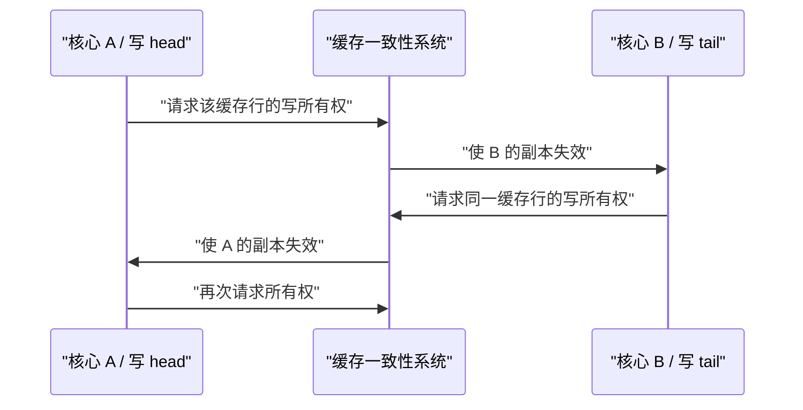
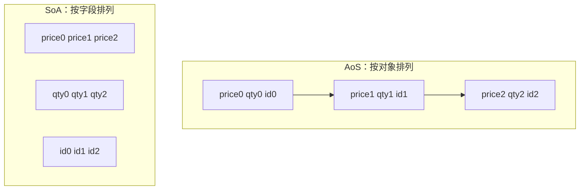

# 内存布局、对齐、缓存与伪共享

一段代码在数学上只做几次加法，却仍可能很慢，因为 CPU 等待数据的时间可能远长于计算时间。对于低延迟程序，“数据放在哪里、相邻放了什么、由哪个核心写”常常和算法本身一样重要。

本章先解释对象为什么会有填充字节，再建立缓存行和伪共享的直觉。所有具体大小和性能结论都标明边界：C++ 语言保证、平台 ABI（Application Binary Interface，二进制接口约定）和某次实测不是一回事。

## 1. 从“地址”开始理解内存

可以把内存想成一排带编号的小格子，每个格子容纳一个字节。对象占据其中一段连续区域，对象起始位置必须满足它的**对齐要求**。

例如，一个类型的对齐是 8，常见含义是它的起始地址要是 8 的倍数。编译器可能在字段之间插入没有业务含义的字节，这些字节叫 **padding（填充）**。

为什么需要对齐？因为许多 CPU 对自然对齐的数据访问更友好，某些指令甚至要求特定对齐。C++ 把每种完整对象类型的大小和对齐暴露为：

- `sizeof(T)`：一个 `T` 对象占多少字节；
- `alignof(T)`：`T` 要求的对齐；
- `offsetof(T, field)`：标准布局类型中某字段相对对象开头的偏移。

## 2. 亲手观察字段与填充

下面程序故意改变字段顺序，并打印当前编译器与目标平台的观察结果：

```cpp
#include <cstddef>
#include <cstdint>
#include <iostream>
#include <type_traits>

struct ScatteredOrder {
    std::uint64_t id;
    bool is_buy;
    std::int64_t price_ticks;
    bool is_ioc;
};

struct GroupedOrder {
    std::uint64_t id;
    std::int64_t price_ticks;
    bool is_buy;
    bool is_ioc;
};

int main() {
    static_assert(std::is_standard_layout_v<ScatteredOrder>);
    static_assert(std::is_standard_layout_v<GroupedOrder>);

    std::cout << "Scattered: size=" << sizeof(ScatteredOrder)
              << ", align=" << alignof(ScatteredOrder)
              << ", price offset=" << offsetof(ScatteredOrder, price_ticks)
              << '\n';

    std::cout << "Grouped:   size=" << sizeof(GroupedOrder)
              << ", align=" << alignof(GroupedOrder)
              << ", price offset=" << offsetof(GroupedOrder, price_ticks)
              << '\n';
}
```

在常见 64 位平台上，把对齐要求相近的字段放在一起，往往能减少内部填充。但**不要把你机器打印的数字当成协议规范**：基本类型大小、ABI 和编译器选项都可能影响结果。

以 C++20 为基线时，同一类中具有相同访问控制、大小非零的普通非位域成员，会按声明顺序让后声明成员具有更高地址；编译器仍可在中间和末尾加入填充。不同访问控制、继承、虚基类和 `[[no_unique_address]]` 还有额外规则，不能仅凭肉眼推算。

### 2.1 为什么末尾也会填充？

数组中的元素必须一个接一个排列。如果一个类型要求 8 字节对齐，那么 `items[1]` 也必须正确对齐。于是 `sizeof(T)` 通常会向其对齐要求的整数倍取整，让下一个元素从合适地址开始。

### 2.2 填充字节不能当业务数据

两个对象的每个字段都相等，填充字节却可能不同。因此，普通结构体不应直接用 `std::memcmp` 判断语义相等，也不应未经定义的序列化规则就把整块对象内存发送到网络。

更安全的做法是逐字段比较、逐字段编码，并明确：

- 字段宽度；
- 有符号性；
- 字节序；
- 版本与长度；
- 对齐是否属于线格式的一部分。

## 3. `alignas`：提高对象对齐

`alignas(N)` 可以请求更严格的对齐。下面把两个计数器分别放进至少 64 字节对齐的对象中：

```cpp
#include <atomic>
#include <array>
#include <cassert>
#include <cstdint>

struct alignas(64) IsolatedCounter {
    std::atomic<std::uint64_t> value{0};
};

int main() {
    static_assert(alignof(IsolatedCounter) >= 64);
    static_assert(sizeof(IsolatedCounter) % alignof(IsolatedCounter) == 0);

    std::array<IsolatedCounter, 2> counters{};
    counters[0].value.store(1);
    counters[1].value.store(2);
    assert(counters[0].value.load() == 1);
    assert(counters[1].value.load() == 2);
}
```

数组元素连续排列，相邻元素的步长由 `sizeof(IsolatedCounter)` 决定，因此这里不需要把两个对象地址强行转换后相减。随意对不属于同一数组的指针做减法，本身就可能违反 C++ 规则。

这里的 **64 是目标平台假设，不是 C++ 的通用缓存行保证**。许多 x86_64 CPU 使用 64 字节缓存行，但其他架构可能不同；即使缓存行是 64 字节，地址映射和相邻对象也仍要验证。

提高对齐通常会增大 `sizeof(T)`。这可能隔离写热点，也可能让同样大小的缓存装下更少对象。只读数据或同一线程拥有的数据通常不需要逐个填充到一整行。

## 4. 缓存行：CPU 不是一次只搬一个字段

CPU 访问主存时，缓存系统通常以 **cache line（缓存行）** 为单位搬运数据。若目标机器的缓存行是 64 字节，而程序只使用这 64 字节中的 8 字节，那么其余数据仍占用了缓存容量和带宽。


图只表示常见层级，不表示固定延迟。缓存是否共享、容量、关联度、替换策略和访问延迟都由具体微架构决定。

理解缓存时，先记住两种局部性：

- **空间局部性**：刚访问一个地址，接下来还会访问它附近的数据；
- **时间局部性**：刚访问一个数据，短时间内还会再访问它。

订单簿按价格档连续扫描，通常具有较好的空间局部性；在巨大的哈希表中随机跳转，则更容易产生缓存和 TLB 压力。TLB（Translation Lookaside Buffer）可以先理解为 CPU 保存“虚拟地址到物理地址翻译结果”的小缓存。

## 5. 伪共享：变量不同，缓存行相同

多核 CPU 必须保持各核心缓存中的共享数据一致。典型协议会以缓存行为粒度协调所有权。

**伪共享（false sharing）** 指两个线程修改的是不同变量，但这两个变量恰好落在同一缓存行。由于一致性协议看的是整行，这条缓存行会在核心之间反复失效和迁移。



典型场景是单生产者单消费者队列：生产者高频写 `tail`，消费者高频写 `head`。二者逻辑独立，若放在同一行，仍可能出现缓存行 ping-pong。

### 5.1 不是所有共享都叫伪共享

- 两个线程确实竞争同一个计数器，这是**真共享**；padding 不能消除真实的数据依赖。
- 多个线程只读同一缓存行，通常不需要来回抢写所有权。
- 两个字段同属一个线程的热状态，放在一起反而可能提高局部性。
- 只有 profiling 证实跨核心写入带来问题时，隔离才有依据。

### 5.2 原子操作不自动解决伪共享

`std::atomic` 解决的是特定并发访问的原子性与内存顺序，不改变缓存一致性的传输粒度。两个正确使用的原子变量仍可能伪共享；反过来，单纯加 padding 也不能修复数据竞争。

## 6. AoS 与 SoA：对象整齐，还是字段整齐？

假设每笔订单有价格、数量和 ID：

- **AoS（Array of Structures）**：`Order, Order, Order...`；
- **SoA（Structure of Arrays）**：一段全是价格，一段全是数量，一段全是 ID。



下面两种表示计算同一个价格总和：

```cpp
#include <cassert>
#include <cstdint>
#include <vector>

struct Order {
    std::int64_t price_ticks;
    std::uint32_t quantity;
    std::uint64_t id;
};

struct OrdersSoA {
    std::vector<std::int64_t> prices;
    std::vector<std::uint32_t> quantities;
    std::vector<std::uint64_t> ids;
};

std::int64_t sum_aos(const std::vector<Order>& orders) {
    std::int64_t total = 0;
    for (const auto& order : orders) {
        total += order.price_ticks;
    }
    return total;
}

std::int64_t sum_soa(const OrdersSoA& orders) {
    std::int64_t total = 0;
    for (const auto price : orders.prices) {
        total += price;
    }
    return total;
}

int main() {
    std::vector<Order> aos{{100, 2, 1}, {101, 3, 2}, {102, 1, 3}};
    OrdersSoA soa{{100, 101, 102}, {2, 3, 1}, {1, 2, 3}};
    assert(sum_aos(aos) == 303);
    assert(sum_soa(soa) == 303);
}
```

如果循环只读取价格，SoA 通常能让一次缓存行加载包含更多有用价格，也更容易向量化。但若业务每次都使用一笔订单的全部字段，AoS 可能拥有更自然的局部性。

SoA 还增加了维护成本：插入或删除时，多个数组必须保持相同长度和相同索引含义。它不是免费的“性能开关”。

## 7. HFT 场景：把热数据和冷数据分开

订单热路径可能只需要价格、剩余数量、方向和状态；客户标签、长文本和审计上下文只在日志或查询时使用。把所有字段塞进一个大对象，会让热循环反复搬运冷数据的控制信息。

一种做法是用紧凑 `HotOrder` 按 ID 访问冷数据：

```cpp
#include <cassert>
#include <cstdint>
#include <string>
#include <unordered_map>
#include <vector>

struct HotOrder {
    std::uint64_t id;
    std::int64_t price_ticks;
    std::uint32_t remaining;
    bool is_buy;
};

struct ColdOrderMetadata {
    std::string client_tag;
    std::string audit_note;
};

int main() {
    std::vector<HotOrder> active{{7, 10'025, 100, true}};
    std::unordered_map<std::uint64_t, ColdOrderMetadata> metadata;
    metadata.emplace(7, ColdOrderMetadata{"strategy-a", "created at startup"});

    active[0].remaining -= 25; // 热路径只触碰紧凑数据
    assert(active[0].remaining == 75);
    assert(metadata.at(7).client_tag == "strategy-a");
}
```

这只是布局示例，不代表热路径应使用 `std::unordered_map` 查冷数据。真实选型要考虑 ID 空间、更新方式、内存上限和并发模型。

### 7.1 一个带数字的教学算例

假设目标 CPU 的缓存行是 64 字节，某个 AoS 元素为 64 字节，而循环只读取其中一个 8 字节价格字段。理想化地看，一条缓存行只带来一个价格。若 SoA 连续存放 8 字节价格，同一行可容纳 8 个价格。

这是**教学算例，不是性能预测**。真实结果还受对齐起点、预取器、缓存命中、向量化、数据规模和并发流量影响。

## 8. `packed` 为什么危险

一些编译器提供 `packed` 扩展来移除填充，但这不是可移植的标准 C++ 语法。更重要的是，字段可能落在不满足其自然对齐的位置；直接形成普通引用或执行要求对齐的访问可能出问题。

下面只是展示常见扩展，不能作为可移植程序：

```cpp,ignore
struct __attribute__((packed)) WireOrder {
    std::uint8_t type;
    std::uint64_t id; // 很可能没有按 8 字节对齐
};
```

解析网络协议时，更稳妥的办法通常是：先检查缓冲区长度，再逐字段读取字节，显式处理端序，最后写入自然对齐的业务对象。不要把不可信字节直接解释成结构体，也不要把带原子字段的对象打包。

## 9. C++ 与 Rust 对照

| 目的 | C++20 | Rust | 需要注意 |
|---|---|---|---|
| 查询大小和对齐 | `sizeof`、`alignof` | `size_of`、`align_of` | 都是针对具体目标构建的结果 |
| 提高对齐 | `alignas(N)` | `#[repr(align(N))]` | `N` 不自动等于缓存行大小 |
| C 兼容布局 | 标准布局类型 + 目标 ABI | `#[repr(C)]` | “C 兼容”仍依赖双方目标 ABI 和字段类型 |
| 紧凑/打包布局 | 常见为编译器扩展 | `#[repr(packed)]` | 未对齐访问都需格外谨慎 |
| 防止数据竞争 | 原子、锁和程序员维护规则 | 原子、锁 + 类型系统约束 | padding 只处理布局，不提供同步 |
| 借用有效性 | 程序员保证指针/引用生命周期 | 借用检查器覆盖大量情况 | 两边都不能用布局优化替代生命周期设计 |

Rust 默认结构体布局和 C++ 普通类型一样，都不能随意当成稳定网络格式。跨语言或落盘布局必须有明确表示规则与兼容性测试。

## 10. 语言保证、ABI 观察与性能实测

| 结论 | 属于哪一层 | 正确用法 |
|---|---|---|
| `sizeof(char) == 1` | C++ 语言保证 | 但一个字节不保证恰好 8 位，可查 `CHAR_BIT` |
| C++20 中相同访问控制、非零普通成员的地址按声明顺序递增 | C++ 对该成员类别的布局规则 | 仍允许中间和末尾 padding |
| `std::uint64_t` 一定存在 | 不保证 | 只有平台提供恰好 64 位无符号整数时才定义它 |
| 某结构体在本机是 24 字节 | 当前 ABI/构建观察 | 可用静态断言锁定特定协议构建，但不要外推到所有平台 |
| 缓存行一定是 64 字节 | 不保证 | 查询目标 CPU；64 只是在许多平台上的常见值 |
| padding 后延迟一定下降 | 不保证 | 观察缓存一致性事件和完整延迟分布 |
| SoA 一定比 AoS 快 | 不保证 | 取决于每次操作实际使用哪些字段 |

## 11. 如何做可信的布局基准

一个最小但像样的实验应记录：

1. CPU 型号、核心拓扑、内存和操作系统；
2. 编译器版本、`-O` 级别、目标指令集和 LTO（链接时优化）设置；
3. 数据量是否能放入 L1/L2/末级缓存；
4. 线程绑核方式，生产者和消费者是否跨 NUMA 节点；NUMA 指不同 CPU/内存节点的访问代价可能不同；
5. 预热、样本数、计时边界和异常值处理；
6. 吞吐以及 p50、p99、p99.9，而非只有平均值；
7. 可用时记录 cache miss（所需数据未命中目标缓存）、分支和缓存一致性相关硬件计数器。

防止编译器删除测试结果，并不等于随便加入一个 `volatile`。优先使用成熟基准框架的防优化工具，并检查生成汇编确认测到的是目标代码。

## 12. 面试追问与参考答法

### Q1：为什么结构体字段顺序会改变大小？

每个字段有对齐要求，编译器会在字段之间和对象末尾加入 padding。把高对齐字段分散开可能产生更多空隙；具体结果应用 `sizeof`、`alignof` 和 `offsetof` 在目标构建上确认。

### Q2：什么是伪共享？原子变量能避免吗？

不同线程写不同变量，但变量位于同一缓存行，导致该行在核心间反复迁移，这叫伪共享。原子变量保证相应操作的原子性和内存顺序，不改变缓存行粒度，因此不能自动避免伪共享。

### Q3：什么时候 SoA 比 AoS 更合适？

当热循环只扫描少数字段、数据量大且访问连续时，SoA 往往提高有效缓存密度，也更利于 SIMD。若每次处理都用到完整对象，AoS 可能更自然。需要测量真实访问模式。

### Q4：为什么不能直接发送结构体内存？

其中可能有 padding、平台相关字节序和 ABI 布局，指针字段更没有跨进程意义。应按协议逐字段编码，并校验长度和版本。

### Q5：对齐到 64 字节会带来什么代价？

对象大小通常增加，缓存和 TLB 能容纳的对象数量下降，内存占用也增加。如果数据并没有跨核心高频写，隔离可能得不偿失。

## 13. 易错点

1. **把本机 `sizeof` 当跨平台标准**：它通常只是当前 ABI 的结果。
2. **用 `memcmp` 比较普通业务对象**：padding 可能不同，浮点和指针语义也不适合逐字节比较。
3. **为每个字段都加 64 字节 padding**：缓存密度和内存占用会迅速恶化。
4. **把 false sharing 当数据竞争**：二者可以同时存在，但一个是正确性问题，一个主要是性能问题。
5. **认为 `atomic` 必然很慢或必然无锁**：是否无锁及真实成本依类型、平台和竞争情况而变。
6. **未测量就改成 SoA**：复杂的数据同步成本可能超过缓存收益。

## 14. 练习与参考答案

### 练习 1：判断是否值得隔离

一个配置对象在启动时写入，之后 20 个线程只读。是否应该把每个字段都对齐到 64 字节？

<details>
<summary>参考答案</summary>

通常不应该。只读共享不会让核心反复争抢写所有权，把字段分散反而降低缓存密度。除非测量发现特殊的访问或相邻可写数据问题，否则保持紧凑更合理。

</details>

### 练习 2：AoS 还是 SoA

风险循环只对一百万笔订单的 `remaining_quantity` 求和，每笔完整订单还有 80 字节冷字段。优先尝试哪种布局？

<details>
<summary>参考答案</summary>

优先尝试把剩余数量连续存放，或至少把热字段与冷字段拆开。这样每条缓存行包含更多有效数据。但要在真实数据规模和编译选项下比较，并确认多个数组的一致性维护没有引入新错误。

</details>

### 练习 3：区分正确性与性能

两个线程无同步地写同一个普通整数，并且该整数单独占一条缓存行。padding 是否让程序正确？

<details>
<summary>参考答案</summary>

不会。无同步并发写会产生数据竞争，属于未定义行为；独占缓存行只改变布局和潜在性能。应先使用正确的所有权、原子或锁，再讨论缓存行隔离。

</details>

## 15. 小结

- 对齐决定对象可放置的地址，padding 帮助满足字段和数组元素的对齐要求。
- 缓存以行工作；数据布局决定搬进缓存的字节中有多少真正有用。
- false sharing 是不同变量共享写热点缓存行，原子性和缓存隔离必须分别设计。
- AoS 适合按对象处理，SoA 常适合只扫描少数字段；没有脱离访问模式的赢家。
- C++ 保证对象模型语义，但具体结构体大小、缓存行和性能来自 ABI、硬件与构建实测。
