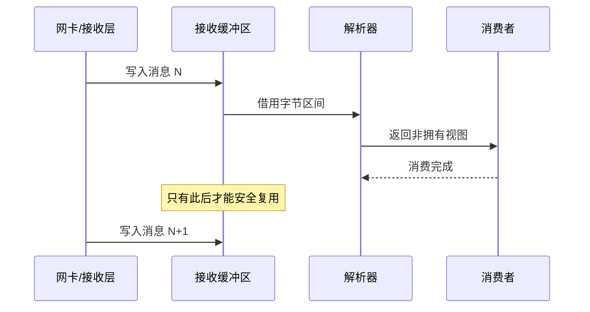

# 指针、引用、`const` 与对象生命周期

指针常被讲成“一个很危险的语法符号”，这会让初学者只记住 `*` 和 `&`，却不明白真正的问题。本章换一个角度：**对象是仓库里的箱子，指针保存箱子的地址，引用是给同一个箱子起的另一个名字**。访问是否安全，取决于箱子还在不在，以及你有没有修改它的权限。

## 1. 先认识对象的地址

一个普通整数对象有值，也有地址：

```cpp
#include <cstdint>
#include <iostream>

int main() {
    std::int64_t price_ticks = 10'025;

    std::int64_t* price_ptr = &price_ticks;
    std::int64_t& price_ref = price_ticks;

    std::cout << "value through object: " << price_ticks << '\n';
    std::cout << "value through pointer: " << *price_ptr << '\n';
    std::cout << "value through reference: " << price_ref << '\n';

    *price_ptr = 10'026;
    price_ref = 10'027;
    std::cout << "final value: " << price_ticks << '\n';
}
```

按顺序解释：

- `&price_ticks` 取得对象地址；
- `std::int64_t*` 表示“指向 `std::int64_t` 的指针类型”；
- `*price_ptr` 解引用指针，也就是访问该地址处的对象；
- `std::int64_t&` 声明引用，`price_ref` 是 `price_ticks` 的别名；
- 通过指针或引用修改，最终改的都是同一个对象。

`&` 和 `*` 在不同位置有不同含义：声明里的 `T&` 是引用类型，表达式里的 `&x` 是取地址；声明里的 `T*` 是指针类型，表达式里的 `*p` 是解引用。先结合上下文读，不必把符号孤立背诵。

## 2. 指针与引用的实际区别

| 维度 | 指针 `T*` | 引用 `T&` |
|---|---|---|
| 是否可表示“没有对象” | 可以，用 `nullptr` | 正常引用必须绑定对象 |
| 能否改为指向别处 | 指针变量通常可以 | 引用绑定后不能改绑；赋值会修改所引用对象 |
| 使用语法 | 常需 `*p` 或 `p->field` | 像原对象一样 `r` 或 `r.field` |
| 是否表达所有权 | 裸指针本身不表达 | 引用本身不表达 |
| 常见用途 | 可选访问、数组区间、底层接口 | 必须存在的函数参数、别名 |

“引用不能是空”是一条接口意图，不代表它绝对不会悬空。如果引用指向的对象已经销毁，这个引用仍然无效。

### 2.1 可选对象用指针

```cpp
#include <iostream>

struct Quote {
    int price_ticks;
};

void print_quote(const Quote* quote) {
    if (quote == nullptr) {
        std::cout << "no quote\n";
        return;
    }
    std::cout << quote->price_ticks << '\n';
}

int main() {
    const Quote best_bid{10'025};
    print_quote(&best_bid);
    print_quote(nullptr);
}
```

`quote->price_ticks` 等价于 `(*quote).price_ticks`，前者更易读。解引用前先检查是否为 `nullptr`。

### 2.2 必须存在的对象用引用

```cpp
#include <cstdint>
#include <iostream>

struct Position {
    std::int64_t quantity;
};

void set_position_quantity(Position& position, std::int64_t new_quantity) {
    position.quantity = new_quantity;
}

void print_position(const Position& position) {
    std::cout << position.quantity << '\n';
}

int main() {
    Position position{100};
    set_position_quantity(position, 125);
    print_position(position);
}
```

`Position&` 表示函数会接收一个已经存在的 `Position`，并且可能修改它。`const Position&` 表示只读访问。两者都避免为了调用函数复制整个对象。这里接收的是已经计算并验证过的新持仓；真实的“旧持仓 + 成交量”必须先检查加法是否越过业务限额或整数范围，不能用一次裸 `+=` 代替风控。

## 3. `const`：限制通过某条路径修改

`const` 初看像“永远不变”，更准确的直觉是：**不能通过当前名字或访问路径修改对象**。其他非 `const` 路径是否能修改同一对象，要看程序中是否还存在别名。

### 3.1 最常用的三个写法

```cpp
#include <iostream>

int main() {
    int first = 100;
    int second = 200;

    const int* pointer_to_const = &first;
    pointer_to_const = &second; // 可以改指向
    // *pointer_to_const = 300; // 不可以通过它修改对象

    int* const const_pointer = &first;
    *const_pointer = 300;       // 可以修改对象
    // const_pointer = &second; // 不可以改指向

    const int& read_only_ref = first;
    // read_only_ref = 400;     // 不可以通过只读引用修改

    std::cout << *pointer_to_const << ' '
              << *const_pointer << ' '
              << read_only_ref << '\n';
}
```

被注释掉的两行如果打开会编译失败，所以它们留在完整程序中作为说明性注释。

可以从变量名向外读：

- `const int* p`：`p` 指向 `const int`，对象只读，指向可变；
- `int* const p`：`p` 是常量指针，指向不变，对象可写；
- `const int* const p`：指向和对象访问权限都不变；
- `const int& r`：只读引用。

### 3.2 顶层 `const` 与底层 `const`

术语上，修饰指针变量本身的 `const` 常称为**顶层 `const`**；修饰所指对象的 `const` 常称为**底层 `const`**。初学阶段不用死记名字，只要每次回答两个问题：

1. 地址能不能换？
2. 能不能通过这条路径修改对象？

### 3.3 `const` 不等于线程安全

`const` 成员函数或 `const T&` 主要是类型接口约束，不自动阻止另一个线程通过其他路径修改对象。若存在并发共享，仍需不可变设计、原子操作或锁等同步机制。

## 4. 生命周期：地址有效不只看它是不是非空

合法访问一个对象，至少要同时满足：

- 指针不是空，或引用已经正确绑定；
- 指向的是适当类型、正确对齐的有效对象；
- 对象的生命周期尚未结束；
- 访问没有越过对象或数组边界；
- 并发访问满足数据竞争规则。

仅仅打印出一个“看上去正常”的地址，不能证明这些条件。

### 4.1 悬空指针

```cpp,ignore
// 故意错误：函数返回局部对象地址。price 在 return 后已销毁。
int* bad_price_address() {
    int price = 10'025;
    return &price;
}

int main() {
    int* dangling = bad_price_address();
    return *dangling; // 未定义行为
}
```

这种指针叫**悬空指针（dangling pointer）**。它保存的数值可能仍像一个地址，但那个位置已经不再承载原来的 `int` 对象。程序有时“碰巧运行”并不让它合法。

返回值通常更安全：

```cpp
#include <iostream>

int make_price() {
    const int price = 10'025;
    return price;
}

int main() {
    const int price = make_price();
    std::cout << price << '\n';
}
```

现代 C++ 编译器通常能通过返回值优化等机制避免不必要复制；不要为了“省一次复制”返回局部地址。

### 4.2 悬空引用

引用同样会悬空：

```cpp,ignore
// 故意错误：临时字符串在完整表达式结束后销毁，view 随后悬空。
#include <string>
#include <string_view>

int main() {
    std::string_view view = std::string{"BTC-CNY"};
    return view.front(); // 故意解引用悬空 view：行为未定义
}
```

`std::string_view` 只借用字符，不拥有字符串。它很轻量，适合零拷贝查看，但调用者必须保证底层字符存活得足够久。

## 5. 数组、指针与边界

C 风格数组在许多表达式中会退化为首元素指针，长度信息随之丢失。现代接口优先使用 `std::span` 表示“指针 + 长度”的非拥有视图：

```cpp
#include <array>
#include <cstdint>
#include <iostream>
#include <span>

std::int64_t sum_quantities(std::span<const std::int32_t> values) {
    std::int64_t total = 0;
    for (const std::int32_t value : values) {
        total += value;
    }
    return total;
}

int main() {
    const std::array<std::int32_t, 4> quantities{100, 200, 50, 150};
    std::cout << sum_quantities(quantities) << '\n';
}
```

`std::span<const T>` 不复制元素，也不拥有数组；它把范围长度和访问起点一起传递。底层数组仍必须在 `span` 使用期间存活，且对 `span` 做下标访问时仍需遵守边界。

### 5.1 指针算术为什么要谨慎

对数组元素指针做 `p + 1` 可以移到下一元素，但合法范围受到严格限制。下面是故意的越界错误：

```cpp,ignore
// 故意错误：values 只有 3 个元素，values + 3 是尾后指针，不能解引用。
int main() {
    int values[3]{10, 20, 30};
    int* end = values + 3;
    return *end; // 未定义行为
}
```

尾后指针可以用于比较和表示范围终点，不能读取。标准容器、范围 `for` 和算法能减少手写边界错误。

## 6. 所有权：裸指针没有告诉你的事

看到 `Order*`，仅靠类型通常无法知道：

- 它是否可以为空；
- 调用者还是被调用者负责销毁；
- 它指向一个对象还是数组；
- 它能用多久；
- 它是否可跨线程访问。

因此现代 C++ 接口常用不同类型表达意图：

- `T&` / `const T&`：非空、非拥有访问；
- `T*` / `const T*`：可能为空的非拥有访问；
- `std::span<T>`：非拥有连续范围；
- `std::string_view`：非拥有字符视图；
- `std::unique_ptr<T>`：独占所有权；
- `std::shared_ptr<T>`：共享所有权；
- `std::optional<T>`：值可能不存在，但存在时直接拥有该值。

这不是语言强制的唯一风格，但清晰类型能降低“谁来 `delete`”的猜测成本。

## 7. 教学算例：零拷贝视图省了什么

假设每条行情含 32 字节标的代码，程序每秒处理 200 万条消息。若每次都复制 32 字节，仅从字节量看是：

\[
32 \times 2{,}000{,}000 = 64{,}000{,}000\ \text{bytes/s}
\]

约为 64 MB/s（按十进制）。使用 `std::string_view` 或 `std::span` 可以避免这一步复制，但会增加生命周期约束：接收缓冲区一旦复用，视图就不能继续保留。

真实性能不能只按字节数推断。复制可能被向量化并命中缓存；视图可能让大缓冲区长期无法复用，或导致后续随机访存。正确问题是：“省掉复制后，谁保证底层缓冲区在消费完成前不被覆盖？”

## 8. Rust 心智模型对照

| C++ | 可借用的 Rust 直觉 | 必须补上的差异 |
|---|---|---|
| `const T&` | `&T` | C++ 通常不证明没有其他可变别名 |
| `T&` | `&mut T` | C++ 不强制独占可变借用 |
| `const T*` | `*const T` 或可选借用的直觉 | C++ 裸指针可直接解引用，但合法性由程序员保证 |
| `T*` | `*mut T` | 指针本身不表达有效期和所有权 |
| `std::span<const T>` | `&[T]` | `span` 没有被编译器追踪的生命周期参数 |
| `std::string_view` | `&str` 的非拥有直觉 | C++ 可形成悬空 view，编译器通常不会阻止 |

Rust 的借用检查器会拒绝许多明显悬空关系；C++ 依赖 API 约定、所有权类型、代码审查、静态分析和测试共同降低风险。

## 9. HFT 联系：缓冲区复用与零拷贝

行情接收线程常复用固定缓冲区。解析器可以返回指向缓冲区的视图，从而减少复制，但必须明确消费边界：



如果消费者把视图放入队列后，生产者立刻覆盖缓冲区，那么队列里保存的是地址，不是消息快照。解决方式可能是转移缓冲区所有权、使用分槽 ring buffer、在清楚边界处复制，或让消费者在复用前完成处理。选型取决于生产者/消费者模型和背压策略。

## 10. 面试追问与参考答法

### Q1：指针和引用有什么区别？

**参考答法**：指针可以为 `nullptr`，通常能改指向，需要显式解引用；引用正常情况下绑定一个对象且不能改绑，使用语法像别名。两者默认都不表达所有权，也都可能因为对象先销毁而悬空。

### Q2：`const T&` 是否保证对象永远不变？

**参考答法**：它保证不能通过这条引用路径调用普通修改操作，但同一对象可能还有非 `const` 别名，也可能有内部可变设计。因此它既不等于全局不可变，也不自动等于线程安全。

### Q3：`std::span` 是否拥有数据？

**参考答法**：不拥有。它通常表示连续区间的起点和长度，复制 `span` 不会复制元素。调用者必须保证底层存储在 `span` 使用期间有效且没有不合法并发修改。

### Q4：一个非空指针是否一定能解引用？

**参考答法**：不一定。它还可能悬空、未对齐、指向错误类型、处于对象边界之外，或参与数据竞争。非空只是必要条件之一。

## 11. 易错点

- 把 `&` 一律读成“取地址”，忽略它也能出现在引用声明中；
- 认为引用绝不悬空；
- 检查过一次非空后，忽略对象可能已在别处销毁；
- 把 `const` 当成深层、全局、线程安全的不可变保证；
- 从函数返回局部对象的指针、引用或 `string_view`；
- 保存容器元素指针后又让容器扩容，导致地址失效；
- 用裸指针传递所有权，却没有写明谁负责释放；
- 把尾后指针当作最后一个元素解引用。

## 做题方法

指针有效性题为每个指针/引用建立一行：指向对象、允许范围、是否可写、来源对象寿命、会使它失效的操作。

1. 创建指针时记录它来自局部对象、动态分配、容器元素还是数组；只有同一数组对象及其尾后一位允许进行规定范围内的指针运算。
2. 每次解引用前检查非空、对齐、对象仍活跃、指向范围内且访问类型正确；非空只是第一项。
3. 函数参数区分 `T*` 可表达可空、`T&` 必须绑定对象、`span` 同时携带范围；根据契约选择，不用引用隐藏“可能没有值”。
4. 容器插入、删除、扩容、移动和销毁后，按该容器规则更新所有旧指针/引用/迭代器状态。
5. 所有权题另画谁负责 `delete`；裸指针通常只表示观察，不应靠命名猜销毁责任。
6. `const` 题从标识符向外读声明，分别判断“指针能否改指向”和“所指对象能否经此路径修改”。

验算时每次解引用都必须能在表中找到唯一仍活跃对象和合法范围；返回函数局部对象的地址或引用会在返回边界立即失效。

## 12. 练习与参考答案

### 练习 1

为下面三种接口选择较合适的参数类型：

1. 函数必须读取一个已存在订单，不能修改；
2. 函数可以接收“没有最佳报价”；
3. 函数只读查看一段连续价格，不拥有它们。

<details>
<summary>参考答案</summary>

1. `const Order&`；
2. `const Quote*`，用 `nullptr` 表示没有；若希望值语义，也可按接口需要使用 `std::optional<Quote>`；
3. `std::span<const Price>`。

这些只是常见选择，真实接口还需说明生命周期和线程边界。

</details>

### 练习 2

解释 `const int* const p` 的两个 `const`。

<details>
<summary>参考答案</summary>

靠近 `int` 的 `const` 表示不能通过 `p` 修改所指整数；靠近变量一侧的 `const` 表示 `p` 自身不能改为指向别的地址。

</details>

### 练习 3

解析器返回 `std::string_view` 指向接收缓冲区，调用者把它保存到第二天使用。需要确认什么？

<details>
<summary>参考答案</summary>

必须确认底层字符存储直到第二天仍然存在且内容未被覆盖。网络接收缓冲区通常很快复用，所以这种保存方式大概率不成立。若需要长期保存，应在明确的位置复制到拥有数据的 `std::string`，或转移整个缓冲区的所有权。

</details>

## 小结

指针保存地址，引用提供别名，二者都不自动拥有对象。安全访问不仅要求地址非空，还要求对象仍存活、范围正确、类型与对齐合法，并满足并发规则。现代 C++ 的关键做法是让接口类型尽量表达“可否为空、是否只读、是否拥有、范围多大”，把生命周期假设从默契变成可以审查的设计。
