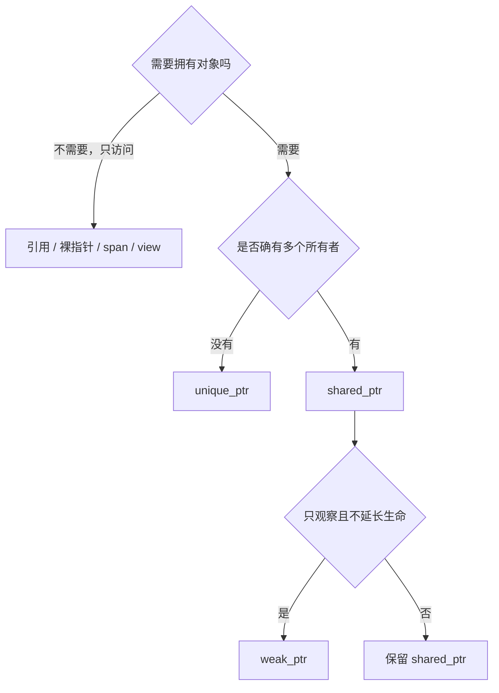

# 智能指针：用类型表达所有权

裸指针只保存地址，看不出谁负责释放。智能指针仍然通过指针间接访问对象，但它把“谁拥有、能否共享、何时销毁”写进类型。本章的核心不是把所有 `T*` 替换掉，而是先画清所有权，再选择最小够用的类型。

> 本章目标：能用 `std::unique_ptr` 表达独占所有权，用 `std::shared_ptr` 表达确有需要的共享所有权，用 `std::weak_ptr` 打破所有权环；能区分智能指针自身的线程安全与对象内容的线程安全；理解分配、间接访问、引用计数和最后一次释放的成本。

## 1. 先问“谁拥有”，再选指针

看一份配置对象，可能有三种关系：

1. 引擎独占配置，其他函数只在调用期间查看；
2. 多个长期组件共同保证配置存活；
3. 监控组件只想观察配置，不应延长它的生命。

对应的常见表达是：



“多个地方会用到”不等于“多个地方必须拥有”。若一个上层对象拥有配置，子函数只在调用期间使用，引用通常已经足够。

## 2. `std::unique_ptr<T>`：唯一所有者

`std::unique_ptr<T>` 表示同一时刻只有一个该所有权对象负责销毁 `T`。它不能复制，可以移动。

```cpp
#include <cstdint>
#include <iostream>
#include <memory>
#include <utility>

struct Order {
    std::uint64_t id;
    std::int64_t quantity;
};

void send(std::unique_ptr<Order> order) {
    std::cout << "send order " << order->id
              << ", quantity " << order->quantity << '\n';
}

int main() {
    auto order = std::make_unique<Order>(Order{42, 100});
    send(std::move(order));

    if (order == nullptr) {
        std::cout << "ownership transferred\n";
    }
}
```

这段程序的所有权变化是：

```text
main::order  --std::move-->  send::order  --离开函数-->  销毁 Order
```

`std::make_unique` 创建动态对象并返回拥有它的 `unique_ptr`。当最后的唯一所有者离开作用域时，对象被销毁、存储被释放。

### 2.1 为什么优先 `make_unique`

与直接写 `new` 相比，`make_unique`：

- 把分配和所有权包装写在同一表达式里；
- 不需要重复写类型；
- 减少裸拥有指针暴露的时间；
- 在复杂表达式和异常路径中更容易保持清理正确。

现代业务代码很少需要直接出现 `delete`。底层资源封装器可能需要自定义删除器，但应把它隔离在小范围 RAII 类型内。

### 2.2 只借用，不转移

拥有对象的函数可以把 `*pointer` 作为引用传给只读函数：

```cpp
#include <iostream>
#include <memory>

struct Quote {
    int price_ticks;
};

void inspect(const Quote& quote) {
    std::cout << quote.price_ticks << '\n';
}

int main() {
    auto quote = std::make_unique<Quote>(Quote{10'025});
    inspect(*quote);
    inspect(*quote);
}
```

`inspect` 不需要知道对象在栈上还是动态存储中，只表达“调用期间只读借用”。不要为了让函数查看对象就把参数改成 `shared_ptr`。

### 2.3 `.get()` 不是交出所有权

`pointer.get()` 返回裸指针，适合调用只接受旧式指针的非拥有接口。这个裸指针不能自行 `delete`，也不能活得比 `unique_ptr` 更久。

```cpp,ignore
// 故意错误：borrowed 不拥有对象，手动 delete 会与 unique_ptr 重复释放。
auto owner = std::make_unique<Order>();
Order* borrowed = owner.get();
delete borrowed;
```

若必须把所有权交给明确要求裸指针的接口，`release()` 会放弃所有权，但这很容易泄漏，应只在适配清楚的 C API/遗留 API 契约时使用。

## 3. `std::shared_ptr<T>`：共享所有权

`shared_ptr` 通常与一个控制块配合，控制块记录强引用计数等信息。复制一个 `shared_ptr` 不会深拷贝 `T`，而是增加共享所有者；最后一个强所有者销毁时才销毁 `T`。

```cpp
#include <iostream>
#include <memory>
#include <string>
#include <utility>

struct Config {
    std::string venue;
    int max_order_quantity;
};

void risk_check(const Config& config) {
    std::cout << config.venue << ' '
              << config.max_order_quantity << '\n';
}

int main() {
    auto config = std::make_shared<const Config>(Config{"DEMO", 1'000});
    auto strategy_owner = config;

    risk_check(*config);
    std::cout << "owners: " << config.use_count() << '\n';
}
```

`std::make_shared` 通常能把控制块和对象放进一次组合分配中，但具体布局和分配行为属于实现细节；对象很大、需要特殊删除器或希望对象与控制块分开释放时，权衡会不同。

示例用 `const Config` 表达共享后只读。`use_count()` 适合教学和诊断，不应拿来做并发业务决策：读取后计数可能立即变化。

### 3.1 复制成本不是深拷贝，但不是免费

一次 `shared_ptr` 复制通常要更新控制块的引用计数。跨线程频繁复制/销毁同一共享对象时，计数所在缓存行可能在 CPU 核之间传递，增加一致性流量。最后一次释放还可能连带执行对象析构和内存释放。

常见低延迟做法是：

- 启动时给每个长期工作线程保留一份所有者；
- 事件循环内部使用引用，不逐条消息复制、销毁 `shared_ptr`；
- 配置更新发布不可变快照，并明确旧快照回收路径；
- 先测量引用计数是否真的在瓶颈上。

### 3.2 `shared_ptr` 不等于共享对象线程安全

引用计数能在多个 `shared_ptr` 所有者间安全维护，不表示多个线程可以无同步地修改 `T`。

```cpp,ignore
// 概念片段：若两个线程同时执行 ++state->value，会形成数据竞争。
struct State { int value = 0; };
auto state = std::make_shared<State>();
// thread A: ++state->value;
// thread B: ++state->value;
```

共享可变内容仍需锁、原子类型、线程分片或消息传递。并且多个线程同时修改**同一个 `shared_ptr` 变量本身**也需要同步或 `std::atomic<std::shared_ptr<T>>` 等合适接口；不要把“控制块安全”扩大解释。

## 4. `std::weak_ptr<T>`：观察但不延长生命

`weak_ptr` 指向 `shared_ptr` 的控制块，但不增加强引用计数。使用前调用 `lock()`：对象还活着就得到一个临时 `shared_ptr`，否则得到空指针。

```cpp
#include <iostream>
#include <memory>
#include <string>
#include <utility>

struct Session {
    explicit Session(std::string value) : name(std::move(value)) {}

    ~Session() {
        std::cout << "destroy " << name << '\n';
    }

    std::string name;
    std::weak_ptr<Session> peer;
};

int main() {
    auto first = std::make_shared<Session>("first");
    auto second = std::make_shared<Session>("second");
    first->peer = second;
    second->peer = first;

    if (const auto peer = first->peer.lock()) {
        std::cout << first->name << " sees " << peer->name << '\n';
    }
}
```

双方都用 `shared_ptr` 指向对方会形成所有权环：外部所有者释放后，两个对象仍互相把强计数保持在非零，无法销毁。

```cpp,ignore
// 故意展示循环所有权；不是完整程序。
struct Node {
    std::shared_ptr<Node> next;
};
// a->next = b; b->next = a; 外部 a、b 释放后仍可能泄漏。
```

把不应该拥有对方的一边改成 `weak_ptr`，就能打破环。更根本的问题仍是先确定所有权图，而不是遇到泄漏后随机替换。

## 5. `unique_ptr` 数组、容器与“对象集合”

`std::unique_ptr<T[]>` 能管理动态数组，但大多数业务集合更适合 `std::vector<T>`：它同时管理长度、容量和元素生命周期，支持迭代器与算法。

```cpp
#include <iostream>
#include <memory>

int main() {
    const std::size_t count = 4;
    auto quantities = std::make_unique<int[]>(count);
    for (std::size_t i = 0; i < count; ++i) {
        quantities[i] = static_cast<int>((i + 1) * 100);
    }
    std::cout << quantities[2] << '\n';
}
```

如果每个元素本身需要稳定地址、独立多态生命周期，`vector<unique_ptr<T>>` 可能合理；如果只存普通订单档位，`vector<T>` 的连续布局通常更简单，也减少每元素一次间接访问与分配。必须根据访问模式选择。

## 6. 自定义删除器：非内存资源也能托管

`unique_ptr` 可以携带删除器，因此也能管理 C API 资源。下面用标准 C 文件句柄演示：

```cpp
#include <cstdio>
#include <iostream>
#include <memory>

struct FileCloser {
    void operator()(std::FILE* file) const noexcept {
        if (file != nullptr) {
            std::fclose(file);
        }
    }
};

int main() {
    using FilePtr = std::unique_ptr<std::FILE, FileCloser>;
    FilePtr file{std::tmpfile()};
    if (!file) {
        std::cerr << "failed to create temporary file\n";
        return 1;
    }

    std::fputs("snapshot\n", file.get());
    std::cout << "file will close at scope exit\n";
}
```

`FileCloser` 把 `fclose` 绑定到所有者析构。真实文件写入还要检查 `fputs`、刷新和关闭错误；析构清理不适合承担需要可靠上报的最终持久化确认。

## 7. 选择表：所有权关系比类型名字重要

| 类型 | 所有权 | 常见创建/复制成本 | 适用关系 |
|---|---|---|---|
| `T` 成员 | 直接拥有 | 随 `T` 而定 | 对象组成部分，优先考虑 |
| `T&` / `const T&` | 不拥有、非空 | 通常无计数 | 调用期间借用 |
| `T*` / `const T*` | 通常不拥有、可空 | 通常无计数 | 可选借用、旧接口 |
| `unique_ptr<T>` | 独占 | 创建常动态分配；移动通常较轻 | 唯一所有者、运行期多态 |
| `shared_ptr<T>` | 强共享 | 创建需控制块；复制/销毁改计数 | 生命周期确实由多方共同决定 |
| `weak_ptr<T>` | 观察 | `lock` 检查并尝试取得强所有权 | 缓存、回调、打破环 |

能直接把对象作为成员时，不必为了“现代 C++”强行放进智能指针。智能指针主要解决动态生命周期和所有权表达，不是所有对象的默认容器。

## 8. 教学算例：逐条复制共享指针的额外工作

假设一个线程每秒处理 300 万条消息，每条消息都复制并销毁一次指向同一配置的 `shared_ptr`。从逻辑操作次数看，每秒至少包含约：

\[
3{,}000{,}000\ \text{次强计数增加}
+ 3{,}000{,}000\ \text{次强计数减少}
= 6{,}000{,}000\ \text{次计数更新}
\]

这不是时间预测，因为单次成本取决于实现、架构、是否跨核竞争和缓存状态。但它提示我们改变生命周期：线程启动时保留一份 `shared_ptr`，事件循环中通过引用访问，就可能把逐条计数更新移出热路径。

## 9. Rust 心智模型对照

| C++ | Rust 近似对应 | 重要差异 |
|---|---|---|
| `unique_ptr<T>` | `Box<T>` | C++ 可自定义删除器，并与更多裸指针接口互操作 |
| `shared_ptr<T>` | `Rc<T>` / `Arc<T>` 的共享所有权直觉 | C++ `shared_ptr` 计数通常支持跨线程，但 `T` 的线程安全仍单独判断 |
| `weak_ptr<T>` | `Weak<T>` | 都不保持强所有权，升级/lock 可能失败 |
| `T&` / `T*` | 引用/裸指针直觉 | C++ 没有同等生命周期参数检查 |

特别注意：Rust 区分单线程 `Rc` 与跨线程 `Arc`；C++ 的 `shared_ptr` 控制块计数可用于跨线程共享所有权，但这不使所指类型自动可安全跨线程读写。

## 10. HFT 联系：配置快照和订单所有权

智能指针在低延迟系统中常出现在两个不同位置：

- **控制面配置**：更新频率低，工作线程读取频率高。可发布不可变 `shared_ptr<const Config>` 快照，但避免逐条消息复制所有者；还要规划旧配置何时析构。
- **数据面消息/订单**：所有权通常沿流水线单向移动。`unique_ptr` 表达清楚，但每条消息动态分配可能昂贵；预分配槽位、值类型 ring buffer 或对象池可能更合适。

不要把智能指针当成并发队列。它只回答对象生命，不回答消息可见性、队列满空语义、内存顺序和背压。

## 11. 面试追问与参考答法

### Q1：什么时候用 `unique_ptr`，什么时候用 `shared_ptr`？

**参考答法**：默认从单一所有者开始，用 `unique_ptr` 或直接成员；只有对象寿命确实由多个独立所有者共同决定时才用 `shared_ptr`。只访问对象的函数用引用/指针，不因“多个调用者”就共享所有权。

### Q2：`shared_ptr` 是否线程安全？

**参考答法**：不同 `shared_ptr` 实例共享同一控制块时，引用计数维护支持并发所有权操作；这不保护 `T` 的可变字段，也不意味着可以无同步并发修改同一个 `shared_ptr` 变量。内容同步要另行设计。

### Q3：为什么需要 `weak_ptr`？

**参考答法**：它观察共享对象但不增加强引用，不延长对象生命。常用于打破 `shared_ptr` 所有权环、缓存和回调注册；使用时 `lock()`，必须处理对象已经销毁的情况。

### Q4：`make_shared` 总是最好吗？

**参考答法**：它常能减少一次分配并改善局部性，但对象和控制块的回收时机可能耦合；特殊删除器、大对象或特殊分配需求也可能选择其他方式。应先确保所有权正确，再按真实场景权衡。

## 12. 易错点

- 把所有裸指针机械替换为 `shared_ptr`；
- 函数只借用对象，却按值接收 `shared_ptr`，引入无意计数更新；
- 从 `.get()` 得到裸指针后手动 `delete`；
- 保存 `.get()` 结果超过所有者生命周期；
- 认为 `shared_ptr` 自动保护对象内部数据；
- 依靠 `use_count() == 1` 做并发正确性判断；
- 形成 `shared_ptr` 环导致对象无法销毁；
- 在热路径最后一次释放大型对象，产生析构尖峰；
- 忽略 `unique_ptr<T[]>` 与 `unique_ptr<T>` 的删除形式差异；
- 把每元素 `unique_ptr` 当作连续容器，忽略分配和指针追逐。

## 13. 练习与参考答案

### 练习 1

引擎独占一个订单簿，策略函数只在一次调用中读取它。参数是否应为 `shared_ptr<const Book>`？

<details>
<summary>参考答案</summary>

通常不需要。引擎可直接拥有 `Book` 或 `unique_ptr<Book>`，策略函数接收 `const Book&`。只有策略需要在调用结束后独立延长对象寿命时，才重新讨论共享所有权。

</details>

### 练习 2

两个节点用 `shared_ptr` 互相指向，外部所有者都释放后为什么仍可能泄漏？

<details>
<summary>参考答案</summary>

两个节点各自保留对方的强所有权，使强引用计数始终不为零。应重新画所有权图，把不应拥有的一条或多条反向边改成 `weak_ptr`，或采用上层统一拥有的结构。

</details>

### 练习 3

工作线程每条消息接收一次按值 `shared_ptr<const Config>`，函数只读且不保存配置。怎样减少所有权计数操作？

<details>
<summary>参考答案</summary>

让工作线程在更长生命周期内保留一份所有者，热路径函数接收 `const Config&`。配置热更新时再用经过设计的发布机制替换快照；仍需验证旧配置回收和线程同步。

</details>

## 小结

智能指针的首要价值是表达所有权。`unique_ptr` 适合唯一所有者，`shared_ptr` 只在多方确实共同决定生命周期时使用，`weak_ptr` 提供不延长生命的观察。只访问对象时优先引用、指针或视图。低延迟代码还要测量动态分配、间接访问、引用计数和最后析构是否进入关键路径，而不是仅凭类型名称判断快慢。
