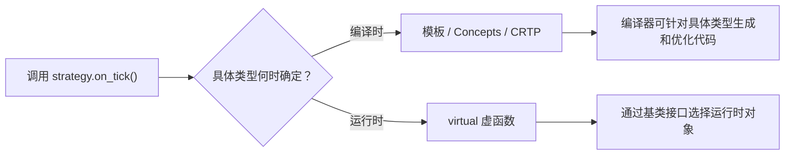

# 模板、Concepts、`constexpr` 与多态

写交易系统时，我们经常希望“同一套逻辑处理不同类型”，例如同一个风控规则既检查限价单，也检查市价单。C++ 提供了两大类办法：**编译期抽象**（模板、Concepts、CRTP）和**运行时抽象**（虚函数）。

函数模板从调用点推导类型；虚函数则通过基类接口在运行时选择实现。先分别理解两种机制，才能讨论约束、代码体积和扩展性的取舍。

## 1. 先建立直觉：两种“以后再决定”

假设策略要调用一个“收到行情后给出报价”的组件。具体组件可以在两个时间点确定：

- **编译时确定**：编译器已经知道是 `Maker`。常用模板或 CRTP，称为**静态分发**。
- **运行时确定**：程序读取配置后才知道是 `Maker` 还是 `Taker`。常用虚函数，称为**动态分发**。



这里没有“永远更高级”的方案。静态分发更容易内联，但模板实例过多可能增加机器码；动态分发便于插件化，却通常多一次间接调用。最后是否影响延迟，必须在目标机器和真实负载上测量。

## 2. 函数模板：让类型成为参数

普通函数的参数是“值”；模板还可以把“类型”当作编译期参数。下面的 `larger` 能比较 `int` 和 `double`：

```cpp
#include <cassert>

template <typename T>
T larger(T left, T right) {
    return left < right ? right : left;
}

int main() {
    assert(larger(3, 7) == 7);             // 编译器推导 T 为 int
    assert(larger(2.5, 1.0) == 2.5);       // 编译器推导 T 为 double
    assert(larger<int>(10, 8) == 10);      // 也可以显式写出 T
}
```

编译器会根据实际类型**实例化**模板。可以先把它理解成：编译器拿着模板配方，为用到的类型做出具体函数。常见实现会让这类代码发生**单态化**，于是优化器知道准确类型，容易继续内联和常量传播。

但 C++ 标准没有规定最终二进制必须保留几份函数：优化器可能内联后删除独立函数，也可能合并相同机器码。因此，应说“模板为编译器提供了静态类型信息”，不要说“每种类型必然复制一份函数”。

### 2.1 没有限制的模板，报错可能很难读

`larger` 的函数体要求 `T` 支持 `<`。在旧式模板中，这个要求没有直接写在接口上；传入不支持比较的类型后，编译器可能在很深的实例化栈中报错。

C++20 的 **Concepts** 正是用来把要求写清楚的。

## 3. Concepts：给模板写“入场条件”

Concept 可以理解成“类型必须满足的检查清单”。下面要求订单类型同时提供整数价格和整数数量：

```cpp
#include <cassert>
#include <concepts>
#include <cstdint>

template <typename T>
concept OrderLike = requires(const T& order) {
    { order.price_ticks() } -> std::convertible_to<std::int64_t>;
    { order.quantity() } -> std::convertible_to<std::int64_t>;
};

struct LimitOrder {
    std::int64_t price;
    std::int64_t qty;

    std::int64_t price_ticks() const { return price; }
    std::int64_t quantity() const { return qty; }
};

template <OrderLike Order>
bool passes_basic_risk(const Order& order) {
    return order.price_ticks() > 0 && order.quantity() > 0;
}

int main() {
    assert(passes_basic_risk(LimitOrder{10'025, 20}));
    assert(!passes_basic_risk(LimitOrder{0, 20}));
}
```

逐行看这个接口：

1. `requires(const T& order)` 创建一个只用于检查表达式是否合法的假想对象；
2. `{ order.price_ticks() }` 要求这个调用存在；
3. `-> std::convertible_to<std::int64_t>` 要求结果能转成 `std::int64_t`；
4. `template <OrderLike Order>` 表示只有满足 `OrderLike` 的类型才能进入模板。

Concept 的主要价值是**接口更明确、错误位置更靠近调用点**。它本身不承诺程序更快，也不自动检查业务语义。例如，一个类型完全可以返回负数量却仍满足这个 Concept；“方法存在”和“订单有效”是两件事。

### 3.1 Concept 不是继承关系

满足 Concept 不需要继承某个基类，也不需要显式声明“我实现了它”。只要表达式满足约束即可。这种方式常被称为结构化约束，和 Rust 中显式 `impl Trait for Type` 的组织方式不同。

## 4. `constexpr`：允许在编译期求值

`constexpr` 函数可以在满足条件时由编译器求值，也仍然可以在运行时调用。它很适合计算协议常量、价格档位或固定容量。

```cpp
#include <cassert>
#include <cstdint>

constexpr std::int64_t notional(
    std::int64_t price_ticks,
    std::int64_t quantity
) {
    return price_ticks * quantity;
}

int main() {
    constexpr auto static_value = notional(10'000, 25);
    static_assert(static_value == 250'000); // 必须能在编译期成立

    std::int64_t runtime_price = 10'100;
    auto runtime_value = notional(runtime_price, 25); // 这里是普通运行时调用
    assert(runtime_value == 252'500);
}
```

需要分清三个概念：

| 写法 | 含义 |
|---|---|
| `constexpr` 函数 | **可以**用于常量求值；传入运行时值时也能运行 |
| `consteval` 函数 | 每次调用都**必须**在编译期求值 |
| `constinit` 变量 | 要求静态或线程存储期变量完成静态初始化，不表示变量不可修改 |

`constexpr` 也不等于“运行时一定零成本”。如果参数来自网络，计算发生在运行时；优化器是否内联、折叠或向量化仍取决于上下文和构建选项。

### 4.1 编译期计算也要防溢出

上例只用于解释语法。真实的价格乘数量可能溢出 `std::int64_t`，不能直接拿来做风控。生产代码应先检查单位、符号和乘法边界，或者使用经过审查的更宽整数方案。编译期求值不会自动修复错误的业务模型。

## 5. 虚函数：运行时选择实现

虚函数让我们通过基类引用或指针调用派生类实现。下面在运行时把两种策略放进同一个容器：

```cpp
#include <cassert>
#include <cstdint>
#include <memory>
#include <vector>

class Strategy {
public:
    virtual ~Strategy() = default;
    virtual std::int64_t quote(std::int64_t fair_price) const = 0;
};

class PassiveMaker final : public Strategy {
public:
    std::int64_t quote(std::int64_t fair_price) const override {
        return fair_price - 1;
    }
};

class AggressiveTaker final : public Strategy {
public:
    std::int64_t quote(std::int64_t fair_price) const override {
        return fair_price + 1;
    }
};

int main() {
    std::vector<std::unique_ptr<Strategy>> strategies;
    strategies.push_back(std::make_unique<PassiveMaker>());
    strategies.push_back(std::make_unique<AggressiveTaker>());

    assert(strategies[0]->quote(10'000) == 9'999);
    assert(strategies[1]->quote(10'000) == 10'001);
}
```

几个第一次学习时容易漏掉的点：

- `virtual ... = 0` 是纯虚函数，表示基类只定义接口；
- `override` 让编译器检查我们是否真的覆盖了基类函数；
- 通过基类指针销毁派生对象时，基类析构函数应为 `virtual`；
- `final` 表示不再允许继续派生，也可能给优化器更多信息，但不保证一定去虚拟化；
- `std::unique_ptr` 表达独占所有权，避免手写 `delete`。

### 5.1 虚函数表哪些是保证，哪些只是常见实现？

C++ 语言保证的是：通过基类接口调用虚函数时，会执行对应的最终覆盖函数。标准**没有规定**对象里必须有一个 `vptr`，也没有规定虚函数表的布局。

主流 ABI 通常用对象内的虚表指针和一张虚函数表完成动态分发。因此常见成本包括一次间接调用，也可能让内联更困难。但优化器有时能推断出真实类型并去虚拟化。成本没有固定的“几纳秒”，应实测调用目标分布、分支预测、内联后的连锁优化和指令缓存表现。

## 6. CRTP：用继承语法做静态分发

CRTP 是 *Curiously Recurring Template Pattern* 的缩写，中文常译为“奇异递归模板模式”。名字很吓人，核心只有一句：**派生类把自己作为模板参数传给基类**。

它存在的原因，是让基类复用一段公共流程，同时在编译期调用派生类提供的“钩子”。它不适合运行时才确定具体类型的异构对象；下面用一个最小实现说明静态分发怎样发生。

<details>
<summary>进阶：CRTP 的最小实现与边界</summary>

```cpp
#include <cassert>
#include <cstdint>
#include <optional>

template <typename Derived>
class StrategyBase {
public:
    std::optional<std::int64_t> checked_quote(std::int64_t fair_price) const {
        if (fair_price <= 1) {
            return std::nullopt;
        }
        return static_cast<const Derived&>(*this).quote_impl(fair_price);
    }
};

class Maker final : public StrategyBase<Maker> {
public:
    std::int64_t quote_impl(std::int64_t fair_price) const {
        return fair_price - 1;
    }
};

int main() {
    Maker maker;
    const auto quote = maker.checked_quote(10'000);
    assert(quote.has_value());
    assert(*quote == 9'999);
    assert(!maker.checked_quote(1).has_value());
}
```

`StrategyBase<Maker>` 中的 `Derived` 已经是准确的 `Maker`。`static_cast` 把基类部分转回派生类，然后调用 `quote_impl`。这里没有虚函数，编译器通常可以直接看到目标。输入检查使用正常控制流并返回 `optional`，因此不会像只写 `assert` 那样在 Release 构建中消失；先验证 `fair_price > 1` 也保证了随后减一不会发生有符号整数溢出。

CRTP 的代价也很实际：

- 报错和继承关系比普通函数模板更难读；
- 不同派生类型不是同一种基类类型，不能自然地放进一个同类型容器；
- 错误使用转换或让对象类型不符合模式，可能引入未定义行为；
- 仅为了复用两行代码而引入 CRTP，往往不如普通自由函数清楚。

在 C++20 中，很多过去用 CRTP 表达的接口约束，现在可以用 Concept + 普通模板更直白地完成。CRTP 仍适合“基类提供公共流程、派生类提供若干静态钩子”的场景。

</details>

## 7. 数据路径和控制路径使用不同抽象

后端请求解析、AI 批处理和行情解码都可能存在高频数据路径；插件加载、配置和监控通常属于低频控制路径。一个常见设计是：

- 已经确认重要的解析或计算循环，用模板让数据类型在编译时确定；
- 启动配置、监控导出、低频插件边界，用虚函数保持扩展性；
- 先保证接口正确，再用基准与 profiling 判断动态调用是否真的重要。

下面是一个最小的 C++20 行情处理器。Concept 把消息要求写在接口上，`if constexpr` 根据类型特征在编译时选择分支：

```cpp
#include <cassert>
#include <concepts>
#include <cstdint>

template <typename T>
concept MarketUpdate = requires(const T& update) {
    { update.sequence } -> std::convertible_to<std::uint64_t>;
    { update.price_ticks } -> std::convertible_to<std::int64_t>;
    { T::changes_book } -> std::convertible_to<bool>;
};

struct QuoteUpdate {
    std::uint64_t sequence;
    std::int64_t price_ticks;
    static constexpr bool changes_book = true;
};

struct Heartbeat {
    std::uint64_t sequence;
    std::int64_t price_ticks{0};
    static constexpr bool changes_book = false;
};

struct BookState {
    std::uint64_t last_sequence{0};
    std::int64_t last_price{0};
};

template <MarketUpdate Update>
void apply(BookState& book, const Update& update) {
    book.last_sequence = update.sequence;
    if constexpr (Update::changes_book) {
        book.last_price = update.price_ticks;
    }
}

int main() {
    BookState book;
    apply(book, QuoteUpdate{1, 10'025});
    apply(book, Heartbeat{2});
    assert(book.last_sequence == 2);
    assert(book.last_price == 10'025);
}
```

这个例子只展示分发方式，没有处理真实协议中的长度、端序、序号跳跃和溢出。生产解析器必须先完成这些检查。

## 8. C++ 与 Rust 对照

| 目的 | C++20 | Rust | 关键差异 |
|---|---|---|---|
| 编译期通用代码 | `template` | 泛型 `<T>` | 两者通常都能单态化，但具体代码生成不是语言层固定公式 |
| 约束类型能力 | Concepts / `requires` | trait bound | Rust 通常显式实现 trait；C++ Concept 可直接检查表达式 |
| 运行时多态 | `virtual` + 基类指针/引用 | `dyn Trait` | 两者常用虚表实现，但对象模型和所有权规则不同 |
| 编译期分支 | `if constexpr` | 泛型、常量和条件编译等 | 都应区分语言语义与优化结果 |
| 静态接口复用 | CRTP / 模板 | trait 默认方法、泛型 | Rust 的 trait 不需要手写向下 `static_cast` |
| 生命周期安全 | 程序员维护指针/引用契约 | 借用检查器静态检查大量规则 | C++ 模板不会自动阻止悬垂引用 |

不要把 Rust 的 `dyn Trait` 简单理解成“带自动内存管理的 C++ 虚类”。动态分发和所有权是两个维度：C++ 可以对栈对象使用基类引用，Rust 也可以使用借用的 `&dyn Trait`，都不必然发生堆分配。

## 9. 语言保证与性能实测

| 说法 | 性质 | 更准确的理解 |
|---|---|---|
| 虚函数会调用最终覆盖函数 | C++ 语言保证 | 只要对象和调用都有效，动态语义由标准规定 |
| 虚函数一定用 vtable | 常见 ABI 实现 | 标准没有规定对象和虚表布局 |
| 模板一定为每个类型保留一份函数 | 不保证 | 内联、合并、LTO 都可能改变最终机器码 |
| Concept 会让代码更快 | 不保证 | 它主要约束接口；间接收益来自更明确的类型信息和设计 |
| `constexpr` 调用一定发生在编译期 | 不保证 | 只有处在必须常量求值的上下文，或优化器自行折叠时才会如此 |
| 静态分发一定快于虚函数 | 需要实测 | 还受调用目标稳定性、代码体积、I-cache 和优化器影响 |

建议在 release 构建中同时记录吞吐、p50/p99/p99.9、二进制大小和硬件计数器。只测一个函数的平均耗时，可能漏掉代码膨胀对真实系统尾延迟的影响。

## 10. 面试追问与参考答法

### Q1：模板为什么可能既提高性能，又降低性能？

模板让具体类型在编译时可见，便于内联和常量传播；但实例很多时可能增加编译时间和机器码体积，挤压指令缓存。所以应结合热路径和代码体积测量，不能只说“模板是零成本”。

### Q2：Concept 和虚基类有什么区别？

Concept 是编译期约束，类型只要满足表达式即可；虚基类提供运行时统一接口，通常通过基类指针或引用调用。前者适合类型在编译时确定，后者适合运行时异构对象。

### Q3：`constexpr` 和 `consteval` 有什么区别？

`constexpr` 函数既能编译期调用，也能运行时调用；`consteval` 函数的每次调用都必须是常量表达式。

### Q4：为什么有虚函数的基类通常需要虚析构？

若通过基类指针删除派生对象，而基类析构函数不是虚函数，行为未定义。虚析构保证先正确销毁派生部分，再销毁基类部分。

### Q5：CRTP 一定比普通虚函数好吗？

不一定。它能静态分发并复用流程，但接口更复杂，不方便运行时异构集合，也可能增加代码体积。只有约束和测量支持时才值得用。

## 11. 易错点

1. **把模板当宏**：模板经过类型检查并遵守 C++ 作用域规则，不是文本替换。
2. **认为 Concept 会检查业务正确性**：它只能检查写出的语法和类型约束，不能证明价格合理。
3. **忘记基类虚析构**：通过基类所有权销毁派生对象时会出严重问题。
4. **为了“性能”到处使用 CRTP**：复杂度是真实成本，冷路径通常更需要可读性。
5. **把 `constexpr` 当优化指令**：它提供常量求值能力，不等于命令优化器必须内联。
6. **只比较平均延迟**：动态分发和代码体积对尾延迟的影响可能与平均值不同。

## 做题方法

模板与多态题按“候选生成 → 推导/约束 → 重载排序 → 分发”四阶段处理：

1. 先列出名字查找到的普通函数、函数模板和成员；模板定义中的非依赖名通常在定义点解析，依赖名留到实例化处理。
2. 对每个模板候选执行参数推导，写出 `T` 的结果；推导失败与约束不满足会移除候选，不等于函数体编译错误。
3. 对剩余候选比较隐式转换等级、模板偏序和约束的更具体关系，选出唯一最佳函数；没有唯一最佳就是歧义。
4. 实例化选中模板后再检查函数体与所需表达式，统计不同具体类型组合产生的实例和潜在代码体积。
5. 静态多态调用可由编译器内联；虚函数通过对象的动态类型和虚表分发。对象切片会丢掉派生部分，引用/指针多态则保留动态类型。
6. Concepts 只声明可检查的语法/语义要求；若算法还依赖复杂度或额外不变量，应在契约中单独说明并测试。

验算点是每个调用都能给出完整候选集合、被淘汰理由和最终分发方式，而不是只凭“模板更匹配”猜答案。

## 12. 练习与参考答案

### 练习 1：选择分发方式

系统启动后根据配置加载一种监控导出器，之后每秒调用一次。你会优先选择模板还是虚函数？为什么？

<details>
<summary>参考答案</summary>

优先考虑虚函数或其他清晰的运行时多态方案。实现由运行时配置决定，调用频率又很低，扩展性通常比消除一次间接调用更重要。最终仍可测量，但没有理由先增加模板复杂度。

</details>

### 练习 2：给模板补约束

一个 `send(order)` 模板要求 `order.id()` 能转换为 `std::uint64_t`，`order.bytes()` 返回连续字节视图。Concept 应解决什么问题，又不能解决什么问题？

<details>
<summary>参考答案</summary>

Concept 可以让接口明确要求这两个表达式存在并具有合适类型，让错误更靠近调用点。它不能证明 ID 唯一、字节内容符合交易所协议，也不能证明视图在异步发送完成前一直有效；这些仍需业务校验和生命周期设计。

</details>

### 练习 3：解释测量边界

你发现模板版本的单次微基准更快，能否立刻替换生产中的虚函数版本？

<details>
<summary>参考答案</summary>

不能。还要确认基准是否包含真实调用目标分布、数据规模和优化选项，并观察二进制大小、指令缓存、整体 p99/p99.9 以及维护成本。微基准只说明该测量边界内的结果。

</details>

## 13. 小结

- 模板把类型带到编译期；Concepts 把模板所需能力写进接口。
- `constexpr` 表示代码具备常量求值能力，不保证每次调用都在编译期完成。
- 虚函数解决运行时多态；CRTP 和模板解决静态分发，两者服务于不同约束。
- C++ 标准规定语义，不规定所有机器码细节；vtable 布局、内联结果和延迟必须区分实现与实测。
- HFT 热路径也不应凭信仰选型：正确性优先，再比较吞吐、尾延迟、代码体积和可维护性。
