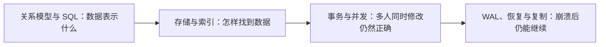
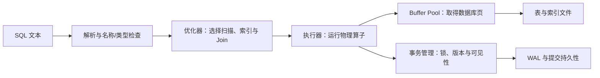

# 数据库基础

数据库不只是“能执行 SQL 的文件”。它要同时解决数据模型、持久化存储、并发正确性、故障恢复和多副本可用性。四章分别回答四个问题：

| 问题 | 主讲章 |
|---|---|
| 表、键、约束、SQL、JOIN、NULL 与规范化 | [关系模型与 SQL](relational_sql.md) |
| 页、Buffer Pool、堆文件、B+ 树、复合索引、查询计划与 Join 算法 | [存储、索引与查询执行](storage_indexes.md) |
| ACID、可串行化、隔离级别、锁、MVCC 与死锁 | [事务与并发控制](transactions_concurrency.md) |
| WAL、checkpoint、崩溃恢复、复制延迟、读己之写与分片 | [WAL、恢复、复制与分片](wal_recovery_replication.md) |

一条 SQL 进入 DBMS 后，不是直接“去磁盘找结果”。解析器先把文本变成语法树并解析表、列和类型；优化器根据统计信息枚举扫描与 Join 方案；执行器按物理计划向索引或表请求记录；Buffer Pool 决定所需数据库页是否已在内存。若语句修改数据，事务管理器还要取得必要的锁或创建新版本，恢复管理器则先生成 WAL，再按提交契约决定何时可以向客户端确认成功。

这条路径解释了为什么“SQL 语法正确”“查询结果正确”“并发下仍正确”和“崩溃后仍存在”是四个不同层次的问题。索引改变访问页的方式，隔离级别改变并发事务可观察的结果，WAL 与同步复制又改变客户端收到成功时系统已经保存到哪里。

纯读取查询通常不会产生数据修改日志，但仍要经过事务可见性判断；一次 `UPDATE` 即使只改一行，也可能同时修改表页、多个索引页和事务元数据，所以其真实成本不能只按“返回了一行”估计。

传统后端通常从 SQL、事务和索引进入；AI Infra 常遇到元数据、任务状态、向量或对象索引之外的事务性目录；HFT 系统也会把订单、成交、风控配置和审计记录放进数据库。行业场景不同，但底层问题仍是同一组：数据约束是什么，读写成本是多少，并发结果是否等价于某个正确顺序，机器突然断电后哪些结果仍然成立。
