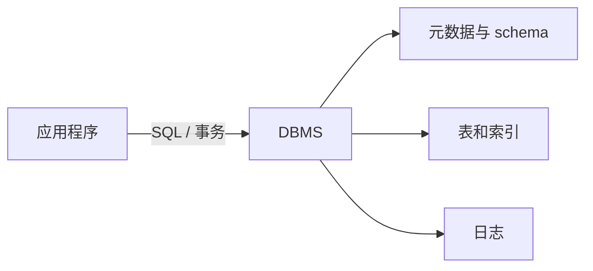

# 关系模型与 SQL

一个程序当然可以把对象直接写进文件，但很快会遇到重复数据、并发覆盖、部分写入、查询困难和格式升级。**数据库管理系统**（Database Management System，DBMS）在应用与持久化数据之间提供统一接口，并负责约束、查询优化、并发控制、恢复和权限等工作。**数据库**是被管理的数据集合；DBMS 是管理它的软件。两者在口语中常都被简称为“数据库”，讨论设计时要分清。



## 1. 表、行、列与 schema

**关系模型**把数据表示为关系。落到常见 SQL 数据库中，可以先把一个关系理解为一张表：

- **表（table）**保存同一类事实，例如用户、订单或成交；
- **行（row/tuple）**表示一条事实，例如一个用户；
- **列（column/attribute）**表示事实的一个属性，例如用户 ID；
- **schema** 规定有哪些表、列、类型、约束和其他数据库对象；
- **数据库实例（instance）**是某个时刻实际保存的行集合。

schema 像“允许什么形状的数据”的规则，实例像“此刻规则下有哪些数据”。下面用用户和订单建立贯穿本章的例子：

```sql
CREATE TABLE users (
    user_id      BIGINT PRIMARY KEY,
    email        TEXT NOT NULL UNIQUE,
    display_name TEXT NOT NULL,
    region       TEXT,
    created_at   TIMESTAMP NOT NULL
);

CREATE TABLE orders (
    order_id     BIGINT PRIMARY KEY,
    user_id      BIGINT NOT NULL,
    amount_cents BIGINT NOT NULL CHECK (amount_cents >= 0),
    status       TEXT NOT NULL,
    created_at   TIMESTAMP NOT NULL,
    CONSTRAINT orders_user_fk
        FOREIGN KEY (user_id) REFERENCES users(user_id)
);
```

类型不是装饰。金额用整数分保存，避免二进制浮点无法精确表示许多十进制小数；时间列还要明确时区语义；字符串长度与字符集政策也属于接口。

## 2. 键与约束把错误挡在数据入口

**超键（superkey）**是能唯一识别一行的一组列；去掉任何一列后都不再唯一的超键叫**候选键（candidate key）**。设计者选作主要身份的一组候选键叫**主键（primary key）**。其他候选键通常用 `UNIQUE` 表达。

在 `users` 中，`user_id` 是主键；若业务保证 email 唯一，`email` 也是候选键。主键不等于“永远使用自增整数”：自然键、UUID 和分布式 ID 都可能成为主键，选择要看稳定性、宽度、生成方式和引用成本。

**外键（foreign key）**要求子表中的值引用父表存在的候选键。例如 `orders.user_id` 必须指向真实用户。它表达的是引用完整性，不是自动的对象加载关系。

常见约束分别保护不同事实：

| 约束 | 保护的事实 |
|---|---|
| `PRIMARY KEY` | 每行有唯一且非空的身份 |
| `UNIQUE` | 指定列组合不能重复；NULL 的细节依产品规则 |
| `NOT NULL` | 该属性不能缺失 |
| `CHECK` | 单行必须满足谓词，例如金额非负 |
| `FOREIGN KEY` | 引用的父行存在 |

删除父行时，外键可以拒绝删除、级联删除或把子列置空。没有一种策略天然正确：删除用户是否应该删除审计订单，是业务和合规问题。外键动作必须显式设计。

约束与应用校验不是二选一。应用校验能给出友好错误，数据库约束负责在所有写入入口和并发竞争下守住最终事实。

## 3. 关系代数提供 SQL 的运算直觉

关系代数用少量运算组合查询。SQL 的语法更丰富，而且默认允许重复行，但以下直觉仍很重要：

- **选择（selection，σ）**按条件保留行，对应 `WHERE`；
- **投影（projection，π）**保留指定列，对应 `SELECT column...`；
- **连接（join，⋈）**按条件组合两个关系的行；
- **并、交、差**组合结构兼容的两个结果；
- **重命名**给关系或属性新的名字，便于自连接与消除歧义。

例如“找上海用户的订单号与金额”可以理解为：先从用户中选择上海用户，再与订单按 `user_id` 连接，最后投影订单号和金额。

```text
π(order_id, amount_cents)
    ( σ(region='Shanghai')(users)
      ⋈ users.user_id=orders.user_id
      orders )
```

关系代数通常按集合讨论，而 SQL 查询在没有 `DISTINCT` 时采用**包/多重集（bag/multiset）语义**：相同结果行可以出现多次。这个差别解释了为什么一对多 JOIN 会“增加行数”，也解释了 `UNION` 与 `UNION ALL` 的成本和结果不同。

## 4. SELECT 的逻辑处理顺序

SQL 写出来的顺序不是理解结果的顺序。简化后的逻辑处理顺序是：

```text
FROM / JOIN
→ WHERE
→ GROUP BY
→ HAVING
→ WINDOW 窗口计算
→ SELECT
→ DISTINCT
→ ORDER BY
→ LIMIT / OFFSET
```

查询优化器可以在不改变语义的前提下改写物理执行顺序，例如先下推过滤、换连接顺序或使用索引。上面的顺序描述逻辑结果，不承诺机器逐行照此执行。

窗口函数是在分组与 `HAVING` 之后，对已经形成的结果行计算“同一分区内的排名、累计值或相邻值”。因此同一查询层的 `WHERE` 不能直接引用窗口函数结果；若要筛选 `ROW_NUMBER()` 等结果，应再包一层子查询或公共表表达式。不同产品还可能提供自己的简写语法，不能把扩展语法当成通用 SQL。

```sql
SELECT u.region,
       COUNT(*) AS paid_order_count,
       SUM(o.amount_cents) AS total_cents
FROM users AS u
JOIN orders AS o ON o.user_id = u.user_id
WHERE o.status = 'paid'
GROUP BY u.region
HAVING SUM(o.amount_cents) >= 100000
ORDER BY total_cents DESC;
```

推演：

1. `FROM/JOIN` 产生用户与其订单的组合行；
2. `WHERE` 删除非已支付订单；
3. `GROUP BY` 按地区分组；
4. `HAVING` 删除总额不足的组；
5. `SELECT` 计算输出列；
6. `ORDER BY` 排序最终结果。

因此聚合条件通常放 `HAVING`，普通行条件通常放 `WHERE`。`SELECT` 别名能否在同层 `WHERE` 或 `GROUP BY` 使用存在产品差异；最稳妥的解释是 `WHERE` 逻辑上早于 `SELECT`，复杂表达式可用子查询或公共表表达式明确分层。

没有 `ORDER BY` 时，结果行顺序没有契约。即使某次查询碰巧按主键返回，也不能依赖该顺序。

## 5. JOIN：先说匹配规则，再说保留哪一侧

假设数据为：

```text
users                         orders
user_id  name                 order_id  user_id  amount
1        Ada                  10        1        500
2        Linus                11        1        700
3        Grace                12        4        900   （若无外键才可能出现）
```

### 5.1 INNER JOIN

**内连接**只保留两侧满足连接条件的组合：

```sql
SELECT u.user_id, u.display_name, o.order_id
FROM users AS u
JOIN orders AS o ON o.user_id = u.user_id;
```

用户 1 有两张订单，所以会产生两行；用户 2 和 3 没有匹配订单，不出现。连接不是“把两张表横向一一贴上”，而是对满足谓词的行对产生结果。

### 5.2 LEFT JOIN

**左外连接**保留所有左表行。没有匹配右行时，右侧列补 NULL：

```sql
SELECT u.user_id, COUNT(o.order_id) AS order_count
FROM users AS u
LEFT JOIN orders AS o ON o.user_id = u.user_id
GROUP BY u.user_id;
```

这里使用 `COUNT(o.order_id)`，因为它不统计 NULL；若写 `COUNT(*)`，每个无订单用户仍有一行外连接结果，计数会是 1。

外连接最常见的错误是把右表过滤写进 `WHERE`：

```sql
-- 会删除没有订单的用户，效果接近内连接
WHERE o.status = 'paid'
```

若要求“保留所有用户，只匹配 paid 订单”，应把条件放进 `ON`：

```sql
LEFT JOIN orders AS o
  ON o.user_id = u.user_id
 AND o.status = 'paid'
```

`RIGHT JOIN` 对称地保留右侧，`FULL OUTER JOIN` 保留两侧所有未匹配行。工程中常调整表顺序用 `LEFT JOIN` 表达，减少阅读负担。

### 5.3 CROSS JOIN 与自连接

**笛卡尔积/CROSS JOIN**让左侧每行与右侧每行组合。左表 1000 行、右表 2000 行会产生 200 万行，除非确实需要所有组合，否则应警惕漏写连接条件。

**自连接**是同一张表以两个别名参与查询，例如员工表中的员工与经理：

```sql
SELECT e.name AS employee, m.name AS manager
FROM employees AS e
LEFT JOIN employees AS m ON m.employee_id = e.manager_id;
```

## 6. GROUP BY 与聚合

聚合函数把一组行归约成一个值。常见函数包括 `COUNT`、`SUM`、`AVG`、`MIN`、`MAX`。

```sql
SELECT status,
       COUNT(*) AS rows_in_group,
       COUNT(amount_cents) AS non_null_amounts,
       SUM(amount_cents) AS total
FROM orders
GROUP BY status;
```

- `COUNT(*)` 统计组内行数；
- `COUNT(column)` 只统计该列非 NULL 的行；
- 大多数聚合忽略 NULL；若组中没有非 NULL 输入，`SUM` 等通常得到 NULL，而不是自动得到 0；
- 非聚合输出列必须由分组键决定；不同 SQL 产品对省略写法的接受程度可能不同。

分组发生在过滤之后。若想先按用户汇总再筛选用户总额，用 `HAVING`；若想先删除撤销订单再汇总，用 `WHERE`。

## 7. NULL 与三值逻辑

SQL 的 NULL 表示“未知、缺失或不适用”，具体含义应由列契约说明。它不是空字符串，也不是数字 0。

涉及 NULL 的普通比较通常得到 **UNKNOWN**，SQL 条件因此使用 TRUE、FALSE、UNKNOWN 三值逻辑：

```text
NULL = NULL        → UNKNOWN
NULL <> 5          → UNKNOWN
TRUE AND UNKNOWN   → UNKNOWN
FALSE AND UNKNOWN  → FALSE
TRUE OR UNKNOWN    → TRUE
```

`WHERE` 只保留结果为 TRUE 的行，FALSE 与 UNKNOWN 都被过滤。判断 NULL 必须使用：

```sql
WHERE region IS NULL
WHERE region IS NOT NULL
```

`NOT IN` 与 NULL 的组合尤其危险：

```sql
WHERE user_id NOT IN (1, 2, NULL)
```

对其他 user_id，比较链中含 UNKNOWN，最终可能没有任何行通过。反连接通常更清楚地写成 `NOT EXISTS`，并明确关联条件：

```sql
SELECT u.*
FROM users AS u
WHERE NOT EXISTS (
    SELECT 1
    FROM orders AS o
    WHERE o.user_id = u.user_id
);
```

`COALESCE(a, b, c)` 返回第一个非 NULL 值，可用于展示默认值；但把 NULL 映射成 0 会改变语义，只有“缺失就按 0”确实是业务规则时才这样做。

NULL 还有两个容易漏掉的边界：

- 按 SQL 的 `CHECK` 语义，`CHECK (amount > 0)` 只拒绝结果为 FALSE 的行，结果为 UNKNOWN 时不会拒绝；若该列不允许缺失，还要同时声明 `NOT NULL`；
- `GROUP BY` 和 `DISTINCT` 为了分组与去重，会把多个 NULL 归到同一组，这不表示普通比较 `NULL = NULL` 变成 TRUE。

## 8. 函数依赖：规范化的推理语言

**函数依赖（functional dependency，FD）**写作 `X → Y`，表示在一个合法关系实例中，只要两行的 X 值相同，它们的 Y 值也必须相同。它描述业务规则，不是从一小批样例中猜出的巧合。

若 Y 已经是 X 的子集，`X → Y` 不需要任何业务规则也永远成立，叫**平凡函数依赖**；否则叫**非平凡函数依赖**。3NF 与 BCNF 关注的是后者，因为它们才可能造成额外重复。

例如：

```text
student_id → student_name
course_id  → course_title, instructor_id
instructor_id → instructor_office
(student_id, course_id) → grade
```

**属性闭包** `X+` 是从 X 通过函数依赖能推出的全部属性。若 `X+` 包含关系全部属性，X 是超键；若再删任何属性都不再是超键，X 是候选键。

对选课关系：

```text
ENROLLMENT_ALL(
  student_id, student_name,
  course_id, course_title,
  instructor_id, instructor_office,
  grade
)
```

从 `(student_id, course_id)` 出发：

1. `student_id → student_name`，加入 student_name；
2. `course_id → course_title, instructor_id`；
3. `instructor_id → instructor_office`；
4. `(student_id, course_id) → grade`。

闭包得到全部属性，所以 `(student_id, course_id)` 是候选键。这个例子假设一门课只有一个 instructor_id；如果现实允许一门课多位教师，函数依赖和候选键必须重写。

## 9. 从 1NF 到 BCNF

规范化不是把表“拆得越多越好”，而是依据函数依赖减少冗余和更新异常，同时保证分解后还能正确重建信息。

### 9.1 第一范式 1NF

**1NF** 要求每个属性位置保存关系模型中的一个原子值，而不是在一列里塞“课程 1,课程 2,课程 3”这样的可变列表。原子性相对于数据模型：一个日期可以是一个值，地址是否拆分取决于查询和约束需求。

### 9.2 第二范式 2NF

属于至少一个候选键的属性叫**主属性（prime attribute）**，不属于任何候选键的属性叫**非主属性（non-prime attribute）**。这里的“主”不是只指被选为 `PRIMARY KEY` 的那一组列。

**2NF** 在 1NF 基础上，要求每个非主属性完全依赖于每个候选键，不能只依赖某个候选键的真子集。只有候选键含多列时才可能出现这种**部分依赖**；若所有候选键都只有一列，关系在 1NF 基础上自动满足 2NF。

在大表中：

- student_name 只依赖 student_id；
- course_title、instructor_id 只依赖 course_id；
- 只有 grade 依赖完整的 `(student_id, course_id)`。

因此可先拆成：

```text
STUDENT(student_id, student_name)
COURSE_TMP(course_id, course_title, instructor_id, instructor_office)
ENROLLMENT(student_id, course_id, grade)
```

这样学生名只保存一次，改名不必更新其所有选课行。

### 9.3 第三范式 3NF

**3NF** 的正式判定是：对每个非平凡函数依赖 `X → A`，要么 X 是超键，要么 A 是主属性。对只有一个简单候选键的常见设计，可以把它直观理解为：非主属性不应再通过另一个非主属性传递地依赖候选键。

`COURSE_TMP` 中：

```text
course_id → instructor_id
instructor_id → instructor_office
```

办公室取决于教师，而不是直接由课程决定。继续拆分：

```text
COURSE(course_id, course_title, instructor_id)
INSTRUCTOR(instructor_id, instructor_office)
```

最终得到：

```text
STUDENT(student_id, student_name)
INSTRUCTOR(instructor_id, instructor_office)
COURSE(course_id, course_title, instructor_id)
ENROLLMENT(student_id, course_id, grade)
```

### 9.4 BCNF

**Boyce–Codd Normal Form（BCNF）**要求每个非平凡函数依赖 `X → Y` 的决定因素 X 都是超键。它比常见的 3NF 判定更严格。

看关系 `TEACH(student, course, instructor)`，假设：

```text
(student, course) → instructor
instructor → course
```

候选键有 `(student, course)` 和 `(student, instructor)`。`instructor → course` 的右侧 course 是主属性，所以该关系可能满足 3NF；但 instructor 不是超键，因此不满足 BCNF。

按该依赖可分解为：

```text
INSTRUCTOR_COURSE(instructor, course)
STUDENT_INSTRUCTOR(student, instructor)
```

交集 instructor 能决定第一张表全部属性，所以这是无损连接分解。不过原依赖 `(student, course) → instructor` 不能只检查单张分解表就直接验证，说明 BCNF 分解可能牺牲依赖保持性。设计时要在更强去冗余与约束验证成本之间权衡。

## 10. 无损连接与依赖保持

分解必须至少检查两件事：

- **无损连接（lossless join）**：把分解后的表自然连接，能恢复原关系，不产生虚假组合；
- **依赖保持（dependency preservation）**：原有函数依赖能否只靠分别检查各表约束来保证，而不必每次连接多表。

把一张表拆开后“看起来更整齐”不构成正确性证明。对于二元分解 `R → R1, R2`，若公共属性 `R1∩R2` 能函数决定 R1 或 R2 的全部属性，则该分解无损。这是常用判定，但更复杂分解需要系统追踪依赖。

规范化主要减少插入、删除和更新异常；查询密集系统有时会有意反规范化，换取少连接或预计算。此时必须明确重复数据由谁同步、怎样恢复一致，而不是把反规范化当作“不要约束”。

## 11. 常见误解

- **“有 ID 列就是关系设计完成。”** 仍要说明其他候选键、外键与业务约束。
- **“外键会自动提高查询速度。”** 外键表达约束；是否自动建立索引以及索引建在哪一侧取决于产品。
- **“JOIN 后行数应该等于左表行数。”** 一对多连接会复制左行；外连接才保留未匹配侧。
- **“WHERE 和 HAVING 可以互换。”** 前者过滤分组前的行，后者过滤分组后的组。
- **“NULL 等于空值。”** NULL 参与三值逻辑，不能用 `= NULL` 判断。
- **“SQL 的书写顺序就是执行顺序。”** 逻辑顺序用于理解语义，优化器选择物理计划。
- **“3NF 一定等于 BCNF。”** BCNF 要求每个决定因素都是超键，条件更强。
- **“表拆得越多越规范。”** 还要证明无损连接，并评估依赖保持与查询成本。

## 12. 做题方法：把 SQL 和函数依赖都变成可验算步骤

### 12.1 SQL 题先追踪“中间关系”

遇到 JOIN、聚合、NULL 混在一起的查询，不要从 `SELECT` 猜最终答案。按逻辑阶段画一张小表：

1. 从 `FROM` 和每个 `JOIN ... ON` 开始，写出匹配后的行。外连接未匹配侧要补 NULL，并标记哪一侧必须保留。
2. 对 `WHERE` 的每个条件分别算 TRUE、FALSE 或 UNKNOWN；只有 TRUE 的行留下。这样能直接发现把右表条件放进 `WHERE` 后，为什么 LEFT JOIN 可能表现得像 INNER JOIN。
3. 按 `GROUP BY` 键把剩余行装入组。逐组计算 `COUNT(*)`、`COUNT(expr)`、`SUM`，不要忘记 `COUNT(expr)` 跳过 NULL。
4. 用 `HAVING` 过滤组。若有窗口函数，它看到的是分组、聚合和 HAVING 之后的行；再按各自的 `PARTITION BY`、`ORDER BY` 计算窗口值。
5. 最后形成 `SELECT` 输出，再处理 `DISTINCT`、顶层 `ORDER BY` 和 `LIMIT`。做三个不变量检查：一对多连接是否扩行；外连接的保留侧是否无故消失；排序键相同时是否还需要稳定的第二排序键。

### 12.2 范式题用闭包、键、违例、分解四步

1. 先求属性闭包 `X+`：反复加入函数依赖右侧，直到集合不再增长。若 `X+` 包含关系的全部属性，X 是超键；再逐个删除 X 中属性，判断它是不是最小的候选键。
2. 标出主属性，也就是出现在某个候选键中的属性。检查依赖时必须使用题目给出的语义，不能因为样例数据碰巧唯一就臆造函数依赖。
3. 把右侧拆成单个属性后，对每条非平凡 `X→A` 检查决定因素 X。做 BCNF 题时，X 不是超键就是违例；做 3NF 题时，还要看右侧属性 A 是否为主属性。
4. 按违例依赖分解后，先用公共属性判定二元分解是否无损，再把每条原依赖投影到子关系，检查能否不做 JOIN 就验证。无损连接和依赖保持必须分开作答。

验算时把分解后的表自然连接回一个最小样例。如果出现原关系没有的虚假元组，分解一定不是无损；如果必须连接多表才能检查原依赖，就没有保持该依赖。

## 13. 推演题

1. `orders.user_id` 为什么既不是 orders 的主键，也仍然适合作为外键？

<details><summary>展开参考答案与解答</summary>

`orders` 中同一用户可以有多张订单，所以 `user_id` 会重复，不能唯一标识订单；订单主键应是 `order_id`。外键的要求相反：它的每个非 NULL 值必须能在被引用表 `users(user_id)` 中找到，并不要求在 `orders` 中唯一。它用于保证“订单指向的用户存在”。

</details>

2. 一名用户有 3 张订单。`users JOIN orders` 会产生几行？若还有一名无订单用户，`LEFT JOIN` 后总行数怎样变化？

<details><summary>展开参考答案与解答</summary>

内连接的中间关系包含 3 行，因为用户行会分别与 3 张订单匹配。加入一名无订单用户后，左连接保留这名用户，并用一行 NULL 扩展右表列，因此总数是 `3+1=4`。连接行数按匹配组合计，不按用户数计。

</details>

3. 解释为什么 `COUNT(*)` 与 `COUNT(right_table.id)` 在左外连接中可能不同。

<details><summary>展开参考答案与解答</summary>

`COUNT(*)` 统计左连接结果的所有行，包括“右侧无匹配、右表列全为 NULL”的补行；`COUNT(right_table.id)` 只统计该列非 NULL 的行。上一题中二者分别是 4 和 3。前提是右表 `id` 本身声明为非 NULL，否则还要区分真实 NULL 与补出的 NULL。

</details>

4. 手推一条含 JOIN、WHERE、GROUP BY、HAVING、SELECT、ORDER BY 的查询逻辑顺序。

<details><summary>展开参考答案与解答</summary>

例如查询每位活跃用户的大额订单总额：`SELECT u.id, SUM(o.amount) AS total FROM users u JOIN orders o ON o.user_id=u.id WHERE o.status='PAID' GROUP BY u.id HAVING SUM(o.amount)>1000 ORDER BY total DESC`。中间关系依次是：`FROM/JOIN` 生成用户与订单匹配行；`WHERE` 删除非 PAID 行；`GROUP BY` 按用户分组；聚合计算 `SUM`；`HAVING` 删除总额不超过 1000 的组；`SELECT` 投影 `id,total`；最后 `ORDER BY` 排序。物理执行器可以改换算法与顺序，但必须保持这套逻辑语义。

</details>

5. `x NOT IN (1, NULL)` 为什么不能理解成“x 既不是 1 也不是 NULL”？怎样用 `NOT EXISTS` 重写？

<details><summary>展开参考答案与解答</summary>

它等价于 `x<>1 AND x<>NULL`，第二项是 UNKNOWN；即使 `x=2`，`TRUE AND UNKNOWN` 仍是 UNKNOWN，`WHERE` 不保留该行。对子查询应写成相关反连接：`WHERE NOT EXISTS (SELECT 1 FROM forbidden f WHERE f.value = t.x)`；若业务还要求排除 `x IS NULL`，再显式加 `AND t.x IS NOT NULL`。不能用另一种含 NULL 的 `NOT IN` 假装修复。

</details>

6. 给定 `R(A,B,C,D)` 与依赖 `A→B, B→C, AC→D`，计算 `A+`，判断 A 是否为候选键。

<details><summary>展开参考答案与解答</summary>

从 `{A}` 开始：由 `A→B` 加入 B；由 `B→C` 加入 C；此时已有 A、C，可用 `AC→D` 加入 D。因此 `A+={A,B,C,D}`，A 是超键；A 只有一个属性，无法再删除属性，所以也是候选键。

</details>

7. 在选课分解算例中，若一门课程允许多位教师，哪些依赖不再成立？候选键应怎样调整？

<details><summary>展开参考答案与解答</summary>

`course_id→instructor_id` 不再成立，因此由它推得的 `course_id→instructor_office` 也不能成立。若成绩按“学生参加某课程的某位教师班级”记录，键应改为 `(student_id, course_id, instructor_id)`；若成绩仍只按课程给一次，则必须另建 `COURSE_INSTRUCTOR(course_id,instructor_id)`，而选课键仍可为 `(student_id,course_id)`。答案取决于 grade 的业务粒度，必须先声明。

</details>

8. 用自己的话区分 2NF 的部分依赖和 3NF 关注的传递依赖。

<details><summary>展开参考答案与解答</summary>

部分依赖是非主属性只需要复合候选键的一部分，例如 `(student_id,course_id)→student_name` 实际只靠 `student_id`。常见的传递依赖是候选键先决定某个非主属性，该属性再决定另一个非主属性，例如 `course_id→instructor_id→office`。2NF 先消除“没用完整键”，3NF 再处理“经非键中转”；正式判定仍应使用函数依赖与主属性定义。

</details>

9. 为什么 BCNF 分解可能无法在单表内保持全部原依赖？这会给写入路径带来什么成本？

<details><summary>展开参考答案与解答</summary>

分解后，某条依赖的决定项与被决定项可能不再同处一张表。示例 `TEACH(student,course,instructor)` 分解后，`(student,course)→instructor` 不能只检查任一子表。写入时可能需要跨表查询、连接、事务锁或额外唯一性结构来验证，增加 I/O、竞争和实现复杂度；这正是更强规范化与依赖保持之间的取舍。

</details>

10. 举一个有意反规范化的例子，并说明重复字段的更新与校验责任。

<details><summary>展开参考答案与解答</summary>

例如在 `orders` 中冗余保存 `customer_tier_at_order`，避免历史报表每次连接当前客户表。若它表示下单时快照，就应写入后不可随客户当前等级变化；若它表示当前等级缓存，则客户升级必须通过同一事务、CDC 或可重放修复任务更新所有副本，并用定期对账验证。先定义字段语义，才能判断“不一致”究竟是历史事实还是复制故障。

</details>

## 14. 权威依据

- [Database System Concepts, 7th Edition 官方页面](https://codex.cs.yale.edu/avi/db-book/)：关系模型、SQL 与关系设计的经典教材主线。
- [Database System Concepts 官方目录](https://www.mheducation.co.in/database-system-concepts-9789390727506-india)：第 2–7 章覆盖关系模型、SQL、ER 与关系数据库设计。
- [CMU 15-445/645 公开课程](https://15445.courses.cs.cmu.edu/fall2024/schedule.html)：关系模型、SQL、查询执行与数据库内部原理课程安排。
- [PostgreSQL 官方文档：数据定义](https://www.postgresql.org/docs/current/ddl.html)：表、约束与 schema 的实现示例。
- [PostgreSQL 官方文档：查询表](https://www.postgresql.org/docs/current/queries-table-expressions.html)：FROM、JOIN、WHERE、GROUP BY 与 HAVING 的语义。
- [PostgreSQL 官方文档：比较函数与 NULL](https://www.postgresql.org/docs/current/functions-comparison.html)：三值逻辑和 NULL 判断。
