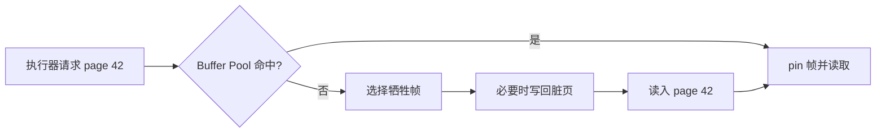
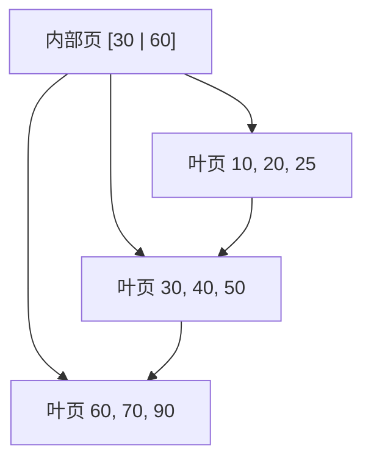

# 存储、索引与查询执行

SQL 只描述“要什么”，DBMS 还要决定“从哪些页读、按什么顺序读、怎样连接”。表里有十亿行时，查一条记录和扫描整张表都可能得到正确答案，但成本相差几个数量级。理解存储与索引，就是把一条 SQL 还原成真实的数据移动和比较。

## 1. 为什么数据库按页工作

持久化设备和操作系统通常以块为单位传输数据，DBMS 也把表与索引切成固定大小的**页（page）**。页大小因实现而异，常见量级是几 KiB 到几十 KiB。页是磁盘读写、缓存管理和许多锁存操作的基本单位。

```text
一个数据页
┌─────────────────────────────────────┐
│ 页头：页号、校验、空闲空间位置等    │
├─────────────────────────────────────┤
│ 槽目录 slot[0], slot[1], ...        │
├─────────────────────────────────────┤
│             空闲空间                │
├─────────────────────────────────────┤
│    记录 3    │ 记录 2 │ 记录 1      │
└─────────────────────────────────────┘
```

常见的**槽式页（slotted page）**让记录从页尾向前放，槽目录从页头向后长。槽保存记录在页内的偏移与长度。记录即使因更新在页内移动，外部仍可通过 `(page_id, slot_id)` 定位，避免所有索引指针一起变化。

一行记录除了用户列，还可能包含：

- NULL 位图；
- 变长字段偏移；
- 事务可见性信息；
- 对溢出大字段的间接引用；
- 对齐填充。

因此“表有 100 万行，每行字段相加 100 byte，所以文件恰好 100 MB”通常不成立。还要算行头、页头、空闲空间、索引和版本。

## 2. Buffer Pool 与 OS Page Cache 不是同一个东西

**Buffer Pool（缓冲池）**是 DBMS 管理的内存页缓存。查询需要页 P 时：

1. 查缓冲池页表，判断 P 是否已在内存；
2. 命中则固定/pin 该帧，防止使用期间被替换；
3. 未命中则选择可替换帧；
4. 若旧页是脏页，按恢复协议把它写回；
5. 从存储读取 P，更新页表，再交给执行器。



**脏页（dirty page）**是在内存中已修改、但数据文件版本还没包含这些修改的页。**pin count** 表示当前有多少使用者要求该页不能被替换。替换策略可以近似 LRU、Clock 或其他算法；“最近最少使用”是目标直觉，不代表所有数据库都维护昂贵的精确链表。

OS 的 **page cache** 是内核对文件数据的缓存；DBMS Buffer Pool 是数据库根据页号、事务和查询信息管理的缓存。两者可能同时存在，造成同一数据在两层缓存，即“双重缓存”。有的数据库依赖普通文件 I/O，有的使用 direct I/O 绕开部分 page cache，有的混合使用。不能把某种选择推广成所有 DBMS 的固定实现。

Buffer Pool 知道页是否被事务固定、页的恢复顺序和查询访问模式；OS page cache 通常不知道这些数据库语义。反过来，OS 负责全系统内存回收、文件系统与设备调度。两层解决的问题有关，但不相同。

## 3. 堆文件：无序表怎样保存行

这里的**堆文件（heap file）**不是二叉堆。它表示记录没有按某个搜索键全局排序，DBMS 把行放进有足够空闲空间的页。

常见辅助结构包括：

- 页目录：记录每个数据页的位置和空闲空间；
- 空闲空间映射：快速寻找能容纳新行的页；
- 记录 ID：常用 `(page_id, slot_id)`；
- 可见性元数据：帮助事务判断某个版本是否可读。

插入通常能较快找到空位，但按任意条件查询可能要顺序扫描全部数据页。若表有 100 万页、目标只有一行，全表扫描仍可能读近 100 万页；索引的价值就是先读较小的导航结构，再定位少量数据页。

删除可能先做逻辑标记，之后由 vacuum/垃圾回收整理；更新后新记录放不回原页时可能迁移，并留下转发或新版本。具体策略依数据库实现。

## 4. B+ 树为什么适合外存索引

普通二叉搜索树每层只排除一部分候选；若每个结点都要一次随机 I/O，树高会很昂贵。**B+ 树**让一个页结点保存许多键和孩子指针，形成很大的扇出（fan-out）。

一个简化 B+ 树满足：

- 内部结点只保存分隔键与孩子指针，用于导航；
- 真实索引条目都在叶结点；
- 所有叶子位于同一层，所以树保持平衡；
- 叶子按键排序并通常由兄弟指针串联，便于范围扫描；
- 非根结点保持一定最低占用率，避免树变得过高。



树高必须先统一口径。若把根和叶都算一层，**根直接连叶是 2 层、1 条边**。假设内部结点平均扇出 300、每个叶页平均放 200 个索引条目：

| 从根到叶的结构 | 叶页上限的教学估算 | 索引条目量级 |
|---|---:|---:|
| 根 → 叶（2 层） | `300` | `300 × 200 = 6 万` |
| 根 → 内部页 → 叶（3 层） | `300² = 9 万` | `1800 万` |
| 根 → 两层内部页 → 叶（4 层） | `300³ = 2700 万` | `54 亿` |

真实容量受键宽、指针宽度、填充率、页头和重复键影响；根与上层页又经常常驻缓存。因此“查 54 亿条数据”不等于每次必做 4 次设备 I/O，但大扇出确实能把树高控制得很低。

## 5. B+ 树查找完整推演

查找键 50：

1. 根页 `[30 | 60]` 把键空间分成 `<30`、`[30,60)`、`>=60`；
2. 50 落在中间范围，读取第二个孩子页；
3. 在叶页 `[30,40,50]` 内二分或顺序定位 50；
4. 索引条目给出记录本身，或给出数据行的记录 ID；
5. 若索引没有查询所需全部列，再读取对应数据页。

点查成本常写作 `O(log_f N)` 页层级，f 是扇出。内存中的页内查找也有 CPU 成本；并发插入还需锁存页；冷缓存与热缓存的 I/O 数不同，所以复杂度不是固定毫秒数。

范围查询 `WHERE key BETWEEN 30 AND 75` 先定位 30 所在叶子，再沿叶链向右扫描，遇到大于 75 的键停止。这是 B+ 树比无序哈希索引更自然支持范围查询和有序输出的原因。

## 6. 插入、叶分裂与根分裂

下面使用教学约定：叶页最多 3 个键，内部页最多 4 个孩子（3 个分隔键）。真实数据库每页能放多少条目由字节数决定，不会固定为 3。

依次插入 `10,20,30`：

```text
叶：[10,20,30]
```

插入 40 后叶子溢出：

```text
[10,20,30,40]
     分裂
[10,20] -> [30,40]
父结点复制右叶最小键 30：根 [30]
```

继续插入 5、15：

```text
插入 5：左叶 [5,10,20]
插入 15：左叶临时 [5,10,15,20]
分裂为 [5,10] 与 [15,20]
根变成 [15,30]
```

再插入 25、27：

```text
[15,20] -> [15,20,25]
加入 27 后分裂为 [15,20] 与 [25,27]
根变成 [15,25,30]
```

此时根已满，叶子依次为：

```text
[5,10] -> [15,20] -> [25,27] -> [30,40]
```

继续插入 35，最后一片叶变成 `[30,35,40]`；再插入 45，它临时变成 `[30,35,40,45]`，随后分裂为 `[30,35]` 与 `[40,45]`，并把右叶最小键 40 复制到根。根临时拥有 5 个孩子：

```text
临时根分隔键：[15,25,30,40]
孩子：C0 C1 C2 C3 C4
```

内部页也要分裂。提升中间分隔键 30，得到新根：

```text
                  [30]
                /      \
          [15,25]      [40]
         /   |   \     /  \
       C0   C1   C2   C3  C4
```

根分裂是树高增加的唯一方式。分裂时不仅要维护父指针和分隔键，还要维护叶链、并发访问者和恢复日志；以上图只展示结构不变量。

删除时若结点低于最低占用率，可以向兄弟借条目并更新父分隔键，或与兄弟合并。数据库也可能延迟合并以避免频繁结构震荡，具体实现不同。

## 7. 聚簇、非聚簇、主索引与二级索引

这些词经常被混用，先拆开两个维度。

**聚簇索引（clustered index）**描述数据行的物理组织与索引键顺序高度一致，叶级常直接包含数据记录或数据页。一个表在同一时刻只能有一种主要物理顺序，所以通常至多一个聚簇组织。

**非聚簇索引（unclustered/nonclustered index）**的叶条目保存键和行定位信息。按索引范围扫描很多行时，可能跳到许多分散数据页，随机 I/O 较多。

“行定位信息”也依存储组织而变：堆表的二级索引常保存记录 ID；以主键聚簇的引擎中，二级索引叶项也可能保存主键，再通过主键索引找到整行。因此一次二级索引点查是否需要第二次树查找，必须绑定具体引擎。

**主索引/primary index**在教材里常指建立在数据文件排序键上的索引；**二级索引/secondary index**建立在其他搜索键上。产品文档中的 `PRIMARY KEY`、clustered 等术语可能采用不同定义。例如有的引擎让主键决定聚簇组织，有的堆表主键只是一个唯一索引。回答问题前要先声明所指实现。

聚簇不等于“查询永远快”。它通常让相邻键的范围扫描更顺序，但随机插入可能造成页分裂；按其他列查询仍需要二级索引。

## 8. 复合索引与最左前缀为什么成立

复合 B+ 树索引 `(a,b,c)` 按**字典序**排列：先比较 a；a 相等再比较 b；a、b 都相等再比较 c。

```text
(1,1,9)
(1,2,3)
(1,2,8)
(2,1,4)
(2,9,1)
```

因此：

- `a = 1` 对应一个连续范围；
- `a = 1 AND b = 2` 对应更小的连续范围；
- `a = 1 AND b = 2 AND c >= 5` 仍能直接定位范围；
- 只有 `b = 2` 时，匹配项散落在每个不同 a 的分组中，通常不能靠一次连续范围定位。

这就是**最左前缀**的结构原因，不是优化器死记规则。等值约束通常能继续缩小后续列；某列一旦使用范围约束，后续列往往不能继续缩小一个单一连续扫描区间，但仍可能用于索引内过滤。

某些数据库支持 skip scan、多个索引合并或其他优化，让缺少首列条件的查询仍可能使用复合索引；这不改变字典序的基本事实，也不保证一定比全表扫描便宜。应看目标数据库的查询计划。

列顺序应依据真实查询：等值、范围、排序、基数、覆盖需求和更新成本共同决定，不能机械背“区分度最高放最左”。

## 9. 覆盖索引与 index-only scan

若索引条目已经包含查询需要的搜索列和输出列，执行器可能只读索引，不再回表取数据行，这类设计常叫**覆盖索引（covering index）**，相应计划称 index-only scan。

```sql
CREATE INDEX orders_user_created_cover
ON orders (user_id, created_at)
INCLUDE (status, amount_cents);

SELECT created_at, status, amount_cents
FROM orders
WHERE user_id = 42
ORDER BY created_at;
```

`INCLUDE` 是 PostgreSQL 等产品提供的一种写法，不是所有 SQL 产品都相同。即使列都在索引里，MVCC 可见性判断也可能要求访问堆页；PostgreSQL 会结合 visibility map 判断是否能完全避免 heap fetch。覆盖是一种可能计划，不是由 SQL 文本单独保证。

更宽索引会占更多空间，降低每页条目数，增加写放大和缓存压力。覆盖常读列是否划算，需要结合查询频率和写入成本测量。

## 10. Hash 索引适合什么

Hash 索引把搜索键哈希到桶，适合等值查询：

```text
bucket = hash(key) mod bucket_count
```

冲突键进入同一桶，还要通过桶内条目、溢出页或其他结构区分。理想分布下等值查找接近常数页访问；最坏情况仍可能退化。

Hash 索引没有键的全序，因此通常不支持：

- 范围查询；
- 前驱/后继；
- 按键有序输出；
- 最左前缀式的范围导航。

B+ 树同样能做等值查询，又能做范围与排序，所以是通用标量索引的常见默认选择。Hash 是否更快、是否持久化、并发特性如何，都依具体实现。

## 11. 查询计划来自成本比较

优化器把 SQL 转为候选物理计划，估算各计划的 I/O、CPU、内存和输出行数，再选择估计成本较低者。常见计划节点包括：

- sequential/table scan；
- index scan、index-only scan；
- filter、sort、aggregate；
- nested loop、hash join、merge join。

```sql
EXPLAIN
SELECT o.order_id
FROM users AS u
JOIN orders AS o ON o.user_id = u.user_id
WHERE u.region = 'east';
```

`EXPLAIN` 展示估计计划；许多产品的 `EXPLAIN ANALYZE` 会真实执行并报告实际行数和耗时，不能对有副作用或超大查询随意运行。

优化器依赖统计信息，例如表行数、不同值数量、NULL 比例、直方图和列相关性。若估计某条件返回 1 行，可能选索引嵌套循环；实际返回 100 万行时，计划可能很差。发现估计行数与实际行数相差巨大，应先检查统计信息、数据倾斜和相关性，而不是只盯着“有没有索引”。

索引也不一定被使用。查询要读表中大部分行时，顺序扫描常比沿索引随机回表更便宜；`ORDER BY ... LIMIT k` 只取少量前缀时，匹配顺序的 B+ 树可能非常有利。

## 12. 三种 Join 算法怎样估算

令：

- `T(R)`：关系 R 的行数；
- `B(R)`：R 占用的数据页数；
- `M`：算法可用的内存页数。

这里只比较简化 I/O 模型；真实成本还包括缓存命中、CPU、并行、输出大小和数据分布。

### 12.1 Nested Loop Join

最直接的 tuple nested loop：对 R 每一行扫描 S，比较连接条件。

```text
for each r in R:
    for each s in S:
        if join_condition(r, s): output(r, s)
```

比较量可到 `T(R)×T(S)`。若按页做**块嵌套循环（block nested loop）**，一次把最多 `M-2` 页外表放入内存，简化 I/O 约为：

这里减去的 2 页分别留给内表输入和 Join 输出缓冲；具体执行器可能使用更多缓冲，但教材公式先固定这个口径。

```text
B(R) + ceil(B(R)/(M-2)) × B(S)
```

通常先尝试把较小关系作为外表以减少重复扫描，但严谨做法是把 R、S 交换后各算一次，因为页数、可用内存和取整都会影响结果。若内表连接列有索引，**index nested loop** 可对每个外表行做一次索引查找，适合外表很小或条件选择性高：

```text
B(R) + T(R) × (索引查找与回表成本)
```

### 12.2 Sort-Merge Join

先按连接键排序两侧，再用两个游标线性合并。若输入已经按键有序，可省去排序；合并阶段读两侧约 `B(R)+B(S)` 页。

在简化外部归并模型中，内存有 M 页，先生成约 `ceil(B(R)/M)` 个初始有序段，再做最多 `M-1` 路归并。忽略最后一趟可与 Join 流水线融合等优化，排序 R 的读写 I/O 约为：

```text
2 × B(R) × (1 + ceil(log_(M-1)(ceil(B(R)/M))))
```

S 同理，再加一次合并扫描。公式的重点是：输入本来有序时能省掉昂贵排序；内存越多，初始段越少、归并趟数越低。不同教材是否计算最终输出写入，必须先统一口径。

它适合等值连接，也能扩展到部分有序/范围条件；遇到重复键时必须输出两个同键组的笛卡尔组合。若两边各有 1000 行同键，输出本身就是 100 万行，任何算法都不能跳过结果成本。

### 12.3 Hash Join

对等值连接，可把较小输入按连接键建立内存哈希表，再扫描另一侧探测：

```text
build hash table on smaller R
for each s in S:
    probe hash(s.key)
```

若构建侧能放进内存，输入读取约 `B(R)+B(S)`。放不下时，Grace hash join 先把两侧按同一哈希函数分区，再逐对处理；理想两阶段模型约读写分区一次、再读一次，I/O 量级约 `3×(B(R)+B(S))`。这个估算要求每个构建侧分区在第二阶段能放入内存；粗略条件是构建侧规模不超过约 `(M-1)(M-2)` 页。严重数据倾斜会让某个分区仍放不下。

Hash join 通常只适合等值条件，不自然支持 `<`、范围或排序输出。优化器根据输入大小、已有顺序、索引和内存选择算法，不能仅凭“hash 是 O(1)”断言 Hash Join 总是最好。

### 12.4 用同一组数字比较三种算法

设 `B(R)=1000`、`B(S)=10000`、`M=102`，两表都没有可利用的索引或既有顺序，并暂时忽略输出写入与缓存命中。

块嵌套循环让 R 做外表时：

```text
1000 + ceil(1000 / 100) × 10000
= 101000 次页 I/O
```

交换内外表则是：

```text
10000 + ceil(10000 / 100) × 1000
= 110000 次页 I/O
```

按前面的保守外部排序公式，R 生成 `ceil(1000/102)=10` 个初始段，S 生成 `ceil(10000/102)=99` 个初始段；两者都能用一次最多 101 路的归并收口：

```text
sort R = 2 × 1000 × (1+1) = 4000
sort S = 2 × 10000 × (1+1) = 40000
merge scan = 1000 + 10000 = 11000
合计约 55000 次页 I/O
```

R 无法整体装入 102 页内存，因此使用两阶段 Grace Hash Join 的理想估算：

```text
3 × (1000 + 10000) = 33000 次页 I/O
```

在这些假设下 Hash Join 估算最低，但结论不是“Hash Join 永远最好”。若输入已有顺序，Sort-Merge 可省排序；若外表只有几行且内表有索引，Index Nested Loop 可能更便宜；若哈希键严重倾斜，33000 的理想值会失效。成本比较必须把选择性、输出行数、内存、已有顺序与数据分布一起写进假设。

## 13. LSM Tree 的最小对比

**Log-Structured Merge Tree（LSM Tree）**先把写入放入内存有序结构和日志，达到阈值后顺序生成磁盘有序文件（SSTable），后台再做 compaction 合并。

| B+ 树 | LSM Tree |
|---|---|
| 原地更新页，读路径短且范围扫描自然 | 写入先顺序追加，吞吐高 |
| 随机写可能引起页分裂 | 查询可能检查多层文件与 Bloom filter |
| 写放大来自日志、页更新和分裂 | 写放大主要来自 compaction 重写 |
| 删除可直接更新结构 | 删除常以 tombstone 延迟清理 |

LSM 不是“比 B+ 树先进”的替代品。读放大、写放大、空间放大、缓存和压缩策略之间存在权衡。关系数据库也可能在不同组件中同时使用 B+ 树、日志结构和列式格式。

## 14. 常见误解

- **“数据库页就是 OS 虚拟内存页。”** 名称相同但层次和大小可以不同。
- **“Buffer Pool 就是 page cache。”** 一个由 DBMS 管理数据库页，一个由内核管理文件缓存。
- **“heap file 是堆数据结构。”** 这里表示无特定全局排序的记录文件。
- **“B+ 树一次查找只读一个页。”** 要从根走到叶，未缓存层级各可能产生 I/O。
- **“主键一定是聚簇索引。”** 产品实现不同，primary 与 clustered 是不同维度。
- **“复合索引 `(a,b)` 完全不能服务 `b=...`。”** 通常不能一次定位连续范围，但产品可能做全索引扫描、skip scan 或索引合并；是否采用看成本。
- **“覆盖索引保证零回表。”** MVCC 可见性和实现细节仍可能要求访问数据页。
- **“有索引就一定快。”** 低选择性、大范围返回或随机回表可能让全表扫描更便宜。
- **“EXPLAIN 的 cost 是毫秒。”** 多数产品的 cost 是内部相对单位，重点是计划与估计行数。
- **“Hash Join 总是 O(n)。”** 需要等值连接、合理分布和足够内存；溢出、倾斜与输出量都会改变成本。

## 15. 做题方法：统一换算成页 I/O

### 15.1 B+ 树题先画层级，再区分冷页与热页

1. 根据页大小、键和指针宽度估算扇出；题目直接给“每个结点最多几个键”时，以题设为准，不混用生产页大小。
2. 从根到叶逐层画访问路径。点查的冷缓存上界接近树高；根和上层常驻 Buffer Pool 时，只把未缓存层计入设备 I/O。
3. 范围查询先支付一次定位到首叶的成本，再沿叶链读取覆盖范围的叶页；不能把结果中的每个键都算成一次从根查找。
4. 非聚簇二级索引还要估计回表。先用选择率估算命中行数，再判断这些行集中在少量数据页，还是造成大量随机页访问。
5. 用边界情况验算：返回全表大部分行时，索引随机回表不应被估成比顺序扫描“几乎免费”；返回零行时，也不应产生结果页读取成本。

### 15.2 Join 题先写假设，再代公式

设输入页数为 `B(R)`、`B(S)`，可用缓冲页为 M。忽略输出写入前，常用验算式为：

```text
Block Nested Loop = B(outer) + ceil(B(outer)/(M-2)) × B(inner)
两阶段 Grace Hash Join = 3 × (B(R)+B(S))
```

第二个式子只在等值连接、哈希分布合理，而且每个构建侧分区能在第二阶段装入内存时成立。Sort-Merge Join 则要分别计算两个输入形成初始段和多趟归并的读写，再加最终归并扫描；输入已有所需顺序时应扣掉对应排序成本。

比较计划时依次检查：连接条件是否等值、较小侧能否驻留内存、是否已有索引或排序、数据是否倾斜、估计输出有多大。最后用“输出本身至少要被产生”作下界检查；若两个同键组各有 1000 行，百万行结果成本不能被任何 Join 算法消除。

## 16. 推演题

1. 槽式页为什么要间接保存记录偏移？若记录移动，哪些标识可以保持稳定？

<details><summary>展开参考答案与解答</summary>

槽目录把稳定的槽号与可变化的字节偏移分开。页内压缩或变长记录更新时，只改槽中的 offset，不必改所有索引引用；外部可继续使用 `(page_id,slot_id)` 作为 RID。若记录跨页迁移，则要更新索引、留下转发指针或改变 RID，具体由引擎约定。

</details>

2. Buffer Pool 未命中且牺牲页是脏页时，要经过哪些步骤？为什么不能随意先写数据页？

<details><summary>展开参考答案与解答</summary>

先选未被 pin 的牺牲帧；若脏页的 `pageLSN=L`，必须先保证 WAL 至少刷到 L，再写回数据页；随后更新页表、读取目标页、校验并安装映射。若数据页先于描述它的日志持久化，崩溃后可能出现无法 REDO/UNDO 的修改，违反 write-ahead rule。

</details>

3. 表有 1 亿行但查询只返回 3 行，堆文件全扫与 B+ 树点查各大致读取哪些结构？

<details><summary>展开参考答案与解答</summary>

堆扫描要读取表的全部数据页并逐行过滤。B+ 树先读根到叶的路径；上层若常驻内存，冷 I/O 可能只剩叶页，再按叶项读取最多若干数据页。非聚簇索引的 3 行可能落在 3 个随机数据页；覆盖索引则可能无需回表。不能从“3 行”直接断言固定 3 次 I/O。

</details>

4. 按本章“叶最多 3 键”的约定，继续插入一个会导致根分裂的序列，画出每次分裂后的树。

<details><summary>展开参考答案与解答</summary>

从本章已有根 `[15,25,30]`、叶链 `[5,10]→[15,20]→[25,27]→[30,40]` 开始。插入 35 得末叶 `[30,35,40]`；插入 45 后分裂为 `[30,35]` 与 `[40,45]`，向根复制 40，根临时为 `[15,25,30,40]`。内部页溢出，提升 30，最终新根 `[30]`，左内部页 `[15,25]` 管前三叶，右内部页 `[40]` 管后两叶。叶链顺序保持不变，只增加一个叶。

</details>

5. 为什么 B+ 树范围扫描到第一条后，可以沿叶链继续，而不必每个键重新从根查找？

<details><summary>展开参考答案与解答</summary>

所有数据条目只在同一层的叶页中按键有序排列，相邻叶又有兄弟指针。第一次从根定位范围下界后，后续条目就在当前叶或右兄弟叶；直到键越过上界即可停止。成本近似“一次树高定位 + 覆盖的叶页数”，不是“结果数 × 树高”。

</details>

6. 分别解释 primary/secondary 与 clustered/unclustered 两组术语，为什么不能当同义词？

<details><summary>展开参考答案与解答</summary>

primary/secondary 描述索引相对主搜索键或其他搜索键的角色；clustered/unclustered 描述数据行的物理组织是否接近索引顺序。某产品的主键可能组织聚簇表，也可能只是堆表上的唯一二级结构。回答必须绑定教材或具体引擎，不能由“PRIMARY KEY”自动推出聚簇。

</details>

7. 对索引 `(tenant_id, created_at, status)`，分别分析 `tenant_id=?`、`tenant_id=? AND created_at BETWEEN ? AND ?`、`tenant_id=? AND created_at=? AND status=?`、`status=?` 能利用多长的有序前缀。

<details><summary>展开参考答案与解答</summary>

第一条用 1 列前缀；第二条用前两列定位范围，status 若另有条件通常只能在范围内过滤；第三条三列都能定位；第四条缺最左列，普通 B-tree 不能形成一个连续区间，通常不能用该索引直接定位。某些引擎的 skip scan 属额外优化，必须以 `EXPLAIN` 验证，不能改变字典序推导。

</details>

8. 一个覆盖索引让读查询更快，但可能给写路径带来哪些成本？

<details><summary>展开参考答案与解答</summary>

更多列使叶项更宽，索引页更多、扇出更低、缓存命中下降；INSERT/DELETE 以及被覆盖列 UPDATE 都要维护它，并可能增加 WAL、页分裂和写放大。MVCC 引擎还可能因可见性检查继续访问表页。应以读节省的 I/O 对照写吞吐、空间与维护成本。

</details>

9. `EXPLAIN ANALYZE` 中估计 10 行、实际 100 万行，优先检查哪些信息？

<details><summary>展开参考答案与解答</summary>

先确认是哪个节点首次发生估计偏差，再查统计信息是否过期、列值分布与倾斜、列间相关性、参数值、表达式或隐式转换，以及过滤条件实际选择率。误差会向上游放大并导致错误 join 顺序或算法。更新统计后重测；若相关列独立假设失真，可使用扩展统计或改写数据模型。

</details>

10. 令 `B(R)=1000`、`B(S)=10000`、`M=102`，估算 R 为外表的块嵌套循环 I/O；交换内外表会怎样？

<details><summary>展开参考答案与解答</summary>

块嵌套循环可用 `M-2=100` 页装外表块。R 为外表时成本约 `B(R)+ceil(B(R)/100)×B(S)=1000+10×10000=101000` 页 I/O。交换后为 `10000+ceil(10000/100)×1000=110000`。这里忽略输出写入与缓存复用；选择较小外表在本例更便宜。

</details>

11. Hash Join 构建侧为什么通常选更小输入？数据倾斜怎样破坏理想分区？

<details><summary>展开参考答案与解答</summary>

构建侧要建立哈希表，越小越可能留在内存，从而让探测侧顺序读取一次。若一个热门键把大量行送入同一 bucket/partition，该分区可能溢出并反复落盘，链或比较也变长；并行 worker 还会负载不均。要用重键单独处理、更多分区或其他 join 算法验证。

</details>

12. 写多读少的工作负载为何可能考虑 LSM？必须同时付出哪些读、空间和后台合并成本？

<details><summary>展开参考答案与解答</summary>

LSM 先把写顺序追加到 WAL/memtable，再批量生成有序文件，减少随机原地写。代价是读可能查多层并依赖 Bloom filter/索引，旧版本在 compaction 前造成空间放大，后台 compaction 又产生读写放大、CPU 与带宽竞争。是否合适要测目标读写比、值大小、删除率和尾延迟，而非只看写吞吐。

</details>

## 17. 权威依据

- [CMU 15-445/645 公开课程安排](https://15445.courses.cs.cmu.edu/fall2024/schedule.html)：Database Storage、Buffer Pools、B+ Trees、Indexes、Joins 与 Query Planning 主线。
- [Database System Concepts, 7th Edition 官方页面](https://codex.cs.yale.edu/avi/db-book/)：存储、索引、查询处理与优化的经典教材依据。
- [PostgreSQL 官方文档：Database Physical Storage](https://www.postgresql.org/docs/current/storage.html)：文件、页、行与可见性结构的具体实现实例。
- [PostgreSQL 官方文档：多列索引](https://www.postgresql.org/docs/current/indexes-multicolumn.html)：多列 B-tree 约束与 skip scan 的实现说明。
- [PostgreSQL 官方文档：Index-Only Scans 与覆盖索引](https://www.postgresql.org/docs/current/indexes-index-only-scans.html)：覆盖列和 MVCC 可见性限制。
- [PostgreSQL 官方文档：EXPLAIN](https://www.postgresql.org/docs/current/using-explain.html)：计划、成本、估计行数和实际执行信息。
- [PostgreSQL 官方文档：Indexes and ORDER BY](https://www.postgresql.org/docs/current/indexes-ordering.html)：B-tree 有序扫描与顺序扫描成本选择。
