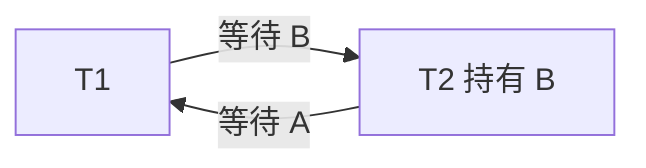

# 事务与并发控制

两位用户同时买最后一件商品、两个风控进程同时更新限额、转账执行一半时机器断电，这些问题不能只靠单条 SQL 的语法解决。**事务（transaction）**把一组读写声明为一个逻辑工作单元，DBMS 再用并发控制和恢复机制维护约束。

```sql
BEGIN;
UPDATE accounts SET balance = balance - 100 WHERE account_id = 1;
UPDATE accounts SET balance = balance + 100 WHERE account_id = 2;
COMMIT;
```

业务要求不是“两条 UPDATE 各自成功”，而是两条要么一起生效，要么一起不生效，并且其他事务不能看见破坏账户总额的中间状态。

## 1. ACID 分别保证什么

**ACID** 是四类事务性质：

- **Atomicity，原子性**：事务中的操作要么全部生效，要么全部不生效；
- **Consistency，一致性**：事务从满足约束的状态转到另一个满足约束的状态；
- **Isolation，隔离性**：并发事务的可见效果受规定的并发模型约束；
- **Durability，持久性**：提交成功后，结果在承诺的故障模型下不会因普通崩溃丢失。

“一致性”最容易被说空。数据库能维护主键、外键、CHECK 等声明约束；“转账后两账户总额不变”“持仓不得超过限额”等业务不变量还需要正确事务逻辑。ACID 不会替应用猜出规则。

隔离也不是“所有事务完全不并发”。DBMS 希望交错执行事务以提高吞吐，同时让结果满足选定隔离保证。

持久性的边界取决于提交是否等到日志落到可靠介质、硬件是否诚实报告刷新完成，以及是否承诺跨机器副本。事务提交和 WAL 的边界见[WAL、恢复、复制与分片](wal_recovery_replication.md)。

## 2. Schedule：事务怎样交错

**schedule/history（调度/历史）**是多个事务的读、写、提交和回滚按时间交错形成的序列。

设 `r1(X)` 表示事务 T1 读 X，`w1(X)` 表示 T1 写 X：

```text
串行调度：r1(X) w1(X) commit1 r2(X) w2(X) commit2

交错调度：r1(X) r2(Y) w1(X) w2(Y) commit1 commit2
```

若两个操作来自不同事务、访问同一数据项，并且至少一个是写，它们**冲突**。读-读不冲突；读-写、写-读、写-写冲突，因为交换顺序可能改变结果或可见值。

**串行调度**一次只执行一个事务，容易推理但并发度低。目标不是强迫真实执行完全串行，而是让并发结果等价于某个串行顺序。

## 3. 冲突可串行化与优先图

若一个调度能通过交换不冲突操作变成某个串行调度，就叫**冲突可串行化（conflict serializable）**。

可以构造**优先图/序列化图（precedence graph）**：

1. 每个事务是一个顶点；
2. 若 Ti 的某个冲突操作先于 Tj 对同一项的操作，加入边 `Ti → Tj`；
3. 图无环，则调度冲突可串行化；拓扑序给出等价串行顺序；
4. 图有环，则不存在符合全部冲突先后的串行顺序。

例：

```text
r1(X) w1(X) r2(X) w2(Y) r1(Y)
```

- T1 写 X 先于 T2 读 X，得到 `T1→T2`；
- T2 写 Y 先于 T1 读 Y，得到 `T2→T1`；
- 图成环，所以不可冲突串行化。

**视图可串行化**允许更广的等价关系，包括部分盲写调度，但判定更困难。工程系统通常采用能高效实施的锁、时间戳、MVCC 或冲突检测，而不是在事务结束后穷举所有串行顺序。

## 4. 常见并发现象

异常名称描述不同失败，不能只背隔离级别表。

在读异常之前，先认识**脏写（dirty write）**：T1 写入 X 但尚未结束，T2 又覆盖同一个 X；若 T1 随后回滚，系统将无法简单判断应该恢复哪个值。事务型 DBMS 通常会阻止这种并发覆盖，但“不会脏写”远不等于可串行化。

### 4.1 Dirty Read：脏读

```text
T1: write X=50
T2: read X -> 50
T1: rollback
```

T2 读到了从未提交的值。若 T2 已据此发送货物，T1 回滚无法撤销外部世界。

### 4.2 Non-repeatable Read：不可重复读

```text
T1: read X -> 100
T2: write X=80; commit
T1: read X -> 80
```

同一事务两次读取同一行得到不同已提交版本。

### 4.3 Phantom Read：幻读

```text
T1: SELECT * FROM orders WHERE amount > 1000;  -- 5 行
T2: INSERT 一行 amount=2000; commit
T1: 再执行同一谓词查询                           -- 6 行
```

幻读关注满足一个范围谓词的**行集合**变化，不只是某一行的列值变化。

### 4.4 Lost Update：丢失更新

初始库存 10：

```text
T1: read stock -> 10
T2: read stock -> 10
T1: write stock=9; commit
T2: write stock=9; commit
```

两次扣减最终只减少 1。若写成单条原子语句 `UPDATE ... SET stock=stock-1`，数据库可以在行锁下串行计算；若应用先读再写，就应使用行锁、可串行化事务或版本号条件更新。

### 4.5 Write Skew：写偏斜

约束：至少一名医生值班。A、B 初始都值班：

```text
T1 读到 A=true,B=true，于是把 A 改为 false
T2 读到 A=true,B=true，于是把 B 改为 false
两者都提交，最终无人值班
```

两个事务写的是不同行，没有直接写写冲突，却都根据同一个旧快照判断“还有另一人”。快照隔离可以阻止某些丢失更新，但并不自动阻止所有写偏斜；要使用可串行化检测、谓词锁或显式锁住代表约束的共同对象。

## 5. SQL 标准隔离级别

SQL 标准为四个隔离级别规定最低保护，并把 Serializable 定义为成功事务的效果等价于某个串行顺序。下表除了三种经典读现象，还显式列出更一般的**序列化异常**：提交结果无法对应任何串行执行。

| 隔离级别 | 脏读 | 不可重复读 | 幻读 | 序列化异常 |
|---|:---:|:---:|:---:|:---:|
| Read Uncommitted | 可能 | 可能 | 可能 | 可能 |
| Read Committed | 禁止 | 可能 | 可能 | 可能 |
| Repeatable Read | 禁止 | 禁止 | 标准允许 | 可能 |
| Serializable | 禁止 | 禁止 | 禁止 | 禁止 |

Serializable 的核心定义更强：所有成功提交事务的效果必须等价于某个串行执行。脏读、不可重复读和幻读只是经典现象列表，不能穷尽所有序列化异常；写偏斜就是重要例子。

实现可以提供比标准表更强的保证。例如 PostgreSQL：

- `READ UNCOMMITTED` 实际按 `READ COMMITTED` 处理；
- Read Committed 通常每条语句取得新快照；同一事务两条 SELECT 可能看到不同提交状态；
- Repeatable Read 从第一条非事务控制语句开始使用稳定事务快照，并且实现上不会出现标准定义的幻读，但仍可能发生序列化异常；
- Serializable 在快照基础上检测危险依赖，必要时让事务以 serialization failure 失败，应用必须重试。

其他数据库即使使用相同隔离级别名字，锁行为、快照时点、丢失更新处理和只读规则也可能不同。设计必须查目标数据库文档并通过并发测试验证。

## 6. 2PL：用锁得到可串行化顺序

锁最常见的两种模式：

- **共享锁 S（shared）**：读数据；多个 S 可以兼容；
- **排他锁 X（exclusive）**：写数据；与其他 S/X 冲突。

**两阶段锁（Two-Phase Locking，2PL）**要求：

1. 增长阶段只能申请锁，不能释放；
2. 一旦开始释放锁，就进入收缩阶段，不能再申请新锁。

2PL 产生冲突可串行化调度，但基础 2PL 仍可能让其他事务读到随后回滚的数据。**Strict 2PL** 至少把排他锁持有到提交/回滚，防止脏读和级联回滚；许多实现把读写锁都持有到事务结束，常称 rigorous 2PL。

锁粒度可以是行、页、表或谓词/键范围。细粒度并发高但锁数量多；粗粒度管理便宜但冲突更多。**意向锁（intention lock）**让表级锁快速知道下面是否存在行级锁，避免扫描全部子锁。

事务锁与存储引擎内部的 **latch（短期闩锁）**不是一回事：锁保护行、范围等逻辑对象，可能等待到事务结束；latch 只在很短时间内保护 Buffer Pool 页或 B+ 树结点的内存结构，通常不会表达业务隔离级别。

范围查询若只锁住当前存在的行，其他事务仍可插入满足谓词的新行，产生幻读。锁式 Serializable 可能使用 key-range/predicate locking，把“尚不存在但落在范围内的位置”也纳入冲突。

## 7. MVCC：保存多个版本减少读写阻塞

**Multi-Version Concurrency Control（MVCC，多版本并发控制）**不让更新直接覆盖唯一版本，而是保留一段时间的旧版本。读事务根据自己的**快照（snapshot）**判断哪个版本可见，写事务创建新版本。

```text
记录 id=7 的版本链

v3: value=120, creator=T9, delete=∞
 ↓
v2: value=100, creator=T4, delete=T9
 ↓
v1: value=80,  creator=T1, delete=T4
```

一个概念化可见性判断需要知道：

- 版本由哪个事务创建；
- 何时被删除/替换；
- 这些事务对当前快照是已提交、进行中还是已回滚；
- 当前事务是否应看见自己的写入。

例如快照建立时 T9 尚未提交，则读者不能看 v3，可能继续读取 v2。新事务在 T9 提交后建立快照，就可以看 v3。

MVCC 的好处是普通读通常不必阻塞普通写，旧读也能得到一致快照。代价包括：

- 多版本占空间；
- 需要 vacuum/garbage collection 回收再无事务可见的版本；
- 长事务会拖住旧版本清理；
- 索引与可见性检查更复杂；
- 写写冲突、唯一约束和序列化异常仍需锁或检测。

MVCC 不是一个统一算法。PostgreSQL 把事务可见性信息放在行版本中并使用 vacuum；其他系统可能使用 undo segment、时间戳或混合结构。通用结论只有“快照按规则选择版本”，具体字段、版本存放位置和回收机制必须以目标产品为准。

## 8. Snapshot Isolation 与 Serializable 不相同

**快照隔离（Snapshot Isolation，SI）**通常让事务读取一个稳定快照，并阻止并发事务同时提交对同一数据项的冲突写。快照究竟在 `BEGIN`、第一条数据访问语句还是其他时点建立属于产品接口的一部分，不能只凭“事务开始”四个字推断。SI 能避免脏读、不可重复读和传统幻读表现，也常能防止同一行的丢失更新。

但医生值班例子中，T1 和 T2 更新不同行，**first-committer-wins（先提交者胜）**只会让写同一数据项的后提交事务失败，无法发现这个跨两行的业务约束，所以可能写偏斜。SI 因此不等于 Serializable。

实现 Serializable 的方式包括：

- strict 2PL 与范围锁；
- 可串行化快照隔离（SSI），检测读写依赖构成的危险结构并中止事务；
- 时间戳排序或乐观验证。

共同点是：系统必须阻塞、等待或中止某些会形成不可串行化结果的事务。应用必须正确处理死锁失败和 serialization failure，并重试整个事务，而不是只重放最后一条 SQL。

## 9. 悲观并发与乐观并发

**悲观并发控制**假设冲突值得提前阻止，先加锁再操作：

```sql
BEGIN;
SELECT stock
FROM inventory
WHERE item_id = 42
FOR UPDATE;
-- 检查并更新
COMMIT;
```

它适合冲突频繁、重试成本高的场景，但锁等待会增加延迟，持锁期间不应调用慢外部服务。

**乐观并发控制**先读取并计算，提交时验证期间没有冲突。应用常用版本列实现 compare-and-swap：

```sql
UPDATE documents
SET body = :new_body,
    version = version + 1
WHERE document_id = :id
  AND version = :old_version;
```

影响 1 行表示成功；影响 0 行表示版本已变化，要重新读取并决定重试或提示冲突。乐观不等于“没有锁”：数据库内部仍可能为执行 UPDATE 加锁，乐观描述的是应用何时检测冲突。

选择取决于冲突概率、临界区长度、重试成本、公平性和延迟分布，不能只看平均吞吐。

## 10. 数据库死锁

**死锁（deadlock）**是事务形成循环等待：

```text
T1 已锁 A，等待 B
T2 已锁 B，等待 A
```



DBMS 可以建立 wait-for graph，检测环后选择一个 victim 回滚；也可以使用等待超时或基于时间戳的预防策略。回滚不是数据库“坏了”，而是打破循环、保证其余事务继续的正常机制。

应用应：

- 所有路径按一致顺序锁资源，例如总按 account_id 升序；
- 缩短事务，避免事务内网络调用和人工等待；
- 确保过滤列有合适索引，减少意外锁住大量行；
- 捕获数据库明确的 deadlock/serialization 错误，带退避重试整个事务；
- 让事务操作幂等或使用唯一请求 ID，避免客户端超时后重复副作用。

固定锁顺序能显著降低死锁，但复杂查询和数据库内部锁仍可能产生意料外的等待，所以错误处理不能省略。

## 11. 隔离级别不能代替业务设计

事务只覆盖数据库内操作。发送邮件、调用支付网关、发布消息等外部副作用不能被普通数据库回滚。常见做法是把“待发送事件”与业务数据写入同一事务的 outbox 表，提交后由独立发布器重试发送；消费者用唯一事件 ID 去重。

```text
BEGIN
  更新订单状态
  插入 outbox(event_id, payload)
COMMIT

发布器读取 outbox → 发送 → 标记完成
```

这不自动提供神奇的 exactly-once 网络传输，而是把“数据库状态与待发送意图”原子地记录，再通过至少一次投递与幂等消费得到可恢复行为。

数据库章节到这里为止只说明事务边界；跨服务重试、幂等、Saga 与对账由[可靠性与跨服务事务](../distributed/reliability_transactions.md)主讲。

## 12. 常见误解

- **“ACID 的 C 由数据库自动完成全部业务校验。”** DBMS 只知道声明和事务代码表达的约束。
- **“事务就是给多条 SQL 加 BEGIN/COMMIT。”** 还要选择隔离、处理失败、定义外部副作用。
- **“Repeatable Read 在所有数据库里行为完全相同。”** 标准给最低要求，产品实现可以更强且名称映射不同。
- **“防止三种经典异常就一定 Serializable。”** 写偏斜等序列化异常不在简单三行表中。
- **“MVCC 没有锁。”** 写写冲突、DDL、唯一约束和版本维护仍会用锁或类似机制。
- **“快照隔离等于可串行化。”** SI 仍可能写偏斜。
- **“行锁只锁返回的几行。”** 访问路径、范围锁、外键和产品实现会影响实际锁集合。
- **“发生死锁说明数据库有 bug。”** 循环等待是并发事务可能产生的正常情况，系统要检测并中止一方。
- **“重试最后一条语句就够了。”** 新串行顺序下之前的读取已过期，应重试整个事务。

## 13. 做题方法：把事务历史画成图

### 13.1 可串行化题使用优先图

1. 把历史正规化为 `ri(X)`、`wi(X)`、`ci`、`ai`，保留原顺序。
2. 只找不同事务对同一数据项的读写、写读、写写冲突；读读不加边。
3. 若 Ti 的冲突操作先于 Tj，就加边 `Ti→Tj`。图无环时，任一拓扑序都是冲突等价的串行顺序；有环就不能靠交换非冲突操作变成串行历史。
4. 验算时逐条回看边的证据，防止把“时间上相邻”误当冲突，也防止漏掉相距很远的同项操作。

### 13.2 隔离异常题先写业务不变量

先写必须保持的事实，例如“至少一名医生值班”或“库存不得为负”，再画每个事务的读取版本、判断、写入和提交。只问“有没有脏读”容易漏掉写偏斜；正确验算是把两个事务都提交后的状态代回业务不变量。

分析 MVCC 时，为每次读标出快照边界、创建版本的事务以及该事务当时是已提交、进行中还是已回滚。分析锁时，画 wait-for graph；出现 `T1→T2→...→T1` 才构成等待环。给修复方案后还要重放时间线：原子条件 UPDATE、行/范围锁或 Serializable 是否真的使其中一方等待或失败？失败后是否重试了**整个事务**？

## 14. 推演题

1. 转账事务中 A、C、I、D 各自对应什么具体要求？

<details><summary>展开参考答案与解答</summary>

Atomicity：扣款与入账全做或全不做；Consistency：提交前后总额、非负余额等声明业务约束成立；Isolation：并发转账效果满足承诺的隔离级别，不能因交错丢钱；Durability：返回提交成功后，在声明的崩溃模型下仍能恢复该转账。C 需要应用明确写出不变量，数据库不会自动猜。

</details>

2. 为 `r1(X) w1(X) r2(X) w2(Y) r1(Y)` 画优先图，怎样从图判断等价串行顺序？

<details><summary>展开参考答案与解答</summary>

`w1(X)` 在 `r2(X)` 前产生边 `T1→T2`；`w2(Y)` 在 `r1(Y)` 前产生边 `T2→T1`。图有环，因此不存在冲突等价串行顺序。一般规则是：无环才可冲突串行化，任一拓扑序就是允许的串行顺序。

</details>

3. 分别构造脏读、不可重复读、幻读、丢失更新与写偏斜的两事务时间线。

<details><summary>展开参考答案与解答</summary>

脏读：T1 写 X=50，T2 读 50，T1 回滚。不可重复读：T1 读 X=100；T2 改 80 并提交；T1 再读 80。幻读：T1 查 `amount>1000` 得 5 行；T2 插入符合行并提交；T1 再查得 6 行。丢失更新：两者都读库存 10，分别写 9，最终只减 1。写偏斜：两位医生都从同一快照看到对方值班，各自只关闭自己的行，最终无人值班。

</details>

4. 为什么 `UPDATE counter SET value=value+1` 通常比应用先 SELECT 再 UPDATE 更不容易丢更新？

<details><summary>展开参考答案与解答</summary>

单条 UPDATE 在数据库内部对当前行值执行读改写，并由行锁或并发控制串行化冲突更新；第二个事务会在最新已提交值上再加一。应用 `SELECT 10` 后稍后写 `11`，两个事务可能都覆盖为 11。仍须检查谓词、隔离级别和错误重试，单语句不等于任意业务事务都安全。

</details>

5. SQL 标准 Repeatable Read 与某个产品的 Repeatable Read 为什么可能有不同表现？

<details><summary>展开参考答案与解答</summary>

标准主要规定哪些现象必须禁止，产品可提供更强保证并采用锁或 MVCC 的不同实现。例如 PostgreSQL Repeatable Read 使用 snapshot isolation，阻止不可重复读和普通幻读，却仍可能出现写偏斜；其他产品可能用 next-key locking。回答应先给标准下限，再引用目标版本文档与实测历史。

</details>

6. 2PL 的增长和收缩阶段分别允许什么？Strict 2PL 为什么把写锁持有到事务结束？

<details><summary>展开参考答案与解答</summary>

增长阶段只能获取锁、不能释放；第一次释放后进入收缩阶段，只能释放、不能再获取。Strict 2PL 至少把排他写锁持有到提交/回滚，使其他事务不会读写未提交结果，避免级联回滚，并让恢复顺序更容易对应串行顺序。

</details>

7. 范围查询只锁当前存在行，为什么挡不住幻读？

<details><summary>展开参考答案与解答</summary>

谓词覆盖的是一个键区间，其中尚不存在的键没有“当前行”可锁。另一事务可在间隙插入满足谓词的新行，第一次事务重查就看到幻影。需要范围/间隙/谓词锁，或可串行化冲突检测来保护这个不存在对象的范围。

</details>

8. 版本链为 `v3(T3 写，未提交) → v2(T2 写，快照前已提交) → v1(T1 写，更早已提交)`；快照的进行中集合含 T3。判断各版本是否可见。

<details><summary>展开参考答案与解答</summary>

对该抽象 MVCC 规则，v3 的创建者 T3 在快照中进行中，所以不可见；v2 在快照前已提交且未被快照可见的更新删除，因此是第一条可见版本；扫描到它即可返回，v1 虽历史上提交过，但已被可见的 v2 取代。真实 xmin/xmax 边界、当前事务自见与删除可见性需按产品规则补充。

</details>

9. 用医生值班例子解释为什么 SI 的写写冲突检测没有发现写偏斜。

<details><summary>展开参考答案与解答</summary>

T1 与 T2 从同一快照读 A、B 都值班；T1 只写 A=false，T2 只写 B=false。两者写集不相交，所以 SI 的“同一行并发写”检测没有冲突，均可提交；跨两行的“至少一人值班”却被破坏。可串行化、谓词锁或锁住共同约束行才能建立冲突。

</details>

10. 乐观版本号 UPDATE 影响 0 行时，应用应该怎样处理？为什么不能直接宣布成功？

<details><summary>展开参考答案与解答</summary>

`UPDATE ... WHERE id=? AND version=?` 影响 0 行意味着记录不存在或版本已变化。应用应重新读取并区分原因，然后在剩余 deadline 内重新计算并重试、返回冲突，或让用户决定；旧计算基于过期前提，不能标成功。重试还必须避免重复外部副作用。

</details>

11. 两个转账事务怎样通过统一账户锁顺序减少死锁？

<details><summary>展开参考答案与解答</summary>

无论转账方向，都先锁较小 account_id，再锁较大者。这样所有事务的等待边只沿同一全序方向，不能形成 A 等 B、B 又等 A 的环。仍要处理其他资源形成的环并保留死锁检测/超时重试。

</details>

12. 为什么 outbox 是“同事务记录发送意图”，而不是网络 exactly-once 的证明？

<details><summary>展开参考答案与解答</summary>

业务修改与 outbox 行在一个本地事务中提交，消除了“业务成功但消息意图丢失”的窗口。relay 可能发布成功后在标记前崩溃，恢复会重复发布；网络和 broker 也可能重投。因此消费者仍需按稳定 event_id 做 inbox 去重，并让业务处理与去重记录处于同一事务。

</details>

## 15. 权威依据

- [Database System Concepts, 7th Edition 官方页面](https://codex.cs.yale.edu/avi/db-book/)：事务、并发控制、可串行化与恢复的经典教材依据。
- [CMU 15-445/645 公开课程](https://15445.courses.cs.cmu.edu/fall2024/schedule.html)：Concurrency Control、Two-Phase Locking、Timestamp Ordering、MVCC 与 Recovery 课程主线。
- [CMU 15-445：MVCC 公开讲义](https://15445.courses.cs.cmu.edu/fall2024/notes/19-multiversioning.pdf)：版本存储、可见性与 MVCC 设计对比。
- [Berenson 等：A Critique of ANSI SQL Isolation Levels](https://www.microsoft.com/en-us/research/wp-content/uploads/2016/02/tr-95-51.pdf)：脏写、快照隔离、写偏斜及经典隔离现象定义的边界。
- [PostgreSQL 官方文档：Transaction Isolation](https://www.postgresql.org/docs/current/transaction-iso.html)：SQL 隔离现象与 PostgreSQL 各级别的具体行为。
- [PostgreSQL 官方文档：Explicit Locking](https://www.postgresql.org/docs/current/explicit-locking.html)：表锁、行锁、死锁和 advisory lock。
- [PostgreSQL 官方文档：Concurrency Control](https://www.postgresql.org/docs/current/mvcc.html)：MVCC、隔离、锁与序列化失败的官方入口。
