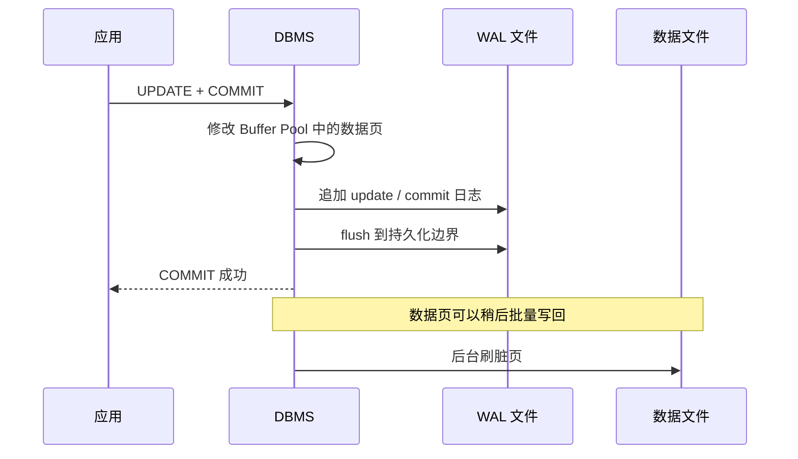

# WAL、恢复、复制与分片

数据库修改一行时，数据页通常先在 Buffer Pool 中变脏，而不是立刻同步写回数据文件。如果每次提交都随机刷新所有修改页，性能很差；如果只留在内存，断电又会丢失。**Write-Ahead Logging（WAL，预写式日志）**用“先持久化顺序追加的日志，再延后写数据页”同时解决这两个问题。

## 1. WAL 的两条核心顺序

一个通用 WAL 系统维护两条顺序约束：

1. **脏数据页写入持久化数据文件前，至少到该页将包含的最新日志位置为止，相关日志必须先持久化；** 这个位置会在下一节定义为 `pageLSN`。
2. **向客户端确认事务提交前，事务的 commit 日志以及它之前的必要日志必须先持久化到承诺边界。**



为什么日志可以比数据页先落盘？日志是顺序追加，写入紧凑；数据页可能散落在很多文件位置。崩溃后，已提交但尚未进入数据文件的修改可以由日志 **REDO（重做）**。

WAL 不等于业务审计日志。恢复日志以机器恢复为目标，格式可能变化、压缩或回收；审计日志要满足可读性、权限、保留期和业务事件语义。两者可以关联，但不能互相替代。

## 2. 一个日志记录里有什么

不同系统格式不同，一个概念化 WAL 记录可能包含：

```text
LSN          日志序号，单调推进
transaction  哪个事务产生
page_id      修改哪个页
record_id    修改哪个槽/记录
before       修改前信息（供 UNDO）
after        修改后信息（供 REDO）
prev_lsn     同一事务上一条日志（便于回退）
type         UPDATE / COMMIT / ABORT / CHECKPOINT ...
```

**Log Sequence Number（LSN）**标识日志位置。数据页常保存 `pageLSN`，表示该页已包含到哪条日志的修改。恢复重放某记录时，若 `pageLSN` 已经不小于该日志 LSN，就可以跳过，避免把同一修改重复应用。

这要求 REDO 具有**幂等性**或由 LSN 检查保护：恢复过程自己也可能再次崩溃，重启后必须能够重新恢复。

日志可以保存物理字节差异、逻辑操作，或二者混合。物理日志容易精确重放但与页布局绑定；逻辑日志更紧凑或更易复制，但恢复时依赖更高层语义。具体取舍属于实现设计。

## 3. STEAL 与 NO-FORCE 决定为何需要 UNDO/REDO

Buffer Pool 何时允许写页，可以用两个维度描述。

**STEAL**：允许把仍含未提交事务修改的脏页写回数据文件。这样缓冲池可以回收帧，但崩溃后数据文件可能含未提交结果，所以通用恢复算法需要 **UNDO**。

**NO-STEAL**：未提交事务修改过的页不能写回。恢复简单，但大事务可能占住大量内存。

**FORCE**：提交时强制把该事务修改的所有数据页写回。已提交结果都在数据文件中，通常不需 REDO，但随机写很多。

**NO-FORCE**：提交时不要求所有数据页落盘。提交快，但崩溃后需要 REDO 已提交修改。

| 策略 | 崩溃时数据文件可能有什么 | 通用恢复需要 |
|---|---|---|
| NO-STEAL + FORCE | 没有未提交页，已提交页已落盘 | 最简单，但性能和内存压力大 |
| STEAL + FORCE | 可能含未提交修改 | UNDO |
| NO-STEAL + NO-FORCE | 已提交修改可能未进数据文件 | REDO |
| STEAL + NO-FORCE | 两种情况都可能 | REDO + UNDO |

这张表采用教材中的原子页写入/崩溃模型，先忽略 **torn page（页撕裂）**、介质永久损坏和副本丢失。页撕裂是指崩溃时一个数据库页只有部分扇区写成新值；它还需要页校验、在日志中保存整页镜像、原子写能力或其他机制处理。许多经典教材以 STEAL + NO-FORCE 和 ARIES 恢复为主线。并非所有产品都采用完全相同的 UNDO 设计：例如 PostgreSQL 主要通过 WAL REDO 恢复物理页，一条未提交 MVCC 行版本在恢复后仍因事务未提交而不可见，并由后续清理回收；这不同于传统 ARIES 逐条物理 UNDO。讲原理时要区分通用策略矩阵与具体数据库实现。

## 4. 崩溃恢复数字推演

假设磁盘数据初始 `A=100, B=200`：

```text
LSN 10: T1 UPDATE A 100→80
LSN 20: T1 UPDATE B 200→220
LSN 30: T1 COMMIT
LSN 40: T2 UPDATE A 80→50
-- 此时崩溃，T2 没有 COMMIT
```

崩溃前可能发生：

- WAL 已持久化到 LSN 40；
- 数据页 A 已在 LSN 10 后写回，甚至包含 T2 的 50（STEAL）；
- 数据页 B 仍是 200（NO-FORCE）；
- T1 已提交，T2 未提交。

通用恢复要得到 `A=80, B=220`：

1. **分析（analysis）**：识别 T1 是 winner（崩溃前已提交事务）、T2 是 loser（崩溃时未完成事务），并确定脏页与起始位置；
2. **REDO**：按日志顺序重放必要修改，使数据页至少达到崩溃前已记录状态；B 从 200 变 220；
3. **UNDO**：逆向撤销 loser T2，A 从 50 恢复到 T2 之前的 80，并写补偿日志，保证恢复再次崩溃仍可继续。

为什么常先 REDO 再 UNDO？数据文件可能同时落后和超前于事务边界。先“重复历史”把所有已记录动作恢复到一致物理状态，再撤销未提交事务，推理更统一。具体产品阶段名称和顺序可能不同。

若某页已经有 `pageLSN=20`，恢复看到 LSN 20 的记录可跳过；若只有 `pageLSN=10`，就需要应用 LSN 20。这个比较避免盲目重复修改。

## 5. Checkpoint 缩短恢复扫描

没有 checkpoint 或其他恢复锚点时，恢复可能要扫描很长的日志前缀。**checkpoint（检查点）**记录恢复所需的活跃事务、脏页或日志位置，并配合后台刷页推进可恢复边界。只有当旧日志不再被崩溃恢复、复制、归档或备份需要时，才能回收。

简单“停世界”检查点可以暂停新事务、刷完全部脏页并写检查点记录，容易理解但停顿大。现代系统常使用**模糊检查点（fuzzy checkpoint）**：事务继续运行，检查点记录当时活跃事务、脏页或 redo 起点，后台逐步刷页。

```text
checkpoint 不是：这个时刻以后日志都不需要
checkpoint 是：恢复可从记录的 redo/状态起点开始重建
```

检查点太频繁会增加写 I/O；太稀疏会积累更多脏页与日志，延长恢复时间。它在稳态写入成本、日志空间和恢复时间之间权衡。

检查点也不是备份。它帮助同一数据库实例利用日志恢复；误删数据后，检查点可能已经把误删推进数据文件。备份需要独立副本、保留策略和恢复演练。

## 6. COMMIT、write 与 fsync 的边界

通用 `write()`、页缓存、块层与设备刷新的完整路径见[一次文件写入](../foundations/file_write_path.md)。数据库层必须额外理解：应用调用 `write()` 把 WAL 交给内核，不一定表示数据已经越过所有易失缓存；`fsync` 或等价同步操作用于要求系统把此前写入推进到该存储栈声明的持久化边界。

持久性仍依赖硬件和虚拟化层正确报告 flush 完成；带电池缓存、云块存储和文件系统各有具体语义。`fsync` 返回建立的是特定故障模型下的契约，不是“机房毁损、软件误删等任何灾难都不会丢”的承诺。

DBMS 可以用 **group commit** 把多个并发事务的提交日志一起 fsync：一次昂贵同步完成后，同时唤醒多位等待者。这样减少每事务同步次数，但增加了很小的等待批次窗口。

某些产品允许关闭同步提交以换取吞吐或延迟。这通常仍能保持数据库结构一致，却可能让客户端已收到“成功”的最近事务在 OS/机器崩溃后丢失。使用前必须明确 RPO，而不是只把它当性能开关。

## 7. 从 WAL 到主从复制

WAL 已经描述数据变化，所以可以把日志流发送到另一台机器重放。常见**主从/主备复制**流程：


复制进度至少要区分：

- **sent**：主库已经发送；
- **write**：备库接收并写入 OS；
- **flush**：备库已推进持久化；
- **replay/apply**：备库已把日志应用到可查询状态。

“复制延迟为 0”必须说明比较哪个位置。字节 LSN 落后量、写入延迟、刷盘延迟和回放延迟回答不同问题。

**物理复制**通常复制页级/WAL 变化，要求主备存储格式和版本兼容；**逻辑复制**传递表级逻辑变更，可选择对象并支持更灵活拓扑，但 DDL、序列、冲突和语义覆盖要单独处理。

## 8. 异步与同步复制

**异步复制**允许主库在不等待备库确认时提交。优点是写延迟不包含网络往返，备库故障也不直接阻塞主库；缺点是主库突然永久损坏并故障转移时，尚未复制的已确认事务可能丢失。

**同步复制**让提交等待一个或多个备库达到规定阶段。通用系统可以选择“远端已接收”“远端已持久化”或“远端已应用”等确认点，产品名称并不统一。以 PostgreSQL 流复制为具体例子：

- `remote_write`：备库已写入操作系统，但未必持久化；
- `on`：同步备库已把 WAL 刷到持久化存储，可理解为等待远端 flush；
- `remote_apply`：备库已重放提交记录，新的查询可以看见。

同步至少增加网络往返与备库处理等待；备库变慢会把尾延迟传回主库。多备库还要选择“等待指定一个”“任意 k 个”或“全部”。同步复制提高特定故障下的数据安全，不自动解决错误写入、软件 bug 或两地同时故障。

术语必须绑定确认点。例如“零数据丢失”若只等待一个同机房备库，而两台机器共享电源或人为误删被同步复制，承诺并不完整。

## 9. 复制延迟与读己之写

应用在主库写入后立即从异步备库读取，可能看不到自己的提交：

```text
t0 主库 COMMIT order=42
t1 应用查询备库
t2 备库才 replay order=42
```

这违反**读己之写（read-your-writes）**会话保证，但不表示事务在主库未提交。常见解决方式：

1. 写后一定时间内固定读主库（sticky session）；
2. 提交时取得 LSN/版本，读备库前等待其 replay 至少该位置；
3. 对强一致读取直接路由主库；
4. 同步等待 remote apply，但会把备库回放延迟加入提交路径。

仅等待备库 flush 不能保证备库查询已可见，因为 flush 与 replay 是两个阶段。

复制延迟也会影响：

- 读到旧配置或旧权限；
- 故障切换时的 RPO；
- 长查询与回放冲突；
- 监控对主备结果的比较。

接口应标记哪些读取允许陈旧、最大陈旧多久、是否需要单调读和读己之写，而不是把所有读随机分发给副本。

## 10. Failover、脑裂与 fencing

**failover（故障切换）**把备库提升为新主库。难点不只是启动写服务，还要确认旧主库不会继续接受写入。网络分区时两个节点都以为对方失效并同时成为主库，叫**脑裂（split brain）**。

需要租约、仲裁/共识元数据、STONITH 或其他 **fencing（隔离旧主）** 手段，确保同一数据集只有获授权的主库写入。STONITH 在这里指通过关机、断网或撤销共享存储访问等方式，强制旧主失去写能力，而不是只相信它“应该已经停止”。DNS、负载均衡和客户端连接也要切换，并处理不知道提交结果的在途请求。

RPO（Recovery Point Objective）表示最多能接受丢多少已确认数据；RTO（Recovery Time Objective）表示服务要多快恢复。异步复制通常有非零 RPO。同步复制只有在“已确认的远端副本仍存活、它有资格被提升、故障没有同时摧毁所需故障域”等前提下，才可能把该故障范围内的复制 RPO 降到 0；代价是更高写延迟和故障时不可用风险。

副本不是备份：

- 误删除会复制到备库；
- 逻辑损坏可能同步传播；
- 勒索或权限错误可能同时影响所有在线副本；
- 备份需要独立保留点和实际恢复演练。

## 11. 分片只解决单机容量的一部分

**分片（sharding）**把数据按**分片键（shard key）**分到多个独立节点。下面的取模公式只用于说明路由，不是可直接扩容的完整方案：N 改变时，大量 key 会移动，生产系统通常还需要虚拟分片、一致性哈希或版本化目录来控制迁移。

```text
shard = hash(tenant_id) mod N
```

好分片键让多数事务和查询只访问一个分片，并让负载均匀。坏分片键可能产生热点、跨分片 JOIN 和跨分片事务。

常见策略：

- 哈希分片：分布较均匀，范围查询和扩缩容较复杂；
- 范围分片：范围查询自然，但最新时间段或大客户可能热点；
- 目录分片：映射灵活，但目录成为关键元数据服务。

分片后新增责任包括：

- 全局唯一 ID；
- 路由表与版本；
- 再均衡期间双写/迁移正确性；
- 跨分片事务与补偿；
- 聚合、排序和分页；
- 每个分片自己的复制、备份与恢复。

数据库“支持分片”不表示应用查询自动保持单机语义。优先确认单机容量、索引、归档和读副本是否已经足够，再承担分布式复杂度。

## 12. CAP 与共识放在什么位置

CAP 讨论的是发生网络分区时，分布式系统不能同时保证所有请求都得到成功响应（availability）和所有读写都表现为单一最新一致副本（consistency）。它不是“数据库平时只能从 C、A、P 任意选两个”的配置按钮；现实网络必须考虑分区，系统要定义分区期间哪些操作拒绝、等待或返回旧数据。

**共识算法**用于让多个节点在故障下就日志顺序、领导者或配置达成一致，是复制与选主的基础组件之一。它不能替应用定义事务、不变量、分片键和陈旧读取政策。本章只说明数据库如何消费这些能力；部分失败、一致性模型、quorum 与 Raft 由[分布式系统基础](../distributed/distributed_systems_intro.md)和[复制与共识](../distributed/replication_consensus.md)主讲。

## 13. 常见误解

- **“WAL 就是先写一份完整数据页。”** 日志记录可以是物理、逻辑或混合变化，核心是持久化顺序。
- **“事务 COMMIT 后所有数据页已经落盘。”** NO-FORCE 系统只需保证必要日志持久化，数据页可稍后写回。
- **“有 WAL 就不需要 UNDO。”** STEAL/NO-FORCE 策略和产品版本模型决定恢复动作。
- **“checkpoint 会删除之前所有日志。”** 还要满足恢复、复制槽、备份与归档需求。
- **“write 返回等于物理介质持久化。”** 中间仍可能有内核和设备缓存。
- **“同步复制等于备库立即可读。”** 等待 flush 与等待 replay 是不同保证。
- **“有副本就不会丢数据。”** 异步副本可能落后，同步副本也会复制误操作。
- **“读副本只是更快的主库。”** 它可能陈旧，并受到回放延迟与只读限制。
- **“自动 failover 只需选一台备库。”** 还要隔离旧主、防脑裂并处理不确定提交。
- **“分片后容量乘 N，其他都不变。”** 路由、跨分片操作、再均衡和全局约束都会变化。
- **“CAP 是平时任选两个字母。”** 它讨论网络分区期间的一致性与可用性取舍。

## 14. 推演题

1. 写出 WAL 的两条先写顺序，并分别说明违反后会出现什么故障。
2. STEAL 为什么需要考虑 UNDO？NO-FORCE 为什么需要 REDO？
3. 根据本章 LSN 10–40 的例子，分别指出 winner、loser、需要重做和撤销的修改。
4. `pageLSN` 怎样让 REDO 可以重复执行？恢复过程中再次断电为何不能破坏结果？
5. 模糊 checkpoint 记录哪些恢复起点信息？它为什么不等于完整备份？
6. 一次 group commit 同时确认 20 个事务，减少了什么成本，又可能增加什么等待？
7. 区分备库 sent、write、flush、replay 四个位置。哪个位置至少满足查询读到该事务？
8. 异步复制故障切换为何可能丢失客户端已经收到成功的事务？
9. 等待 remote flush 后立刻读备库，为什么仍可能读不到自己的写？给出两种解决方案。
10. 什么是脑裂？fencing 必须阻止哪个节点继续做什么？
11. 为什么在线副本不能替代离线、带保留点的备份？
12. 为多租户系统选择 tenant_id 或 created_at 做分片键，分别分析热点、范围查询和跨分片风险。
13. 用一句准确的话说明 CAP 在网络分区期间讨论的取舍，而不是“选两个字母”。

## 15. 权威依据

- [Database System Concepts, 7th Edition 官方页面](https://codex.cs.yale.edu/avi/db-book/)：日志恢复、并发、分布式数据库与复制的经典教材依据。
- [CMU 15-445/645 公开课程](https://15445.courses.cs.cmu.edu/fall2024/schedule.html)：Logging、Checkpoints、ARIES 与 Database Recovery 主线。
- [PostgreSQL 官方文档：Write-Ahead Logging](https://www.postgresql.org/docs/current/wal-intro.html)：WAL 先写原则、REDO 与 group commit 说明。
- [PostgreSQL 官方文档：WAL Internals](https://www.postgresql.org/docs/current/wal-internals.html)：LSN、checkpoint 与恢复起点的具体实现实例。
- [PostgreSQL 官方文档：WAL Configuration](https://www.postgresql.org/docs/current/wal-configuration.html)：checkpoint、刷盘和日志配置的实现说明。
- [PostgreSQL 官方文档：WAL 运行参数](https://www.postgresql.org/docs/current/runtime-config-wal.html#GUC-SYNCHRONOUS-COMMIT)：`synchronous_commit` 的 `on`、`remote_write` 与 `remote_apply` 确认边界。
- [PostgreSQL 官方文档：Log-Shipping Standby Servers](https://www.postgresql.org/docs/current/warm-standby.html)：异步/同步流复制、确认阶段与级联复制。
- [PostgreSQL 官方文档：监控复制](https://www.postgresql.org/docs/current/monitoring-stats.html)：sent/write/flush/replay LSN 与复制延迟字段。
