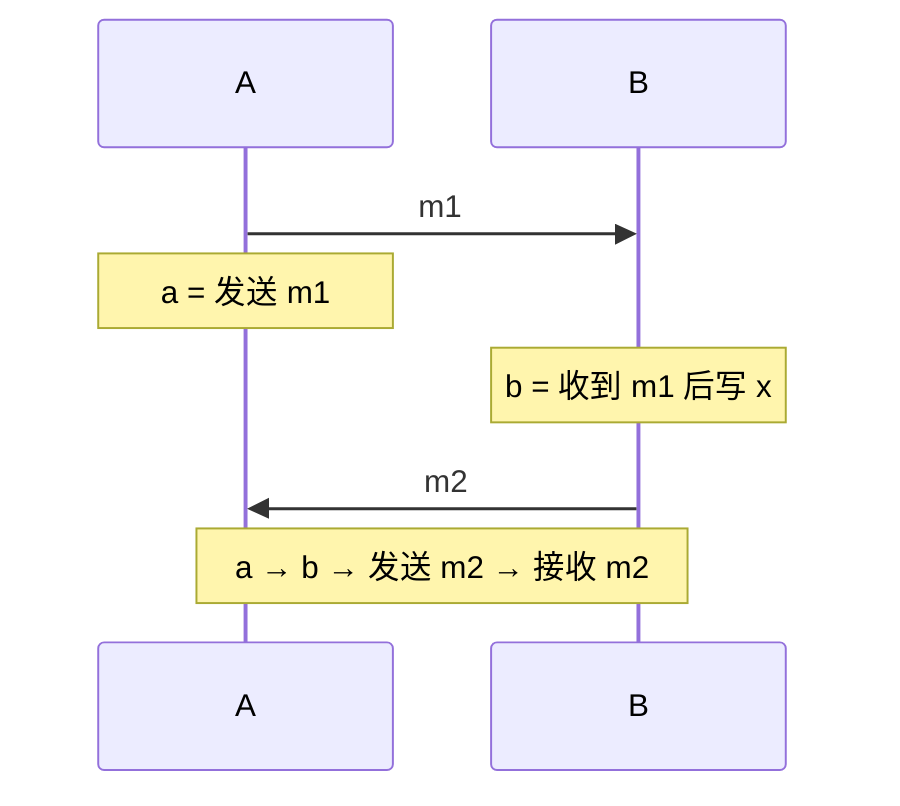

# 分布式系统从哪里开始

**分布式系统（distributed system）**由多台通过网络通信的独立计算机组成，并对外协作完成一个任务。每台机器有自己的 CPU、内存、进程和时钟；节点之间没有一次普通内存读写就能访问的共享状态，只能发送消息。

把服务拆到多台机器可以获得容量、容错、地理就近和团队边界，但也引入单机程序没有的根本问题：消息何时到达没有固定上界，节点可能只坏一部分，不同节点对“现在”和“当前值”可能有不同看法。

## 1. 部分失败为什么最难

单机进程崩溃时，调用者通常很快得到错误或随进程一起失败。分布式系统会出现**部分失败（partial failure）**：

- 服务 A 正常，服务 B 崩溃；
- B 正常执行，但 A 到 B 的网络单向中断；
- 请求到达 B，响应在返回途中丢失；
- B 没坏，只是暂停、过载或延迟突然增大；
- DNS、负载均衡、证书或配置只有部分节点更新；
- 一部分节点能互相通信，另一部分被网络分区隔开。


客户端观察到的都可能只是“在截止时间前没有收到响应”。它无法仅凭沉默判断服务端没执行、正在执行、已经执行但响应丢失，还是已经崩溃。

这里主要讨论 crash、暂停、丢包、延迟和网络分区。节点主动撒谎或被攻击者控制属于 **Byzantine fault（拜占庭故障）**，需要更强假设与协议，不能把普通多数派协议直接当作拜占庭容错。

## 2. 一次 RPC timeout 有三类结果

**RPC（Remote Procedure Call，远程过程调用）**让调用远程服务看起来像调用函数，但网络会把请求和响应拆成两个可能失败的消息。

客户端调用 `Charge(order=42, amount=100)`，等待 500 ms 后超时，至少可能有三类事实：

1. 请求没到支付服务，业务没有执行；
2. 请求到达并成功扣款，响应丢失；
3. 请求到达，服务仍在执行或结果未知。

```text
情况 A：Client --X--> Server                   没执行
情况 B：Client ------> Server 执行成功 --X-->  执行了
情况 C：Client ------> Server ...              仍未知
```

因此：

- **timeout 是调用者的等待结果，不是远端业务结果；**
- 对读请求，重试通常只是多付资源；
- 对写请求，无条件重试可能重复扣款、重复下单；
- “不重试”又可能把本可恢复的暂时丢包变成用户失败。

解决思路是让写操作带稳定的**幂等键（idempotency key）**，服务端原子记录“该键是否执行过及原结果”。同一次业务操作的所有重试必须复用同一个键；每次重试生成新键等于主动放弃去重。完整交付设计见[可靠交付与跨服务事务](reliability_transactions.md)。

## 3. 同步、异步与时间假设

理论模型常按系统对消息和处理时间知道多少来分类：

- **同步模型**：消息延迟和处理时间有已知上界；
- **异步模型**：没有已知时间上界，慢节点与故障节点仅靠等待无法区分；
- **部分同步模型**：平时可能任意慢，但最终会进入满足某个未知上界的稳定时期，或存在未知但有限的延迟界。

真实系统通常按部分同步来设计：安全性不能因为延迟变大而破坏；活性依靠“网络最终恢复到足够好”才能继续推进。timeout 是工程上的怀疑阈值，不是数学证明某节点死亡。

## 4. Wall clock 与 monotonic clock

程序常见两类时钟。

**Wall clock（墙上时钟）**表示日期和 UTC 时间，例如 `2026-08-09T10:00:00Z`。它可用于日志、业务时间和跨系统时间戳，但会被 NTP 校准、管理员修改、闰秒策略或虚拟机迁移影响，可能突然向前或向后跳。

**Monotonic clock（单调时钟）**只保证在同一启动环境内向前推进，适合测量耗时与 deadline：

```text
deadline = monotonic_now() + 800ms
remaining = deadline - monotonic_now()
```

单调时钟通常没有自然日期含义，重启后起点会变化，也不能直接比较不同机器的数值。

错误例子：

```text
elapsed = wall_clock_end - wall_clock_start
```

若墙上时钟期间被向后校准，elapsed 可能为负。计时、超时和租约本地剩余时间应使用单调时钟；需要跨节点排序时，不能假设两个 wall clock 完全同步。

## 5. 时钟偏差、漂移与“最后写入获胜”

两个节点的墙上时间可能相差 **clock skew（时钟偏差）**；硬件振荡器速度不同还会随时间产生 **clock drift（时钟漂移）**。即使不断同步，也只会把误差控制在某个范围，不能获得零误差。

若用客户端时间戳做 last-write-wins：

```text
节点 A 的真实较早写入，时钟快 2 秒，时间戳 12:00:02
节点 B 的真实较晚写入，时钟准，   时间戳 12:00:01
```

按时间戳选择会错误保留 A。更糟的是，时钟向后跳可能让一个节点随后许多写入都显得“更旧”。需要全序时，应使用数据库/共识生成的版本、逻辑钟或明确容忍误差的协议，而不是裸客户端时间。

Google Spanner 的 TrueTime 不是“完美时钟”，而是返回包含不确定性的时间区间，并让事务协议显式等待不确定性过去。这说明正确用法是把时钟误差写进协议，而非假装误差不存在。

## 6. 因果关系比物理时间更基础

事件 a **happens-before（先发生于）** b，记作 `a → b`，若满足以下任一条件：

1. a、b 在同一进程，a 的程序顺序早于 b；
2. a 是发送消息，b 是接收该消息；
3. 存在 c，使 `a→c` 且 `c→b`。

若既不能推出 `a→b`，也不能推出 `b→a`，它们是**并发事件**。并发不代表物理上恰好同时，只表示系统中没有已知因果链确定先后。



“先看到帖子，再发表评论”有因果关系；两个离线用户分别编辑同一文档，可能是并发更新。系统若保留因果顺序，评论不应在原帖之前出现。

## 7. Lamport 逻辑钟

**Lamport clock（Lamport 逻辑钟）**用整数表示因果顺序，不试图表示真实秒数。每个进程维护计数器 L：

1. 本地事件前令 `L=L+1`；
2. 发送消息时携带 L；
3. 收到时间戳 T 的消息时令 `L=max(L,T)+1`。

数字推演：

```text
A 本地事件：L_A=1
A 发送 m：  L_A=2，消息带 2
B 原来 L_B=5，收到 m 后 L_B=max(5,2)+1=6
B 再发送：  L_B=7
```

若 `a→b`，一定有 `L(a)<L(b)`；反过来不成立。两个互不通信的事件也可能得到 3 和 8，不能据此证明前者导致后者。

若需要识别并发更新，可使用**向量钟（vector clock）**：每个节点维护各节点已知计数。两个向量逐分量都不大于且至少一项小于，才能确定因果先后；彼此各有更大分量则表示并发。向量长度随参与者增长，成员变化和元数据成本使它更适合特定场景，不是通用全局时钟。

## 8. 一致性模型是在承诺“读能看到什么”

这里的**一致性模型（consistency model）**是分布式读写历史的可见性契约，不是数据库 ACID 中泛指业务约束的 Consistency。

### 8.1 Linearizability：线性一致性

**Linearizability（线性一致性/可线性化）**要求每个操作看起来在调用与返回之间的某个瞬间原子发生，并尊重真实时间先后。

```text
t1: write(x=1) 返回成功
t2:                     read(x) 开始并返回 0   ← 不允许，t2 晚于成功写
```

并发重叠的两个操作可以按任一合法顺序排列，但一个操作已经返回后才开始的操作不能被排到它之前。线性一致性很适合锁、领导者、库存和配置，但跨地域通常要为协调付延迟或在分区时拒绝请求。

### 8.2 Sequential Consistency：顺序一致性

**Sequential consistency（顺序一致性）**要求所有操作能排列成一个全局顺序，并保留每个客户端自己的程序顺序，但不要求尊重不同客户端观察到的真实时间。

因此某客户端写成功后，另一个稍后才开始的读仍可能在全局顺序中被排到写之前；只要每个客户端内部顺序没乱，就可能满足 sequential consistency。它弱于 linearizability。

### 8.3 Causal Consistency：因果一致性

**因果一致性**要求有 happens-before 关系的写在所有观察者处保持该顺序；并发写可以按不同顺序出现。它比 eventual consistency 提供更多语义，又避免为所有无关操作建立单一全序。

### 8.4 Eventual Consistency：最终一致性

**最终一致性**通常表示：若不再有新更新，且消息最终可达，所有副本最终收敛。它没有单独规定：

- 收敛前读到哪个旧值；
- 并发写如何解决冲突；
- 是否读到自己的写；
- 收敛需要多久；
- 是否保证单调读取。

说“系统最终一致”只是起点，还要说明冲突解决、会话保证、最大陈旧度和失败行为。

### 8.5 Read-your-writes：读己之写

**read-your-writes（RYW）**是会话保证：同一用户写入成功后，之后的读取不能退回到写入前状态。它不要求所有用户立即看见该写。

异步主从中，可通过写后一段时间读主、携带版本并等待副本追上、或会话固定到足够新的副本实现。数据库复制中的 sent/write/flush/replay 区别见[WAL、恢复、复制与分片](../databases/wal_recovery_replication.md)。

## 9. CAP 的精确分区语境

CAP 中的三个词有特定含义：

- **Consistency**：通常指类似线性一致性的单副本读写语义；
- **Availability**：每个发给未故障节点的请求最终都收到非错误响应，但响应可能不是最新值；
- **Partition**：网络把节点分组，组间消息可能无限延迟或丢失。

当网络分区真实发生时，某个键在两侧都有副本：

```text
左侧收到 write(x=1)       X       右侧收到 read(x)
```

- 若右侧仍必须成功返回，它无法知道左侧是否有新写，可能返回旧值，放弃线性一致性；
- 若右侧必须保证最新值，只能等待通信恢复或拒绝请求，放弃 CAP 定义的可用性。

所以 CAP 说的是**分区期间不能同时保证这两项**。P 不是平时可以关闭的功能开关；现实系统必须定义消息断开时怎么做。系统还可以按操作、键或区域做不同选择，不能简单给整个产品贴永久的“CP/AP”标签。

CAP 也没有说没有分区时延迟不重要，更没有覆盖数据持久性、事务、吞吐和一致性模型的全部细节。

## 10. PACELC 补上正常时期的延迟取舍

**PACELC** 是一个设计直觉：

```text
if Partition:
    choose Availability or Consistency
else:
    choose Latency or Consistency
```

即使没有网络分区，跨地域同步多数派也会提高一致性但增加往返延迟；本地立即响应、后台复制延迟较低，但读可能陈旧。PACELC 不是新的精确一致性定义，而是提醒设计者同时说明“故障时”和“平时”的取舍。

## 11. 常见误解

- **“分布式系统就是很多线程。”** 节点之间只有消息，失败和时钟边界与共享内存不同。
- **“timeout 说明请求失败。”** 只说明调用者没及时收到结果，服务端可能已执行。
- **“ping 不通说明节点死亡。”** 网络、对端暂停和本地过载都可能产生相同观察。
- **“NTP 让所有机器时间完全一致。”** 同步只能控制误差，墙上时钟仍可能跳变。
- **“Lamport 时间大的事件一定由小的事件导致。”** 只有因果关系推出时间戳顺序，逆命题不成立。
- **“linearizable 等于 sequential。”** 前者还尊重真实时间先后。
- **“eventual 意味着几秒内一致。”** 定义本身不给固定时间，也不给冲突政策。
- **“CAP 是 C、A、P 平时任选两个。”** 它讨论网络分区期间线性一致性与每请求成功响应的冲突。
- **“RYW 等于所有客户端立刻看到。”** 它只是会话级保证。

## 12. 推演题

1. RPC 超时后，列出“未执行、已执行、仍未知”三条可能时间线。为什么客户端不能仅凭 timeout 区分？
2. 对扣款接口，怎样设计稳定幂等键？为什么每次重试生成 UUID 不正确？
3. wall clock 和 monotonic clock 分别适合日志时间与 deadline 的哪一项？为什么？
4. 根据一组消息发送/接收事件画 happens-before 图，指出哪些事件并发。
5. 按 Lamport 三条规则计算两个节点的逻辑时间。为什么 `L(a)<L(b)` 不能证明 `a→b`？
6. 写出一个满足 sequential consistency 但不满足 linearizability 的读写历史。
7. eventual consistency 还必须补充哪些冲突与会话政策才能成为可用接口？
8. 网络分区时，一侧收到写、一侧收到读。分别说明保持 C 或保持 A 会怎样响应。
9. 为什么“系统是 AP”不足以描述正常时期延迟、会话保证和冲突解决？
10. 用 PACELC 分别描述同地域同步复制和跨地域异步复制的主要代价。

## 13. 权威依据

- Martin Kleppmann，《Designing Data-Intensive Applications》；[作者主页与出版信息](https://martin.kleppmann.com/)：复制、分区、事务、一致性与时间问题的主线参考。
- [MIT 6.5840 Distributed Systems 官方课程](https://pdos.csail.mit.edu/6.824/index.html)：容错、复制与一致性的公开课程与论文阅读入口。
- [Gilbert 与 Lynch：Perspectives on the CAP Theorem](https://groups.csail.mit.edu/tds/papers/Gilbert/Brewer2.pdf)：CAP 的分区语境与形式化定义。
- Leslie Lamport, [Time, Clocks, and the Ordering of Events in a Distributed System](https://lamport.azurewebsites.net/pubs/time-clocks.pdf)：happens-before 与逻辑钟的经典论文。
- Daniel Abadi, [Consistency Tradeoffs in Modern Distributed Database System Design](https://www.cs.umd.edu/~abadi/papers/abadi-pacelc.pdf)：PACELC 对分区期与正常期取舍的原始论述。
- [Spanner: Google’s Globally-Distributed Database](https://research.google.com/pubs/archive/39966.pdf)：把有界时钟不确定性显式纳入事务协议的工程实例。
