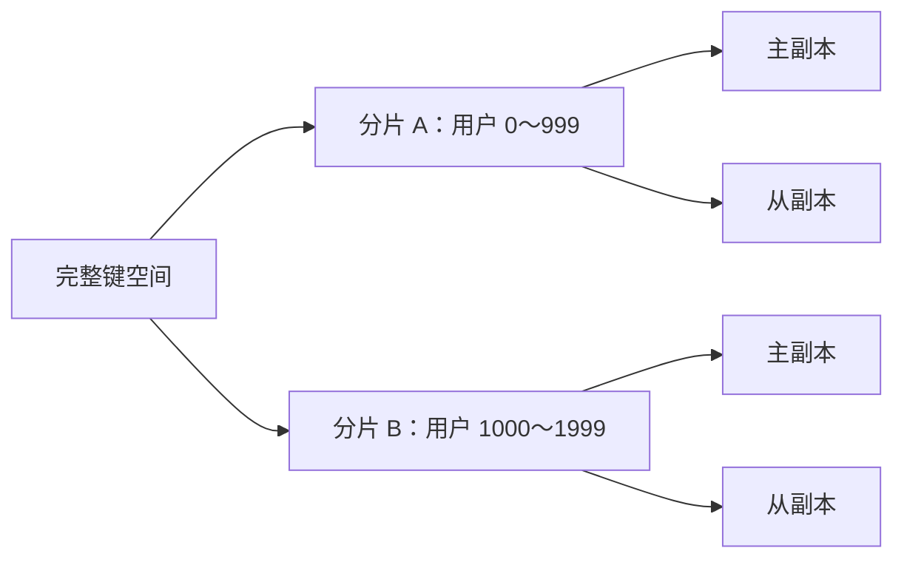
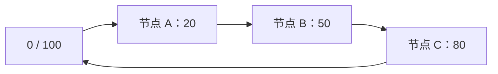
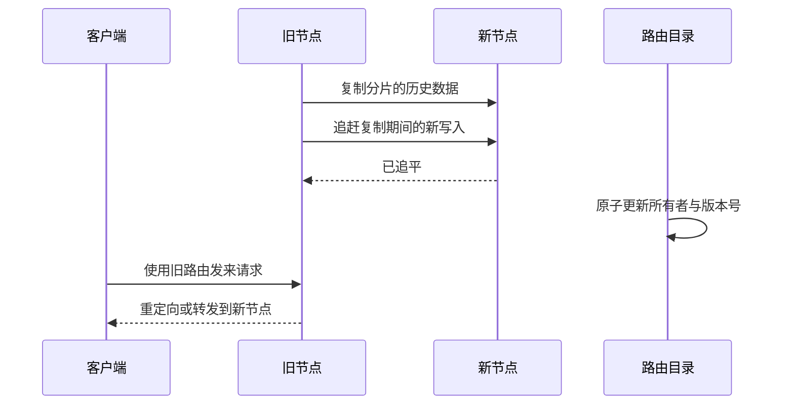
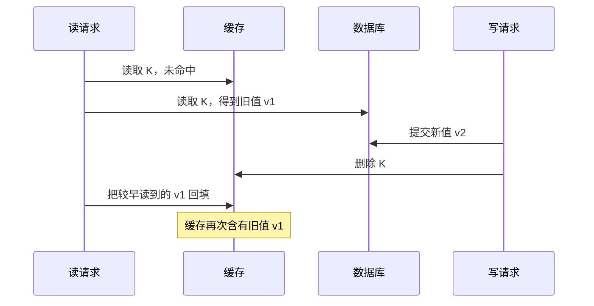

# 分片与缓存：把数据和请求分散开

一台机器的磁盘容量、内存大小和每秒处理能力都有上限。**分片（partitioning 或 sharding）**把一份大数据集按规则拆到多台机器；**缓存（cache）**把近期常用数据的副本放到更快的位置。两者都能扩展系统，却引入了新的问题：请求应该去哪里、数据移动时怎么办，以及副本过期时读到什么。

复制和分片解决的不是同一个问题：

- **复制**把同一份数据保存多份，主要改善容错和读吞吐，详见[复制与共识](replication_consensus.md)。
- **分片**让不同节点保存不同数据，主要扩大总容量和总吞吐。
- 实际系统常把两者组合：先把数据分成多个分片，再为每个分片建立副本组。



## 1. 先决定按什么维度拆

### 1.1 垂直拆分与水平拆分

假设一张用户表有很多行，每行包含身份、头像和账单字段。下面先用小范围数字解释拆分规则；真实系统会根据数据量、负载和节点容量设置更大的边界。

| 方法 | 拆法 | 示例 | 主要限制 |
|---|---|---|---|
| 垂直拆分 | 按列或业务职责拆 | 身份表、资料表、账单表 | 跨表查询和事务会变复杂 |
| 水平拆分 | 按行拆 | 用户 0～999 万在分片 A，其余在 B | 必须由分片键找到目标节点 |

**分片键（shard key）**是决定一行属于哪个分片的字段，例如 `user_id`。选择它不是只看“是否唯一”，还要看请求通常按什么条件访问。如果订单按 `user_id` 分片，“查询一个用户的订单”只访问一个分片；“按订单时间统计全站销售额”却可能访问所有分片。

### 1.2 范围分片

**范围分片（range partitioning）**把连续的键区间分给不同分片。例如：

| 分片 | `user_id` 范围 |
|---|---:|
| A | 0～999 |
| B | 1000～1999 |
| C | 2000～2999 |

范围分片保留了顺序。查询 `user_id BETWEEN 1100 AND 1300` 只访问 B，按键扫描也很自然。问题是数据与流量不一定均匀。如果主键随时间递增，所有新写入都会打到“最右边”的分片，这叫**热点（hot spot）**。

范围边界不能永久不变。一个范围长到 200 GiB，而相邻范围只有 10 GiB 时，系统可以把它拆成两个更小范围；目录服务随后记录新的范围到节点映射。

### 1.3 哈希分片

**哈希分片（hash partitioning）**先用哈希函数把键变成近似均匀的数字，再按数字选分片。最简单的规则是：

```text
shard = hash(key) mod N
```

如果 `N = 4`，哈希值为 14 的键进入分片 2，因为 `14 mod 4 = 2`。均匀哈希能缓解连续键造成的写热点，但破坏原来的顺序：相邻键可能分散在不同机器，范围查询因此需要访问多个分片。

直接取模还有一个迁移问题。节点数从 4 变成 5 时，很多键的余数都会改变，系统可能不得不移动大部分数据。一致性哈希用于减少这种移动。

## 2. 一致性哈希为什么只移动一段数据

**一致性哈希（consistent hashing）**把哈希空间首尾相接成一个环。节点和数据键都映射到环上的位置；一个键由顺时针遇到的第一个节点负责。

为了便于手算，假设环的位置是 0～99，节点位于 20、50、80：



| 键的位置 | 顺时针第一个节点 | 负责节点 |
|---:|---:|---|
| 10 | 20 | A |
| 30 | 50 | B |
| 70 | 80 | C |
| 90 | 绕回 20 | A |

现在在位置 65 加入节点 D。原来落在 `(50, 65]` 的键由 C 负责，现在只需移给 D；环上其他区间的归属不变。这就是“一致”的含义：成员变化时，大多数键仍映射到原节点，而不是保证缓存内容强一致。

只有少量物理节点时，节点在环上的位置可能不均匀。**虚拟节点（virtual node）**让一台物理机在环上拥有许多位置：

- 多个小区间比一个大区间更容易均匀分布。
- 增删机器时，可以把不同小区间交给多台机器，避免单点搬迁过重。
- 性能更强的机器可以分配更多虚拟节点。

虚拟节点不是免费的。每个位置都要保存路由和副本元数据，数量过多会增加管理成本。Dynamo 论文讨论了一致性哈希和节点成员变化，现代系统也可能采用固定数量的逻辑分片再映射到物理节点；关键思想都是把“键空间划分”和“机器数量”解耦。

## 3. 热点、再平衡与路由

### 3.1 均匀的键不等于均匀的流量

即使每个分片的数据量相同，一个拥有一千万关注者的明星账号也可能让某个键承受大量读写。常见热点还有：

- 所有新数据都写入当前时间所在的范围。
- 大量请求访问同一件促销商品。
- 聚合计数器只使用一个键。
- 某个租户远大于其他租户，但租户编号仍被当作完整分片键。

缓解方法取决于访问模式：

- 给只读热点建立缓存或更多只读副本。
- 把一个计数器拆成若干子计数器，读取时求和。
- 给热点键添加有限数量的盐值，例如把 `item42` 拆成 `item42#0`～`item42#15`。
- 把超大租户单独放入专用分片。

加盐会让读取者不知道数据在哪个子键，常常需要并行读取后合并。因此，它适合可合并的数据，不应被当作通用答案。

### 3.2 再平衡期间要同时处理数据和路由

**再平衡（rebalancing）**是在节点加入、离开或负载不均时转移分片。一次安全迁移至少要处理这些状态：



不能在历史数据尚未传完时就直接停止旧节点，也不能让旧、新节点在没有版本约束的情况下各自接受写入。常见做法是由一致的元数据服务给分片归属增加**代（epoch）**或版本号，并让真正串行化写入的副本组拒绝旧 epoch。仅把新数字写进路由表还不够：若隔离中的旧节点仍能直接修改另一份数据，它根本看不到新版本。此时还必须撤销旧节点的写权限、关闭旧存储访问，或让共享下游检查 fencing token。完整原理见[复制章中的 fencing](replication_consensus.md#5-split-brain-与-fencing)。

迁移还要限速。若复制占满磁盘和网络，正常请求会超时；超时又会触发重试，进一步放大负载。

### 3.3 请求怎样找到分片

系统通常采用下列一种或组合方式：

| 路由方式 | 做法 | 取舍 |
|---|---|---|
| 客户端路由 | 客户端缓存分片地图，直接访问节点 | 少一次转发，但所有客户端都要刷新地图 |
| 代理路由 | 无状态代理查地图并转发 | 客户端简单，代理要扩容和容错 |
| 协调节点 | 任意节点接收请求，再转给负责节点 | 接口统一，多一次内部跳转 |

路由信息迟早会短暂过期。协议必须允许旧节点返回“我不再负责这个分片”和新版本位置，客户端刷新后再试；只假设配置能同时更新到所有机器是不可靠的。

### 3.4 Scatter-gather 为什么容易慢

如果查询条件没有分片键，协调者可能向所有分片发请求，再合并结果。这叫 **scatter-gather（散发—收集）**。

例如，要从 20 个分片找全站价格最低的 10 件商品，每个分片先返回本地最低 10 件，协调者再从最多 200 条结果中取全局最低 10 件。这种做法结果正确，但总延迟通常受最慢分片影响；任何分片超时还会带来“返回部分结果还是整体失败”的语义选择。

全局分页更麻烦。对每个分片使用同一个 `OFFSET 10000` 会重复扫描大量数据，而且并发写入可能让页间结果跳动。更稳定的方式是用“上一页最后一个排序键”作为游标，并为每个分片保存继续位置。

## 4. 从分片到批处理：MapReduce 的分工

当任务本来就要扫描全量数据时，可以把计算移动到数据附近。MapReduce 把批处理拆成两个核心函数：

```text
map(输入记录) -> 若干 (中间键, 中间值)
reduce(中间键, 该键的全部值) -> 输出
```

例如统计词频时，`map` 为每个单词输出 `(单词, 1)`；中间的 **shuffle** 按单词重新分区，保证同一单词的所有 `1` 到同一个 `reduce`；`reduce` 再求和。这里分区不只是存储技巧，也决定计算被送往哪里。MapReduce 适合可重跑的离线批处理，不适合把一次在线点查变成全量任务。

## 5. 缓存保存的是什么

缓存保存的是源数据的一个可丢弃副本，或从源数据计算出的结果。**源数据（source of truth）**是发生冲突时最终可信的存储，例如数据库。若缓存被清空后无法从其他地方重建，它就不只是缓存，而是持久化存储的一部分。

命中缓存叫 **cache hit**，未找到叫 **cache miss**。命中率为：

\[
\text{hit rate}=\frac{\text{命中次数}}{\text{总读取次数}}
\]

命中率不是唯一指标。若 99% 请求命中，但剩下 1% 同时压垮数据库，系统仍不可靠；还要观察未命中流量、热点键、缓存延迟和回源延迟。

### 5.1 四种常见读写模式

| 模式 | 请求怎样流动 | 优点 | 风险 |
|---|---|---|---|
| Cache-aside | 应用先读缓存；未命中时读数据库并回填 | 简单，只有被访问的数据入缓存 | 应用负责失效，回填存在竞态 |
| Read-through | 应用只读缓存，由缓存加载源数据 | 读取接口统一 | 加载失败和源数据语义仍需设计 |
| Write-through | 写缓存时同步写源数据，二者成功后返回 | 缓存和源数据较新 | 写延迟更高，跨系统原子性困难 |
| Write-back / write-behind | 先写缓存，稍后异步刷到源数据 | 写入快，可合并写 | 缓存故障可能丢数据，恢复复杂 |

cache-aside 的读取伪代码如下：

```text
function get_user(id):
    value = cache.get(id)
    if value exists:
        return value

    value = database.get(id)
    if value exists:
        cache.set(id, value, ttl=randomized_ttl())
    else:
        cache.set(id, NOT_FOUND, short_ttl)
    return value
```

`NOT_FOUND` 是短期的负缓存，后文会说明它解决什么问题。

## 6. 缓存一致性：失效顺序不能消灭所有竞态

一个常见的 cache-aside 写流程是“先提交数据库，再删除缓存”：

```text
database.update(key, new_value)
cache.delete(key)
```

删除而不是直接覆盖缓存，能够让下一次读取从数据库重新装载，也减少两个并发写按不同顺序覆盖缓存的问题。但它仍不是强一致协议。考虑下面的时序：



问题不在于某一步“顺序写反了”，而在于数据库读和缓存回填跨越了另一个写事务。根据业务需要，可以组合这些方法：

- 为值携带单调递增版本，并在失效时保留“至少应为 v2”的版本水位或短期墓碑。否则删除缓存后已经没有当前版本，迟到的 v1 仍可能被当作一次普通回填接受。
- 使用带比较条件的写入（compare-and-set），让 miss 时取得的 generation 与回填时仍一致才允许写入；删除或失效操作必须同时改变 generation。只对“当前值为空”做 CAS 挡不住上图竞态，因为写请求删除后缓存仍为空。
- 从数据库变更日志通过 CDC 发送失效事件，并让消费者能去重和重放；CDC 见[可靠性与事务](reliability_transactions.md#6-outboxcdc-和对账把消息与本地事务接起来)。
- 设置有限 TTL，让未被及时失效的旧值最终过期。
- 对必须线性一致的读绕过缓存，或把缓存纳入同一一致性协议；代价会明显增加。

“延迟一会儿再删一次缓存”可以降低某些竞态概率，但等待时间无法覆盖所有慢请求，所以它是缓解措施，不是正确性证明。

**TTL（time to live）**规定缓存条目多久后过期。在简单 cache-aside 中，若缓存按时执行过期、回填总是读取权威源的新版本、也不会用 stale-while-revalidate 延长旧值，TTL 才能限制单个旧条目的最长存活时间。若回填读的是落后副本，过期后仍可能再次装入旧值；因此 TTL 本身不构成一致性保证，也不保证用户在过期前读到新值。

## 7. 穿透、击穿与雪崩分别是什么

这三个名称相近，但触发原因不同。

### 7.1 缓存穿透：请求的键根本不存在

攻击者或错误客户端不断查询随机的不存在 ID。缓存每次都未命中，数据库因此承受全部流量，这叫**缓存穿透**。

可用措施包括：

- 校验明显非法的输入，并对客户端限流。
- 用较短 TTL 缓存“不存在”结果；对象随后创建时要删除负缓存。
- 用 Bloom filter 在回源前判断“键可能存在吗”。

**Bloom filter（布隆过滤器）**是节省空间的概率集合。在所有现存键都已正确加入、位数组没有被错误清除的前提下，它可能把不存在的键误判为“可能存在”，这叫假阳性；但不会把已加入的键判断为不存在。标准 Bloom filter 不能直接安全删除单个键，否则可能清掉其他键共用的位；删除需求可用计数 Bloom filter 或定期重建。它只能挡住确定不存在的查询，不能替代数据库。

### 7.2 缓存击穿：一个热点键刚好失效

某个热门商品过期的一瞬间，一万次请求同时未命中并查询数据库，叫**缓存击穿**或热点键的 stampede。

**请求合并（request coalescing，也称 singleflight）**让同一个键只有一个请求回源，其余请求等待并复用结果。还可以在旧值过期后短暂返回旧值，同时由一个后台任务刷新，这叫 stale-while-revalidate。它提高可用性，但业务必须接受这段陈旧窗口。

分布式锁也能限制回源者，但锁需要超时、所有者身份和 fencing；锁服务故障时不能无限等待。

### 7.3 缓存雪崩：大量键或整个缓存同时失效

大量条目在同一秒过期，或缓存集群故障，回源流量一起压到数据库，叫**缓存雪崩**。防护是多层的：

- 在基础 TTL 上增加随机抖动，让过期时间散开。
- 提前刷新热点数据，但仍要允许回源失败。
- 缓存和源存储都做容量规划与故障隔离。
- 在入口限流，在服务内部实施背压，数据库过载时快速失败。

例如，统一 TTL 为 600 秒会让一次批量写入的十万条缓存同时到期。若将 TTL 随机设为 540～660 秒，回源会分散到 120 秒窗口。随机化降低峰值，不保证数据库一定够用；仍需测量最坏情况下的回源能力。

## 8. 常见误解

1. **“一致性哈希能保证数据一致。”** 它只决定成员变化时键怎样重新映射；副本一致性仍由复制协议负责。
2. **“哈希分片一定没有热点。”** 它能均匀分散大量不同键，却无法拆散一个超热键。
3. **“缓存命中率越高，系统一定越快。”** 大对象传输、热点集中和未命中风暴都可能让高命中率系统变慢。
4. **“先更新数据库再删缓存就是强一致。”** 该顺序实用但仍有并发回填竞态。
5. **“加长 TTL 可以提高命中率，所以越长越好。”** TTL 越长，未及时失效的数据可能陈旧越久。
6. **“scatter-gather 只是多发几个请求。”** 它还要处理最慢分片、部分失败、合并顺序和全局分页。

## 9. 推演与面试题

1. 订单按 `user_id` 哈希分片。分别分析“查询一个用户最近订单”和“统计今天全部订单金额”会访问多少分片。
2. 环为 0～99，节点位于 10、40、70。键位于 5、30、65、90 时分别归谁？在 55 加节点后哪些区间迁移？
3. 为什么 `hash(key) mod N` 在 `N` 改变时通常移动很多键？固定逻辑分片怎样缓解？
4. 一个按时间范围分片的日志系统每天午夜出现单分片写热点。给出两种方案，并说明它们对范围查询的影响。
5. 证明“数据量均匀”和“请求量均匀”不是同一件事，并给一个单键热点例子。
6. 一次查询访问 30 个分片。即使每个分片平均只需 10 ms，为什么总请求的尾延迟仍可能很高？
7. 写出 cache-aside 读流程。源数据库不可用且缓存未命中时，接口应该返回旧值、错误还是默认值？分别适合什么业务？
8. 按本章时序解释“提交数据库后删除缓存”为何仍可能留下旧值。版本号如何阻止旧回填？
9. 区分缓存穿透、击穿和雪崩，并为每种问题选一种直接针对原因的措施。
10. 为什么布隆过滤器允许假阳性，却不能允许假阴性？若删除了数据库中的键，过滤器和负缓存应怎样处理？
11. write-back 缓存若在刷盘前丢失节点，会发生什么？要把它用于关键数据，还需要哪些持久化与复制机制？
12. 再平衡时旧客户端仍把写请求发给旧节点。仅靠重定向有什么风险？epoch 或 fencing token 怎样限制旧所有者？

## 权威依据与延伸阅读

- Martin Kleppmann, *Designing Data-Intensive Applications*, Chapters 5–6：复制、分区、请求路由和再平衡。
- DeCandia et al., [Dynamo: Amazon's Highly Available Key-value Store](https://www.allthingsdistributed.com/files/amazon-dynamo-sosp2007.pdf)：一致性哈希、虚拟节点和无主复制的原始工程设计。
- Dean and Ghemawat, [MapReduce: Simplified Data Processing on Large Clusters](https://research.google.com/archive/mapreduce.html)：分区、shuffle、失败重执行与批处理模型。
- Google, [Site Reliability Engineering: Handling Overload](https://sre.google/sre-book/handling-overload/)：过载、限流和优雅降级。
- Karger et al., [Consistent Hashing and Random Trees](https://www.cs.princeton.edu/courses/archive/fall09/cos518/papers/chash.pdf)：一致性哈希的原始算法背景。
