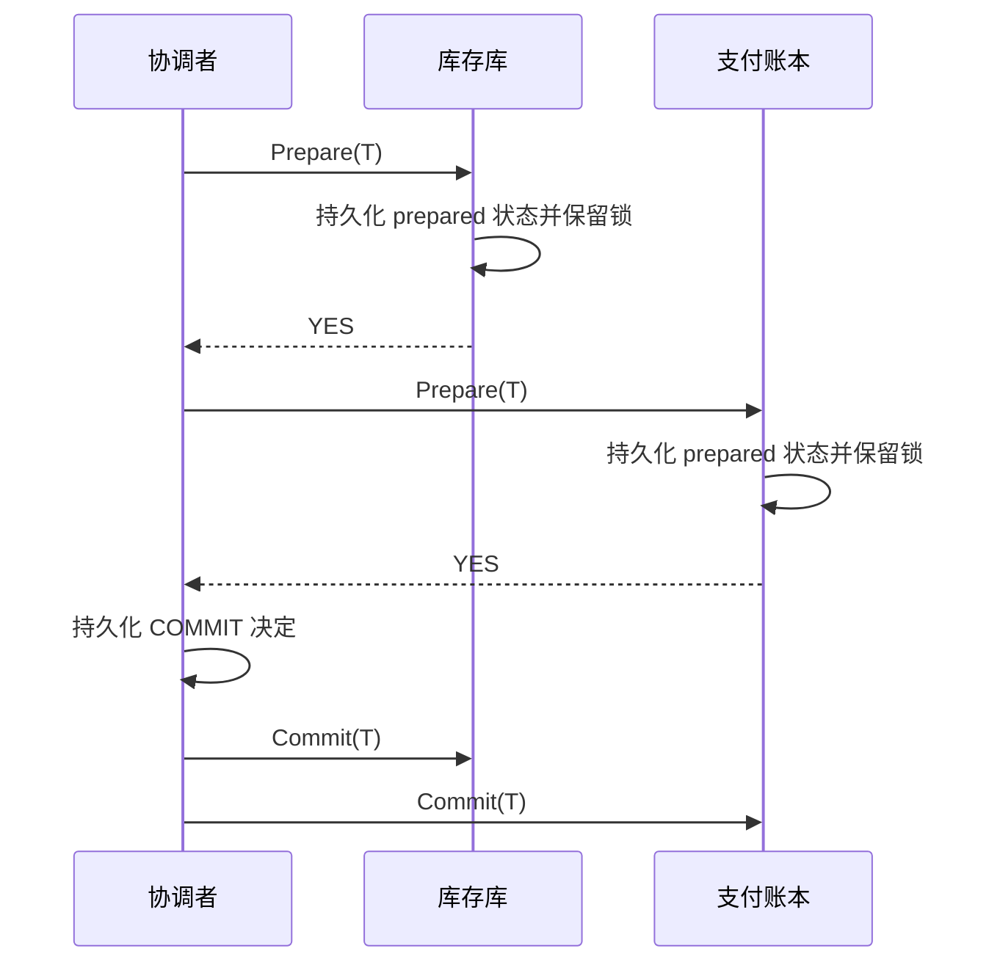
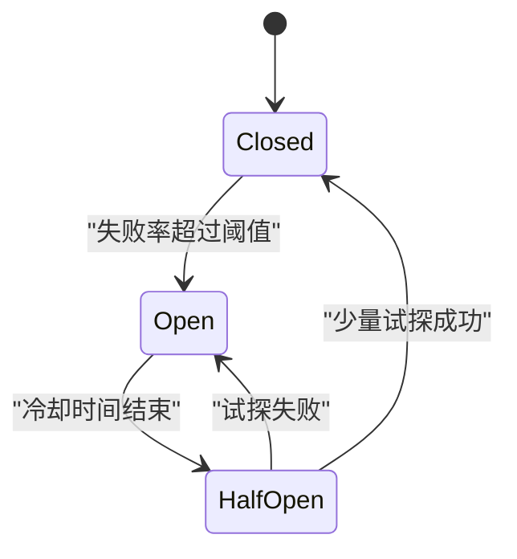
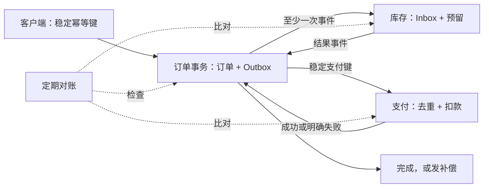

# 可靠性与跨服务事务：失败后仍能得到可解释的结果

一个请求跨过网络、服务、数据库和消息队列后，任意一步都可能超时或重启。可靠系统不是承诺“永不失败”，而是规定：失败怎样被发现、请求是否重试、重复执行会不会多扣一次钱，以及最终怎样查清并修复不一致。

本章使用一个贯穿案例：下单服务依次创建订单、预留库存、扣款并通知用户。它们属于不同服务，不能共享一个普通数据库事务。

## 1. 消息交付语义不等于业务执行语义

先区分三种常见说法：

| 语义 | 系统做法 | 可能丢失 | 可能重复 |
|---|---|---:|---:|
| At-most-once（至多一次） | 不重试，或重试时由接收端持久化去重 | 是 | 否 |
| At-least-once（至少一次） | 未确认就重试；在协议的存活假设内最终送达 | 否 | 是 |
| Effectively-once（效果等同一次） | 至少一次交付，加业务去重和原子落库 | 取决于持久化设计 | 传输可重复，业务效果不重复 |

这些名称描述的是接口在既定故障模型下的承诺，不是某种固定实现。至多一次的核心是“同一消息不会交给应用两次”：最简单的实现确实是不重试，但也可以重试并用持久化消息 ID 抑制重复。后者仍可能在去重记录丢失、保留期结束或故障超出模型时失去保证。

“至少一次”也不是无限条件下的魔法：消息必须被持久保存，发送者持续重试，接收者最终恢复且网络最终可达；若消息过期或所有副本永久丢失，保证的前提已经不成立。

“恰好一次传输”在包含网络和多个故障域时容易被误解。接收者可能已经完成操作，但确认包丢了；发送者看见超时后无法知道操作是否发生，于是只能重试或查询。详见[分布式系统导论中的 RPC 三种结果](distributed_systems_intro.md#2-一次-rpc-timeout-有三类结果)。

工程上更可验证的目标是：允许消息重复到达，但让同一个业务操作只产生一次效果。这需要**稳定幂等键**和持久化去重记录。

`effectively-once` 是对最终业务效果的工程描述，不是所有消息系统都统一定义的标准交付级别。使用这个词时必须继续说明：去重键保存在哪里、与哪次业务修改原子提交、记录保留多久，以及超过保留期后会怎样。

## 2. 幂等键必须代表一次业务意图

**幂等（idempotence）**表示同一操作执行一次和执行多次，最终效果相同。查询通常天然幂等；“账户余额减 100”通常不幂等；“把转账 `T123` 的状态推进到已扣款，若已处理则返回原结果”可以设计成幂等。

客户端在第一次尝试前生成幂等键，例如 `checkout-8f31`，每次重试都复用它。若每次重试生成新键，服务端会把它们当成不同下单操作。

服务端可以保存：

| 字段 | 用途 |
|---|---|
| `idempotency_key` | 唯一标识一次业务意图，数据库加唯一约束 |
| `request_hash` | 防止同一键被用于不同请求参数 |
| `status` | `PROCESSING`、`SUCCEEDED` 或可重试失败 |
| `result` | 重试时返回第一次成功的结果 |

若业务修改和去重表位于同一个数据库，核心步骤应放在一个本地事务中：

```text
begin transaction
    existing = select operation where key = :key for update
    if existing exists:
        if existing.request_hash != hash(request): reject
        if existing.status == SUCCEEDED: return existing.result
        if existing.status == PROCESSING: return IN_PROGRESS

    insert operation(key, request_hash, PROCESSING)
        on conflict: restart from the lookup
    apply_business_change()
    update operation set status = SUCCEEDED, result = :result
commit
```

如果“写去重表”和“扣库存”是两个独立提交，进程可能在两者之间崩溃：只写去重表会漏执行，只扣库存会在重试时重复。因此，去重记录必须和本地业务状态原子提交。若副作用发生在外部支付网关，本地数据库事务无法包住它；调用外部网关时还要传递对方认可的稳定幂等键，并保存可查询的流程状态，不能把上述本地事务方案直接外推到网络调用。

幂等记录也不能无限保留。如果记录在 24 小时后删除，协议就只承诺 24 小时去重；调用者不能在一个月后仍用同一键重放。处于 `PROCESSING` 的请求还需要超时接管规则，并用版本号或 fencing token 防止旧执行者稍后回来覆盖结果。

## 3. 重试是负载放大器，必须有预算

重试适合短暂故障，例如丢包、限流或服务重启；参数非法、权限不足这类永久错误不应重试。即使错误看起来短暂，也要先确认操作能够幂等执行。

### 3.1 指数退避与抖动

**指数退避（exponential backoff）**让连续重试的等待时间逐步变长：

\[
d_n=\min(d_{max}, d_0\times 2^n)
\]

若基础等待 `d0 = 50 ms`、上限 `dmax = 1 s`，未加随机数的等待依次为 50、100、200、400、800、1000 ms。所有客户端若同时按这个序列重试，仍会在相同时间形成尖峰。

**抖动（jitter）**为等待加入随机性。full jitter 可从 `[0, d_n]` 均匀随机选择，分散客户端的重试时刻。抖动不是为了让单个请求更快，而是防止一群请求同步撞击正在恢复的服务。

```text
delay_cap = min(max_delay, base_delay * 2^attempt)
sleep(random_uniform(0, delay_cap))
```

### 3.2 Deadline 与 timeout 不同

**timeout**常指某一步最多等待多久；**deadline**是整个操作必须结束的绝对时刻，或等价的总剩余预算。

假设 API 总预算为 800 ms：

| 已消耗 | 阶段 | 还能使用的预算 |
|---:|---|---:|
| 0 ms | 接收请求 | 800 ms |
| 120 ms | 完成身份校验 | 680 ms |
| 350 ms | 第一次库存调用超时 | 450 ms |
| 500 ms | 退避结束 | 300 ms |

第二次库存调用不能再独自等待 800 ms，而要接收最多 300 ms 的剩余 deadline，并为返回响应留出时间。取消本地等待也不等于远端操作被撤销：请求可能仍在网络中或远端已经提交，所以调用者仍需要幂等键。

### 3.3 不要让每层都自行重试

如果客户端、API、订单服务三个层级都“最多尝试 3 次”，最坏情况下底层库存服务可能收到 `3 × 3 × 3 = 27` 次调用。故障时原本的流量因此被放大 27 倍。

通常让最了解业务语义、且有总 deadline 的一层负责重试；其他层快速返回明确错误。还可以使用重试预算或令牌桶限制重试占总流量的比例。

## 4. 2PC 怎样原子提交，又为什么会阻塞

单个数据库内部的事务由数据库自身保证，参见[事务与并发控制](../databases/transactions_concurrency.md)。当一次操作要让两个独立、支持事务的资源共同提交时，经典协议是**两阶段提交（two-phase commit，2PC）**。

参与者是库存库和支付账本，协调者负责决定：



第一阶段，参与者判断自己能否提交。回答 `YES` 之前，它必须把 prepared 状态写入稳定存储，并承诺即使重启也能按协调者的最终决定提交。只要一方回答 `NO`，协调者就决定全部回滚；等待超时而尚未决定提交时，协调者也可以决定回滚，并通知已经 prepared 的参与者释放状态。全部回答 `YES` 后才允许决定提交。

第二阶段，协调者持久化最终决定，再通知参与者。WAL 为什么必须先持久化，见[WAL、恢复与复制](../databases/wal_recovery_replication.md)。

2PC 的关键问题出现在：所有参与者都已回答 `YES`，协调者却在参与者得知最终决定前失联。参与者不能擅自回滚，因为协调者可能已经决定提交；也不能擅自提交，因为协调者可能尚未决定。它们只能保留 prepared 状态和相关锁，等待决定被恢复，这就是**阻塞**。

2PC 是原子提交协议，不自动解决“哪一台协调者是合法协调者”的共识问题。复制协调者日志可以提高恢复能力，但成员、任期和唯一领导者仍需[共识协议](replication_consensus.md)来保证。

## 5. Saga：用补偿连接多个本地事务

很多微服务不能或不愿长期持有跨库锁。**Saga** 把一个长业务流程拆成多个本地事务；后一步永久失败时，执行前面步骤对应的补偿操作。

下单 Saga 可以写成：

```text
T1 创建待处理订单       补偿 C1 取消订单
T2 预留库存             补偿 C2 释放库存
T3 扣款                 补偿 C3 退款
T4 标记订单成功
```

补偿不是把时间倒转。退款可能产生手续费，也可能晚于原扣款到账；发送过的邮件无法“没发送过”，只能再发送更正。因此每个步骤都要明确可补偿的业务语义，不应把 Saga 描述成跨服务 ACID 事务。

Saga 还有并发可见性问题。库存刚被预留但订单尚未完成时，其他请求已经看见库存减少。业务可以把状态显式表示为 `RESERVED`、给预留设置过期时间，或者在关键资源上使用更强的隔离。

两种组织形式：

- **编排（orchestration）**：一个 Saga 协调器发命令并记录流程状态，容易查看全局进度，但协调器要可靠恢复。
- **协同（choreography）**：服务订阅事件并触发下一步，耦合较隐蔽；流程长时难以看清因果链和失败位置。

不论哪一种，每个步骤和补偿都必须幂等，因为事件和命令可能重复。

## 6. Outbox、CDC 和对账：把消息与本地事务接起来

考虑订单服务的错误写法：

```text
database.commit(order)
message_broker.publish(OrderCreated)
```

进程可能在数据库提交后、消息发布前崩溃，订单已经存在但库存永远收不到事件。反过来先发消息再提交，也可能让消费者处理一个最终回滚的订单。

### 6.1 Transactional Outbox

**Transactional Outbox（事务发件箱）**在同一个本地数据库事务中写业务行和待发送事件：

```text
begin transaction
    insert into orders(...)
    insert into outbox(event_id, aggregate_id, type, payload, status)
commit
```

独立 relay 进程随后读取 outbox 并发布。发布成功但标记已发送前若崩溃，事件会再次发布，所以 outbox 通常提供至少一次交付，消费者仍要去重。

消费者可以用 **inbox** 表保存已处理的 `event_id`，并把 inbox 插入与本地业务修改放在同一事务中。`event_id` 的唯一约束阻止同一事件产生两次业务效果。

### 6.2 CDC

**Change Data Capture（CDC，变更数据捕获）**从数据库提交日志中读取行变更并转成事件。它可以省去轮询 outbox 的压力，但仍需定义：

- 初次快照与后续增量从哪里衔接。
- 顺序是全局顺序、每个分区顺序，还是每个业务对象顺序。
- 表结构变化和删除怎样编码。
- 消费者断线后从哪个持久化位置恢复。

数据库日志的具体格式和保留策略因产品而异；应用不应假设所有数据库提供相同的 CDC 保证。

### 6.3 对账是最后一道可验证防线

**对账（reconciliation）**定期比较本应一致的独立记录，例如支付渠道成功记录与本地订单状态。发现“已扣款但订单仍待支付”时，系统进入人工或自动修复流程。

实时协议只能降低出错概率；程序缺陷、超长故障、人工操作和第三方行为仍可能越过正常流程。对账让系统用持久事实重新验证结果，因此不是“协议失败后的临时补丁”，而是资金、库存等关键业务的必要安全网。

## 7. 故障检测只能产生怀疑

节点可定期发送**心跳（heartbeat）**。接收者超过阈值未收到心跳，就把节点标记为疑似故障。网络拥塞、长时间垃圾回收或 CPU 饱和也会延迟心跳，所以超时不能证明进程已死亡；它只能触发隔离、选主或进一步探测。

超时太短会频繁误判，造成不必要的故障切换；太长又会延迟恢复。阈值应由网络延迟分布、暂停时间和业务恢复要求共同决定。

健康检查也要区分：

- **存活（liveness）**：进程还在运行吗？失败时可重启。
- **就绪（readiness）**：进程现在能正确服务流量吗？失败时应先从负载均衡移除，不一定重启。

## 8. RTO 与 RPO 把“尽快恢复”变成数字

**RTO（Recovery Time Objective，恢复时间目标）**是灾难后业务恢复所允许的最长时间。RTO 为 30 分钟，表示恢复方案要使业务在 30 分钟内重新可用。

**RPO（Recovery Point Objective，恢复点目标）**是最多可以丢失多长时间范围的数据。每小时做一次备份，在最坏情况下可能丢近一小时数据，RPO 约为一小时；同步复制和持久日志可以把 RPO 降低，但通常增加延迟和成本。

RPO 为 0 不等于 RTO 为 0：数据可能一条没丢，但重建服务仍需数小时。反过来，服务可以几分钟启动，却从旧备份恢复而丢失最近数据。备份只有经过定期恢复演练，才算验证过的恢复能力。

## 9. 过载时先阻止故障扩散

### 9.1 背压

**背压（backpressure）**让下游处理不过来时，上游减速、阻塞或被明确拒绝。无界队列只会把问题推迟：排队时间不断增长，最终耗尽内存，而队列里的请求早已超过 deadline。

因此队列要有容量上限；满时可以返回过载错误、丢弃低优先级工作，或让生产者等待。选择取决于请求是否可丢、是否能重试和 deadline 还有多少。

队列容量、Little 定律和单机流水线的完整解释见[吞吐量、流水线与背压](../infrastructure/throughput.md)；这里关注背压如何阻止一次远程依赖故障向整条调用链扩散。

### 9.2 Circuit breaker

**熔断器（circuit breaker）**记录下游近期失败情况：



关闭时请求正常通过；打开时快速失败，避免每个请求都等待已故障下游；半开时只允许少量试探请求。熔断阈值太敏感会在短暂抖动时拒绝健康流量，太迟钝又无法保护下游，所以必须结合指标和压测调整。

### 9.3 Bulkhead

**舱壁隔离（bulkhead）**来自船舱隔板：为不同下游、租户或任务类型分配独立线程池、连接池或并发额度。即使图片处理占满自己的 20 个工作槽，支付请求仍保留独立资源。只有逻辑上的模块划分而共用同一个无界线程池，并不是真正隔离。

限流、背压、熔断和舱壁解决的层面不同：限流控制进入速率，背压把容量不足反馈给上游，熔断减少对故障依赖的无效调用，舱壁限制一个故障域能消耗的资源。

## 10. 完整推演：一次下单遇到确认丢失和服务重启

假设客户端用幂等键 `checkout-8f31` 下单：

1. 订单服务在一个本地事务中插入 `PENDING` 订单和 `ReserveInventory` outbox 事件，然后返回订单号。
2. relay 发布事件后崩溃，来不及标记已发送；恢复后它再次发布同一 `event_id`。
3. 库存服务第一次收到事件时，在一个事务中插入 inbox 去重行并创建 `RESERVED` 预留。第二次收到相同事件时，唯一约束命中，它返回第一次结果，不会再次扣库存。
4. 库存结果消息到达订单服务，订单服务写入 `ChargePayment` outbox 事件。
5. 支付服务成功扣款，但响应在网络中丢失。订单服务超时后携带同一个支付幂等键重试；支付服务从持久化记录返回第一次扣款结果，不再扣一次。
6. 若支付明确返回不可恢复失败，Saga 发送 `ReleaseInventory` 补偿。补偿也带稳定事件 ID，重复到达只释放一次。
7. 任一服务重启后都从自己的数据库恢复流程状态，而不是依赖内存中“我刚才执行到哪一步”的标记。
8. 定时对账扫描长时间停留在 `PENDING` 的订单，并比对支付渠道和库存预留。无法自动判断的异常进入人工队列。



这个流程没有假设跨服务瞬间原子提交。中间状态对其他服务可见，消息也可能重复；正确性来自持久化状态机、局部事务、幂等处理、可补偿步骤和最终对账共同作用。

## 11. 常见误解

1. **“HTTP POST 不能幂等。”** HTTP 方法名不决定业务实现；带稳定幂等键的创建操作可以做到效果幂等。
2. **“超时表示远端没有执行。”** 超时只表示调用者没有按时观察到结果。
3. **“有重试就不会丢请求。”** 重试耗尽、deadline 到期和永久错误仍会失败；重复副作用也必须处理。
4. **“2PC 就是共识。”** 2PC 决定一组参与者原子提交或回滚，但协调者失联时可能阻塞；共识解决多个节点如何在故障下形成唯一决定。
5. **“Saga 的补偿等价于数据库回滚。”** 补偿是新的业务动作，可能失败，也无法抹去外部已经观察到的事实。
6. **“Outbox 提供恰好一次消息。”** 发布确认丢失时仍会重复；它依靠消费者去重实现一次业务效果。
7. **“心跳超时证明机器死了。”** 超时只能产生怀疑，网络分区和暂停也会造成同样现象。
8. **“队列越大越能吸收流量。”** 无界排队会把过载变成长延迟和内存耗尽。

## 12. 推演与面试题

1. 服务完成扣款后响应丢失。调用者看到什么？为什么不能用一个新幂等键直接重试？
2. “余额减 100”怎样改造成幂等转账？去重记录和余额更新为什么要处于同一事务？
3. 总 deadline 为 500 ms，第一次调用花 220 ms，退避 80 ms，本地收尾至少需 50 ms。第二次调用最多能分到多少时间？
4. 三层各自都在首次失败后重试两次，也就是每层最多尝试三次时，底层最多被调用多少次？你会把重试放在哪一层，为什么？
5. 画出 2PC 协调者在所有参与者 `YES` 后崩溃的状态。参与者为什么既不能提交也不能回滚？
6. 设计“预留库存—扣款—发货”的 Saga。列出每一步补偿，以及一个无法真正撤销的外部效果。
7. 解释数据库提交后直接发消息的崩溃窗口。Outbox 消除了哪个窗口，又为什么仍需消费者 inbox？
8. CDC 消费者保存的位置丢失后会发生什么？为什么事件处理必须能重放和去重？
9. RTO 为 15 分钟、RPO 为 5 分钟分别约束什么？每小时一次的离线备份能否满足？
10. 下游因为过载变慢时，重试、长队列和超时如何形成正反馈？背压与熔断分别在哪里切断它？
11. 给图片处理和支付共用一个服务进程时，怎样用 bulkhead 保证图片任务不会耗尽支付资源？
12. 在完整下单案例中任选一个进程崩溃点，说明恢复依据保存在何处、消息是否会重复、业务效果怎样去重。
13. 为什么对账不能只查“有没有消息”，而要比较订单、支付和库存的业务事实？
14. 一个 `PROCESSING` 幂等记录的执行者暂停一分钟，新执行者接管后，旧执行者又恢复。怎样用版本号或 fencing 防止旧执行者提交？

## 权威依据与延伸阅读

- Martin Kleppmann, *Designing Data-Intensive Applications*, Chapters 8–9：不可靠网络、超时、分布式事务和一致性保证。
- AWS Builders' Library, [Timeouts, retries, and backoff with jitter](https://aws.amazon.com/builders-library/timeouts-retries-and-backoff-with-jitter/)：超时选择、重试放大、指数退避与抖动。
- Google, [Site Reliability Engineering: Addressing Cascading Failures](https://sre.google/sre-book/addressing-cascading-failures/)：队列、过载、重试和故障级联。
- MIT 6.5840, [Distributed Systems](https://pdos.csail.mit.edu/6.824/index.html)：故障、复制、事务与分布式系统实验材料。
- Gray and Lamport, [Consensus on Transaction Commit](https://www.microsoft.com/en-us/research/publication/consensus-on-transaction-commit/)：原子提交与共识之间的关系。
- Garcia-Molina and Salem, [Sagas](https://www.cs.princeton.edu/research/techreps/598)：长事务拆分与补偿事务的原始模型。
