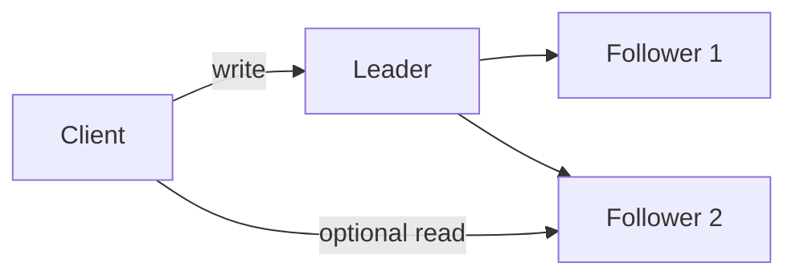

# 复制、Quorum 与共识

**复制（replication）**把同一份逻辑数据保存到多个节点，主要为了容忍节点故障、提高读容量或让数据靠近用户。复制不会自动得到正确性：必须定义谁能写、写何时算成功、副本冲突怎样解决、故障切换后哪些结果保留。

## 1. Leader–Follower：一个节点决定写顺序

**主从/leader–follower replication** 让一个 leader 接受写入，再把复制日志发送给 follower。读可以只走 leader，也可以分流到 follower。



leader 给写入建立单一顺序，冲突较容易处理。代价是 leader 成为写入口；故障切换要选新 leader，并确保旧 leader 不再写。

**同步复制**让 leader 在确认写之前等待指定 follower 达到某个阶段，减少 leader 永久故障时的数据丢失，但增加网络等待，并让慢副本进入写延迟路径。

**异步复制**让 leader 本地提交后立即响应，follower 后台追赶。写延迟低、对 follower 故障更宽容，但读 follower 可能陈旧，故障切换可能丢失尚未复制的已确认写。

常见折中是等待一个或多数派副本同步，其他副本异步。必须说明“同步到写入内存、持久化日志还是已经应用”，这些确认点不是同一保证。

数据库怎样用 WAL 传递日志，以及 sent、write、flush、replay 四个确认位置怎样区分，由[WAL、恢复、复制与分片](../databases/wal_recovery_replication.md)具体讲解；本章只保留理解复制拓扑和共识所需的通用语义。

## 2. Multi-Leader：多个地点都能写

**多主/multi-leader replication** 允许多个 leader 独立接受写，再互相复制。它适合多数据中心断网仍需本地写、离线客户端同步等场景，但同一键会出现并发冲突：

```text
区域 A：title = "red"
区域 B：title = "blue"
网络恢复后，两个写都存在
```

冲突处理可能采用：

- 预先避免：按用户/数据归属固定写区域；
- last-write-wins：简单但依赖时间/版本，可能静默丢写；
- 合并值：集合并集、计数器等可交换操作；
- 保留多个并发版本，让应用或用户解决；
- CRDT 等具有收敛证明的数据类型。

“最后写入获胜”必须定义最后由什么顺序决定。裸 wall clock 会受时钟偏差影响。多主的写可用性来自把冲突推迟到以后处理，不表示冲突消失。

## 3. Leaderless：客户端或协调者写多个副本

**无主/leaderless replication** 不指定固定写 leader。一次读写由客户端或无状态协调者并行访问多个副本。Dynamo 风格系统常用：

- `N`：每个键保存的副本数；
- `W`：写成功前需要确认的副本数；
- `R`：读返回前需要响应的副本数。

例：`N=3, W=2, R=2`。

```text
写 x=v2：A、B 确认，C 暂时仍是 v1 → 写成功
读 x：读取 B=v2、C=v1 → 版本比较后选择/合并 v2
```

先说明这个算式成立的前提：一个键有固定的 N 个首选副本；读集合和写集合都从**同一组 N 个副本**中选择；写确认的版本仍保留在确认节点上；读到多个版本后，协调者有可靠的版本比较与冲突处理规则。在这些前提下，若 `R+W>N`，任意 R 个读副本集合与最近一次 W 个写确认集合至少相交一个节点。上例 `2+2>3`。若还希望任意两次成功写的确认集合相交，常要求 `2W>N`。

但这些算术条件**本身不等于线性一致性**，原因包括：

- 同时发生的两次写可能没有统一先后；
- 读到一个新版本和一个旧版本后仍要正确比较版本；
- sloppy quorum 可能把临时副本写到 N 个首选节点之外，读写集合未必相交；
- 写在部分副本成功、客户端超时，形成不确定结果；
- 某些副本故障恢复后带着旧数据返回；
- 时钟型 last-write-wins 可能因偏差选错。

**read repair** 在读出不一致时把新版本回写旧副本；**anti-entropy** 后台比较并修复副本；**hinted handoff** 在目标节点不可用时暂存写入，恢复后转交。这些机制帮助最终收敛，不自动提供单一最新值语义。

## 4. 版本、冲突与删除

副本需要区分“旧版本”和“并发版本”。单 leader 可用递增日志位置；无主系统可能用向量钟、版本向量、混合逻辑钟或产品定义版本。

删除不能简单把记录从一个副本抹掉。否则离线旧副本回来后可能把已删除值当作“缺失节点的新数据”重新传播。分布式存储常写入带版本的 **tombstone（墓碑）**，等确认所有相关旧版本都不再回来后再回收。过早清理墓碑会造成数据复活，永久保留又会占空间。

## 5. Split Brain 与 fencing

网络分区时，旧 leader 可能仍然活着，只是无法联系其他节点。若两侧都提升 leader 并接受写，就出现**脑裂（split brain）**。

```text
Client A -> old leader L1  写 x=1
                    X 网络分区
Client B -> new leader L2  写 x=2
```

恢复网络后不能仅靠“两个节点都自称 leader”决定真相。需要 quorum/共识选主，并用 **fencing token（隔离令牌）**让下游资源拒绝旧 leader。

fencing token 是由线性一致的授权服务签发的单调递增世代号；真正执行写入的存储还要持久记住自己见过的最大世代：

```text
L1 token=41
L2 token=42
存储已经见过 42 后，拒绝任何 token<42 的写
```

仅给 leader 一个超时 lease 不一定够：旧 leader 可能先检查“租约还有效”，随后长时间暂停，并在租约已经过期后从下一条指令继续执行。如果它不重新校验就写外部资源，新 leader 可能已经接管。墙上时钟跳变也会破坏未经证明的到期判断。lease 协议必须建立在单调计时、时钟误差界和多数派确认等明确假设上；外部资源检查 fencing token，才能拒绝这类迟到的旧 leader 写入。

## 6. 共识到底解决什么

**共识（consensus）**让多个节点对一个值或一串决定达成不可反悔的一致结果。典型用途包括：

- 选择当前 leader/任期；
- 确定复制日志的下一条命令；
- 配置与成员变更；
- 分布式锁的所有者和 fencing token；
- 元数据服务中的唯一决策。

一个共识协议通常希望满足：

- **Agreement**：正确节点不会决定不同值；
- **Validity**：决定值来自合法提案；
- **Integrity**：一个实例不会决定两次相互冲突的值；
- **Termination**：在协议假设最终成立时，正确节点最终能决定。

安全性要求“网络再差也不能决定两个冲突值”；活性允许在分区或持续抖动时暂时不能推进。多数派系统有 `2f+1` 个节点时，只要剩余 `f+1` 个节点仍能互相通信，就可在 f 个节点 crash 或不可达时形成多数派。例如 5 节点在其余 3 节点互通的前提下，可承受 2 节点不可用并继续推进。

共识不是把所有业务数据自动同步，也不是跨任意数量服务的事务。它通常提供复制状态机的有序日志，业务仍要定义命令、幂等和状态机。

## 7. Raft 的三个角色与 term

Raft 把节点分成：

- **Follower**：被动接收 leader 日志和心跳；
- **Candidate**：选举超时后发起选举；
- **Leader**：处理客户端命令并复制日志。

时间被划分为递增的 **term（任期）**。每个 term 最多一个 leader，也可能没有 leader。消息携带 term；节点看到更高 term 必须更新当前 term 并退回 follower。term 像逻辑世代，不是 wall clock 时间。

```text
term 7: leader=A
A 失联
term 8: B/C 发起选举，B 获多数票成为 leader
A 恢复并看到 term 8，不能继续以 term 7 写
```

## 8. 选举完整推演

集群有 A、B、C 三节点，初始都是 term 4 follower。leader 心跳消失后：

1. B 的随机 election timeout 最先到期；
2. B 把 term 增到 5，转 candidate，先投自己一票；
3. B 向 A、C 发送 RequestVote(term=5, lastLogIndex, lastLogTerm)；
4. 每个节点在一个 term 最多投一票，并且只投给日志至少和自己一样新的 candidate；
5. A 投 B，B 得到 2/3 多数，成为 term 5 leader；
6. B 立即发送空 AppendEntries 心跳，声明 leader 并阻止其他节点超时。

随机超时降低多个 follower 同时参选的概率。若平票，没有 candidate 获多数，等待下一次超时进入更高 term 重选。只要网络最终稳定且超时不总冲突，系统才会取得活性。

为什么请求投票要带最后日志位置和任期？仅仅“谁 term 大”不能保证 candidate 拥有已提交条目。Raft 的投票新旧比较先看最后日志 term，再看 index，使多数派不会选出缺失已提交前缀的 leader。

## 9. 日志复制与提交

每条 Raft 日志包含 `(index, term, command)`：

```text
index:    1          2           3
term:     4          5           5
command: x=1       y=2         x=3
```

三节点 A、B、C，B 是 term 5 leader。客户端发送 `SET x=3`：

1. B 把命令追加为 `(index=3, term=5)`，此时还不能回复成功；
2. B 并行发 AppendEntries 给 A、C，消息包含前一条的 index/term；
3. A 持久化并确认，C 暂时超时；
4. B 看到包括自己在内 2/3 节点拥有 index 3；
5. 因 index 3 是当前 term 5 的条目，B 把 commitIndex 推进到 3；
6. B 按顺序把日志 1..3 应用到状态机，回复客户端；
7. 后续心跳把 commitIndex=3 告诉 C，C 追上后再应用。

**复制到一个 follower 不等于 follower 已应用；复制到多数派也要由 leader 按规则宣布 commit。** 客户端只有在命令已提交并应用到 leader 状态机后才能把响应当作完成。

Raft leader 不能仅凭“旧 term 条目已在多数派”直接计算提交它；标准规则通过复制并提交一个**当前 term**条目，间接提交它之前的旧条目。这条限制避免不同 leader 对旧日志作出冲突判断。

## 10. 日志冲突怎样修复

AppendEntries 携带 `prevLogIndex` 和 `prevLogTerm`。Follower 只有在该位置 term 匹配时才接受新条目；否则拒绝，leader 向前调整 `nextIndex` 重试，直到找到共同前缀。

例：

```text
新 leader: [(1,t1),(2,t2),(3,t4),(4,t6)]
旧节点:   [(1,t1),(2,t2),(3,t3),(4,t3),(5,t5)]
```

共同前缀到 index 2。旧节点删除 index 3 之后未提交的冲突后缀，再复制 leader 的 `(3,t4),(4,t6)`。Follower 不能自行合并两个后缀；leader 日志决定未提交冲突部分。

已提交条目为什么不会被这样删掉？核心是**多数派交集 + 选举日志新旧限制**共同形成的 Leader Completeness 性质：

- 当前 term 的条目只有复制到多数派后，leader 才能按计数规则提交；这个多数派也保存了它之前的完整日志前缀；
- 任意后续选举多数派都与先前多数派相交，因此选票中至少会遇到携带该前缀信息的节点；
- candidate 的最后日志 term/index 若不够新，就无法收集到一个合法多数派；
- Raft 论文进一步用反证法证明：首个缺少该已提交条目的更高 term leader 不可能通过上述投票限制当选。

不能把第二步简化成“相交的那个节点一定投给含条目的候选者”：它也可能拒绝投票。真正的结论是，**缺少已提交前缀的候选者不可能凑齐合法多数票**。

一个只复制到旧 leader 自己、尚未提交的条目可以在新 leader 上被覆盖。客户端若尚未收到成功，必须把结果视为未知并用幂等键重试。

## 11. Raft 安全性质

Raft 论文把安全性拆成可检查性质：

- **Election Safety**：一个 term 最多一个 leader；
- **Leader Append-Only**：leader 不覆盖或删除自己的日志，只追加；
- **Log Matching**：两日志若某 index/term 相同，则此前前缀相同；
- **Leader Completeness**：某条目在 term t 提交后，更高 term leader 都包含它；
- **State Machine Safety**：某节点在 index i 应用某命令后，其他节点不会在同一 index 应用不同命令。

心跳不只是“leader 活着”的通知；空 AppendEntries 也携带前缀匹配和 commitIndex 信息。持久化 currentTerm、votedFor 和日志的时机属于安全性的一部分，不能在崩溃后忘掉自己同 term 已投票或已接收的条目。

## 12. 读取、lease 与线性一致性

日志写入走多数派并不自动让任意 follower 读取线性一致。Follower 可能落后，旧 leader 也可能尚未发现自己已失去多数派。

常见线性一致读方法：

- 把读也写成日志命令；简单但多一次复制；
- leader 先提交一条当前 term 的日志以确认自己掌握已提交边界，再通过 ReadIndex/多数派心跳确认自己仍是 leader，并等待状态机应用到相应 commitIndex；
- 使用有严格时钟与续租证明的 leader lease，在有效期内本地读。

lease 若没有可靠误差界和 fencing，节点暂停后恢复可能提供陈旧写权限。对外部数据库、对象存储或设备执行副作用时，应把递增 fencing token 传给资源，由资源拒绝旧世代。

## 13. 复制配置变更也要达成一致

把 3 节点直接改成另一组 3 节点，若旧配置和新配置在不同网络侧各形成多数派，可能出现两个 leader。Raft 使用联合共识或论文后来给出的单节点变更方案，让过渡期间的多数派集合安全相交。

成员配置本身是复制日志的一部分，不能只在运维脚本里同时改几台机器。新增节点追日志、移除旧节点和转移 leader 也要限速，避免恢复流量拖垮前台请求。

## 14. 常见误解

- **“复制三份就不会丢数据。”** 要看何时确认、多少副本持久化和故障相关性。
- **“异步 follower 只影响延迟，不影响正确性。”** 故障切换可能丢已确认写，读取也可能陈旧。
- **“R+W>N 就一定线性一致。”** 还需要版本、并发写、失败重试和真正相交的副本集合。
- **“last-write-wins 总能找到真实最后写。”** wall clock 偏差和并发会造成静默丢写。
- **“多数派能判断哪个节点真的死了。”** 多数派只是相交集合；timeout 仍只是怀疑。
- **“Raft term 是时间。”** 它是单调逻辑世代。
- **“leader 写入本地日志就能回复。”** 必须满足多数派和提交规则。
- **“follower 日志越长就越新。”** 选举先比较最后日志 term，再比较 index。
- **“旧 leader 恢复后删掉新 leader 的日志。”** 高 term 使旧 leader 退位，冲突前缀由当前 leader 修复。
- **“Raft 保证任意 follower 读最新值。”** 线性一致读还需 ReadIndex、日志读或经证明的 lease。
- **“租约到期判断就是 fencing。”** fencing 需要资源拒绝较旧世代，不只依赖持有者自觉停止。

## 15. 做题方法：分别验算副本集合和 Raft 日志

### 15.1 Quorum 题先枚举集合

1. 写出一个键的 N 个固定首选副本，并明确读写是否都只从这组节点选择。
2. 枚举一次成功写的 W 集合和一次读的 R 集合；`R+W>N` 只证明二者至少相交一个节点。若要检查成功写之间相交，再验算 `2W>N`。
3. 给每个副本标出版本，而不是只写“新/旧”。读集合相交以后，还要说明协调者怎样比较顺序版本或保留并发版本。
4. 若题目允许 sloppy quorum，把临时节点画到首选集合之外；此时不能继续套用固定集合的相交结论。最后再追 hinted handoff、read repair 或 anti-entropy 是否能让副本收敛。

### 15.2 Raft 题维护一张状态表

为每个节点记录 `currentTerm`、`votedFor`、日志 `(index,term)`、`commitIndex` 和 `lastApplied`，每收到一条消息就更新一行：

1. 先比较消息 term；旧 term 消息拒绝，看到更高 term 就更新并退回 follower。
2. RequestVote 先检查本 term 是否已投票，再按“最后日志 term 优先，term 相同才比 index”判断候选者是否足够新。
3. AppendEntries 先核对 `prevLogIndex/prevLogTerm`；不匹配就找共同前缀，只覆盖未提交的冲突后缀。
4. leader 数副本时，只有当前 term 条目达到多数派才能按标准规则推进 `commitIndex`；它会连带提交此前前缀，不能直接按副本数提交旧 term 条目。
5. 只有 `index≤commitIndex` 的命令才能按序应用。最终验算：同一 index 不会在两个状态机应用不同命令，且任何更高 term leader 都含已提交前缀。

### 15.3 Lease 题在“检查”和“使用”之间插入暂停

让旧 leader 检查租约后暂停，新 leader 获得更高 token，再让旧 leader 恢复写入。若下游只相信调用者自报“租约有效”，方案失败；若下游持久保存最大 fencing token 并拒绝较小值，迟到写才被挡住。

## 16. 推演题

1. 主从同步、异步分别把哪些等待放进客户端提交路径？故障切换的 RPO 有何差别？

<details><summary>展开参考答案与解答</summary>

同步复制把至少一个/多数远端的接收、持久化或应用等待放进提交路径，具体边界由承诺定义；异步只等主本地提交。同步到持久多数可把相应故障模型下 RPO 收紧到 0，异步 RPO 取决于复制 lag，可能丢已确认写；同步代价是更高延迟与分区时不可用。

</details>

2. 多主同时修改同一字段时，列出三种冲突处理方式及各自丢失的信息。

<details><summary>展开参考答案与解答</summary>

LWW 按时间戳/版本选一个，会丢另一并发值且受时钟规则影响；保留 siblings/版本向量把冲突交给应用，不丢候选但增加读取与合并复杂度；CRDT/业务合并能保留可交换信息，但只适用于有明确定义的合并语义。人工裁决也可保真但延迟高。

</details>

3. `N=5` 时选择哪些 R、W 能满足 `R+W>N` 和 `2W>N`？这些条件为何仍不证明线性一致？

<details><summary>展开参考答案与解答</summary>

`2W>5` 要求 `W≥3`；再满足 `R+W>5`：W=3 时 R≥3，W=4 时 R≥2，W=5 时 R≥1。其余更大 R 也可。推导还依赖同一固定 N、真实读写集合、版本比较和完成写传播；sloppy quorum、并发写、读修复滞后或没有单一写序都可能只给相交而非线性一致。

</details>

4. 什么是 sloppy quorum？它为什么可能破坏“读写集合必相交”的简单推导？

<details><summary>展开参考答案与解答</summary>

首选副本不可达时，sloppy quorum 把写临时放到其他健康节点并记 hinted handoff。后续读可能仍从首选集合取 R 个，而写实际落在替代集合，两集合即使数量满足公式也可能不相交。必须定义协调者、版本/读修复和 handoff 的实际保证。

</details>

5. 删除为什么需要带版本 tombstone？过早回收会发生什么？

<details><summary>展开参考答案与解答</summary>

tombstone 是“删除也是一个有版本的写”，能在反熵时压过旧值。若某副本离线期间 tombstone 被回收，它带旧值回来时系统缺少更高删除版本，旧数据会复活。回收需等待覆盖最大离线/修复窗口或用更强成员与版本证明。

</details>

6. 5 节点共识集群最多容忍多少节点不可达仍取得多数派？

<details><summary>展开参考答案与解答</summary>

多数为 `floor(5/2)+1=3`，因此最多 2 节点不可达，剩余 3 仍可形成多数。失去 3 个只剩 2，不能选主或提交新条目，但已持久数据不应因此被随意改写。

</details>

7. 手推 A、B、C 平票后进入下一 term 的 Raft 选举。

<details><summary>展开参考答案与解答</summary>

term 4 中 A、B、C 若超时接近并各先投自己，没人得到 2 票；各自保持 candidate，随机选举超时重新开始。假设 B 最先超时，它递增到 term 5、投自己并发 RequestVote；A/C 看到更高 term 转 follower，其中一个在日志不落后且本 term 未投票时投 B。B 得 2/3 成 leader；迟到 term 4 消息被拒绝。

</details>

8. 候选者日志最后项 term 更大但 index 更小，和 term 更小但 index 更大，谁更新？按 Raft 规则说明。

<details><summary>展开参考答案与解答</summary>

Raft 按 `(lastLogTerm,lastLogIndex)` 字典序比较：先看 term，只有 term 相等才看 index。因此 term 更大但 index 更小的候选者更 up-to-date；term 更小即使 index 更大也不更新。投票者还要检查本 term 尚未投票。

</details>

9. 三节点 leader 只把条目写到本地就崩溃，新 leader 是否必须保留该条目？为什么？

<details><summary>展开参考答案与解答</summary>

不必须。它未复制到多数、未 committed；另外两节点可选出不含该条目的 leader，新 leader 通过日志匹配覆盖旧 leader 恢复后的未提交后缀。客户端也不能在只写本地时收到“已提交”承诺。

</details>

10. 画一个日志冲突例子，按 prevLogIndex/prevLogTerm 找共同前缀并覆盖未提交后缀。

<details><summary>展开参考答案与解答</summary>

leader 日志为 `[(1,1),(2,1),(3,3),(4,3)]`，follower 为 `[(1,1),(2,1),(3,2),(4,2)]`，元组是 `(index,term)`。leader 先以 `prev=(3,3)` 发送，follower 在 index3 term2 不匹配而拒绝；leader 回退到 `prev=(2,1)`，匹配后 follower 删除 index3 起的冲突后缀并追加 `(3,3),(4,3)`。已提交前缀不能出现在这种可覆盖冲突中。

</details>

11. 多数派交集与投票日志限制怎样共同保护 committed entry？

<details><summary>展开参考答案与解答</summary>

已提交条目存在于某个多数集合；任何后续选举多数与它至少交一个节点。但仅有交集还不够，投票者必须拒绝日志比自己旧的候选者，迫使获多数的 leader 拥有足够新的日志。配合 log matching，已提交前缀不能被新 leader 覆盖。

</details>

12. 为什么当前 leader 不能仅数旧 term 条目的副本数直接提交它？

<details><summary>展开参考答案与解答</summary>

Raft 规定 leader 只能通过“当前 term 的条目已复制到多数”推进 commitIndex；旧 term 条目会随该当前 term 条目间接提交。若仅数旧条目，存在论文 Figure 8 的选举历史，使它虽一度在多数节点上仍被不同日志的新 leader 覆盖。current-term rule 补上 leader completeness 所需条件。

</details>

13. follower read 可能违反 linearizability 的时间线是什么？ReadIndex 解决了哪一步不确定性？

<details><summary>展开参考答案与解答</summary>

旧 leader/follower 与多数隔离后仍以为有效；新多数选出 leader 并提交 x=2，客户端再向旧节点读到 x=1，违反实时顺序。ReadIndex 让 leader 先通过当前 term 的多数 heartbeat 确认自己仍是 leader并取得安全 commit index，再等本地应用到该 index；普通 follower 还需由 leader 授权/同步。

</details>

14. 旧 leader 带 token=8 醒来，新 leader 已有 token=9。下游资源应怎样处理两者请求？

<details><summary>展开参考答案与解答</summary>

资源保存已接受的最高 fencing token：接受 9 后，所有 token 8 写必须拒绝；9 的重复请求再按 operation_id 幂等处理。token 要由单调权威生成并在最终写点校验，仅在协调服务里记录新 leader 不能阻止旧进程直接写资源。

</details>

## 17. 权威依据

- Diego Ongaro、John Ousterhout, [In Search of an Understandable Consensus Algorithm（Raft 扩展论文）](https://web.stanford.edu/~ouster/cgi-bin/papers/raft-extended.pdf)。
- [Raft 官方资料站](https://raft.github.io/)：论文、可视化、形式化规范与实现资料入口。
- [MIT 6.5840 Distributed Systems](https://pdos.csail.mit.edu/6.824/index.html)：Raft、容错 KV 与分片 KV 公开课程。
- [Dynamo: Amazon’s Highly Available Key-value Store](https://www.allthingsdistributed.com/files/amazon-dynamo-sosp2007.pdf)：consistent hashing、sloppy quorum、hinted handoff 与 eventual consistency 的经典论文。
- Martin Kleppmann，《Designing Data-Intensive Applications》；[O’Reilly 目录](https://www.oreilly.com/library/view/designing-data-intensive-applications/9781491903063/)：leader/follower、多主、无主复制与复制延迟。
