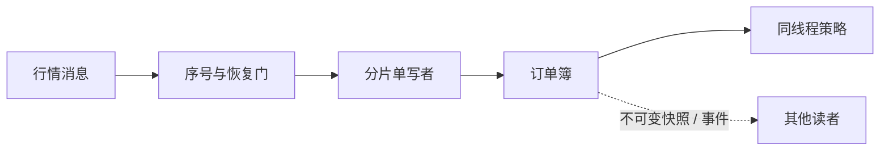

# 订单簿管理 (Order Book Management)

订单簿把带序号的行情事件还原成“当前市场状态”。策略读到的结果必须同时满足两点：**业务上连续**，并且**并发上没有数据竞争**。更底层的 L1/L2/L3 含义见 [L1/L2/L3 数据构建](../connectivity/order_book_data.md)。

> 行情订单簿是对交易所状态的本地重建；交易所撮合订单簿则决定订单优先级。二者数据结构相似，但权威性和职责不同。

## 1. 先选所有权模型，再选锁

最容易证明正确的起点是单写者：一个事件循环按交易所序号更新某个分片的订单簿，并在更新后调用同线程策略。这样既没有锁，也不会把半次更新暴露给策略。



如果确实需要跨线程读写，可以比较：

| 方案 | 适用情况 | 主要代价 |
| --- | --- | --- |
| `Mutex` / `RwLock` | 先做正确基线、低竞争或冷路径 | 竞争和调度会增加尾延迟 |
| 单写者 + 消息传递 | 状态能按标的/频道分片 | 跨分片查询和队列背压 |
| 不可变 `Arc<Snapshot>` 发布 | 读者允许看到稍旧的完整快照 | 克隆/回收成本和快照构建 |
| 原子字段小快照 | BBO 等少量固定宽度字段 | 只适合原子可表示的数据 |

`Mutex` 不是“绝对禁止”；不经测量手写 `unsafe` 并发结构往往更危险。应先建立正确基线，再用目标负载和 p99 证据说明是否需要替换。

## 2. Rust 中不要手写普通 `T` 的 SeqLock

经典 SeqLock 的思路是：写前把版本变奇数，写完变偶数；读者前后读取版本，不一致就重试。但下面这种做法在 Rust 中**不 sound**：

```text
Atomic version + UnsafeCell<T> + 读者直接读取 &T
```

原因是 Writer 对 `T` 的普通写和 Reader 对 `T` 的普通读会并发发生。Rust/C++ 内存模型把这种非原子数据竞争视为未定义行为；“读完发现版本变了并丢弃结果”不能撤销已经发生的 UB。若 `T` 包含 `Vec`、引用或枚举，读到中间状态还可能先越界或解引用无效地址。

安全选择包括：

1. 所有共享字段本身都是原子类型；
2. 发布不可变快照，使用经过验证的 RCU/Arc-swap 类实现处理生命周期；
3. 通过通道把事件交给状态所有者；
4. 使用标准锁，测到它确实是瓶颈后再优化。

### 2.1 只发布 BBO 的安全教学例子

下面每个共享字段都是原子的，因此不会产生普通内存数据竞争。为便于解释使用 `SeqCst`；生产中若要减弱内存序，必须给出 happens-before 证明并用并发模型测试验证。

```rust
use std::sync::atomic::{AtomicI64, AtomicU64, Ordering};

#[derive(Debug, Clone, Copy, PartialEq, Eq)]
pub struct Bbo {
    pub bid_price_ticks: i64,
    pub bid_qty: u64,
    pub ask_price_ticks: i64,
    pub ask_qty: u64,
}

pub struct AtomicBbo {
    version: AtomicU64,
    bid_price_ticks: AtomicI64,
    bid_qty: AtomicU64,
    ask_price_ticks: AtomicI64,
    ask_qty: AtomicU64,
}

impl AtomicBbo {
    /// 架构约束：只有订单簿所有者调用 publish。
    pub fn publish(&self, value: Bbo) {
        self.version.fetch_add(1, Ordering::SeqCst); // odd
        self.bid_price_ticks.store(value.bid_price_ticks, Ordering::SeqCst);
        self.bid_qty.store(value.bid_qty, Ordering::SeqCst);
        self.ask_price_ticks.store(value.ask_price_ticks, Ordering::SeqCst);
        self.ask_qty.store(value.ask_qty, Ordering::SeqCst);
        self.version.fetch_add(1, Ordering::SeqCst); // even
    }

    pub fn try_read(&self) -> Option<Bbo> {
        let before = self.version.load(Ordering::SeqCst);
        if before & 1 == 1 {
            return None;
        }

        let value = Bbo {
            bid_price_ticks: self.bid_price_ticks.load(Ordering::SeqCst),
            bid_qty: self.bid_qty.load(Ordering::SeqCst),
            ask_price_ticks: self.ask_price_ticks.load(Ordering::SeqCst),
            ask_qty: self.ask_qty.load(Ordering::SeqCst),
        };

        let after = self.version.load(Ordering::SeqCst);
        (before == after).then_some(value)
    }
}
```

这仍不是完整通用 SeqLock：它要求单写者，读者可能在持续写入时一直失败，还要考虑版本回绕和重试上限。完整 L3 订单簿通常不适合拆成大量原子字段，因为读者很难得到一致的复杂结构。

示例为突出内存安全省略了 handle 构造器；生产 API 应只创建一个不可 `Clone` 的 Writer handle，把读者限制为只持有 `try_read` 能力，从类型层减少误用。

## 3. L3 订单簿的数据结构

常见操作与复杂度取决于价格空间：

| 操作 | 常见结构 | 典型复杂度 |
| --- | --- | --- |
| 按 Order ID 找订单 | `HashMap<OrderId, Slot>` | 平均 O(1)，不是最坏 O(1) |
| 找稀疏价格档 | `BTreeMap<Price, Level>` | O(log L) |
| 找紧密有界价格档 | 直接索引数组 | O(1)，但可能浪费内存 |
| 同价队尾新增 | 档位的 head/tail 索引 | 已找到档位后 O(1) |
| 删除已定位订单 | 双向索引链 | 已定位节点后 O(1) |
| 找 best | 树的边界键，或维护 best index | 依结构而定 |

因此，“所有 Add/Cancel/Best 都严格 O(1)”通常缺少前提。答案应说明平均/最坏复杂度、价格范围和 best 维护方式。

### 3.1 用索引式 Arena，避免悬空指针

```rust
use std::collections::{BTreeMap, HashMap};

type Slot = u32;

struct OrderNode {
    order_id: u64,
    price_ticks: i64,
    remaining_qty: u64,
    prev: Option<Slot>,
    next: Option<Slot>,
}

#[derive(Default)]
struct PriceLevel {
    total_qty: u64,
    order_count: u32,
    head: Option<Slot>,
    tail: Option<Slot>,
}

struct L3OrderBook {
    by_order_id: HashMap<u64, Slot>,
    levels: BTreeMap<i64, PriceLevel>,
    nodes: Vec<Option<OrderNode>>,
    free_slots: Vec<Slot>,
}
```

索引在 `Vec` 扩容后仍指向同一逻辑槽位，而指向 `Vec` 元素的裸指针可能因扩容立即悬空。槽位复用时，若索引会暴露到模块外，应再附带 generation，组成 `(slot, generation)`，防止旧句柄误指向新订单。

更新必须同时维护：

- `by_order_id` 与槽位的一一对应；
- `prev/next/head/tail` 链接；
- 档位 `total_qty` 与 `order_count`；
- 空档删除和 best 更新；
- checked 数量运算和重复事件处理。

## 4. 不可变快照与“双缓冲”的边界

“Writer 写 Back，交换指针后立刻改旧 Front”并不自动安全：慢 Reader 可能仍在读旧 Front。手写 `AtomicPtr` 还必须解决对象生命周期、ABA 和回收时机。

更稳妥的方案是：

- 使用 `Arc<Snapshot>`，读者持有期间对象不会被释放；
- 用经过验证的 Arc-swap/RCU 实现发布，而不是自己拼裸指针；
- 或让每个 Reader 拥有副本，通过有界增量流追赶；
- 全量复制太贵时，只发布策略真正需要的 BBO/特征快照。

快照语义应明确：它代表哪个行情序号？读者最多允许落后多久？发生缺口时是否标记 `stale`？

## 5. 衍生指标也要定义边界

### 5.1 中间价

订单簿任一侧为空时没有普通双边 mid，不应把缺失价格默认为 0。整数价格可以返回“两倍 mid”，保留半 tick：

```rust
fn twice_mid_ticks(best_bid: Option<i64>, best_ask: Option<i64>) -> Option<i128> {
    Some(i128::from(best_bid?) + i128::from(best_ask?))
}
```

### 5.2 VWAP 与 Imbalance

全体集合的 `sum(price × qty)` 可以增量维护；但“前 N 档”或“前 V 数量”的边界会随 best 和数量变化，查询不一定 O(1)。乘法与累加使用足够宽的 checked 整数。

一种 L1 imbalance 为：

<div class="formula" role="math" aria-label="买卖盘不平衡等于买一数量减卖一数量，再除以两者数量之和">
imbalance = (Q<sub>bid</sub> − Q<sub>ask</sub>) / (Q<sub>bid</sub> + Q<sub>ask</sub>)
</div>

分母为 0 时无定义。它只是当前可见订单簿特征，不保证价格方向。

## 6. 订单簿不变量

- 行情序号连续，重复事件幂等处理；
- 新增 Order ID 未存在，修改/删除的 ID 已存在；
- 数量非负，减少量不超过剩余量；
- 档位聚合量等于节点数量之和；
- 双向链表前后关系一致，无环且首尾正确；
- 正常连续交易状态下，两侧非空时 `best_bid < best_ask`；
- 快照同时携带 `sequence` 和 `is_live`，策略不能只看价格。

## 7. 面试追问

**为什么不直接说 Mutex 太慢？**

先用锁做正确基线；它是否影响目标 p99 取决于读写频率、临界区和部署。若有证据，再改成单写者或不可变快照，并比较复杂度和恢复语义。

**L3 为什么不能安全地套用普通 SeqLock？**

复杂 `T` 的普通并发读写在 Rust 中就是数据竞争；版本重试不能修复 UB。可发布不可变快照、传递事件，或把极小 POD 快照拆成原子字段。

**只有 L2 时能恢复精确队列位置吗？**

通常不能，因为聚合撤量无法说明发生在自己的前方还是后方，只能维护带假设的上下界。

## 8. 做题方法：事件表、所有权与订单簿不变量

1. **读题定视图和并发模型**：L2 还是 L3、单写多读还是多写、读者需要实时引用还是不可变快照；先定所有权再选锁或发布机制。
2. **画三张表**：订单 ID→订单节点、价格→档位、买卖两侧有序目录；每个事件标它同时修改哪些索引。
3. **逐事件推演**：新增、部分成交、全成、撤销、改价和重复事件分别执行，写清先后顺序和失败时是否可能留下半更新。
4. **快照题标 generation**：发布前构造完整一致视图，再原子切换；读者拿到哪个代数就只读该代，不把两次更新拼成一个快照。
5. **验算**：订单唯一、数量非负、档位聚合等于订单和、空档删除、best 指向首档；事件重放结果 hash 与基线一致。

常见陷阱：用两个独立原子值假装一致快照；普通非原子 `T` 上手写 SeqLock；订单从一个价位移到另一价位时只更新一侧索引；读者持有已回收节点；跨 venue 复用修改优先级规则。

## 9. 易错点与验证方法

- 不要保存指向可能扩容 `Vec` 元素的裸指针；
- 不要把 HashMap 平均 O(1) 说成最坏 O(1)；
- 不要让策略在 `stale` 订单簿上继续产生普通新单；
- 不要在版本校验前产生发送订单等副作用；
- 不要把特征与未来价格方向画等号。

验证时使用协议 golden case、随机 Add/Cancel/Execute 性质测试、重复/缺口/快照恢复测试，并在每个事件后对小订单簿做全量不变量核对。并发发布可用 Loom 类模型测试；性能优化再用峰值回放比较端到端 p99。

---

下一章：[风控系统 (Risk Management System)](risk.md)
