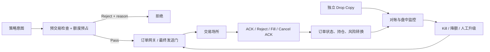

# 风控系统 (Risk Management System)

风控不是一句“策略别下太大单”，而是一组相互独立的防线：在发单前限制最坏风险，在成交后核对事实，在系统异常时阻止扩大风险并安全撤单。它不能保证拦住所有未知故障，但应让每个已知限制可证明、可测试、可审计。

延迟目标必须写成端到端预算的一部分，并带硬件、负载和百分位；不存在适用于所有系统的固定 `100ns–500ns` 风控数字。

## 1. 分层风控



### 1.1 预交易：同步阻止和预占

常见检查：

- 账户、合约、交易时段和订单类型权限；
- 数量、价格、tick、名义金额和价格偏离；
- 已确认持仓加未结订单后的 worst-long / worst-short；
- 单策略、账户和组合敞口；
- 消息速率、订单数和自成交防护；
- 行情/参考价新鲜度、配置版本和 kill 状态。

最大持仓和消息速率不能只放到“成交后异步检查”：那时越限订单已经发出。完整的预占转换见[预交易风控](pre_trade_risk.md)。

### 1.2 盘中与成交后：发现事实和偏差

- 由去重后的 Fill 更新持仓和实际敞口；
- 计算带价格来源/新鲜度的 PnL、Greeks 或集中度；
- 本地回报与独立 drop copy/经纪商状态对账；
- 检测拒单率、未知订单、行情失步和消息异常；
- 触发降额、停止新单、撤单或人工处置。

### 1.3 外部防线

经纪商、交易场所或清算机构的限制是额外防线，不能替代本地风控。外部系统可能有更宽额度、更高延迟或不同口径；drop copy 通常是独立回报来源，不等于“交易所替你做保证金检查”。

## 2. 有界开销，而不是“零开销”

正确的风控必然做运算和读取状态。热路径优化通常是：

- 启动前加载并验证版本化配置；
- 使用整数价格与 checked 运算；
- 将同一订单所需字段放在易访问的数据结构中；
- 避免热路径远程数据库、格式化日志和临时分配；
- 让复合风险状态有明确单一所有者或锁；
- 把拒绝详情异步记录，但同步返回稳定原因码。

```rust
#[derive(Debug, Clone, Copy)]
pub struct NewOrder {
    pub price_ticks: i64,
    pub quantity: u64,
}

pub struct RiskConfig {
    pub min_price_ticks: i64,
    pub max_price_ticks: i64,
    pub max_order_qty: u64,
    pub max_notional_units: i128,
}

#[derive(Debug, Clone, Copy, PartialEq, Eq)]
pub enum RiskError {
    InvalidQuantity,
    PriceOutOfRange,
    ArithmeticOverflow,
    NotionalTooLarge,
}

pub fn check_new_order(order: &NewOrder, cfg: &RiskConfig) -> Result<(), RiskError> {
    if order.quantity == 0 || order.quantity > cfg.max_order_qty {
        return Err(RiskError::InvalidQuantity);
    }
    if order.price_ticks < cfg.min_price_ticks
        || order.price_ticks > cfg.max_price_ticks
    {
        return Err(RiskError::PriceOutOfRange);
    }

    let notional = i128::from(order.price_ticks)
        .checked_abs()
        .ok_or(RiskError::ArithmeticOverflow)?
        .checked_mul(i128::from(order.quantity))
        .ok_or(RiskError::ArithmeticOverflow)?;
    if notional > cfg.max_notional_units {
        return Err(RiskError::NotionalTooLarge);
    }
    Ok(())
}
```

实际金额还要包含价格缩放、合约乘数和币种。换成 `u64` 也不自动安全，仍需检查转换和乘法溢出。

## 3. 全局状态与并发

“线程 A/B 都看到持仓 90，各买 10，最大值 100”是典型 TOCTOU。修复不是简单把净持仓换成一个 `fetch_add`：买卖未结订单是两个最坏方向，多字段状态还包括订单级 leaves 和额度版本。

可选设计：

| 设计 | 正确性前提 | 权衡 |
| --- | --- | --- |
| 单一风险所有者 | 所有相关事件按序进入 | 多一跳，需做容量规划 |
| 锁住完整状态转换 | 临界区涵盖 check + reserve | 可能有竞争，容易先证明正确 |
| 静态/租约额度切片 | 分片额度总和不超全局，防双主 | 利用率和再平衡复杂 |
| 原子 CAS 状态 | 所有不变量能编码进一个原子值 | 状态空间受限、证明困难 |

周期性汇总分片计数只适合软监控；若分片能在同步前各自用完整全局额度，它不是硬限制。

## 4. Kill switch 是一套协议

一个原子布尔值只是本进程的发单门，不是完整 kill switch：

```rust
use std::sync::atomic::{AtomicBool, Ordering};

static NEW_ORDERS_ENABLED: AtomicBool = AtomicBool::new(true);

fn gateway_may_send_new() -> bool {
    // 最终序列化/发送所有者在尽可能靠近发送处检查。
    NEW_ORDERS_ENABLED.load(Ordering::Acquire)
}

fn trigger_local_kill(enqueue_cancel_all: impl FnOnce()) {
    NEW_ORDERS_ENABLED.store(false, Ordering::Release);
    enqueue_cancel_all(); // 调用方注入撤单队列；异步结果仍要逐单确认和对账
}
```

这里仍存在“订单已经通过检查、kill 随后发生”的竞态。严格要求下可让最终网关串行处理 `Kill` 与订单事件，使用 generation/fencing 使旧许可失效，并配置独立网关、经纪商或场所级防线。

完整设计应回答：

- 策略、账户、场所和全局分别怎样触发；
- 是阻止 New、允许减险单，还是同时 Cancel All；
- 谁有权限，如何双人复核和审计；
- 主策略进程挂死后谁执行；
- Cancel All 部分失败、连接断开或出现 Fill 怎么办；
- 怎样确认场内订单为零、持仓已核对；
- 恢复交易需要哪些人工/自动门禁。

硬件网关或场所 kill 可以成为独立防线，但不是所有团队都需要 FPGA；选择取决于故障模型、接入和运维能力。

## 5. PnL 与行情异常

PnL/Drawdown 告警必须带估值来源、时间戳和费用口径。行情失步可能制造虚假巨亏，也可能掩盖真实风险。安全策略不是固定的“看到阈值立即平仓”，而是由风险与合规预先定义的动作：停止扩大风险、只撤单、使用可靠备用参考、有限减险或人工介入。

## 6. 验证方法

- 单元边界：上限 ±1、0、负值、最大整数、无参考价；
- 状态性质：任一事件后 worst-long/short 不越硬限制；
- 竞态：New/Fill/Cancel、重复回报、双线程同时预占；
- 故障注入：行情 stale、订单断线、drop copy 延迟、日志满；
- Kill 演练：确认阻止新单、撤单结果、未知订单和恢复门禁；
- 对账：故意漏/重一笔 Fill，确保系统告警而非静默修正；
- 性能：目标硬件、目标峰值下测端到端 p50/p99.9，而非只测一个 `if`。

## 7. 面试追问与易错点

**交易所已经有风控，本地为什么还要做？** 外部限制口径和时效不同，无法替你执行策略/账户的细粒度最坏风险，也不能保证在错误消息到达市场前拦截。

**为什么不能净掉买卖未结单？** 最大净持仓的 worst-long 和 worst-short 是两个场景；除非具体模型证明可抵消，否则两边都可能在不同时间成交。

**AtomicBool kill 是否足够？** 不足。它不能撤回已发送订单，也不能确认场内状态；还要有网关排序、Cancel、外部防线、对账和恢复协议。

易错点包括：把最大持仓放到 post-trade 才检查、把 drop copy 当外部风控、`price × qty` 溢出、Cancel 请求即释放额度、多个分片定期汇总却称强一致，以及用固定纳秒数字评价所有风控系统。

## 8. 总结

风控的顺序是：意图先检查并预占，成交把预占转换成持仓，拒绝/取消确认释放剩余；独立回报持续核对，异常时通过可演练的 kill 协议阻止扩大风险。优化的是实现成本，不能删除业务不变量。

---

下一章：[预交易风控实战](pre_trade_risk.md)
