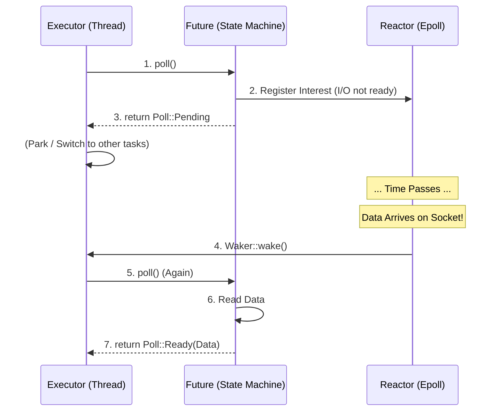
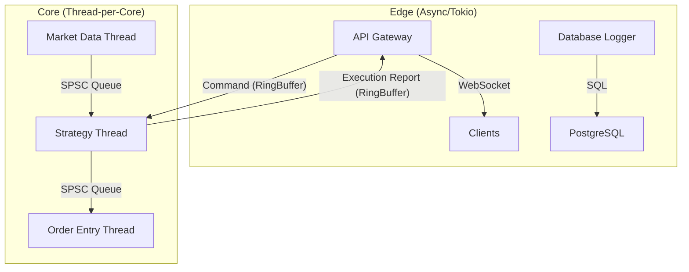

# Async Rust 原理与 Tokio (Async Rust & Tokio)

在上一章中，我们对比了 Thread-per-Core 和 Async 模型。尽管 HFT 的核心交易逻辑倾向于避免使用 `async`，但现代交易系统是一个复杂的异构体。网关 (Gateways)、WebSockets 行情接入、数据库日志归档等**非关键路径**组件，仍然大量依赖 Rust 强大的异步生态。

本章将深入剖析 Rust 的异步原理及 Tokio 运行时，帮助你在系统中做出正确的架构决策。

## 1. 异步原理：零成本抽象的真相

Rust 所说的“零成本抽象”更准确的含义是：`async/await` 会被编译成状态机，不要求语言自带 GC 或为每个任务维护可增长线程栈；你不用的抽象原则上不应付费。它**不等于零内存、零分配、零调度开销**。

Future 的大小通常在编译期确定，但它可能很大；Future 值放在栈、父 Future 内部还是堆上，取决于调用方式。`tokio::spawn` 还需要为可调度 task 保存头部、状态与 Future，通常会有运行时分配。

### 1.1 Future 与状态机 (State Machines)

当你编写一个 `async fn` 时，编译器会把它降低为一个实现 `Future` 的匿名状态机。把它想成枚举很有帮助，但**真实布局是编译器实现细节，不保证就是你能手写出来的某个 enum**。

#### 为什么是状态机？

编译器会在每个可能返回 `Poll::Pending` 的 `.await` 处记录“下次从哪里继续”。只有**在挂起后仍然活着**的局部变量和正在等待的子 Future 才需要成为状态机字段；在 `.await` 前已经不再使用并被销毁的临时值，无需一直保留。

下面是一个跨组件示例：它依赖 Tokio 的 `net`/`io-util` feature，以及项目自己的 `Order` 和 `parse_order`。这些依赖无法由 mdBook 的单文件测试补齐，因此代码块只展示状态机来源，不作为独立程序执行。

```rust,ignore
use std::io;
use tokio::io::AsyncReadExt;
use tokio::net::TcpStream;

// Order 与 parse_order 是业务类型/函数，此处省略定义。
async fn fetch_order() -> io::Result<Order> {
    let mut socket = TcpStream::connect("127.0.0.1:8080").await?;
    let mut buf = [0u8; 1024];
    let n = socket.read(&mut buf).await?;
    parse_order(&buf[..n])
}
```

直觉上，它大致经历这些状态：

| 状态 | 必须保存的内容 | 下一步 |
| :--- | :--- | :--- |
| Connecting | 连接子 Future | Pending，或得到 socket |
| Reading | socket、buf、读取子 Future 所需状态 | Pending，或得到字节数 |
| Done | 完成标记 | 返回结果；完成后不应再 poll |

读取子 Future 逻辑上会借用 `socket` 与 `buf`，而它们又在同一个外层 Future 中。这类“移动后内部引用可能失效”的状态，正是 `Pin` 出现的原因之一。手写一个同时存 `socket`、`buf` 和借用它们的 `ReadFuture` 的普通 enum 往往无法通过借用检查；不要把教学伪代码误当成真实可编译布局。

`Future` 的核心接口是：

```rust
trait Future {
    type Output;

    fn poll(
        self: std::pin::Pin<&mut Self>,
        cx: &mut std::task::Context<'_>,
    ) -> std::task::Poll<Self::Output>;
}
```

- `Poll::Ready(value)`：本次已经完成；
- `Poll::Pending`：暂时不能继续，并且负责让某个事件源在进展可能发生时调用当前 `Waker`；
- executor 不应该无缘无故反复 poll 一个 Pending Future，否则会变成空转。

**为什么 `poll` 里面要有个 `loop`？**

概念实现常用循环：如果连接子 Future 立即 `Ready`，外层可以在同一次 poll 继续推进读取，直到遇到真正的 `Pending` 或最终 `Ready`。这避免的是一次额外的 task 入队/再次 poll，**不一定是一次操作系统线程上下文切换**。

**关键推论**:
1. **大小可知，不代表大小很小**：状态机大小近似由各挂起状态的活跃字段、子 Future、判别状态和对齐共同决定，不能简单说“等于最大子 Future”；
2. **值放在哪里由使用方式决定**：直接 `.await` 常把子 Future 内联进父 Future，装箱或 `spawn` 则会放到堆上/任务分配中；
3. **缩短跨 await 生命周期很重要**：大缓冲区、不需要跨 await 的 guard 或 `Rc` 应尽早结束作用域，可同时减小 Future、避免 `!Send`。

### 1.2 `Pin`：保证被 poll 的 Future 不再随意搬家

`Pin<&mut F>` 可以理解为：“你仍能在规则允许的范围内修改 F，但若 F 是 `!Unpin`，不能把 F 整体 move 到新地址。”编译器生成的 async Future 通常不能假定是 `Unpin`。

常见两种固定方式：

- `Box::pin(future)`：把 Future 放到堆上，并固定其地址；
- `std::pin::pin!(future)`：把局部 Future 固定在当前栈帧的作用域内。

`Pin` 只提供地址稳定性约束，不会延长生命周期、不会让裸指针自动安全，也不会阻止 executor 在两次 poll 之间把**拥有这个已固定分配的 task**安排到不同 worker；跨核迁移和“移动 Future 自身的内存地址”是两件事。

### 1.3 组合状态机：洋葱模型

你可能会问：**“子 Future 也有自己的状态机吗？”**

是的。`TcpStream::connect` 返回的 `ConnectFuture` 内部也是一个状态机。
`FetchOrderFuture` 就像一个**洋葱**，它包裹着 `ConnectFuture`，而 `ConnectFuture` 可能包裹着更底层的 `IOFuture`。

当我们调用最外层的 `poll` 时，实际上发生了一次**递归调用链**：

1.  Executor 调用 `FetchOrderFuture::poll()`。
2.  `FetchOrderFuture` 发现自己正处于 `WaitingConnect` 状态，于是调用内部 `ConnectFuture::poll()`。
3. 连接 Future 若尚未就绪，会让 I/O 驱动记录 interest 与 Waker，然后返回 `Pending`。

在没有 `Box<dyn Future>` 等类型擦除时，组合出来的具体 Future 类型通常会把子 Future 状态内联为字段，编译器也可能内联 poll 调用。这省去了每个 await 点单独分配栈帧的需要，但外层 Future 仍需同时容纳该挂起点活着的外层局部变量和子 Future，组合过深或跨 await 保存大对象会明显增大 task。

#### HFT 视角分析

* **内存布局**：Future 是固定大小的值，但“固定”不等于“紧凑”。可以用 `size_of_val(&future)` 观察具体构建，布局本身不是稳定 ABI；
* **状态分支**：poll 需要判断当前状态，实际分支成本应通过 profile 判断；
* **调用方式**：具体类型之间的 poll 可以静态分发并被内联；executor 为统一调度 task 可能使用类型擦除。`Waker` 有自己的 vtable，但这不代表每次 Future::poll 都“通过 Waker 虚调用”。

### 1.4 Waker、Executor 与 Reactor

Rust 的异步模型是 **Reactor-Executor** 模式的典型实现，但初学者往往会混淆各个组件的角色。让我们用 HFT 的术语来重新解释：

*   **Future (任务)**: 相当于一个“回调函数”的容器。它包含了自己的状态（读到哪了、写了多少）。
*   **Executor (调度器)**: 相当于一个 `while loop`。它不断地从队列里取出 Future，调用它们的 `poll` 方法。
*   **Reactor (驱动器)**: 对 Linux `epoll`、BSD `kqueue`、Windows IOCP 等系统 I/O 机制进行抽象，负责跟踪事件就绪。
*   **Waker (唤醒器)**: 这是一个至关重要的**桥梁**。当 I/O 未就绪时，Future 会把 Waker 扔给 Reactor 说：“等有数据了，用这个叫醒我”。

**完整流程图解**:



**关键点**:
Rust 的 Future 是 **惰性 (Lazy)** 的。如果你只创建 Future，却没有 `.await`、交给 executor 或手动 poll，它通常不会取得进展。`async fn` 被调用时主要是在构造状态机，函数体从第一次 poll 才开始执行。

### 1.5 `Waker` 的成本来自哪里？

标准库的 `Waker` 由数据指针和 `RawWakerVTable` 描述，具体成本由 executor 实现决定，并不要求内部一定是 `Arc`。常见成本包括：

1. **间接调用**：wake/clone/drop 通过 vtable 到达具体 runtime；
2. **任务状态同步**：跨线程唤醒可能修改原子任务状态；
3. **重新入队**：若任务尚未在队列中，可能需要推入本地或远端调度队列；
4. **唤醒 worker**：空闲 worker 可能需要从 park 状态恢复。

runtime 通常会合并重复 wake，且同线程 fast path 可能很便宜，所以不能写成“每次 wake 必然一次 Arc clone + 全局锁”。忙轮询是否更合适，要看等待是否短且有专用核心；对不确定等待无限自旋会烧满 CPU、破坏系统公平性。

## 2. Tokio 运行时深度解析

Tokio 是 Rust 事实上的标准异步运行时。它包含两个核心组件：**Executor (调度器)** 和 **Reactor (驱动器)**。

### 2.1 多核调度原理：Task 与 Worker

你可能会问：**“既然 Future 只是个被动的状态机，它是怎么利用 64 核 CPU 的？”**

答案在于 **Executor**。Future 只是定义了“做什么”，Executor 决定“在哪做”。

* **Task (任务)**：`tokio::spawn(my_future)` 会把 Future 包装成可调度 task；
* **Worker (工人)**：多线程 runtime 使用一组系统线程，数量可配置，默认值也不应当作业务容量规划；
* **M:N 映射**：大量 task 复用较少 worker。worker 从运行队列取 task，每次 poll 推进一段。

**Send 约束的由来**:
多线程 worker 可能在两次 poll 之间迁移 task，因此 `tokio::spawn` 要求 Future 与输出满足相应的 `Send + 'static` 边界。更准确地说，是**整个 Future 状态必须是 Send**；一个 `!Send` 局部变量若在 `.await` 前已经销毁，不会让 Future 必然 `!Send`。

确实只需单线程时，可在 `LocalSet` 中用 `spawn_local` 运行 `!Send` Future。即使 runtime flavor 是 `current_thread`，`tokio::spawn` 这个通用 API 本身仍要求 `Send`，不要把“当前运行时只有一个线程”与函数签名混为一谈。

### 2.2 工作窃取调度器 (Work-Stealing Scheduler)

Tokio 的多线程运行时 (`rt-multi-thread`) 使用工作窃取算法：

* worker 有本地调度状态，也会处理注入队列中的任务；
* 空闲 worker 可以从其他 worker 窃取工作；
* 具体队列顺序、批量大小与公平策略是 runtime 实现细节，会随版本演进。

**HFT 的隐患**:

* **跨核迁移 (Migration)**：task 可在一次 poll 返回后由另一 worker 继续，热状态可能失去 L1/L2 局部性；
* **共享调度资源**：入队、窃取和 worker 唤醒需要同步；实际尾延迟必须在目标负载测量，不能固定成某个微秒数。

### 2.3 协作式调度与饥饿

Tokio 是**协作式 (Cooperative)** 的。如果一个 `async` 任务执行了密集的 CPU 计算而不 `await`，它将霸占线程，导致其他 I/O 任务（如心跳包处理）饿死。

```rust,edition2021
// 错误示范：在 async 中做计算
use std::time::{Duration, Instant};

async fn heavy_computation() {
    // 这会阻塞当前 worker 线程 100ms！
    // 导致同线程的其他 Future 无法被调度。
    let start = Instant::now();
    while start.elapsed() < Duration::from_millis(100) {
        std::hint::spin_loop();
    }
}
```

**解决方案**:

* 很短的循环可拆分并在合理边界 `yield_now().await`，但频繁 yield 也有调度成本；
* 短期阻塞调用可使用 `spawn_blocking`，同时设置并发上限；
* 持续 CPU 密集任务更适合有界专用线程池（如数据并行池），否则大量 `spawn_blocking` 也会排队和争抢 CPU。

## 3. HFT 系统中的混合架构 (Hybrid Architecture)

在 HFT 中，我们通常采用 **混合架构**：边缘用 Async，核心用 Sync。

### 3.1 架构图



### 3.2 适用场景指南

| 组件 | 推荐模型 | 原因 |
| :--- | :--- | :--- |
| **策略逻辑 (Strategy)** | **常见为 Thread-per-Core** | 单写者状态、缓存局部性和可控尾延迟优先。 |
| **行情解码 (Feed Handler)** | **按数据率选择专用线程/忙轮询** | 高数据率路径可能值得独占核心；低速源不必照搬。 |
| **订单发送 (Order Entry)** | **按延迟预算选择专用线程** | 关键发送路径常希望避免与无关 task 共享调度。 |
| **Web 监控台 (Dashboard)** | **Async (Tokio)** | 处理大量并发 WebSocket 连接，吞吐量优先。 |
| **历史数据落库** | **Async (Tokio)** | 磁盘 I/O 慢，不需要占用核心线程。 |
| **REST API 接口** | **Async (Tokio)** | HTTP 请求天然适合 Request-Response 模型。 |

## 4. 实战：在 HFT 中正确使用 Tokio

如果你必须在关键路径附近使用 Tokio，请遵循以下原则：

### 4.1 使用单线程运行时 (`current_thread`)

不要依赖宏的默认 flavor；显式配置单线程 runtime，并在需要时用操作系统 affinity 把承载它的线程绑定到非关键核心。

下面代码依赖 Tokio runtime 的 Cargo feature，并且线程亲和性还必须在运行时外部单独配置；mdBook 因而只展示构建方式，不执行它。

```rust,ignore
fn main() {
    let rt = tokio::runtime::Builder::new_current_thread() // 关键：单线程
        .enable_all()
        .build()
        .unwrap();

    rt.block_on(async {
        // Tokio task 不会在多个 runtime worker 之间迁移。
        // 但若未设置 affinity，操作系统仍可能迁移这个唯一的系统线程。
    });
}
```

### 4.2 不要把 Mutex guard 带过 `.await`

标准库 Mutex 会阻塞当前系统线程。若持有 guard 跨 `.await`，其他 task 可能在同一 worker 上等待这把锁，而持锁 task 又等不到继续执行，形成死锁或长时间阻塞；许多 guard 的 `!Send` 约束也会直接让 `tokio::spawn` 拒绝编译。

选择不是简单的“std Mutex 坏、Tokio Mutex 好”：

* 临界区很短且**不会跨 await** 时，`std::sync::Mutex` 可能更轻；
* guard 确实必须跨 await 时，使用 async-aware Mutex，并审视为何需要持锁等待 I/O；
* 更优先考虑消息传递或单写者 task，消除共享锁。

### 4.3 预分配与零拷贝

Tokio 的 I/O 接口 (`AsyncRead`, `AsyncWrite`) 通常需要缓冲区。避免在循环中反复 `vec![0; 1024]`。

下面是 **协议读取循环骨架**：它需要 `bytes::BytesMut`、Tokio 的异步读扩展、具体 `stream`，以及项目自己的拆帧和处理函数。由于这些跨模块依赖被有意省略，mdBook 不执行该片段。

```rust,ignore
// 推荐：复用缓冲区
let mut buf = BytesMut::with_capacity(4096);
loop {
    let n = stream.read_buf(&mut buf).await?;
    if n == 0 {
        break; // EOF
    }

    // TCP 没有消息边界：只取走已经完整的帧，半包继续留在 buf 中。
    while let Some(frame_len) = complete_frame_len(&buf) {
        let frame = buf.split_to(frame_len);
        process_frame(&frame)?;
    }
}
```

`clear()` 会保留容量，但也会丢弃当前逻辑长度。只有确认缓冲区中的字节全部消费完时才能 clear；协议解析必须正确处理半包、粘包、长度上限和恶意长度字段。

## 5. 面试快问快答

### Q1：调用 `async fn` 时，函数体是否立即执行？

通常不会。调用主要构造 Future，函数体从 Future 第一次被 poll 时开始推进；Future 若从未被 await/spawn/poll，就不会自行取得进展。

### Q2：`Waker::wake()` 是否直接执行 Future？

通常不是。wake 表示“这个 task 现在值得再次 poll”，runtime 会把它标记为就绪并安排入队；真正执行仍发生在某个 worker 后续调用 poll 时。

### Q3：为什么 Future::poll 接收 `Pin<&mut Self>`？

挂起状态可能依赖地址稳定性。Pin 让 `!Unpin` Future 在被 poll 后不能通过安全代码整体 move，从而保护编译器生成状态中的内部引用关系。

### Q4：单线程 Tokio 是否等于低延迟 thread-per-core？

不等于。它能移除 worker 间迁移，但仍有 task 调度、Waker、I/O driver 和协作式饥饿；承载 runtime 的系统线程还需单独设置 affinity。是否满足目标只能用尾延迟测量回答。

## 6. 本章小结

- Async Rust 用固定大小状态机表达暂停与恢复，但固定大小不代表小，也不代表没有分配；
- `Pin` 保护地址稳定性，`Waker` 只负责通知“值得再 poll”；
- 多线程 Tokio 的 task 可能在 poll 之间迁移，`Send` 约束来自这一可能性；
- HFT 常把 Async 放在 I/O 密集边缘、把单写者 thread-per-core 放在关键数据面，但最终边界由延迟预算和实测决定。

权威参考：[标准库 `Future` 文档](https://doc.rust-lang.org/std/future/trait.Future.html)、[标准库 `Waker` 文档](https://doc.rust-lang.org/std/task/struct.Waker.html) 与 [Tokio Runtime 文档](https://docs.rs/tokio/latest/tokio/runtime/)。
