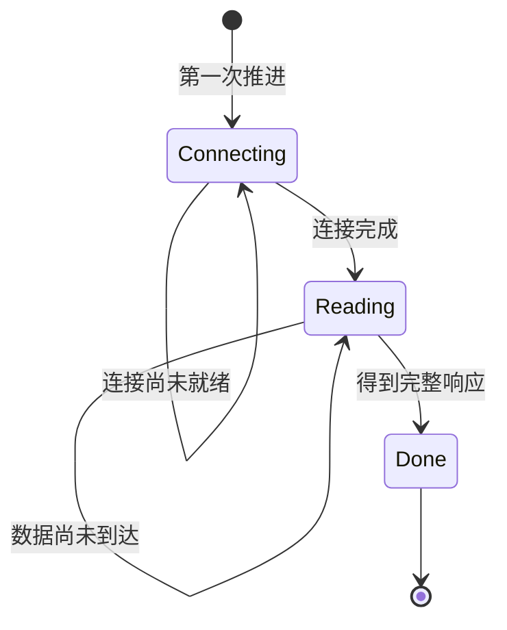
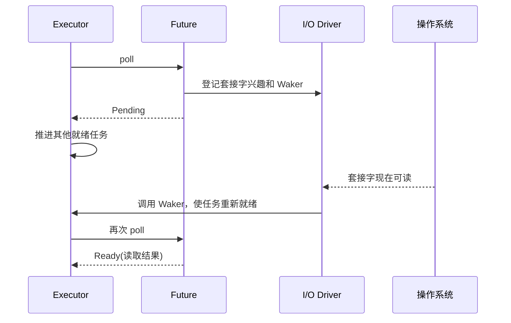
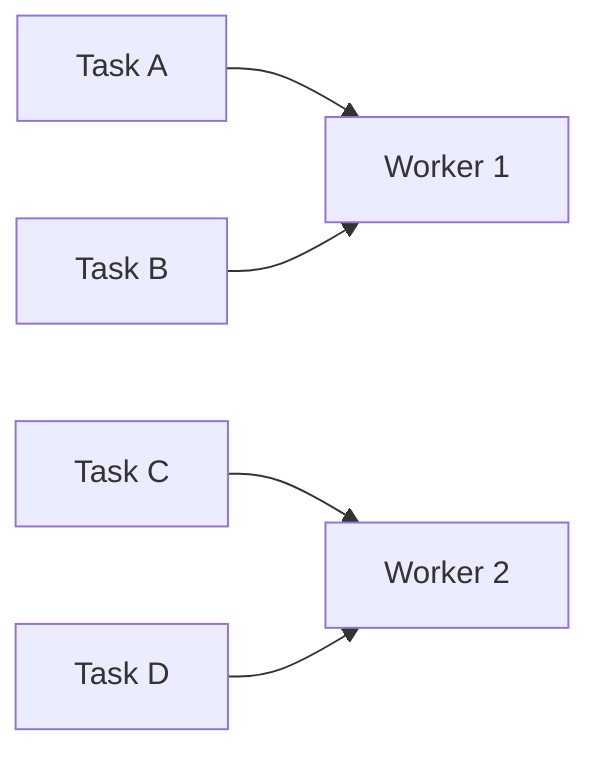
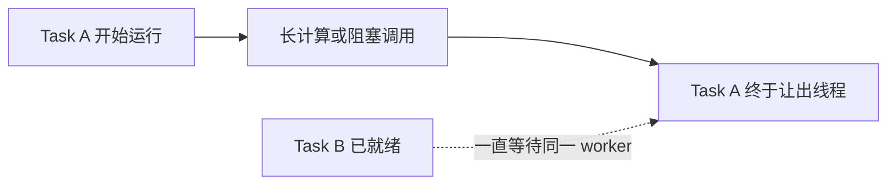

# Async Rust：Future、Executor 与 Waker

许多程序的大部分时间不是在计算，而是在等待：等待网络返回数据、等待定时器到期、等待数据库响应。若每个等待中的任务都长期占用一个系统线程，线程数量、内存和调度成本会随着并发量增长。

**异步编程**（asynchronous programming）提供另一种组织方式：任务遇到暂时无法完成的操作时，保存当前进度并让出执行线程；条件满足后，调度器再继续推进它。

Rust 用 `Future` 表示这类“现在可能不能完成、以后可以继续”的计算，用 `async/.await` 提供接近顺序代码的写法。它们要共同解决三个机制问题：Future 怎样保存并恢复进度，运行时怎样得知某个等待条件已经就绪，以及一个阻塞调用为什么会占住本可推进其他任务的执行线程。

## 1. 阻塞与异步有什么区别

**阻塞调用**在结果出现前不会返回。线程执行阻塞网络读取时，如果当前没有数据，这个线程就不能继续处理后面的代码。

```text
线程 A：发送请求 ───── 等待响应 ───── 解析响应
线程 B：                处理其他工作
```

阻塞并不是错误。少量连接、简单工具和每个任务都需要独立线程的程序，使用阻塞代码通常更容易理解。问题出现在大量任务都长期等待同类事件时：为每个任务准备一个线程可能消耗很多线程栈，也会增加调度管理成本。

异步任务在等待时把线程还给运行时：

```text
任务 A：发送请求 ── 挂起 ───────────────── 恢复并解析
执行线程：运行 A ── 运行 B ── 运行 C ───── 再次运行 A
```

这里的“挂起”只暂停当前任务，不要求暂停承载它的系统线程。线程可以继续推进其他已经就绪的任务。

### 1.1 异步不等于并行

异步主要解决**等待期间怎样复用线程**。它不表示多个 CPU 计算一定同时发生。单线程异步运行时可以并发处理大量等待型任务，却仍然只能在同一时刻执行一个任务的普通代码。

要让 CPU 密集计算并行，仍需要多个系统线程或其他计算设备。并发、并行与线程的基础概念见上一章[并发基础](concurrency.md)。

## 2. `async fn` 返回 Future

普通函数调用时会立即开始执行函数体，并在返回前占用当前调用栈。`async fn` 的调用主要创建一个 **Future**；Future 被 `.await`、交给运行时或手动轮询后，函数体才开始取得进展。

```rust,edition2021
async fn answer() -> u32 {
    42
}

fn create_future() {
    let future = answer();
    // 这里只创建了 Future。没有 await 或执行器，它不会自行完成。
    drop(future);
}
```

Future 可以理解为一个保存以下信息的对象：

- 当前执行到了哪个步骤；
- 挂起后还要继续使用哪些局部变量；
- 当前正在等待哪个子 Future。

编译器会把 `async fn` 转换成类似**状态机**的结构。状态机是“根据当前状态决定下一步”的对象。例如，一个请求任务可能依次处于连接中、读取中和已完成状态。



`.await` 的作用是推进子 Future：如果子 Future 已完成，就取得结果并继续；如果尚未完成，当前 Future 保存进度并把控制权还给执行器。

只有跨越 `.await` 后仍然需要的局部变量，才必须保存在状态机中。因此，大缓冲区、锁 guard 或其他资源是否跨越 `.await`，会影响 Future 的大小和行为。

## 3. `poll`：执行器怎样推进 Future

Future 不会自己运行。执行器通过 `poll` 方法询问它：“现在能继续到什么程度？”结果只有两类：

- `Poll::Ready(value)`：计算已经完成，并给出结果；
- `Poll::Pending`：现在无法继续，需要以后再次 `poll`。

标准库接口的核心形状如下：

```rust,ignore
trait Future {
    type Output;

    fn poll(
        self: std::pin::Pin<&mut Self>,
        cx: &mut std::task::Context<'_>,
    ) -> std::task::Poll<Self::Output>;
}
```

初学阶段不需要手写 Future，但需要理解两个参数为什么存在：

- `Context` 提供当前任务的 Waker，让 Future 能登记“以后怎样通知我”；
- `Pin` 限制某些 Future 在开始执行后被随意搬到新地址，因为编译器生成的状态可能依赖地址稳定性。

`Pin` 不是线程绑定，也不会阻止运行时把同一个任务安排到另一条工作线程。它约束的是 Future 值在内存中的移动。

一个 Future 返回 `Pending` 前，必须安排某种唤醒方式。否则执行器不知道何时再来轮询，它可能永远没有进展。执行器也不应该不断轮询一个没有新事件的 Pending Future，否则会浪费 CPU。

## 4. Executor、I/O Driver 与 Waker

Rust 标准库定义了 Future 的接口，但没有规定完整的异步运行时。Tokio 等运行时通常包含下面几个角色：

- **Task（任务）**：被运行时管理的 Future，以及调度所需的状态；
- **Executor（执行器）**：从就绪队列中取任务并调用 `poll`；
- **I/O Driver（I/O 驱动器）**：借助操作系统接口观察套接字、定时器等事件；
- **Waker（唤醒器）**：事件就绪时通知执行器“这个任务值得再次 poll”。

有些资料把 I/O driver 称为 **reactor**。名字可以不同，职责相同：它负责观察外部事件，executor 负责执行任务代码。

下面是一条网络读取的完整因果链：



`wake` 通常不会在调用点直接执行 Future。它表示任务可能取得新进展，运行时会把任务标记为就绪并安排后续 `poll`。这样可以合并重复通知，并让执行器统一决定运行顺序。

## 5. Task 怎样复用系统线程

异步运行时通常让大量 task 复用较少的系统线程，这种关系常写作 **M:N 调度**：M 个任务由 N 条工作线程推进。



一条工作线程每次只执行某个 task 的一段代码。task 在 `.await` 处返回 Pending 后，工作线程才能去执行其他 task。这种由任务主动让出执行权的方式叫作**协作式调度**。

多线程运行时可能在两次 `poll` 之间把 task 安排到不同 worker。正因为存在这种可能，Tokio 的通用 `spawn` API 通常要求 Future 满足 `Send`：Future 保存的状态可以安全地在线程之间转移。

`Send` 检查的是整个 Future 状态。如果一个不能跨线程传递的局部值在 `.await` 之前已经销毁，它就不需要成为挂起状态的一部分。若确实要运行 `!Send` Future，可以使用运行时提供的本地任务机制，但那是明确选择单线程执行范围，而不是关闭类型安全。

## 6. 最重要的工程边界：不要阻塞 worker

协作式调度有一个直接后果：一个 task 在返回 Pending 或 Ready 之前，会一直占用当前 worker。如果它执行很长的 CPU 计算，或调用长时间阻塞的系统接口，同一 worker 上的其他 task 就无法取得进展。



这叫作**阻塞异步运行时的工作线程**。常见处理方式如下：

| 工作类型 | 常见处理方式 | 原因 |
| :--- | :--- | :--- |
| 很短的普通计算 | 直接执行 | 切换到别处的成本可能更高 |
| 可拆分的长 CPU 计算 | 有界计算线程池或数据并行库 | 真正利用多核，并限制同时计算的数量 |
| 没有异步接口的短期阻塞调用 | 运行时的 blocking 线程池 | 避免阻塞负责 I/O task 的 worker |
| 长期存在的阻塞循环 | 专用线程 | 生命周期和资源预算更明确 |
| 异步网络或定时器 | 正常 `.await` | 未就绪时可以登记唤醒并让出 worker |

Tokio 提供 `spawn_blocking` 把阻塞工作移到专门的线程池，但它不是无限容量。若请求不断创建阻塞任务，队列仍会增长，所以还需要并发上限和背压。

### 6.1 为什么不能持有普通锁跨越 `.await`

假设 task A 持有 `std::sync::Mutex` 的 guard，然后在网络操作上 `.await`。A 挂起期间锁仍未释放；task B 若在同一 worker 上尝试获取这把锁，系统线程会被阻塞。此时即使 A 的网络事件已经就绪，worker 也可能无法重新推进 A。

更稳妥的顺序是：

1. 加锁并读取或修改必要状态；
2. 在 `.await` 前让 guard 离开作用域；
3. 再执行异步 I/O。

异步 Mutex 允许等待锁的 task 让出 worker，但“持锁等待外部 I/O”仍会扩大临界区。能否改成消息传递或单拥有者 task，通常比简单换锁更值得先思考。

## 7. 取消、超时与背压

真实异步任务不能假设所有操作都会成功完成。连接可能断开，调用方可能取消请求，下游也可能一直不返回。

**超时**为等待设置时间上限。超时结束后，调用方停止继续等待，但这不保证远端操作已经回滚。例如数据库请求超时后，服务器端可能仍然完成了写入。因此，重试前还要考虑操作是否幂等，以及怎样查询最终状态。

**取消**通常通过丢弃 Future 或发送取消信号实现。Future 被丢弃后不会再被 poll，但已经产生的外部副作用不会自动撤销。实现可取消任务时，需要确保资源能在 Drop 或明确清理流程中释放。

**背压**限制新任务进入速度。如果服务接收请求的速度长期高于数据库、模型或其他下游的处理速度，即使每个操作都是异步的，等待队列仍会不断增长。异步提高了等待时的线程利用率，不会创造无限下游容量。

## 8. 什么时候使用异步

异步通常适合：

- 同时维护大量网络连接；
- 一个任务包含多次网络、定时器或其他可异步等待；
- 希望在等待期间用较少线程推进其他请求；
- 使用的库和协议已经提供成熟异步接口。

异步不一定适合：

- 程序连接很少，阻塞代码已经足够简单；
- 核心工作几乎全是 CPU 计算；
- 依赖库只有阻塞接口，且调用持续时间很长；
- 任务需要独占线程或严格控制其执行位置。

一个系统可以同时使用多种模型。例如，异步网络层接收请求，有界队列限制并发，再由计算线程池完成压缩、推理前处理或复杂计算。

## 9. 三类系统怎样使用异步机制

- **传统互联网服务**常用异步处理 HTTP、RPC、数据库连接和定时任务，同时用容量限制保护下游；
- **AI Infra** 常用异步接收推理请求和拉取对象存储数据，再把批处理或 CPU 密集预处理交给受控线程池；
- **HFT** 可能在管理接口和普通网络服务使用异步，而让需要固定执行位置的数据处理阶段运行在专用线程。

工作窃取队列、Waker 的内部数据结构和某个 Tokio 版本的调度参数属于运行时实现细节。基础面试更重要的是讲清 Pending 怎样被唤醒、协作式调度为何怕阻塞，以及异步为什么不能替代 CPU 并行。

## 10. 本章小结

- 异步让等待中的任务保存进度并让出线程，主要解决大量等待任务的线程复用；
- `async fn` 返回惰性的 Future，Future 需要被 poll 才会取得进展；
- `poll` 返回 Ready 或 Pending，Pending 前必须安排后续唤醒；
- executor 推进 task，I/O driver 观察外部事件，Waker 把就绪事件连接回调度队列；
- task 采用协作式调度，长计算和阻塞调用会拖住同一 worker；
- 超时和取消不会自动撤销外部副作用，异步也不会替代背压和容量规划。

## 做题方法

异步代码题把每个 Future 画成显式状态机，每次 `poll` 填一行：

| 当前状态 | 本次检查的条件 | 返回值 | 必须保存的状态 | 谁会再次唤醒 |
|---|---|---|---|---|
| 等待读就绪 | fd 未就绪 | `Pending` | fd、缓冲区、进度 | I/O driver 注册的 waker |
| 数据就绪 | 读取完成 | `Ready(n)` | 无 | 不再唤醒 |

推演步骤如下：

1. 找出每个 `.await`，把函数切成若干状态；跨越 `.await` 仍需使用的局部变量会成为 Future 的持久字段。
2. 对每个 `Pending` 路径确认已经保存足够状态，并安排了未来的 `wake`；否则执行器没有理由再次 `poll`。
3. `poll` 可能被调用多次，所以检查已完成步骤是否会重复产生副作用；完成后也要遵守具体 Future 的再次 poll 契约。
4. 检查 `.await` 期间持有的 guard、借用和非 `Send` 值，判断 Future 是否能在线程间移动以及是否阻塞执行器 worker。
5. 取消题在每个 suspension point 假设 Future 被 `drop`，列出尚未完成的外部副作用、需要释放的资源和一致性恢复方式。
6. 并发度题区分“同时挂起的任务数”和“实际并行执行的线程数”，再检查队列容量与背压传播。

验算点是：每个 `Pending` 都有唤醒来源，每个状态都有唯一可解释的下一步，任意取消点都不会遗留违反业务不变量的半成品。

## 11. 思考题与面试追问

1. 调用 `async fn` 后，函数体为什么不一定立即执行？
2. `Poll::Pending` 与“执行失败”有什么区别？
3. Waker 被调用后，为什么通常不是直接执行 Future？
4. `.await` 暂停的是整个系统线程，还是当前 task？
5. 异步为什么适合大量网络等待，却不会自动加速 CPU 密集计算？
6. 在 async 函数中持有普通 Mutex guard 跨越 `.await`，可能出现什么问题？
7. 一个 HTTP 请求在客户端超时后，为什么不能直接断言服务端没有执行写操作？
8. 如果异步服务的下游处理能力不足，为什么仍然需要有界队列和背压？

### 参考答案与解答

<details><summary>展开答案</summary>

1. 调用 `async fn` 只创建保存参数和状态的 Future；执行器第一次 `poll` 时才推进函数体。若 Future 从未 poll，它通常不会开始内部工作。
2. `Pending` 表示当前缺少条件但已安排被唤醒后重试，不是错误；失败通常由 `Ready(Err(e))` 等输出表达。状态表为 `未就绪→Pending→唤醒→再次 poll`。
3. `wake` 通常只把 task 标为 runnable/放回执行队列；由执行器选择合适 worker 再 poll。直接在中断/任意线程中执行 Future 会破坏调度、栈和公平性边界。
4. `.await` 在 Pending 时暂停当前 task，把线程还给执行器运行其他 task；只有 task 内执行阻塞调用或占用 CPU 不让出时，才会卡住该 worker 线程。
5. 网络等待期间 task 不占一线程，可提高并发；CPU 密集计算本身没有等待可隐藏，仍受核心数和计算量限制，应限并行或交给专用线程池。
6. guard 跨 await 会让锁在任意长等待中保持，其他 task 阻塞；若同一单线程执行器上的另一个 task 需要该锁才能唤醒当前任务，还可能死锁。所有权轨迹应在 await 前 drop guard。
7. 客户端 timeout 只说明未及时收到响应；服务端可能已写入但回复丢失。把结果记为 UNKNOWN，用稳定幂等键查询事实源，对账后才决定重试。
8. 无界队列把过载变成内存增长和越来越长的等待，不能提高消费者速率。有界队列定义容量；满时阻塞、拒绝或降级，把压力反馈给上游并保护资源上限。

</details>

延伸阅读：[标准库 `Future` 文档](https://doc.rust-lang.org/std/future/trait.Future.html)、[标准库 `Waker` 文档](https://doc.rust-lang.org/std/task/struct.Waker.html)与 [Tokio Runtime 文档](https://docs.rs/tokio/latest/tokio/runtime/)。
