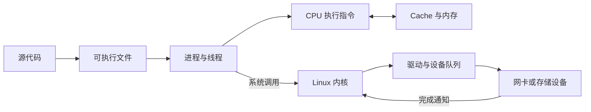

# 一次程序怎样在计算机里运行

> **面试优先级：P0。** 本章只建立全景，不重复后续专章。读完后，你应该能说明“代码怎样变成 CPU 正在执行的指令”，并知道遇到内存、调度或 I/O 问题时该去哪里继续学习。

刚开始学系统时，`CPU`、内存、进程、内核、网卡和磁盘很容易变成一串互不相干的名词。先用一个普通例子把它们连起来：程序收到一条网络消息，更新内存中的状态，再把一条日志写入文件。计算机不会一步完成这件事，而是让不同层各自完成一部分工作。

## 1. 从源代码到正在运行的进程

源代码是给人阅读的文本，CPU 不能直接执行它。以 Rust 为例，程序启动前后会经历下面几步：

1. **编译器**把 Rust 源代码翻译成目标机器能够执行的机器指令。
2. **链接器**把程序和所需的库组合成可执行文件。
3. 用户从终端或服务管理器发出启动请求，操作系统创建一个**进程**。进程是程序运行时使用内存、文件和权限的资源边界。
4. **加载器**把可执行文件的代码和数据映射进进程的虚拟地址空间，并准备栈、动态库和程序入口。
5. 操作系统的调度器把进程中的某个**线程**安排到一个逻辑 CPU 上，CPU 才开始执行机器指令。线程是能被调度执行的一条指令流。

“程序”通常指磁盘上的代码和静态数据，“进程”指它的一次运行实例。同一个可执行文件可以同时启动多个进程；它们执行相同代码，却有各自的地址空间和文件描述符。

进程、线程和程序启动的细节由[进程、线程与文件描述符](processes_fds.md)主讲。

## 2. CPU 执行什么，内存保存什么

CPU 反复取得、解释并执行机器指令。指令会读取寄存器、进行计算、访问内存或改变下一条指令的位置。现代 CPU 会并行和乱序处理多条指令，但初学时先记住一个稳定关系：**CPU 负责计算，内存保存正在使用的代码和数据。**

CPU 访问主内存比做简单算术慢得多，因此处理器旁边有多级 **Cache（高速缓存）**，用来保存最近使用的数据副本。程序连续访问相邻数据时更容易命中 Cache；随机追逐分散的指针时更容易等待主内存。Cache、流水线和分支预测由 [CPU 微架构](cpu_arch.md)主讲，数据排列方式由[内存布局与缓存效率](memory_layout.md)主讲。

程序使用的是**虚拟地址**，不是可以随意访问的物理内存地址。CPU 的内存管理硬件根据操作系统维护的页表完成地址翻译。如果映射尚未建立，CPU 会触发缺页异常，让内核判断是分配页面、读取文件页面，还是拒绝非法访问。完整因果链见[虚拟内存](virtual_memory.md)。

## 3. 为什么还需要操作系统内核

普通程序运行在**用户态**。用户态是一种受限制的执行权限，它防止程序直接修改页表、设备寄存器或其他进程的内存。Linux 的核心部分叫**内核**；内核拥有更高权限，负责隔离进程、调度 CPU、管理内存，并为文件系统、网络和设备提供共同接口。

程序需要内核服务时会发起**系统调用**。系统调用是用户程序进入内核的受控入口，例如 `read`、`write` 和 `send`。CPU 会切换执行权限，内核校验参数并完成相应工作，然后返回用户态。

权限切换不等于线程切换。如果系统调用马上完成，同一个线程可以直接返回继续执行；只有线程需要等待或被抢占时，调度器才可能改为运行另一个线程。操作系统如何影响尾延迟，由[操作系统原理](os_internals.md)统一导航。

## 4. I/O 为什么还会经过设备和队列

**I/O（Input/Output，输入输出）**表示程序与外部对象交换数据，例如收网络包、读文件或写磁盘。内核先通过文件系统或网络栈处理通用语义，再把设备相关工作交给驱动。驱动是内核中控制具体硬件的软件。

一次 I/O 可以简化成下面的路径：

队列的存在意味着“工作已提交”和“工作已完成”是两个时刻。设备可以通过 **DMA（Direct Memory Access，直接内存访问）**在内存与设备之间传输数据，而不要求 CPU 逐字节搬运；CPU 仍要准备请求、处理完成和运行协议逻辑。一次普通文件 `write` 怎样跨过这些层，见[一次文件写入](file_write_path.md)。

## 5. 一条请求的完整主线

现在回到开头的例子：程序收到网络消息、更新状态并写日志。

1. 网卡收到数据，驱动和内核网络栈处理它，再让等待的线程变为可运行。
2. 调度器把线程安排到逻辑 CPU。CPU 执行解析和业务计算的机器指令。
3. CPU 读取内存中的状态；数据是否在 Cache 中会影响等待时间。
4. 程序调用 `write` 写日志，CPU 从用户态进入内核态。
5. 内核先把数据接收到文件页缓存，普通 `write` 通常就能返回。
6. 稍后，内核把脏数据经文件系统、块层和驱动提交给存储设备；若程序需要断电后的持久性，还必须使用相应的同步协议。

这条主线解释了为什么“这一行代码慢”未必只与这一行的计算有关。线程可能在等 CPU、等缺页处理、等锁、等队列空间或等设备完成。

## 6. 面试时怎样定位层次

当面试官问“为什么程序慢”时，先补齐场景，再沿层次提出假设：

| 现象 | 先问什么 | 对应专章 |
|---|---|---|
| 计算循环变慢 | 数据是否命中 Cache，是否有分支失败或依赖停顿？ | [CPU 微架构](cpu_arch.md) |
| 内存首次访问出现尖刺 | 是否发生缺页、回收或远端 NUMA 访问？ | [虚拟内存](virtual_memory.md) |
| 线程没有运行 | 它在等待 CPU、锁、定时器还是 I/O？ | [操作系统原理](os_internals.md) |
| 多线程结果错误或卡住 | 是否存在数据竞争、死锁或错误的同步关系？ | [并发模型](concurrency.md) |
| `write` 很快但重启后数据丢失 | 返回点是否只到页缓存，是否执行了正确的同步？ | [一次文件写入](file_write_path.md) |
| 网络尾延迟升高 | 排队发生在应用、内核、网卡还是对端？ | [网络基础](../network/basics.md) |

不要用一个指标替代因果链。例如，CPU 利用率只有 50% 不代表还有一半容量：程序可能被一个锁串行化，也可能正在等内存或 I/O。正确做法是先限定工作负载和完成标准，再让计数器、跟踪记录和对照实验支持或否定假设。

## 7. 30 秒面试答案

> 源代码先被编译和链接成可执行文件。程序启动后，加载器把代码和数据映射进进程地址空间，调度器再把线程安排到逻辑 CPU 执行。CPU 通过 Cache 和主内存取得数据；需要文件、网络或进程管理时，线程用系统调用从用户态进入 Linux 内核。内核经过文件系统、网络栈和驱动把 I/O 放入设备队列，设备完成后再用中断或轮询反馈结果。排障时我会先判断时间花在计算、内存、调度还是 I/O，再用对应证据验证，而不是只看平均 CPU 利用率。

## 8. 自测与小结

1. 为什么可执行文件和进程不是同一个概念？
2. 系统调用为什么不一定伴随线程上下文切换？
3. DMA 减少了哪类工作，哪些工作仍由 CPU 和内核完成？
4. 画出从业务代码到存储设备的最短分层图，并标出普通 `write` 可能返回的位置。

本章只回答“各层怎样连起来”。后续章节分别主讲 CPU、进程、虚拟内存、操作系统干扰和文件写入；遇到陌生概念时，先回到当前问题所处的层，再进入对应专章。
