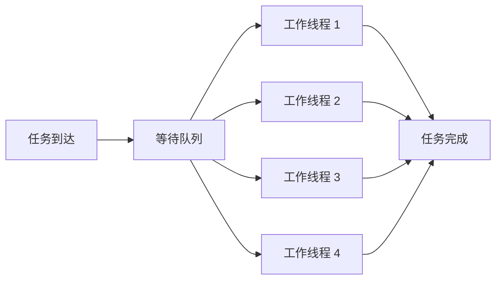
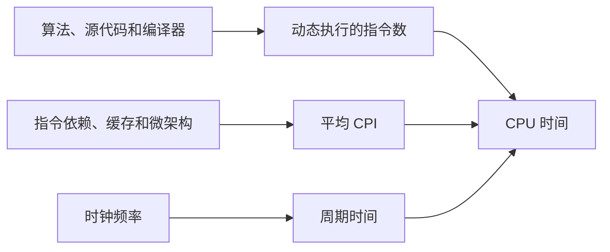
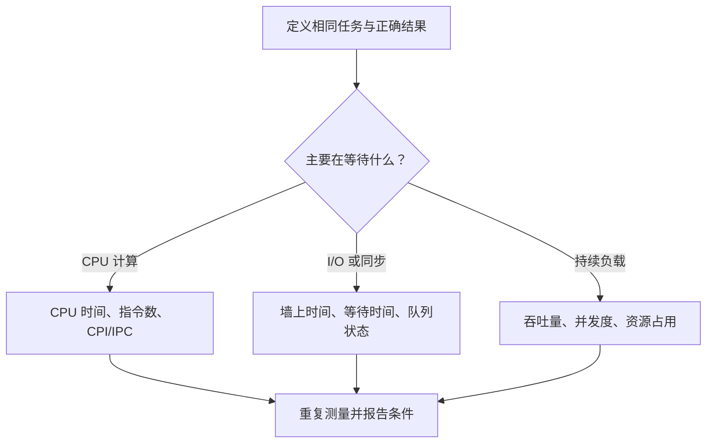

# 计算机性能：时间、吞吐量与加速比

同一段程序换到一台主频更高的机器上，不一定更快；一台服务器每秒能处理更多请求，也不代表每个请求完成得更早。出现这些反直觉现象，是因为“性能”不是一个单独的数字。

性能分析先区分响应时间与吞吐量，再用指令数、CPI 和时钟周期解释 CPU 时间，最后检查两组基准是否完成了相同工作、采用了相同测量边界。

## 1. 先说明“完成了什么工作”

性能比较必须先固定工作。下面三项缺一不可：

1. **任务是什么**：例如压缩同一个文件、编译同一份代码，或处理同一批请求；
2. **正确结果是什么**：不能通过少算、降低精度或丢请求获得“加速”；
3. **完成边界在哪里**：只算 CPU 计算，还是包括读盘、网络和结果持久化。

如果两次测试完成的工作不同，两个耗时数字就不能直接比较。例如，一个程序只把数据写进用户态缓冲区，另一个程序等待数据持久化到存储设备，即使函数都叫“保存”，它们完成的工作也不同。

## 2. 响应时间与吞吐量

在计算机性能语境中，**响应时间（response time）**表示一项任务从开始到完成所经过的时间，也常称单任务延迟。它回答：

> 一个请求从开始到结束，等了多久？

术语必须跟语境一起读：操作系统调度题通常把“响应时间”专门定义为“任务到达后，直到第一次得到 CPU 的时间”，而把直到全部完成的时间称为“周转时间”。本章讨论整项工作的开始到完成；调度指标的定义见 [CPU 调度](cpu_scheduling.md)。

**吞吐量（throughput）**表示单位时间内完成多少任务。它回答：

> 整个系统一秒能完成多少个请求？

假设一个图片服务原来只有一个工作线程，每张图片处理 100 ms。增加到四个工作线程后，如果四张图片能够同时处理，系统吞吐量可能接近原来的四倍；但单张图片仍然需要约 100 ms。此时吞吐量提高了，单次响应时间没有按相同比例缩短。



两者也会互相影响。到达速度持续超过处理速度时，请求会在队列中堆积，响应时间随之增加。因此报告性能时至少要说明测量的是单任务完成时间，还是稳定负载下的系统吞吐量。

## 3. 墙上时间与 CPU 时间

程序从启动到结束，现实世界经过的时间称为**墙上时间（wall-clock time）**。它包含程序实际使用 CPU 的时间，也包含等待文件、网络、锁、调度和其他资源的时间。

**CPU 时间（CPU time）**只统计 CPU 用来执行该程序指令的时间。多线程程序还要说明统计的是单个线程、单个进程，还是所有工作线程的 CPU 时间之和。

```text
墙上时间
├── 在 CPU 上执行
├── 等待被调度
├── 等待文件或网络 I/O
├── 等待锁、条件变量或其他线程
└── 其他运行环境造成的等待
```

这两个指标回答的问题不同：

- 终端用户通常关心墙上时间，因为等待也是真实体验的一部分；
- 分析纯计算代码时，CPU 时间更容易连接到指令数和处理器执行模型；
- CPU 时间下降但墙上时间不变，可能说明瓶颈在 I/O、排队或同步，而不在计算。

## 4. 时钟周期与主频

处理器用时钟协调内部工作。一次时钟跳动称为一个**时钟周期（clock cycle）**。主频表示每秒包含多少个周期：

```text
频率 = 每秒周期数
周期时间 = 1 / 频率
```

例如，3 GHz 表示每秒 30 亿个周期。一个周期的时间是：

```text
1 / (3 × 10^9) 秒 ≈ 0.333 纳秒
```

这不表示“一条指令固定需要 0.333 ns”。一条指令可能跨越多个内部阶段，多条独立指令也可能在同一周期重叠推进。主频只告诉我们周期有多短，不能单独决定程序完成时间。

## 5. CPU 时间公式

分析一段 CPU 计算时，最重要的基础公式是：

```text
CPU 时间 = 指令数 × 平均 CPI × 时钟周期时间

也可以写成：

CPU 时间 = 指令数 × 平均 CPI / 时钟频率
```

三个因素分别表示：

- **指令数（instruction count）**：完成这项工作实际执行了多少条机器指令；
- **CPI（Cycles Per Instruction）**：平均每条指令消耗多少个时钟周期；
- **时钟周期时间**：一个周期持续多久。



这里说的是**动态指令数**，即程序运行时真正执行的指令次数。可执行文件中有一千条不同指令，不代表循环运行一百万次时只执行一千条。

### 5.1 完整算例

某程序执行了 12 亿条指令，平均 CPI 为 1.5，CPU 主频为 3 GHz：

```text
总周期数 = 1.2 × 10^9 × 1.5
         = 1.8 × 10^9 周期

CPU 时间 = 1.8 × 10^9 / (3 × 10^9)
         = 0.6 秒
```

如果只把主频从 3 GHz 提高到 3.6 GHz，并假设指令数和 CPI 都不变：

```text
CPU 时间 = 1.8 × 10^9 / (3.6 × 10^9)
         = 0.5 秒
```

真实机器上，升频可能改变功耗、温度和持续频率，换处理器也可能同时改变 CPI，所以“其他因素不变”是计算题的前提，不是对真实硬件的默认保证。

## 6. CPI、IPC 与指令混合

**CPI** 是平均每条指令使用的周期数。它不是某个 CPU 永远不变的属性。同一处理器运行不同程序时，指令依赖、分支预测、缓存未命中和执行单元争用都会改变平均 CPI。

**IPC（Instructions Per Cycle）**表示平均每周期完成多少条指令：

```text
IPC = 指令数 / 总周期数
CPI = 总周期数 / 指令数
```

对同一段统计区间，IPC 与 CPI 互为倒数。例如 CPI 为 0.5 时，IPC 为 2，表示平均每周期完成两条指令。CPI 可以小于 1，因为现代处理器可以让多条独立指令重叠执行；这不表示单条指令的全部内部步骤只用了半个周期。

程序通常包含多类指令。整体 CPI 要按各类指令实际出现的比例加权，不能直接对各类 CPI 求普通平均数。

假设一段程序包含：

| 指令类型 | 占比 | 该类平均 CPI |
|---|---:|---:|
| 整数计算 | 50% | 1 |
| 访存 | 30% | 2 |
| 分支 | 20% | 3 |

整体平均 CPI 为：

```text
0.5 × 1 + 0.3 × 2 + 0.2 × 3 = 1.7
```

这张表是教学模型。真实处理器会重叠执行不同指令，硬件计数器报告的周期和指令还要结合测量口径解释。

## 7. 加速比与“提高百分之多少”

如果改进前完成时间为 `T_old`，改进后为 `T_new`，加速比是：

```text
Speedup = T_old / T_new
```

例如，程序从 10 秒缩短到 4 秒：

```text
Speedup = 10 / 4 = 2.5
```

因此新程序是原来的 2.5 倍快，完成时间减少了：

```text
(10 - 4) / 10 = 60%
```

“加速 2.5 倍”和“时间减少 60%”是两个不同表达，不要把它们混成“性能提高 250%”。最稳妥的报告方式是同时写出原始值、新值和计算口径。

## 8. Amdahl 定律：整体收益受未改进部分限制

程序只有一部分能够被优化时，整体加速比由 **Amdahl 定律**描述：

```text
整体加速比 = 1 / ((1 - P) + P / S)
```

- `P` 是原执行时间中可以改进的比例；
- `S` 是这部分自身的加速倍数；
- `1 - P` 是没有被改进的部分。

### 8.1 算例：优化 40% 的代码

假设某阶段占原执行时间的 40%，把该阶段加速 4 倍。把原总时间归一化为 1：

```text
未改进部分 = 1 - 0.4 = 0.6
改进后阶段 = 0.4 / 4 = 0.1
新总时间   = 0.6 + 0.1 = 0.7
整体加速比 = 1 / 0.7 ≈ 1.43
```

局部代码快了 4 倍，整体只快约 1.43 倍，因为另外 60% 完全没有变化。

如果把这 40% 加速到“几乎不需要时间”，整体加速比的上限仍然是：

```text
1 / 0.6 ≈ 1.67
```

因此优化前要先测量时间花在哪里。对只占 1% 的代码做极其复杂的优化，整体收益最多也很有限。

## 9. MIPS 与 FLOPS 为什么不能代表全部性能

**MIPS（Million Instructions Per Second）**表示每秒执行多少百万条指令：

```text
MIPS = 指令数 / (执行时间 × 10^6)
```

它的问题是，不同 ISA、编译器和算法可能用不同数量的指令完成同一任务。一台机器每秒执行更多简单指令，不一定更早得到结果。因此 MIPS 更适合在工作和指令体系都明确时辅助分析，不适合脱离程序直接比较所有机器。

**FLOPS（Floating-Point Operations Per Second）**表示每秒完成多少次浮点运算。它适合描述科学计算、矩阵运算等确实以浮点工作为主的负载，但也有边界：

- 不同测试可能对一次向量指令中包含的运算有不同计数方式；
- 程序可能受内存带宽或通信限制，而不是受浮点单元限制；
- 峰值 FLOPS 是硬件理论能力，应用实际达到的持续 FLOPS 取决于工作负载。

衡量性能的最终问题仍然是：在相同条件下，多久完成正确的目标工作，或者单位时间完成多少份正确工作。

## 10. 怎样让基准结果可以比较

一次基准测试是特定条件下的观察结果，不是程序永远不变的速度。比较两组结果前，至少检查：

| 条件 | 为什么必须说明 |
|---|---|
| 工作负载和输入 | 小输入可能只测到启动成本，大输入可能受内存或 I/O 限制 |
| 正确性与完成边界 | 不能用少做工作换取更短时间 |
| 编译器、版本和构建参数 | 优化级别、目标 ISA 和链接方式会改变机器代码 |
| 硬件与系统环境 | CPU、内存、操作系统、功耗模式和后台任务都会影响结果 |
| 线程数和并发度 | 单任务速度与多副本吞吐量不是同一指标 |
| 冷启动或热状态 | 文件缓存、CPU Cache、JIT 或运行时初始化会改变结果 |
| 重复次数和统计量 | 单次结果可能受调度、温度或偶发事件影响 |

一个基本流程是：

1. 固定输入和正确性检查；
2. 记录软件、编译参数、硬件和线程数；
3. 明确是否包含初始化、I/O 和持久化；
4. 进行多次独立测量；
5. 报告原始分布或至少报告中位数、离散程度和样本数；
6. 一次只改变一个要研究的因素。

比较两种实现时，最好先画出成本来自哪里，再选择指标：



## 11. 常见误解

- **“主频提高 20%，程序一定快 20%。”** 只有在指令数、CPI 和持续频率等条件不变时，公式才给出这个结果。
- **“CPI 是某个处理器的固定参数。”** CPI 取决于程序、输入、编译结果和微架构行为。
- **“IPC 越高，任何程序都越快。”** 不同程序可能执行完全不同数量的指令，仍要比较完成同一工作的时间。
- **“吞吐量提高，单个请求一定更快。”** 增加并行工作者可能只提高单位时间完成数量。
- **“局部代码快 10 倍，程序就快 10 倍。”** 未优化部分会按照 Amdahl 定律限制整体收益。
- **“一次跑得最快的结果最有代表性。”** 没有重复次数、环境和输入说明，单个数字无法支持可靠比较。

## 12. 本章小结

- 响应时间衡量一次任务多久完成，吞吐量衡量单位时间完成多少任务；
- 墙上时间包含等待，CPU 时间用于连接指令数和处理器执行模型；
- `CPU 时间 = 指令数 × CPI / 主频`，三项都可能变化；
- CPI 和 IPC 描述同一统计区间的周期与指令关系，整体 CPI 要按指令比例加权；
- 加速比用旧时间除以新时间，Amdahl 定律说明未改进部分决定整体上限；
- MIPS 和 FLOPS 只有在工作负载、计数方式和环境明确时才有意义；
- 可比较的基准必须固定工作、正确性、构建、硬件、并发度和统计方法。

## 做题方法

性能计算题先统一口径，再代公式：

1. 写清比较对象完成的是不是**同一份工作**，时间是响应时间、CPU time 还是墙钟时间，吞吐量的分母是秒、周期还是批次。
2. 把频率换成周期时间：`cycle time = 1 / frequency`；把 `GHz、ns、cycles` 全部换到同一单位后再算。
3. 指令分类题先算加权平均 `CPI = Σ(指令占比 × 该类 CPI)`，再用 `CPU time = instructions × CPI × cycle time`。验算时检查三个因子中哪个真的发生了变化。
4. 比较方案时固定方向：`speedup = 原时间 / 新时间`。若算出的“优化”加速比小于 1，应先检查分子分母是否颠倒。
5. 局部优化使用 Amdahl 定律前，先确认 `p` 是**原执行时间中**可改进部分的比例，而不是代码行数或新时间比例。
6. 报告 MIPS、FLOPS 或 benchmark 时，同时检查指令集、编译选项、输入规模、线程数和测量区间是否一致；不可比的数据不能靠更多小数位变得可比。

数量级验算很有效：`3 GHz` 的一个周期约为 `0.333 ns`；若 `10^9` 条指令、`CPI=1` 却算出微秒级 CPU time，单位必然有误。

## 13. 思考题与计算题

1. 一个服务把工作线程从 4 个增加到 8 个后，每秒请求数提高，但单请求时间不变。分别发生了什么变化？
2. 一段程序执行 20 亿条指令，平均 CPI 为 1.2，主频为 2.4 GHz。CPU 时间是多少？
3. 编译器把指令数减少 20%，却让 CPI 从 1.0 增加到 1.3，主频不变。新旧 CPU 时间之比是多少？这次改写是否更快？
4. 某程序中 25% 的时间可以并行化，即使这部分无限加速，整体加速比上限是多少？
5. 程序从 8 秒缩短到 5 秒。加速比是多少？完成时间减少了百分之多少？
6. 为什么不能只凭 MIPS 判断 x86-64 程序和 AArch64 程序谁更快？
7. 两篇报告使用同一段源码，但编译器参数、输入规模和线程数不同。它们的耗时能否直接比较？还需要哪些信息？

### 参考答案与解答

<details><summary>展开答案</summary>

1. 每秒请求数是吞吐量，它提高了；单请求时间是响应时间，它没有改善。还要检查负载是否相同、队列是否增长，不能把“更多在途请求”误认为单请求更快。
2. `CPU time = IC × CPI / frequency = 2×10^9 × 1.2 / (2.4×10^9 Hz) = 1 s`。单位验算：`instructions × cycles/instruction ÷ cycles/s = s`。
3. 旧时间比例为 `1×1.0=1`；新时间比例为 `0.8×1.3=1.04`，所以 `T_new/T_old=1.04`。新版本慢 `4%`，加速比为 `1/1.04≈0.962<1`。
4. Amdahl 上限 `S=1/[(1-p)+p/∞]=1/(1-0.25)=4/3≈1.33`。未并行的 `75%` 成为下限，验算时无限加速也不能让总时间小于原来的 `75%`。
5. 加速比 `S=8 s/5 s=1.6`；时间减少率 `(8-5)/8=37.5%`。一个以旧时间为分母，一个以新旧时间之比表示，不能写成同一个百分数。
6. MIPS 的“每条指令完成多少工作”依赖 ISA、编译器和指令组合；两种 ISA 的一百万条指令不等价。应比较同一任务的响应时间/吞吐，并固定输入、实现和测量边界。
7. 不能直接比较。至少记录硬件、OS、编译器版本与参数、依赖、输入数据和规模、线程与亲和性、预热、重复次数、统计量、正确性输出以及测量区间。

</details>

## 一手资料与经典教材

- [2025 年 408 计算机学科专业基础考试大纲（高校公开附件）](https://www.uwh.edu.cn/uploads/article/20250609/660428d58334252302af691bf99e064e.pdf)
- [CS:APP 官方站](https://csapp.cs.cmu.edu/)
- [Computer Organization and Design, RISC-V Edition 官方目录](https://www.educate.elsevier.com/book/details/9780128203316)
- [SPEC CPU Run and Reporting Rules](https://www.spec.org/cpu2026/docs/runrules.html)
