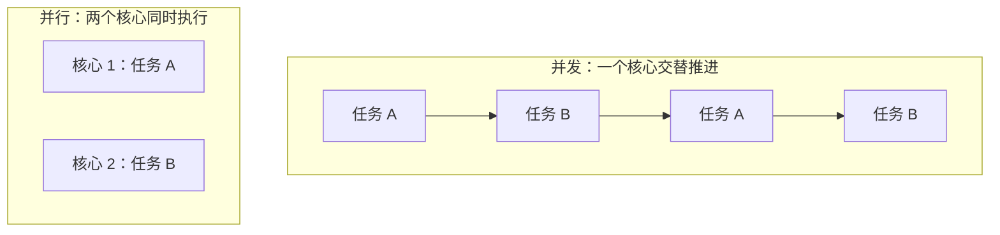
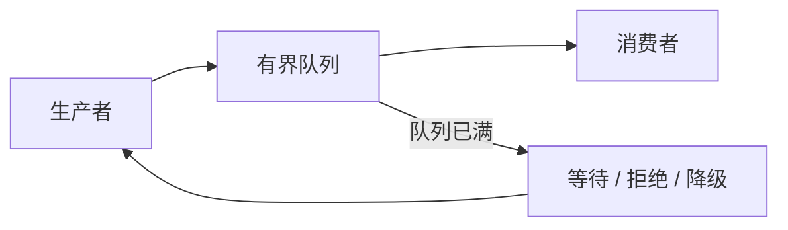
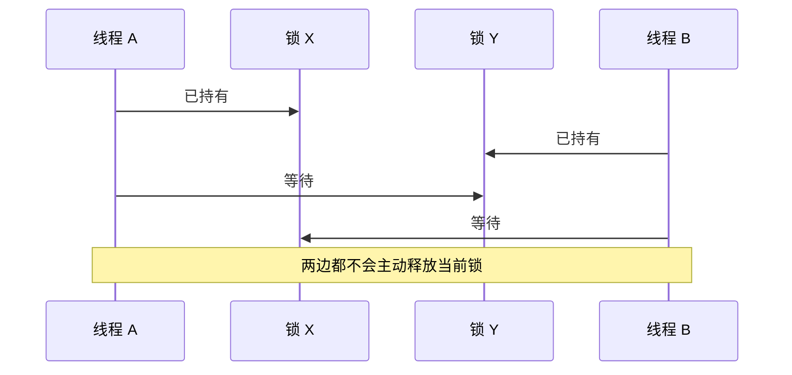

# 并发基础：线程、锁、消息与 Actor

程序经常要同时处理多件事：服务器要服务多个请求，训练平台要一边读取数据一边驱动计算设备，桌面程序要在执行后台任务时保持界面响应。**并发**就是组织这些同时进行的任务，以及规定它们怎样共享资源和交换结果。

设计并发程序要先回答三个问题：

1. 找出可以独立进行的工作；
2. 识别会被多个执行单元访问的状态；
3. 为速度不一致和失败设计等待、拒绝或恢复策略。

这些问题分别对应任务拆分、共享状态同步和任务间通信。线程、锁、原子操作、消息传递和 Actor 提供不同的表达方式；它们都建立在“谁拥有状态、谁可以同时访问、完成或失败怎样通知”这组规则上。

## 1. 并发不等于并行

**并发**（concurrency）表示多个任务在同一段时间内都有进展。**并行**（parallelism）表示多个任务在同一个时刻真正运行。

单核 CPU 可以通过在任务之间切换实现并发，但同一时刻通常只执行一个任务。多核 CPU 才能让多个计算在硬件上并行。



这个区别很重要，因为并发可以提高等待型任务的资源利用率，却不会自动加速计算。一个程序若主要进行 CPU 计算，通常需要多核心并行；若主要等待网络或磁盘，并发可以让线程在等待期间处理别的任务。

## 2. 为什么需要线程

**线程**是操作系统调度 CPU 时间的基本执行单元。一个进程可以包含多个线程，它们共享进程的大部分地址空间，但各自有指令执行位置、寄存器现场和栈。

线程共享内存，所以交换数据很方便；也正因为共享，错误的并发访问可能破坏数据。

```rust
use std::thread;

fn parallel_sum(values: Vec<u64>) -> u64 {
    let middle = values.len() / 2;
    let right = values[middle..].to_vec();
    let left = values[..middle].to_vec();

    let left_worker = thread::spawn(move || left.iter().sum::<u64>());
    let right_worker = thread::spawn(move || right.iter().sum::<u64>());

    left_worker.join().expect("left worker panicked")
        + right_worker.join().expect("right worker panicked")
}
```

`spawn` 创建线程，闭包中的 `move` 把数据所有权交给新线程，`join` 等待线程结束并取得结果。这个例子为了讲清所有权而复制了两个切片，真实程序会根据数据规模选择作用域线程、共享只读数据或并行库。

创建线程和在线程之间切换都需要成本，因此“每个很小任务创建一个线程”通常不合适。常见做法是建立固定数量的工作线程，让任务进入队列，这叫作**线程池**。

## 3. 共享状态为什么需要同步

如果多个线程同时访问同一数据，而且至少一个线程会写入，就必须规定访问顺序。否则可能发生**数据竞争**（data race）：并发读写没有正确同步，程序结果不再可靠。

下面的“读取、加一、写回”不是不可分割的一步：

```text
线程 A 读取 count = 10
线程 B 读取 count = 10
线程 A 写入 count = 11
线程 B 写入 count = 11
```

两个线程都执行了一次加一，结果却只增加了一次。解决问题的关键，是让这段操作形成受保护的**临界区**：同一时刻只允许符合规则的线程进入。

### 3.1 互斥锁

**互斥锁**（mutex）保证同一时刻只有一个线程持有锁。线程修改共享数据前先加锁，修改完成后释放锁。

```rust
use std::sync::{Arc, Mutex};
use std::thread;

fn count_with_two_threads() -> u64 {
    let count = Arc::new(Mutex::new(0_u64));
    let mut workers = Vec::new();

    for _ in 0..2 {
        let count = Arc::clone(&count);
        workers.push(thread::spawn(move || {
            for _ in 0..1_000 {
                *count.lock().expect("mutex poisoned") += 1;
            }
        }));
    }

    for worker in workers {
        worker.join().expect("worker panicked");
    }

    let result = *count.lock().expect("mutex poisoned");
    result
}
```

`Arc` 提供跨线程共享所有权，`Mutex` 保护内部可变数据。锁解决正确性问题，但也带来等待：一个线程持锁时，其他需要同一把锁的线程只能等待。

好的临界区通常满足两个条件：

- 范围清晰，只保护确实需要共同保持一致的数据；
- 持锁期间不执行不确定时长的网络请求、磁盘操作或用户回调。

### 3.2 原子操作

**原子操作**保证一个简单操作不会被其他线程观察为“只完成了一半”。计数器、状态位和指针更新常用原子类型实现。

原子操作不是“小型锁”的无脑替代品。单个原子变量很容易理解，但多个字段之间的一致关系仍需要协议。原子的**内存顺序**还规定一个线程在什么条件下能看到另一个线程此前写入的普通数据。完整推导见[原子操作与内存顺序](../infrastructure/atomics.md)。

初学时先记住：锁把一组操作组织成临界区；原子操作适合有明确并发协议的单值状态。先保证正确，再讨论减少锁竞争。

## 4. 消息传递：共享结果，而不是共享每一步修改

另一种组织方式是让任务通过**消息**交换数据。发送者把值放入通道，接收者从通道取出并处理。这样可以把某份可变状态集中在一个拥有者手中，其他任务通过请求影响它。

```rust
use std::sync::mpsc;
use std::thread;

fn sum_worker(values: Vec<u64>) -> u64 {
    let (sender, receiver) = mpsc::channel();

    thread::spawn(move || {
        let sum = values.iter().sum::<u64>();
        sender.send(sum).expect("receiver disappeared");
    });

    receiver.recv().expect("worker disappeared")
}
```

通道不能自动消除所有并发问题。设计消息系统还要回答：

- 队列是否有容量上限？
- 队列满时，发送者等待、丢弃还是返回错误？
- 接收者失败后，未处理消息怎么办？
- 消息是否需要保持顺序？

### 4.1 背压

如果生产者持续比消费者快，队列会不断增长，最终耗尽内存或让消息等待很久。系统把“下游处理不过来”反馈给上游的机制叫作**背压**（backpressure）。

有界队列是常见基础：容量满后，发送端必须等待、降级或拒绝新工作。无界队列看起来不会阻塞发送者，却只是把压力转换成内存占用和更长的排队时间。



## 5. Actor：用消息保护状态所有权

**Actor** 是一种并发模型。每个 Actor 拥有自己的状态，只通过接收消息处理外部请求。其他组件不能直接修改它的内部状态。

例如，账户 Actor 可以独占账户余额：

```text
调用者 --Debit(100)--> 账户 Actor --结果--> 调用者
调用者 --GetBalance--> 账户 Actor --余额--> 调用者
```

因为余额只有一个写入者，许多共享锁问题会自然消失。但 Actor 仍然有代价：

- 消息需要排队，邮箱必须有容量策略；
- 跨多个 Actor 的一致更新更难表达；
- 一个 Actor 处理很慢时，它后面的消息都会等待；
- Actor 失败后，状态和未处理消息需要恢复策略。

Actor 描述的是**状态所有权和通信方式**，不是某一种线程实现。一个 Actor 可以独占系统线程，也可以作为异步运行时中的任务。不要把 Actor、线程和 async 当作同一层级的三个互斥选项。

## 6. 死锁：每个人都在等别人

**死锁**指一组任务互相等待，导致谁都无法继续。经典情况是两个线程以不同顺序获取两把锁：



常见预防方法包括：

- 所有代码按照同一顺序获取多把锁；
- 缩小临界区，避免持锁等待外部事件；
- 把相关状态放入同一把锁或同一个 Actor；
- 在业务允许时使用超时和失败返回，但不要把超时当作正确性证明。

除了死锁，还要区分**饥饿**：任务理论上能继续，却长期得不到锁或调度机会；以及**活锁**：任务一直在响应对方、不断重试，却没有完成有效工作。

## 7. 怎样选择并发模型

先判断任务在等待什么，再选择工具：

| 问题特征 | 常见起点 | 原因 |
| :--- | :--- | :--- |
| 少量长期运行、CPU 密集的任务 | 固定线程或有界线程池 | 能利用多核，并控制同时计算的数量 |
| 大量任务主要等待网络 I/O | 异步运行时 | 等待期间线程可以推进其他任务 |
| 共享状态需要一次完成多字段更新 | Mutex 或单拥有者 | 容易表达一致的临界区 |
| 状态适合由一个组件独占 | Actor 或消息循环 | 用消息明确所有权边界 |
| 流水线阶段速度不同 | 有界通道 | 通过背压限制排队规模 |

这些模型可以组合。Web 服务可能用异步任务处理连接，再把 CPU 密集的图片处理交给线程池；AI 服务可能用 Actor 管理模型实例，再用异步 I/O 接收请求；数据处理流水线可能用线程和有界通道连接不同阶段。

## 8. 三类系统怎样使用并发机制

- **传统互联网服务**重点关注请求并发、连接等待、线程池上限、数据库连接池和背压；
- **AI Infra** 重点关注批处理队列、模型实例所有权、CPU 与加速器任务重叠，以及过载时如何拒绝请求；
- **HFT** 会进一步使用单写者状态、固定线程和一对一队列减少共享写入。只有明确需要专用 CPU 时，才继续研究线程亲和性、中断放置和 NUMA 拓扑。

线程绑核、操作系统隔离参数和忙轮询属于岗位专项配置。它们不能替代本章的正确性模型，也不应该穿插在锁、消息和 Actor 的基础定义中。

## 9. 本章小结

- 并发表示多个任务都有进展，并行表示多个任务在同一时刻执行；
- 线程共享进程内存，通信直接，但共享写入需要同步；
- Mutex 保护一组临界区操作，原子操作适合明确协议下的简单状态；
- 消息传递能集中可变状态的所有权，但队列仍需要容量、失败和顺序策略；
- Actor 是状态所有权模型，可以运行在线程或异步任务之上；
- 背压限制生产速度，死锁则来自无法解除的循环等待。

## 做题方法

并发正确性题用“共享状态—允许操作—不变量—可能调度”四列推演：

1. 列出所有可被多个执行单元接触的状态，并为每项标出唯一所有者、锁、原子协议或消息通道。
2. 把复合操作拆成最小步骤，例如 `read counter → add → write`，枚举两个线程交错后是否丢失更新。
3. 锁方案标出获取顺序、持锁区间和释放点；消息方案则标出消息顺序、队列容量、发送失败和接收者退出。
4. Actor 题检查状态是否只由 actor 自己修改，以及消息处理中的异步等待是否允许其他消息穿插，破坏原先假设。
5. 活性题分别寻找死锁环、饥饿来源和无进展重试；“没有数据竞争”不等于系统一定前进。
6. 性能题最后再计算竞争、排队、复制与背压成本，不能用性能理由跳过状态不变量。

验算时尝试构造最坏调度：在每个共享读写之间切换线程、让队列恰好满、让接收者恰好退出。若不变量仍成立且每个等待都有可能被解除，方案才完整。

## 10. 思考题与面试追问

1. 并发与并行有什么区别？单核 CPU 能实现哪一个？
2. 为什么 `count += 1` 在多线程中不能被默认看作一个不可分割的操作？
3. Mutex 和原子操作分别适合解决什么问题？
4. 无界消息队列为什么不能真正解决消费者过慢的问题？
5. Actor 与线程是什么关系？一个 Actor 能否运行在 async task 中？
6. 两把锁怎样形成死锁？统一加锁顺序为什么能避免这一类死锁？
7. 一个 CPU 密集任务和一个网络等待任务，为什么通常不应使用完全相同的调度方式？

### 参考答案与解答

<details><summary>展开答案</summary>

1. 并发是多个任务时间区间重叠、交替推进；并行是同一时刻在不同执行资源运行。单核可通过切换实现并发，但不能同时执行两条普通 CPU 指令流。
2. `count += 1` 可拆成 load、add、store；两线程都读旧值并写相同新值会丢更新。除非类型/API 明确提供原子 read-modify-write，否则不能假设不可分割。
3. Mutex 适合保护多个字段/多步不变量，并允许争用时睡眠；原子适合能由单个或明确 CAS 协议表示的小状态。原子不自动让复合业务操作成为事务。
4. 消费速度小于生产速度时，队列长度持续增长，最终耗尽内存并放大延迟。需要有界容量和阻塞/拒绝/降级等背压，而非隐藏积压。
5. Actor 是“状态只由自身消息循环修改”的并发模型，不等同于线程；多个 actor 可复用线程，一个 actor 也可作为 async task 运行，但要说明 await 期间消息是否穿插。
6. A 持 L1 等 L2、B 持 L2 等 L1形成环。若所有参与者只按 L1→L2 的全局顺序获取，等待边单向递增，无法闭环。
7. CPU 密集任务应限制到可用核心并避免阻塞 async worker；网络任务大量时间在等待，可由事件循环复用少量线程。混用会让 CPU 任务饿死 I/O 驱动或造成过多线程切换。

</details>

下一章：[Async Rust 原理与 Tokio](async_rust.md)
