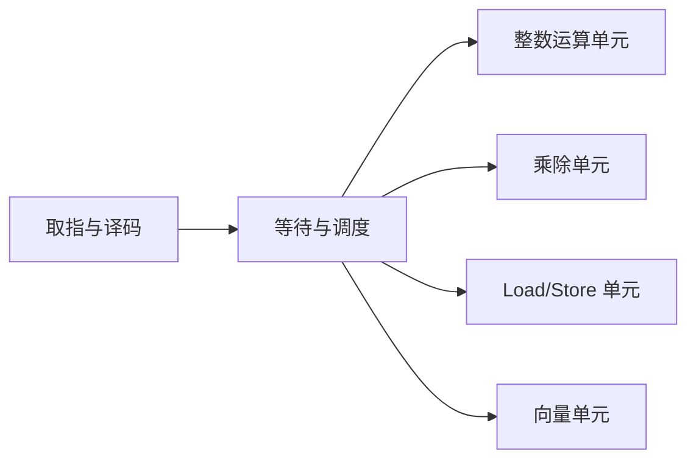
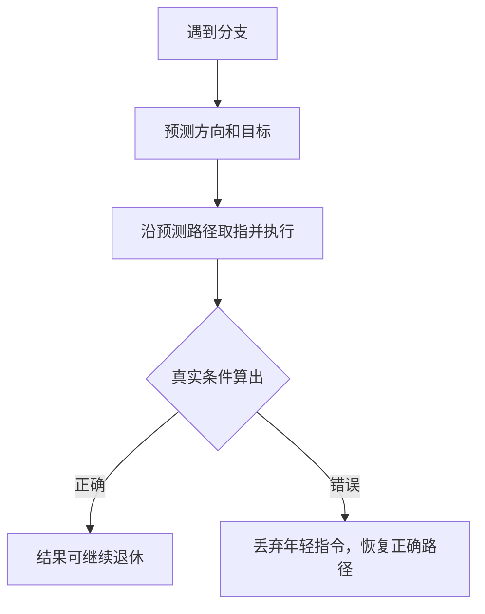

# CPU 微架构：分支预测、乱序与并行执行

指令集架构规定每条机器指令对程序产生什么结果，**微架构（microarchitecture）**决定处理器内部怎样尽快得到这个结果。同一套 x86-64 或 AArch64 程序可以运行在不同芯片上，但它们的取指宽度、执行单元、预测器和缓存结构并不相同。

指令怎样经过基本数据通路与流水线，见[CPU 数据通路](cpu_datapath.md)；Cache 的映射、替换和写策略见[存储层次](memory_hierarchy.md)。本章从顺序流水线继续向前，解释现代高性能 CPU 怎样同时推进更多工作，又怎样保证程序最终看到正确顺序。

## 1. 为什么顺序程序内部可以并行

看四条按顺序书写的指令：

```text
1. r1 = load [A]
2. r2 = r1 + 1
3. r3 = r4 * r5
4. store [B] = r2
```

第 2 条依赖第 1 条，第 4 条依赖第 2 条；第 3 条与它们没有数据依赖。若第 1 条等待内存，处理器可以先执行第 3 条，而不改变最终结果。

这种一个线程内部同时存在多条可推进指令的性质叫**指令级并行（Instruction-Level Parallelism，ILP）**。微架构会寻找彼此独立的工作，填满本来空闲的执行资源。

## 2. 超标量：一个周期发射多条指令

简单流水线每周期最多开始一条指令。**超标量（superscalar）**处理器拥有多条执行通路，可以在同一周期向不同执行单元发射多条符合条件的指令。



“四发射”不等于每周期永远完成四条：

- 指令可能存在真实依赖；
- 某类执行单元数量有限；
- 取指或译码可能没有及时提供足够指令；
- 分支预测错误会让错误路径工作作废；
- Cache miss 会让加载长时间等待。

因此 IPC（Instructions Per Cycle，每周期完成指令数）是运行结果，不是只看机器宽度就能得到的常数。

## 3. 三种数据相关与寄存器重命名

先区分程序真正需要的依赖与名字复用造成的假依赖：

| 相关 | 含义 | 是否是真实数据流 |
|---|---|---|
| RAW：Read After Write | 后一条要读前一条写出的值 | 是 |
| WAR：Write After Read | 后一条要写一个更早指令尚未读取的寄存器名 | 否，名字冲突 |
| WAW：Write After Write | 两条都写同一寄存器名，最终顺序不能颠倒 | 否，名字冲突 |

例如：

```text
1. r1 = r2 + r3
2. r4 = r1 * 2      // RAW：必须拿到第 1 条结果
3. r1 = r5 - r6     // 与第 2 条对 r1 形成名字冲突
```

**寄存器重命名（register renaming）**把 ISA 中数量有限的架构寄存器名映射到更多物理寄存器。第 1、3 条可以暂时写不同物理位置，从而消除 WAR/WAW 假依赖；RAW 代表真正数据流，不能靠改名消除。

## 4. 乱序执行怎样工作

**乱序执行（Out-of-Order Execution）**允许已经具备操作数的后续指令先使用空闲执行单元。可以用下面的简化流程理解：


**退休（retirement/commit）**表示一条指令的结果正式成为程序可见状态。处理器可以乱序执行，却通常按程序顺序退休。这样若较早指令发生异常，后面已经推测执行的结果可以丢弃，程序看到的状态仍像顺序机器在那条指令处停止。这叫**精确异常**。

用于记录“哪些较早指令尚未退休”的硬件结构常称重排序缓冲区。面试中理解其职责即可，不必背某款 CPU 的条目数量。

## 5. 乱序执行隐藏不了什么

乱序窗口只能从已经看见的指令中寻找独立工作。以下情况会限制它：

- **长依赖链**：每一步都依赖上一步，没有独立工作；
- **窗口装满**：很早的 cache miss 长时间不完成，后续指令无法退休；
- **内存并行不足**：地址本身依赖前一次加载，例如链表逐节点遍历；
- **执行端口争用**：大量指令都需要同一种执行单元；
- **难预测分支**：前端反复取到错误路径。

因此数组可让多个地址较早确定，处理器可能并行发出多次读取；链表下一节点地址要等当前节点返回，通常更难形成**内存级并行（Memory-Level Parallelism，MLP）**。

## 6. 分支预测为什么存在

遇到条件跳转时，比较结果可能尚未算出，但取指单元必须决定接下来从哪里取指。若每次都停住等待，深流水线会频繁空闲。

**分支预测器**根据分支地址和历史行为猜测方向及目标；处理器沿预测路径进行**推测执行（speculative execution）**。



循环末尾分支、稳定状态判断通常容易预测；由近似随机输入决定、两条路径交替无规律的分支可能更难预测。预测错误的代价不是一个固定纳秒数，而取决于流水线、机器频率和后续取指恢复。

## 7. 为什么不能见到 `if` 就改成无分支

源码中的 `if` 未必生成条件跳转。编译器可能使用条件移动、掩码或向量指令；所谓无分支写法也可能执行更多运算或产生新的依赖。

判断改写是否值得需要：

1. 确认代码处于真实热点；
2. 使用代表性输入，保留分支概率与相关性；
3. 查看优化后的机器码，确认实际变化；
4. 测量完成时间，并在需要时观察分支与 cache 计数器；
5. 检查可读性和边界值没有被破坏。

“预测准确率高”也不自动说明分支没有性能影响；“存在误预测”也不自动说明它是主要瓶颈。

## 8. Load/Store 为什么比普通寄存器运算复杂

内存指令除等待 Cache 外，还要维护单线程语义：较后的 load 是否可以越过较早的 store？两个运行时地址会不会其实相同？

处理器会记录尚未完成的读取和写入，进行地址相关检查，并在安全时让 load 提前。如果预测两个地址不冲突，后来发现实际冲突，就要丢弃并重做相关工作。

这不是语言并发内存模型的替代品。单线程内部的推测必须保持 ISA 语义；多线程之间哪些读写可见，还受到语言原子操作、编译器重排和硬件一致性规则共同约束，见[并发基础](concurrency.md)与[原子操作](../infrastructure/atomics.md)。

## 9. SIMD 与自动向量化

**SIMD（Single Instruction, Multiple Data，单指令多数据）**让一条向量指令对多个元素执行相同操作。例如，一条指令可同时相加多组整数或浮点数。

SIMD 适合：

- 元素操作相同；
- 数据布局连续或可高效装载；
- 循环迭代之间没有阻止并行的依赖；
- 边界和数值语义允许相应变换。

编译器能自动向量化一部分循环，但别名不明确、复杂控制流或严格浮点顺序都可能阻止它。首先选择清楚的算法和布局，再用编译报告、机器码与基准确认；不是手写 intrinsic 才算优化。

## 10. SMT：一个核心运行多个硬件线程

**同时多线程（Simultaneous Multithreading，SMT）**让一个物理核心维护多个硬件线程的架构状态。当线程 A 因依赖或 cache miss 用不满执行资源时，线程 B 的指令可以利用空位。

硬件线程共享取指带宽、执行单元和部分 Cache，所以：

- 对吞吐型混合负载，SMT 可能提高核心利用率；
- 对已经用满核心资源的任务，收益可能很小；
- 两个线程还可能争用共享资源，彼此性能下降。

操作系统显示的“逻辑 CPU”不等于同数量的独立物理核心。是否开启、怎样放置线程应以工作负载测量为准。

## 11. 推测执行与安全边界

预测错误时，架构结果会被丢弃，但推测期间访问过的 Cache 等微架构状态可能留下痕迹。Spectre 一类侧信道利用这种差异推断本不应读取的数据。

基础层面要记住：

- “程序最终结果正确”与“执行过程没有可观察侧信道”是不同要求；
- 权限检查和边界检查仍必须正确，不能依赖预测器；
- 编译器、操作系统和硬件提供的缓解措施针对具体威胁模型，会有成本；
- 安全敏感代码应遵循目标平台当前指南，而不是自行猜测插入屏障。

本书不展开具体漏洞变体，但不能把推测执行描述成完全不可观察的内部优化。

## 12. 用计数器验证微架构假设

CPU 的性能监控单元可以统计周期、指令、分支、误预测、Cache miss 等事件。它们用于验证因果链，而不是生成一个自动结论。

例如某循环变慢，可以依次问：

1. 算法做的工作量是否相同？
2. 每条记录执行的指令是否增加？
3. IPC 下降是否伴随分支误预测或 cache miss 增长？
4. 是否发生频率变化、调度迁移或其他负载竞争？
5. 计数器事件在这款 CPU 上具体代表什么，是否被复用估算？

完整性能实验方法见[基准测试](../optimization/benchmarking.md)与[性能分析](../optimization/profiling.md)。

## 13. 常见误解

- **“乱序执行会改变单线程结果。”** 它乱序推进内部工作，但按顺序退休并保持 ISA 可见语义。
- **“寄存器重命名能消除所有依赖。”** 它消除名字造成的 WAR/WAW，不能消除 RAW 数据流。
- **“预测错误就是执行了错误业务副作用。”** 错误路径不能退休为架构结果，但可能留下微架构痕迹。
- **“无分支代码一定更快。”** 它可能多做工作、加长依赖链，源码形状也不等于机器码。
- **“逻辑 CPU 数量就是独立核心数量。”** SMT 线程共享一个核心的资源。
- **“SIMD 宽度翻倍，程序就快一倍。”** 装载、分支、依赖、频率和未向量化部分都会限制加速。

## 14. 应用中的微架构问题

| 场景 | 可提出的假设 | 怎样验证 |
|---|---|---|
| Web/序列化 | 字段类型分支是否随输入无规律变化 | 代表性请求 + 机器码 + 分支计数 |
| AI 数据预处理 | 连续数值循环是否能 SIMD，是否受内存带宽限制 | 编译报告 + 吞吐 + 带宽/指令计数 |
| 数据库索引 | 指针追逐是否限制内存级并行 | 布局对照实验 + Cache miss/IPC |
| HFT 消息解析 | 常见消息路径是否稳定，异常路径是否污染主线 | 真实分布基准 + 分位数 + 计数器 |

微架构模型的作用是提出可证伪假设。没有输入分布、机器型号和测量条件的固定周期数字，不应当作通用答案。

## 做题方法

分析一段程序在处理器上的表现时，按“依赖—预测—存储—资源”排查：

1. 先画真正的数据依赖链；链上指令不能仅靠增加发射宽度并行，链外独立指令才可能被乱序执行重叠。
2. 遇到分支，区分预测正确的正常流与预测错误的冲刷成本。不要把“乱序执行”写成“允许越过未解决分支永久提交结果”。
3. 遇到内存访问，先判断地址之间是否可能别名，再检查 Cache/TLB 命中。处理器不能在地址关系不明时无条件交换两个访问。
4. SIMD 题先算每条向量指令包含多少元素，再检查循环次数、尾部元素、对齐和数据依赖；理论车道数只是加速上限。
5. 多线程题区分物理核心、SMT 硬件线程和操作系统线程。SMT 共享核心执行资源，线程数翻倍不代表计算吞吐翻倍。
6. 若题目给出计数器，用 `IPC、分支失误、Cache miss、停顿周期` 逐项验证假设；只凭源码猜“CPU 应该怎样”不能作为结论。

验算时问：瓶颈若真是分支，减少内存 miss 为什么不应成为主要收益？若计算有一条长依赖链，峰值发射宽度为何无法达到？能回答这种反事实，说明因果链没有混淆。

## 15. 思考题与面试追问

1. ISA 与微架构分别规定什么？为什么同 ISA 的两款 CPU 表现可以不同？
2. RAW、WAR、WAW 中哪些是真依赖，寄存器重命名能消除哪些？
3. 为什么乱序执行还需要按序退休？精确异常依赖什么性质？
4. 长依赖链为什么会降低可利用的指令级并行？
5. 数组遍历通常为何比链表追指针更容易形成内存级并行？
6. 分支预测错误时，处理器要恢复哪些工作？
7. 把 `if` 改成掩码计算前，你会收集哪些证据？
8. SMT 为什么可能提高吞吐，也可能让两个任务互相干扰？
9. SIMD 加速受到 Amdahl 定律怎样限制？若 80% 时间可加速 4 倍，总加速比是多少？
10. “推测结果没有退休”为什么仍不能推出“安全上完全不可观察”？

### 参考答案与解答

<details><summary>展开答案</summary>

1. ISA 定义软件可见契约，微架构定义内部实现。同 ISA CPU 可具有不同缓存、预测、执行宽度、频率与内存系统，因而时间和吞吐不同。
2. RAW 是真数据依赖；WAR、WAW 是名字依赖。寄存器重命名给不同写入分配不同物理寄存器，可消除 WAR/WAW，不能消除值必须先产生的 RAW。
3. 乱序执行仍按程序序提交，才能让异常点看见“更老完成、更年轻未生效”的精确状态。按序退休和可恢复的重命名/重排序状态共同支撑精确异常。
4. 链上每条指令必须等待前一结果，调度窗口再宽也不能并行这条链；只有链外独立工作可重叠。
5. 数组连续地址可一次预测/生成多个独立请求；链表下一地址通常要等当前节点 load 返回，形成串行依赖链，限制 MLP。
6. 处理器要丢弃错误路径年轻指令、恢复正确的 PC 和重命名/分支检查点，撤销未退休资源占用；已退休的更老状态保持不变。
7. 先收集分支执行频率、taken 分布、误判率与罚时、热点占比，并测量掩码版增加的指令、依赖和向量化效果；再用相同输入做端到端对照。
8. SMT 用另一个线程填补空闲执行槽，可能提高整体吞吐；两个线程也会争用前端、执行单元、缓存与带宽，导致互相干扰和尾部恶化。
9. Amdahl：`S=1/[(1-0.8)+0.8/4]=1/(0.2+0.2)=2.5`。即使 SIMD 部分理论快 4 倍，未加速的 20% 限制整体。
10. 推测执行虽未提交架构状态，却可能改变缓存、TLB、预测器和执行时间等微架构状态；攻击者可通过时间侧信道观察差异。因此“未退休”只说明架构结果未提交。

</details>

## 参考依据

- John L. Hennessy、David A. Patterson，《Computer Architecture: A Quantitative Approach》，ILP 与存储层次章节。
- Randal E. Bryant、David R. O'Hallaron，《Computer Systems: A Programmer's Perspective》，Processor Architecture 与 Program Performance 章节。
- Intel 与 Arm 处理器架构/优化手册；具体事件与流水线参数必须以目标处理器文档为准。
- Paul Kocher 等，Spectre Attacks: Exploiting Speculative Execution，用于推测执行安全边界。
