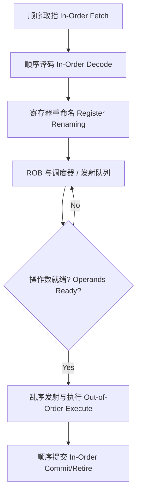

# CPU 微架构原理与低延迟优化 (CPU Microarchitecture and Low-Latency Optimization)

在分析低延迟交易系统时，语言层面的代码只是起点。同一段代码在不同处理器、编译选项和数据分布下可能产生不同表现，因此理解 CPU 微架构有助于提出假设、选择指标并解释基准结果。

本章将从计算机体系结构的核心概念出发，系统探讨指令流水线（Instruction Pipeline）、分支预测（Branch Prediction）、乱序执行（Out-of-Order Execution）以及硬件级高精度计时（Hardware Timers）的底层原理，并展示如何通过 Rust 编写与硬件高度契合的低延迟代码。

## 2.1 指令级并行与流水线架构 (Instruction-Level Parallelism and Pipelining)

现代处理器的核心性能提升手段之一是指令级并行（Instruction-Level Parallelism, ILP），它主要通过两个维度实现：时间维度上的流水线技术（Pipelining）与空间维度上的超标量架构（Superscalar）。

### 2.1.1 经典流水线模型与数据冒险 (Pipeline Model and Data Hazards)

指令执行可以用多个阶段来理解。经典教学模型把一条指令分为取指（Fetch, IF）、译码（Decode, ID）、执行（Execute, EX）、访存（Memory, MEM）和写回（Writeback, WB）。现代高性能 CPU 的实际前端、后端和流水线远比五级模型复杂，下面的图只用于建立直觉。

```mermaid
gantt
    title 五级指令流水线的时间并行模型 (Pipelined Execution)
    dateFormat  X
    axisFormat %s
    section 指令 1 (A = 10)
    IF :a1, 0, 1
    ID :a2, 1, 2
    EX :a3, 2, 3
    MEM :a4, 3, 4
    WB :a5, 4, 5
    section 指令 2 (B = A + 5)
    IF :b1, 1, 2
    ID :b2, 2, 3
    Stall (气泡) :crit, b3, 3, 4
    EX :b4, 4, 5
    MEM :b5, 5, 6
    WB :b6, 6, 7
```



流水线通过重叠不同指令的阶段提高吞吐量，但会遇到**数据冒险（Data Hazards）**。当后一条指令需要的结果尚未就绪时，简单流水线需要暂停（Stall），形成流水线气泡。真实处理器还会使用旁路/转发、寄存器重命名和乱序执行来消除或隐藏一部分等待，因此消费者不一定要等到教学模型中的“写回阶段”。

### 2.1.2 超标量架构与循环展开 (Superscalar Architecture and Loop Unrolling)

为了突破单发射流水线模型每周期至多发射一条指令的限制，现代高性能 CPU 使用超标量设计。在后端，CPU 配备多种执行端口和功能单元（如整数、浮点和加载/存储单元）。在依赖和资源允许时，一个周期可以发射或执行多个微操作；发射、执行与退休的宽度也不一定相同。

在工程实践中，**循环展开（Loop Unrolling）** 是充分利用超标量架构的经典技术。

```rust
// 代码清单 2.1：通过循环展开打破依赖链，提升 IPC

/// 普通累加只有一条 `acc` 依赖链，可能限制加法并行度。
pub fn sum_sequential(data: &[u32]) -> u64 {
    let mut acc = 0_u64;
    for &val in data {
        acc += u64::from(val);
    }
    acc
}

/// 循环展开（4 路）提供四条独立依赖链；编译器和 CPU
/// 是否利用这些并行机会，要看最终机器码和目标微架构。
pub fn sum_unrolled(data: &[u32]) -> u64 {
    let mut acc1 = 0_u64;
    let mut acc2 = 0_u64;
    let mut acc3 = 0_u64;
    let mut acc4 = 0_u64;
    
    let mut iter = data.chunks_exact(4);
    for chunk in &mut iter {
        acc1 += u64::from(chunk[0]);
        acc2 += u64::from(chunk[1]);
        acc3 += u64::from(chunk[2]);
        acc4 += u64::from(chunk[3]);
    }

    // 处理长度不是 4 的倍数时留下的 0～3 个元素。
    for &val in iter.remainder() {
        acc1 += u64::from(val);
    }
    
    acc1 + acc2 + acc3 + acc4
}
```

**代码解析**：
在 `sum_unrolled` 中，多个累加器把一条长依赖链拆成四条较短的链，为编译器和 CPU 调度器提供了更多并行机会。但这不保证更快：编译器可能已经自动展开或向量化普通版本，小输入还可能被额外的循环与归并开销抵消。应在 release 构建中检查机器码，并用真实长度分布做基准测试。

## 2.2 控制流冒险与分支预测机制 (Control Flow Hazards and Branch Prediction)

除了数据依赖，控制冒险（Control Hazards）也是限制流水线效率的重要因素，常见来源是条件分支指令。需要注意，Rust 源码中的 `if` 不一定对应最终机器码中的跳转。

### 2.2.1 预测惩罚的代价 (Misprediction Penalty)

当取指单元（Fetch Unit）遇到条件跳转指令时，分支条件的计算结果通常需要数个周期后才能在执行单元（EX）中得出。为了防止流水线停顿，现代 CPU 必须使用**分支预测器（Branch Predictor）**猜测未来的执行路径，并进行推测执行（Speculative Execution）。

如果预测失败（Misprediction），CPU 要丢弃错误路径上的推测结果，并从正确地址继续。代价与处理器微架构、分支在流水线中的解析位置以及周围指令有关，可能是十余个或更多核心周期，但不存在适用于所有 CPU 的固定数字。可以结合目标机器上的基准和 PMU 分支事件判断影响。

### 2.2.2 工程实践：分支与无分支的取舍

对难以预测的条件，使用数据选择而不是跳转有时能降低抖动；但“无分支”不是默认最优方案。预测稳定的分支可能非常便宜，而无分支写法可能让两侧工作都执行、延长依赖链，或者妨碍其他优化。

```rust
// 代码清单 2.2：两种等价源码写法，最终机器码需要检查

/// 源码写成 if/else；最终是否有跳转由编译器决定。
pub fn process_order_branched(price: i32) -> i32 {
    if price > 0 {
        1
    } else {
        0
    }
}

/// 源码写成布尔值转换；编译器可能使用 SETcc，也可能选择其他形式。
pub fn process_order_branchless(price: i32) -> i32 {
    (price > 0) as i32
}
```

**代码解析**：
`process_order_branchless` 利用了 Rust 中布尔值到整数的转换。不过，这两个源码版本很可能被优化成相同机器码，也可能因目标 CPU 和上下文不同而使用条件跳转、条件移动或 `SETcc`。源码形状不能证明“汇编没有分支”；请检查最终二进制并用与生产相同的数据分布测试尾延迟。

### 2.2.3 编译器提示 (Compiler Hints)

对于不常执行的函数（例如严重错误处理），可以给编译器提供冷路径提示，让优化器在认为合适时调整内联或代码布局。

```rust
// 代码清单 2.3：使用 cold 属性优化冷路径

#[inline(always)]
pub fn fast_path_logic() { /* ... */ }

#[cold]
#[inline(never)]
pub fn handle_fatal_error() {
    // 发生严重错误时的慢速恢复逻辑
}

pub fn process_data(is_valid: bool) {
    if is_valid {
        fast_path_logic();
    } else {
        handle_fatal_error();
    }
}
```

**代码解析**：
`#[cold]` 告诉编译器该函数不太可能被调用，`#[inline(...)]` 也只是内联提示。它们可能影响内联、代码布局和调用边的概率信息，但 Rust 明确允许编译器忽略这些提示；不能据此保证 `is_valid` 一定被假设为 `true`，也不能保证函数会被放到某个特定地址。使用前后应比较最终机器码和基准结果。

## 2.3 乱序执行引擎 (Out-of-Order Execution Engine)

为掩盖缓存未命中和长延迟运算带来的等待，许多现代高性能处理器采用乱序执行（Out-of-Order Execution, OoO）。访问 DRAM 的代价可能达到数十到数百个核心周期，但会随平台、NUMA 距离、频率、内存负载和访问模式显著变化。

在一种常见的抽象模型中，指令被译码为微操作并完成寄存器重命名，随后进入调度器/发射队列等待操作数就绪；就绪的微操作可以不按程序顺序发射。**重排序缓冲区（Reorder Buffer, ROB）**主要跟踪尚未提交的操作，使结果最终按程序顺序退休，并支持精确异常。具体队列是否分离、如何选择就绪操作，属于微架构实现细节。



**架构意义**：
乱序执行由硬件完成，但代码中的**指令间独立性**决定了硬件有多少可调度空间。长依赖链、缓存未命中或执行资源争用都可能让乱序窗口逐渐填满并限制吞吐；哪一种因素占主导，应通过硬件性能计数器和基准定位。

## 2.4 x86 短区间计时：TSC (Time Stamp Counter)

短区间基准有时需要比应用级时钟更低层的观测手段。`std::time::Instant::now()` 的实现依赖操作系统和平台：它可能使用 vDSO、共享时钟页或硬件计数器，并不必然发生系统调用，更不会因为一次读时钟就必然触发上下文切换。很多场景应优先使用它或成熟的基准框架；只有在受控的 x86 实验中，才考虑直接读取 TSC，并先实测计时器自身开销。

### 2.4.1 RDTSC 指令与序列化 (RDTSC and Serialization)

x86 提供 64 位 TSC（Time Stamp Counter）。`RDTSC` 读取的是 TSC **刻度**，不是“这段代码实际消耗的核心周期数”；支持 invariant TSC 时，其增长速率通常也不随当前核心升降频变化。指令延迟和吞吐依处理器而异，不能承诺固定的纳秒开销。

`RDTSC` 不是序列化指令：较早指令未全部完成时它就可能读取计数器，较晚指令也可能提前开始。还要单独防止编译器把被测运算移出边界。因此，严谨测量需要同时设计编译器边界与 CPU 执行边界，而不是笼统地加一个“内存屏障”。

```rust
// 代码清单 2.4：受控实验中的有序 TSC 读取

#[cfg(target_arch = "x86_64")]
pub mod hardware_timer {
    use std::arch::asm;

    #[derive(Debug, Clone, Copy)]
    pub struct TscStamp {
        pub ticks: u64,
        pub aux: u32,
    }

    /// RDTSCP 等待更早的指令与 load 完成，再读取 TSC 和 TSC_AUX；
    /// 随后的 LFENCE 阻止更晚的指令越过这个读取点。
    ///
    /// 调用前必须确认 CPU 支持 RDTSCP。
    #[inline]
    pub fn ordered_tsc() -> TscStamp {
        let low: u32;
        let high: u32;
        let aux: u32;

        unsafe {
            asm!(
                "rdtscp",
                "lfence",
                lateout("eax") low,
                lateout("edx") high,
                lateout("ecx") aux,
                // 故意不写 `nomem`：还需要阻止编译器把内存访问移过边界。
                options(nostack, preserves_flags),
            );
        }

        TscStamp {
            ticks: (u64::from(high) << 32) | u64::from(low),
            aux,
        }
    }
}
```

**代码解析**：
- `RDTSCP` 会等待之前的指令执行完成以及之前的 load 全局可见，然后读取 TSC；它**不保证之前的 store 已经对其他核心全局可见**。若测量目标包含“store 对外可见”的时间，需要在结束读数前使用适合该语义的 `MFENCE`，并接受额外测量开销。
- `RDTSCP` 自身不阻止之后的指令提前执行，所以后接 `LFENCE`。如果用 `RDTSC` 作为起点，常见有序序列是 `LFENCE; RDTSC; LFENCE`；若还要求起点前的 store 全局可见，则需要更强的顺序设计。
- 示例故意没有给 `asm!` 标注 `nomem`。CPU fence 不能自动约束编译器；若告诉编译器汇编与内存无关，它仍可能移动周围的内存操作。
- `TSC_AUX` 的含义由操作系统设置，常被用来辅助发现测量期间是否迁移到另一逻辑 CPU。生产基准仍应绑定 CPU，并比较起止 `aux`；虚拟机中还要验证 hypervisor 的 TSC 行为。
- `RDTSCP` 是可选特性，运行前要用 CPUID 检查支持情况。上述 `unsafe` 表示调用者和部署环境必须维护这些前提，而不是说读取时间戳会修改 Rust 内存。

上面的屏障说明采用 Intel 当前架构文档中的语义。AMD 或其他 x86 实现也要查目标厂商对应型号的架构手册，不能只因指令名字相同就假设所有微架构细节完全一致。

### 2.4.2 恒定 TSC (Invariant TSC)

处理器可通过 CPUID 声明 **Invariant TSC**：TSC 以固定速率跨 ACPI P-/C-/T-state 运行。这仍不能让代码假设“所有 Nehalem 之后的机器、所有 socket 和所有虚拟机都天然同步”。部署时应检查特性、操作系统时钟源、跨核同步和虚拟化环境。

TSC 频率也不应直接用当前核心频率或宣传的 base frequency 代替。可优先读取平台提供的频率信息（例如可用时的 CPUID 叶），或用可靠的单调时钟校准。换算时使用已确认的 `tsc_hz`：

```text
纳秒 = TSC 刻度差 × 1_000_000_000 / tsc_hz
```

### 2.4.3 最小测量清单

1. release 构建，确认被测代码没有被常量折叠或整体删除；
2. 预热代码与数据，分别报告冷缓存和热缓存结果；
3. 固定线程到一个逻辑 CPU，并记录调度、抢占和中断造成的离群值；
4. 先测空计时边界的分布，不盲目用一个常数相减；
5. 报告中位数与 p95/p99 等分位数，而不只给最小值；
6. 写明 CPU 型号、微码、频率策略、内核、编译器和编译参数。

---

流水线、分支预测和乱序执行为性能现象提供了分析模型，但优化结论仍要由目标机器上的测量支持。下一章 [内存布局与缓存效率](memory_layout.md) 将继续讨论数据布局与局部性如何影响缓存行为。
