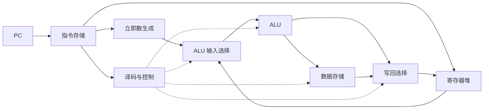
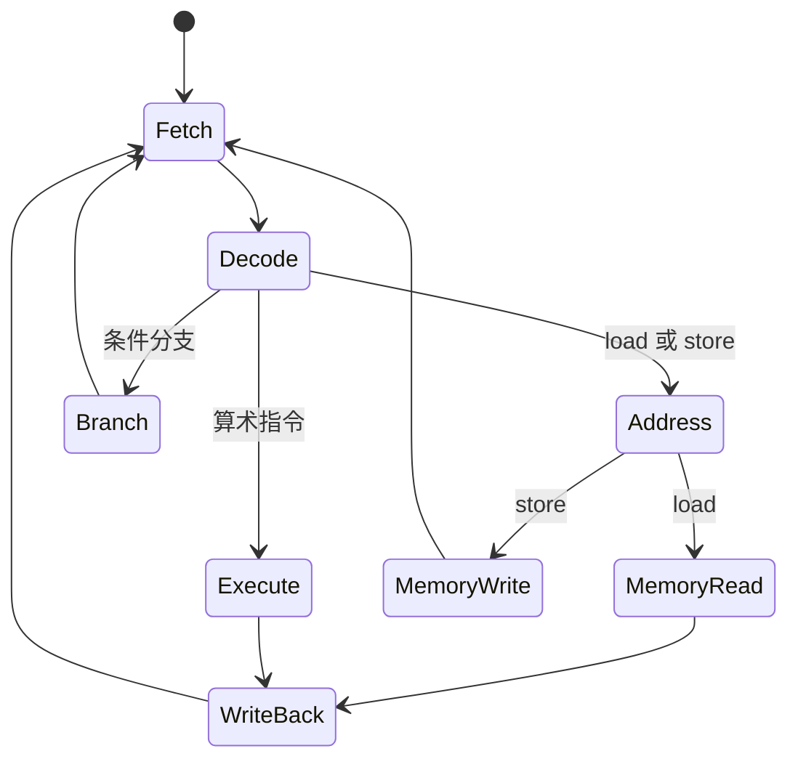
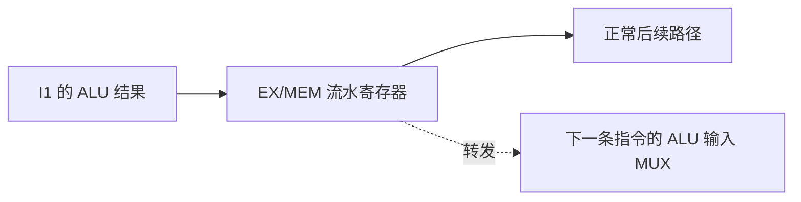
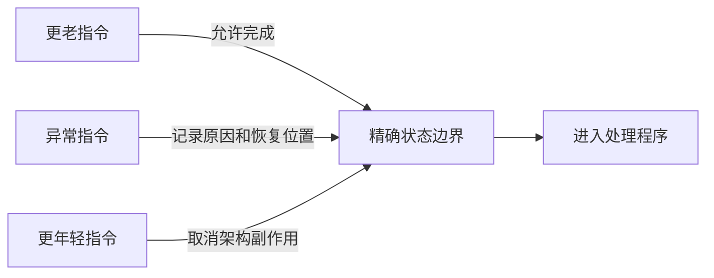

# CPU 数据通路、控制与流水线

一条机器指令只有几十个 bit，CPU 却要让它驱动寄存器、运算器和存储器协同工作。例如，一条“把两个寄存器相加并写入第三个寄存器”的指令，至少需要完成四件事：找到指令、读出两个操作数、完成加法、把结果写回正确位置。

**数据通路**（datapath）是指令执行过程中保存和传送数据的硬件部件及连接；**控制器**（control unit）根据指令和当前状态产生控制信号，决定数据在这条道路上怎样流动。可以把数据通路理解成车间里的机器与传送带，把控制器理解成决定阀门开关和加工步骤的调度规则。

本章使用简化的 RISC 风格指令说明原理，不要求读者提前会 RISC-V 或汇编。本章主讲数据通路、控制与顺序流水线；超标量、预测和乱序执行见 [CPU 微架构](cpu_arch.md)。

## 1. 先认识四类代表性指令

一套真实指令集有很多指令，但建立数据通路时，可以先观察它们共同需要哪些动作。下面的写法是便于理解的伪汇编：

| 指令 | 含义 | 主要硬件动作 |
|---|---|---|
| `add x3, x1, x2` | `x3 = x1 + x2` | 读两个寄存器、ALU 加法、写寄存器 |
| `load x3, 8(x1)` | `x3 = memory[x1 + 8]` | 读基址、计算地址、读内存、写寄存器 |
| `store x2, 8(x1)` | `memory[x1 + 8] = x2` | 读基址和数据、计算地址、写内存 |
| `beq x1, x2, target` | 相等则跳到 `target` | 读寄存器、比较、选择下一个 PC |

`x1`、`x2` 等名字代表**通用寄存器**。寄存器是 CPU 内部少量而快速的存储位置。`memory[address]` 表示访问某个地址处的数据，真实处理器通常先经过缓存，但这一层暂时不影响指令语义。

四类指令有相同开头：根据 **PC**（Program Counter，程序计数器）取得指令，再识别指令。它们的后半程不同：算术和 load 要写寄存器，store 要写内存，branch 可能修改 PC。数据通路必须提供这些可能路径，控制器再为当前指令选择其中一条。

## 2. 一条指令通常经历哪些阶段

教材常把指令处理分成五个逻辑阶段：

1. **IF：取指**（Instruction Fetch）：用 PC 读取指令，并形成顺序执行时的下一个 PC；
2. **ID：译码与读寄存器**（Instruction Decode / Register Read）：识别操作码，读出源寄存器，生成立即数；
3. **EX：执行**（Execute）：ALU 做算术、逻辑、比较或有效地址计算；
4. **MEM：访存**（Memory Access）：load 读取数据，store 写入数据；
5. **WB：写回**（Write Back）：把 ALU 结果或 load 数据写回目标寄存器。

这五项首先是一种**工作分解**，不保证每款 CPU 都恰好有五级流水线。单周期 CPU 会在一个长时钟周期内依次穿过这些组合逻辑；多周期 CPU 会把它们分到多个周期；流水线 CPU 则让不同指令同时占据不同阶段。


### 2.1 指令周期、机器周期和时钟周期

这些名称在不同教材中容易混淆：

- **时钟周期**是时钟相邻有效沿之间的时间；
- **指令周期**是 CPU 完成一条指令所经历的全过程；
- **机器周期**在传统教材中常指取指、间址、执行或中断等较大的操作阶段，但不同处理器与教材定义并不完全一致。

因此，回答“一个指令周期有几个机器周期”时必须给出所讨论的 CPU 设计。单周期实现中一条指令占一个时钟周期；多周期实现中会占多个；流水线稳定后可以平均每周期完成接近一条指令，但单条指令仍穿过多个阶段。

## 3. 数据通路由哪些部件组成

### 3.1 PC 与指令存储

PC 保存下一条待取指令的地址。顺序执行时，控制逻辑把 PC 增加一条指令的长度；遇到分支、跳转、异常或中断时，PC 会改为目标地址。

**指令存储器**在教学图里是“输入地址、输出指令”的部件。真实 CPU 通常通过指令缓存取得指令，但教材把缓存细节暂时隐藏，才能先看清数据通路。

PC 本身是一个**状态元件**：它必须跨时钟周期保存值。加法器、多路选择器等部件只根据当前输入产生输出，属于组合逻辑。

### 3.2 寄存器堆

**寄存器堆**（register file）是一组可按编号访问的寄存器。简化数据通路常需要同时读两个源寄存器，并在周期末写一个目标寄存器，所以会画成“两读一写”端口。

寄存器堆不仅保存数值，还形成指令之间最直接的数据依赖：前一条指令写 `x3`，后一条指令读 `x3`，后一条必须得到前一条的新值。

### 3.3 立即数生成器

**立即数**（immediate）是直接编码在指令中的常量，例如 `load x3, 8(x1)` 中的 `8`。立即数字段往往比机器字短，使用前需要按照指令定义进行符号扩展或零扩展。整数扩展的位级规则见[数据在计算机中怎样表示](data_representation.md)。

### 3.4 ALU

**ALU**（Arithmetic Logic Unit，算术逻辑单元）完成加减、AND、OR、移位和比较等操作。在 `add` 中它计算数据结果；在 load/store 中它计算“基址 + 偏移”的有效地址；在 branch 中它协助比较源操作数。

同一个 ALU 能承担不同任务，是因为控制器会产生 `ALUControl` 一类信号，告诉它本次选择哪种运算。

### 3.5 数据存储器

load 和 store 需要访问**数据存储器**。教学图把它画成独立部件：地址来自 ALU，store 的写数据来自寄存器堆，load 的读数据前往写回路径。

真实系统中的这个访问可能命中数据缓存，也可能等待更低存储层级。本章只要求记住：load 产生一个需要写回的值，store 产生对内存可见状态的修改。

### 3.6 多路选择器

**多路选择器**（multiplexer，MUX）从多个输入中选出一个输出。它存在的原因是多类指令共享数据通路，却需要不同来源：

- ALU 第二个输入来自寄存器，还是立即数；
- 写回寄存器的数据来自 ALU，还是数据存储器；
- 下一个 PC 是顺序地址，还是分支目标。



虚线代表控制信号，实线代表数据。真实图还包含分支目标计算、PC 选择和更多控制线；上图只保留主干。

## 4. 沿数据通路追踪四类指令

### 4.1 `add`：寄存器到 ALU，再回寄存器

执行 `add x3, x1, x2` 时：

1. PC 选中指令；
2. 寄存器堆读出 `x1` 与 `x2`；
3. MUX 选择第二个寄存器值，而不是立即数；
4. ALU 执行加法；
5. 写回 MUX 选择 ALU 结果；
6. 周期结束时，寄存器堆在写使能有效的条件下更新 `x3`。

关键控制意图可以概括为：`ALUSrc=register`、`ALUOp=add`、`RegWrite=true`、`MemWrite=false`、`WriteBack=ALU`。这些名字不是所有 CPU 的标准接口，只是帮助说明每根控制线回答什么问题。

### 4.2 `load`：为什么通常是最长路径

执行 `load x3, 8(x1)` 时：

1. 读出基址寄存器 `x1`；
2. 生成并扩展立即数 `8`；
3. ALU 计算有效地址 `x1 + 8`；
4. 数据存储器按该地址读数据；
5. 写回 MUX 选择存储器结果并写入 `x3`。

load 连续经过取指存储、寄存器堆、ALU、数据存储和写回路径。在简单单周期设计中，它往往决定时钟周期至少要多长。

### 4.3 `store`：没有寄存器写回

执行 `store x2, 8(x1)` 时，ALU 同样计算 `x1 + 8`，但 `x2` 的值送到数据存储器写端口。控制器打开内存写使能，关闭寄存器写使能。

如果错误地让 `RegWrite` 保持为真，store 就可能破坏某个寄存器。这说明控制信号不是“性能提示”，而是程序正确性的一部分。

### 4.4 `branch`：选择下一条指令的位置

执行 `beq x1, x2, target` 时，数据通路比较 `x1` 和 `x2`。若条件成立，PC 选择分支目标；否则选择顺序地址。

目标地址通常由当前 PC 和指令中的有符号偏移计算。具体偏移单位、对齐和基准地址由 ISA 规定，不能把某套指令集的公式套给所有 CPU。

## 5. 单周期 CPU：一条指令一次走完

**单周期实现**让每条指令都在一个时钟周期内完成。从一个时钟沿开始，PC 和寄存器给出旧状态；数据穿过组合逻辑；到下一个时钟沿，PC、寄存器或内存状态更新。

它的优点是控制思路直接，每条指令的 CPI（Cycles Per Instruction，每条指令所需周期数）为 1。缺点是时钟周期必须容纳最慢指令的最长组合路径。

假设各段延迟如下：

| 部件 | 延迟 |
|---|---:|
| 指令存储 | 200 ps |
| 寄存器读取 | 100 ps |
| ALU | 150 ps |
| 数据存储 | 200 ps |
| 寄存器写回准备 | 50 ps |

简化 load 路径需要 `200 + 100 + 150 + 200 + 50 = 700 ps`，所以单周期时钟不能短于约 700 ps。即使一条寄存器加法不访问数据存储器，也仍然占完整周期。

还有一个结构问题：同一周期内既要取指又可能读取数据。如果只有一个单端口存储器，两次访问会冲突。教学单周期数据通路常把指令存储和数据存储分开，或假定有足够端口。

## 6. 多周期 CPU：把一条指令拆开做

**多周期实现**让一条指令跨越多个较短时钟周期。每个周期只做一部分工作，并用内部寄存器保存中间结果，例如：

- IR 保存已经取到的指令；
- A、B 保存寄存器堆读出的操作数；
- ALUOut 保存 ALU 结果；
- MDR 保存从内存读出的数据。

load 可以按下面顺序执行：

```text
周期 1：用 PC 取指，更新顺序 PC
周期 2：译码，读取基址，生成立即数
周期 3：ALU 计算有效地址
周期 4：从数据存储器读取
周期 5：写回目标寄存器
```

寄存器加法可能只需要取指、译码、执行、写回四个周期；branch 可能更少。多周期设计因此允许不同指令使用不同 CPI，也允许 ALU 或存储端口在不同周期复用。

假设最长单个阶段加上寄存器开销后需要 220 ps，五周期 load 用时约 `5 × 220 = 1100 ps`，反而比前例单周期的 700 ps 更久；但其他指令可能更短，硬件也能复用。这个数字说明“拆周期”不自动保证单条指令更快，必须结合指令比例、阶段延迟和实现成本评价。

### 6.1 多周期控制为什么需要状态机

控制器不仅要知道当前是什么指令，还要知道它执行到第几个步骤。例如同一条 load 在“计算地址”和“访问内存”周期需要不同信号。

因此，多周期控制常建模为**有限状态机**（Finite State Machine，FSM）：当前状态与指令字段共同决定本周期控制信号和下一状态。



## 7. 硬布线控制与微程序控制

控制器要把“指令含义”变成“本周期打开哪些开关”。经典教材介绍两种组织方式。

### 7.1 硬布线控制

**硬布线控制**（hardwired control）用组合逻辑和状态机直接根据操作码、条件标志和当前状态生成控制信号。

它通常速度快，因为信号由专门逻辑直接形成；但当指令和状态非常复杂时，设计、验证和修改会变难。“硬布线”不表示导线无法改变，而是控制规则最终综合为固定逻辑电路。

### 7.2 微程序控制

**微程序控制**（microprogrammed control）把一组内部控制信号编码成**微指令**，存放在控制存储器中。一个机器指令会触发一段微程序，微程序逐步发出数据通路控制信号。

它把复杂控制转化为更像程序的顺序，便于组织复杂指令和修正某些实现问题，但读取、译码微指令也有成本。微程序属于微架构内部实现，普通应用看不到它，不要把“机器指令”和“微指令”混为一谈。

| 维度 | 硬布线控制 | 微程序控制 |
|---|---|---|
| 控制来源 | 逻辑电路与状态机 | 控制存储中的微指令 |
| 常见优势 | 直接、速度高 | 复杂控制较易组织和修改 |
| 常见代价 | 复杂后难设计验证 | 多一层微指令读取与执行 |
| 是否由 ISA 强制 | 否 | 否 |

现代处理器可以混合使用两者。不能简单断言“RISC 一定硬布线、CISC 一定微程序”，因为 ISA 是外部规范，控制实现是内部选择。

<details>
<summary>控制信号为什么要随指令一起向后传</summary>

流水线中，一条指令在 ID 阶段被译码后还要继续经过 EX、MEM 和 WB。后续阶段必须知道“是否写内存”“写回来自哪里”等控制意图。因此实现可以在译码时生成控制位，再把它们和数据一同存进流水寄存器。

例如 `MemWrite` 要等 store 到达 MEM 阶段才使用，`RegWrite` 要等 add 或 load 到达 WB 阶段才使用。若控制位与数据错位，可能让一条指令的数据被另一条指令的写使能提交。

</details>

## 8. 流水线：让多条指令占据不同阶段

单周期设计中，一条指令走完后下一条才开始。五级流水线在阶段之间加入 **流水寄存器**：IF/ID、ID/EX、EX/MEM、MEM/WB。每个时钟沿，各阶段结果进入下一组流水寄存器。

```text
周期       1    2    3    4    5    6    7
指令 I1   IF   ID   EX   MEM  WB
指令 I2        IF   ID   EX   MEM  WB
指令 I3             IF   ID   EX   MEM  WB
```

若有 `n` 条指令、`k` 个理想等长阶段，没有停顿时总周期数约为 `n + k - 1`。前 `k-1` 个周期用于填充，最后若干周期用于排空。稳定后每周期可以完成一条，但每条仍要经过约 `k` 个周期。

### 8.1 为什么实际加速达不到阶段数

理想五级流水线的吞吐量可能接近非流水实现的五倍，但真实加速会被四类成本削弱：

- 各阶段延迟不均衡，时钟要迁就最慢阶段；
- 流水寄存器本身需要建立时间、时钟到输出时间和能量；
- 指令之间存在结构、数据和控制冒险；
- 缓存未命中、异常等长事件会让某些阶段等待。

流水线提高的是重叠程度，不会把一条 load 所需的物理工作删除。

## 9. 结构冒险：两条指令争用同一硬件

**结构冒险**（structural hazard）表示同一周期的多条指令需要同一个不能同时服务它们的硬件资源。

例如，若指令和数据共用一个单端口存储器：

```text
较早的 load：正在 MEM 阶段读取数据
较新的指令：同时需要在 IF 阶段读取指令
```

解决方式有两类：

1. **增加或分离资源**：例如分开的 L1 指令缓存与数据缓存、多端口寄存器堆；
2. **停顿**：让其中一条指令等待一个或多个周期。

增加资源会消耗面积、功耗和设计复杂度，所以不是所有冲突都值得靠复制硬件消除。

## 10. 数据冒险：后一条指令需要前一条结果

### 10.1 RAW、WAR 与 WAW

用 `R(X)` 表示读取 X，`W(X)` 表示写 X，可把数据相关分成：

- **RAW**（Read After Write，写后读）：后一条要读前一条产生的新值，是真实数据依赖；
- **WAR**（Write After Read，读后写）：后一条过早写入，会破坏前一条本应读到的旧值；
- **WAW**（Write After Write，写后写）：两次写若乱序完成，最终值可能错误。

简单的顺序发射、顺序完成五级流水线主要面对 RAW。WAR 和 WAW 常在乱序执行或不同延迟执行单元中出现，可通过寄存器重命名和按序提交等机制处理。

### 10.2 转发为什么能少等几个周期

观察两条相邻指令：

```text
I1: add x3, x1, x2
I2: sub x4, x3, x5
```

I1 的 ALU 结果在 EX 结束时已经产生，但正常要到 WB 才写进寄存器堆。I2 在下一周期进入 EX，需要的正是这个结果。

**转发**（forwarding，也叫 bypassing）增加一条旁路，把 EX/MEM 或 MEM/WB 中的新结果直接送回 ALU 输入，而不必等寄存器堆写回。



转发单元需要比较“后面阶段将写的目标寄存器号”和“当前 EX 阶段读取的源寄存器号”，并确认写使能有效。转发解决的是值已经算出、只是尚未正常写回的问题。

### 10.3 load-use 为什么通常仍要停顿

```text
I1: load x3, 0(x1)
I2: add  x4, x3, x5
```

load 的数据通常到 MEM 阶段末尾才产生，而紧随其后的 add 在同一周期开始 EX，时间上来不及。简单五级流水线即使有转发，也通常要插入一个**气泡**：冻结 PC 和 IF/ID，让 I2 多等一拍，同时让 ID/EX 中的控制信号变成“不做任何状态修改”。

编译器有时能在中间安排一条无关指令填补空隙；若没有独立工作，真实依赖造成的等待无法凭空消失。

## 11. 控制冒险：分支结果出来前取哪条指令

**控制冒险**（control hazard）来自 PC 的下一值尚未确定。分支在 EX 才完成比较时，IF 可能已经取了两条顺序路径上的指令。

常见处理方法包括：

- **停等**：分支结果确定前不再取新指令，简单但浪费周期；
- **尽早判断**：把比较和目标地址计算前移，减少未知时间；
- **预测**：先猜不跳转或使用动态预测器，正确则继续，错误则冲刷；
- **延迟槽**：某些历史 ISA 规定分支后的固定指令仍执行，由编译器填充；现代 ISA 不应被默认具有这一语义。

**冲刷**（flush）是把错误路径上的年轻指令变成无效操作。仅仅把 PC 改回正确目标还不够；错误路径上的 store 或寄存器写若已经提交，程序状态已经被破坏。因此流水线会携带 valid 位或清零控制信号，确保被冲刷指令不能修改架构状态。

分支预测器的总体直觉见 [CPU 如何执行程序](cpu_arch.md)。这里应记住数据通路责任：预测选择 PC，真实结果随后验证，预测错误时恢复正确 PC 并取消错误路径副作用。

## 12. 异常、中断与精确状态

### 12.1 异常和中断有什么区别

**异常**（exception）是 CPU 执行当前指令时检测到的同步事件，例如非法指令、除零、缺页或访问权限错误。给定相同指令和机器状态，它通常会在同一位置发生。

**中断**（interrupt）通常由外部设备或定时器异步提出，例如网卡收到数据、时钟到期。它与当前正在执行哪条指令没有必然关系，但 CPU 会选择一个可恢复的指令边界响应。

不同体系结构对术语分类略有差异。有的资料还把可重试的 fault、执行后报告的 trap 和不可恢复的 abort 分开。回答时先给出“同步/异步、来自哪里、能否重启”的维度，比死背名称更可靠。

### 12.2 CPU 响应时要保存什么

一次处理通常包含：

1. 记录原因码和必要的附加信息，例如出错地址；
2. 保存返回位置或可恢复 PC；
3. 切换到更高特权级，并按规则屏蔽或排序部分中断；
4. 从异常向量或中断向量找到处理程序入口；
5. 处理完成后用专用返回指令恢复状态。

“保存 PC”并不总是保存当前可见 PC 数值：可重试异常需要指向尚未成功完成的指令，某些 trap 则返回下一条指令。具体规则由 ISA 定义。

### 12.3 什么叫精确异常

流水线中多条指令同时在飞。假设较新的指令已经算完，较旧的 load 此时才报告缺页，如果允许新指令先修改架构状态，操作系统看到的程序现场就很难恢复。

**精确异常**（precise exception）要求在逻辑上形成清晰边界：

- 发生异常指令之前的所有指令已经完成；
- 发生异常的指令按 ISA 规则尚未产生不该保留的副作用；
- 更年轻的指令没有修改架构可见状态。

简单顺序流水线可以停止取指，保存异常指令位置，允许更老指令完成，再冲刷异常指令及其后的年轻指令。关键是 store、寄存器写等副作用必须在确认指令有效时才发生。

现代乱序 CPU 允许内部执行顺序改变，但通常借助按程序顺序提交的结构维持精确状态。已经推测执行不等于已经对程序可见。



<details>
<summary>中断和流水线为何不能“立刻切走”</summary>

异步中断可以在任意物理时刻到达，但 CPU 若在半条指令修改状态时直接切换，处理后很难恢复。因此处理器先锁存中断请求，再在 ISA 允许的精确边界接收它。若中断被屏蔽或更高优先级事件正在处理，请求还可能等待。

“中断响应时间”因此包含请求同步、优先级判断、完成或取消流水线工作、保存架构状态和取得处理程序指令等阶段，不是单根信号线跳变的时间。

</details>

## 13. 用性能公式连接实现方式

CPU 执行时间常写成：

`CPU 时间 = 指令条数 × 平均 CPI × 时钟周期时间`

这三个量互相影响：

- 更复杂的指令可能减少指令条数，却增加周期或时钟路径；
- 更深流水线可能缩短时钟周期，却增加冒险惩罚和流水寄存器开销；
- 增加转发与预测硬件可能降低 CPI，却增加面积、功耗和验证难度。

因此不能只用“CPI=1”“主频更高”或“阶段更多”单独判断 CPU 更快。还要区分基础 CPI 与缓存未命中、分支误判等停顿带来的附加周期。

## 14. 三类岗位怎样使用这些知识

- **传统后端**：理解分支、依赖和缓存等待为何影响单线程吞吐；排查非法指令、缺页和硬件性能计数器时知道事件位于哪一阶段。
- **AI Infra**：理解数据准备代码为何受 load-use、向量执行单元和存储等待限制；区分算术单元忙与数据通路没有数据可算。
- **系统与 HFT**：理解分支误判、缓存未命中和中断分别怎样造成流水线空档；只有在机制清楚后，才需要讨论线程隔离或硬件相关调优。

这些应用不会改变数据通路的正确性规则。先保证指令依赖、状态提交和异常恢复正确，再讨论吞吐或等待。

## 15. 本章小结

- 数据通路由 PC、寄存器堆、立即数生成器、ALU、存储接口、多路选择器和中间寄存器等组成；控制器决定每次选择与写使能。
- 单周期设计一条指令占一个长周期；多周期设计用状态机把指令拆成多个短周期并复用硬件。
- 硬布线控制直接由逻辑产生信号；微程序控制用内部微指令组织控制步骤；两者是实现选择，不由 ISA 名称简单决定。
- 流水线用阶段寄存器重叠多条指令，提高吞吐量但引入结构、数据和控制冒险。
- 转发能利用已经产生但尚未写回的结果；紧邻的 load-use 在简单五级流水线中通常仍需停顿。
- 精确异常要求老指令完成、异常位置明确、年轻指令没有架构副作用，才能可靠进入并返回处理程序。

## 做题方法

数据通路与流水线题先画时间，再算周期：

1. 给指令分类为算术、`load`、`store` 或分支，并逐项勾出它实际使用的部件；没有寄存器写回的 `store` 不应误开写回控制信号。
2. 单周期题找所有指令中的最长组合路径，时钟周期由这条关键路径决定；不能用“平均指令延迟”设置单周期时钟。
3. 多周期题列出每类指令经过的状态，逐周期相加；同一硬件能否在不同周期复用，要看使用时间是否重叠。
4. 流水线题画“指令 × 周期”表，再标 RAW 依赖。先尝试转发，`load-use` 数据若到得仍太晚才插气泡；每个气泡都应使后续时间线整体后移。
5. 分支题明确分支在第几级确定以及预测失败要冲刷哪些更年轻指令，再统计额外周期。异常题则检查更老指令已经提交、更年轻指令没有改变架构状态。
6. 最后用 `CPU time = IC × CPI × cycle time` 交叉验算：流水化主要缩短周期或提高吞吐，却不等于单条指令的阶段延迟自动除以级数。

常见陷阱是只看相邻两条指令；依赖可能跨越多条指令。应为每个源寄存器向前寻找最近一次尚未可用的写入。

## 16. 思考题与面试、408 追问

1. 数据通路与控制器分别包含什么？为什么“控制信号错一位”会破坏程序结果？
2. 沿简化五阶段说明 `add`、`load`、`store` 和 branch 分别使用哪些部件，哪些阶段不产生有效工作。
3. 为什么 load 往往决定单周期 CPU 的时钟周期？单周期 CPI 为 1 为什么不代表一定更快？
4. 某单周期 CPU 时钟为 800 ps；改成五个 180 ps 阶段后，100 条无冒险指令各需多少时间？忽略填充会造成什么误判？
5. 多周期 CPU 为什么需要 IR、ALUOut 等内部寄存器？若没有它们，中间结果会发生什么？
6. 比较硬布线控制与微程序控制。为什么不能把它们简单等同于 RISC 和 CISC？
7. 一个统一单端口存储器怎样造成结构冒险？分离指令缓存和数据缓存解决了哪一对冲突？
8. RAW、WAR、WAW 分别表示什么？为什么简单顺序五级流水线主要出现 RAW？
9. 对 `add x3,...` 后接 `sub ...,x3,...` 画出不带转发、带转发时的流水时序。
10. 为什么紧邻 load-use 即使有转发通常仍需一个气泡？“值还没产生”和“值没写回”有什么区别？
11. 分支预测错误时，除了改正 PC，为什么还必须冲刷年轻指令？
12. 异常与中断在同步性和来源上有什么区别？缺页、系统调用、定时器分别属于哪类？
13. 用一句严格的话定义精确异常。流水线中的 store 为什么不能在确认有效前过早修改内存？
14. 一段程序有 20% load，其中 25% 紧邻使用并各停顿 1 周期；分支占 15%，误判率 10%，每次罚 2 周期。若理想 CPI 为 1，忽略重叠时平均 CPI 是多少？
15. 流水线从 5 级加深到 10 级可能缩短什么，又可能增加哪些成本？

### 参考答案与解答

<details><summary>展开答案</summary>

1. 数据通路含寄存器、ALU、存储接口和选择器；控制器依据指令产生选择、读写与下一 PC 信号。一位错误可能把结果写错寄存器、错误写内存或选择错误 PC，直接改变架构状态。
2. `add`：IF、ID、EX、WB，MEM 无有效访存；`load`：五阶段全用；`store`：IF、ID、EX、MEM，WB 无寄存器写回；branch：IF、ID、EX 决定比较/目标，后续不应写寄存器或数据内存。具体实现可能让分支更早决定，但控制信号必须与指令类型对应。
3. 单周期时钟要容纳最慢指令；load 同时经过取指、读寄存器、地址计算、数据存储和写回，常形成最长路径。CPI=1 仍可能因周期很长而慢。
4. 单周期：`100×800 ps=80,000 ps=80 ns`。五级流水：`(100+5-1)×180 ps=18,720 ps=18.72 ns`。忽略 4 个填充/排空周期会算成 `18 ns`，高估短程序加速。
5. 多周期复用同一部件，IR 保存已经取到的指令，ALUOut 保存上一周期 ALU 结果。没有周期边界寄存器，下一次复用会覆盖尚未消费的中间值。
6. 硬布线用组合/时序逻辑直接产生控制，常快但修改复杂；微程序用控制存储中的微指令组织步骤，灵活但有取微指令成本。RISC/CISC 是 ISA 风格，任一 ISA 都可选择不同控制实现。
7. IF 和 load/store 的 MEM 阶段可能同周期争同一端口，形成结构冒险。分离 I-cache 与 D-cache 给两类访问独立端口，消除这对争用，但不保证消除所有结构冒险。
8. RAW 是后读依赖前写，是真依赖；WAR 是后写可能越过前读；WAW 是两次写顺序。顺序五级流水按序读、按序写，通常只有“结果尚未产生”的 RAW。
9. 无转发时，`sub` 的 ID 读 `x3` 必须等 `add` 在 WB 写回，中间插入停顿；有转发时，`add` 的 EX/MEM 结果可直接送到 `sub` 的 EX 输入，二者可连续进入 EX。验算点是消费者 EX 周期不早于生产者结果可用周期。
10. load 数据到 MEM 末尾才产生，紧邻消费者在同一周期开始 EX，来不及使用，因此通常停 1 周期。没产生表示任何位置都没有值；没写回只表示寄存器堆还没有，但转发路径可能已有值。
11. 预测路径上的年轻指令可能已进入流水线甚至计算出结果；改 PC 只纠正未来取指，还必须让错误路径指令失效，防止它们提交寄存器或内存修改。
12. 异常与当前指令同步，重放同一输入会在相同指令发生；中断来自外部设备/定时器，通常异步。缺页和系统调用是同步异常/陷入，定时器是外部中断。
13. 精确异常表示：异常前更老指令的效果均已完成，异常指令及更年轻指令没有改变架构可见状态。store 若过早写内存就无法简单撤回，会破坏该边界。
14. load-use 额外 CPI：`0.20×0.25×1=0.05`；分支额外 CPI：`0.15×0.10×2=0.03`。`CPI=1+0.05+0.03=1.08 cycles/instruction`，各项单位均是平均每条指令的周期数。
15. 更深流水可能缩短每级组合路径并提高频率；代价包括更多流水寄存器、旁路/控制复杂度、分支误判罚时、功耗和级间不均衡。单条指令延迟也不一定下降。

</details>

## 17. 权威依据与延伸阅读

- [2025 年 408 计算机学科专业基础考试大纲（高校公开附件）](https://www.uwh.edu.cn/uploads/article/20250609/660428d58334252302af691bf99e064e.pdf)：用于核对 CPU、数据通路、控制器、异常与流水线的考试覆盖范围。
- [Patterson 与 Hennessy，《Computer Organization and Design: RISC-V Edition》官方页面](https://shop.elsevier.com/books/computer-organization-and-design-risc-v-edition/patterson/978-0-12-820331-6)：第 4 章系统组织处理器、数据通路与流水线。
- [该书官方 companion：多周期实现与流水线材料](https://shop.elsevier.com/books/book-companion/9780128203316)：用于核对单周期、多周期和流水线的组织边界。
- [CS:APP 官方目录与处理器架构材料](https://csapp.cs.cmu.edu/public/toc.pdf)：用于核对程序员视角下的数据通路、流水控制和异常处理主题。
- [Harris 与 Harris，《Digital Design and Computer Architecture: RISC-V Edition》官方资源](https://pages.hmc.edu/harris/ddca/ddcarv.html)：提供从数字逻辑到单周期、流水线处理器的配套资料。
