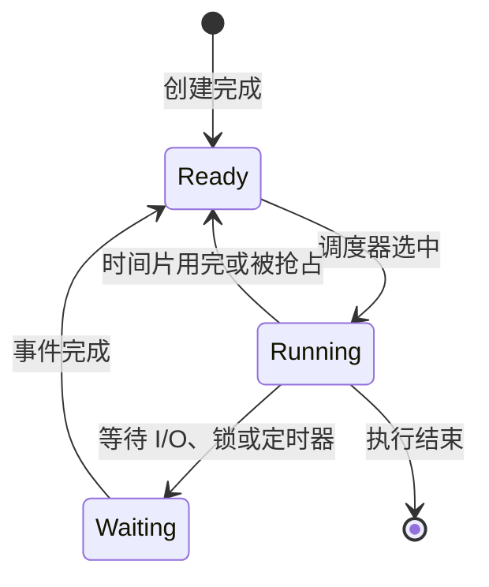
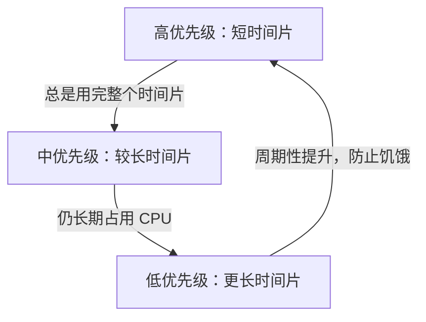

# CPU 调度：操作系统怎样决定下一个运行谁

一台计算机通常同时存在很多线程，但可以真正执行指令的 CPU 数量有限。**CPU 调度（CPU scheduling）**就是操作系统从“已经可以运行”的线程中选择一个，把 CPU 交给它。

调度不是为了让所有任务同时运行——单个 CPU 在一个瞬间只能执行一条指令流。调度要解决的是：怎样在有限 CPU 上兼顾响应速度、完成量、公平性和任务优先级。

## 1. 调度对象与三个队列

现代操作系统通常调度线程。进程提供地址空间和资源容器，线程才是实际执行指令、可以被暂停和恢复的执行单元。

先区分三个集合：

| 集合 | 里面是谁 | 为什么不在 CPU 上 |
|---|---|---|
| 就绪队列 | 已具备运行条件的线程 | 正在等待 CPU |
| 运行集合 | 当前正在某个 CPU 上执行的线程 | 已得到 CPU |
| 等待队列 | 等待 I/O、锁、定时器等事件的线程 | 条件尚未满足，给它 CPU 也无法继续 |



等待中的线程不会与就绪线程争抢 CPU。设备完成、锁可用或定时器到期时，内核只是把它唤醒到就绪队列；它仍要等调度器选中才能继续执行。

## 2. 什么时候会重新调度

调度点常见于四种情况：

1. 运行线程阻塞，例如读取尚未到达的网络数据；
2. 运行线程退出；
3. 运行线程的时间片用完；
4. 更应该运行的线程变为就绪，内核决定抢占当前线程。

前两种情况下，当前线程已经不能继续，操作系统必须选择别人。后两种需要**抢占式调度**：操作系统可以在一个线程主动放弃 CPU 之前暂停它。

早期系统也使用非抢占式调度：线程一直运行到阻塞或结束。实现简单，但一个长任务可能让其他任务很久得不到响应。通用桌面和服务器操作系统通常采用抢占式调度。

## 3. 调度过程保存了什么

从线程 A 切换到线程 B 时，内核要保存 A 以后继续执行所需的状态，例如程序计数器、栈指针和通用寄存器，再恢复 B 的对应状态。这叫**上下文切换（context switch）**。

上下文切换本身不完成业务工作，还可能扰动 CPU Cache 和 TLB，因此不是越多越好。但为了让等待中的任务及时响应、让多个程序共享 CPU，它又不可避免。

不要混淆：

- 用户态进入内核态是权限级变化；
- 线程 A 换成线程 B 才是任务上下文切换；
- 一次系统调用可以进入内核后立刻返回，未必换线程。

## 4. 用哪些指标评价调度算法

假设任务从到达到完成经历了一段时间：

- **周转时间** = 完成时刻 − 到达时刻，表示用户等了多久才全部完成；
- **等待时间** = 在就绪队列里等待 CPU 的总时间；
- **响应时间** = 第一次得到 CPU 的时刻 − 到达时刻，适合评价交互程序是否很快开始响应；
- **吞吐量** = 单位时间完成的任务数；
- **CPU 利用率** = CPU 忙于执行任务的时间比例；
- **公平性** = 可运行任务是否长期都能得到合理机会。

这些目标可能冲突。缩短平均周转时间的算法可能让长任务饥饿；频繁轮换可以改善响应，却增加切换开销。不存在脱离工作负载的“永远最优算法”。

## 5. 先来先服务 FCFS

**先来先服务（First-Come, First-Served，FCFS）**按到达顺序运行任务，通常不抢占。

三个任务在时刻 0 同时到达，CPU 执行时间分别是 A=8、B=4、C=1。按 A、B、C 执行：

```text
时间   0        8    12  13
       |--- A ---|--B--|-C|
等待   A=0, B=8, C=12
平均等待 = (0 + 8 + 12) / 3 = 6.67
```

优点是规则简单，不会因为估计错误改变顺序。缺点是**护航效应（convoy effect）**：一个长任务挡在前面，许多短任务都要等待。

## 6. 短作业优先 SJF 与最短剩余时间 SRTF

**短作业优先（Shortest Job First，SJF）**先运行预计 CPU 时间最短的任务。如果 A、B、C 同时到达，按 C、B、A：

```text
时间   0  1    5        13
       |C|--B--|--- A ---|
等待   C=0, B=1, A=5
平均等待 = (0 + 1 + 5) / 3 = 2
```

在所有任务同时到达且执行时间已知的模型中，SJF 能最小化平均等待时间。**最短剩余时间优先（Shortest Remaining Time First，SRTF）**是其抢占版本：新到任务的预计剩余时间更短时，可以抢占当前任务。

现实困难在于操作系统通常不知道任务下一段 CPU 执行会持续多久，只能根据历史行为估计。长任务还可能不断被短任务插队，形成**饥饿（starvation）**。

## 7. 时间片轮转 RR

**时间片轮转（Round Robin，RR）**让每个就绪任务最多运行一个时间片，然后放到队尾。

仍假设 A=8、B=4、C=1，时间片为 2：

```text
0-2 A | 2-4 B | 4-5 C | 5-7 A | 7-9 B | 9-11 A | 11-13 A
```

C 在时刻 4 第一次得到 CPU，明显早于 FCFS 中的时刻 12。RR 因此适合关注交互响应的系统。

时间片选择有取舍：

- 太长时，RR 逐渐接近 FCFS，后到短任务响应变慢；
- 太短时，上下文切换占比增大；
- 合适值依赖硬件、任务和系统目标，不能背一个通用数字。

## 8. 优先级调度与老化

**优先级调度**先运行优先级更高的任务。优先级可以来自业务重要性，也可以由操作系统根据等待时间和行为动态调整。

如果高优先级任务持续到来，低优先级任务可能永远运行不到。常见缓解方法是**老化（aging）**：任务等待越久，逐步提高它的有效优先级。

还要警惕**优先级反转**：低优先级线程持有锁，高优先级线程等待这把锁，而中优先级线程不断抢占低优先级线程，反而让高优先级线程长时间无法继续。实时系统可以使用**优先级继承**，临时提高持锁者的优先级，使它尽快释放锁。

## 9. 多级反馈队列 MLFQ

**多级反馈队列（Multi-Level Feedback Queue，MLFQ）**设置多个优先级队列，并根据线程行为移动它：

1. 新任务先进入高优先级队列，获得较短时间片，因此能快速响应；
2. 经常用完整个时间片的 CPU 密集任务逐渐下移；
3. 经常在时间片结束前主动等待 I/O 的交互任务通常留在较高层；
4. 系统定期提升等待过久的任务，避免饥饿。



MLFQ 的核心不是记住某组队列参数，而是在不知道未来执行时间时，用过去行为近似区分交互型与 CPU 密集型任务。

## 10. 多核调度增加了什么问题

多个 CPU 可以并行运行多个线程，调度器还要解决：

- **负载均衡**：一个 CPU 很忙而另一个空闲时，移动部分任务；
- **处理器亲和性**：尽量让线程留在最近运行过的 CPU，复用缓存中的代码和数据；
- **共享资源竞争**：同一核心的硬件线程、共享 Cache 和内存带宽都会影响彼此；
- **NUMA 位置**：在非统一内存访问系统中，线程靠近其常用内存通常更合适。

亲和性与负载均衡会冲突。把线程迁走可能立刻获得空闲 CPU，却失去原 CPU 的缓存状态。通用调度器会在二者之间折中。

## 11. 实时调度关心截止时间

实时系统关心任务能否在**截止时间（deadline）**前完成，而不只是平均响应速度。

- **硬实时**：错过截止时间会造成不可接受的结果；
- **软实时**：偶尔错过会降低质量，但系统仍可继续运行。

经典模型包括固定优先级的速率单调调度和动态优先级的最早截止时间优先。能否调度不能只凭“优先级很高”判断，还要知道每个周期内的计算量、周期和截止时间。

Linux 的普通调度类别主要服务通用任务，另有实时与 deadline 调度策略。应用设置实时优先级前必须控制最坏执行时间并保留系统维护能力；一个不阻塞的高优先级死循环可能让普通任务无法运行。

## 12. Linux 调度只需先理解这些

Linux 的具体实现会演进，面试基础不应依赖某个内核版本的内部字段。稳定的理解是：

1. 调度单位是可运行任务，通常对应线程；
2. 普通任务之间要兼顾公平性、响应与多核负载；
3. 睡眠任务不消耗时间片竞争 CPU，事件到来后重新进入可运行状态；
4. `nice` 等接口影响普通任务的相对权重，不承诺精确的运行时间；
5. 实时策略与普通策略的规则不同，误用可能饿死系统服务。

调度器的版本级数据结构属于内核开发主题，理解上述契约后再按当前官方文档学习。

## 13. 常见误解

- **“线程被唤醒就立即运行。”** 唤醒只把线程放回就绪队列。
- **“CPU 利用率最高就是最好。”** 队列已经严重堆积时，CPU 也可能一直 100%，但响应很差。
- **“时间片越短越公平，所以越好。”** 过短会让切换开销变大。
- **“优先级高就一定先完成。”** 它仍可能等待锁、I/O 或更高优先级任务。
- **“多核只需把单核算法复制多份。”** 还要平衡负载、缓存位置和共享资源。
- **“线程多于 CPU 就一定更快。”** CPU 密集任务会竞争有限执行资源；等待型任务才可能借并发隐藏等待。

## 14. 应用中的调度问题

| 场景 | 先问什么 | 对应基础 |
|---|---|---|
| Web 服务线程池 | 任务是算 CPU 还是等下游？队列是否有上限？ | 就绪、等待、吞吐与响应 |
| AI 推理服务 | 预处理、模型计算和后处理分别占哪种资源？ | 多核、加速器等待与负载均衡 |
| 数据库 | 锁持有者是否因为过度并发迟迟得不到 CPU？ | 抢占、优先级反转、队列 |
| HFT | 哪些关键线程需要明确的 CPU 资源，后台任务怎样隔离？ | 亲和性、共享资源与可运行队列 |

应用优化应先测量运行、就绪等待、I/O 等待和锁等待各占多少，再决定增加线程、减少并发还是调整资源。

## 做题方法

调度计算题统一先画 Gantt 图，再从图计算指标：

1. 列出每个进程的到达时间、CPU burst、优先级和剩余时间，并抄清“数值越大优先级越高还是越低”等题设规则。
2. 每到一个到达、完成、时间片耗尽或优先级变化的事件点，重新决定就绪队列；没有事件时不要凭空抢占。
3. FCFS/SJF/SRTF/优先级题遇到并列必须写出 tie-break 规则，通常再按到达顺序；不同规则可能产生不同但都自洽的图。
4. RR 题维护真实队列：时间片结束的进程与同一时刻新到达进程谁先入队，要依题设确定。上下文切换成本若给出，必须画进时间轴。
5. 从完成时刻反算：`周转时间 = 完成 - 到达`，`等待时间 = 周转 - 实际运行`，`响应时间 = 第一次运行 - 到达`。抢占式算法不能把响应时间误写成等待时间。
6. 所有进程的 CPU burst 总和，加上空闲和切换开销，应等于 Gantt 图总长度；这是最有效的验算。

MLFQ 题还要逐时刻记录队列级别、剩余时间片和周期性优先级提升，不能只凭“短任务优先”的直觉判断。

## 15. 思考题与面试追问

1. 线程处于 Waiting 与 Ready 时，为什么只有后者能被调度？
2. FCFS 为什么会产生护航效应？用三个任务举例。
3. SJF 为什么在理想模型中平均等待时间短，现实为什么难以直接实现？
4. RR 的时间片过长或过短分别会怎样？
5. 饥饿与死锁有什么区别？老化解决哪一个？
6. 解释优先级反转，并说明优先级继承为什么有帮助。
7. MLFQ 怎样在不知道任务长度时近似照顾交互任务？
8. 多核调度为什么要同时考虑负载均衡和缓存亲和性？
9. 三个任务到达时间分别为 0、1、2，CPU 时间分别为 5、2、1。画出 FCFS、SRTF 和时间片为 2 的 RR 甘特图，计算平均等待时间和平均响应时间。
10. 为什么给普通服务设置实时优先级可能使整台机器失去响应？

### 参考答案与解答

<details><summary>展开答案</summary>

1. Waiting 还缺 I/O、锁或定时事件，分配 CPU 也无法前进；Ready 已具备全部运行条件，只缺 CPU，所以可进入调度候选。
2. 例：A=20 ms、B=2 ms、C=1 ms 同时到达，FCFS 若先 A，则 B/C 分别等 20/22 ms，短任务被长任务护送；若短任务先，平均等待显著降低。
3. 对已知 burst，交换论证可说明短作业先执行降低平均等待；现实无法准确知道未来 CPU burst，预测会错，且纯 SJF 还可能让长任务饥饿。
4. 时间片过长时 RR 接近 FCFS、交互响应差；过短则上下文切换、缓存扰动和调度开销占比升高。
5. 死锁是一组参与者循环等待、都无法前进；饥饿是某参与者长期得不到资源，但系统其他部分仍前进。老化逐渐提高等待者优先级，缓解饥饿。
6. 高优先级 H 等低优先级 L 持有的锁，中优先级 M 又不断抢占 L，H 被间接拖延。优先级继承临时把 L 提升到 H 的优先级，使其尽快释放锁。
7. 新任务先进入高优先级短时间片队列；频繁主动阻塞的交互任务保留较高优先级，持续用满 CPU 的任务逐级下沉，周期提升防止饥饿。
8. 把线程迁到空闲核可平衡负载，却会丢失该核上的热 Cache/TLB 状态；保持亲和性提高局部性，但可能让一个核排队、另一个核空闲。
9. 设 A `(arr=0,burst=5)`、B `(1,2)`、C `(2,1)`。FCFS：`A[0,5) B[5,7) C[7,8)`，等待/响应均为 `(0,4,5)`，平均 `3`。SRTF（剩余相同让已运行者继续）：`A[0,1) B[1,3) C[3,4) A[4,8)`；等待 `(3,0,1)` 平均 `4/3`，响应 `(0,0,1)` 平均 `1/3`。RR `q=2`，同刻新到达先于刚用完时间片者入队：`A[0,2) B[2,4) C[4,5) A[5,8)`；等待 `(3,1,2)` 平均 `2`，响应 `(0,1,2)` 平均 `1`。CPU burst 总和均为 `8`，与图长一致。
10. 实时线程若不阻塞且优先级高于普通内核/服务线程，可能长期占满 CPU，使 SSH、日志、回收和 watchdog 都得不到运行。必须设置 CPU/时间预算、亲和性和故障回退。

</details>

## 参考依据

- 2025 年全国硕士研究生招生考试计算机学科专业基础考试大纲，操作系统“处理机调度”部分。
- Remzi H. Arpaci-Dusseau、Andrea C. Arpaci-Dusseau，《Operating Systems: Three Easy Pieces》，Scheduling 章节。
- Abraham Silberschatz 等，《Operating System Concepts》，CPU Scheduling 章节。
- Linux 内核文档，Scheduler 与 deadline scheduling 文档。
