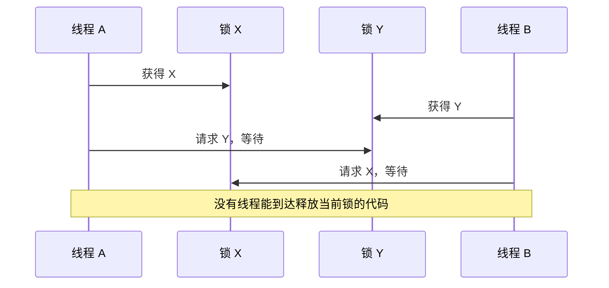
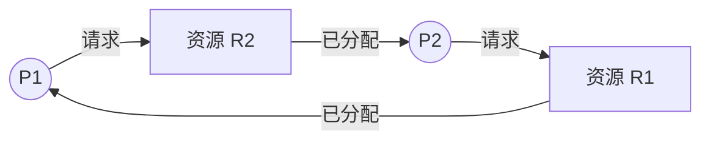

# 死锁：循环等待为什么让系统无法前进

两个线程各自持有一把锁，又都在等待对方释放另一把锁，它们就会永久停在等待状态。这不是某个函数执行得慢，而是资源依赖形成了无法自行解除的闭环。

本章先建立资源分配图和死锁四个必要条件，再比较预防、避免、检测与恢复。同步原语本身见[操作系统同步](os_synchronization.md)；本章只讨论多个资源请求组合后产生的活性问题。

## 1. 什么是死锁

**死锁（deadlock）**指一组进程或线程中的每个成员，都在等待只能由这组中的其他成员触发的事件，导致所有成员都无法继续。

经典的两锁死锁：

```text
线程 A 已持有锁 X，接着等待锁 Y
线程 B 已持有锁 Y，接着等待锁 X
```



死锁可以涉及锁、设备、文件记录、数据库事务或其他必须独占的资源。分析时不要只说“两个线程卡住了”，而要列出每个执行者已经持有什么、还在等什么，以及谁能够释放它。

## 2. 可抢占资源与不可抢占资源

**资源（resource）**是执行任务所需、数量有限或需要排他使用的对象。根据系统能否安全地强制收回，可以分成：

- **可抢占资源（preemptable resource）**：系统可以暂停使用者并收回资源，之后还能恢复或重新分配。例如 CPU 使用权可以由调度器抢占；某些内存页在保存状态后可以换出。
- **不可抢占资源（non-preemptable resource）**：强行收回会破坏正在进行的操作或状态。例如线程持有的普通 mutex，或正在写入且无法回滚的设备操作。

“能否抢占”取决于是否能保存并恢复状态，而不只取决于资源名字。数据库可以通过事务回滚让部分逻辑资源可撤销；没有回滚协议的相同操作则可能不能安全抢占。

资源还可能有一个或多个**实例（instance）**。一把锁只有一个实例；一个含 10 个相同连接的池则有 10 个实例。实例数量会影响环路是否足以证明死锁。

## 3. 用资源分配图画清依赖

**资源分配图（resource-allocation graph）**用两类节点和两类有向边描述关系：

- 进程或线程节点记为 `P`；
- 资源类型节点记为 `R`；
- 请求边 `P → R` 表示执行者正在等待资源；
- 分配边 `R → P` 表示某个资源实例已经分配给执行者。



图中形成 `P1 → R2 → P2 → R1 → P1` 的环。

- 每种资源都只有一个实例时，图中存在环是死锁的充分必要条件；
- 某种资源有多个实例时，环仍是可能死锁的必要信号，但仅有环不一定已经死锁，因为环外或环内的另一个实例可能被释放。

分析多实例资源时，需要进一步检查当前可用数量、每个进程仍需要多少，以及是否存在某个完成顺序。

## 4. 死锁的四个必要条件

死锁发生时，下面四个条件必须同时成立，也称 Coffman 条件：

1. **互斥（mutual exclusion）**：至少一种资源同一时刻只能由一个执行者使用；
2. **占有并等待（hold and wait）**：执行者持有至少一个资源，同时等待其他资源；
3. **不可抢占（no preemption）**：资源不能被系统安全地强制收回，只能由持有者主动释放；
4. **循环等待（circular wait）**：存在 `P1` 等 `P2`、`P2` 等 `P3`、最终某个成员又等待 `P1` 的环。

四个条件是**必要条件**，不是“看到其中一个就已经死锁”。破坏任意一个条件可以预防死锁，但通常会降低并发度、资源利用率或编程便利性。

## 5. 四类处理策略

系统面对死锁通常有四种选择：

| 策略 | 核心思想 | 何时付出代价 |
|---|---|---|
| 忽略 | 认为死锁很少，交给人工重启或上层恢复 | 故障发生后 |
| 预防 | 设计规则，确保四个必要条件至少一个永远不成立 | 每次资源使用时 |
| 避免 | 每次分配前判断是否仍处于安全状态 | 每次动态分配时 |
| 检测与恢复 | 允许死锁发生，定期检测后终止、回滚或抢占 | 检测和故障恢复时 |

没有一项策略适合所有系统。普通应用的 mutex 常通过全局锁顺序预防；数据库可能使用等待图检测并中止一个事务；操作系统对许多一般资源并不会运行完整银行家算法。

## 6. 死锁预防：主动破坏必要条件

### 6.1 破坏互斥

若资源可以共享只读副本、不可变快照或消息传递，就不需要互斥占有。例如只读配置可由多个线程共享。

但有些资源天然需要独占，例如修改同一文件位置或操作同一设备状态，互斥无法完全消除。

### 6.2 破坏占有并等待

一种规则是执行前一次申请全部资源，只有全部可得才开始；另一种是申请新资源前先释放当前持有资源。

代价是资源可能被提前占住却长期不用，降低利用率；而且程序未必能预先知道全部需求。释放后重试还要求中间状态可以安全撤销。

### 6.3 破坏不可抢占

请求新资源失败时，要求执行者释放已持有资源，稍后重新申请。它只适合状态能够保存、回滚或重新开始的资源。

不能简单从任意线程手里“夺走 mutex”，因为被保护的数据可能正处于修改到一半的不一致状态。

### 6.4 破坏循环等待

给所有资源类型规定全局顺序，只允许按递增顺序申请。例如规定 `配置锁 < 用户锁 < 订单锁`：已经持有订单锁的代码不能再申请用户锁。

若所有线程都遵守同一严格顺序，就不可能形成首尾相接的等待环。这是工程中最常用、也最容易审查的预防方式之一。

## 7. 安全状态与死锁避免

**死锁避免（deadlock avoidance）**不禁止占有并等待，而是在每次分配前判断：假设现在批准请求，系统是否仍能保证存在一种完成所有进程的顺序。

如果存在这样的顺序，系统处于**安全状态（safe state）**，该顺序称为**安全序列（safe sequence）**。

要区分三种状态：

- 安全：至少存在一个能让所有进程依次完成的顺序；
- 不安全：无法保证存在安全序列，但当前不一定已经死锁；
- 死锁：已经有一组进程互相等待且无法前进。

不安全状态表示未来某种请求顺序可能导致死锁，所以避免算法拒绝进入不安全状态。

## 8. 银行家算法完整算例

**银行家算法（Banker's algorithm）**把资源分配类比为银行放贷：只有确认即使满足当前请求，剩余资源仍足以按某个顺序让所有客户完成并归还资源，才批准请求。

设资源类型为 A、B、C。系统当前可用资源：

```text
Available = (3, 3, 2)
```

每个进程当前已经得到的资源 `Allocation` 和声明的最大需求 `Max` 为：

| 进程 | Allocation | Max | Need = Max - Allocation |
|---|---|---|---|
| P0 | (0, 1, 0) | (7, 5, 3) | (7, 4, 3) |
| P1 | (2, 0, 0) | (3, 2, 2) | (1, 2, 2) |
| P2 | (3, 0, 2) | (9, 0, 2) | (6, 0, 0) |
| P3 | (2, 1, 1) | (2, 2, 2) | (0, 1, 1) |
| P4 | (0, 0, 2) | (4, 3, 3) | (4, 3, 1) |

安全性检查使用临时向量 `Work`，初始等于 `Available`。每次寻找一个尚未完成且满足 `Need ≤ Work` 的进程，假设它得到剩余需求、完成并归还当前持有资源，于是：

```text
Work = Work + Allocation[该进程]
```

逐步检查：

| 步骤 | 当前 Work | 可完成进程及原因 | 完成后 Work |
|---:|---|---|---|
| 1 | (3, 3, 2) | P1，Need (1, 2, 2) ≤ Work | (5, 3, 2) |
| 2 | (5, 3, 2) | P3，Need (0, 1, 1) ≤ Work | (7, 4, 3) |
| 3 | (7, 4, 3) | P4，Need (4, 3, 1) ≤ Work | (7, 4, 5) |
| 4 | (7, 4, 5) | P0，Need (7, 4, 3) ≤ Work | (7, 5, 5) |
| 5 | (7, 5, 5) | P2，Need (6, 0, 0) ≤ Work | (10, 5, 7) |

因此存在安全序列：

```text
<P1, P3, P4, P0, P2>
```

系统当前处于安全状态。安全序列不要求进程实际严格按这个顺序运行；它证明至少存在一条能够让所有进程完成的路径。

### 8.1 新请求怎样检查

若进程 `Pi` 请求向量 `Request[i]`，先检查：

1. `Request[i] ≤ Need[i]`，否则它超过自己声明的最大需求；
2. `Request[i] ≤ Available`，否则当前资源不够，只能等待；
3. 暂时假设完成分配，更新 Available、Allocation 和 Need；
4. 对假设后的状态运行安全性检查；安全才真正批准，否则回滚假设并让请求等待。

银行家算法需要事先知道最大需求，并在每次请求时做检查，因此更适合需求上界明确的教学和特定资源系统，不是所有通用锁的默认实现。

## 9. 死锁检测

### 9.1 每种资源只有一个实例

可以把资源分配图简化成**等待图（wait-for graph）**：节点只有进程；若 `Pi` 正在等待 `Pj` 持有的资源，就画边 `Pi → Pj`。图中存在环就表示发生死锁。

### 9.2 资源有多个实例

检测算法需要知道：

- 当前 `Available`；
- 每个进程当前持有的 `Allocation`；
- 每个进程当前尚未满足的 `Request`。

算法反复寻找 `Request[i] ≤ Work` 的进程，假设它能完成并归还 `Allocation[i]`。如果最终仍有一组持有资源的进程无法被标记为可完成，它们就是检测出的死锁候选集合。

它与银行家安全性检查的形状相似，但问题不同：银行家使用最大未来需求来避免进入不安全状态；检测算法查看当前尚未满足的实际请求，判断死锁是否已经发生。

检测频率也是权衡。检查太频繁会增加开销；检查太晚，更多进程可能卷入依赖环，恢复代价更大。

## 10. 死锁恢复

检测到死锁后，系统必须打破至少一条等待关系。

### 10.1 终止进程或事务

- 一次终止所有死锁成员，恢复快但损失大；
- 每次终止一个成员并重新检测，损失可能较小但检测次数更多。

选择牺牲者时可以考虑优先级、已运行时间、持有资源数、剩余工作量、能否重试以及对外部系统是否已产生不可撤销副作用。

### 10.2 抢占资源与回滚

若任务支持保存点或事务回滚，可以从某个执行者收回资源，把它恢复到之前的一致状态，稍后重试。

必须解决三个问题：选择谁被回滚、回滚到哪里、怎样避免总是选择同一个牺牲者。第三个问题若忽略，会把死锁恢复变成饥饿。

## 11. 工程中最常用的边界

### 11.1 固定锁顺序

为锁建立全局等级，并在代码评审和测试中检查：

```text
允许：lock(rank 10) → lock(rank 20) → lock(rank 30)
禁止：已经持有 rank 30，又去 lock(rank 10)
```

对象数量动态变化时，可以按稳定键排序后再加锁，例如总是先锁 ID 较小的账户，再锁 ID 较大的账户。排序依据必须稳定且所有路径一致。

### 11.2 缩小持锁范围

不要持锁等待网络、磁盘、用户输入或外部回调。可以在锁内读取必要快照，释放锁后执行慢操作，再用版本号或重新检查处理状态变化。

但不能为了缩短临界区，把必须原子完成的不变量拆开。正确性优先于临界区看起来短。

### 11.3 `try_lock`、退避与超时

申请第二把锁失败时，释放第一把锁并稍后重试，可以破坏占有并等待。但若多个线程同时采用完全相同节奏，它们可能不断相互让步又同时重试，形成活锁。随机或分级退避可以降低这种同步碰撞，但仍需证明最终进展。

超时能让等待调用返回，却不自动证明系统没有死锁。只有在超时后能够安全取消操作、释放全部资源并处理已产生的副作用时，它才真正打破等待。把超时错误忽略后继续持锁，问题仍然存在。

## 12. 死锁、饥饿与活锁

| 问题 | 参与者是否在执行 | 为什么没有完成 |
|---|---|---|
| 死锁 | 通常都在阻塞等待 | 形成无法解除的循环资源依赖 |
| 饥饿（starvation） | 系统整体可能持续工作 | 某个任务长期得不到 CPU、锁或资源 |
| 活锁（livelock） | 参与者不断改变状态和重试 | 大家持续相互让步，却没有有效进展 |

例如，两个人在走廊相遇，每次都同时向相同方向让路，再同时改向另一边。他们一直在动，却无法通过，这是活锁。公平队列可缓解饥饿；统一资源顺序可预防一类死锁；二者不是同一个解决方案。

<details>
<summary>实现细节：检测工具能证明什么</summary>

一些内核、运行时、数据库和调试器可以记录锁依赖或线程等待关系，报告实际环路或潜在锁顺序反转。这些工具有助于发现已覆盖执行路径中的问题，但不能自动证明所有输入、错误路径和未来代码都不存在死锁。

工具输出还要结合资源语义解释：线程在条件变量、文件 I/O 或远程服务上等待很久，不一定构成资源环；没有环但永远得不到调度机会，则更接近饥饿。

</details>

## 13. 应用场景

- 传统后端常在多账户更新、连接池、缓存刷新和数据库事务中遇到资源顺序问题；
- AI 基础设施可能同时申请模型实例、GPU、主机内存和通信资源，需要统一申请顺序或可回滚的调度协议；
- HFT 等事件驱动系统常通过单一状态所有者和消息传递减少多锁组合，但运维、持久化和跨组件协调仍可能产生等待环。

行业不同，不会改变四个必要条件。分析时始终画出“谁持有什么、谁还在等什么”。

## 14. 常见误解

- **“程序不响应就是死锁。”** 也可能是慢 I/O、无限循环、饥饿或等待尚未到来的事件。
- **“有环就一定死锁。”** 只有每类资源单实例时可以直接这样判断；多实例还要检查可用数量。
- **“不安全状态就是已经死锁。”** 不安全表示无法保证未来安全完成，当前未必已有等待环。
- **“给锁加超时就不会死锁。”** 超时后的取消、回滚和资源释放必须正确，副作用也要处理。
- **“所有锁都改成 try_lock 就解决了。”** 不当重试可能形成活锁或饥饿。
- **“锁越少越安全。”** 一把锁可以消除锁顺序环，却可能扩大争用；拆锁后则必须重新设计顺序和不变量。
- **“银行家算法用于检测已经发生的死锁。”** 它根据最大需求避免进入不安全状态；检测算法使用当前请求判断现状。

## 15. 本章小结

- 死锁是一组执行者互相等待、无人能够触发下一步的活性故障；
- 资源分配图用请求边和分配边表示依赖，单实例资源中的环可直接证明死锁；
- 互斥、占有并等待、不可抢占和循环等待必须同时成立；
- 预防主动破坏必要条件，避免在分配前维持安全状态，检测与恢复允许死锁发生后处理；
- 银行家算法通过 `Available`、`Allocation`、`Max` 和 `Need` 寻找安全序列；
- 恢复可以终止任务或抢占并回滚资源，但要考虑副作用和牺牲者饥饿；
- 固定锁顺序是常见工程手段，`try_lock` 和超时只有配合安全回滚才有意义；
- 死锁、饥饿和活锁都没有正常完成工作，但原因和解决方法不同。

## 做题方法

死锁判断题先确定是在问“当前已死锁”还是“状态是否安全”：

1. 资源分配图中，进程到资源是请求边，资源实例到进程是分配边。单实例资源出现环可判死锁；多实例资源有环只说明可能死锁，还要继续计算。
2. 银行家算法先逐项算 `Need = Max - Allocation`，检查任何分量都不能为负；令 `Work = Available`。
3. 反复寻找一个尚未完成且 `Need_i <= Work` 的进程，把它加入安全序列，并令 `Work += Allocation_i`。比较是每一种资源的逐分量比较，不能把总数相加后比较。
4. 若所有进程都能加入，序列就是验算证据；若中途没有可选进程，当前状态不安全，但不等于它此刻已经死锁。
5. 新请求先检查 `Request_i <= Need_i` 和 `Request_i <= Available`，再做一次**假分配**并重新跑安全性算法；只满足“当前有资源”还不够。
6. 处理策略题先写它破坏或利用的条件：锁顺序预防循环等待，银行家算法避免进入不安全状态，检测算法允许死锁发生后再恢复。

最终资源守恒应满足 `系统总资源 = Available + ΣAllocation`。若每轮释放后 `Work` 反而减少，或安全序列中的进程需求超过当时 `Work`，推演一定有误。

## 16. 思考题、408 题与面试追问

1. 两线程、两把锁怎样形成死锁？请同时画等待关系并指出四个必要条件。
2. 为什么 CPU 是可抢占资源，而普通 mutex 通常不能被系统直接从持有线程手中夺走？
3. 资源分配图中出现环时，为什么多实例资源不能立即断言已经死锁？
4. 一次申请全部资源破坏了哪个条件？它会带来什么资源利用率问题？
5. 全局锁顺序为什么能破坏循环等待？动态对象应怎样确定稳定顺序？
6. 重新计算本章银行家算例，验证 `<P3, P1, P4, P0, P2>` 是否也是安全序列。
7. 在本章初始状态下，若 P1 请求 `(1, 0, 2)`，请先做两项上界检查，再假设分配并寻找一条安全序列。
8. 安全、不安全和死锁三种状态有什么区别？为什么避免算法会拒绝不安全但尚未死锁的状态？
9. 单实例资源可以怎样从资源分配图得到等待图？检测到环后有哪些恢复选择？
10. 两个线程都采用“拿不到第二把锁就释放第一把并立刻重试”，为什么可能形成活锁？
11. 超时在哪些前提下能够安全打破等待？若操作已修改外部系统，应怎样处理？

### 参考答案与解答

<details><summary>展开答案</summary>

1. 线程 A 持 L1 等 L2，线程 B 持 L2 等 L1：`A→L2→B→L1→A`。L1/L2 互斥、双方占有并等待、锁不可被外部强抢、依赖成环，四条件同时成立。
2. 调度器可暂停线程并把 CPU 给别人，CPU 上的执行状态可保存/恢复；mutex 保护的临界区可能正处于不变量中间，强夺会让另一个线程看到破坏状态，所以通常不可抢占。
3. 多实例图中的环上进程可能从资源的另一个空闲实例得到满足并完成，继而释放资源；必须结合 Available/Allocation/Request 做检测。
4. 一次申请全部资源使进程不再“持有一部分同时等待另一部分”，破坏占有并等待；但资源会提前闲置在持有者手中，降低利用率与并发。
5. 若所有线程只按全局递增顺序拿锁，等待边只能从小编号指向大编号，不可能绕回形成环。动态对象可用稳定 ID/地址排序，但地址重用和对象寿命必须受控。
6. 初始 `Work=(3,3,2)`：P3 完成后 `(5,4,3)`；P1 后 `(7,4,3)`；P4 后 `(7,4,5)`；P0 后 `(7,5,5)`；P2 后 `(10,5,7)`。每步 `Need≤Work`，所以 `<P3,P1,P4,P0,P2>` 安全。
7. P1 请求 `(1,0,2)≤Need(1,2,2)`，且 `≤Available(3,3,2)`。假分配后 `Available=(2,3,0)`、P1 `Allocation=(3,0,2)`、`Need=(0,2,0)`。安全序列可取 P1→P3→P4→P0→P2，Work 依次为 `(5,3,2)→(7,4,3)→(7,4,5)→(7,5,5)→(10,5,7)`，请求可批准。
8. 安全状态存在至少一条完成序列；不安全状态没有当前可证明的安全序列，但未必已形成等待环；死锁是参与者当前已无法前进。避免算法拒绝不安全状态，是为了不把系统暴露给某种未来请求顺序。
9. 删除资源节点，把“Pi 等待的资源正由 Pj 持有”变为 `Pi→Pj`；单实例等待图有环即死锁。恢复可终止一个/多个进程、回滚事务、抢占可安全恢复的资源，并选择代价/饥饿策略。
10. 两线程步调一致地拿第一把、失败、释放、重试，状态不断变化却都不进入临界区，是活锁。随机退避、排队或统一锁序可打破同步重试。
11. 超时仅在等待可取消、已持资源能可靠释放、操作具幂等/回滚语义时能安全退出。外部修改后超时表示结果未知，应使用操作 ID 查询事实源并对账，确认未执行才重试，否则补偿或人工处理。

</details>

## 权威依据

- [2025 年 408 计算机学科专业基础考试大纲（高校公开附件）](https://www.uwh.edu.cn/uploads/article/20250609/660428d58334252302af691bf99e064e.pdf)
- [OSTEP 官方目录：Concurrency Bugs 与 Deadlock](https://pages.cs.wisc.edu/~remzi/OSTEP/)
- [Operating System Concepts, 10th Edition 官方目录](https://os-book.com/OS10/toc-dir/toc.pdf)
- [Operating System Concepts 官方第 8 章练习入口](https://www.os-book.com/OS10/regular-exercises/index-exer.html)
