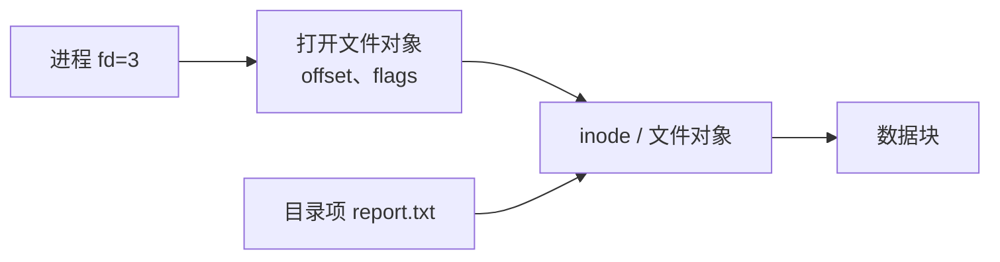
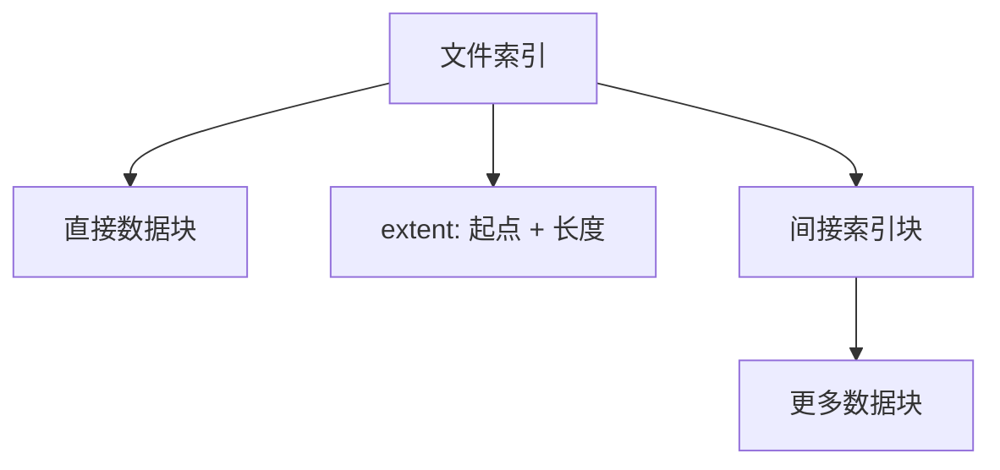
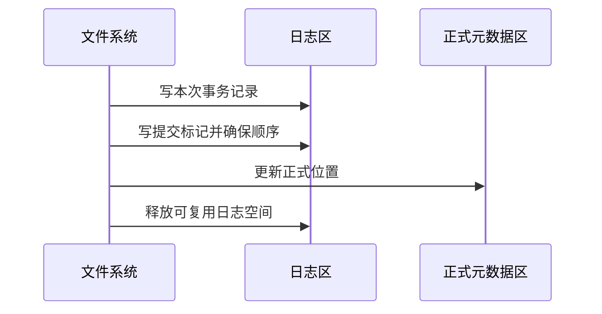

# 文件系统：名字怎样找到数据

存储设备只提供一大片可按块读写的空间。应用却希望按名字创建文件、建立目录、控制权限，并在重启后继续找到数据。**文件系统（file system）**就是操作系统把“块”组织成“文件、目录和元数据”的规则与实现。

本章回答文件是什么、路径怎样解析、数据块怎样分配以及崩溃后怎样恢复结构。一次 `write` 从用户缓冲区到设备的动态过程，见[一次文件写入](file_write_path.md)。

## 1. 文件、目录、路径和元数据

**文件**是带名字使用的一段持久数据。对普通文件，应用通常把它看成从偏移 0 开始的字节序列。文件系统还要保存描述文件的信息，称为**元数据（metadata）**，例如：

- 文件类型；
- 大小；
- 所有者与访问权限；
- 创建、修改、访问等时间；
- 数据位于哪些存储块；
- 链接计数。

**目录**不是把文件内容包在里面的盒子，而是一种从名字到文件对象标识的映射。`/home/alice/a.txt` 是一条**路径**：从根目录开始依次查找 `home`、`alice`、`a.txt`。


同一个文件对象可以有多个名字，所以“目录项”和“文件本身”不能画等号。

## 2. inode、目录项与打开文件

以 Unix 类文件系统为例，**inode** 是保存文件类型、权限、大小、时间和数据块位置等元数据的对象。文件名通常保存在目录项中，目录项把名字映射到 inode 编号。

```text
目录项："report.txt" -> inode 42
inode 42：普通文件，大小 8192，权限 0644，数据块 [...]
```

Linux 内核还使用 **dentry（目录项缓存对象）**缓存路径组成部分的解析结果。它是内存中的 VFS 对象，不应和磁盘上某种固定目录格式混为一谈。

程序 `open` 成功后得到**文件描述符（fd）**。fd 是当前进程表中的小整数，指向内核的打开文件对象；打开文件对象再记录当前偏移、打开标志以及目标文件。完整关系见[进程、线程与文件描述符](processes_fds.md)。



这解释了为什么重命名文件后，已经打开的 fd 仍然可以使用：fd 指向已打开对象，不是每次读写都重新按原路径查找。

## 3. 路径解析具体做什么

解析绝对路径 `/a/b/c` 时，内核大致进行：

1. 从进程可见的根目录开始；
2. 在当前目录查找名字 `a`，并检查搜索权限；
3. 确认它是目录，再查 `b`；
4. 继续到最后一个组成部分 `c`；
5. 处理符号链接、挂载点以及 `.`、`..` 等规则；
6. 根据操作类型检查目标和父目录权限。

相对路径从进程的当前工作目录或接口给定的目录 fd 开始。路径解析中每一级都可能失败，例如中间目录不存在、权限不足、符号链接形成循环，或最后目标类型不符。

路径在安全敏感程序中还存在检查后被替换的竞态。需要相对某个可信目录操作时，应优先使用 `openat` 一类以目录 fd 为锚点的接口和平台提供的限制选项，而不是先拼字符串、检查一次再打开。

## 4. 硬链接与符号链接

### 硬链接

**硬链接（hard link）**是在目录中再增加一个名字，让它指向同一个 inode：

```text
目录项 A ─┐
          ├──> inode 42 ──> 数据
目录项 B ─┘
```

删除 A 只是移除一个目录项并减少链接计数；只要还有硬链接，或进程仍持有打开引用，文件对象和数据就不一定立刻释放。硬链接通常不能跨文件系统，因为 inode 编号只在所属文件系统内有意义；为了避免目录图形成复杂环，普通用户通常也不能为目录任意创建硬链接。

### 符号链接

**符号链接（symbolic link）**是内容保存另一条路径的特殊文件。解析时内核读取这条路径并继续查找：

```text
symlink latest -> releases/v2/report.txt
```

它可以跨文件系统，也可能在目标删除后变成悬空链接。符号链接有自己的 inode；对链接本身操作还是跟随目标，要由具体接口和标志决定。

| 对比 | 硬链接 | 符号链接 |
|---|---|---|
| 指向什么 | 同一个文件对象/inode | 一条路径文本 |
| 目标删除后 | 其他硬链接仍能访问数据 | 可能悬空 |
| 能否跨文件系统 | 通常不能 | 可以 |
| 是否有独立 inode | 目录项共同指向目标 inode | 链接自身是特殊文件 |

## 5. 文件的逻辑结构与访问方式

普通文件常按字节序列提供接口。应用可以：

- **顺序访问**：从当前偏移依次读写；
- **随机访问**：指定偏移读写；
- **内存映射**：把文件页映射进虚拟地址空间，以加载/存储指令访问。

偏移允许文件出现**稀疏区域**：逻辑大小很大，但中间一段没有实际分配数据块；读取洞通常得到零，只有写入时才分配存储。文件大小因此不一定等于实际占用块数。

## 6. 数据块怎样分配

教材中的三类基本方法帮助理解取舍。

### 连续分配

文件占据连续块，只需记录起始块和长度。顺序和随机访问都简单，但文件增长困难，也会产生外部碎片。

### 链式分配

每个数据块指向下一个块。文件容易增长，没有外部碎片；但随机访问要沿链查找，指针损坏也会影响后续块。FAT 文件系统把“下一个块”指针集中到文件分配表中，改善了部分访问和管理方式。

### 索引分配

一个索引块或树状索引保存文件各数据块的地址，支持随机访问。小文件若分配巨大索引会浪费空间，因此 Unix inode 常组合直接指针和一级、二级、三级间接索引；现代文件系统也常用 **extent（区段）**记录一段连续块的起点与长度，减少大文件的索引项。



真实 ext4、XFS、APFS、NTFS 等实现不等同于某一种教材模型，但都必须在查找速度、增长、碎片和元数据开销之间折中。

## 7. 空闲块怎样管理

文件删除后，文件系统要记住哪些块可以重新使用。常见方法包括：

- **位图**：每个块用一位表示空闲或占用，容易找到连续空闲区，但位图本身要占空间；
- **空闲链表**：空闲块互相链接，实现简单，寻找大段连续空间较慢；
- **分组/计数**：记录一组空闲块地址，或记录连续空闲范围的起点和长度。

分配器还会尽量把同一文件或同一目录的数据放得相近，减少旋转磁盘寻道，并提高顺序访问和预读效果。固态设备没有机械寻道，但连续布局仍可能减少映射和请求数量。

## 8. VFS 与挂载

Linux 的 **VFS（Virtual File System，虚拟文件系统层）**为 ext4、XFS、tmpfs、网络文件系统等提供统一的 `open/read/write` 等接口。VFS 不是一个磁盘格式，而是内核中的共同对象模型和分派层。

**挂载（mount）**把一个文件系统的根连接到现有目录树中的某个目录：

```text
挂载前：/mnt/data 是普通目录
挂载后：访问 /mnt/data/... 会进入另一个文件系统
```

因此 Unix 只有一棵可见目录树，而不是每个设备各有一个盘符。容器或进程还可以拥有不同的 mount namespace，看到不同的挂载关系。

## 9. 权限检查保护什么

传统 Unix 权限为所有者、所属组和其他用户分别提供读、写、执行位。权限含义随对象类型不同：

| 对象 | 读 | 写 | 执行/搜索 |
|---|---|---|---|
| 普通文件 | 读取内容 | 修改内容 | 作为程序执行 |
| 目录 | 列出名字 | 创建、删除、重命名目录项 | 按名字穿过/查找目录 |

删除文件通常修改的是父目录，所以是否能删除不只由文件本身的写位决定。访问控制列表、能力、强制访问控制和挂载选项还能增加规则。本章先掌握对象与检查位置，不把 `0777` 当作解决权限问题的默认办法。

## 10. 页缓存把文件与内存连接起来

Linux 通常把读到的文件内容缓存在 RAM 的**页缓存**中。后续读取可直接复用；普通 buffered write 也通常先修改页缓存并标脏，稍后回写。

`read/write` 与文件 `mmap` 最终可以观察同一文件的缓存页，但接口语义不同。缓存可见不等于已经持久化；`fsync`、设备写缓存和目录项持久性见[一次文件写入](file_write_path.md)。

## 11. 崩溃一致性与日志

创建文件可能同时修改目录、inode、空闲空间位图和数据块。断电可能发生在任意两次写之间。如果只写完其中一部分，文件系统结构会自相矛盾。

**文件系统日志（journaling）**先把一组元数据更新的意图或新内容写入日志并形成可识别的提交，再更新正式位置。重启后，文件系统可以根据已提交记录重放，或忽略未提交事务。



日志主要保证文件系统结构可恢复，不自动保证应用的多文件业务事务。数据库仍需要 WAL、事务协议和恢复逻辑；应用发布文件仍要理解 `fsync` 与 `rename` 的顺序。

其他文件系统可能使用写时复制树等策略。具体崩溃保证必须查目标文件系统、挂载选项和存储设备契约，不能从“有日志”推出所有最近写入都已保存。

## 12. 删除、打开与空间回收

Unix 风格系统中，`unlink` 删除名字，而不是强制使所有打开 fd 失效：

1. 目录项被移除，链接计数减少；
2. 已打开文件的进程仍可通过 fd 访问对象；
3. 当链接计数为零且没有打开引用时，文件系统才可回收 inode 和数据块。

这允许程序创建临时文件后立即 unlink，继续通过 fd 使用，进程退出后自动回收。也解释了日志文件被删除后磁盘空间为何可能没有立刻回来：仍有进程持有打开引用。

## 13. 常见误解

- **“文件名保存在 inode 里。”** Unix 模型中，名字在目录项里，inode 保存文件元数据。
- **“一个文件只有一个名字。”** 硬链接可让多个目录项指向同一文件对象。
- **“删除文件后 fd 立即失效。”** 已打开引用通常仍可使用，最后引用释放后才回收。
- **“目录执行权限表示运行目录。”** 它表示搜索/穿过目录。
- **“VFS 是一种磁盘文件系统。”** 它是内核统一不同文件系统的接口层。
- **“有 journaling 就不会丢业务数据。”** 它首先解决文件系统结构一致性，应用持久性仍有独立协议。
- **“文件大小等于占用空间。”** 稀疏文件、压缩、共享块和元数据都会使二者不同。

## 14. 应用中的文件系统问题

| 场景 | 关键机制 |
|---|---|
| Web 服务原子发布配置 | 同目录临时文件、同步、`rename`、父目录持久化 |
| AI checkpoint | 大文件分片、临时版本、完成标记、恢复时验证 |
| 数据库 | 页缓存或 direct I/O、WAL、写入顺序、空间预留 |
| HFT 审计与回放 | 追加记录、轮转、晚到错误、恢复边界 |

行业不同，但都要先区分路径名字、打开对象、缓存可见性和持久化四个层次。

## 做题方法

文件系统题从“名字、元数据、数据块、打开状态”四层分别追踪：

1. 路径解析从起始目录开始，逐个目录项把名字映射到 inode；遇到符号链接按其目标重新解析。硬链接只是另一个指向同一 inode 的目录项。
2. 块分配题先算文件需要多少数据块，再算直接、一级间接、二级间接指针各能覆盖多少。边界处是否需要新增索引块要单独计数。
3. 空闲空间题检查位图中一位代表一个块还是一个簇，位图自身大小为“块数/8 字节”；最后向上取整到存储位图所需的完整块。
4. `open` 后画 fd 表、打开文件对象和 inode；`unlink` 只删除目录项。只有链接计数为 0 且没有打开引用时，数据块才可回收。
5. 崩溃一致性题在每个写入步骤后假设断电，检查目录项、inode 与位图是否互相引用一致；日志只能保证其协议覆盖的更新，不等于应用数据已经按预期持久化。

验算路径题时，每个普通目录分量都必须是可搜索的目录；验算分配题时，数据块、索引块和位图/元数据开销不能混成一个数字。

## 15. 思考题与面试追问

1. 目录项、inode、打开文件对象和 fd 分别保存什么？
2. 为什么文件重命名后，已经打开的 fd 通常仍可读写？
3. 硬链接和符号链接在目标删除、跨文件系统和 inode 关系上有何不同？
4. 连续、链式和索引分配怎样支持随机访问与文件增长？
5. 位图怎样记录空闲块？一个 1 TiB、块大小 4 KiB 的设备需要多大的纯块位图？
6. 为什么删除文件需要父目录权限，而不只是文件写权限？
7. 挂载做了什么，VFS 又做了什么？
8. journaling 解决哪种崩溃问题，为什么不能代替数据库事务？
9. 一个 100 GiB 稀疏文件为什么可能只占很少物理块？
10. 服务删除了 20 GiB 日志但空间未释放，你怎样根据“名字、链接、打开引用”定位？

### 参考答案与解答

<details><summary>展开答案</summary>

1. 目录项保存名字到 inode 的映射；inode 保存类型、权限、大小、时间和数据块索引；打开文件对象保存当前偏移/状态并引用 inode；fd 是进程表中的小整数索引。
2. rename 改目录项名字/位置，不替换已打开文件对象引用的 inode；fd 仍沿原打开对象访问同一文件内容。
3. 硬链接是同文件系统内另一个目录项直接指向同 inode，目标名字删除后其他链接仍有效，通常不能跨文件系统；符号链接是保存路径文本的独立 inode，可跨文件系统，但目标删除后会悬空。
4. 连续分配随机访问直接但增长可能搬移/碎片；链式增长容易但随机访问需沿链；索引分配通过索引块定位任意数据块，支持随机访问与增长但消耗索引空间。
5. 块数 `1 TiB/4 KiB=2^40/2^12=2^28`；每块 1 bit，位图 `2^28 bit/8=2^25 B=32 MiB`。这是纯数据块位图，未计自身对齐和其他元数据。
6. 删除实际上修改父目录的名字映射，所以需要目录写/搜索权限；文件内容写权限控制修改内容，不等于允许删除名字。
7. 挂载把某文件系统根接到命名空间路径；VFS 提供统一 inode/dentry/file 操作接口并把调用分派给具体文件系统。
8. journaling 让文件系统元数据/受保护数据在崩溃后恢复到协议允许的一致状态；数据库事务还要提供业务原子性、隔离和 WAL/提交语义，文件系统不知道行与业务不变量。
9. 稀疏文件的逻辑偏移可包含未分配洞，读取洞返回零；只有实际写过的范围分配物理块，所以逻辑大小 100 GiB 不等于占用 100 GiB。
10. 先确认目录项确已删除并检查是否还有硬链接；再用 `lsof +L1` 或 `/proc/*/fd` 找“link count=0 但仍打开”的 inode。关闭/重启持有 fd 的进程后引用归零，空间才回收；同时核对是否删错挂载点/namespace。

</details>

## 参考依据

- 2025 年全国硕士研究生招生考试计算机学科专业基础考试大纲，操作系统“文件管理”部分。
- Remzi H. Arpaci-Dusseau、Andrea C. Arpaci-Dusseau，《Operating Systems: Three Easy Pieces》，Persistence 部分。
- Abraham Silberschatz 等，《Operating System Concepts》，File-System Interface 与 Implementation 章节。
- Linux 内核文档，VFS、Filesystems 与 Mount namespaces 文档。
- Linux man-pages：`inode(7)`、`path_resolution(7)`、`open(2)`、`link(2)`、`symlink(7)`、`unlink(2)`。
