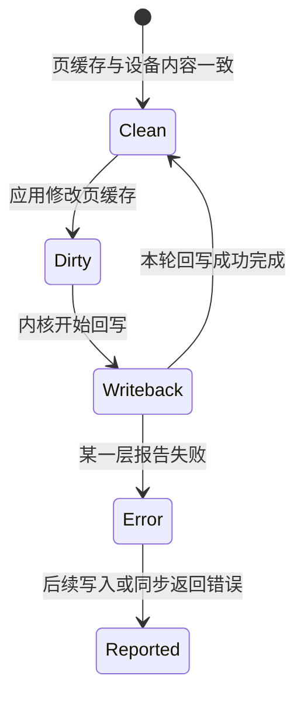

# 一次 `write` 到底做了什么：从程序到持久存储

本章以 Linux 本地普通文件为例，沿一次 `write(fd, buf, count)` 连接进程、虚拟内存、系统调用、文件系统、驱动和存储硬件，并区分调用返回、其他读取者可见和断电后仍可恢复这几个完成点。

## 1. 先限定问题和认识对象

`write` 可以写普通文件、网络 Socket、管道、终端或设备，不同对象会进入不同路径。本章只讨论：

- Linux 上的本地普通文件，而不是网络连接（Socket）或管道；
- 文件已经打开，程序持有可写的文件描述符；
- 使用默认 **Buffered I/O（缓冲 I/O）**，数据先经过内核页缓存；
- 没有启用要求每次写入立即同步的特殊选项；
- 文件系统和设备正常工作，但程序仍要正确处理错误。

这条路径中的主要对象是：

| 对象 | 它是什么 | 在写入中负责什么 |
|---|---|---|
| 应用缓冲区 | 进程内存中保存待写字节的区域 | 提供本次要写的数据 |
| fd | 文件描述符，进程表中的整数索引 | 让内核找到已经打开的文件 |
| 页缓存 | 内核用 RAM 缓存的文件内容 | 先接收写入并合并后续设备工作 |
| 文件系统 | 组织文件名、元数据和文件内容的内核子系统 | 把文件偏移映射到存储空间 |
| 块层与驱动 | 内核中组织请求并控制具体设备的软件 | 把文件系统请求转换成设备命令 |
| 存储控制器与介质 | SSD 或硬盘中的硬件 | 接收数据并最终保存到非易失介质 |

先看完整主线：


这里的**非易失**表示正常断电后仍能保存内容；“持久边界”表示系统接口和设备协议承诺数据已经达到这类存储的位置。

## 2. 调用 `write` 以前发生了什么

### 2.1 高级语言可能先使用用户态缓冲

Rust 程序可能通过 `BufWriter<File>` 写文件。`BufWriter` 是进程中的一块内存，它先积累多次小写入，再用较少的系统调用交给内核。

```rust,ignore
use std::io::Write;

writer.write_all(record)?;
writer.flush()?;
```

`write_all` 负责在系统只接受部分字节时继续写剩余内容。`flush` 负责把 `BufWriter` 中的数据交给内核。它们都不自动保证数据已经进入存储设备。

因此观察一次文件写入时，先判断数据还在语言运行库的缓冲区里，还是代码已经发起了系统调用。

### 2.2 fd 怎样找到文件

**fd（file descriptor，文件描述符）**是进程文件描述符表中的整数索引。程序先调用 `open(path, ...)`，内核解析路径并创建一个“打开文件”的状态；后续 `write(fd, ...)` 直接通过 fd 找到这个状态，通常不再解析整条路径。

```text
fd
  → 当前进程的 fd 表项
  → 打开文件状态：打开方式、当前偏移
  → 文件对象：文件身份、权限、大小和数据位置
```

当前偏移表示下一次读写从文件的哪个位置开始。如果多个 fd 共享同一个打开文件状态，它们也可能共享偏移。`pwrite` 允许调用者明确提供本次偏移，但它仍不等于持久化。

### 2.3 `buf` 是一个虚拟地址

`buf` 指向进程虚拟地址空间中的内存。CPU 读取它时，MMU 根据页表把虚拟地址翻译成物理地址。若某个页面尚未准备好，复制期间可能触发缺页；若地址不合法，系统调用会失败。

驱动不能简单地把这个进程虚拟地址交给 SSD，因为虚拟地址只在当前进程的地址空间中有意义。后面真正与设备传输时，内核会使用设备能够访问的内存区域。

## 3. 系统调用怎样进入内核

应用调用的 `write` 包装函数，会按照当前平台规定的调用约定准备系统调用号和参数。这个调用约定属于 **ABI（Application Binary Interface，应用二进制接口）**，它规定编译后的程序怎样与操作系统交互。

CPU 硬件负责：

1. 从受限制的用户态切换到内核态；
2. 跳转到内核预先设置的系统调用入口；
3. 保存返回应用所需的处理器状态。

Linux 内核负责：

1. 读取 `fd`、`buf` 和 `count` 等参数；
2. 检查 fd 是否有效、文件是否允许写、用户地址是否可读；
3. 执行文件大小、空间和权限等规则；
4. 把通用写请求交给 fd 所指对象的具体实现；
5. 返回已接受的字节数或错误。

同一线程进入内核再返回，叫权限态切换，不一定发生线程上下文切换。只有线程需要等待某个条件时，调度器才可能让另一个线程使用 CPU。

## 4. 内核怎样把字节放进页缓存

### 4.1 VFS 提供统一的文件接口

Linux 可以使用多种文件系统。**VFS（Virtual File System，虚拟文件系统）**是内核中的统一接口层，让应用都能使用 `open`、`read`、`write` 和 `fsync`，再由 VFS 把工作交给具体文件系统。

文件系统中的 **inode** 可以理解为文件身份和元数据对象。**元数据**是描述数据的数据，例如文件类型、权限、大小和时间。文件名保存在目录中，不是 inode 本身的一部分。

内核通过 fd 找到打开文件，检查是否可写，确定文件偏移，再进入具体文件系统的写入逻辑。

### 4.2 页缓存按文件和偏移保存内容

**页缓存（page cache）**是内核用物理内存保存的文件内容副本。它让重复读取不必每次访问设备，也让多次小写入可以先在内存中汇集。

内核根据“哪个文件 + 哪段文件偏移”找到相应页缓存区域，再由 CPU 把用户缓冲区中的字节复制进去。

假设系统使用 4096 字节的页面，从文件偏移 3000 写入 6000 字节，会跨越三个文件页：

```text
文件页 0：[0, 4096)       接收 1096 B
文件页 1：[4096, 8192)    接收 4096 B
文件页 2：[8192, 12288)   接收 808 B
```

所以一次 `write` 不等于一次设备写。一次调用可以跨多个页面；多次相邻写入也可能在后续阶段合并成较大的设备请求。

### 4.3 为什么要把页面标记为脏

页缓存内容如果与持久存储上的旧内容不同，就称为**脏页（dirty page）**。内核标记脏页，是为了记住“这些修改还需要写回设备”。文件系统还可能同时更新文件大小、修改时间和空间分配等元数据。

默认 Buffered I/O 中，只要内核接受了字节并完成必要的内存状态更新，`write` 通常就可以返回。此时 CPU 完成的是内存到内存的复制，SSD 可能还没有收到任何新数据。

在内存紧张、脏页过多、文件空间不足或需要等待文件状态时，`write` 也可能暂时不能完成。这并不改变主线：页缓存吸收了设备工作的时间差，却不是无限容量的仓库。

## 5. `write` 返回到底承诺了什么

假设代码执行：

```c
ssize_t n = write(fd, buf, 4096);
```

若返回 `4096`，表示内核已经接受这 4096 字节。它不自动表示数据已经持久化。下面几层必须分开：

| 层级 | 数据或状态到达哪里 | 常见动作 | 整机断电后通常可恢复吗 |
|---:|---|---|---|
| 0 | 应用自己的缓冲区 | 还未调用内核 | 否 |
| 1 | 语言运行库的用户态缓冲 | `BufWriter::write`、`fwrite` | 否 |
| 2 | 内核页缓存中的脏页 | 普通 `write` 返回 | 否 |
| 3 | 设备的普通完成点或易失缓存 | 后台回写 | 不一定 |
| 4 | 文件系统和设备承诺的非易失边界 | `fdatasync` 或 `fsync` 成功 | 在所声明的故障范围内是 |
| 5 | 另一台机器上的副本 | 上层复制协议确认 | 由复制协议定义 |

“另一个进程已经能读到新数据”属于可见性；“整机断电后仍能恢复”属于持久性。它们不是同一个问题。

## 6. `write` 返回后，数据怎样进入设备

### 6.1 回写把脏页交给文件系统

**Writeback（回写）**表示内核把脏页中的修改送往持久存储。它可能因为后台策略、内存回收或应用调用 `fsync` 而开始。



图中的 Clean 只说明内核没有记录普通待回写修改。设备是否已经越过易失缓存，还要看同步协议。

### 6.2 文件系统把文件偏移转换成存储位置

应用只知道“文件偏移 8192”，设备处理的是自己的逻辑存储地址。文件系统要：

1. 找到或分配保存这段文件内容的存储空间；
2. 更新文件大小、空间映射等元数据；
3. 让文件内容和元数据在崩溃后保持可恢复关系；
4. 生成交给下层的存储请求。

许多文件系统使用 **Journaling（文件系统日志）**记录关键元数据更新，使系统崩溃后能够恢复一致的文件系统结构。文件系统日志不等于应用所有数据都已持久化；具体保证仍取决于写入和同步顺序。

### 6.3 块层和驱动组织设备请求

**块层**是文件系统与存储驱动之间的通用内核层。它把内存范围和设备地址组织成请求，并按设备限制拆分、合并和排队。**驱动**了解具体设备协议，把通用请求转换成设备能够执行的命令。

这解释了为什么系统调用和设备命令不是一一对应：一次应用写入可能拆成多个设备请求，多次相邻写入也可能合并。

### 6.4 设备怎样从主存取得待写数据

块层和驱动准备设备命令以及设备可访问的内存范围。存储控制器通常使用 **DMA（Direct Memory Access，直接内存访问）**从页缓存所在的主存取得数据，完成后再由中断或轮询通知驱动。DMA 省去 CPU 搬运每个字节的循环，但没有省去内存带宽、请求排队、驱动处理和设备内部写入。DMA 的地址、控制与一致性职责见[计算机 I/O 硬件](io_hardware.md)。

一些设备包含易失写缓存。普通设备完成可能只表示数据到达该缓存；断电后缓存内容仍可能丢失。需要持久化时，文件系统和驱动会根据接口语义要求设备把先前写入推进到其承诺的非易失边界。

## 7. `fsync` 比 `write` 多完成了什么

`fsync(fd)` 的目标不是再复制一遍用户数据，而是把该文件尚未完成的工作推进到文件系统和设备承诺的持久边界。它通常需要：

1. 找出文件仍未完成的脏数据并发起回写；
2. 等待相关数据写入完成；
3. 同步恢复文件所需的元数据；
4. 按文件系统规则完成日志或等价状态；
5. 必要时要求设备处理易失写缓存；
6. 报告此前异步回写产生的错误。

常见接口的责任边界如下：

| 操作 | 它主要保证什么 | 它不自动保证什么 |
|---|---|---|
| `BufWriter::flush` / `fflush` | 用户态缓冲交给内核 | 设备持久化 |
| `write_all` | 重试短写，直到全部接受或报错 | 原子记录、持久化 |
| `fdatasync` / `sync_data` | 数据及正确读取它所需的元数据被同步 | 新文件名所在目录已经同步 |
| `fsync` / `sync_all` | 文件数据和相关元数据被同步 | 父目录中的新名字自动同步 |
| `close` / Rust `drop(File)` | 释放 fd 和进程引用 | 形成可靠的持久化协议 |

### 7.1 为什么新建文件还要同步父目录

文件内容和“目录里存在这个名字”是不同对象。只同步文件内容，崩溃后仍可能缺少新建或重命名产生的目录项。

一个常见的崩溃安全替换流程是：

```text
1. 在同一文件系统创建临时文件
2. 写入完整内容
3. fsync(临时文件)
4. rename(临时文件, 正式文件)
5. fsync(父目录)
```

`rename` 负责让名称切换以一个整体对其他读取者可见；文件和父目录的 `fsync` 分别推进内容和目录项的持久化。真实程序还要处理并发写者、权限、临时文件冲突和失败清理。

### 7.2 `fsync` 能抵抗哪些故障

`fsync` 成功表示操作系统、文件系统、驱动和设备按照接口协议报告已经达到同步边界。它不自动抵抗硬件永久损坏、整台机器丢失或软件在同步前写入了错误内容。需要容忍更大范围故障时，还要使用校验、备份或远端复制。

## 8. 短写、晚到错误和四种语义

### 8.1 短写表示只接受了一部分

`write(fd, buf, 4096)` 可能返回 `1024`。这表示前 1024 字节已被接受，剩余部分尚未写入。下一次应从 `buf + 1024` 继续，而不是从头重复。Rust 的 `write_all` 会完成这一循环，但如果先写入部分内容后再报错，文件仍可能留下不完整尾部。

重要记录可以带长度、序号或校验和，使恢复程序能够辨认完整记录和损坏尾部。

### 8.2 为什么有些错误当次报告，有些错误稍后报告

内核复制用户缓冲时能发现的错误，通常由本次 `write` 报告；Buffered I/O 推迟了设备工作，因此空间分配或设备回写产生的错误可能到后续写入或 `fsync` 才报告：

| 错误 | 基础含义 | 典型报告时机 |
|---|---|---|
| `EFAULT` | 用户缓冲区地址无效 | 通常在本次 `write` 访问用户页面时报告；发现前可能已经接受部分字节 |
| `ENOSPC` | 存储空间不足 | 可能当次报告；若存储位置延后分配，也可能在后续写入或同步时报出 |
| `EIO` | 文件系统或设备 I/O 失败 | 若最初 `write` 只到页缓存，可能在后台回写后由后续写入或同步报告 |

程序既要检查 `write` 返回的字节数，也要检查同步操作的返回值。

### 8.3 四种语义不能混用

| 性质 | 它回答的问题 |
|---|---|
| 可见性 | 另一个读取者何时能看到新字节？ |
| 原子性 | 读取者会看到完整旧状态或新状态，还是中间状态？ |
| 顺序性 | 多次更新以什么顺序对读取和恢复可见？ |
| 持久性 | 发生指定故障后，新数据能否恢复？ |

`write_all` 解决“把全部字节交给内核”，不自动解决记录原子性和持久性。应用的数据格式与恢复协议要分别定义这些性质。

## 9. 其他文件 I/O 方式改变了什么

下面只建立边界，不需要初学者先记具体配置：

| 方式 | 主要改变 | 没有消失的责任 |
|---|---|---|
| Buffered I/O | 先使用页缓存，便于缓存和合并 | 同步时机、错误和恢复语义 |
| Direct I/O | 尝试减少页缓存参与 | 内存对齐、元数据、设备请求和持久化 |
| `mmap` | 程序用内存读写指令修改文件页 | 脏页回写和持久化协议 |
| 同步写入 | 每次写入带有更强完成要求 | 错误处理和设备实际工作 |
| 异步 I/O | 结果稍后通过完成事件交付 | 文件系统、设备传输和过量请求排队 |

选择哪种方式取决于数据正确性要求和工作负载。方式不同不会改变“应用、内核、文件系统、驱动和设备共同完成写入”这一事实。

## 10. 常见误解

- **“`write` 返回就是落盘。”** 普通 Buffered I/O 往往只到页缓存。
- **“`flush` 和 `fsync` 是一回事。”** 前者常指清空用户态缓冲，后者推进文件持久化。
- **“一次 `write` 对应一次设备写。”** 页边界、合并和拆分会改变请求形状。
- **“DMA 后 CPU 完全不参与。”** CPU 和内核仍要准备请求、处理协议和完成结果。
- **“文件系统日志等于用户数据永不丢失。”** 日志首先帮助恢复文件系统结构，应用仍需正确同步。
- **“`fsync(file)` 总能保存新文件名。”** 新建或重命名还涉及父目录项。
- **“异步 I/O 消除了 I/O 工作。”** 它只改变提交和等待方式。

## 11. 三类系统怎样使用这条写入路径

| 场景 | 常见写入对象 | 正确性问题 |
|---|---|---|
| 传统互联网与数据库 | 业务日志、数据库预写日志、配置替换 | 何时向用户确认成功，崩溃后恢复到哪个状态 |
| AI Agent 与模型平台 | 任务日志、保存运行状态的检查点文件、生成产物 | 大文件是否完整，任务重启后从哪里继续，多机是否已有副本 |
| HFT 系统 | 订单事件、审计日志、行情落盘 | 哪些记录必须持久，内存队列积压或进程退出时怎样恢复 |

三类系统使用的是同一条内核与设备路径。区别在于业务怎样定义完成：普通访问日志可能允许稍后批量写，数据库提交可能要求日志先持久化，分布式系统还可能要求远端副本确认。

## 12. 批量与诊断

把多条小记录合成一批，可以减少系统调用和同步次数，但也会增加尚未同步的数据量。因此批量策略至少要回答：什么时候提交一批，队列满时怎么办，发生故障时最多允许丢失哪些记录，以及恢复程序怎样识别完整前缀。

若实际写入行为与预期不同，应沿主线逐层取证：

| 现象 | 先检查什么 |
|---|---|
| 代码已调用写入，但系统调用里看不到 | 是否仍在用户态缓冲 |
| `write` 成功，重启后数据缺失 | 是否只到页缓存，是否执行了正确同步 |
| `write` 成功，`fsync` 报错 | 后台分配空间或设备回写是否失败 |
| 文件内容存在，重启后文件名缺失 | 是否同步了新建或重命名涉及的父目录 |

Linux 测试环境中可以用下面的命令观察应用发出的系统调用：

```bash
strace -ttT -e trace=write,pwrite64,fsync,fdatasync ./your_program
```

它只能观察系统调用边界，看不到完整后台回写和设备内部过程。持久化语义还需要在可销毁环境中进行故障恢复实验，不能只靠性能测试证明。

## 做题方法

文件写入语义题先把“数据到达哪里”画成检查点：用户缓冲区、内核页缓存、块层/控制器、设备持久介质。

1. 对 `write` 返回，记录返回字节数并推进缓冲区指针；返回正数但小于请求长度是短写，不得从头重写整个缓冲区。
2. 遇到错误先看本次是否已经写入部分数据、错误是否可重试，再决定循环；`EINTR`、空间不足与设备错误不能用同一策略处理。
3. 区分 `write`、`fsync(file)`、原子替换和 `fsync(parent directory)` 各自承诺。新建或重命名文件时，只同步文件内容不足以保证目录项在崩溃后存在。
4. 崩溃题为每个时刻建立表格：用户看见的返回值、页缓存状态、文件数据、元数据、目录项是否已持久化。逐行假设断电，比背一句“fsync 保证落盘”更可靠。
5. 性能题把每次固定提交开销与数据传输开销分开，计算批量大小改变后每字节分摊；不能为了吞吐省略正确性所要求的同步点。

最后用故障模型验算：只考虑进程崩溃、操作系统崩溃还是突然断电？不同模型下“成功返回后仍保留”的层次不同，答案必须明确。

## 13. 章末思考题

1. 画出 `write → page cache → writeback → file system → block layer → driver → device`，并标出普通 `write` 的常见返回点。
2. `write_all`、用户态 `flush` 和 `fsync` 分别解决什么问题？
3. 为什么对应用是“向 SSD 写”，对设备 DMA 来说却通常要先读取主机内存？
4. `write` 返回全部字节后，进程崩溃和整机断电为什么可能产生不同结果？
5. 为什么一个系统调用可能拆成多个设备请求，多次系统调用也可能合并？
6. 新文件的内容已经同步，为什么还可能需要同步父目录？
7. 为什么 `write` 已经成功，`fsync` 仍可能返回空间或设备错误？
8. 为数据库提交、AI 检查点和普通访问日志分别定义一个合理的“完成”条件。

一分钟复述：**在默认 Buffered I/O 中，`write` 通过 fd 和 VFS 找到文件，把用户缓冲复制到页缓存并标脏，通常到这里就返回；之后回写或 `fsync` 才把数据经过文件系统、块层和驱动交给设备，设备通过 DMA 从主机内存取得数据，并按同步协议推进到非易失边界。代码还必须处理短写、晚到错误，以及文件内容与父目录项不同的持久化责任。** 这段话也可以作为面试回答的主干。

### 参考答案与解答

<details><summary>展开答案</summary>

1. 路径为 `用户 buf → write 系统调用/VFS → 页缓存标脏 → 回写 → 文件系统块映射 → 块层 → 驱动/DMA → 设备`。普通 buffered `write` 常在页缓存接受字节后返回，位于 writeback 之前。
2. `write_all` 循环处理短写，保证用户缓冲全部交给内核或返回错误；用户态 `flush` 把语言/库缓冲交给内核；`fsync` 请求文件数据和所需元数据推进到持久化边界。三层承诺依次更靠下但不能互换。
3. 对 CPU，目标语义是把文件数据写入 SSD；对设备控制器，待写字节先位于主存，设备作为 DMA 发起者读取这些主存字节，再写入内部介质。
4. 进程崩溃通常不清空内核页缓存，内核仍可能回写；整机断电会丢失 DRAM 中脏页和未受保护的设备缓存。因此同一 write 返回点对应不同故障结果。
5. 文件范围可能跨页、块、extent 和设备最大请求，单次调用会拆分；相邻脏页/块请求又可能被回写器、块层或设备合并，提高吞吐。
6. 文件 `fsync` 主要保证文件内容和相关 inode；新名字存在于父目录的数据/元数据中。断电时若目录项未持久化，文件内容虽在介质上却可能没有可达名字，所以还要同步父目录。
7. write 可能只分配页缓存，真正分配块/回写时才发现磁盘满、配额、介质或控制器错误；`fsync` 等待这些晚到操作并报告失败。
8. 数据库提交：WAL 提交记录及协议要求的数据达到稳定存储，恢复后事务可重现；AI checkpoint：内容对象完整校验、元数据原子发布为 READY，恢复演练可读取；普通访问日志：可按业务接受“进入页缓存/用户缓冲已 flush”或要求 fsync，必须写明允许丢失窗口和故障模型。

</details>

## 一手资料

- [Linux `write(2)`](https://man7.org/linux/man-pages/man2/write.2.html)
- [Linux `fsync(2)`](https://man7.org/linux/man-pages/man2/fsync.2.html)
- [Linux `open(2)`](https://man7.org/linux/man-pages/man2/open.2.html)
- [Linux 内核：VFS](https://docs.kernel.org/filesystems/vfs.html)
- [Linux 内核：DMA API](https://docs.kernel.org/core-api/dma-api-howto.html)
- [Linux 内核：存储写缓存与同步](https://docs.kernel.org/block/writeback_cache_control.html)
