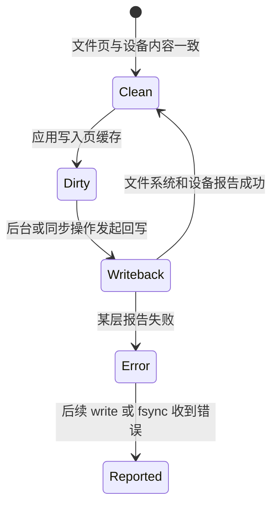

# 一次 `write` 到底做了什么：从程序到持久存储

> **面试优先级：P0 掌握第 1～7 节的主线，P1 掌握慢路径、诊断和方案取舍。** 你要能说明 `write` 为什么通常先返回、数据后来怎样进入设备、`fsync` 多等了什么，以及短写和晚到错误怎样处理。内核结构名、设备队列字段和闪存固件不属于基础面试，本章不展开，也不需要背调用栈。

本章回答一个具体问题：在 Linux 上，对本地普通文件调用一次 `write(fd, buf, count)`，软件和硬件依次做了什么？这个例子会把[进程与文件描述符](processes_fds.md)、[虚拟内存](virtual_memory.md)和 [CPU 微架构](cpu_arch.md)串成一条完整因果链。

## 1. 先限定场景，否则没有唯一答案

同一个 `write` 接口可以写普通文件、网络 socket、管道、终端或设备。不同 fd 会进入不同内核子系统。本章固定讨论下面的常见场景：

- 现代 Linux；
- 本地普通文件，而不是网络或管道；
- 文件已经打开，程序持有可写 fd；
- 使用默认的 **Buffered I/O（缓冲 I/O）**，数据先经过内核页缓存；
- 没有设置 `O_DIRECT`、`O_SYNC` 或 `O_DSYNC`；
- 文件系统和存储设备工作正常，但仍要讨论错误怎样返回。

具体函数名会随内核版本和文件系统变化。本章主线使用稳定的职责边界，不要求背某一版 Linux 的内部调用栈。

先看结论：

```text
应用缓冲区
  → write 系统调用
  → fd 与 VFS 找到文件
  → 复制到内核页缓存并标记为脏
  → 普通 write 通常在这里返回
  → 后台回写或 fsync 触发设备 I/O
  → 文件系统映射与块层排队
  → 驱动让设备通过 DMA 读取主机内存
  → 存储控制器缓存
  → 满足协议要求的非易失持久边界
```

这条链上有多个“完成点”。`write` 成功、其他进程能够读取、设备报告普通写完成、断电后仍能恢复，以及远端副本确认，都不是同一个承诺。

## 2. `write` 返回时，数据通常在哪里

假设程序调用：

```c
ssize_t n = write(fd, buf, 4096);
```

如果返回 `4096`，默认 Buffered I/O 场景通常只说明：内核已经接受这 4096 字节，并更新了它所管理的文件状态。数据大多已经从应用缓冲区复制到内核管理的**页缓存（page cache）**，但设备 I/O 可以尚未发生。

下面的完成梯子必须分清：

| 层级 | 数据到达哪里 | 常见动作 | 整机断电是否安全 |
|---:|---|---|---|
| 0 | 应用自己的缓冲区 | 还没进入内核 | 否 |
| 1 | 语言运行库的用户态缓冲 | `BufWriter::write`、`fwrite` | 否 |
| 2 | 内核页缓存中的脏页 | 普通 `write` 返回 | 通常否 |
| 3 | 块请求或设备易失缓存 | 后台回写、普通设备完成 | 不一定 |
| 4 | 文件数据和必要元数据达到持久边界 | `fdatasync` / `fsync` 成功 | 按文件系统和设备协议承诺 |
| 5 | 远端副本或业务系统确认 | 复制确认、业务 ACK | 由上层故障模型定义 |

因此，面试中说“`write` 返回就是落盘”会把第 2 层误当成第 4 层。

## 3. 调用前：应用、fd 和虚拟地址准备了什么

### 3.1 高级语言可能还有一层用户态缓冲

Rust 代码可能写成：

```rust,ignore
use std::io::Write;

writer.write_all(record)?;
```

`write_all` 会在发生短写时继续提交剩余字节，但它不提供持久化。如果 `writer` 是 `BufWriter<File>`，数据还会先积累在进程自己的缓冲区；`flush()` 主要把这一层数据交给内核，也不等于 `fsync()`。

所以排障第一问是：代码是否真的发起了系统调用，还是只改了用户态内存？

### 3.2 fd 让内核找到已经打开的文件

fd 是进程 fd 表中的整数索引。`open(path, ...)` 时内核解析路径并创建“打开文件”的状态；后续 `write(fd, ...)` 通常直接通过 fd 找到这个状态，不会重新解析整条路径。

```text
fd
  → 进程 fd 表项
  → 打开文件状态：当前偏移、打开标志
  → 文件对象：身份、权限、大小和数据映射
```

多个 fd 若指向同一个打开文件状态，就可能共享当前偏移。`pwrite` 让调用者显式提供偏移，常用于避免依赖共享偏移；它仍然不自动提供持久性。

### 3.3 `buf` 是虚拟地址，不是设备地址

`buf` 指向进程虚拟地址空间中的一段内存。CPU 读取它时，MMU 要根据页表把虚拟地址翻译成物理地址，TLB 会缓存近期翻译。若某个用户页面尚未准备好，复制期间可能触发缺页；若地址无效，系统调用可能返回 `EFAULT`。

因此，“复制 4096 字节”不保证每次具有相同延迟。源页面是否驻留、数据是否在 CPU Cache 中、内存是否跨 NUMA 节点，以及系统是否正在回收内存，都会改变实际成本。

## 4. 进入内核：CPU 和操作系统分别做什么

系统调用包装器按照当前 CPU 架构规定的 **ABI（Application Binary Interface，应用二进制接口）**把系统调用号和参数放到约定位置，再执行系统调用指令。

CPU 硬件负责：

1. 从受限制的用户态切换到内核态；
2. 跳转到内核预先配置的入口；
3. 保存或提供返回所需的处理器状态；
4. 按硬件规则执行权限检查。

Linux 内核软件负责：

1. 取得系统调用参数；
2. 检查 fd、长度、用户地址和写权限；
3. 执行安全、配额和文件大小等策略；
4. 把通用 `write` 请求交给 fd 对应的文件实现；
5. 返回实际接受的字节数或错误。

**用户态/内核态切换不等于线程上下文切换。** 如果本次写入只需在内存中完成，同一线程可以进入内核后直接返回。若它等待缺页、锁、内存回收或脏页限流，线程才可能睡眠，让调度器运行其他任务。

## 5. fd 到页缓存：普通 `write` 的快速路径

### 5.1 VFS 为什么存在

**VFS（Virtual File System，虚拟文件系统）**是 Linux 为不同文件系统提供的共同接口。应用都调用 `open`、`write` 和 `fsync`，VFS 再把请求交给 ext4、XFS、tmpfs 或其他具体实现。

内核先根据 fd 找到打开文件，检查是否允许写，确定当前文件偏移，再由文件系统处理文件数据和元数据。**inode** 可以理解为文件身份和元数据对象，它保存文件类型、大小、权限以及找到数据所需的信息；文件名属于目录，不是 inode 本身。

### 5.2 页缓存怎样接收数据

页缓存是内核用 RAM 保存的文件内容副本。内核根据“文件 + 文件偏移”找到或创建相应的页缓存区域，再让 CPU 把用户缓冲区的字节复制进去。

假设页面大小是 4096 字节，从文件偏移 3000 写入 6000 字节，会跨三个文件页：

```text
文件页 0：[0, 4096)       写入 1096 B
文件页 1：[4096, 8192)    写入 4096 B
文件页 2：[8192, 12288)   写入 808 B
```

所以“一次 `write`”不天然对应“一次设备写”。一次调用可以拆成多个页；多次相邻小写又可能在后续阶段合并。

复制过程中，硬件仍在工作：MMU 翻译用户地址和内核地址，CPU 通过 Cache 读取和写入缓存行，内存控制器把必要的数据送到 RAM。CPU 完成的是“内存到内存”的复制；此时存储设备通常还没有读取这些新字节。

### 5.3 为什么要标记 Dirty

页缓存中的数据如果和持久存储上的旧内容不同，就称为**脏页（dirty page）**。内核标记脏状态，是为了记住“这些内存内容以后必须写回设备”。文件系统还可能更新文件大小、修改时间、空间分配和日志状态。

在默认 Buffered I/O 中，只要内核接受了数据并完成必要的内存状态更新，`write` 通常就能返回。它不需要等待 SSD；这也是小写入看起来很快的主要原因。

### 5.4 为什么“只写内存”也会突然慢

快速路径依赖内存和文件系统仍有余量。下列事件会让 `write` 本身出现长尾：

| 慢路径 | 为什么需要等待 |
|---|---|
| 用户页缺页 | 内核复制前要准备源页面，甚至从存储读回 |
| 页缓存分配与内存回收 | 系统缺少可用物理页，需要扫描或回写旧页 |
| 脏页限流 | 应用制造脏数据快于设备回写，内核必须让生产者减速 |
| 文件锁或元数据竞争 | 多个线程同时修改同一文件或共享文件系统状态 |
| 空间和配额处理 | 文件扩展时要分配空间或确认配额 |

因此“Buffered I/O 只写 RAM，所以延迟恒定”也是错误说法。

页缓存内部结构会随内核版本变化，基础面试只需掌握“按文件偏移找到页缓存、复制、标脏并更新文件状态”这条稳定职责链。

## 6. `write` 返回后：脏页怎样进入存储设备

### 6.1 Writeback 把异步债务还给设备

**Writeback（回写）**表示内核把脏页内容送往持久存储。它可能由后台阈值、脏数据年龄、内存回收或应用显式调用 `fsync` 触发。脏数据过多时，当前写线程还会被限速，防止 RAM 中积累无限多尚未写出的数据。



图中的 Clean 只表示内核没有普通待回写修改，不自动证明数据已经越过设备的易失缓存。持久性还要看后面的设备协议。

### 6.2 文件系统把文件偏移变成设备块

应用只知道“文件偏移 8192”，存储设备处理的是设备地址范围。文件系统要完成三类工作：

1. 把文件的逻辑偏移映射到已经存在或新分配的存储块；
2. 让文件数据、文件大小和其他元数据在崩溃后保持可恢复的一致关系；
3. 把内存中的数据范围组织成块 I/O 请求。

许多文件系统使用日志来保护元数据更新。**Journaling（文件系统日志）**不等于“所有用户数据永不丢失”；它解决的是文件系统结构在崩溃后的可恢复性，具体记录哪些数据、按什么顺序提交，要看文件系统模式和同步操作。

### 6.3 块层和驱动为什么还要排队

Linux 的块层位于文件系统和存储驱动之间。它把文件系统生成的内存范围和设备地址组织成请求，并根据设备限制进行拆分、合并和排队。驱动再把通用块请求转换成设备协议能够理解的命令。

这一步解释了两件事：

- 一次应用 `write` 可能尚未产生设备请求，也可能最终拆成多个请求；
- 多次应用写入可能被合并，因此设备完成顺序不能只靠系统调用先后猜测。

### 6.4 DMA 和设备具体做了什么

驱动不能把进程虚拟地址直接交给设备。它要把承载待写数据的内存页映射成设备可访问的地址，并只授权需要的范围。**DMA（Direct Memory Access）**让设备控制器直接传输这些数据，不要求 CPU 执行逐字节复制。

从应用角度看，这是“向 SSD 写数据”；从设备控制器角度看，它通常要通过总线**读取主机 RAM 中的待写数据**。因此核心数据方向是设备发起 DMA Read：

```text
内核页缓存中的物理内存
  → 驱动准备设备命令和允许访问的内存范围
  → 命令进入设备提交队列
  → 设备控制器通过 DMA 读取主机内存
  → 控制器处理地址映射、校验和写缓存
  → 数据推进到非易失介质
  → 设备写入完成记录
  → 中断或轮询让驱动发现完成
  → 块层和文件系统完成本次回写
```

**IOMMU（Input-Output Memory Management Unit）**可以把设备看到的地址限制并翻译到允许的物理页，减少错误设备访问任意内存的风险。DMA 省掉 CPU 搬字节的循环，却没有省掉内存带宽、队列、映射、完成处理和设备内部工作。

设备报告“普通写完成”仍可能只表示数据到达控制器的易失写缓存。若整机断电，该缓存可能丢失。文件系统和块层会根据同步语义发出 Flush 或等价命令，要求此前写入推进到设备承诺的非易失边界；某些设备还具有 **PLP（Power Loss Protection，掉电保护）**，用储能部件在掉电时保护缓存内容。

设备队列字段和闪存固件结构会随协议与硬件变化，基础面试不需要展开；主文中的驱动、DMA、设备缓存和非易失边界已经足以解释软硬件分工。

## 7. `fsync` 比 `write` 多等待了什么

`fsync(fd)` 的目标不是“再复制一遍”，而是把该文件尚未完成的异步工作推进到文件系统和设备承诺的持久边界。典型工作包括：

1. 找出文件仍未完成的脏数据并发起回写；
2. 等待相关数据 I/O 完成；
3. 同步恢复这些数据所需的文件元数据；
4. 按文件系统规则提交日志或等价状态；
5. 必要时要求设备刷新易失写缓存；
6. 检查并报告此前积累的回写错误。

这解释了为什么普通 `write` 很快，而紧随其后的 `fsync` 很慢：`fsync` 可能替前面许多次写入一次性等待设备和文件系统完成。

常见接口的边界如下：

| 操作 | 主要完成什么 | 不能自动保证什么 |
|---|---|---|
| `BufWriter::flush` / `fflush` | 用户态缓冲交给内核 | 设备持久化 |
| `write_all` | 处理短写，直到全部接受或报错 | 原子记录、持久化 |
| `fdatasync` / `sync_data` | 数据及正确读取所必需的元数据 | 文件名所在目录项持久化 |
| `fsync` / `sync_all` | 文件数据和相关元数据同步 | 新建或重命名后的父目录项自动持久化 |
| `close` / Rust `drop(File)` | 释放 fd 和引用 | 可靠的持久化协议 |

### 7.1 为什么新建文件还要同步父目录

文件内容和“目录中存在这个名字”属于不同对象。只同步文件，崩溃后仍可能缺少新建或重命名产生的目录项。一个常见的崩溃安全替换流程是：

```text
1. 在同一文件系统创建临时文件
2. 写入完整内容
3. fsync(临时文件)
4. rename(临时文件, 正式文件)
5. fsync(父目录)
```

`rename` 主要提供名称切换时的原子可见性；文件和目录的 `fsync` 解决崩溃后的持久性。真实代码还要处理并发写者、临时文件冲突、权限、同文件系统限制和错误清理。

### 7.2 `fsync` 是否意味着任何故障都不丢

不能把保证无限扩大。`fsync` 成功表示操作系统、文件系统、驱动和设备按照各自协议报告达到了同步边界。它仍依赖硬件和固件正确实现协议，也不自动抵抗介质永久损坏、控制器故障或整台机器丢失。需要容忍更大故障时，还要使用校验、日志、备份或远端复制。

## 8. 短写、晚到错误和四种不同语义

### 8.1 短写不是“完全失败”

`write(fd, buf, 4096)` 可能返回 `1024`。这表示前 1024 字节已经被接受，剩余 3072 字节尚未写入。下一次应从 `buf + 1024` 继续，而不是从头重复写。Rust 的 `write_all` 会完成这个循环，但若先写入一部分、随后报错，文件仍可能留下部分记录。

因此，重要记录通常需要长度、序号或校验和，使恢复程序能够识别完整记录和损坏尾部。

### 8.2 错误可能在后续同步时才出现

Buffered I/O 把设备工作推迟到后台，也可能把某些错误推迟：

| 错误 | 可能原因 | 为什么可能晚报 |
|---|---|---|
| `ENOSPC` | 可用空间不足 | 延迟分配可能到回写时才选择设备块 |
| `EDQUOT` | 用户或项目配额耗尽 | 配额结算可能发生在后续分配 |
| `EIO` | 存储或文件系统 I/O 失败 | 最初 `write` 只到页缓存，设备后来才失败 |
| `EFAULT` | 用户地址无效 | 复制到某个页面时才发现 |
| `EINTR` | 调用在完成任何字节前被信号中断 | 已完成部分时通常表现为成功短写 |

应用必须检查 `write` 的返回字节数，也必须检查 `fsync` 的返回值。忽略同步错误会把“写入日志”变成无法验证的愿望。

### 8.3 可见、原子、有序和持久不是同义词

| 性质 | 它回答的问题 |
|---|---|
| 可见性 | 另一个读取者何时能看到新字节？ |
| 原子性 | 读取者会看到全旧或全新，还是中间状态？ |
| 顺序性 | 多次更新在正常读取和崩溃恢复后按什么顺序出现？ |
| 持久性 | 指定故障发生后，新数据是否仍能恢复？ |

`O_APPEND` 不能推出“任意大小业务记录都具有断电原子性”，`write_all` 也不能推出“多次系统调用组成的一条记录原子出现”。业务格式和恢复协议必须单独定义。

## 9. 其他 I/O 模式改变了哪一段

| 方式 | 主要改变 | 仍然要承担的责任 |
|---|---|---|
| Buffered I/O | 先进入页缓存，便于缓存、合并和异步回写 | 定义何时同步，控制脏页和尾延迟 |
| `O_DIRECT` | 尝试让 I/O 少经过页缓存和一次复制 | 对齐、缓冲区生命周期、元数据、错误和持久性 |
| `mmap` | 程序通过内存映射修改文件页 | 脏页回写仍存在，持久性仍需同步协议 |
| `io_uring` | 改变请求提交、批处理和完成通知方式 | 文件系统、设备工作和过载排队仍存在 |
| `O_SYNC` / `O_DSYNC` | 把更强完成要求放进每次写 | 同步等待、错误和设备排队仍存在 |

“异步”表示调用线程不在原地等待全部工作，不表示工作量消失；“零拷贝”也必须说明具体省掉了哪一次复制。

## 10. 性能取舍：批量省了什么，又增加了什么

假设程序每秒产生 200,000 条、每条 512 B 的日志，逻辑数据量约为：

```text
200,000 × 512 B/s ≈ 97.7 MiB/s
```

如果每条都执行一次 `write + fsync`，系统还要面对每秒 200,000 次系统调用和同步边界。若每 100 条组成约 50 KiB 的批次，同步次数理论上降到约 2,000 次每秒，但最早进入批次的记录需要等待凑批，而且崩溃时可能丢失尚未同步的一批。

所以批量策略必须同时回答：

- 允许丢失多长时间或多少条数据？
- 单条记录最多能等多久？
- 队列满时阻塞、丢弃还是停止接收新工作？
- 恢复时怎样识别完整前缀和损坏尾部？

批处理、吞吐和排队的通用模型见[吞吐量优化](../infrastructure/throughput.md)。低延迟系统常让关键线程把日志交给有界队列，由独立线程批量持久化；这只是移动责任，不能省略队列满策略和故障恢复协议。

## 11. 怎样沿层次诊断慢写

先固定请求大小、并发度、文件系统、是否同步和测试持续时间，再同时观察中位数与 P99/P99.9。只看 MB/s 会把小同步写、页缓存吸收和真实设备能力混在一起。

| 现象 | 首要假设 | 需要的证据 |
|---|---|---|
| `write` 平时快，偶尔很慢 | 缺页、回收、脏页限流或锁竞争 | fault、脏页、调度和文件系统事件 |
| `write` 快，`fsync` 慢 | 积累了脏数据、日志提交或设备 Flush 排队 | 回写、块请求和设备完成时间线 |
| CPU 高但设备不忙 | 小写入、复制、编码或锁成本 | CPU profile、系统调用次数和请求大小 |
| 设备忙但吞吐低 | 小随机 I/O、同步屏障或设备内部回收 | IOPS、请求大小、队列深度和设备延迟 |
| 重启后文件名消失 | 只同步了文件，没有同步目录项 | 创建、rename、文件 fsync 与目录 fsync 顺序 |

在自己的 Linux 测试环境中，可以先观察系统调用：

```bash
strace -ttT -e trace=write,pwrite64,fsync,fdatasync ./your_program
```

它只能看到应用何时进入和离开系统调用，看不到后台回写与设备内部过程。进一步排障要把页缓存、文件系统、块层和设备指标按同一时间轴对齐。

性能测试也不能证明持久性。恢复语义要通过独立故障实验验证：给记录加长度、序号和校验和，在不同完成点终止测试进程或重启可销毁的虚拟机，然后确认恢复结果符合设计。不要在生产机器或包含重要数据的磁盘上做破坏性实验。

## 12. 面试回答模板

30 秒版本：

> 我先限定为 Linux 本地普通文件的 Buffered I/O。`write` 通过系统调用进入内核，内核根据 fd 找到文件，经 VFS 交给具体文件系统，把用户缓冲复制到页缓存，标记脏页并更新文件状态，通常到这里就返回。之后后台回写或 `fsync` 才把数据经过文件系统块映射、块层和驱动提交给设备；设备通过 DMA 读取主机内存，完成点还要区分易失缓存和非易失边界。需要断电恢复时要检查 `fdatasync` 或 `fsync`，新建和重命名还要考虑父目录同步。代码同时要处理短写以及在后续同步时报告的 I/O 错误。

常见追问可以按下面顺序回答：

1. **系统调用一定发生上下文切换吗？** 不一定；权限切换和调度器更换线程是两件事。
2. **为什么 `write` 比 SSD 持久写快？** 它通常只复制到 RAM 页缓存就返回，比较的是不同完成点。
3. **`O_DIRECT` 一定更快、更安全吗？** 不一定；它改变缓存和复制路径，不自动提供持久性。
4. **为什么 `fsync(file)` 后还要 `fsync(directory)`？** 文件内容和目录中的名字是不同持久化对象。
5. **异步 I/O 消除了延迟吗？** 没有；它改变等待方式，过载时仍会排队。

## 13. 自测与速记

1. 画出 `write → page cache → writeback → file system → block layer → driver → device`，并标出普通返回点。
2. 为什么对应用是“写 SSD”，对设备 DMA 方向却通常是“读取主机内存”？
3. `write_all`、`flush`、`fsync` 分别解决什么问题？
4. 已看到 `write` 返回 4096 时，进程崩溃和整机断电为什么有不同结果？
5. 新文件的内容已经同步，为什么文件名仍可能需要同步父目录？
6. `write` 成功后，为什么 `fsync` 仍可能返回 `ENOSPC` 或 `EIO`？

最后记住九句话：

1. 先限定 fd 类型、I/O 模式、文件系统和故障范围。
2. Buffered `write` 的快速路径止于页缓存脏页，通常不等设备。
3. 权限态切换不等于任务上下文切换。
4. 缺页、回收、锁和脏页限流都能让 `write` 变慢。
5. 回写再经过文件系统、块层、驱动和设备队列。
6. DMA 省掉 CPU 逐字节搬运，不省掉队列、内存带宽和设备工作。
7. 用户态 flush、`write`、`fsync`、目录同步和远端确认是不同完成点。
8. 短写和晚到错误必须进入程序的恢复设计。
9. 优化要同时说明吞吐、尾延迟和允许的数据丢失窗口。

## 一手资料

- [Linux `write(2)`](https://man7.org/linux/man-pages/man2/write.2.html)
- [Linux `fsync(2)`](https://man7.org/linux/man-pages/man2/fsync.2.html)
- [Linux `open(2)`：同步与 Direct I/O 标志](https://man7.org/linux/man-pages/man2/open.2.html)
- [Linux 内核：系统调用入口与退出](https://docs.kernel.org/core-api/entry.html)
- [Linux 内核：VFS](https://docs.kernel.org/filesystems/vfs.html)
- [Linux 内核：DMA API](https://docs.kernel.org/core-api/dma-api-howto.html)
- [Linux 内核：存储写缓存、Flush 与 FUA](https://docs.kernel.org/block/writeback_cache_control.html)
- [Linux 内核：脏页参数](https://docs.kernel.org/admin-guide/sysctl/vm.html)
