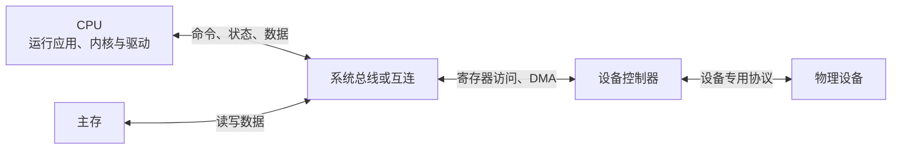
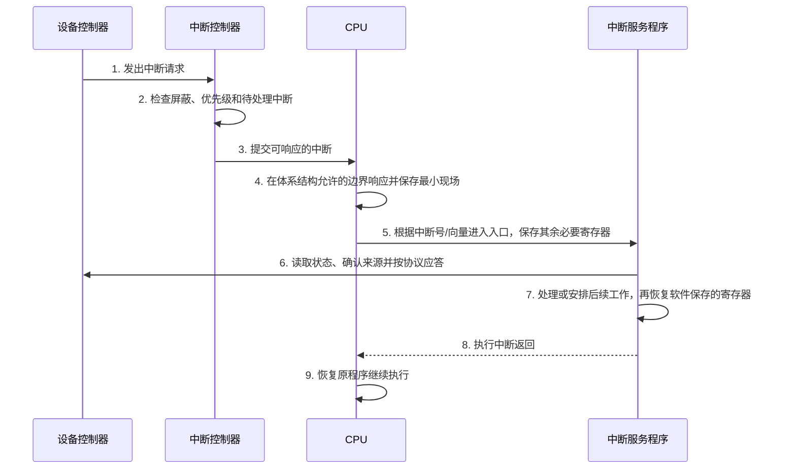
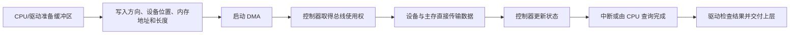

# I/O 硬件：CPU、总线与设备怎样协作

CPU 擅长快速执行指令，键盘、网卡和存储设备则按照各自的速度产生或接收数据。两者不能直接假定对方“下一刻就准备好”，因此计算机需要设备控制器、总线、中断和 DMA 来传递命令、数据与完成状态。

本章只讲硬件视角的共同机制：信息怎样经过互连，CPU 怎样访问设备寄存器，设备怎样通知 CPU，以及大量数据由谁搬运。操作系统怎样把不同设备包装成统一接口，见 [I/O 管理](io_management.md)；线程为何等待、驱动位于哪里，见[操作系统原理](os_internals.md)；普通文件写入如何经过文件系统到达存储设备，见[一次 `write`](file_write_path.md)。本章不重复文件系统、设备队列或具体 NVMe 命令。

## 1. 先认识五个参与者

一次 I/O 通常涉及：

| 参与者 | 它是什么 | 主要职责 |
|---|---|---|
| CPU | 执行程序指令的处理器 | 运行驱动，发命令，处理完成通知 |
| 主存 | CPU 和设备都可能访问的工作内存 | 保存程序、待发送数据和接收缓冲区 |
| 设备控制器 | 连接系统互连与具体设备的硬件 | 暴露寄存器，执行命令，搬运或暂存数据 |
| 外设 | 完成实际输入或输出的设备 | 例如键盘、网卡、磁盘、显示设备 |
| 总线或互连 | 在部件之间传递请求和数据的通路 | 规定谁在何时向谁传递什么 |

**设备驱动（device driver）**不是上表中的硬件，而是操作系统中了解控制器用法的软件。驱动把“读取状态寄存器、填写命令、处理完成”包装成内核可使用的操作。



控制器与设备不一定是两个独立芯片。学习时把它们分开，是为了看清边界：系统一侧面对控制器规定的接口，控制器另一侧处理设备的具体电气和协议细节。

## 2. 总线传递哪三类信息

**总线（bus）**是多个部件共享的一组传输规则和通路。现代机器也大量使用点到点互连和分层交换网络，但一次事务仍可从逻辑上拆成三类信息：

| 信息 | 回答的问题 | 例子 |
|---|---|---|
| 地址信息 | 这次访问的目标是谁、位置在哪里 | 某段内存地址、某个设备寄存器 |
| 数据信息 | 真正要读出或写入的位是什么 | 一个状态字、一段待发送数据 |
| 控制信息 | 这是什么操作，何时有效，结果怎样 | 读/写、请求/应答、字节使能、错误 |

例如 CPU 要读取某个状态寄存器，可以把过程抽象成：

```text
CPU 发出目标地址和“读”控制信息
→ 目标控制器识别自己的地址
→ 控制器返回状态数据和完成/错误信息
→ CPU 取得返回值
```

“地址总线、数据总线、控制总线”是理解信息角色的模型，不表示每台现代计算机都为三者各保留一捆永久独立的物理导线。高速互连可能把它们编码进同一个分组并分时传输。

### 2.1 总线仲裁：同时请求时谁先用

能够主动发起总线事务的一方称为**总线主设备（bus master）**。CPU 可以是主设备，具有 DMA 能力的控制器也可能主动访问内存。若多个主设备同时请求共享通路，必须进行**总线仲裁（bus arbitration）**，决定本轮使用权。

常见思路包括：

- 集中仲裁：一个仲裁器接收请求，再按照固定优先级、轮转或其他规则授权；
- 分布仲裁：参与者共同按照协议决定胜者，不依赖单个授权点。

优先级高可以让紧急设备先响应，但若规则从不照顾低优先级请求，后者可能长期得不到服务，称为**饥饿**。轮转更公平，但未必总能优先处理最紧急请求。仲裁解决的是“谁先传”，不会增加通路本身的带宽。

### 2.2 同步总线与异步总线

**同步总线**让参与者按照共同的时钟节拍推进传输。发送方和接收方知道第几个周期放地址、第几个周期采样数据。它的控制直观，但时钟速度和距离要照顾较慢、较远的部件。

**异步总线**不要求双方共享固定节拍，而是使用请求与应答等握手信号：发送方表明“数据有效”，接收方完成后答复。它能适应速度差异，却需要额外的握手与跨时钟域处理。

这里的“同步/异步”描述硬件传输时序，不等同于应用程序中的同步 I/O 和异步 I/O。

## 3. I/O 接口与设备端口

**I/O 接口（I/O interface）**是 CPU 或系统互连看到的设备控制边界，通常由控制器提供若干可读写的寄存器。教材常把这些可寻址位置称为**I/O 端口（I/O port）**。这里的端口是硬件寄存器入口，不是 TCP/UDP 端口号。

三类典型寄存器是：

| 寄存器 | CPU 写入或读出什么 | 为什么需要 |
|---|---|---|
| 数据寄存器 | 本次输入/输出的数据，或数据缓冲位置 | 交付真正的数据 |
| 状态寄存器 | 就绪、忙、完成、错误等状态位 | CPU 判断控制器当前能做什么 |
| 控制/命令寄存器 | 启动、停止、操作类型、中断允许等命令 | CPU 告诉控制器接下来做什么 |

一个极简输出过程可能是：CPU 等待状态寄存器显示“可接收”，向数据寄存器写入数据，再向控制寄存器写入“开始”。真实控制器可能使用命令描述符和队列，但仍然需要表达数据位置、命令与状态这三个基本问题。

## 4. CPU 怎样给设备寄存器编地址

CPU 必须有办法在指令中指明某个设备寄存器。常见有两种体系。

### 4.1 内存映射 I/O

**内存映射 I/O（memory-mapped I/O，MMIO）**把设备寄存器安排在处理器地址空间的一段范围内。CPU 使用普通的加载/存储指令访问它：

```text
load  [STATUS_ADDRESS]       # 读取状态寄存器
store [COMMAND_ADDRESS], x  # 写入命令寄存器
```

这些地址看起来像内存地址，访问目标却是设备控制器而不是普通 RAM。优点是可以复用寻址方式和 load/store 指令；代价是地址空间要为设备保留范围，而且内核必须为这段映射设置正确权限和属性。

### 4.2 独立编址 I/O

**独立编址 I/O（isolated I/O，也称 port-mapped I/O）**为设备端口建立独立地址空间，并使用专门的 I/O 指令访问。内存地址 `0x100` 与 I/O 端口 `0x100` 可以表示两个不同对象。

| 对比 | MMIO | 独立编址 I/O |
|---|---|---|
| 地址空间 | 与内存共用 | 设备端口独立 |
| 指令 | 通常用 load/store | 使用专门 I/O 指令 |
| 编程模型 | 可复用普通寻址方式 | 内存与设备访问界限直观 |

普通用户程序通常不能随意读写设备寄存器。内核通过处理器权限和页表映射把控制权交给可信驱动，避免一个进程改坏设备或读取其他进程的数据。

<details>
<summary>实现细节：为什么设备寄存器不能当普通内存随便缓存</summary>

读取设备状态可能同时确认一个事件，写入命令也可能立即产生外部动作。因此设备映射通常使用专门的内存属性，并按照平台规定控制访问宽度、顺序和屏障。编译器的普通变量优化规则也不能替代设备 I/O API。

这些约束随处理器、操作系统和设备协议变化。驱动开发必须查平台官方文档；本章只建立“寄存器访问有副作用，不能按普通 RAM 猜测”的基本认识。

</details>

## 5. 程序查询：CPU 主动反复检查

最直接的 I/O 方式是**程序查询（programmed/query I/O）**。CPU 运行一段程序，反复读取状态寄存器，直到设备就绪，再通过 CPU 指令在数据寄存器与内存之间传送数据。

```text
start_device()
while (status_register & READY) == 0:
    继续查询

data = data_register
memory[buffer_position] = data
```

这种持续检查又称**忙等待或轮询（polling）**。它的优点是流程简单，状态一变 CPU 很快就能看到；缺点是没有数据时 CPU 仍在执行查询指令，不能把这些周期用于其他工作。

程序查询不一定永远持续自旋。系统也可以隔一段时间再查一次，减少 CPU 消耗，但发现事件会更晚。核心特征是“由 CPU 主动检查”，而不是设备主动发出完成通知。

## 6. 中断：设备主动通知 CPU

**中断（interrupt）**是处理器当前指令流之外的硬件事件，请求 CPU 暂时转去执行一段处理程序。它让 CPU 发出 I/O 命令后先做别的工作，设备准备好或完成时再通知 CPU。

### 6.1 一次中断的完整过程



把每一步展开：

1. **请求**：设备控制器把完成、到达或错误状态记入寄存器，并向中断控制器发出请求；
2. **屏蔽**：被屏蔽的中断不会在当前时刻交给 CPU 处理，但请求可能仍保持为待处理；屏蔽不等于设备没有工作；
3. **优先级**：多个请求同时到达时，中断控制器按照优先级和策略选择先响应者；
4. **响应**：CPU 通常在完成当前指令或体系结构规定的安全边界后转入中断入口；
5. **保护现场**：**现场（context）**是恢复原程序所需的机器状态，包括程序计数器、状态寄存器和通用寄存器等。硬件先保存最小集合，入口代码再按调用约定保存其余必要状态；具体分工因体系结构而异；
6. **执行 ISR**：**中断服务程序（Interrupt Service Routine，ISR）**判断来源、读取设备状态、处理错误或完成，并按照设备协议确认中断；
7. **后续工作**：耗时工作常被安排到稍后的内核执行阶段，避免在高优先级中断上下文中停留过久；
8. **返回**：专门的中断返回指令恢复权限和保存的状态，原程序从被打断处继续。

**中断屏蔽**用于暂时阻止某类中断被响应；**中断优先级**决定多个可响应请求的先后。高优先级中断是否能嵌套打断低优先级 ISR，取决于处理器和操作系统的具体规则，不能只凭“优先级更高”就假定一定嵌套。

### 6.2 中断、异常与系统调用不能混为一谈

| 入口 | 来源 | 与当前指令的关系 | 例子 |
|---|---|---|---|
| 外部中断 | CPU 外部硬件 | 通常异步，不由正在执行的那条指令直接造成 | 网卡收到数据、设备完成 |
| 异常 | CPU 执行当前指令时检测到 | 同步，可定位到触发指令 | 缺页、除零、非法指令 |
| 系统调用 | 程序主动执行规定入口 | 同步且有意为之 | 应用请求内核执行 `read` |

三者都可能让 CPU 进入高权限处理代码，也可能共享部分保存现场的硬件机制；差别在于事件由谁产生、是否与当前指令同步，以及处理后从哪里继续。

## 7. 中断驱动 I/O：通知改变了什么

**中断驱动 I/O（interrupt-driven I/O）**的基本流程是：

1. CPU 运行驱动，把命令写给控制器；
2. 当前任务等待，或 CPU 转去执行其他任务；
3. 设备就绪后发出中断；
4. ISR 读取状态，CPU 再通过指令传送一个字或一小批数据；
5. 数据未完成则继续等待下一次中断，完成后唤醒等待者。

它比持续查询节省空闲等待周期，但每次中断都要保存现场、运行 ISR 并恢复。若设备高速产生大量小事件，中断次数本身会成为负担。控制器 FIFO、合并中断和批量处理可以减少通知次数，但这些优化不改变“CPU 仍参与数据搬运或逐批处理”的基本模型。

## 8. DMA：让控制器直接在设备与内存间传输

大量数据若都经过“设备寄存器 → CPU 寄存器 → 内存”，CPU 会花很多指令只做搬运。**DMA（Direct Memory Access，直接内存访问）**允许 DMA 控制器或具备总线主控能力的设备控制器，直接在设备与主存之间读写数据。

### 8.1 一次 DMA 的工作流程



CPU 与控制器的职责要分清：

| 阶段 | CPU/驱动负责 | DMA/设备控制器负责 |
|---|---|---|
| 提交前 | 分配缓冲区，设置权限，准备地址、长度、方向和命令 | 等待命令 |
| 传输中 | 可执行其他程序，但仍会与 DMA 共享内存和互连带宽 | 仲裁总线，按照描述完成内存与设备之间的数据传输 |
| 完成后 | 响应中断或查询状态，检查错误，回收并交付缓冲区 | 写完成状态并发出通知 |

DMA 传输可以采用逐次占用总线周期的方式，也可以取得使用权后突发传输一批数据。前者较容易与 CPU 穿插，后者能减少反复仲裁开销，但会在一段时间内占用更多互连带宽。

DMA 的关键收益是减少 CPU 逐字节或逐字搬运指令，不是让 CPU、内存和总线“零成本”。CPU 仍要建立请求和处理完成，DMA 仍占用内存带宽，并可能影响 CPU 的内存访问。

### 8.2 DMA 与 CPU 缓存为什么要协调

CPU 可能把最新数据留在缓存中，设备 DMA 则直接访问主存；设备写入主存后，CPU 缓存里也可能还保存旧副本。若平台没有为相关设备提供完全硬件一致性，驱动必须按照 DMA API 在所有权切换时执行必要的缓存清理、失效和内存屏障。

因此基本规则不是“DMA 天然一致”，而是：

- CPU 把缓冲区交给设备前，确保设备能看到 CPU 已完成的内容；
- 设备把缓冲区交还 CPU 后，确保 CPU 能看到设备写入的新内容；
- 传输期间双方遵守缓冲区所有权，不能未经协议同时修改。

具体操作取决于体系结构与操作系统，应用程序不应自行猜测缓存维护方式。

### 8.3 IOMMU 的基本用途

设备发起 DMA 时使用的是设备可见地址。**IOMMU（Input-Output Memory Management Unit，输入输出内存管理单元）**可以像 CPU 的 MMU 一样，对设备访问做地址翻译和权限检查。

它主要解决两件事：

1. 映射：让设备使用连续或受管理的 I/O 虚拟地址访问实际内存页；
2. 隔离：限制设备只能访问为它授权的内存，减少错误或恶意 DMA 破坏其他区域的风险。

IOMMU 不是 DMA 的同义词：DMA 负责传输，IOMMU 负责翻译和保护设备发出的内存访问。

## 9. 通道处理机：比 DMA 更自主

**通道（channel）或通道处理机（channel processor）**是专门执行 I/O 控制程序的处理部件。CPU 不只交给它一个地址和长度，还可以提交由多条命令组成的**通道程序**；通道自行选择设备、组织多段传输、检查状态，完成整组工作后再通知 CPU。

| 方式 | 辅助硬件能自主做什么 |
|---|---|
| 程序查询/中断驱动 | 控制器提供状态和数据，主要步骤由 CPU 指令推进 |
| DMA | 按 CPU 设置的范围直接搬运一块数据 |
| 通道处理机 | 执行一串 I/O 命令，管理更完整的 I/O 操作 |

408 题目常把通道作为减轻 CPU I/O 管理负担的一种层级来理解。现代设备可能有功能强大的控制器和命令队列，但回答基础题时不必强行把每个现代名词都叫作传统通道处理机。

## 10. 三种基本 I/O 方式怎样选择

| 方式 | 谁发现设备就绪 | 数据主要由谁搬运 | CPU 主要代价 | 适合的直觉场景 |
|---|---|---|---|---|
| 程序查询 | CPU 主动读取状态 | CPU 指令 | 持续或周期查询 | 极简单设备、事件极频繁且愿意占用 CPU |
| 中断驱动 | 设备发中断 | CPU 指令或小批处理 | 每次中断与处理 | 事件不连续、数据量较小 |
| DMA | 中断或完成状态 | DMA/设备控制器 | 建立请求与处理完成 | 大块或高速数据传输 |

这张表是教材抽象。真实系统可以组合使用：CPU 先轮询一小段时间，未完成再等待中断；DMA 搬运数据后，驱动也可以轮询完成队列；同一设备的控制信息由 CPU 写寄存器，主体数据由 DMA 搬运。

## 11. 吞吐量算例：固定开销为什么需要分摊

### 11.1 程序查询搬运上限

假设 CPU 每次查询并搬运 4 字节共需 100 ns，而且始终有数据可取。忽略其他瓶颈，最大搬运速率为：

```text
4 B / 100 ns = 40,000,000 B/s = 40 MB/s
```

传输 64 MiB 所需时间约为：

```text
64 × 2^20 B / 40,000,000 B/s ≈ 1.68 s
```

这段时间内 CPU 还要执行约 `64 MiB / 4 B = 16,777,216` 次搬运动作。实际速度还会受总线、设备和循环指令影响，因此这是给定假设下的上限，不是所有机器的实测结论。

### 11.2 DMA 请求大小怎样影响有效吞吐

假设设备原始传输速率为 800,000,000 B/s，每次 DMA 请求都有 20 μs 的固定设置与完成开销。

若每次只传 4 KiB：

```text
纯传输时间 = 4096 / 800,000,000 = 5.12 μs
总时间 = 20 + 5.12 = 25.12 μs
有效吞吐 = 4096 / 25.12 μs ≈ 163 MB/s
```

若每次传 1 MiB：

```text
纯传输时间 = 1,048,576 / 800,000,000 = 1310.72 μs
总时间 = 20 + 1310.72 = 1330.72 μs
有效吞吐 ≈ 788 MB/s
```

请求变大没有改变设备的 800 MB/s 原始速率，而是把同样的 20 μs 固定开销分摊到更多字节上。请求也不能无限增大：大请求可能让其他请求等待更久，并受到缓冲区容量和最大传输长度限制。

### 11.3 中断也占用 CPU 预算

若设备每 50 μs 产生一个 4 KiB 完成事件，则每秒有 20,000 次事件，数据吞吐为：

```text
20,000 × 4096 B = 81.92 MB/s
```

若每次中断及其必要处理消耗 2 μs，则每秒占用 CPU 时间：

```text
20,000 × 2 μs = 40,000 μs = 40 ms
```

相当于一个 CPU 核心时间的 4%。把多个完成合并成一次通知可以减少固定中断开销，但也可能让较早完成的事件等待合并窗口；这是吞吐、CPU 占用与响应时间之间的取舍。

## 12. 常见误解

- **“总线就是三捆固定的线。”** 地址、数据和控制是逻辑角色，现代互连可以分组编码和分时传输。
- **“I/O 端口就是网络端口。”** 本章端口是控制器寄存器入口，网络端口是传输层标识。
- **“MMIO 地址指向普通内存。”** 它占用处理器地址范围，事务目标却是设备控制器。
- **“屏蔽中断等于设备停止。”** 设备仍可能工作并保留待处理状态，只是 CPU 暂不响应该中断。
- **“任何进入内核的事件都是中断。”** 外部中断、当前指令产生的异常、程序主动发起的系统调用来源不同。
- **“中断驱动就不需要 CPU 搬数据。”** 只有 DMA 等机制能让主体数据绕过 CPU 寄存器直接传输。
- **“DMA 后 CPU 完全不参与。”** CPU 仍准备请求、管理缓冲区、处理完成和错误。
- **“DMA 不占系统资源。”** DMA 使用互连和内存带宽，还要与 CPU 缓存协调。
- **“IOMMU 负责搬数据。”** 它负责翻译和保护设备内存访问，实际传输仍由 DMA 控制器完成。

## 13. 应用场景

| 场景 | 先用本章哪个问题分析 |
|---|---|
| Web 服务网卡收包 | 数据由 DMA 放到哪里，完成怎样通知，CPU 何时处理 |
| AI 训练使用加速器 | 主机与设备缓冲区所有权如何交接，传输与计算是否争用带宽 |
| 数据库和日志写入 | CPU 何时提交，设备何时传输，软件定义的持久完成点在哪里 |
| 实时数据处理 | 轮询与中断怎样选择，批量如何影响吞吐和响应时间 |

硬件机制只回答“怎样传输与通知”。应用看到的阻塞/异步接口、文件系统正确性和数据持久性还由操作系统与上层协议决定，不能从“DMA 完成”直接推导出“业务操作已经持久成功”。

## 14. 本章小结

- 总线或互连传递地址、数据和控制信息；仲裁决定多个主设备谁先使用共享通路；
- I/O 接口用数据、状态和控制寄存器暴露设备能力；MMIO 与独立编址提供两种寻址方式；
- 程序查询由 CPU 主动查看状态，中断让设备主动请求 CPU 处理；
- 完整中断要经过请求、屏蔽和优先级判断、响应、保存现场、执行 ISR 与中断返回；
- DMA 让控制器直接在设备和主存间搬运主体数据，但 CPU 仍负责提交与完成处理；
- DMA 缓冲区需要解决缓存可见性与所有权，IOMMU 提供设备地址翻译和访问隔离；
- 通道处理机能够执行一串 I/O 命令，比只负责一段传输的 DMA 更自主；
- 吞吐量要同时考虑原始传输速率、每次请求的固定开销、通知次数和共享带宽。

## 做题方法

I/O 方式与吞吐量题先画 CPU、控制器、设备、内存四栏：

1. 标出谁发起、谁搬数据、谁等待、谁通知完成。程序查询由 CPU 反复读状态；中断驱动减少轮询；DMA 由控制器在设备与主存间成块传输，但仍需 CPU 配置和处理完成事件。
2. 中断题按“请求 → 屏蔽/优先级判断 → 响应 → 保存现场 → ISR → 恢复并返回”排序。异常和系统调用由当前指令同步引起，外设中断通常与当前指令异步，不能混画。
3. 吞吐题分别计算设备传输时间与固定开销：`总时间 = 固定设置/中断时间 + 数据量/链路带宽`，有效吞吐为 `数据量/总时间`。
4. CPU 预算题用 `每秒事件数 × 每事件 CPU 时间` 得到每秒占用时间；结果除以 1 秒才是 CPU 比例。
5. 多设备争用总线时，先比较各设备需求带宽之和与总线可用带宽，再讨论仲裁公平性；单设备峰值不能相加后仍超过共享上限。

量纲是最直接的验算：字节除以字节/秒必须得到秒；若中断成本以微秒给出，乘每秒中断数后应得到“微秒/秒”，再换算比例。

## 15. 思考题、408 题与面试追问

1. 一次总线读事务中，地址、数据和控制信息分别回答什么问题？
2. 为什么总线需要仲裁？固定优先级与轮转各有什么取舍？
3. 同步总线与异步总线依靠什么确定传输时刻？它们与软件异步 I/O 有什么区别？
4. 数据、状态、控制寄存器分别有什么用途？I/O 端口为什么不是网络端口？
5. MMIO 与独立编址 I/O 在地址空间和指令上有什么区别？
6. 从设备发出请求开始，按顺序讲出一次中断直到原程序恢复的过程。
7. 中断、异常和系统调用分别由谁触发？为什么缺页不是外部中断？
8. 程序查询、中断驱动和 DMA 的“就绪发现者”与“数据搬运者”分别是谁？
9. DMA 为什么仍需要 CPU？为什么还会消耗内存和总线带宽？
10. CPU 缓存与 DMA 可能看见不同数据时，驱动要保证哪两次所有权交接？
11. IOMMU 与 DMA 各解决什么问题？通道处理机为什么比普通 DMA 更自主？
12. 在每次 DMA 固定开销仍为 20 μs、设备速率仍为 800 MB/s 时，计算 64 KiB 请求的有效吞吐，并与 4 KiB、1 MiB 比较。
13. 某设备每秒产生 50,000 次中断，每次处理用 3 μs。它占用一个 CPU 核心时间的百分之几？若每 5 个完成合并通知一次，忽略其他变化后是多少？

### 参考答案与解答

<details><summary>展开答案</summary>

1. 地址信息说明访问哪个设备/寄存器，数据信息携带读写内容，控制信息说明读或写、字节使能、时序与响应状态。
2. 多个主设备可能同时请求共享总线，仲裁决定谁先使用。固定优先级延迟小但低优先级可能饥饿；轮转更公平但有状态和切换成本。
3. 同步总线用共享时钟边沿界定阶段；异步总线用 request/ack 握手。软件异步 I/O 描述请求提交与完成通知模型，不等于总线是否共享时钟。
4. 数据寄存器承载 payload，状态寄存器报告 ready/error，控制寄存器下发 start/mode/interrupt enable。I/O 端口是 CPU 编址的设备寄存器，不是 TCP/UDP 端口号。
5. MMIO 把设备寄存器放进普通地址空间并用 load/store；独立编址使用分离 I/O 空间和专用指令。两者都需要权限与顺序规则。
6. `设备置中断请求 → 控制器做屏蔽/优先级判断 → CPU 在可中断边界响应 → 保存必要现场并切到特权入口 → ISR 识别/应答设备并处理完成 → 调度后续工作 → 恢复现场并中断返回`。
7. 中断由外设等异步事件触发；异常由当前指令同步触发；系统调用由程序执行特定陷入指令主动触发。缺页来自当前访存翻译失败，所以是异常。
8. 程序查询由 CPU 轮询发现就绪、CPU 搬数据；中断驱动由设备通知就绪，通常仍由 CPU/驱动处理小量搬运；DMA 由设备/控制器通知完成，控制器负责主存与设备间成块搬运。
9. CPU 仍要设置描述符、缓冲区和权限，启动/回收请求并处理错误。DMA 只是换了搬运执行者，字节仍经过主存控制器和总线，消耗带宽。
10. 交给设备前，驱动要完成 CPU→设备所有权交接，确保 CPU 写对 DMA 可见且不再冲突访问；完成后要做设备→CPU 交接，确保设备写对 CPU 可见后才读。
11. DMA 解决谁搬数据；IOMMU 限制设备可访问的 I/O 虚拟地址并做映射/隔离。通道处理机能解释更完整 I/O 程序并调度多步操作，比普通 DMA 控制器自主。
12. `64 KiB=65,536 B`；传输时间 `65,536/(800×10^6 B/s)=81.92 μs`；总时间 `81.92+20=101.92 μs`；有效吞吐 `65,536 B/101.92 μs≈643 MB/s`。它高于 4 KiB 的约 `163 MB/s`，低于 1 MiB 的约 `788 MB/s`，且均不超过设备 `800 MB/s` 上限。
13. 原占用 `50,000/s×3 μs=150,000 μs/s=0.15=15%` 核心时间。每 5 个合并后每秒 `10,000` 次，`10,000×3 μs=30,000 μs/s=3%`。验算：次数降为五分之一，固定中断 CPU 占用也降为五分之一。

</details>

## 权威依据

- [2025 年 408 计算机学科专业基础考试大纲（高校公开附件）](https://www.uwh.edu.cn/uploads/article/20250609/660428d58334252302af691bf99e064e.pdf)
- David A. Patterson、John L. Hennessy，《Computer Organization and Design》，I/O 章节。
- [CS:APP 第三版官方站点与课程资料](https://csapp.cs.cmu.edu/3e/home.html)
- [Linux 内核 DMA API 指南](https://docs.kernel.org/core-api/dma-api-howto.html)
- [Linux 内核 IOMMU 用户接口文档](https://docs.kernel.org/userspace-api/iommufd.html)
