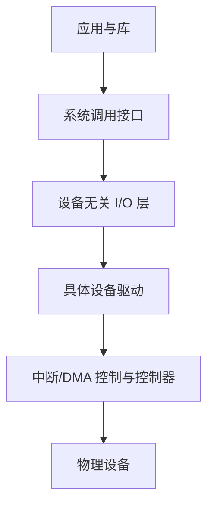
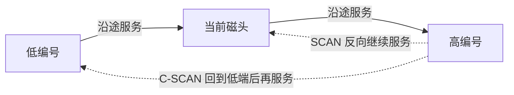

# I/O 管理：操作系统怎样统一设备

键盘按字符产生输入，网卡按帧收发数据，磁盘按块保存内容，显示器又有完全不同的控制方式。应用若直接理解每种控制器，就无法移植也无法安全共享设备。操作系统的 I/O 子系统用统一接口、设备驱动、队列和缓冲把这些差异隔离起来。

硬件层的总线、控制器、中断与 DMA 见[I/O 硬件](io_hardware.md)；本章关注操作系统收到 I/O 请求后怎样管理它。

## 1. 设备可以怎样分类

分类不是为了贴标签，而是为了决定适合的接口：

| 类型 | 最小可见单位 | 能否随机定位 | 例子 |
|---|---|---|---|
| 块设备 | 固定大小的块 | 通常可以 | HDD、SSD |
| 字符设备 | 字节或字符流 | 通常按到达顺序 | 终端、串口 |
| 网络设备 | 帧/数据包 | 按协议收发 | 以太网卡 |
| 时钟与计时设备 | 时间事件 | 不按数据偏移 | 定时器、时钟源 |

Linux 把许多设备暴露成特殊文件，但“万物皆文件”只是接口抽象。普通文件、管道、Socket 和设备文件的 `read/write` 具体语义仍由对象类型决定。

## 2. I/O 软件的分层

一次请求通常经过：



- **系统调用接口**提供 `read`、`write`、`ioctl`、`mmap` 等入口；
- **设备无关层**处理命名、权限、缓存、排队和通用错误；
- **设备驱动（device driver）**知道某类硬件的寄存器、命令和完成规则；
- **中断处理**接收设备事件，确认完成并推进后续工作。

驱动把硬件细节隐藏在统一接口后，但接口仍必须保留设备差异。例如，磁盘可以按偏移读取，键盘不能“定位到第 1000 个未来按键”。

## 3. 阻塞、非阻塞与异步完成

如果请求不能立即完成：

- **阻塞 I/O**让调用线程等待，事件完成后再唤醒；
- **非阻塞 I/O**立即返回“现在不能继续”，应用稍后重试；
- **异步 I/O**先登记请求，结果以后通过完成事件交付。

阻塞不表示 CPU 原地循环。线程通常进入等待状态，CPU 可以运行别的线程。非阻塞也不表示没有等待：应用可能通过 `epoll` 等接口等待一组对象变为就绪。网络 I/O 模型见[I/O 模型](../network/io_models.md)。

## 4. 缓冲、缓存和假脱机不是同一件事

### 缓冲 buffering

**缓冲**用一段临时存储协调生产者和消费者的速度或单位差异。例如，程序每次产生少量字节，磁盘更适合批量写块；缓冲区先积累数据再提交。

常见形式：

- 单缓冲：设备与进程交替使用一块缓冲；
- 双缓冲：设备填充一块时，进程处理另一块；
- 环形缓冲：多块按循环顺序交接，适合持续流。

缓冲区有容量上限。写满后必须定义阻塞、拒绝、丢弃还是覆盖旧数据，这就是背压和过载策略。

### 缓存 caching

**缓存**保存数据副本，以便以后再次访问时更快。页缓存保存文件数据副本；命中时可以避免设备读取。缓存关心复用，缓冲关心一次数据交接，两者可能使用同一块内存却目的不同。

### 假脱机 spooling

**SPOOL（Simultaneous Peripheral Operations On-Line，假脱机）**先把多个任务放到磁盘队列，由专门进程按设备能力依次处理。打印服务是典型例子：多个应用快速提交打印任务，打印机按顺序慢慢完成。

SPOOL 把独占设备虚拟成可由多个用户提交任务的共享服务，但不让一台打印机真正同时打印多张纸。

## 5. 设备预约、独占与共享

有些设备可以自然共享，例如磁盘上的不同文件；有些操作要求一段时间独占设备或通道。内核必须维护打开计数、所有权、权限和请求队列。

设备出错时，驱动把硬件状态转换成应用可处理的错误。错误可能立即返回，也可能在异步完成或稍后的同步操作中报告。应用不能把“请求已进入队列”误认为“设备已成功完成”。

## 6. 磁盘为什么需要调度

机械硬盘（HDD）用磁头访问旋转盘片。一次访问时间主要包含：

- **寻道时间**：磁头移动到目标磁道；
- **旋转等待**：等待目标扇区转到磁头下；
- **传输时间**：真正读写数据。

请求顺序会显著影响磁头移动。假设磁道范围 0～199，磁头在 53，请求队列为：

```text
98, 183, 37, 122, 14, 124, 65, 67
```

### FCFS

按到达顺序服务，规则公平、简单。总磁头移动量为：

```text
|53-98| + |98-183| + |183-37| + |37-122|
+ |122-14| + |14-124| + |124-65| + |65-67|
= 640 个磁道
```

### SSTF

**Shortest Seek Time First（最短寻道时间优先）**每次选择离当前磁头最近的请求。它通常减少平均移动，却可能让远处请求长期等待，形成饥饿。

从 53 开始，前几步为 `65 → 67 → 37 → 14 ...`，每一步都选择当时最近者。要逐步重算，不能把队列一次排序后就当作 SSTF。

### SCAN 与 LOOK

**SCAN（电梯算法）**沿一个方向服务沿途请求，到端点后反向。**LOOK**只走到该方向最远的待处理请求就反向，不必到物理端点。

### C-SCAN 与 C-LOOK

**C-SCAN**只在一个方向提供服务，到端点后快速回到另一端；**C-LOOK**在最远请求间循环。它们让不同位置的等待时间更均匀，但回程仍有移动成本。



## 7. SSD 为什么不能照搬机械磁盘模型

SSD 没有磁头和旋转等待，按磁道距离排序不再是主要问题。但 SSD 仍有队列、并行通道、内部擦除与写放大、设备缓存和寿命管理。

操作系统/设备仍可能合并、拆分和重排请求，以利用并行度和减少固定开销。具体策略由块层、驱动与设备共同决定。不要从“没有寻道”推导出“请求顺序和队列完全不重要”。

## 8. I/O 调度与正确性顺序

为了效率重排请求不能破坏上层正确性。文件系统和数据库会明确表达“哪些写必须先完成或先持久化”；普通的请求完成顺序不能自行替代这种协议。

例如，若先让目录指向新元数据，后写真正内容，断电后可能出现指向未初始化数据的目录项。文件系统通过日志、写入顺序和持久化命令维护恢复规则。详见[文件系统](file_systems.md)与[一次文件写入](file_write_path.md)。

## 9. 设备完成后线程为何还未必运行

设备完成请求后，驱动通过中断或轮询取得结果，更新请求状态并唤醒等待线程。唤醒只使线程进入就绪队列；它还要等调度器分配 CPU。因此应用观察到的等待还可能包含内核完成处理和就绪后的调度等待。

硬件如何产生和响应完成通知见[计算机 I/O 硬件](io_hardware.md)，线程从等待到再次运行的规则见[CPU 调度](cpu_scheduling.md)。

## 10. 设备故障与热插拔

设备可能超时、返回介质错误、被拔出或重置。I/O 子系统要防止失效设备拖垮所有调用者，并把错误传播到拥有请求的对象。

重试必须有边界：暂时性错误可以重试，但不加限制会放大负载；有副作用的操作还要知道设备是否可能已经完成。冗余存储提高可用性，也不能代替备份和端到端校验。

## 11. 常见误解

- **“阻塞 I/O 会让 CPU 一直空转。”** 等待线程通常睡眠，CPU 可运行别的任务。
- **“缓冲等于缓存。”** 缓冲协调一次传输，缓存依靠以后复用。
- **“SSTF 永远最好。”** 它可能让远处请求饥饿。
- **“SCAN 一定走到物理端点。”** LOOK 只走到最远待处理请求。
- **“SSD 没有机械寻道，所以不需要队列。”** 它仍有并行度、固定开销和设备内部管理。
- **“设备中断一到，应用立刻继续。”** 还要经过内核完成、唤醒和调度。
- **“驱动隐藏了所有设备差异。”** 统一接口仍保留字节流、块、消息等语义差别。

## 12. 应用中的 I/O 管理

| 场景 | 首先分析 |
|---|---|
| Web 服务大量连接 | 对象是否就绪、线程是否阻塞、缓冲上限 |
| AI 数据加载 | 顺序/随机访问、批量、缓存命中、并行队列 |
| 数据库写入 | 缓存与持久化边界、I/O 顺序、失败传播 |
| HFT 网卡与日志 | 队列所有权、完成通知、过载政策 |

基础问题总是：请求何时提交、数据在哪里、容量多大、完成由谁通知、错误在何时交付。

## 13. 思考题与计算题

1. 块设备、字符设备和网络设备为什么不适合完全相同的访问语义？
2. 系统调用层、设备无关层和驱动各承担什么职责？
3. 阻塞、非阻塞和异步 I/O 分别描述什么？
4. 用日志写入举例说明 buffering 与 caching 的区别。
5. SPOOL 怎样把独占设备包装成多用户可提交任务的服务？
6. 按本章请求序列，分别计算 FCFS、SSTF、SCAN（初始向高磁道）和 C-SCAN 的磁头移动总量；明确是否走到端点。
7. SSTF 为什么可能饥饿？SCAN 怎样缓解？
8. SSD 没有寻道后，I/O 排队还解决哪些问题？
9. 从设备完成到阻塞线程继续运行，中间有哪些步骤？
10. 为什么块层重排不能替代文件系统或数据库的持久化顺序协议？

## 参考依据

- 2025 年全国硕士研究生招生考试计算机学科专业基础考试大纲，操作系统“I/O 管理”部分。
- Abraham Silberschatz 等，《Operating System Concepts》，I/O Systems 与 Mass-Storage Structure 章节。
- Remzi H. Arpaci-Dusseau、Andrea C. Arpaci-Dusseau，《Operating Systems: Three Easy Pieces》，Persistence 部分。
- Linux 内核文档，Driver API、Block layer 与 Device model 文档。
