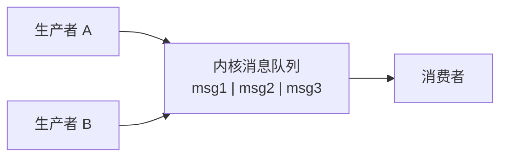
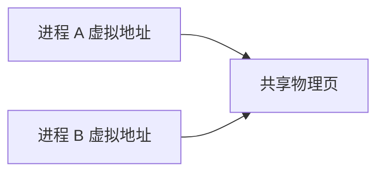
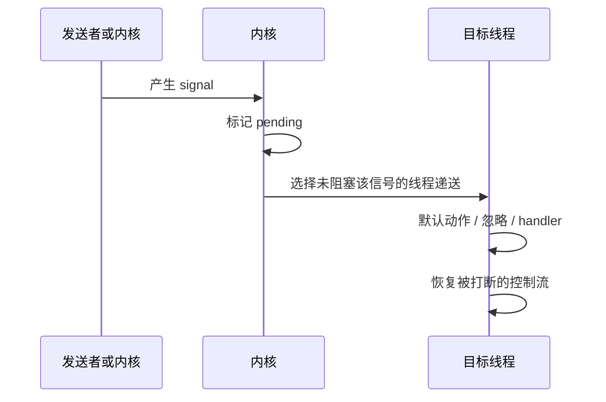

# 进程间通信：信号、共享内存、消息与 Socket

进程默认彼此隔离：一个进程不能直接读取另一个进程的地址空间。这能限制故障和权限，却也带来一个问题——两个进程怎样交换数据和通知事件？操作系统为此提供**进程间通信（Inter-Process Communication，IPC）**机制。

IPC 不是一个单独接口。管道、消息队列、共享内存、信号和 Socket 解决的问题不同：有的传字节，有的传带边界的消息，有的共享数据，有的只通知“某件事发生了”。

## 1. 先区分数据、通知与同步

| 需要完成的事 | 例子 | 适合的机制 |
|---|---|---|
| 连续传输字节 | 父进程读取子进程标准输出 | 匿名管道、字节流 Socket |
| 传递独立消息 | 工作进程领取任务 | 消息队列、数据报 Socket |
| 大量共享数据 | 多进程共同访问缓存 | 共享内存或文件映射 |
| 通知简单事件 | 请求进程优雅退出 | 信号 |
| 等待共享状态改变 | 等待共享队列出现元素 | 信号量、互斥锁、条件变量等同步机制 |

“共享内存传输最快”这种说法缺少上下文。共享内存少了一次进程间数据复制，但应用必须自己定义数据布局、并发同步、崩溃后的状态和对象生命周期。数据量小或通信双方不在同一台机器时，Socket 往往更自然。

## 2. 管道：由内核搬运字节

匿名管道由一个读端和一个写端组成，数据先进内核缓冲区，再由读者取走。它是单向字节流，没有天然消息边界；写端全部关闭且缓冲区读空后，读者才看到 EOF。

父子进程怎样通过 `fork` 继承两端、为什么必须关闭不用的一端、`dup2` 怎样把子进程标准输出接到管道，已在[进程、文件描述符与管道](processes_fds.md)完整讲解。本章不再重复实现。

**命名管道（FIFO）**在文件系统里有名字，因此没有共同祖先的进程也能打开它。名字只是找到通信对象的入口；实际字节仍由内核管道对象传递，它不是把内容永久保存在普通文件中。

## 3. 消息队列：内核保存带边界的记录

消息队列把每次发送保留为独立消息。接收者得到一条消息，而不是像管道那样自己从字节流中划分记录。

使用前必须回答：

1. 单条消息最大多大？
2. 队列满时发送者阻塞、失败还是丢弃？
3. 多个消费者怎样分配消息？
4. 进程崩溃后队列和未处理消息是否保留？
5. 是否需要确认、重试和去重？

不同系统提供的 POSIX 消息队列、System V 消息队列以及用户态消息中间件，持久性和投递保证都不同。“消息队列”这个名字本身不承诺恰好一次处理。

## 4. 共享内存：把同一物理页映射给多个进程

通常两个进程的相同虚拟地址指向不同物理内存。共享内存让内核把同一组物理页映射进多个进程的页表，于是写入者修改的字节可以被其他进程看到。

这里共享的是底层物理页，不要求两个进程使用相同虚拟地址。共享区域内部若保存指针，普通绝对地址通常只在创建它的地址空间有意义，因此更常使用相对偏移或明确的共享布局。

共享内存只解决“双方能看到同一批字节”，没有自动解决并发：

- 两个进程同时写同一字段可能发生数据竞争；
- 读者可能看到写到一半的数据结构；
- 进程崩溃时可能留下“正在更新”的状态；
- 区域何时创建、谁能访问、最后由谁删除都要规定。

因此共享内存通常还要配合进程共享的互斥锁、信号量、原子操作或单写者协议。同步机制见[进程与线程同步](os_synchronization.md)，地址映射见[虚拟内存](virtual_memory.md)。

## 5. Socket：统一同机与跨机通信

**Socket** 是内核维护的通信端点。互联网 Socket 可以跨机器通信；**Unix domain socket** 只在同一台机器上使用，用文件系统路径或抽象名字找到对端。

| 类型 | 提供的语义 | 常见用途 |
|---|---|---|
| 字节流 Socket | 有序字节流，没有应用消息边界 | TCP、Unix stream、本地 RPC |
| 数据报 Socket | 一次发送对应一个数据报边界 | UDP、Unix datagram、事件通知 |

Unix domain socket 不经过完整的外部 IP 路由过程，还可以让内核向接收方提供对端进程凭据。它适合本机客户端—服务端结构。管道更适合简单的父子字节流；Socket 更自然地支持双向、多客户端和请求—响应通信。

Socket 的网络协议细节见[计算机网络概述](../network/network_overview.md)，阻塞和事件通知见[I/O 模型](../network/io_models.md)。

## 6. 信号：异步通知，不是数据通道

**信号（signal）**是内核交付给进程或线程的一种异步通知。它适合表达“请注意某个事件”，不适合承载一段任意业务数据。

常见来源包括：

- 用户在终端按 `Ctrl-C`，终端驱动向前台进程组发送 `SIGINT`；
- 一个进程通过 `kill` 系统调用向另一个进程发送信号；
- 子进程状态改变，父进程收到 `SIGCHLD`；
- 当前指令非法访问内存，内核产生 `SIGSEGV`；
- 写入没有读者的管道，可能产生 `SIGPIPE`。

`kill` 这个名字容易误导：它的本质是发送信号，具体是否终止取决于信号种类和目标进程的处理方式。

## 7. 信号从产生到处理

一个信号经历：

1. **产生**：内核、硬件异常或其他进程触发信号；
2. **pending**：信号已经产生但尚未交付；
3. **递送**：内核在合适时机让目标执行默认动作、忽略或进入处理函数；
4. **返回**：处理完成后恢复原来的执行上下文。

进程可为多数信号选择三种处置：执行默认动作、忽略、安装处理函数。`SIGKILL` 和 `SIGSTOP` 不能被捕获、阻塞或忽略，因为系统需要始终保留强制终止和暂停进程的手段。

## 8. 信号掩码与 pending

线程可以用**信号掩码（signal mask）**暂时阻塞一组信号。阻塞不等于丢弃：信号通常先保持 pending，解除阻塞后再递送。

传统非实时信号通常只记录“至少来过一次”，同类信号多次到达未必排队成相同次数。实时信号可以排队并带少量附加值，但仍不应替代结构化消息通道。

在多线程程序中，每个线程有自己的信号掩码，而信号可能针对整个进程或特定线程。工程上常见的清晰做法是：所有工作线程阻塞一组控制信号，由一个专门线程用同步接口等待，再把它转换成普通队列事件。这样业务代码不必在任意指令之间突然进入 handler。

## 9. 为什么信号处理函数很受限制

信号可能在程序执行到几乎任意位置时插入。如果 handler 再调用一个内部正持锁的库函数，就可能死锁；若修改非原子共享状态，主流程可能看到破坏的数据。

POSIX 只保证一小组 **async-signal-safe** 函数可以安全地从信号处理函数调用。`printf`、普通内存分配和许多带锁库函数都不在其中。

稳妥原则是让 handler 只做最小工作，例如设置适合信号通信的标志，或向专用 pipe/eventfd 写一个通知；真正的日志、清理和状态转换回到正常控制流完成。具体可调用函数必须查目标平台文档。

## 10. 信号怎样影响系统调用

线程阻塞在系统调用时收到信号，调用可能：

- 在 handler 返回后自动重新开始；
- 返回 `EINTR`，让应用决定是否重试；
- 已完成一部分工作，返回实际处理的字节数。

结果取决于系统调用、信号处理配置和操作系统。正确代码应按接口契约处理部分成功和 `EINTR`，不能假设所有调用都会自动重启，也不能在已有部分结果后从头重复副作用。

## 11. 如何选择 IPC

按问题选择，而不是按“快慢排行榜”选择：

| 问题 | 优先考虑 |
|---|---|
| 父进程只需读取子进程输出 | 管道 |
| 同机多客户端请求—响应 | Unix domain socket |
| 跨机通信 | TCP/UDP 等互联网 Socket |
| 数据量大、双方受信且可共同设计同步 | 共享内存 + 明确同步协议 |
| 需要保留消息边界 | 消息队列或数据报 Socket |
| 只通知退出、重载或子进程状态 | 信号，再转入正常控制流 |

还要比较安全权限、容量上限、背压、崩溃恢复、序列化、版本兼容和调试难度。IPC 的正确选择取决于完整契约。

## 12. 常见误解

- **“共享内存没有复制，所以不需要同步。”** 正因为同时可见，更必须规定并发访问。
- **“管道的一次 write 对应一次 read。”** 管道是字节流，读取可合并或拆分写入内容。
- **“发送 SIGTERM 一定会立刻退出。”** 进程可捕获、延迟处理或忽略它；`SIGKILL` 才不可捕获。
- **“信号来了几次，handler 就一定运行几次。”** 普通同类信号可能合并。
- **“handler 里能调用任何平时可用的函数。”** 异步插入使带锁或不可重入函数不安全。
- **“消息队列天然恰好一次。”** 投递、确认、重试和持久性取决于具体实现和应用协议。

## 13. 应用中的 IPC

| 场景 | 通信方式 | 必须说明的边界 |
|---|---|---|
| Web 主进程管理 worker | Socket/pipe + signal | 连接归属、优雅退出、未完成请求 |
| AI 工具沙箱 | pipe/Unix socket | 输出容量、超时、取消不等于副作用回滚 |
| 数据库多进程架构 | 共享内存 + 同步原语 | 锁、崩溃恢复、共享布局版本 |
| HFT 同机组件 | 共享内存或进程内队列 | 所有权、容量、丢弃与恢复协议 |

这些系统可以使用相同基础机制，区别在于安全、可靠性、数据量和响应目标。

## 做题方法

IPC 选择题先把需求写成五项：通信范围、数据量、消息边界、是否共享内存、是否需要跨网络。

1. 管道传字节流，先写清谁持有读端/写端以及关闭时机；消息队列保留记录边界；共享内存避免在进程间复制大块数据，但同步必须另行设计。
2. Socket 题明确是流式还是报文式、同机还是跨机；一次 `send` 与一次 `recv` 在流式协议中不保证一一对应。
3. 对每种方案画数据路径，统计经过用户缓冲区、内核缓冲区或共享页的次数；“共享内存最快”不是不写同步与一致性成本的理由。
4. 信号题按“产生 → pending → 掩码判断 → 递送 → 处理后返回”模拟。被屏蔽不等于丢弃，而是暂时 pending；普通信号的多次产生也不能一律当作队列计数。
5. 若系统调用被信号打断，必须依据接口语义判断重启、返回 `EINTR` 还是已完成部分工作，不能只写“重试”。

验算时检查阻塞闭环：发送者满时等谁、接收者空时等谁、那个参与者是否仍有机会运行。若双方都等待对方先做事，就应继续检查是否形成死锁。

## 14. 思考题与面试追问

1. 进程隔离解决了什么问题，为什么因此需要 IPC？
2. 管道、消息队列和字节流 Socket 的消息边界有何不同？
3. 共享内存为什么通常还需要互斥锁、信号量或原子协议？
4. 为什么共享区中的普通指针可能对另一个进程无效？
5. `kill(pid, SIGTERM)` 为什么不等于“保证杀死进程”？
6. 信号被阻塞时，blocked 与 pending 分别描述什么？
7. 为什么不应在信号处理函数里直接调用 `printf` 或分配内存？
8. 一个阻塞系统调用被信号打断后，应用应该检查哪些返回情况？
9. 设计父进程执行子命令并收集 stdout/stderr 的方案：需要哪些 pipe，哪些 fd 必须在哪一方关闭，怎样避免输出填满导致死锁？
10. 为同机推理服务设计 IPC 时，你会怎样在 Unix socket 和共享内存之间选择？

### 参考答案与解答

展开答案

1. 隔离让进程拥有独立地址空间与资源视图，减少互相破坏；代价是不能直接读写彼此普通内存，因此需要内核通道、共享映射或 socket 交换数据与通知。
2. 管道和字节流 socket 都不保留应用 write 边界，需自行定界；消息队列按记录保存边界，但仍有单消息大小、容量和阻塞规则。
3. 多进程能同时访问共享页，普通读改写会竞争；还需锁、信号量或原子协议规定所有权、可见顺序和等待/唤醒。
4. 普通指针存的是某个进程虚拟地址；另一进程可能把共享页映射到不同地址。共享结构应使用相对偏移、索引或明确的同址映射协议。
5. `kill` 只是请求内核发送信号；SIGTERM 可被阻塞、捕获或处理后继续，目标也可能已不存在或权限不足。SIGKILL 才不可捕获，但仍需内核调度并回收。
6. blocked 是该线程当前不允许递送的信号集合；pending 是已经产生但尚未递送的信号状态。解除屏蔽后 pending 信号才可能递送。
7. `printf`、分配器等通常不是 async-signal-safe，可能在被中断时已经持有内部锁；处理器中重入会死锁或破坏状态。应只做最小安全通知，把工作交回正常控制流。
8. 检查返回值、`errno==EINTR`、是否已完成部分 I/O，以及接口是否自动重启。重试时必须从剩余偏移继续，且非幂等操作要确认是否已产生副作用。
9. 建两条 pipe：stdout 和 stderr 各一条。父保留两条读端、关闭写端；子关闭读端，把 `STDOUT_FILENO/STDERR_FILENO` dup 到对应写端后关闭原写端。父用 poll/epoll 同时排空，等两端 EOF 后再完成 wait，避免任一缓冲区填满。
10. 控制消息、小对象、可变长度请求和易维护性优先 Unix socket；超大张量、稳定同机拓扑且复制已证实为瓶颈时可用共享内存。共享内存还必须补充同步、句柄/偏移、生命周期、崩溃回收和容量协议。

## 参考依据

- 2025 年全国硕士研究生招生考试计算机学科专业基础考试大纲，操作系统“进程间通信”部分。
- Remzi H. Arpaci-Dusseau、Andrea C. Arpaci-Dusseau，《Operating Systems: Three Easy Pieces》，Interlude: Process API 与 Concurrency 部分。
- W. Richard Stevens、Stephen A. Rago，《Advanced Programming in the UNIX Environment》，IPC 与 Signals 章节。
- POSIX.1 / The Open Group Base Specifications，Signals、Pipes、Shared Memory 与 Message Queues。
- Linux man-pages：`signal(7)`、`sigaction(2)`、`pipe(7)`、`unix(7)`、`shm_overview(7)`。
