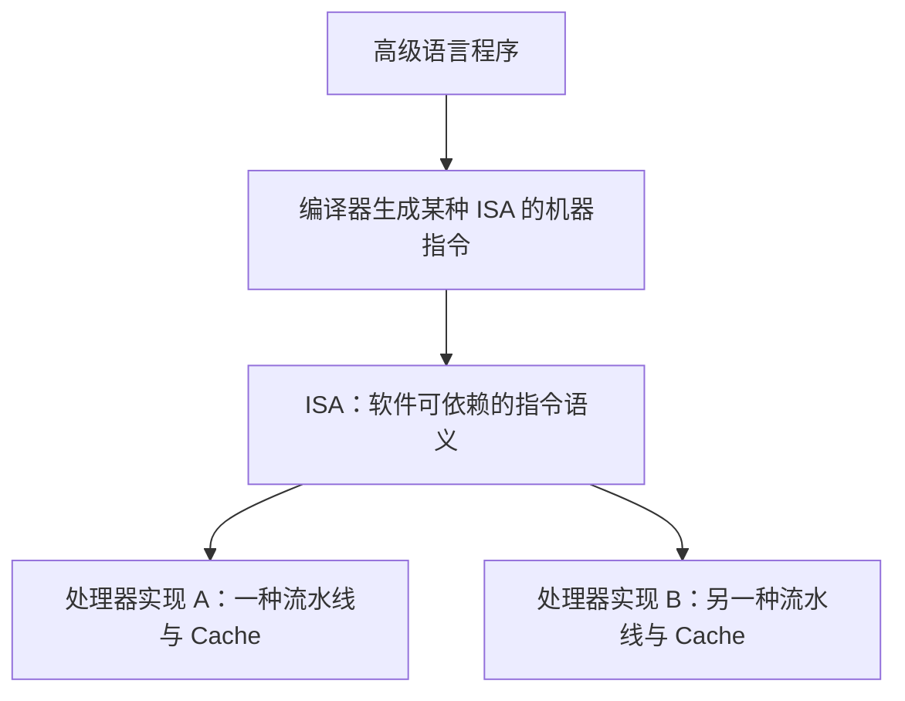
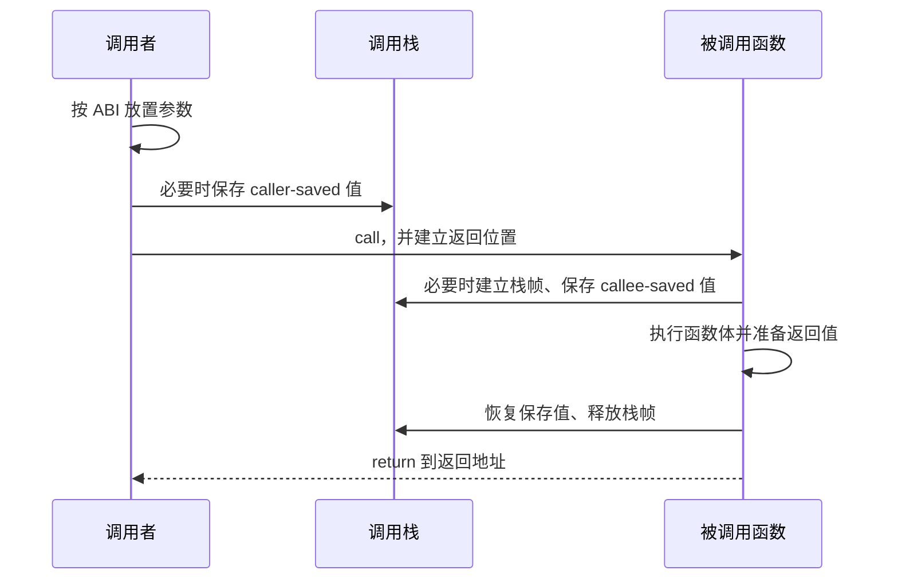

# ISA 与机器级程序：代码怎样变成 CPU 能执行的指令

高级语言允许我们写 `if`、循环、数组和函数，但 CPU 最终看到的是机器指令、寄存器和内存地址。本章从这两层之间搭一座桥：不要求背任何操作码，而是解释一段程序为什么能够被编译、链接、装载和执行。

示例采用一套接近 RISC-V 的简化教学写法，例如 `add`、`load`、`store` 和条件跳转。它只用于展示通用思想。不同 ISA 的指令名称、寄存器数量和调用约定不同，不能把示例寄存器当成所有平台的共同规则。

## 1. ISA 与微架构不是同一个概念

**指令集架构（Instruction Set Architecture，ISA）**是软件和处理器之间的接口约定。它规定程序能够依赖什么，例如：

- 有哪些机器指令，每条指令表示什么操作；
- 有哪些程序可见寄存器；
- 指令怎样表示操作数和地址；
- 整数、地址等数据怎样表示；
- 异常、原子操作和特权操作具有什么可见语义。

**微架构（microarchitecture）**是某款处理器在芯片内部怎样实现这套 ISA，例如流水线深度、执行单元数量、Cache 大小、分支预测器和乱序执行结构。



两款处理器可以实现相同 ISA，因此能够运行相同的机器代码，却因为微架构不同而具有不同性能。ISA 回答“指令是什么意思”，后续 [CPU 如何执行程序](cpu_arch.md)回答“处理器内部怎样重叠并加速这些指令”。

## 2. 一条指令包含什么

机器指令至少要表达两类信息：

1. **操作码（opcode）**：要做加法、读取内存、比较还是跳转；
2. **操作数（operand）**：数据来自哪个寄存器、立即数或内存位置，结果写到哪里。

下面是抽象写法，不是具体二进制编码：

```text
add  r3, r1, r2     # r3 = r1 + r2
addi r3, r1, 8      # r3 = r1 + 常数 8
load r3, 16(r1)     # r3 = 内存[r1 + 16]
beq  r1, r2, target # 若 r1 == r2，跳到 target
```

处理器真正读取的是位串。编码中要划出字段保存操作码、寄存器编号、立即数或其他控制信息。编码空间有限，因此指令设计必须在可表达能力、译码复杂度和代码大小之间取舍。

### 2.1 定长指令与变长指令

**定长指令**让大多数指令具有相同长度。处理器较容易确定下一条指令的位置，也较容易并行取指和译码，但简单操作也要占用固定空间。

**变长指令**允许不同指令占用不同字节数，可以让常用简单指令更紧凑，却需要先判断当前指令长度，取指和译码更复杂。

这不是“定长一定快、变长一定慢”的结论。真实处理器会使用预译码、指令缓存和内部微操作等机制，最终表现取决于具体实现和程序。

## 3. 寄存器与内存为什么要分开

**寄存器（register）**是 CPU 指令能够直接命名的少量高速存储位置。它们保存当前计算使用的值、地址和控制状态。

**内存（memory）**容量更大，用地址编号保存程序代码、数组、对象和调用栈。内存访问需要先形成地址，还可能经过 Cache、TLB 和主存。

```text
寄存器：数量少，指令直接使用
    ↕ load / store
内存：容量大，用地址定位
```

在典型的 **load/store 架构**中，算术指令主要操作寄存器。若要计算内存中的两个数，通常需要：

```text
load r1, 0(r10)     # 从内存读取第一个数
load r2, 0(r11)     # 从内存读取第二个数
add  r3, r1, r2     # 在寄存器中相加
store r3, 0(r12)    # 把结果写回内存
```

“读取变量”在机器级可能包含地址计算和 load，“写回变量”可能需要 store。编译器也可能把频繁使用的局部值一直保留在寄存器中，从而不为每次源码访问都生成内存读写。

## 4. 寻址方式：指令怎样找到操作数

**寻址方式（addressing mode）**规定指令怎样得到操作数本身或操作数的地址。不同 ISA 支持的组合不同，下面是组成原理和机器级程序中常见的概念。

| 寻址方式 | 含义 | 抽象例子 | 常见用途 |
|---|---|---|---|
| 立即数 | 数值直接写在指令中 | `addi r1, r2, 8` | 常量、步长 |
| 寄存器 | 值已经在寄存器中 | `add r3, r1, r2` | 算术与比较 |
| 直接寻址 | 指令给出某个内存地址或可重定位地址 | `load r1, [address]` | 全局对象；具体 ISA 未必直接支持 |
| 寄存器间接 | 寄存器保存内存地址 | `load r1, 0(r2)` | 指针解引用 |
| 基址加偏移 | 地址为基址寄存器加常量偏移 | `load r1, 16(r2)` | 结构体字段、栈变量 |
| 变址 | 基址再加由索引计算出的偏移 | `[base + index × scale]` | 数组元素 |
| PC 相对 | 地址为当前指令位置附近的偏移 | `branch target` | 分支、位置无关代码 |

### 4.1 数组地址算例

假设 `values` 是从地址 `base` 开始的 `u32` 数组，每个元素 4 字节。`values[i]` 的地址是：

```text
address = base + i × 4
```

简化机器级步骤可以写成：

```text
shift_left r_index_bytes, r_i, 2     # i × 4
add        r_address, r_base, r_index_bytes
load       r_value, 0(r_address)
```

左移两位等价于无符号数乘 4。真实编译器也可能用一条支持比例因子的地址计算指令完成部分工作。关键不是背写法，而是理解数组访问需要从“起始地址、下标、元素大小”形成有效地址。

### 4.2 直接寻址为什么还需要重定位

源文件被单独编译时，编译器可能还不知道某个全局对象最终放在哪个地址。目标文件会先记录“这里需要引用符号 `counter`”，链接器或装载器以后再根据实际布局修正相关位置。这个修正过程称为**重定位**，本章后面会完整解释。

## 5. RISC 与 CISC 的边界

**RISC（Reduced Instruction Set Computer）**通常强调规则的指令编码、load/store 风格和较简单的单条指令语义。RISC-V、AArch64 属于常见例子。

**CISC（Complex Instruction Set Computer）**通常提供更多样的指令格式和更复杂的单条指令能力，x86-64 是常见例子。

这组名称描述设计倾向，不是现代处理器的简单二分法：

- RISC ISA 也会不断增加向量、加密和原子等扩展；
- x86-64 处理器可以把复杂指令译成内部微操作；
- 程序性能取决于编译器、指令数量、依赖、内存访问和微架构，不能只凭“RISC”或“CISC”名称判断。

初学阶段只需抓住接口差异：不同 ISA 让编译器使用不同的指令和调用约定，但都要完成相同的控制流、数据运算和内存访问。

## 6. `if` 怎样变成比较和跳转

高级语言代码：

```rust
fn absolute(value: i64) -> i64 {
    if value < 0 {
        -value
    } else {
        value
    }
}
```

一种简化翻译是：

```text
compare r_value, 0
branch_if_greater_or_equal non_negative
negate r_result, r_value
jump done

non_negative:
move r_result, r_value

done:
```

CPU 不理解源码中的大括号和 `else`。编译器用比较设置条件，再用条件跳转选择下一条指令地址。某些 ISA 也可以使用条件移动或其他无分支形式，因此源码中的 `if` 不保证机器代码中一定存在一条分支指令。

## 7. 循环怎样变成标签、更新和回跳

高级语言中的数组求和：

```rust
fn sum(values: &[u64]) -> u64 {
    let mut total = 0;
    for &value in values {
        total += value;
    }
    total
}
```

一种逐元素的简化机器级结构是：

```text
r_ptr   = 数组起始地址
r_end   = 数组结束地址
r_total = 0

loop:
    if r_ptr == r_end: jump done
    r_value = load 0(r_ptr)
    r_total = r_total + r_value
    r_ptr   = r_ptr + 8
    jump loop

done:
    return r_total
```

这里包含四个基础动作：比较是否结束、按地址读取元素、更新累加器、把指针推进到下一个元素。编译器还可能展开循环、使用向量指令，或完全消除能够提前计算的循环。这些优化见[编译器怎样理解并优化 Rust 程序](compiler_optimizations.md)。

## 8. 函数调用为什么需要约定

调用者和被调用函数必须就下面的问题达成一致：

- 参数放在哪些寄存器或栈位置；
- 返回值放在哪里；
- 返回地址怎样保存；
- 哪些寄存器可以被被调用函数改写；
- 栈指针、栈帧和数据对齐遵守什么规则。

这套二进制层面的约定称为**调用约定（calling convention）**，它属于 **ABI（Application Binary Interface，应用二进制接口）**的一部分。ABI 还会规定数据类型大小、对象文件格式、系统接口等规则。

### 8.1 一个明确的平台示例：RISC-V 整数调用约定

下面只用来展示角色，不要求背寄存器编号：

| 角色 | RISC-V ABI 示例 | 谁负责保护 |
|---|---|---|
| 参数与整数返回值 | `a0` 到 `a7`，返回值通常从 `a0` 开始 | 调用后可以改变 |
| 返回地址 | `ra` | 需要继续调用其他函数时由当前函数妥善保存 |
| 栈指针 | `sp` | 调用边界必须恢复 |
| 临时寄存器 | `t0` 等 | caller-saved |
| 保存寄存器 | `s0` 等 | callee-saved |

**caller-saved（调用者保存）**表示调用者若还需要某个寄存器中的值，就要在调用前自行保存，因为被调用函数可以改写它。

**callee-saved（被调用者保存）**表示被调用函数若要使用这个寄存器，必须先保存旧值，并在返回前恢复，让调用者感觉它没有变化。

为什么两类都需要？如果所有寄存器都由调用者保存，每次调用可能保存大量实际上不会被修改的值；如果都由被调用者保存，简单函数也要保存很多不需要的寄存器。两类约定让编译器根据实际使用情况分担责任。

## 9. 栈帧、`call`、`return` 与递归

**调用栈（call stack）**保存尚未结束的函数调用。每次调用需要的那一段栈空间称为**栈帧（stack frame）**，它可能包含：

- 无法全部放入寄存器的局部变量和参数；
- 需要跨函数调用保存的寄存器；
- 返回地址；
- 调试和栈展开所需的信息。

并不是每个函数都一定建立完整栈帧。简单叶子函数如果不调用其他函数，且所有值都能放在寄存器中，编译器可能不调整栈。



### 9.1 递归为什么需要多份状态

递归函数会在前一次调用尚未返回时再次调用自身。每一层调用都有自己的参数、局部状态和返回位置，因此通常需要各自的栈帧。

以 `factorial(3)` 为例：

```text
factorial(3) 等待 factorial(2)
factorial(2) 等待 factorial(1)
factorial(1) 返回 1
factorial(2) 恢复自己的 n=2，返回 2
factorial(3) 恢复自己的 n=3，返回 6
```

如果递归太深，调用栈可能超过操作系统为线程准备的可用范围，产生栈溢出。尾调用是否能复用栈帧取决于语言语义、ABI 和编译器，不应默认所有递归都会被优化。

## 10. 从源代码到可执行文件

一个编译型程序通常经过下面几个阶段：


工具链可能把若干阶段合并，也可能在链接时继续优化，但每一层解决的问题不同。

### 10.1 编译与汇编

编译器分析高级语言的类型、控制流和语义，生成目标 ISA 的机器级表示。汇编器再把汇编形式转换为目标文件中的机器指令和数据。

**目标文件（object file）**通常还不是可以直接启动的完整程序。它包含代码段、数据段、符号表和重定位记录，并可能引用其他文件中定义的函数或变量。

### 10.2 符号是什么

**符号（symbol）**是目标文件中用来表示函数、全局对象、段或其他链接对象的名字，例如函数 `parse_request` 或全局变量 `CONFIG`。一个目标文件可以：

- 定义某个符号；
- 引用另一个目标文件或库定义的符号；
- 记录哪些机器代码或数据位置依赖这个符号的最终地址。

链接器把定义和引用匹配起来。如果两个文件都要求提供同一个不允许重复的定义，或没有任何文件提供所需定义，链接通常会报错。

### 10.3 重定位是什么

单独编译 `main.o` 时，编译器可能不知道库函数最终放在可执行文件的哪个地址。它先生成占位信息，并记录一条**重定位项（relocation entry）**：

```text
“这里需要引用符号 process，等知道布局后修正。”
```

链接器安排各段位置、计算符号地址，再修正相应指令或数据。位置无关代码、动态链接和不同 ISA 会使用不同重定位类型，但基础问题都是“单独生成的片段怎样在最终地址布局中正确互相引用”。

## 11. 静态链接与动态链接

**静态链接**通常把程序需要的库代码选入最终可执行文件。优点是部署时对相应共享库依赖较少；代价是多个程序可能各自携带相同代码，文件更大，更新库时通常需要重新链接程序。

**动态链接**让可执行文件在运行时使用共享库。多个进程可以映射同一份只读库代码，库也可以独立更新，但启动和部署必须正确找到 ABI 兼容的库版本。

| 问题 | 静态链接 | 动态链接 |
|---|---|---|
| 库代码何时组合 | 构建时进入可执行文件 | 装载或运行时连接共享库 |
| 部署依赖 | 可执行文件通常更自包含 | 需要可用且兼容的共享库 |
| 文件与内存共享 | 文件通常更大 | 多进程可共享只读库映射 |
| 库更新 | 通常重新构建程序 | 可替换兼容共享库，但 ABI 必须匹配 |

“动态链接一定更省内存”或“静态链接一定更快”都过于绝对。实际结果还取决于被选入的代码、页面共享、启动方式、链接器优化和运行环境。

## 12. 装载器怎样把文件变成进程

可执行文件仍然只是存储设备上的文件。启动时，操作系统装载过程大致需要：

1. 读取可执行文件头，确认格式、目标 ISA 和程序入口；
2. 为代码、只读数据和可写数据建立虚拟内存映射；
3. 准备栈、参数和环境；
4. 若使用动态链接，装载动态链接器和所需共享库，并完成必要的符号解析与重定位；
5. 建立初始 CPU 寄存器状态；
6. 让线程从约定的入口开始执行。

装载通常使用虚拟内存映射和按需缺页，并不要求启动前把整个文件一次性复制进物理内存。完整地址翻译见[虚拟内存](virtual_memory.md)，进程创建和 `execve` 见[进程、线程、文件描述符与管道](processes_fds.md)。

## 13. 三个容易混淆的边界

### 13.1 ISA 不等于汇编语法

ISA 规定指令语义和编码；汇编语言是人类可读的文本表示。同一个 ISA 甚至可能存在不同风格的汇编语法。

### 13.2 ISA 不等于 ABI

ISA 说明 CPU 能执行什么指令；ABI 说明不同编译单元、函数、库和操作系统接口怎样协作。使用相同 ISA 的两个系统也可能使用不同 ABI。

### 13.3 链接不等于装载

链接把目标文件和库组织为可执行文件或共享库，解析符号并处理重定位；装载发生在程序启动时，把可执行映像放入进程虚拟地址空间并准备开始执行。

## 14. 常见误解

- **“CPU 直接执行 Rust、C++ 或 Python 源代码。”** CPU 执行机器指令；解释型语言也要由解释器或运行时的机器指令完成工作。
- **“ISA 相同，性能就相同。”** ISA 相同只保证软件接口兼容，微架构可能完全不同。
- **“一个源码语句对应一条机器指令。”** 一条语句可能生成多条指令，也可能被优化消除；一条指令也可能完成多个底层动作。
- **“函数参数一定放在栈上。”** 现代 ABI 常优先使用参数寄存器，超出的参数或特殊对象才使用栈等位置。
- **“所有寄存器都由被调用函数恢复。”** ABI 会区分 caller-saved 与 callee-saved。
- **“目标文件已经可以直接运行。”** 它可能仍有未解析符号和待处理重定位，需要链接。
- **“动态库函数的最终地址在编译时全部确定。”** 动态链接允许部分地址在装载或首次使用时解析。

## 15. 本章小结

- ISA 是软件与处理器之间的指令接口，微架构是具体芯片内部实现；
- 指令用操作码和操作数字段描述计算、访存和控制转移；
- 寄存器保存当前计算状态，内存通过地址访问，load/store 连接两者；
- 立即数、寄存器、间接、基址加偏移、变址和 PC 相对是常见寻址思想；
- `if` 会形成比较与控制转移，数组访问需要基址、下标和元素大小共同计算地址；
- 调用约定规定参数、返回值、寄存器保存和栈的责任，调用栈保存未结束的函数状态；
- 编译器、汇编器、链接器和装载器分别完成翻译、编码、组合和进程启动；
- 符号为函数、全局对象等链接对象提供名字，重定位把尚未确定的引用修正到最终布局。

## 做题方法

机器级程序题可以分成“单条指令、控制流、函数边界、文件生成”四层处理：

1. 对每条指令写出**读什么、算什么、写什么、下一条 PC 是什么**，并把立即数与寄存器当前值分开。
2. 地址题统一写成 `有效地址 = 基址 + 索引 × 元素大小 + 位移`；数组下标是否从 0 开始、元素多宽必须先标出。PC 相对寻址则以规范规定的 PC 基准为准。
3. `if` 和循环先画基本块与跳转箭头，再逐块模拟寄存器值。验算循环时至少检查第一次、最后一次以及退出后的下标，最容易错的是比较与自增的先后顺序。
4. 函数调用题画调用者和被调用者两栏：参数放哪、返回地址由谁保存、哪些寄存器谁负责恢复、栈指针怎样回到调用前。递归每深入一层都必须有独立的未完成状态。
5. 链接题按“符号定义/引用 → 节区位置 → 重定位修补 → 装载映射”追踪。静态链接、动态链接和装载解决的是不同阶段的问题，不能用“都在找地址”合并回答。

最后做守恒检查：调用返回后栈指针应恢复；callee-saved 寄存器应保持原值；每个未定义符号必须有可见定义或在链接时报告错误。不需要背 opcode，也能检验机器级推演是否自洽。

## 16. 思考题与面试追问

1. ISA 与微架构分别规定什么？为什么两款相同 ISA 的 CPU 性能可以不同？
2. 为什么 load/store 架构通常不能直接把两个任意内存位置相加后写入第三个内存位置？
3. `array[i]` 的有效地址由哪三个量组成？若元素大小为 8 字节，`i=5` 时偏移是多少？
4. 立即数寻址和寄存器间接寻址分别取得的是值还是地址？
5. 一个 `if/else` 可以怎样表示成比较、条件跳转和无条件跳转？为什么优化后不一定真的存在分支？
6. caller-saved 和 callee-saved 分别由谁保护？为什么调用约定需要同时存在两类寄存器？
7. 递归调用为什么通常需要多份栈帧？什么情况下简单函数可能完全不建立栈帧？
8. 目标文件中的符号和重定位分别解决什么问题？
9. 静态链接与动态链接的主要区别是什么？它们各自把哪些责任放在构建期或运行期？
10. 链接已经完成后，操作系统装载器还需要做哪些工作？

### 参考答案与解答

<details><summary>展开答案</summary>

1. ISA 规定软件可见的指令、寄存器、地址与异常语义；微架构规定怎样用流水线、缓存、乱序等实现它。同一 ISA 可有不同频率、CPI、预测器和缓存，所以性能不同。
2. load/store 架构的算术操作数来自寄存器；应先 load 两个内存值、在寄存器相加、再 store。这样让指令格式和数据通路规则更规整。
3. 有效地址由数组基址、索引 `i` 和元素大小组成：`base + i×size`。`size=8 B, i=5` 时偏移 `5×8=40 B`；单位验算是“元素 × 字节/元素 = 字节”。
4. 立即数寻址把指令内编码的常量当作值；寄存器间接寻址把寄存器内容当地址，再到该地址取操作数。寄存器里同一 bit 模式由指令语义决定解释方式。
5. 可写成 `compare → 条件跳到 else → then → 无条件跳到 end → else`。编译器也可能用条件移动、掩码或其他无分支形式，前提是保持可观察行为且成本合适。
6. caller 在调用前保存仍需使用的 caller-saved；callee 若使用 callee-saved，就在入口保存、返回前恢复。两类并存让短生命周期临时值不必总保存，也让跨调用长期值有稳定位置。
7. 每层递归都要保存自己的返回地址、参数/局部值和未完成进度，所以通常需要独立栈帧。叶函数或所有状态都在寄存器、且无需栈空间时可能省略栈帧。
8. 符号给函数/对象命名并记录定义或引用；重定位记录“最终地址确定后，要在何处按何种规则修补”。符号解决找谁，重定位解决地址尚未确定。
9. 静态链接把所需代码多在构建期复制/合并进可执行文件；动态链接保留对共享库的运行时绑定。前者部署独立但文件较大，后者共享与升级方便但依赖装载器和兼容 ABI。
10. 装载器仍要建立虚拟地址映射和权限、映射动态库、完成必要的动态重定位/符号绑定、建立初始栈与参数、初始化运行环境并把控制交给入口点。

</details>

## 一手资料与经典教材

- [2025 年 408 计算机学科专业基础考试大纲（高校公开附件）](https://www.uwh.edu.cn/uploads/article/20250609/660428d58334252302af691bf99e064e.pdf)
- [RISC-V Unprivileged ISA Specification](https://docs.riscv.org/reference/isa/unpriv/unpriv-index.html)
- [RISC-V ELF psABI：调用约定、ELF 与重定位](https://riscv-non-isa.github.io/riscv-elf-psabi-doc/)
- [GNU Linker 官方文档](https://sourceware.org/binutils/docs/ld/)
- [CS:APP 官方站](https://csapp.cs.cmu.edu/)
- [Computer Organization and Design, RISC-V Edition 官方目录](https://www.educate.elsevier.com/book/details/9780128203316)
