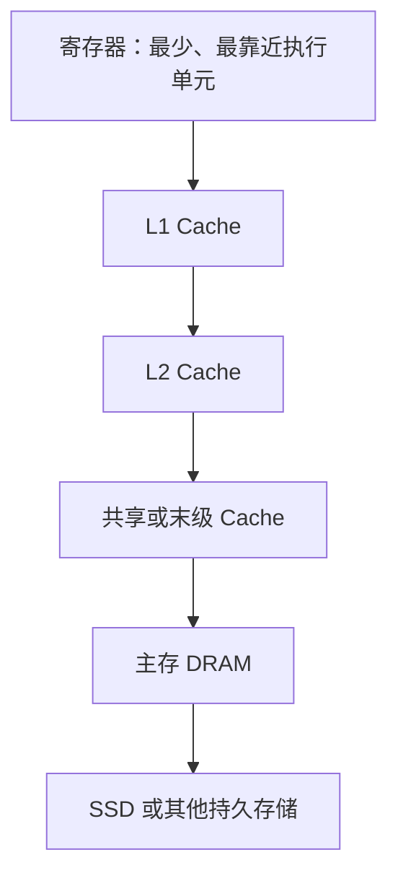
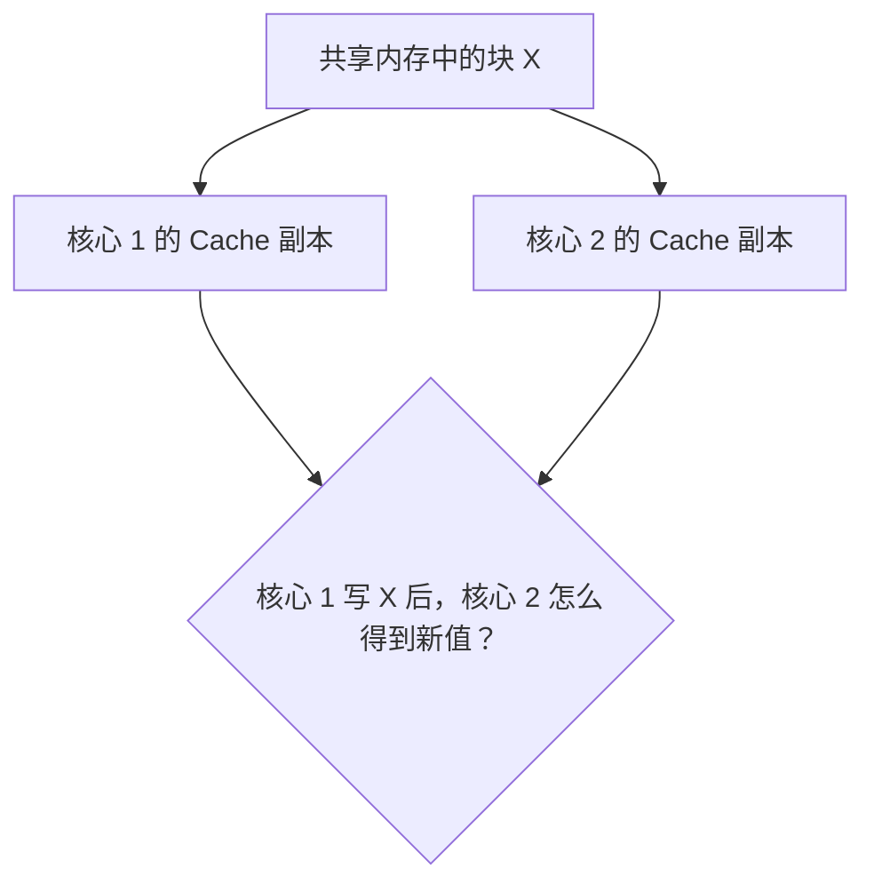
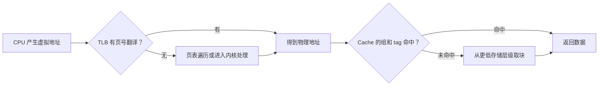

# 存储层次与 Cache 工作原理

CPU 想读取一个数时，最理想的情况是数据就在寄存器里；但寄存器太少，程序的大部分数据只能放在更大、更远的存储设备中。现实中不存在一种存储器能够同时做到容量无限、速度最快、价格最低并且断电不丢数据。

计算机因此使用**存储层次**（memory hierarchy）：把少量快速存储放在上层，把大量较慢存储放在下层，并自动把近期可能使用的数据块留在靠近 CPU 的地方。Cache 不是独立于内存的神秘盒子，而是这套分层思想在 CPU 与主存之间的具体实现。

已有的 [CPU 如何执行程序](cpu_arch.md) 介绍了“命中与未命中”的直觉，[内存布局与缓存效率](memory_layout.md) 讨论程序怎样组织数据。本章补上硬件侧的完整过程：Cache 行放在哪里、地址怎样匹配、写操作怎样传播、未命中怎样分类，以及它与虚拟内存怎样衔接。

## 1. 为什么需要多种存储器

一条 load 指令在 ALU 算出地址后，数据不一定立即出现。越靠近 CPU 的存储通常越快、越小、每 bit 成本越高；越远的层级通常越大、越慢。



“上层”和“下层”是逻辑位置，不是主板上的上下方向。上层保存下层一小部分内容的副本。CPU 先查上层，找不到才去下层，并把取回的一整块数据填入上层。

### 1.1 延迟、带宽与容量

评价存储器时至少要分清三个指标：

- **延迟**（latency）：一次请求从发出到数据可用需要多久；
- **带宽**（bandwidth）：稳定传输时单位时间能搬多少数据；
- **容量**（capacity）：总共能保存多少数据。

一辆大货车运一趟很慢但每趟载货多，可以有高带宽和高延迟。存储系统同样可能擅长连续传输，却不擅长随机读取。不能用“每秒 GB 数”直接代替“单次读取多少纳秒”。

## 2. SRAM、DRAM 与 ROM

### 2.1 SRAM：用稳定电路保存一个 bit

**SRAM**（Static Random-Access Memory，静态随机存取存储器）通常用多个晶体管构成一个双稳态单元。只要持续供电且不被改写，它就能保持状态，不需要周期性刷新。

SRAM 速度快，但每个 bit 需要较多晶体管，面积和成本较高。因此它常用于容量较小、需要快速访问的 Cache，而不是大容量主存。“static”表示不用刷新，不表示断电后仍能保存；SRAM 通常仍是易失性存储。

### 2.2 DRAM：用电荷保存一个 bit

**DRAM**（Dynamic Random-Access Memory，动态随机存取存储器）典型单元使用一个电容和一个访问晶体管。电容是否带电代表 bit 状态。

电荷会逐渐泄漏，所以控制器必须周期性**刷新**。读取也通常需要感应很小的电荷差，并把内容恢复。DRAM 单元更小、密度更高，适合主存；代价是访问过程比 SRAM 复杂且更慢。

DRAM 芯片把单元组织为行和列。一次访问通常先**激活**某一行，把整行内容送入行缓冲，再在其中选择列：


若下一次访问仍命中已打开的行，可以省去部分步骤；若要切换行，则需要额外操作。这是连续访问与随机访问行为不同的硬件原因之一。

<details>
<summary>DRAM 为什么要有 Bank、行和 Burst</summary>

DRAM 阵列很大，如果每个单元都单独接到芯片引脚，布线无法实现。二维行列选择减少了地址和感应线路。多个 Bank 让不同内部区域可以交错工作，隐藏一部分激活与预充电等待。

芯片激活一整行后，连续传送相邻多个数据比每次重新选择更划算，因此 DRAM 接口常按 burst 成组传输。这与 Cache 按块取数据能相互配合，但 Cache 行大小与 DRAM 行大小不是同一个概念。

</details>

### 2.3 ROM：断电后仍保留预先存储的内容

**ROM**（Read-Only Memory，只读存储器）泛指以非易失方式保存固件或固定数据的一类技术。名称强调正常运行时主要读取，但不同类型的可编程能力不同：

| 类型 | 写入或擦除方式 | 典型特点 |
|---|---|---|
| Mask ROM | 制造时确定 | 成本适合大批量，之后不能改 |
| PROM | 用户一次性编程 | 写入后通常不能擦除 |
| EPROM | 紫外线整体擦除 | 可重复编程，但操作不便 |
| EEPROM | 电方式擦写 | 可按较小单位更新 |
| Flash | 电方式按块擦除 | 密度高，SSD 与固件存储常见 |

Flash 可以改写，却不能像普通 SRAM 一样随意按字节快速覆盖；擦除粒度、写入寿命和控制流程不同。因此“属于 ROM 家族”不等于物理上永远不能写。

### 2.4 三者不要按一个指标排序

| 属性 | SRAM | DRAM | ROM / Flash 类 |
|---|---|---|---|
| 是否易失 | 通常是 | 是 | 通常否 |
| 是否需要刷新 | 否 | 是 | 否 |
| 常见用途 | CPU Cache | 主存 | 固件、持久内容 |
| 设计重点 | 快速访问 | 密度与容量 | 非易失与保存成本 |

具体延迟和价格随工艺、容量和产品变化，基础题应比较结构与用途，不要背一个永远不变的纳秒数字。

## 3. 局部性为什么让 Cache 有效

Cache 容量远小于主存，却能服务大量请求，因为程序访问通常具有**局部性**：

- **时间局部性**：刚访问过的数据或指令，近期可能再次访问；
- **空间局部性**：访问某个地址后，附近地址可能很快被访问。

循环变量和反复调用的函数体现时间局部性；顺序扫描数组和顺序执行指令体现空间局部性。

Cache 不会只取请求的一个 byte，而会在层级之间传输固定大小的连续块。这个块通常叫 **cache block** 或 **cache line**。例如一条 64 B Cache 行可以同时带回 8 个连续的 `u64`。程序随后读取邻近元素时，就可能直接命中。

块不能无限增大：更大块能利用空间局部性，却会延长填充、占用更多带宽，并挤出其他有用块。若程序访问没有空间局部性，带回的额外字节会被浪费。

## 4. 命中、未命中与 AMAT

**命中**（hit）表示请求的数据块已经在当前 Cache；**未命中**（miss）表示必须去更低层级取得。常用三个量描述平均成本：

- **hit time**：命中时查询并返回数据的时间；
- **miss rate**：请求中未命中的比例；
- **miss penalty**：未命中后从更低层取得数据并恢复服务的额外时间。

平均访存时间 **AMAT**（Average Memory Access Time）的基础公式是：

`AMAT = hit time + miss rate × miss penalty`

假设 L1 命中时间为 1 ns，未命中率为 5%，去下一层的额外惩罚为 60 ns：

`AMAT = 1 + 0.05 × 60 = 4 ns`

虽然 95% 请求只需 1 ns，少量昂贵 miss 仍把平均值拉到 4 ns。这就是为什么“命中率从 95% 到 97% 只提高两个百分点”可能显著影响平均时间。

AMAT 是教学平均模型，不直接描述尾部延迟、请求并行、乱序隐藏等待或带宽饱和。使用它时要说明每个量的层级和单位。

## 5. 一条 Cache 里到底保存什么

Cache 不能只存数据，还必须知道每行副本来自主存哪个地址。一个简化 Cache 行包含：

- **data block**：一整块数据；
- **tag**：原地址的高位标识，用来确认是不是想要的块；
- **valid bit**：该槽位是否已经装有有效数据；
- **dirty bit**：写回 Cache 中该块是否被修改、尚未写到下层；
- 还可能有一致性状态、替换信息和纠错码。

因此，“32 KiB Cache”通常指数据容量，不代表芯片只使用 32 KiB bit 存储；tag 和元数据也占空间。

### 5.1 为什么地址要拆成 tag、set index 和 block offset

若每次都把请求地址和 Cache 中每一行比较，硬件成本会很高。Cache 先用地址中间的一部分定位一个**组**（set），只在该组的若干行里比较 tag；最后用低位的 **block offset** 选择行内具体 byte。

```text
地址高位                                       地址低位
┌──────────────── tag ────────────────┬─ set index ─┬─ block offset ─┐
│ 这是不是原地址所属的内存块？          │ 应该查哪一组？ │ 行内第几个字节？ │
└─────────────────────────────────────┴─────────────┴────────────────┘
```

若数据容量为 `C` byte、块大小为 `B` byte、每组有 `E` 行，则：

```text
组数 S = C / (B × E)
offset 位数 b = log2(B)
index 位数 s = log2(S)
tag 位数 t = 地址位数 - s - b
```

基础题通常让 `B` 和 `S` 为 2 的幂，所以位数是整数。

### 5.2 完整数值例子

考虑一个简化 Cache：

- 数据容量 `C = 32 KiB = 32768 B`；
- 块大小 `B = 64 B`；
- 8 路组相联，即 `E = 8`；
- 使用 48 位物理地址。

计算：

```text
S = 32768 / (64 × 8) = 64 组
b = log2(64) = 6 位
s = log2(64) = 6 位
t = 48 - 6 - 6 = 36 位
```

一次读取按下面顺序进行：

1. 取地址低 6 位作为行内 offset；
2. 再取 6 位选择 64 组中的一组；
3. 把剩余 36 位 tag 与该组 8 行的有效 tag 并行比较；
4. 若某行 valid 且 tag 相等，则命中，用 offset 选择所需 byte；
5. 若都不相等，则未命中，需要选择牺牲行并从下层填充。

这里用物理地址建立最清楚的计算模型。真实 L1 Cache 可能让地址翻译与索引部分重叠，后文再解释。

## 6. 直接映射、组相联与全相联

**相联度**（associativity）表示一个内存块在选定范围内有多少个可放位置。

### 6.1 直接映射

**直接映射 Cache** 每组只有一行，即 `E = 1`。每个内存块只能去唯一组中的唯一位置。

优点是选择简单、tag 比较器少、命中路径短。缺点是两个频繁使用、恰好映射到同一组的块会不断互相驱逐，即使其他组还有空位。

### 6.2 E 路组相联

**E 路组相联 Cache** 每组有 E 行。地址先确定唯一组，数据可以放在组内任一路。命中时需要比较 E 个 tag，并选择匹配路的数据。

相联度提高能减少部分冲突，但比较器、选择器、功耗和替换决策都会更复杂。

### 6.3 全相联

**全相联 Cache** 只有一个组，内存块可以放在任意行。它最大限度避免固定组冲突，却必须在许多行之间比较 tag，成本随容量增大。

| 组织方式 | 组数 | 每组行数 | 一个块可放的位置 | 常见权衡 |
|---|---:|---:|---:|---|
| 直接映射 | 多 | 1 | 1 | 简单快，冲突多 |
| E 路组相联 | 多 | E | E | 冲突与成本折中 |
| 全相联 | 1 | 全部 | 所有行 | 灵活，比较和替换昂贵 |

### 6.4 一个冲突例子

假设直接映射 Cache 有 4 组、每块 16 B。块号等于 `地址 / 16`，组号等于 `块号 mod 4`。

地址 `0x00` 属于块 0，映射组 0；地址 `0x40` 属于块 4，也映射组 0。若程序交替访问二者：

```text
0x00 -> miss，装入组 0
0x40 -> miss，替换组 0
0x00 -> miss，再替换组 0
0x40 -> miss……
```

Cache 其他三组可能完全空闲，这仍会反复 miss。改成 2 路组相联后，两个块有机会同时留在组 0。

## 7. 未命中后替换哪一行

直接映射没有选择：唯一位置就是牺牲行。组相联或全相联 Cache 的目标组满时，需要**替换策略**选择被驱逐的行。

常见策略包括：

- **LRU**（Least Recently Used）：替换最长时间没被使用的行；
- **FIFO**（First In, First Out）：替换最早进入该组的行；
- **Random**：按伪随机方式选择；
- **Pseudo-LRU**：用较少状态近似 LRU。

精确 LRU 在路数较高时要维护复杂的相对次序，硬件成本会快速增加，所以真实 Cache 不一定使用教科书式精确 LRU。替换策略不能创造容量；如果工作集长期大于 Cache，再聪明的策略也会有容量 miss。

## 8. 读 miss 时发生什么

一次读 miss 的简化流程是：

1. 在目标组选择无效行或牺牲行；
2. 若牺牲行是写回策略下的 dirty 行，先把它写到下层；
3. 向下层请求包含目标地址的整个块；
4. 收到数据后写入 data、tag，设置 valid，清理或初始化 dirty 状态；
5. 把请求的字送给 CPU，恢复等待的指令。

填充不一定要等整块全部到齐才交付目标字。有的设计支持 critical-word-first 或 early restart，先返回 CPU 急需部分。这是实现优化，不改变“Cache 以块管理副本”的基本模型。

多个 miss 还可能并行存在。支持并行未命中的 Cache 需要记录每个在途请求；基础 AMAT 公式不会展示这种重叠。

## 9. 写操作的两组独立选择

读操作只需找到最新值；写操作还要决定何时更新下层，以及写 miss 是否先把块装入当前 Cache。这形成两组不同策略。

### 9.1 写直达与写回

**写直达**（write-through）在更新 Cache 的同时把写操作发送到下一层。优点是当前层与下一层较容易保持一致；缺点是每次写都产生下层流量。通常需要写缓冲让 CPU 不必等待每次下层写完成。

**写回**（write-back）只更新当前 Cache，并把该行标记为 dirty；直到行被驱逐时才写入下一层。它能合并对同一块的多次写，减少流量，但替换 dirty 行有额外步骤，控制也更复杂。

### 9.2 写分配与非写分配

发生写 miss 时：

- **写分配**（write-allocate）先把整个块取进 Cache，再在 Cache 中修改；适合写后还会继续访问该块的情况；
- **非写分配**（no-write-allocate，也叫 write-around）把写直接发往下层，不把块装入当前 Cache；可避免一次性写污染 Cache。

常见组合是“写回 + 写分配”和“写直达 + 非写分配”，但它们不是不可打破的法律。必须分别回答两个问题：**命中写怎样传播，未命中写是否分配**。

| 策略维度 | 选择 A | 选择 B |
|---|---|---|
| 写命中如何处理 | 写直达：同时发下层 | 写回：暂留 dirty 行 |
| 写未命中如何处理 | 写分配：先取块 | 非写分配：绕过本层 |

## 10. 三类基础 miss 与一致性 miss

经典 **3C 模型**把单处理器 Cache miss 分成：

### 10.1 Compulsory miss：第一次从未见过

**强制未命中**（compulsory miss，也叫 cold miss）发生在某个块第一次被访问时。Cache 里此前不可能有它。

更大的块或预取有时能利用空间局部性减少后续强制 miss，但也会增加无用数据和带宽。单纯提高相联度不能消除真正的第一次访问。

### 10.2 Capacity miss：工作集装不下

**容量未命中**（capacity miss）表示活跃数据块总量超过 Cache 容量，即使全相联也会发生。提高相联度没有根治作用；需要更大 Cache、缩小工作集或改变算法分块方式。

### 10.3 Conflict miss：映射位置互相冲突

**冲突未命中**（conflict miss）来自有限相联度：Cache 总容量可能足够，但多个活跃块被迫竞争同一组。提高相联度、改变地址布局或添加 victim cache 等方法可以缓解。

3C 是用于分析原因的理想分类。真实硬件上的预取、替换策略和多级 Cache 会让一次 miss 的归类没有教科书模拟那么直接。

### 10.4 Coherence miss：其他核心让副本失效

多核系统中，另一个核心写入同一块，可能让本核心的副本失效。随后读取会发生与**缓存一致性**相关的 miss，有时被作为第 4 个 C。

它不是单核 3C 模型里的容量或映射问题，而是多个私有副本需要保持一致造成的通信。

## 11. 多级 Cache 与局部、全局未命中率

现代处理器通常有多级 Cache。L1 靠近核心，容量小、查询快；L2 更大；末级 Cache 可能由多个核心共享。具体层数、容量、是否共享和包含关系因处理器而异。

L1 未命中并不表示立即访问 DRAM，它可能在 L2 命中。因此两级 AMAT 可以写成：

```text
AMAT = L1 hit time
     + L1 miss rate × (L2 hit time + L2 local miss rate × memory penalty)
```

假设：

- L1 命中 1 ns，L1 miss rate 为 5%；
- L2 额外查询 4 ns，进入 L2 的请求中有 20% miss；
- 访问主存额外 60 ns。

则：

```text
AMAT = 1 + 0.05 × (4 + 0.20 × 60)
     = 1 + 0.05 × 16
     = 1.8 ns
```

这里的 20% 是 **L2 局部未命中率**：只以到达 L2 的请求为分母。L2 的**全局未命中率**以所有 CPU 内存请求为分母，在这个例子中是 `5% × 20% = 1%`。面试计算最常见错误之一，就是混用两个分母。

### 11.1 多级之间是否保存同一块

多级 Cache 可能采用：

- **inclusive**：上层块也保证存在于下层；
- **exclusive**：不同层尽量保存不同块；
- **non-inclusive / non-exclusive**：不作强制包含承诺。

包含策略影响有效容量、驱逐与一致性实现。不能看见 L1/L2/L3 就默认它们一定 inclusive。

## 12. 缓存一致性只解决什么基本问题

每个核心有私有 Cache 时，同一内存块可能出现多个副本：



**缓存一致性**（cache coherence）要让对同一地址的写入按协议传播，避免一个核心永久读取过期副本。常见协议让写者先取得独占修改权限，并使其他副本失效；MESI 是一类常见状态协议的名字。

基础阶段只需掌握三点：

1. 一致性的粒度通常是 Cache 行，不是高级语言变量；
2. 写共享行可能引起失效和行所有权转移；
3. 一致性并不自动提供高级语言所需的同步语义。

**一致性**关注同一地址的副本最终怎样统一；**内存一致性模型**（memory consistency model）还规定不同地址的读写顺序可以怎样被其他线程观察。Rust 程序仍必须使用锁或带正确 ordering 的原子操作，详见[并发基础：线程、锁、消息与 Actor](concurrency.md)。相邻变量共享一行产生的伪共享见[内存布局与缓存效率](memory_layout.md)。

<details>
<summary>失效协议的一次写入直觉</summary>

假设核心 A、B 都以只读共享状态缓存了行 X。A 想写 X 时，先请求写权限；协议使 B 的副本失效。A 得到独占可修改状态后完成写入。B 下一次读 X 时不能再用旧副本，需要从拥有最新数据的层级重新取得。

这段过程说明为什么两个线程虽然修改不同变量，只要变量落在同一 Cache 行，仍可能发生所有权来回转移。具体 MESI 状态转换、目录协议和 snoop 互连属于更深入的多处理器架构内容。

</details>

## 13. 虚拟内存与 Cache 怎样连接

程序发出的是**虚拟地址**。页表把虚拟页号映射成物理页号；Cache 则以更小的块保存数据副本。页与 Cache 行解决不同层次的问题：

| 机制 | 典型管理单位 | 主要目的 |
|---|---|---|
| 虚拟内存 | page，常为 KiB 量级 | 地址翻译、隔离、保护、按需分配 |
| Cache | block/line，常为几十 B | 自动保存近期数据，缩短访问等待 |

最容易理解的物理地址 Cache 路径是：



必须区分三个事件：

- **TLB miss**：地址翻译缓存中没有虚拟页到物理页的映射，页表可能仍然有效；
- **page fault**：现有页表状态无法完成访问，需要操作系统处理，可能是正常按需分配，也可能是非法访问；
- **Cache miss**：地址已经能定位数据，但当前 Cache 没有那个数据块。

完整的页表、缺页和 TLB 过程见[虚拟内存：程序为什么看见自己的地址空间](virtual_memory.md)。

### 13.1 为什么有的 L1 可以边翻译边查询

若先完成全部地址翻译再查询 L1，两个时间会串联。某些 L1 使用 **VIPT**（Virtually Indexed, Physically Tagged，虚拟索引、物理 tag）：页内偏移在翻译前后不变，可以先用其中若干位选择组，同时由 TLB 产生物理 tag，随后比较。

这要求 Cache 的组索引位与块内 offset 能安全落在页内偏移范围，否则同一物理地址的不同虚拟别名可能被放入不一致位置。具体容量、相联度和页大小形成的约束属于进阶实现；基础题先使用物理地址拆分即可。

## 14. 预取、写缓冲和内存级并行

基础 Cache 模型按“请求、等待、返回”串行描述，现代 CPU 还会尝试重叠等待：

- **硬件预取**根据连续步长等模式提前请求可能使用的块；
- **写缓冲**临时保存待下传写入，让前端继续执行；
- **非阻塞 Cache**允许某个 miss 等待时继续处理其他命中或多个 miss；
- **内存级并行**（Memory-Level Parallelism，MLP）表示同时存在多个独立内存请求。

这些机制可以隐藏一部分平均延迟，但会消耗带宽和跟踪资源。错误预取会搬来不用的数据、污染 Cache；独立请求太少时也无法形成 MLP。因此“主存延迟是 60 ns”不等于每条 load 都让 CPU 停 60 ns，也不等于这个成本一定能完全隐藏。

## 15. 怎样分析一段访问序列

手算 Cache 题时使用固定步骤，可以避免凭感觉判断：

1. 写出 `C`、`B`、`E`，计算组数 `S`；
2. 明确地址按 byte 编址，计算块号 `address / B`；
3. 计算组号 `block number mod S` 和 tag；
4. 按访问顺序维护每组 valid、tag、dirty 与替换状态；
5. 每次标记 hit/miss，miss 时说明类型和是否需要写回；
6. 最后再计算 miss rate 或 AMAT。

例如一个 2 组、每组 2 路、块大小 4 B 的空 Cache，使用 LRU，访问 byte 地址：`0, 4, 8, 0, 16, 4`。

```text
地址 0  -> 块 0 -> 组 0 -> miss，组 0 放块 0
地址 4  -> 块 1 -> 组 1 -> miss，组 1 放块 1
地址 8  -> 块 2 -> 组 0 -> miss，组 0 再放块 2
地址 0  -> 块 0 -> 组 0 -> hit，块 0 变为最近使用
地址 16 -> 块 4 -> 组 0 -> miss，按 LRU 驱逐块 2
地址 4  -> 块 1 -> 组 1 -> hit
```

结果是 2 hit、4 miss，miss rate 为 `4/6`。块 0、1、2、4 第一次出现都属于 compulsory miss；这个短序列没有足够信息仅凭一次模拟严格区分之后所有 miss 的 3C 类型，分类时需与相同容量的全相联基准比较。

## 16. 常见误解

- **“Cache 保存的是变量。”** Cache 按地址范围和固定大小的行工作，不知道 Rust 变量或对象边界。
- **“命中率高，程序就一定快。”** 还要看命中时间、miss penalty、带宽、并行度和请求是否位于关键依赖链。
- **“相联度越高越好。”** 它能减少冲突，但会增加比较、选择、功耗和替换成本。
- **“写回不会写主存。”** 它只是推迟并合并下传；dirty 行驱逐或同步时仍要写更低层。
- **“提高相联度能解决容量 miss。”** 相联度主要缓解冲突；工作集装不下仍会 miss。
- **“Cache coherence 等于线程安全。”** 硬件副本一致只是基础，程序仍需遵守语言内存模型和同步规则。
- **“TLB miss、page fault、Cache miss 是一件事。”** 它们分别发生在翻译缓存、页表/映射和数据缓存层。
- **“L1、L2、L3 一定逐级包含。”** 包含关系是具体微架构选择。

## 17. 三类岗位怎样使用这些知识

- **传统后端**：哈希表、数据库索引和序列化访问的工作集与布局会改变 miss；容量规划要区分内存带宽、Cache 容量和 DRAM 容量。
- **AI Infra**：张量连续性、分块、批大小和算子融合决定数据能否在 Cache 中复用；预处理可能受带宽而不是 ALU 数量限制。
- **系统与 HFT**：二进制消息顺序解析能利用空间局部性，共享写热点会触发一致性流量；在修改对齐和预取之前应先确认具体 miss 与访问模式。

三类系统都遵循同一原则：先画出数据从哪一层到哪一层，再用访问序列、工作集和计数器验证原因，而不是把所有等待统称为“内存慢”。

## 18. 本章小结

- SRAM 不需刷新、速度快但密度低，常用于 Cache；DRAM 需要刷新、密度高，常用于主存；ROM/Flash 类用于非易失内容。
- Cache 利用时间和空间局部性，以块为单位保存下层副本；命中时间、未命中率和惩罚共同决定 AMAT。
- 地址被拆成 tag、set index 和 block offset；容量、块大小和相联度决定组数与各字段宽度。
- 直接映射、组相联和全相联在冲突数量与硬件成本之间取舍；替换策略只在有多个候选行时有意义。
- 写直达/写回回答命中写怎样下传，写分配/非写分配回答写 miss 是否先装入块。
- compulsory、capacity、conflict 分别来自首次访问、容量不足和映射冲突；多核还可能出现 coherence miss。
- 多级 Cache 要区分局部和全局 miss rate；一致性不等于语言级线程同步。
- 虚拟内存按页做翻译与保护，Cache 按行保存数据；TLB miss、page fault 和 Cache miss 是不同事件。

## 做题方法

Cache 计算题最好固定使用同一张草稿表：

1. 由容量 `C`、块大小 `B`、相联度 `E` 算组数 `S=C/(B×E)`，检查 `S` 是否为题设允许的整数。
2. 地址位数为 `m` 时，块内偏移位数 `b=log₂B`，组索引位数 `s=log₂S`，标记位数 `t=m-s-b`。验算必须满足 `t+s+b=m`。
3. 对每个访问地址依次求块号 `address/B`、组号 `block mod S` 和 tag；按时间顺序维护每组的有效位、tag、脏位和替换次序，不能只统计地址出现次数。
4. 写访问同时回答两组独立问题：写命中采用 write-through 还是 write-back，写 miss 采用 write-allocate 还是 no-write-allocate。
5. 平均访问时间先画命中层次，再按条件概率计算。两级 Cache 中要区分 L1 的 local miss rate 与“访问到主存”的 global miss rate。

访问序列做完后，用三个检查验算：每组行数不能超过 `E`；块内不同偏移应映射到同一 Cache 块；未命中总数应等于 compulsory、capacity、conflict 等分类之和（若题目把一致性 miss 单列，也要另计）。

## 19. 思考题与面试、408 追问

1. 为什么 SRAM 适合 Cache、DRAM 适合主存？“SRAM 不刷新”为什么不等于断电不丢数据？
2. DRAM 的行缓冲是什么？连续访问为什么可能比随机跨行访问更容易利用它？
3. 分别举出时间局部性和空间局部性的代码访问模式。Cache 为什么按块而不是按单 byte 填充？
4. Cache 命中时间 2 ns、miss rate 4%、miss penalty 80 ns，AMAT 是多少？若 miss rate 降为 2%，其他不变，改善多少？
5. 一个 64 KiB、64 B 块、4 路组相联 Cache 有多少组？若使用 48 位地址，tag、index、offset 各多少位？
6. 给定地址后，硬件怎样用 index、tag、valid 和 offset 判断并返回一次命中？
7. 直接映射、4 路组相联和全相联分别需要比较多少个候选 tag？相联度提高解决了什么，又增加什么？
8. 为什么精确 LRU 在高相联度 Cache 中成本高？随机或 pseudo-LRU 为什么可能更实际？
9. 写回 Cache 驱逐 clean 行和 dirty 行时分别做什么？dirty bit 解决了什么问题？
10. 写直达与写回、写分配与非写分配为什么是两组问题？为四种组合各描述一次写 miss 路径。
11. compulsory、capacity、conflict miss 分别怎样识别？扩大容量、提高相联度、增大块分别主要影响哪类？
12. 某系统 L1 miss rate 为 8%，到达 L2 的请求中 25% miss。L2 的全局 miss rate 是多少？为什么不能直接把 25% 放进总请求分母？
13. “L1 miss 就访问 DRAM”错在哪里？写出两级 AMAT 的嵌套表达式。
14. Cache coherence 与 memory consistency 有什么区别？为什么有 MESI 仍要使用 Rust 的锁或原子类型？
15. 两个线程写不同计数器为什么仍可能发生 coherence miss？Cache 行粒度在其中起什么作用？
16. TLB miss、page fault、Cache miss 分别查找或补全什么？为什么 page fault 必须由操作系统处理，而 TLB miss 可能由硬件页表遍历解决，也可能在采用软件管理 TLB 的体系中进入内核？
17. 页大小 4 KiB、Cache 行 64 B 时，页内 offset 与行内 offset 各几位？一个页包含多少 Cache 行？
18. 对本章给出的 2 组 2 路访问序列继续追加 `8, 0, 4`，按 LRU 更新每组并统计新增 hit/miss。
19. 大块能降低哪些 miss，又可能增加哪些成本？为什么不存在对所有程序都最优的块大小？
20. 为什么硬件预取有时使程序变慢？请从带宽、污染和页边界三个角度分析。

### 参考答案与解答

<details><summary>展开答案</summary>

1. SRAM 单元快、无需刷新但面积大，适合小容量 Cache；DRAM 密度高、成本低但需刷新，适合主存。二者都是易失存储，SRAM“不刷新”不表示断电保持。
2. 行缓冲保存一次激活的 DRAM 行；后续访问同一行可省去重新激活的部分开销。随机跨行会频繁关闭/激活行，降低行命中率。
3. 时间局部性：循环反复读取同一计数器；空间局部性：顺序遍历数组。Cache 按块填充是利用邻近地址很可能随后访问，并分摊下层传输固定开销。
4. `AMAT=2 ns+0.04×80 ns=5.2 ns`。miss rate 降至 2% 后为 `2+0.02×80=3.6 ns`，减少 `1.6 ns`，相对改善 `1.6/5.2≈30.8%`。单位验算是“概率 × ns = ns”。
5. 组数 `S=64 KiB/(64 B×4)=256=2^8`。offset `log₂64=6` 位，index `log₂256=8` 位，tag `48-8-6=34` 位；三者相加为 48。
6. 用 index 选中一组，并行比较各路 `valid=1` 且 tag 相等；匹配一路即命中，再由 offset 选块内字节。无匹配则 miss，并按替换/填充协议处理。
7. 直接映射比较 1 个 tag，4 路比较 4 个，全相联比较全部行。更高相联度减少 conflict miss，却增加比较器、选择、替换、能耗和命中路径复杂度。
8. 精确 LRU 要记录所有路的相对新旧关系，路数升高时状态和更新逻辑快速增大。随机或 pseudo-LRU 用更少状态近似选择，可能多一些 miss，但硬件成本更可控。
9. clean 行与下层一致，可直接失效；dirty 行含尚未下传的修改，驱逐前要写回。dirty bit 避免对每个被替换行都做不必要写流量。
10. 四种写 miss：① write-through+write-allocate：先取块、更新 Cache，并立即写下层；② write-through+no-write-allocate：绕过 Cache 写下层；③ write-back+write-allocate：取块、在 Cache 修改并置 dirty；④ write-back+no-write-allocate：本次绕过写下层、Cache 不填充（组合较少见）。前一维回答命中后何时下传，后一维回答 miss 是否取块。
11. 第一次访问块是 compulsory；同容量全相联仍 miss、且不是第一次，是 capacity；全相联命中但当前相联组织 miss，是 conflict。增容量主要减 capacity，提高相联度主要减 conflict；增块可减相邻访问的 compulsory，但也可能加大污染和 penalty。
12. 全局 L2 miss rate `0.08×0.25=0.02=2%`。25% 的分母只是到达 L2 的请求，不是所有 CPU 访问。
13. L1 miss 后通常先访问 L2/L3，只有更低层也 miss 才到 DRAM。两级教学式为 `AMAT=T_L1+MR_L1×(T_L2+MR_L2_local×P_mem)`。
14. coherence 约束多个 Cache 对同一地址副本怎样一致；consistency 约束不同内存操作对线程可见的顺序。MESI 不理解 Rust 数据竞争和复合不变量，程序仍需锁/原子建立语言层 happens-before。
15. 两个计数器若落在同一 Cache 行，任一核心写都会请求整行独占并使对方副本失效，产生伪共享与 coherence miss。协议粒度是行，不是变量。
16. TLB miss 补地址翻译缓存；page fault 处理页表无有效映射/权限等异常；Cache miss 补数据行。缺页涉及分配、I/O 或进程信号，需 OS 决策；TLB miss 可由硬件遍历页表，也可由软件管理 TLB 的内核处理。
17. `4 KiB=2^12 B`，页内 offset 12 位；`64 B=2^6 B`，行内 offset 6 位；每页行数 `4096/64=64`。
18. 原序列结束时组 0 的 LRU→MRU 为块 `0,4`，组 1 含块 `1`。追加地址 `8`（块2）miss，驱逐块0；地址 `0` miss，驱逐块4；地址 `4`（块1）hit。新增 `1 hit、2 miss`，最终组0为块 `2,0`，组1仍为块1。
19. 大块利用空间局部性，可减少相邻地址首次访问的 miss；也会增加 miss penalty、带宽占用、Cache 污染并减少可容纳块数。访问步长和工作集不同，所以没有统一最优值。
20. 错误预取占用主存/互连带宽；预取无用块会驱逐有用块；跨到未映射或新页会增加 TLB/页表压力，且预取器通常受页边界限制。先用计数器验证覆盖率、准确率和带宽变化。

</details>

## 20. 权威依据与延伸阅读

- [2025 年 408 计算机学科专业基础考试大纲（高校公开附件）](https://www.uwh.edu.cn/uploads/article/20250609/660428d58334252302af691bf99e064e.pdf)：用于核对 SRAM、DRAM、Cache 映射、替换、写策略与虚拟存储器的考试范围。
- [Patterson 与 Hennessy，《Computer Organization and Design: RISC-V Edition》官方页面](https://shop.elsevier.com/books/computer-organization-and-design-risc-v-edition/patterson/978-0-12-820331-6)：第 5 章 “Large and Fast: Exploiting Memory Hierarchy” 是本章层次结构的主要经典来源。
- [该书官方 companion：Cache 控制器与存储层次扩展材料](https://shop.elsevier.com/books/book-companion/9780128203316)：用于核对 Cache 控制和多级层次的进一步边界。
- [CS:APP 官方 Chapter 6 预览](https://csapp.cs.cmu.edu/2e/ch6-preview.pdf)：覆盖 SRAM、DRAM、ROM、局部性与 Cache 的程序员视角。
- [CS:APP 3e 官方图表目录：Memory Hierarchy](https://csapp.cs.cmu.edu/3e/figures.html)：用于核对 DRAM 组织、总线访问和实际多级 Cache 主题。
