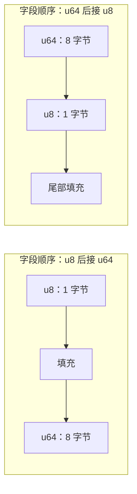
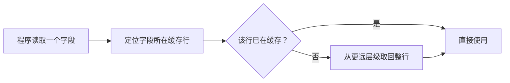
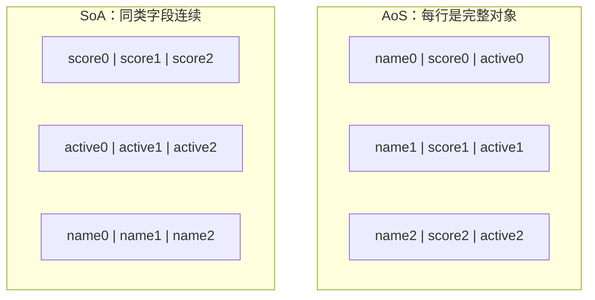
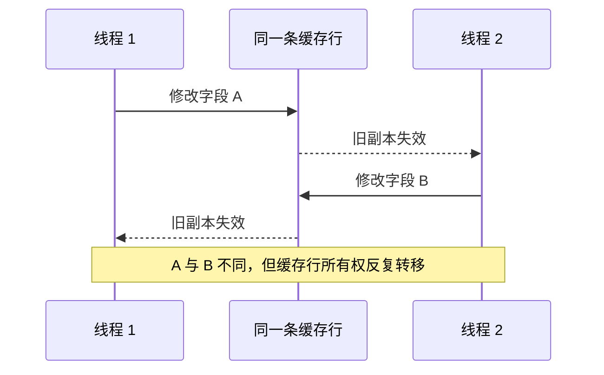

# 内存布局与缓存效率

程序中的结构体、数组和对象，最终都要变成内存中的一串字节。**内存布局**描述这些字节按照什么顺序存放、从什么地址开始，以及字段之间是否存在空隙。

布局不是只有“追求极致性能”时才需要理解。它直接影响：

- 一个对象占用多少内存；
- CPU 一次取回的数据里，有多少真正会被使用；
- 数据能否按硬件要求正确访问；
- 多个线程修改相邻数据时，是否会互相干扰；
- 二进制协议或外部接口能否正确解释这些字节。

这些影响来自字节、地址和对齐规则，以及程序访问数据的顺序。Cache 的映射、替换和一致性机制见[存储层次](memory_hierarchy.md)。

## 1. 内存中的数据是什么样子

可以把内存想成一排带编号的字节格子。每个格子的编号就是**地址**。一个 `u8` 占一个字节，一个 `u64` 通常占连续八个字节。

```text
地址       1000  1001  1002  1003  1004  1005  1006  1007
一个 u64  [ b0 ][ b1 ][ b2 ][ b3 ][ b4 ][ b5 ][ b6 ][ b7 ]
```

多字节整数还涉及**字节序**：低位字节和高位字节按照什么顺序存放。字节序在解析网络协议和文件格式时很重要，但它与本章主要讨论的“字段如何排列”是两个问题。

### 1.1 大小与对齐

每种类型都有两个相关属性：

- **大小**（size）：一个值需要多少字节；
- **对齐**（alignment）：这个值的起始地址需要满足什么边界要求。

例如，一种类型若要求按 8 字节对齐，它的起始地址就应是 8 的倍数。对齐存在，是因为硬件通常更容易按自然边界读取数据；某些指令甚至要求操作数满足特定对齐。

为了让后一个字段从合适的地址开始，编译器可能在字段之间插入不用来存储业务数据的字节。这些空隙叫作**填充**（padding）。结构体末尾也可能有填充，确保结构体数组中的下一个元素仍然正确对齐。



Rust 默认结构体布局不承诺字段偏移和稳定的外部二进制接口。确实需要与 C 或固定格式交互时，可以使用 `#[repr(C)]`，让字段按照 C 兼容规则布局。普通业务结构体不要为了“看起来更可控”而无条件添加它。

下面的程序让编译器告诉我们实际大小和对齐，而不是靠猜测：

```rust
use std::mem::{align_of, size_of};

#[repr(C)]
struct Record {
    enabled: u8,
    count: u64,
}

fn inspect_layout() {
    println!("size = {}", size_of::<Record>());
    println!("alignment = {}", align_of::<Record>());
}
```

`#[repr(packed)]` 会主动去掉许多填充，但它可能产生未对齐字段。未对齐访问更难安全处理，某些硬件也不支持相应操作。因此它主要服务于明确的外部格式，不是节省普通结构体空间的通用技巧。

## 2. 缓存行：CPU 不是每次只搬一个字段

上一章介绍了缓存。CPU 在缓存和更远的内存层级之间传输数据时，通常以一块连续字节为单位，这个单位叫作**缓存行**（cache line）。许多常见服务器处理器使用 64 字节缓存行，但具体值属于目标平台属性，代码不应在没有前提时把它当成普遍定律。

假设程序只读取一个 8 字节整数，硬件仍可能把它周围的一整行数据带入缓存。这样做的原因是：真实程序经常马上访问附近数据，一次多取一些通常比每个字节单独请求更有效。



### 2.1 时间局部性与空间局部性

**局部性**描述程序访问数据时常见的集中规律：

- **时间局部性**：刚访问过的数据，近期可能再次访问。例如循环中反复更新同一个计数器；
- **空间局部性**：访问一个地址后，附近地址可能很快被访问。例如从头到尾扫描数组。

缓存利用这些规律保留“很可能再次使用”的数据。顺序遍历 `Vec<T>` 通常具有较好的空间局部性；在很大的指针结构中随机跳转，则可能每次都需要新的缓存行。

这并不表示数组永远优于链表。链表擅长在已有节点位置插入和删除，数组擅长连续扫描。数据结构要根据实际操作选择，缓存行为是其中一个判断维度。

## 3. 结构体布局怎样影响缓存利用率

如果程序一次会使用一个对象的大多数字段，把这些字段放在一起通常很自然。如果程序会连续处理很多对象的同一个字段，把同类字段放在一起可能更合适。

这对应两种常见布局：

- **结构体数组**（Array of Structures，AoS）：数组中的每个元素都是一个完整对象；
- **数组结构体**（Structure of Arrays，SoA）：每个字段各自形成一个数组。



AoS 适合“一次处理一个完整对象”的代码；SoA 适合“连续扫描某个字段”的代码。下面是同一批观测数据的两种表达：

```rust
struct Observation {
    value: f64,
    label: u32,
    valid: bool,
}

struct ObservationsByField {
    values: Vec<f64>,
    labels: Vec<u32>,
    valid: Vec<bool>,
}

fn sum_valid_aos(items: &[Observation]) -> f64 {
    items
        .iter()
        .filter(|item| item.valid)
        .map(|item| item.value)
        .sum()
}

fn sum_values_soa(items: &ObservationsByField) -> f64 {
    items.values.iter().sum()
}
```

`sum_values_soa` 只需要连续读取 `values`；但如果每次计算都同时需要 `value`、`label` 和 `valid`，AoS 可能更直接，也能避免维护多个数组的一致长度。

### 3.1 字段重排不是免费的优化

把对齐要求相近的字段放在一起，有时能减少填充。但调整字段顺序会影响可读性，也可能破坏外部格式。正确顺序是：

1. 先确认类型大小或缓存利用确实是问题；
2. 明确该类型是否受外部 ABI、文件或网络格式约束；
3. 调整布局后用 `size_of`、偏移工具和测试验证；
4. 使用真实访问方式做基准，而不是只比较结构体大小。

更小的结构体通常能让缓存容纳更多对象，但如果压缩方式导致额外解码、未对齐访问或复杂分支，整体程序未必更快。

## 4. 缓存一致性与伪共享

多核程序可能让不同核心同时缓存同一块内存。为了让一个核心的写入最终能被其他核心正确看到，硬件使用**缓存一致性协议**协调各核心中的副本。

当核心 A 想修改某条缓存行时，它需要获得这条缓存行的写入所有权，并让其他核心中的旧副本失效。如果另一个核心随后也要写同一行，所有权就会来回转移。

### 4.1 什么是伪共享

**伪共享**（false sharing）指两个线程修改不同变量，但这些变量碰巧位于同一缓存行。业务上它们没有共享同一个值，硬件却只能按整条缓存行管理所有权，因此两个线程仍会互相干扰。



常见例子是两个线程各自更新相邻计数器。解决方案不是给所有字段都加空白，而是先确认：

- 是否真的有多个核心频繁写入；
- 两个字段是否确实位于同一缓存行；
- 性能分析是否显示一致性争用。

确认后，可以用对齐包装把热点写字段隔开：

```rust
use std::sync::atomic::AtomicU64;

// 64 只是这个示例所针对平台的缓存行大小，不是跨平台常量。
#[repr(align(64))]
struct PaddedCounter {
    value: AtomicU64,
}
```

对齐会增加内存占用。如果同一线程负责两个字段，或者字段主要只读，填充反而可能降低缓存密度。因此“避免伪共享”必须建立在写者关系之上。

## 5. 地址转换也有缓存：TLB

程序使用的是虚拟地址，硬件和操作系统通过页表把它转换成物理地址。CPU 使用 **TLB**（Translation Lookaside Buffer）缓存近期的地址转换结果；如果布局让程序在短时间内访问大量分散页面，有限的 TLB 就更容易不命中。

大页能用一条转换覆盖更多内存，但也可能增加内存浪费和回收难度，不能只因工作集大就默认启用。页表、TLB miss 和大页的完整机制见[虚拟内存](virtual_memory.md)。

## 6. 从需求选择布局

面对布局问题，可以按下面的顺序思考：

1. **谁会访问这些数据？** 一个线程、多个读者，还是多个写者？
2. **每次使用哪些字段？** 完整对象还是单个字段扫描？
3. **访问顺序是什么？** 连续、重复，还是随机跳转？
4. **数据规模多大？** 能否放入缓存，还是远大于缓存？
5. **是否有外部格式约束？** 网络、磁盘和 C ABI 不能随意重排；
6. **证据是什么？** 用类型大小、性能分析和基准验证假设。

这个过程比背“字段从大到小排列”或“SoA 一定更快”更可靠，因为布局始终服务于具体访问方式。

## 7. 应用场景

- **传统互联网服务**会关注请求对象数量、缓存组件的数据结构，以及序列化时是否反复遍历分散对象；
- **AI Infra** 会关注张量是否连续、批数据的字段如何组织，以及数据准备能否顺序读取；
- **HFT** 会进一步检查单写者队列的游标是否伪共享，以及热点状态是否集中在少量缓存行中。

显式大页、硬件预取参数和手工分配器属于确认瓶颈后的岗位专项内容。掌握本章的布局、局部性和写者关系，才是学习这些工具的前提。

## 8. 本章小结

- 大小描述对象占用的字节数，对齐描述起始地址需要满足的边界；
- padding 用于满足字段和数组元素的对齐要求；
- 缓存按缓存行搬运数据，局部性决定搬回来的数据是否会被充分使用；
- AoS 适合处理完整对象，SoA 适合连续扫描少数字段；
- 伪共享来自不同写者争用同一缓存行，而不是共享同一个业务变量；
- TLB 缓存虚拟地址到物理地址的转换，大页只是特定瓶颈下的选择。

## 9. 思考题与面试追问

1. 为什么结构体字段之间可能出现 padding？结构体末尾为什么也可能有 padding？
2. 时间局部性和空间局部性分别是什么？各举一个代码例子。
3. 什么时候 AoS 比 SoA 更自然？什么时候 SoA 更容易利用缓存？
4. 两个线程没有修改同一个变量，为什么仍可能发生伪共享？
5. 为什么不能给所有字段都加缓存行对齐来“彻底优化”？
6. 如果一个对象变小了，但程序反而变慢，你会从哪些方面排查？
