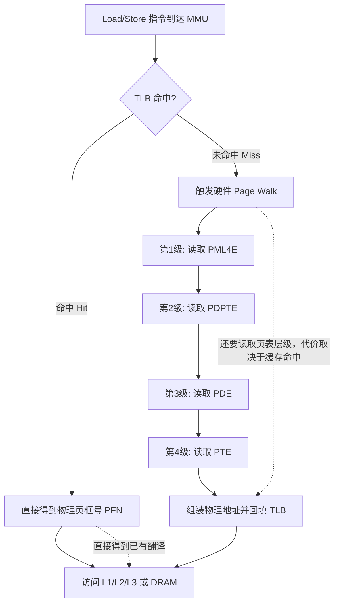
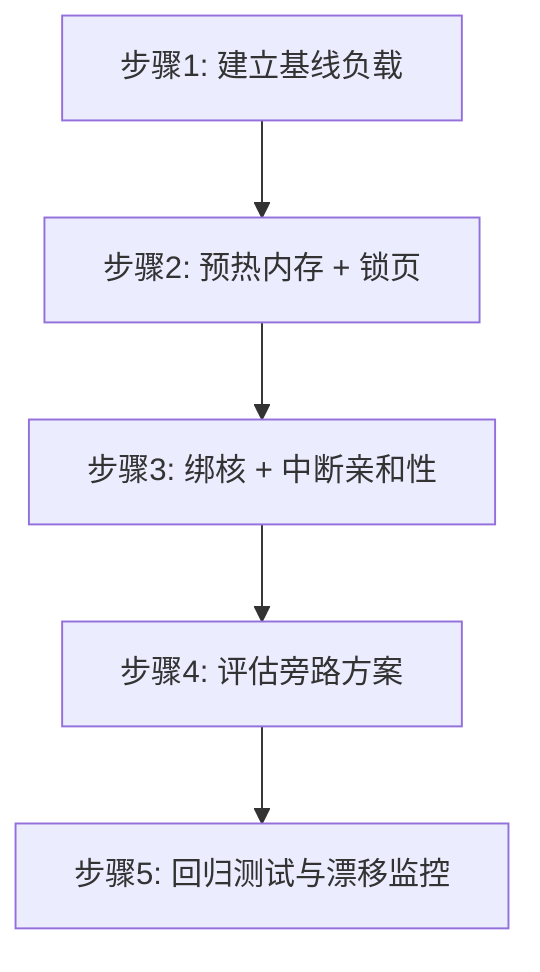

# 操作系统原理 (Operating System Internals)

应用代码并不是独占整台机器运行。操作系统（Operating System，OS）要管理虚拟内存、线程调度、设备中断和 I/O；这些工作可能在业务处理过程中插入缺页、抢占或唤醒。于是同一段代码大多数时候很快，少数时候却突然变慢。少数慢样本形成的长尾称为**尾延迟（tail latency）**，常用 P99/P99.9 等分位数观察。

同一段业务代码在不同内核、不同内存拓扑和不同中断安排下，尾延迟可能明显不同。NUMA（Non-Uniform Memory Access，非一致内存访问）表示多路服务器中，CPU 访问本地节点内存和远端节点内存的代价不同；它会在后文单独展开。这里先记住：算法决定“要做多少工作”，OS 和硬件环境还会决定“这次工作何时得到 CPU、数据是否已经就绪”。

本章采用“理论模型先行，再给工程落地路径”的方式展开。我们先回答三个基础问题：CPU 访问内存时为什么可能突然变慢；一次系统调用为什么可能拉长原本稳定的处理路径；中断为什么会破坏缓存局部性（Locality）并导致连续多个请求抖动。然后基于这些机制，构建一套可以复现实验、可回归验证、能持续演进的操作系统调优闭环。阅读本章后，你应当能把“系统偶发抖动”拆解为可测的硬件事件与内核事件，而不是停留在“机器玄学”层面。

> **面试优先级**：P0 是虚拟内存/缺页、系统调用、线程上下文切换、中断和 CPU 亲和性的因果链；P1 是 TLB、大页、NUMA 和忙轮询；具体 `isolcpus`/`nohz_full` 参数、`mlockall` 权限和旁路产品属于 P2。面试回答应先说清机制，再说“我会用什么指标验证”，不要一上来背内核启动参数。

## 3.1 虚拟内存机制与页面管理 (Virtual Memory and Page Management)

用户程序看到的是虚拟地址（Virtual Address），真正落到 DRAM 上的是物理地址（Physical Address）。两者之间的转换由内存管理单元（Memory Management Unit, MMU）和页表（Page Table）协作完成。这个抽象在吞吐导向系统中非常有效，但在低延迟场景下会暴露出两个根本矛盾：一是地址转换链路本身可能触发高代价的表项遍历；二是“按需分配”会把分配成本延迟到业务执行期。前者体现为 TLB Miss，后者体现为 Page Fault，它们都不是业务代码显式调用出来的，因此更难在常规 profiling 中被第一时间识别。

### 3.1.1 多级页表与 TLB 缓存 (Multi-level Page Tables and TLB)

在 x86_64 的标准 4KB 页模式下，虚拟地址到物理地址的映射需要经过多级页表。CPU 每次执行 Load/Store 指令时，都会先查询转译后备缓冲区（Translation Lookaside Buffer, TLB）。TLB 可以理解为页表映射的热点缓存，命中时地址翻译几乎与流水线并行完成；未命中时会触发硬件 Page Walk，沿页表逐级读取映射。这个过程的关键问题不在于“是否慢”，而在于“是否不可预测”：当热点数据规模逼近或超过 TLB 覆盖范围（TLB Reach）时，系统会突然出现阶段性的翻译抖动。



为了定量理解这个问题，可以用一个简单但非常实用的近似模型。若某级 TLB 有 `N` 个条目、页面大小为 `P`，则该级 TLB 的理论覆盖范围为 `N × P`。当核心数据结构（例如盘口快照、订单索引、风控状态）活跃工作集超过覆盖范围时，TLB Miss 的概率会显著上升，进而触发更多 Page Walk。即使 Page Walk 不访问磁盘，它也会引入额外内存访问与流水线停顿；在延迟预算很紧的路径上，这可能成为重要成本，但仍要用目标机器的 TLB 事件和延迟分布确认。

### 3.1.2 缺页异常与写时复制 (Page Faults and Demand Paging)

很多工程师会把“内存已分配”误解为“物理页已就绪”。实际上，Linux 默认采用按需分页（Demand Paging），`malloc` 或 `mmap` 返回时，内核通常只建立 VMA（Virtual Memory Area）描述，并未真正分配所有物理页。首次读写某页时，如果页表项无效，就会触发缺页异常（Page Fault），CPU 进入内核态，内核完成物理页分配与映射后再返回用户态。这个过程包括异常处理、页框管理、页表更新与 TLB 维护，属于典型的“偶发高延迟路径”。

同样需要警惕的是写时复制（Copy-on-Write, COW）。父子进程通过 `fork` 共享只读页时，看起来内存开销很小；但只要某一方写入，内核就要分配新页并复制原页数据。若这类写入发生在交易时段，会把本来稳定的处理链路打成锯齿形。低延迟系统通常会把 `fork`、大量匿名页写入、动态扩容等行为前置到启动期，并在运行期严格限制。

### 3.1.3 工程实践：预分配与内存锁定 (Pre-faulting and Memory Locking)

如果目标是减少运行期 Page Fault，核心策略是“启动期付费，运行期稳定”：先分配目标内存，再按实际页面大小逐页触达，必要时锁住已确认的工作集，避免关键页被换出。概念比接口更重要；下面的 Rust/Unix 实现和权限配置属于 P2 部署资料。

<details>
<summary><strong>P2 部署资料：预触页与 `mlockall` 的代码边界</strong></summary>

下面给出核心实现，并刻意把 `unsafe` 控制在系统调用边界。它依赖 Cargo 中的 `libc` crate、类 Unix 平台以及足够的锁页权限，因此不是仅靠标准库就能独立编译和运行的片段，mdBook 不执行它。

```rust,ignore
// 代码清单 3.1：内存预热与锁定策略

use libc::{mlockall, MCL_CURRENT, MCL_FUTURE};

pub fn pre_fault_memory(buffer: &mut [u8]) {
    let page_size = 4096usize;
    for i in (0..buffer.len()).step_by(page_size) {
        buffer[i] = 0;
    }
    if !buffer.is_empty() {
        let last = buffer.len() - 1;
        buffer[last] = 0;
    }
}

pub fn lock_process_memory() -> std::io::Result<()> {
    // SAFETY: mlockall 是纯系统调用封装，不会越界访问 Rust 内存。
    // 调用方需要确保进程具备足够权限与 memlock 配额，否则返回错误。
    let rc = unsafe { mlockall(MCL_CURRENT | MCL_FUTURE) };
    if rc != 0 {
        return Err(std::io::Error::last_os_error());
    }
    Ok(())
}
```

这段代码的关键并不是“写了多少字节”，而是“是否至少触达每个页面一次”。4096 只是常见 Linux/x86_64 基础页大小的示例；生产代码应查询当前系统页大小，不能把它当成所有平台保证。末尾再触达最后一个字节，避免非整页缓冲区尾部未被初始化。`mlockall(MCL_CURRENT | MCL_FUTURE)` 成功后锁住当前映射并要求后续映射也锁定，但它不是性能魔法：额度或权限不足时会失败，部署侧必须规划 `RLIMIT_MEMLOCK`、内存上限和失败策略。

</details>

### 3.1.4 大页内存优化 (Hugepages)

大页（Huge Page）优化的本质，是在相同 TLB 条目数下放大覆盖范围，减少地址转换抖动。以 64 个 TLB 条目举例，4KB 页只能覆盖 256KB，而 2MB 页可覆盖 128MB。对于持续扫描大块状态数据的场景（例如多品种盘口聚合和风险向量更新），这类覆盖差异会直接体现为 TLB Miss 曲线的显著下降。

但工程上不应把大页当作“越大越好”。透明大页（Transparent Huge Pages, THP）部署简单，却可能在后台合并和回收时引入不可预测干扰；显式大页（hugetlbfs）可控性更强，但对启动脚本、容量规划、故障恢复提出更高要求。实践中常见策略是：把热数据放在显式大页，把控制面和非关键路径保留在普通页上，这样可以在确定性和运维复杂度之间取得稳定平衡。

## 3.2 系统调用与上下文切换开销 (System Calls and Context Switches)

系统调用（System Call）是用户态访问内核服务的边界。这个边界保障了系统安全与隔离，但也把调用路径拆成了“快路径 + 慢路径”两层结构。对低延迟系统来说，真正危险的是慢路径的偶发触发，因为它会把本来稳定的分布拉出长尾。

一次普通文件 `write` 会继续经过文件对象、VFS（Virtual File System，虚拟文件系统统一接口）、具体文件系统、页缓存、回写、块层与设备，所以它属于 OS/存储系统的完整案例。本节先讲系统调用共性；需要逐层追到 NVMe 和持久化边界时，阅读同一站点系统地基中的[一次文件写入：从 `write()` 到真正落盘](../../ai/systems/file_write_path.html)。

先区分两个经常被混用的动作：

- **特权级/模式切换**：当前线程执行 `read`、`write` 等系统调用后，从用户态进入内核态，完成工作后仍返回同一线程；这不必然更换正在运行的线程。
- **任务上下文切换**：调度器停止线程 A，保存其执行状态，改为运行线程 B。它可能由阻塞、时间片、抢占等触发，但不是每次系统调用都发生。

两者都可能有成本，但原因不同。面试中若说“一次系统调用就是一次上下文切换”，通常会被继续追问；更准确的说法是系统调用至少跨越用户态/内核态边界，若它阻塞或触发调度，才可能再发生任务切换。

### 3.2.1 模式切换的微观代价

一次 `syscall` 不只是指令跳转。它包含特权级切换、寄存器上下文管理、内核路径执行、返回路径恢复，以及潜在的安全缓解开销。更重要的是，内核代码执行会改变当前核心的缓存内容和分支预测状态，导致返回用户态后短时间内出现额外 Cache Miss。对于“每条消息只做几十到几百条指令”的处理链，系统调用引入的微观干扰很容易超过业务本身计算量。


因此，在设计性能评估时，不应只看平均耗时，应优先观察分位点，尤其是 P99/P99.9 的变化趋势。如果某优化让平均值改善，却明显恶化 P99.9，通常不适用于尾延迟敏感的交易链路。

### 3.2.2 锁的范式：Mutex vs Spinlock

同步原语的选择，本质上是在“CPU 占用”和“调度干扰”之间做权衡。`std::sync::Mutex` 无竞争时很高效，但竞争后可能进入 `futex` 慢路径，线程睡眠与唤醒会触发调度器决策；自旋锁（Spinlock）完全在用户态轮询，不进入内核，适合极短临界区。对于低延迟热路径，常见的工程结论并不是“永远不用 Mutex”，而是“把可能睡眠的同步原语从热路径移除”，让其只出现在后台配置、监控上报、批量落盘等非关键路径。

## 3.3 中断处理与 CPU 亲和性 (Interrupts and CPU Affinity)

中断（Interrupt）并非错误机制，而是操作系统响应外部事件的基础能力。问题在于，中断会打断当前执行流，且触发时机通常由硬件决定而不是业务决定。对低延迟线程而言，这意味着“即使业务代码稳定，也可能被外部事件强行插入抖动”。

### 3.3.1 从 HardIRQ 到 SoftIRQ：为什么会连锁抖动

网卡收包后，CPU 先处理硬中断（HardIRQ），再把大部分工作交给软中断（SoftIRQ）或 NAPI 轮询机制。这种设计能提升整体吞吐，但会形成突发批处理：某个时间窗口内大量软中断占用 CPU，用户线程只能等待。若交易线程与中断线程共享核心，就会同时遭遇时间片挤压和缓存污染，恢复后又需要一段“重新热身”周期，表现为连续若干请求的延迟上浮，而不是单点抖动。


上图展示的是标准 Linux 网络路径。每个阶段都合理，但它们叠加在一起，会把“事件到达时间”与“线程可运行时间”解耦。低延迟工程的核心就是尽可能减少这两个时间轴之间的随机偏移。

### 3.3.2 CPU 隔离与中断亲和性

> **P2 部署细节**：下面的内核启动参数用于说明“绑核为什么还不够”。普通面试先会回答：affinity 只限制业务线程能去哪，并不会自动赶走 IRQ、内核线程和同一物理核上的 SMT sibling；真实部署必须用 trace 验证。

<details>
<summary><strong>P2 部署资料：启动参数与 Rust 绑核接口</strong></summary>

CPU 隔离（CPU Isolation）并不神秘，它只是把“谁可以在这个核心运行”这件事显式化。常见做法是通过启动参数 `isolcpus`、`nohz_full`、`rcu_nocbs` 预留核心，再把业务线程绑核到这些核心，并把网卡、磁盘等设备中断绑到其他核心。这样做的收益不只是减少抢占次数，更重要的是维持缓存工作集稳定，降低迁核与失效带来的二次抖动。

在 Rust 代码侧，绑核通常在启动阶段完成。下面代码给出一个最小封装，用于把当前线程固定到指定 CPU。它依赖 Cargo 中的 `libc` crate 和 Linux 的 `sched_setaffinity` 接口，且真实效果必须和内核参数、中断绑定策略一起评估；因此 mdBook 不把它当作跨平台、标准库独立示例执行。

```rust,ignore
// 代码清单 3.2：将当前线程绑定到指定 CPU

use libc::{cpu_set_t, sched_setaffinity, CPU_SET, CPU_ZERO};
use std::io;

pub fn pin_current_thread(cpu_id: usize) -> io::Result<()> {
    let mut set = unsafe { std::mem::zeroed::<cpu_set_t>() };
    // SAFETY: set 指向有效的 cpu_set_t，CPU_ZERO/CPU_SET 只在该结构上写入位图。
    unsafe {
        CPU_ZERO(&mut set);
        CPU_SET(cpu_id, &mut set);
    }

    // SAFETY: pid=0 表示当前线程，set 的地址与长度均正确。
    let rc = unsafe { sched_setaffinity(0, std::mem::size_of::<cpu_set_t>(), &set) };
    if rc != 0 {
        return Err(io::Error::last_os_error());
    }
    Ok(())
}
```

</details>

### 3.3.3 内核旁路 (Kernel Bypass) 的边界条件

如果应用仍通过 `read/recv/epoll` 走标准内核网络栈，系统调用、中断、协议栈调度的影响始终存在。进一步降低抖动时，通常会评估 AF_XDP、DPDK 或 Onload 等内核旁路方案。它们并非只是在“更快网卡收包”，更关键的是把数据路径控制权交回用户态，减少上下文切换和不确定调度点。

但是否采用旁路，不应由“峰值性能”单点决定，而应由端到端预算决定。若策略计算本身已占据主要时间，旁路带来的收益可能有限，反而增加部署、排障、升级复杂度。教材中的建议是：先做可量化分解，确认内核路径确为主要瓶颈，再推进旁路改造。

## 3.4 从理论到工程：一套可回归的调优流程

低延迟优化最怕“经验驱动、一次性调参、不可复现”。真正可维护的方法是把调优流程标准化。推荐的顺序是：先建立基线测试，固定负载与输入；再执行内存前置化（预热 + 锁页）；接着做 CPU 与中断隔离；最后才评估内核旁路。每一步都要保留同一组分位点指标，并记录内核事件计数变化。这样当业务版本、驱动版本、内核版本变化时，团队可以快速定位“是哪一层开始恶化”。



在指标侧，至少需要同时观察三组数据。第一组是内存与地址转换事件，例如 minor/major fault 与 TLB 相关计数，用于判断页表与页面策略是否稳定。第二组是调度事件，例如上下文切换和迁核次数，用于判断线程是否被干扰。第三组是中断分布，用于判断隔离策略是否被设备流量击穿。把这三组数据和 P99、P99.9 对齐分析，才能建立“因果关系”，而不是只看到“结果变化”。

下面这张对照表给出一个在章节教学中可复用的“指标-动作-预期变化”图表模板。它的作用不是替代基准测试，而是帮助读者先建立因果假设，再用实验数据验证假设是否成立。

| 优化动作 | 重点观察指标 | 预期变化方向 | 若结果不符合预期，优先排查 |
|---|---|---|---|
| 预热内存 + `mlockall` | major/minor fault、P99 | Page Fault 明显下降，P99 收敛 | memlock 限额、是否覆盖全部热内存 |
| 线程绑核 + CPU 隔离 | 迁核次数、上下文切换、P99.9 | 迁核与切换下降，尾延迟变窄 | 中断是否仍打到隔离核、线程池是否越界调度 |
| 中断亲和性调整 | 每核 IRQ/SoftIRQ 分布、P99 | 核间负载更均衡，业务核抖动减小 | 网卡多队列映射、RPS/RFS 配置冲突 |
| 评估 AF_XDP/DPDK | 系统调用次数、端到端时延 | syscall 比例下降，时延中位与尾部同时改善 | 用户态轮询策略、NUMA 跨节点访问 |

## 3.5 本章小结

本章的核心结论是：操作系统造成的抖动并非单一来源，而是虚拟内存、系统调用、调度器和中断子系统共同作用的结果。只在某一个点上“极限优化”通常无法稳定改善尾延迟，必须把内存策略、线程拓扑、中断拓扑和 I/O 路径作为整体设计。换言之，低延迟系统并不是“把代码写快”，而是“把执行环境变得可预测”。下一章将进入 [并发模型与无锁编程](../infrastructure/lock_free.md)，讨论在既定 OS 约束下，如何利用原子语义与无锁结构构建稳定的数据通路。
