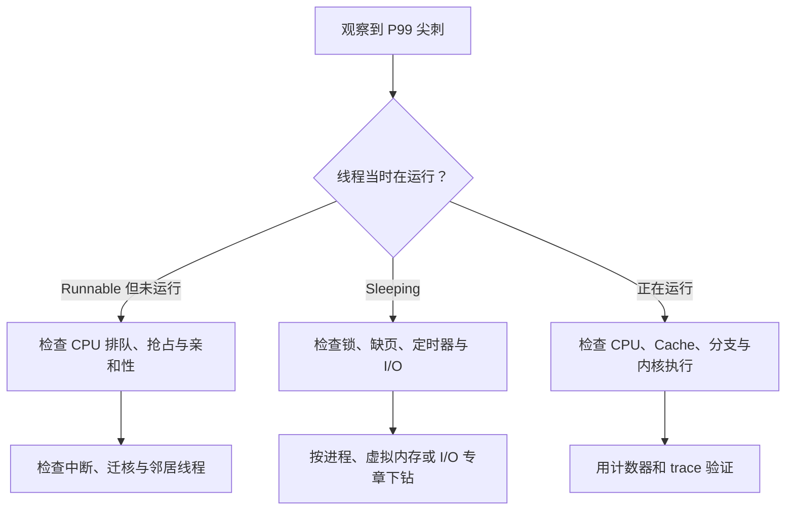

# 操作系统原理：从系统地图理解延迟抖动

> **面试优先级：P0。** 本章负责建立操作系统地图：线程为什么没有运行、系统调用为什么会变慢、中断怎样打断关键线程，以及怎样用证据定位尾延迟。进程、虚拟内存和文件写入已有专章，本章只说明它们在整张地图中的位置，不再讲第二套细节。

应用代码不会独占整台机器。Linux 内核还要调度其他线程、处理缺页、响应设备中断并推进 I/O。即使业务代码每次执行相同指令，这些外部事件也可能在不同时间插入等待，使少量请求明显慢于大多数请求。

**尾延迟（tail latency）**表示延迟分布中较慢的尾部，常用 P99 或 P99.9 描述。例如 P99 为 200 微秒，表示约 99% 的请求不超过 200 微秒，仍有约 1% 更慢。HFT 和实时服务往往更关心尾部，因为少数迟到事件也可能错过市场机会或超时预算。

## 1. 先用四个问题定位操作系统层

遇到“程序偶尔抖一下”时，先问：

1. **线程当时在运行吗？** 它可能正在 CPU 上执行，也可能处于可运行状态却在排队。
2. **线程在等什么？** 常见对象是锁、缺页、定时器、网络或存储 I/O。
3. **CPU 被谁打断？** 设备中断、内核线程或更高优先级任务都可能插入工作。
4. **完成点定义对吗？** `write` 返回、网络发送和设备持久化分别有不同语义。



这张图的意义是先确定等待发生在哪一层，再选择工具。直接调整内核参数无法代替定位。

## 2. 进程、线程和系统调用在地图中的位置

进程是地址空间、文件描述符和权限等资源的边界；线程是能被调度到逻辑 CPU 上执行的指令流。它们的创建、继承和回收由[进程、线程与文件描述符](processes_fds.md)主讲。

线程需要文件、网络或定时器服务时，会通过**系统调用**从用户态进入内核态。这里先保留一个关键区别：

- **权限态切换**：同一个线程从用户态进入内核态，再返回用户态。
- **任务上下文切换**：调度器停止线程 A，改为运行线程 B。

快速系统调用可以只发生权限态切换。如果调用等待 I/O、锁或内存，线程会睡眠，此时才更可能发生任务切换。面试中说“系统调用一定导致上下文切换”是不准确的。

## 3. 调度：Runnable 不等于正在运行

**调度器**负责在可运行线程之间分配逻辑 CPU。一个线程处于 Runnable 状态，表示它已经具备运行条件，但仍可能在运行队列中等待；只有 Running 状态才表示它此刻占用某个逻辑 CPU。

调度会产生几类低延迟成本：

- **排队**：可运行线程多于可用逻辑 CPU，关键线程要等待。
- **抢占**：当前线程尚未完成，调度器改为运行另一个线程。
- **迁核**：线程换到另一个逻辑 CPU，原核心附近的 Cache 状态不能完整带走。
- **唤醒延迟**：I/O 已经完成，但线程从唤醒到真正获得 CPU 仍需要时间。

**CPU 亲和性（CPU affinity）**限制线程可以在哪些逻辑 CPU 上运行。固定关键线程的位置可能减少迁核并保持 Cache 局部性；如果绑定方案让某个核心过载，结果反而更差。亲和性必须和运行队列长度、迁核、Cache 事件以及端到端延迟一起验证。

多插槽服务器还可能存在 **NUMA（Non-Uniform Memory Access，非一致内存访问）**。某个 CPU 访问本地内存通常比跨节点访问更近；因此线程位置、内存首次分配位置和设备位置要一起考虑。NUMA 的效果依硬件和负载而异，不能背一个固定延迟倍数。

## 4. 中断：设备为什么能打断业务线程

**中断（interrupt）**是硬件通知 CPU“某个事件需要处理”的机制。网卡收到数据或存储请求完成后，可以触发中断；CPU 暂停当前执行流，进入内核处理必要工作，然后再恢复。

Linux 通常把设备事件处理拆成两部分：

- 硬中断阶段尽快确认设备并记录待处理工作；
- 后续内核阶段批量完成协议栈、队列和唤醒等较重工作。

这种设计提高整体吞吐，却可能让一批网络事件集中占用某个核心。如果关键线程与大量设备中断共享核心，它会同时遭遇执行时间被占用和 Cache 被替换，恢复后还需要重新加载工作集。

```text
设备事件
  → 硬件中断
  → 内核确认并安排后续处理
  → 网络栈或块层推进完成
  → 唤醒等待线程
  → 调度器让线程真正运行
```

高速数据路径有时使用轮询：线程反复检查队列是否有新完成，减少中断和唤醒的随机性。代价是即使没有事件也会占用 CPU。中断和轮询是在 CPU 成本、功耗、吞吐和可预测性之间取舍，不是简单的“轮询总是更快”。

## 5. 虚拟内存：缺页为什么会插入慢路径

CPU 访问内存时要把虚拟地址翻译成物理地址。地址翻译缓存没有命中，或页面尚未准备好时，访问会增加额外工作；文件页不在内存时还可能等待存储。

VMA、页表、TLB、缺页、COW、回收和 OOM 的完整定义见[虚拟内存](virtual_memory.md)。在操作系统地图中只需记住：

- TLB miss 可能只需硬件遍历页表，不一定进入内核；
- page fault 会进入内核，但按需分配造成的 fault 不一定是程序错误；
- 内存回收可能把 CPU、内存问题转化为文件写回和存储 I/O；
- 首次触碰大量页面或工作集被挤出，会让少数请求出现明显长尾。

低延迟程序常把确定的内存分配和预热移到启动阶段。是否锁页、使用大页或调整 NUMA 策略属于工程选择，必须先确认 fault 或地址翻译确实是瓶颈。

## 6. I/O：提交、完成和持久化不是同一时刻

文件和网络操作通常经过内核队列与设备队列。线程把工作提交给内核后，可以同步等待，也可以在完成前去做其他工作；无论采用哪种方式，设备和协议的工作量仍然存在。

一次本地普通文件 `write` 怎样经过页缓存、回写、文件系统、块层、DMA 和存储设备，以及 `fsync` 为什么还要同步目录，统一由[一次文件写入](file_write_path.md)主讲。本章只保留排障原则：

- 先说清接口承诺的完成点，再解释延迟；
- 队列能吸收短暂突发，却会在持续过载时积累等待；
- 平均设备利用率不高，仍可能存在单队列拥塞、小请求固定成本或周期性 Flush；
- 异步 I/O 改变等待位置，不会让过载消失。

## 7. 锁、睡眠与忙等怎样选择

多个线程访问共享状态时，需要同步。若互斥锁竞争，等待线程可能进入内核睡眠，释放 CPU 给其他线程；锁可用后，它还要被唤醒并重新获得 CPU。自旋等待则让线程在用户态反复检查条件，避免睡眠和唤醒，却持续占用逻辑 CPU。

选择取决于等待时间和系统负载：

- 临界区很短、核心专用且线程不能被抢占时，自旋可能减少调度抖动；
- 等待可能较长或 CPU 紧张时，睡眠更节省资源；
- 若持锁线程被抢占，自旋线程只能浪费 CPU 等它恢复；
- 最优设计常常不是更换锁，而是减少共享可变状态或重新划分所有权。

并发正确性和无锁结构由[并发模型](concurrency.md)及[无锁编程](../infrastructure/lock_free.md)主讲。面试先说明为什么等待，再谈具体原语。

## 8. 一套可回归的定位流程

低延迟调优要让每个动作都能被复现和撤销：

1. **定义工作负载**：输入、并发、缓存冷热和持续时间保持一致。
2. **记录基线**：同时保存 P50、P99、P99.9 和吞吐，不只看平均值。
3. **按时间对齐事件**：把延迟尖刺与调度、缺页、中断、锁和 I/O 事件放到同一时间轴。
4. **一次只改一个主要变量**：例如线程位置、内存预热或中断分布。
5. **做对照和回滚**：效果不能稳定复现，就不能称为根因。

| 怀疑的层次 | 先看什么 | 证据支持时再做什么 |
|---|---|---|
| CPU 排队或迁核 | Runnable 时间、上下文切换、迁核 | 调整线程数或亲和性并复测 |
| 内存缺页或回收 | minor/major fault、回收、swap、内存压力 | 预热工作集或调整容量 |
| 中断干扰 | 每核中断分布、内核后续处理时间、业务尖刺 | 调整队列和中断亲和性 |
| 锁竞争 | 阻塞栈、持锁时间、唤醒延迟 | 缩短临界区或重构所有权 |
| 文件或设备 I/O | `write/fsync` 时间、回写和设备队列 | 调整批量、完成协议或容量 |

工具输出只是一条证据。例如上下文切换数增加，可能是根因，也可能是请求量增加的正常结果；必须用相同工作负载和端到端延迟做对照。

Linux 可以用 CPU 集合、调度亲和性和中断亲和性减少关键核心上的后台工作。具体配置随内核、发行版和硬件变化；基础面试只需说明业务线程、同物理核的硬件线程、中断和内核线程都要纳入拓扑，不需要背启动参数。

## 9. 30 秒面试答案

> 操作系统会让同一段业务代码出现尾延迟，因为线程不一定一直在 CPU 上运行。它可能处于 Runnable 状态等待调度，也可能因锁、缺页或 I/O 睡眠；设备中断和内核后台工作还会打断关键核心。系统调用只表示同一线程跨越用户态和内核态，若没有阻塞或抢占，不必然发生任务上下文切换。我会先把尖刺与调度、fault、中断、锁和 I/O 事件按时间对齐，再用单变量实验验证亲和性、预热或批量策略，而不是先背内核参数。

## 10. 自测与小结

1. Runnable 和 Running 有什么区别？
2. 为什么系统调用不一定导致任务上下文切换？
3. 网卡中断和关键线程共享核心时，可能造成哪两类成本？
4. 为什么异步 I/O 没有消除设备延迟和排队？
5. 自旋锁在哪些前提不成立时可能比睡眠等待更差？
6. 设计一次线程绑核实验时，必须固定和记录哪些变量？

本章的核心不是某个调优开关，而是一张因果地图：调度决定线程何时获得 CPU，虚拟内存决定地址何时可用，中断和 I/O 决定外部事件何时插入。先定位时间消耗在哪一层，再进入对应专章，才能把“偶发抖动”变成可验证的问题。
